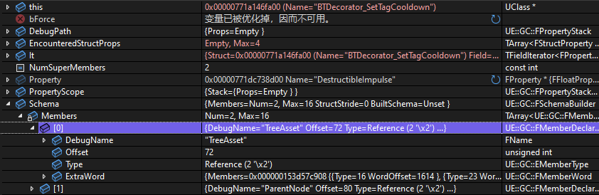
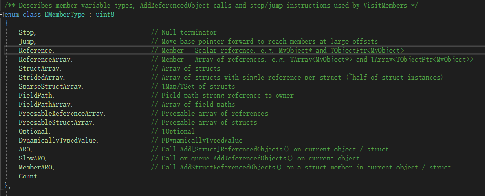
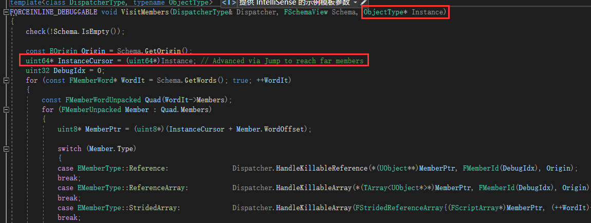

# GC

## 创建一个新的 UObject

在 `UObject` 的基类是 `UObjectBaseUtility`， `UObjectBaseUtility` 的基类是 `UObjectBase`

`UObjectBase` 的构造函数中就做了一个事情 `AddObject`，最终会将该对象添加到 `GUObjectArray`

```cpp
void UObjectBase::AddObject(FName InName, EInternalObjectFlags InSetInternalFlags, int32 InInternalIndex, int32 InSerialNumber)
{
	NamePrivate = InName;
	EInternalObjectFlags InternalFlagsToSet = InSetInternalFlags;
    
    // 设置 Tag ... do something ...

	GUObjectArray.AllocateUObjectIndex(this, InternalFlagsToSet, InInternalIndex, InSerialNumber);
	check(InName != NAME_None && InternalIndex >= 0);
	HashObject(this);
	check(IsValidLowLevel());
}
```

`GUObjectArray` 是一个全局唯一的 `FUObjectArray`，也就是说所有创建的 `UObject` 对象都会保存在这个数组里面


在 `StaticAllocateObject` 全局函数中

首先通过全局的 `GUObjectAllocator` 分配内存

```cpp
int32 Alignment	= FMath::Max( 4, InClass->GetMinAlignment() );
Obj = (UObject *)GUObjectAllocator.AllocateUObject(TotalSize,Alignment,GIsInitialLoad);
```

然后通过 `placement new` 对内存区域进行构造函数

```cpp
if (!bSubObject)
{
	FMemory::Memzero((void *)Obj, TotalSize);
	new ((void *)Obj) UObjectBase(const_cast<UClass*>(InClass), InFlags|RF_NeedInitialization, InternalSetFlags, InOuter, InName, OldIndex, OldSerialNumber);
}
```

在构造函数中，将该对象设置到 `GUObjectArray` 中

## GC

明牌 UE 的 GC 机制是 **标记-清除** 算法

1. 加锁，保持所有对象的引用关系不变
2. 标记所有的 `UObject` 为 **不可达**
3. 遍历根对象列表 `GUObjectArray`，跟对象引用到的对象去除 **不可达** 标记
4. 收集所有仍然标记为 **不可达** 的对象，全部删除

```cpp
void CollectGarbage(EObjectFlags KeepFlags, bool bPerformFullPurge)
{
	if (GIsInitialLoad)
	{
		UE_LOG(LogGarbage, Log, TEXT("Skipping CollectGarbage() call during initial load. It's not safe."));
		return;
	}
	AcquireGCLock();
	UE::GC::CollectGarbageInternal(KeepFlags, bPerformFullPurge);
}

FORCEINLINE void CollectGarbageInternal(EObjectFlags KeepFlags, bool bPerformFullPurge)
{
	const double StartTime = FPlatformTime::Seconds();

	if (bPerformFullPurge)
	{
		CollectGarbageFull(KeepFlags);
	}
	else
	{
		CollectGarbageIncremental(KeepFlags);
	}

	GTimingInfo.LastGCDuration = FPlatformTime::Seconds() - StartTime;

	CSV_CUSTOM_STAT(GC, Count, 1, ECsvCustomStatOp::Accumulate);
}
```

### AcquireGCLock

通过 `AcquireGCLock` 加锁，暂停其他线程对 UOBject 对象的引用关系产生影响

```cpp
void AcquireGCLock()
{
	// 信息收集
	FGCCSyncObject::Get().GCLock();
	// 输出 GC 所用时间
}
```

本质就是在执行 `FGCCSyncObject` 的 `GCLock` 函数

首先将 `GCWantsToRunCounter` 值加 1，表示想要进行 GC 操作

> 在 `IsGarbageCollectionWaiting` 全局函数中返回 `GCWantsToRunCounter` 是否不为 0。该函数在 `AsyncLoading` 中被使用

随后就是让当前线程 `Sleep`，直到 `AsyncCounter` 值归零

`AsyncCounter` 值用于表示其他线程是否有阻塞GC的操作还在执行，当 `AsyncCounter` 归零表示可以执行 GC，此时顺便清空 `GCWantsToRunCounter` 的值

让 `GCCounter` 自增，表示当前正在执行 GC 操作，会在 `GCUnlock()` 函数中自减

使用 `IsGCLocked()` 可以通关判断 `GCCounter` 的值是否不为零来判断是否正在执行 GC 操作

```cpp
void GCLock()
{
	// GCWantsToRunCounter 值加 1
	SetGCIsWaiting();

	bool bLocked = false;
	do
	{
		// Sleep 线程，直到 AsyncCounter 值归零
		FPlatformProcess::ConditionalSleep([&]()
		{
			return AsyncCounter.GetValue() == 0;
		});
		{
			FScopeLock CriticalLock(&Critical);
			if (AsyncCounter.GetValue() == 0)
			{
				GCUnlockedEvent->Reset();
				int32 GCCounterValue = GCCounter.Increment();
				FPlatformMisc::MemoryBarrier();
				ResetGCIsWaiting();		// 重置 GCWantsToRunCounter 值为 0
				bLocked = true;
			}
		}
	} while (!bLocked);
}
```

当上述流程执行完毕之后，就可以开始 GC 操作了

### CollectGarbageInternal

```cpp
FORCEINLINE void CollectGarbageInternal(EObjectFlags KeepFlags, bool bPerformFullPurge)
{
	const double StartTime = FPlatformTime::Seconds();

	if (bPerformFullPurge)
	{
		CollectGarbageFull(KeepFlags);
	}
	else
	{
		CollectGarbageIncremental(KeepFlags);
	}

	GTimingInfo.LastGCDuration = FPlatformTime::Seconds() - StartTime;

	CSV_CUSTOM_STAT(GC, Count, 1, ECsvCustomStatOp::Accumulate);
}
```

根据 `bPerformFullPurge` 判断是否需要全量垃圾回收，全量回收执行 `CollectGarbageFull`，增量回收执行 `CollectGarbageIncremental`

```cpp
FORCENOINLINE static void CollectGarbageFull(EObjectFlags KeepFlags)
{
	// 信息收集
	CollectGarbageImpl<true>(KeepFlags);
}

FORCENOINLINE static void CollectGarbageIncremental(EObjectFlags KeepFlags)
{
	// 信息收集
	CollectGarbageImpl<false>(KeepFlags);
}

template<bool bPerformFullPurge>
void CollectGarbageImpl(EObjectFlags KeepFlags)
{ // ...
}
```

通过 `template` 的方式，生成两个 `CollectGarbageImpl` 模板函数，减少判断 if-else

### CollectGarbageImpl

#### 可达性分析

标记所有可达对象，使用根集递归遍历

```cpp
FRealtimeGC GC;
{
	// 信息收集
	GC.PerformReachabilityAnalysis(KeepFlags, Options);
	// 日志打印
}

// 二次分析 一般用于调试 检测非法引用（仅调试模式启用）
if (GC.Stats.bFoundGarbageRef && GGarbageReferenceTrackingEnabled > 0)
{
	// 信息收集
	GC.PerformReachabilityAnalysis(KeepFlags, Options);
	// 日志打印
}
```

`FRealtimeGC::PerformReachabilityAnalysis` 函数分为两个阶段，一个是标记，一个可达性分析

##### 标记

在开始之前，先把 `GGCObjectReferencer` 内容添加到 `InitialObjects` 数组中

> `GGCObjectReferencer` 存储的就是继承自 `FGCObject` 的非 `UObject` 对象

```cpp
if (FPlatformProperties::RequiresCookedData() && GUObjectArray.IsDisregardForGC(FGCObject::GGCObjectReferencer))
{
	InitialObjects.Add(FGCObject::GGCObjectReferencer);
}
```

```cpp
const EGCOptions OptionsForMarkPhase = Options & ~EGCOptions::WithPendingKill;
(this->*MarkObjectsFunctions[GetGCFunctionIndex(OptionsForMarkPhase)])(KeepFlags);
```

上述是标记代码，使用 `MarkObjectsFunctions` 函数指针，该函数指针初始在构造函数中

```cpp
typedef void(FRealtimeGC::*MarkObjectsFn)(EObjectFlags);
MarkObjectsFn MarkObjectsFunctions[4];

FRealtimeGC()
{
	MarkObjectsFunctions[GetGCFunctionIndex(EGCOptions::None)] = &FRealtimeGC::MarkObjectsAsUnreachable<false>;
	MarkObjectsFunctions[GetGCFunctionIndex(EGCOptions::Parallel | EGCOptions::None)] = &FRealtimeGC::MarkObjectsAsUnreachable<true>;

	// do something else ...
}
```

所以，本质上是执行 `FRealtimeGC::MarkObjectsAsUnreachable` 函数，只是根据是否多线程来选择数组中的执行函数罢了

```cpp
TArray<TArray<UObject*>, TInlineAllocator<32>> ObjectsToSerializeArrays;
ObjectsToSerializeArrays.SetNum(NumThreads);

ParallelFor( TEXT("GC.MarkUnreachable"),NumThreads,1,
	[&ObjectsToSerializeArrays, &ClustersToDissolveList, &KeepClusterRefsList,
		KeepFlags, NumberOfObjectsPerThread, NumThreads, MaxNumberOfObjects, bIsRerun = Stats.bFoundGarbageRef] (int32 ThreadIndex)
		{}, !bParallel ? EParallelForFlags::ForceSingleThread : EParallelForFlags::None);
```

- `NumThreads` 是可以运行的线程数量
- `ObjectsToSerializeArrays` 用于存储各个线程计算出来的 `UObject*`

通过 `ParallelFor` 启动多个线程，通过 `ThreadIndex` 来分块计算 `GUObjectArray` 中的 `UObject*`

```cpp
int32 FirstObjectIndex = ThreadIndex * NumberOfObjectsPerThread + GUObjectArray.GetFirstGCIndex();
int32 NumObjects = (ThreadIndex < (NumThreads - 1)) ? NumberOfObjectsPerThread : (MaxNumberOfObjects - (NumThreads - 1) * NumberOfObjectsPerThread);
int32 LastObjectIndex = FMath::Min(GUObjectArray.GetObjectArrayNum() - 1, FirstObjectIndex + NumObjects - 1);

for (int32 ObjectIndex = FirstObjectIndex; ObjectIndex <= LastObjectIndex; ++ObjectIndex)
{}
```

那么对一个 `UObject` 进行进行标记的真正部分就在循环体中，通过 `ObjectIndex` 可以直接从 `GUObjectArray` 获取对应的 `UObject`

```cpp
FUObjectItem* ObjectItem = &GUObjectArray.GetObjectItemArrayUnsafe()[ObjectIndex];
UObject* Object = (UObject*)ObjectItem->Object;
```

得到 `UObject` 第一步就是清除可达性标记

```cpp
ObjectItem->ClearFlags(EInternalObjectFlags::ReachableInCluster);
```

- 如果 `UObject` 是一个根对象，直接加入到 `LocalObjectsToSerialize`，如果它属于 **簇** 或者 **簇根** ，也加入到 `KeepClusterRefsList` 
- 如果 `UObject` 是一个簇对象，并且有 `FastKeepFlags` 也加入到 `LocalObjectsToSerialize` 和 `KeepClusterRefsList`

> `FastKeepFlags = EInternalObjectFlags::GarbageCollectionKeepFlags`

如果 `UObject` 是 **普通对象** 或者 **簇根** 

```cpp
if (ObjectItem->HasAnyFlags(FastKeepFlags))
{
	bMarkAsUnreachable = false;
}
else if (!ObjectItem->IsPendingKill() && KeepFlags != RF_NoFlags && Object->HasAnyFlags(KeepFlags))
{
	bMarkAsUnreachable = false;
}
```

符合上述条件，就不会被标记为 **不可达**

如果是 `ClusterRoot` 也就是 **簇根** 对象，它是 `PendingKill` 或者 `Garbage`，那么这个簇应该被解散，会被加入到 `ClustersToDissolveList` 数组

> 手动销毁对象时，会给它添加 PendingKill 的标签

```cpp
PRAGMA_DISABLE_DEPRECATION_WARNINGS
else if (ObjectItem->HasAnyFlags(EInternalObjectFlags::PendingKill | EInternalObjectFlags::Garbage) && ObjectItem->HasAnyFlags(EInternalObjectFlags::ClusterRoot))
PRAGMA_ENABLE_DEPRECATION_WARNINGS
{
	ClustersToDissolveList.Push(ObjectItem);
}
```

不可达的对象会被加入到打上不可达的标记，其他会加入到 `LocalObjectsToSerialize` 和 `KeepClusterRefsList` 数组中

```cpp
if (!bMarkAsUnreachable)
{
	LocalObjectsToSerialize.Add(Object);
	if (ObjectItem->HasAnyFlags(EInternalObjectFlags::ClusterRoot))
		KeepClusterRefsList.Push(ObjectItem);
}
else
{
	ObjectItem->SetFlags(EInternalObjectFlags::Unreachable);
}
```

前情提要，`LocalObjectsToSerialize` 是 `ObjectsToSerializeArrays` 通过 `ThreadIndex` 得到的

每个线程将自己计算的内容存储到对应的数组中，通过引用的方式存储到 `ObjectsToSerializeArrays` 中

```cpp
TArray<UObject*>& LocalObjectsToSerialize = ObjectsToSerializeArrays[ThreadIndex];
```

由于 `ObjectsToSerializeArrays` 是一个 二维数组 `TArray<TArray<UObject*>, TInlineAllocator<32>>`，需要将其转换成 一维数组 然后进行后续计算，这个 一维数组 就是 `InitialObjects`

```cpp
InitialObjects.Reserve(InitialObjects.Num() + NumTotal + UE::GC::ObjectLookahead);
for (TArray<UObject*>& Objects : ObjectsToSerializeArrays)
{
	InitialObjects.Append(Objects);
}

ObjectsToSerializeArrays.Empty();
```

将所有的 `ClustersToDissolveList` 中所有的对象，也就是不可达的 **簇根** 对象，将该簇中所有的对象标记为不可达

```cpp
TArray<FUObjectItem*> ClustersToDissolve;
ClustersToDissolveList.PopAll(ClustersToDissolve);
for (FUObjectItem* ObjectItem : ClustersToDissolve)
{
	if (ObjectItem->HasAnyFlags(EInternalObjectFlags::ClusterRoot))
	{
		GUObjectClusters.DissolveClusterAndMarkObjectsAsUnreachable(ObjectItem);
		GUObjectClusters.SetClustersNeedDissolving();
	}
}
```

针对 `KeepClusterRefsList` 列表，该列表存储簇对象

遍历 `KeepClusterRefsList` 列表对象，如果对象可达，但是对象对应簇的根对象是不可达的，需要 **复活** 整个簇

顺便通过 `MarkReferencedClustersAsReachable` 通过遍历，将所有与该**簇**相关的**簇**都保留下来，存储到 `InitialObjects` 中

##### 引用关系分析

根据 [UClass文档](../../UClass/README.md) 中对 `UClass` 的介绍，可以发现在编译代码之前就以及将对象信息收集完毕，包括属性的名称、类型、内存偏移等信息

当得到一个 `UObject` 的时候，通过其 `UClass` 可以计算各个属性的内存偏移，计算对象的引用关系也可以通过这种方式进行处理

```cpp
FContextPoolScope Pool;
FWorkerContext* Context = Pool.AllocateFromPool();
Context->InitialNativeReferences = GetInitialReferences(Options);
Context->SetInitialObjectsUnpadded(InitialObjects);

// 分析 InitialObjects 数组内的对象,它能达到的对象,去掉不可达标签
PerformReachabilityAnalysisOnObjects(Context, Options);
```

是的， `ReachabilityAnalysisFunctions` 又是函数指针，根据不同的 `EGCOptions` 选择不同的模板函数

```cpp
virtual void PerformReachabilityAnalysisOnObjects(FWorkerContext* Context, EGCOptions Options) override
{
	(this->*ReachabilityAnalysisFunctions[GetGCFunctionIndex(Options)])(*Context);
}

typedef void(FRealtimeGC::*ReachabilityAnalysisFn)(FWorkerContext&);
ReachabilityAnalysisFn ReachabilityAnalysisFunctions[8];

ReachabilityAnalysisFunctions[GetGCFunctionIndex(EGCOptions::None)] = &FRealtimeGC::PerformReachabilityAnalysisOnObjectsInternal<EGCOptions::None | EGCOptions::None>;
ReachabilityAnalysisFunctions[GetGCFunctionIndex(EGCOptions::Parallel | EGCOptions::None)] = &FRealtimeGC::PerformReachabilityAnalysisOnObjectsInternal<EGCOptions::Parallel | EGCOptions::None>;

ReachabilityAnalysisFunctions[GetGCFunctionIndex(EGCOptions::None | EGCOptions::WithPendingKill)] = &FRealtimeGC::PerformReachabilityAnalysisOnObjectsInternal<EGCOptions::None | EGCOptions::WithPendingKill>;
ReachabilityAnalysisFunctions[GetGCFunctionIndex(EGCOptions::Parallel | EGCOptions::WithPendingKill)] = &FRealtimeGC::PerformReachabilityAnalysisOnObjectsInternal<EGCOptions::Parallel | EGCOptions::WithPendingKill>;
```

无论如何，最后调用的是 `TFastReferenceCollector::ProcessObjectArray`

在 `ProcessObjectArray` 中通过 `ProcessObjects` 处理对象，并且生成 Token 用于 GC 处理

在 `ProcessObjects` 函数中，遍历 `CurrentObjects` 所有的对象

1. 获取当前类的 `Class` 和 `Other`

```cpp
UObject* CurrentObject = It.GetCurrentObject();
UClass* Class = CurrentObject->GetClass();
UObject* Outer = CurrentObject->GetOuter();
```

2. 通过 `Class->AssembleReferenceTokenStream()` 计算当前类的 Token 信息，用于简化对象占用内存，提高实时 GC 效率

```cpp
if (!!(Options & EGCOptions::AutogenerateSchemas) && !Class->HasAnyClassFlags(CLASS_TokenStreamAssembled))
{			
	Class->AssembleReferenceTokenStream();
}
```

3. 处理 `Class` 和 `Other` 的引用

```cpp
FSchemaView Schema = Class->ReferenceSchema.Get();
// 设置当前 Context 中当前处理对象是 CurrentObject
Dispatcher.Context.ReferencingObject = CurrentObject;

Dispatcher.HandleImmutableReference(Class, EMemberlessId::Class, EOrigin::Other);
Dispatcher.HandleImmutableReference(Outer, EMemberlessId::Outer, EOrigin::Other);
```

4. 通过 `Schema` 遍历 `CurrentObject` 的成员属性

```cpp
Private::VisitMembers(Dispatcher, Schema, CurrentObject);
```

关于 `UClass` 生成的 `Token` 信息，通过断点可以窥探一斑，存储了 `UPROPERTY` 标记的属性名称、内存偏移、属性类型





在 `VisitMembers` 时会根据对象属性的类型 `EMemberType` 不同，调用不同的函数，启动之后会运行 `Run` 函数



#### 清理对象

##### 收集对象

在 `CollectGarbageImpl` 函数中，在 `GC.PerformReachabilityAnalysis` 标记 GC 之后，调用了 `GatherUnreachableObjects` 函数

函数内容最关键的有两个 

```cpp
GUnreachableObjects.Append(ThisThreadUnreachableObjects);
// ... do something 
GUnreachableObjects.Add(ClusterObjectItem);
```

`GUnreachableObjects` 是一个全局对象，存储着不可达对象的指针，每次 **标记** 阶段之后都会将标记为 **不可达** 的对象添加进去

##### 删除对象

有一个名为 `FAsyncPurge` 的对象，继承自 `FRunnable`，新起一个线程，专门用于删除垃圾

```cpp
class FAsyncPurge : public FRunnable {
	// 一些成员属性

	// 一些成员函数
	virtual uint32 Run()
	{
		AsyncPurgeThreadId = FPlatformTLS::GetCurrentThreadId();
		
		while (StopTaskCounter.GetValue() == 0)
		{
			if (BeginPurgeEvent->Wait(15, true))
			{
				BeginPurgeEvent->Reset();
				TickDestroyObjects<true>(/* bUseTimeLimit = */ false, /* TimeLimit = */ 0.0f, /* StartTime = */ 0.0);
				FinishedPurgeEvent->Trigger();
			}
		}
		FinishedPurgeEvent->Trigger();
		return 0;
	}
}
```

那么真正处理的逻辑，就在 `TickDestroyObjects` 函数中咯

```cpp
bool TickDestroyObjects(bool bUseTimeLimit, double TimeLimit, double StartTime)
{
	// ... do something 

	while (ObjCurrentPurgeObjectIndex < GUnreachableObjects.Num())
		{
			FUObjectItem* ObjectItem = GUnreachableObjects[ObjCurrentPurgeObjectIndex];
			UObject* Object = (UObject*)ObjectItem->Object;
				
			{
				GUObjectArray.LockInternalArray();
				Object->~UObject();
				GUObjectArray.UnlockInternalArray();
				GUObjectAllocator.FreeUObject(Object);
				GUnreachableObjects[ObjCurrentPurgeObjectIndex] = nullptr;
			}

			// 如果在游戏线程需要判断是否分帧
		}

	// ... do something
}
```

上述代码逻辑很清晰，根据索引遍历 `UObject`，手动调用其 **析构函数**，然后回收其内存

> `GENERATED_BODY()` 中会定义对象的 **析构函数** 为 **虚函数** ，所以不用担心内存泄漏

顺带，会判断当前是否是单线程的，如果是**单线程**，并且有**时间限制**，会判断当前清理逻辑占用时间，适时的跳出循环，也就是**分帧**，避免一帧占用太多时间影响游戏性能

```cpp
if (!bMultithreaded && bUseTimeLimit && 
		(ProcessedObjectsCount == TimeLimitEnforcementGranularityForDeletion) && 
		(ObjCurrentPurgeObjectIndex < GUnreachableObjects.Num()))
{
	ProcessedObjectsCount = 0;
	if ((FPlatformTime::Seconds() - StartTime) > TimeLimit)
	{
		bFinishedDestroyingObjects = false;
		break;
	}				
}
```

### 防止 GC

如果不希望某个 `UObject` 被 GC 掉，那么调用 `AddRoot` 将其标记为 根节点，根据 **标记** 阶段的代码可以发现，如果是 根对象 会直接将其设置为可达

如果是非 `UObject` 对象，但是希望其也被 GC 管理，可以继承 `FGCObject` 结构体，该结构体会在构造的将自己注册到 `GGCObjectReferencer` 全局数组中

在 **标记** 阶段，一开始就会将 `GGCObjectReferencer` 加入到待处理数组中

## 命令

```ini
[/Script/Engine.GarbageCollectionSettings]
; 开启增量GC，分帧销毁对象，减少卡顿
gc.IncrementalBeginDestroyEnabled=True

; 并行GC子任务的最小对象数，适当调大提升并行效率
gc.MinDesiredObjectsPerSubTask=100

; GC触发的对象数量阈值，适当调大减少GC频率
gc.MaxObjectsNotConsideredByGC=0

; PendingKill对象清理间隔，单位秒，调大减少GC频率
gc.TimeBetweenPurgingPendingKillObjects=60

; 增量GC重试次数，调大可减少强制GC
gc.NumRetriesBeforeForcingGC=10

; 每帧最大BeginDestroy对象数，防止单帧销毁过多对象
gc.IncrementalBeginDestroyObjectsPerFrame=100

; 是否压缩GC堆，减少内存碎片
gc.AllowParallelGC=True
```


