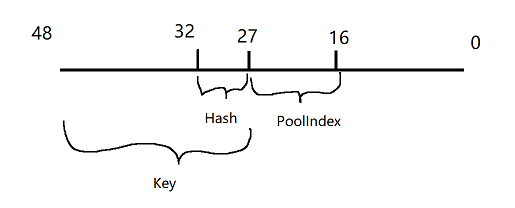

# FMalloc

## FMallocAnsi

使用 `FMallocAnsi` 分配内存时，根据平台不同，调用不同平台的内存申请函数 `_aligned_malloc`、`memalign`、`malloc`

```cpp
void* FMallocAnsi::TryMalloc(SIZE_T Size, uint32 Alignment)
{
#if !UE_BUILD_SHIPPING
	uint64 LocalMaxSingleAlloc = MaxSingleAlloc.Load(EMemoryOrder::Relaxed);
	if (LocalMaxSingleAlloc != 0 && Size > LocalMaxSingleAlloc)
	{
		return nullptr;
	}
#endif

	Alignment = FMath::Max(Size >= 16 ? (uint32)16 : (uint32)8, Alignment);

	void* Result = AnsiMalloc(Size, Alignment);

	return Result;
}

void* AnsiMalloc(SIZE_T Size, uint32 Alignment)
{
#if PLATFORM_USES__ALIGNED_MALLOC
	void* Result = _aligned_malloc( Size, Alignment );
#elif PLATFORM_USE_ANSI_POSIX_MALLOC
	void* Result;
	if (UNLIKELY(posix_memalign(&Result, Alignment, Size) != 0))
	{
		Result = nullptr;
	}
#elif PLATFORM_USE_ANSI_MEMALIGN
	void* Result = memalign(Alignment, Size);
#else
	void* Ptr = malloc(Size + Alignment + sizeof(void*) + sizeof(SIZE_T));
	void* Result = nullptr;
	if (Ptr)
	{
		Result = Align((uint8*)Ptr + sizeof(void*) + sizeof(SIZE_T), Alignment);
		 *((void**)((uint8*)Result - sizeof(void*))) = Ptr;
		*((SIZE_T*)((uint8*)Result - sizeof(void*) - sizeof(SIZE_T))) = Size;
	}
#endif

	return Result;
}
```

释放内存也是，根据平台不同调用不同的释放函数 `_aligned_free`、`free`

```cpp
void AnsiFree(void* Ptr)
{
#if PLATFORM_USES__ALIGNED_MALLOC
	_aligned_free(Ptr);
#elif PLATFORM_USE_ANSI_POSIX_MALLOC || PLATFORM_USE_ANSI_MEMALIGN
	free(Ptr);
#else
	if (Ptr)
	{
		free(*((void**)((uint8*)Ptr - sizeof(void*))));
	}
#endif
}
```

## FMallocBinned

`FMallocBinned` 将内存划分为固定大小的内存池(`Pool`)

- Small Blocks, 小内存块，大小从 16 ~ 32768
- Large Blocks，大内存块，大于 32768

对于更大的内存分配，直接使用 系统接口 进行分配

### 全局变量

对于 IOS 系统来说，页大小限制是 16kb，其他系统是 64kb

```cpp
#if PLATFORM_IOS
#define PLAT_PAGE_SIZE_LIMIT 16384
#define PLAT_BINNED_ALLOC_POOLSIZE 16384
#define PLAT_SMALL_BLOCK_POOL_SIZE 256
#else
#define PLAT_PAGE_SIZE_LIMIT 65536
#define PLAT_BINNED_ALLOC_POOLSIZE 65536
#define PLAT_SMALL_BLOCK_POOL_SIZE 0
#endif //PLATFORM_IOS
```


```cpp
/** Default alignment for binned allocator */
enum { DEFAULT_BINNED_ALLOCATOR_ALIGNMENT = sizeof(FFreeMem) };
static_assert(DEFAULT_BINNED_ALLOCATOR_ALIGNMENT == 16, "Default alignment should be 16 bytes");
enum { PAGE_SIZE_LIMIT = PLAT_PAGE_SIZE_LIMIT };
// BINNED_ALLOC_POOL_SIZE can be increased beyond 64k to cause binned malloc to allocate
// the small size bins in bigger chunks. If OS Allocation is slow, increasing
// this number *may* help performance but YMMV.
enum { BINNED_ALLOC_POOL_SIZE = PLAT_BINNED_ALLOC_POOLSIZE };
// On IOS can push small allocs in to a pre-allocated small block pool
enum { SMALL_BLOCK_POOL_SIZE = PLAT_SMALL_BLOCK_POOL_SIZE };
```


```cpp
// Counts.
enum { POOL_COUNT = 41 };

/** Maximum allocation for the pooled allocator */
enum { EXTENDED_PAGE_POOL_ALLOCATION_COUNT = 2 };
enum { MAX_POOLED_ALLOCATION_SIZE   = 32768+1 };
```

### 构造函数

根据 `PageSize` 初始化运算参数

- `PageSize` 指的是操作系统内存页大小，通常是 4KB 或者 64KB
- `AddressLimit` 指的是地址空间上限，如 32位系统为 4GB

| 参数 | 作用 | 页大小 64 KB 时取值 |
| --- | --- | --- |
| PoolBitShift | 页大小对数 | 16 |
| IndirectPoolBlockSize | 每页能存储的 `FPoolInfo` 数量 | 2048 |
| IndirectPoolBitShift | `IndirectPoolBlockSize` 的对数 | 11 |
| MaxHashBuckets | 哈希桶上限 |  |
| MaxHashBucketBits | 哈希桶上限的对数 |  |
| HashKeyShift | 地址到哈希键的偏移 | 16 + 11 = 27 |
| PoolMask | 用于提取池索引的位掩码 |  |
| BinnedSizeLimit | 限制大小 | 32KB |
| BinnedOSTableIndex | 调用系统接口序号，大于这个值表示用的是系统接口 |  |

> `FPoolInfo` 占 32 B

```cpp
/** Shift to get the reference from the indirect tables */
PoolBitShift = FPlatformMath::CeilLogTwo(PageSize);
IndirectPoolBitShift = FPlatformMath::CeilLogTwo(PageSize/sizeof(FPoolInfo));
IndirectPoolBlockSize = PageSize/sizeof(FPoolInfo);

MaxHashBuckets = AddressLimit >> (IndirectPoolBitShift+PoolBitShift); 
MaxHashBucketBits = FPlatformMath::CeilLogTwo(MaxHashBuckets);
MaxHashBucketWaste = (MaxHashBuckets*sizeof(PoolHashBucket))/1024;
MaxBookKeepingOverhead = ((AddressLimit/PageSize)*sizeof(PoolHashBucket))/(1024*1024);
/** 
* Shift required to get required hash table key.
*/
HashKeyShift = PoolBitShift+IndirectPoolBitShift;
/** Used to mask off the bits that have been used to lookup the indirect table */
PoolMask =  ( ( 1ull << ( HashKeyShift - PoolBitShift ) ) - 1 );
BinnedSizeLimit = Private::PAGE_SIZE_LIMIT/2;
BinnedOSTableIndex = BinnedSizeLimit+EXTENDED_PAGE_POOL_ALLOCATION_COUNT;
```

> 看上面 `PoolMask`、`HashKeyShift` 就知道又涉及到位运算，将众多信息存储到一个 `uint64` 之类的变量中，在运行时通过位运算分别获取所需数据

- 对操作系统级大内存表

```cpp
OsTable.FirstPool = nullptr;
OsTable.ExhaustedPool = nullptr;
OsTable.BlockSize = 0;
```

> 因为直接调用操作系统的接口去分配内存、释放内存，所以 `OSTable` 本身没什么用，这里定义之后其他地方几乎用不到

- 扩展页池表，仅当 页 大小是 64KB 时成效

```cpp
PagePoolTable[0].FirstPool = nullptr;
PagePoolTable[0].ExhaustedPool = nullptr;
PagePoolTable[0].BlockSize = PageSize == Private::PAGE_SIZE_LIMIT ? BinnedSizeLimit+(BinnedSizeLimit/2) : 0;

PagePoolTable[1].FirstPool = nullptr;
PagePoolTable[1].ExhaustedPool = nullptr;
PagePoolTable[1].BlockSize = PageSize == Private::PAGE_SIZE_LIMIT ? PageSize+BinnedSizeLimit : 0;
```

- 标准小内存池表，41 个初定大小池，从 16 B ~ 32 KB

```cpp
static const uint32 BlockSizes[POOL_COUNT] =
{
    16,		32,		48,		64,		80,		96,		112,	128,
    160,	192,	224,	256,	288,	320,	384,	448,
    512,	576,	640,	704,	768,	896,	1024,	1168,
    1360,	1632,	2048,	2336,	2720,	3264,	4096,	4672,
    5456,	6544,	8192,	9360,	10912,	13104,	16384,	21840,	32768
};

for( uint32 i = 0; i < POOL_COUNT; i++ )
{
    PoolTable[i].FirstPool = nullptr;
    PoolTable[i].ExhaustedPool = nullptr;
    PoolTable[i].BlockSize = BlockSizes[i];
    check(IsAligned(BlockSizes[i], Private::DEFAULT_BINNED_ALLOCATOR_ALIGNMENT));
#if STATS
    PoolTable[i].MinRequest = PoolTable[i].BlockSize;
#endif
}
```

- 将所有 `PoolTable` 和 `PagePoolTable` 都存储到 `MemSizeToPoolTable` 数组中

```cpp
for( uint32 i=0; i<MAX_POOLED_ALLOCATION_SIZE; i++ )
{
    uint32 Index = 0;
    while( PoolTable[Index].BlockSize < i )
    {
        ++Index;
    }
    checkSlow(Index < POOL_COUNT);
    MemSizeToPoolTable[i] = &PoolTable[Index];
}

MemSizeToPoolTable[BinnedSizeLimit] = &PagePoolTable[0];
MemSizeToPoolTable[BinnedSizeLimit+1] = &PagePoolTable[1];
```

> `BinnedSizeLimit` 为 32KB

`MemSizeToPoolTable` 的数组长度是 `MAX_POOLED_ALLOCATION_SIZE + EXTENDED_PAGE_POOL_ALLOCATION_COUNT` 也就是 `32KB + 1 + 2`

`MemSizeToPoolTable[index]` 表示能够申请 `index` 对应字节的最小符合要求的 `FPoolTable` 

比如 `index = 4354`，那么 `MemSizeToPoolTable[index]` 对应的 `FPoolTable` 的 `BlockSize` 就是 4672，是符合要求的 `BlockSize` 最小的 `FPoolTable`

> 4354 是随便敲的

也就是说，未来任何任意大小的内存，只需要将其 `Size` 作为索引，即通过 `MemSizeToPoolTable[Size]` 获取对应的 `FPoolTable`


### Malloc 函数

通常来说 `Malloc` 一般用于申请内存

- `Size` 用于表示申请内存大小
- `Alignment` 用于表示要求的内存对齐边界

```cpp
void* FMallocBinned::Malloc(SIZE_T Size, uint32 Alignment)
```

约束 `Size` 和 `Alignment` 的大小

```cpp
Size = FMath::Max(Size, (SIZE_T)1);
Alignment = FMath::Max<uint32>(Alignment, Private::DEFAULT_BINNED_ALLOCATOR_ALIGNMENT);
```

> `Size` 不可能为 0，试想如何申请不存在的东西呢？指针如何指向不存在的对象呢？

接下来就是通过 `Size` 获取对应的 `FTableTool`

根据情况，调用 `Private::AllocatePoolMemory` 给 Pool 分配内存空间，通过 `Private::AllocateBlockFromPool` 申请对象的内存空间

```cpp
FPoolTable* Table = MemSizeToPoolTable[Size];
#ifdef USE_FINE_GRAIN_LOCKS
FScopeLock TableLock(&Table->CriticalSection);
#endif
Private::TrackStats(Table, (uint32)Size);
FPoolInfo* Pool = Table->FirstPool;
if( !Pool )
{
	Pool = Private::AllocatePoolMemory(*this, Table, Private::BINNED_ALLOC_POOL_SIZE/*PageSize*/, Size);
}

Free = Private::AllocateBlockFromPool(*this, Table, Pool, Alignment);
```

### Private

```cpp
class FMallocBinned : public FMalloc
{
	struct Private;
	// ....
}
```

可能有人纳闷，这是个什么写法？

其实这里声明了一个名为 `Private` 的结构体，在 `.h` 文件中，真正的实现是在 `.cpp` 文件中

这就是名为 `PImlp` 模式，`PImpl`通过一个私有的成员指针，将指针指向的类的内部实现全部隐藏

```cpp
struct FMallocBinned::Private
{
	// ....
}
```

- 这种方法隐藏了大量实现。即使在类中将某些成员限定为 `private`，外界仍旧可以通过对应的 `setter/getter` 接口猜测到类的内部实现。如果使用`PImpl`，则只需要提供 `public` 接口即可
- 修改 `PImpl` 不会影响类A本身，且修改发生在 `.cpp` 文件中。指针的大小是确定的，因此，发生修改是，头文件不会发生变化。这种方法可以降低编译依赖，提高编译速度

比如，如果对外封装 SDK，外界能拿到 `DLL` 和 `.h` 文件，使用 `PImpl` 模式可以在 `.h` 文件中完全隐藏属性定义和大部分函数定义，只留下对外用的接口函数

#### GetPoolInfo

函数的作用是如何通过一个指针，判定其所属的 `FPoolInfo`

```cpp
static FORCEINLINE FPoolInfo* GetPoolInfo(FMallocBinned& Allocator, UPTRINT Ptr)
```

所谓的 `UPTRINT` 其实是为了表示一个地址的大小，64位还是32位，通过模板匹配 `sizeof(void*)` 的值，进而得到 `uint32` 或者 `uint64`

```cpp
typedef SelectIntPointerType<uint32, uint64, sizeof(void*)>::TIntPointer UPTRINT;
```

64 位内存地址实际用到 48 位，32 位系统实际用到 32 位

```cpp
UPTRINT Key       = Ptr >> Allocator.HashKeyShift;
UPTRINT Hash      = Key & (Allocator.MaxHashBuckets - 1);
UPTRINT PoolIndex = ((UPTRINT)Ptr >> Allocator.PoolBitShift) & Allocator.PoolMask;
```

> HashKeyShift = PoolBitShift + IndirectPoolBitShift

> `IndirectPoolBitShift` 是 每页能存储的 `FPoolInfo` 数量 的对数，比如 64KB 的页能存储 2048 个 `FPoolInfo`，得到的 `IndirectPoolBitShift` 就是 11

> PoolMask =  ( ( 1ull << ( HashKeyShift - PoolBitShift ) ) - 1 )

假设 `HashKeyShift` 是 27，`MaxHashBuckets` 是 32，`PoolBitShift` 是 16，`PoolMask` 是 11 位

那么 64 位系统下，有效位数是 48 位，右移 27 位，得到高位 21 位作为 `Key`

通过 `MaxHashBuckets` 取 `Key` 的低 5 位，得到 `Hash`

通过右移 16 后对取低位 11 位作为 `PoolIndex`

综上所述，对于一个 64位系统的指针，有效位数是 48 位，对一个指针将其划分成三部分



- `Hash` 有 5 位二进制，取值是 0 ~ 31
- `PoolIndex` 有 11 位二进制，取值是 0 ~ 2047

```cpp
PoolHashBucket* Collision = &Allocator.HashBuckets[Hash];
do
{
	if (Collision->Key == Key || !Collision->FirstPool)
	{
		if (!Collision->FirstPool)
		{
			Collision->Key = Key;
			InitializeHashBucket(Allocator, Collision);
			CA_ASSUME(Collision->FirstPool);
		}
		return &Collision->FirstPool[PoolIndex];
	}

	Collision = Collision->Next;
} while (Collision != &Allocator.HashBuckets[Hash]);
```

> `InitializeHashBucket` 函数中会创建 `FirstPool` 对应的 `FPoolInfo` 数组，其长度为 `IndirectPoolBlockSize`

通过上述代码，以及前面定义的变量取值范围

不难发现 `Allocator.HashBuckets` 是一个长度为 32 的数组，`Collision->FirstPool` 是一个长度为 2048 的数组

1. 通过 `Hash` 值进行一级查找，快速定位到所属的 `HashBuckets` 
2. 通过 `Key` 在链表中进行二级查找
3. 通过 `PoolIndex` 直接得到所属的 `FPageInfo`

注意这里的 `while (Collision != &Allocator.HashBuckets[Hash])` 终止循环条件是 等于链表头，这是因为 `PoolHashBucket` 是循环链表

从链表的插入逻辑即可窥探，`Link` 函数即为插入链表的逻辑，可以发现插入节点是向当前节点的前面插入

> 虽然函数参数是 `After`

```cpp
void Link( PoolHashBucket* After )
{
	Link(After, Prev, this);
}

static void Link( PoolHashBucket* Node, PoolHashBucket* Before, PoolHashBucket* After )
{
	Node->Prev=Before;
	Node->Next=After;
	Before->Next=Node;
	After->Prev=Node;
}
```

另外，注意循环中的条件判断 `!Collision->FirstPool`，这里表示 `PoolHashBucket` 虽然被创建了，但是并没有被使用，于是乎直接修改其 `Key`，重新启用

当没有找到对应的 `PoolHashBucket` 时，则创建一个新的，并插入到 `HashBuckets` 数组中

```cpp
PoolHashBucket* NewBucket = CreateHashBucket(Allocator);
NewBucket->Key = Key;
Allocator.HashBuckets[Hash].Link(NewBucket);
```

虽然当 `Hash` 值冲突时，通过 `PoolHashBucket` 链表进行逐个查找。但是游戏分配通常集中特定区域，冲突率较低，比较少见出现 `O(n)` 的情况


通过前面的一系列定位，可以得到一个 `FPoolInfo`，用于管理一个内存页的大小，这个内存页刚好是 64 KB，也就是 0~15 能表示的内容

#### AllocatePoolMemory

用于创建 `FPoolInfo` 对象

首先先申请一块 `PageSize` 倍数的内存

`Align` 就是经典的内存对齐算法，得到的值是

1. 大于等于 `Bytes` 
2. 是 `PageSize` 倍数
3. 同时满足上述条件的最小值

```cpp
uint32 Blocks   = PoolSize / Table->BlockSize;
uint32 Bytes    = Blocks * Table->BlockSize;
UPTRINT OsBytes = Align(Bytes, PageSize);

FFreeMem* Free = (FFreeMem*)OSAlloc(Allocator, OsBytes, ActualPoolSize);
```

> 代码有些修改，大差不差  

通过前面的 `GetPoolInfo`，通过申请的地址，创建或者获得对应的 `FPoolInfo`，如果一次性内存的大小超过的 `BlockSize`，设置对应的 `PoolInfo` 的 `TableIndex` 为 `Offset` 序号索引，`AllocSize` 和 `FreeMem` 为空

```cpp
FPoolInfo* Pool;
{
#ifdef USE_FINE_GRAIN_LOCKS
	FScopeLock PoolInfoLock(&Allocator.AccessGuard);
#endif
	Pool = GetPoolInfo(Allocator, (UPTRINT)Free);
	for (UPTRINT i = (UPTRINT)PageSize, Offset = 0; i < OsBytes; i += PageSize, ++Offset)
	{
		FPoolInfo* TrailingPool = GetPoolInfo(Allocator, ((UPTRINT)Free) + i);
		check(TrailingPool);

		//Set trailing pools to point back to first pool
		TrailingPool->SetAllocationSizes(0, 0, (uint32)Offset, (uint32)Allocator.BinnedOSTableIndex);
	}

	
	BINNED_PEAK_STATCOUNTER(Allocator.OsPeak,    BINNED_ADD_STATCOUNTER(Allocator.OsCurrent,    OsBytes));
	BINNED_PEAK_STATCOUNTER(Allocator.WastePeak, BINNED_ADD_STATCOUNTER(Allocator.WasteCurrent, (OsBytes - Bytes)));
}
```


最后对第一个 `PoolInfo` 进行设置

```cpp
Pool->Link( Table->FirstPool );		// 插入池链表头部
Pool->SetAllocationSizes(Bytes, OsBytes, TableIndex, Allocator.BinnedOSTableIndex);
Pool->Taken		 = 0;
Pool->FirstMem   = Free;			// 指向申请的内存
#if STATS
Table->NumActivePools++;
Table->MaxActivePools = FMath::Max(Table->MaxActivePools, Table->NumActivePools);
#endif
// Create first free item.
Free->NumFreeBlocks = Blocks;		// 包含的空闲块的数量
Free->Next          = nullptr;
```

> `NumFreeBlocks` 表示申请的页表个数

#### AllocateBlockFromPool

根据 `NumFreeBlocks` 和 `BlockSize` 可以得到内存中，可以用使用的空闲内存的地址

`Pool->FirstMem` 作为空闲内存的起点， `--Pool->FirstMem->NumFreeBlocks * Table->BlockSize` 表示内存偏移

注意，这里是 `--Pool->FirstMem->NumFreeBlocks`，先减少，再计算

所以，内存是从高位开始分配的

```cpp
FFreeMem* Free = (FFreeMem*)((uint8*)Pool->FirstMem + --Pool->FirstMem->NumFreeBlocks * Table->BlockSize);
```

当当前的 `FPoolInfo` 已经没有空闲内存分配之后，将 `FirstMem` 指向链表的下一个空闲块

如果没有下一个空闲块，则将池移至 `ExhaustedPool`

```cpp
if( !Pool->FirstMem->NumFreeBlocks )
{
	Pool->FirstMem = Pool->FirstMem->Next;
	if( !Pool->FirstMem )
	{
		// Move to exhausted list.
		Pool->Unlink();
		Pool->Link( Table->ExhaustedPool );
	}
}
```
