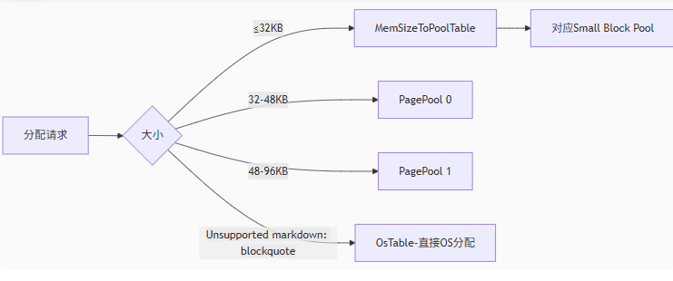

# FMalloc

## FMallocAnsi

使用 `FMallocAnsi` 分配内存时，根据平台不同，调用不同平台的内存申请函数 `_aligned_malloc`、`memalign`、`malloc`

```cpp
void* FMallocAnsi::TryMalloc(SIZE_T Size, uint32 Alignment)
{
#if !UE_BUILD_SHIPPING
	uint64 LocalMaxSingleAlloc = MaxSingleAlloc.Load(EMemoryOrder::Relaxed);
	if (LocalMaxSingleAlloc != 0 && Size > LocalMaxSingleAlloc)
	{
		return nullptr;
	}
#endif

	Alignment = FMath::Max(Size >= 16 ? (uint32)16 : (uint32)8, Alignment);

	void* Result = AnsiMalloc(Size, Alignment);

	return Result;
}

void* AnsiMalloc(SIZE_T Size, uint32 Alignment)
{
#if PLATFORM_USES__ALIGNED_MALLOC
	void* Result = _aligned_malloc( Size, Alignment );
#elif PLATFORM_USE_ANSI_POSIX_MALLOC
	void* Result;
	if (UNLIKELY(posix_memalign(&Result, Alignment, Size) != 0))
	{
		Result = nullptr;
	}
#elif PLATFORM_USE_ANSI_MEMALIGN
	void* Result = memalign(Alignment, Size);
#else
	void* Ptr = malloc(Size + Alignment + sizeof(void*) + sizeof(SIZE_T));
	void* Result = nullptr;
	if (Ptr)
	{
		Result = Align((uint8*)Ptr + sizeof(void*) + sizeof(SIZE_T), Alignment);
		 *((void**)((uint8*)Result - sizeof(void*))) = Ptr;
		*((SIZE_T*)((uint8*)Result - sizeof(void*) - sizeof(SIZE_T))) = Size;
	}
#endif

	return Result;
}
```

释放内存也是，根据平台不同调用不同的释放函数 `_aligned_free`、`free`

```cpp
void AnsiFree(void* Ptr)
{
#if PLATFORM_USES__ALIGNED_MALLOC
	_aligned_free(Ptr);
#elif PLATFORM_USE_ANSI_POSIX_MALLOC || PLATFORM_USE_ANSI_MEMALIGN
	free(Ptr);
#else
	if (Ptr)
	{
		free(*((void**)((uint8*)Ptr - sizeof(void*))));
	}
#endif
}
```

## FMallocBinned

`FMallocBinned` 将内存划分为固定大小的内存池(`Pool`)

- Small Blocks, 小内存块，大小从 16 ~ 32768
- Large Blocks，大内存块，大于 32768

对于更大的内存分配，直接使用 系统接口 进行分配

### 全局变量

对于 IOS 系统来说，页大小限制是 16kb，其他系统是 64kb

```cpp
#if PLATFORM_IOS
#define PLAT_PAGE_SIZE_LIMIT 16384
#define PLAT_BINNED_ALLOC_POOLSIZE 16384
#define PLAT_SMALL_BLOCK_POOL_SIZE 256
#else
#define PLAT_PAGE_SIZE_LIMIT 65536
#define PLAT_BINNED_ALLOC_POOLSIZE 65536
#define PLAT_SMALL_BLOCK_POOL_SIZE 0
#endif //PLATFORM_IOS
```


```cpp
/** Default alignment for binned allocator */
enum { DEFAULT_BINNED_ALLOCATOR_ALIGNMENT = sizeof(FFreeMem) };
static_assert(DEFAULT_BINNED_ALLOCATOR_ALIGNMENT == 16, "Default alignment should be 16 bytes");
enum { PAGE_SIZE_LIMIT = PLAT_PAGE_SIZE_LIMIT };
// BINNED_ALLOC_POOL_SIZE can be increased beyond 64k to cause binned malloc to allocate
// the small size bins in bigger chunks. If OS Allocation is slow, increasing
// this number *may* help performance but YMMV.
enum { BINNED_ALLOC_POOL_SIZE = PLAT_BINNED_ALLOC_POOLSIZE };
// On IOS can push small allocs in to a pre-allocated small block pool
enum { SMALL_BLOCK_POOL_SIZE = PLAT_SMALL_BLOCK_POOL_SIZE };
```


```cpp
// Counts.
enum { POOL_COUNT = 41 };

/** Maximum allocation for the pooled allocator */
enum { EXTENDED_PAGE_POOL_ALLOCATION_COUNT = 2 };
enum { MAX_POOLED_ALLOCATION_SIZE   = 32768+1 };
```

### 构造函数

根据 `PageSize` 初始化运算参数

- `PageSize` 指的是操作系统内存页大小，通常是 4KB 或者 64KB
- `AddressLimit` 指的是地址空间上限，如 32位系统为 4GB

| 参数 | 作用 | 页大小 64 KB 时取值 |
| --- | --- | --- |
| PoolBitShift | 页大小对数 | 16 |
| IndirectPoolBlockSize | 每页能存储的 `FPoolInfo` 数量 | 2048 |
| IndirectPoolBitShift | `IndirectPoolBlockSize` 的对数 | 11 |
| MaxHashBuckets | 哈希桶上限 |  |
| MaxHashBucketBits | 哈希桶上限的对数 |  |
| HashKeyShift | 地址到哈希键的偏移 | 16 + 11 = 27 |
| PoolMask | 用于提取池索引的位掩码 |  |
| BinnedSizeLimit | 限制大小 | 32KB |
| BinnedOSTableIndex | 调用系统接口序号，大于这个值表示用的是系统接口 |  |

> `FPoolInfo` 占 32 B

```cpp
/** Shift to get the reference from the indirect tables */
PoolBitShift = FPlatformMath::CeilLogTwo(PageSize);
IndirectPoolBitShift = FPlatformMath::CeilLogTwo(PageSize/sizeof(FPoolInfo));
IndirectPoolBlockSize = PageSize/sizeof(FPoolInfo);

MaxHashBuckets = AddressLimit >> (IndirectPoolBitShift+PoolBitShift); 
MaxHashBucketBits = FPlatformMath::CeilLogTwo(MaxHashBuckets);
MaxHashBucketWaste = (MaxHashBuckets*sizeof(PoolHashBucket))/1024;
MaxBookKeepingOverhead = ((AddressLimit/PageSize)*sizeof(PoolHashBucket))/(1024*1024);
/** 
* Shift required to get required hash table key.
*/
HashKeyShift = PoolBitShift+IndirectPoolBitShift;
/** Used to mask off the bits that have been used to lookup the indirect table */
PoolMask =  ( ( 1ull << ( HashKeyShift - PoolBitShift ) ) - 1 );
BinnedSizeLimit = Private::PAGE_SIZE_LIMIT/2;
BinnedOSTableIndex = BinnedSizeLimit+EXTENDED_PAGE_POOL_ALLOCATION_COUNT;
```

> 看上面 `PoolMask`、`HashKeyShift` 就知道又涉及到位运算，将众多信息存储到一个 `uint64` 之类的变量中，在运行时通过位运算分别获取所需数据

- 对操作系统级大内存表

```cpp
OsTable.FirstPool = nullptr;
OsTable.ExhaustedPool = nullptr;
OsTable.BlockSize = 0;
```

> 因为直接调用操作系统的接口去分配内存、释放内存，所以 `OSTable` 本身没什么用，这里定义之后其他地方几乎用不到

- 扩展页池表，仅当 页 大小是 64KB 时成效

```cpp
PagePoolTable[0].FirstPool = nullptr;
PagePoolTable[0].ExhaustedPool = nullptr;
PagePoolTable[0].BlockSize = PageSize == Private::PAGE_SIZE_LIMIT ? BinnedSizeLimit+(BinnedSizeLimit/2) : 0;

PagePoolTable[1].FirstPool = nullptr;
PagePoolTable[1].ExhaustedPool = nullptr;
PagePoolTable[1].BlockSize = PageSize == Private::PAGE_SIZE_LIMIT ? PageSize+BinnedSizeLimit : 0;
```

- 标准小内存池表，41 个初定大小池，从 16 B ~ 32 KB

```cpp
static const uint32 BlockSizes[POOL_COUNT] =
{
    16,		32,		48,		64,		80,		96,		112,	128,
    160,	192,	224,	256,	288,	320,	384,	448,
    512,	576,	640,	704,	768,	896,	1024,	1168,
    1360,	1632,	2048,	2336,	2720,	3264,	4096,	4672,
    5456,	6544,	8192,	9360,	10912,	13104,	16384,	21840,	32768
};

for( uint32 i = 0; i < POOL_COUNT; i++ )
{
    PoolTable[i].FirstPool = nullptr;
    PoolTable[i].ExhaustedPool = nullptr;
    PoolTable[i].BlockSize = BlockSizes[i];
    check(IsAligned(BlockSizes[i], Private::DEFAULT_BINNED_ALLOCATOR_ALIGNMENT));
#if STATS
    PoolTable[i].MinRequest = PoolTable[i].BlockSize;
#endif
}
```

- 将所有 `PoolTable` 和 `PagePoolTable` 都存储到 `MemSizeToPoolTable` 数组中

```cpp
for( uint32 i=0; i<MAX_POOLED_ALLOCATION_SIZE; i++ )
{
    uint32 Index = 0;
    while( PoolTable[Index].BlockSize < i )
    {
        ++Index;
    }
    checkSlow(Index < POOL_COUNT);
    MemSizeToPoolTable[i] = &PoolTable[Index];
}

MemSizeToPoolTable[BinnedSizeLimit] = &PagePoolTable[0];
MemSizeToPoolTable[BinnedSizeLimit+1] = &PagePoolTable[1];
```

> `BinnedSizeLimit` 为 32KB

`MemSizeToPoolTable` 的数组长度是 `MAX_POOLED_ALLOCATION_SIZE + EXTENDED_PAGE_POOL_ALLOCATION_COUNT` 也就是 `32KB + 1 + 2`

`MemSizeToPoolTable[index]` 表示能够申请 `index` 对应字节的最小符合要求的 `FPoolTable` 

比如 `index = 4354`，那么 `MemSizeToPoolTable[index]` 对应的 `FPoolTable` 的 `BlockSize` 就是 4672，是符合要求的 `BlockSize` 最小的 `FPoolTable`

> 4354 是随便敲的

也就是说，未来任何任意大小的内存，只需要将其 `Size` 作为索引，即通过 `MemSizeToPoolTable[Size]` 获取对应的 `FPoolTable`



### Malloc 函数

通常来说 `Malloc` 一般用于申请内存

- `Size` 用于表示申请内存大小
- `Alignment` 用于表示要求的内存对齐边界

```cpp
void* FMallocBinned::Malloc(SIZE_T Size, uint32 Alignment)
```

约束 `Size` 和 `Alignment` 的大小

```cpp
Size = FMath::Max(Size, (SIZE_T)1);
Alignment = FMath::Max<uint32>(Alignment, Private::DEFAULT_BINNED_ALLOCATOR_ALIGNMENT);
```

> `Size` 不可能为 0，试想如何申请不存在的东西呢？指针如何指向不存在的对象呢？


