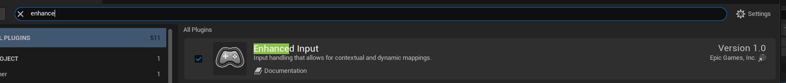
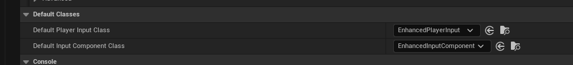
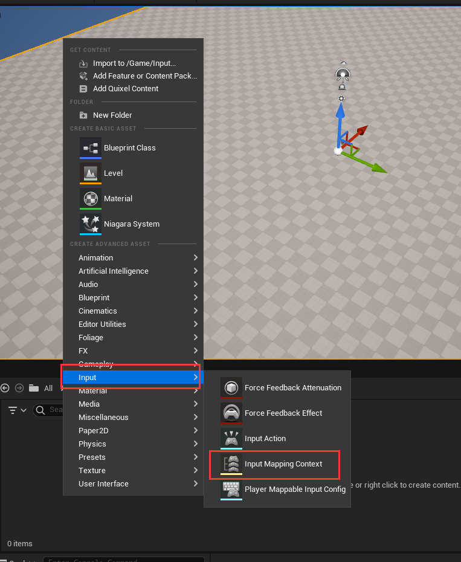
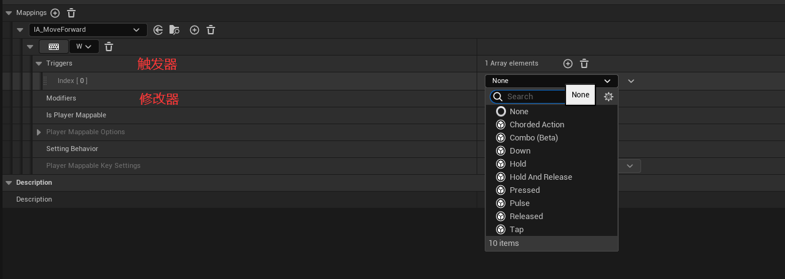
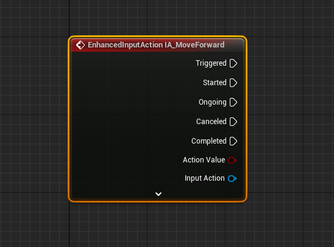
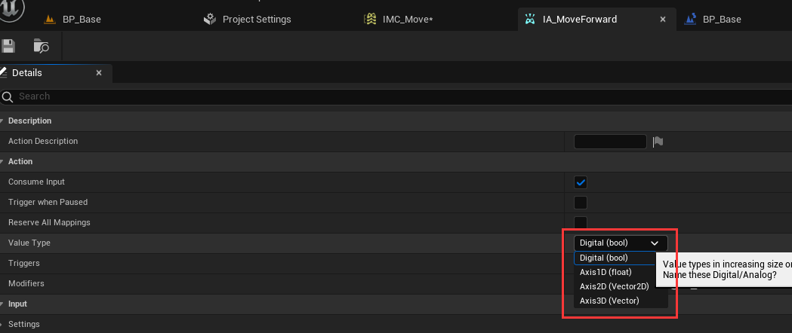
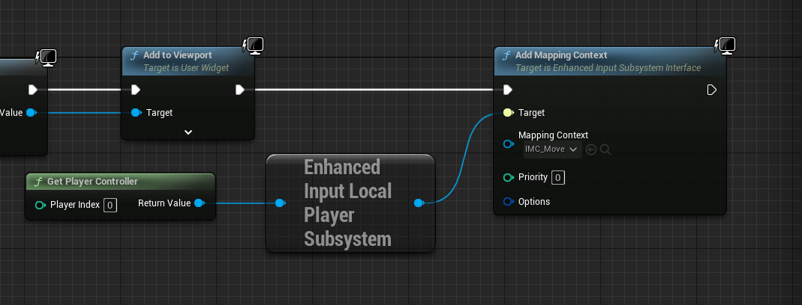

# 增强输入

旧的输入系统实现基础的功能比较简单，如果想构建更复杂的机制就需要在 User 层做更多的工作

对于新的输入系统，有一些期望

- 重新梳理简化。从 Axis/Action => Action
- 运行时重映射输入场景， `UInputMappingContext`
- 对初级用户易配置，大量默认行为实现， Tap/Hold...
- 对高级用户易扩展，可继承子类扩展
  - 修改器：修改输入值
  - 触发器：决定触发条件
  - 优先级：配置输入场景优先级
- 模块化，不再只依赖ini配置，以资源asset方式配置，堆栈式分隔逻辑
- 提高性能，不需要检查所有的输入，只需要关心当前的

> 开启增强输入插件，重启编辑器

将默认的 `Player Input` 和 `Input Component` 的类设置成 `Enchanced Input` 的类

创建 `Input Mapping Context` 命名为 `IMC_Move` 和 `Input Action` 命名为 `IA_MoveForward`

随后可以将 `IMC_Move` 配置成如下所示，这一步将事件(`IA_MoveForward`)与具体的案件进行绑定，通过这种操作可以解耦事件与触发条件，不同的 `Input Mapping Context` 可以绑定相同的事件

> 通过设置 `IA_MoveForward` 的配置，可以修改其触发事件传入的参数(当前是bool表示是否触发，可以修改为Axis1D来适配手柄)

> 通过 `AddMappingContext` 来应用输入

**按键**与**事件**的触发其实可以是**多对多**的关系

- 一个事件可以由多种按键触发，`R` 和 `->` 都可以触发向右移动
- 一个事件可以有多个按键同时点击触发，`shift` + `w` 可以触发瞬移

