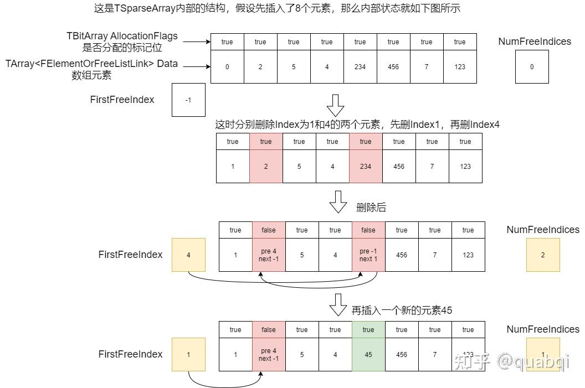

# 容器

## TArray

虽然在 `Array.h` 文件中 `TArray` 的定义需要设置两个模板参数

```cpp
template<typename InElementType, typename InAllocatorType>
class TArray
```

但是在日常使用时，完全不需要设置 `InAllocatorType`，这是因为在 `ContainersFwd.h` 文件中，帮助设置了默认的 `InAllocatorType` 

```cpp
template <int IndexSize> class TSizedDefaultAllocator : public TSizedHeapAllocator<IndexSize> { public: typedef TSizedHeapAllocator<IndexSize> Typedef; };

template<int IndexSize> class TSizedDefaultAllocator;
using FDefaultAllocator = TSizedDefaultAllocator<32>;
using FDefaultAllocator64 = TSizedDefaultAllocator<64>;

template<typename T, typename Allocator = FDefaultAllocator> class TArray;
template<typename T> using TArray64 = TArray<T, FDefaultAllocator64>;
```

所以，日常使用 `TArray` 的时候，默认的内存分配器就是 `TSizedDefaultAllocator<32>`，也就是 `TSizedHeapAllocator<32>`

### Emplace

想要窥探 `TArray` 如何存储和管理对象的，从添加一个对象开始入手

```cpp
template <typename... ArgsType>
FORCEINLINE SizeType Emplace(ArgsType&&... Args)
{
    const SizeType Index = AddUninitialized();
    new(GetData() + Index) ElementType(Forward<ArgsType>(Args)...);
    return Index;
}
```

使用 `AddUninitialized` 计算内存偏移，然后再对指定空间直接 `placement new` 构造对象

```cpp
FORCEINLINE SizeType AddUninitialized()
{
    CheckInvariants();

    const USizeType OldNum = (USizeType)ArrayNum;
    const USizeType NewNum = OldNum + (USizeType)1;
    ArrayNum = (SizeType)NewNum;
    if (NewNum > (USizeType)ArrayMax)
    {
        ResizeGrow((SizeType)OldNum);
    }
    return OldNum;
}
```

`AddUninitialized` 中会判断，如果当前数量 + 1 超过了数组的最大数量，则会触发 `ResizeGrow` 

```cpp
FORCENOINLINE void ResizeGrow(SizeType OldNum)
{
    SizeType LocalArrayNum = ArrayNum;
    // some check ...
    ArrayMax = AllocatorCalculateSlackGrow(LocalArrayNum, ArrayMax);
    AllocatorResizeAllocation(OldNum, ArrayMax);
}
```

通过 `AllocatorCalculateSlackGrow` 计算了新的数组最大大小，这个函数最后调用了 `Allocator` 的 `CalculateSlackGrow`，最终会调用到 `DefaultCalculateSlackGrow` 这个全局函数

```cpp
#if AGGRESSIVE_MEMORY_SAVING
	const SIZE_T FirstGrow = 1;
#else
	const SIZE_T FirstGrow = 4;
	const SIZE_T ConstantGrow = 16;
#endif

#if CONTAINER_INITIAL_ALLOC_ZERO_SLACK
	if (NumAllocatedElements)
	{
#if AGGRESSIVE_MEMORY_SAVING
		Grow = SIZE_T(NumElements) + SIZE_T(NumElements) / 4;
#else
		Grow = SIZE_T(NumElements) + 3 * SIZE_T(NumElements) / 8 + ConstantGrow;
#endif
	}
	else if (SIZE_T(NumElements) > Grow)
	{
		Grow = SIZE_T(NumElements);
	}
#else
	if (NumAllocatedElements || SIZE_T(NumElements) > Grow)
	{
#if AGGRESSIVE_MEMORY_SAVING
		Grow = SIZE_T(NumElements) + SIZE_T(NumElements) / 4;
#else
		Grow = SIZE_T(NumElements) + 3 * SIZE_T(NumElements) / 8 + ConstantGrow;
#endif
	}
#endif
```

| 条件 | 内存节省模式 | 标准模式 | 设计意图 |
| --- | --- | --- | --- |
| 已分配内存 | 1.25倍扩容 Grow = N + N/4 | 1.375倍 + 常数 Grow = N + 3N/8 + 16 | 平衡内存/性能 |
| 首次分配 | 直接使用元素数 Grow = N | 1.375倍 + 常数 Grow = N + 3N/8 + 16 | 避免初始浪费 |
| 元素超限 | 直接使用元素数 Grow = N | 1.375倍 + 常数 Grow = N + 3N/8 + 16 | 安全边界处理 |

相比于 `libstd++`、`MSVC` 等的 2、1.5、1.618 扩容策略， UE 的策略相对保守

在计算完新的数组容量之后，通过 `AllocatorResizeAllocation` 来重设数组，最后会调用 `TSizedHeapAllocator` 中的 `ResizeAllocation` 函数

```cpp
void ResizeAllocation(SizeType PreviousNumElements, SizeType NumElements, SIZE_T NumBytesPerElement)
{
    if (Data || NumElements)
    {
        // do something ...
        Data = (FScriptContainerElement*)BaseMallocType::Realloc( Data, NumElements*NumBytesPerElement );
    }
}
```

重要的其实就一句话，那就是 `BaseMallocType::Realloc` 重新分配内存

### RemoveAt

```cpp
void RemoveAtImpl(SizeType Index, SizeType Count, bool bAllowShrinking)
{
    if (Count)
    {
        CheckInvariants();
        checkSlow((Count >= 0) & (Index >= 0) & (Index + Count <= ArrayNum));

        DestructItems(GetData() + Index, Count);

        SizeType NumToMove = ArrayNum - Index - Count;
        if (NumToMove)
        {
            FMemory::Memmove
            (
                (uint8*)AllocatorInstance.GetAllocation() + (Index)* sizeof(ElementType),
                (uint8*)AllocatorInstance.GetAllocation() + (Index + Count) * sizeof(ElementType),
                NumToMove * sizeof(ElementType)
            );
        }
        ArrayNum -= Count;

        if (bAllowShrinking)
        {
            ResizeShrink();
        }
    }
}
```

通过地址偏移得到起始地址，通过 `Count` 得到需要析构的对象个数，在 `DestructItems` 中循环析构数组对象

然后通过 `FMemory::Memmove` 将删除序号后面的内容直接内存操作，补全前面的缺口

## TSparseArray

```cpp
template<typename InElementType,typename Allocator /*= FDefaultSparseArrayAllocator */>
class TSparseArray
```

`TSparseArray` 即 **稀疏矩阵**

通过定义上面的注释内容，可以窥探 `TSparseArray` 的作用

`TSparseArray` 是一个动态大小的数组，其中元素索引不一定是连续的。与普通 `TArray` 一样，所有内存都用于存储元素，但是支持 `O(1)` 时间删除元素

`TSpareArray` 使用 `TArray` 存储元素，使用 `TBitArray` 标记某个元素是否已经被分配

```cpp
typedef TSparseArrayElementOrFreeListLink<TAlignedBytes<sizeof(ElementType), alignof(ElementType)>> FElementOrFreeListLink;

typedef TArray<FElementOrFreeListLink,typename Allocator::ElementAllocator> DataType;
DataType Data;

typedef TBitArray<typename Allocator::BitArrayAllocator> AllocationBitArrayType;
AllocationBitArrayType AllocationFlags;

/** 数组中当前包含自由元素链表第一个的未分配元素的索引 */
int32 FirstFreeIndex;

/** 空闲元素的个数 */
int32 NumFreeIndices;
```

正如注释所说，有一个存储数据的 `TArray` 数组，属性名为 `Data`；有一个存储序号是否空闲的 `TBitArray`，属性名为 `AllocationFlags`

`FElementOrFreeListLink` 存储实际内容和前后序号，这里 `TAlignedBytes` 用于创建一块大小和 `ElementType` 并且内存对齐的内存块，这样无论是蓝图对象还是C++对象都能存储，从而忽略具体类型

```cpp
template<typename ElementType>
union TSparseArrayElementOrFreeListLink
{
	ElementType ElementData;
	struct
	{
		int32 PrevFreeIndex;
		int32 NextFreeIndex;
	};
};
```

其实通过 `TSparseArrayElementOrFreeListLink` 就可以知道 `TSparseArray` 怎么实现的了



使用 `FirstFreeIndex` 记录空闲元素链表的入口；使用 `NumFreeIndices` 记录空闲元素个数，方便一些操作的条件判断

### RemoveAt

```cpp
void RemoveAt(int32 Index,int32 Count = 1)
{
    if (!TIsTriviallyDestructible<ElementType>::Value)
    {
        FElementOrFreeListLink* DataPtr = (FElementOrFreeListLink*)Data.GetData();
        for (int32 It = Index, ItCount = Count; ItCount; ++It, --ItCount)
        {
            ((ElementType&)DataPtr[It].ElementData).~ElementType();
        }
    }

    RemoveAtUninitialized(Index, Count);
}
```

删除指定序号上的对象

操作也很简单，通过 `Index` 获取 `Data` 中的对象，并对其调用析构函数

然后调用 `RemoveAtUninitialized` 更新 空闲元素链表信息

```cpp
void RemoveAtUninitialized(int32 Index,int32 Count = 1)
{
    FElementOrFreeListLink* DataPtr = (FElementOrFreeListLink*)Data.GetData();

    for (; Count; --Count)
    {
        check(AllocationFlags[Index]);

        // Mark the element as free and add it to the free element list.
        if(NumFreeIndices)
        {
            DataPtr[FirstFreeIndex].PrevFreeIndex = Index;
        }
        DataPtr[Index].PrevFreeIndex = -1;
        DataPtr[Index].NextFreeIndex = NumFreeIndices > 0 ? FirstFreeIndex : INDEX_NONE;
        FirstFreeIndex = Index;
        ++NumFreeIndices;
        AllocationFlags[Index] = false;

        ++Index;
    }
}
```


通过 `Data.GetData()` 配合 `Index` 获取指定的数组元素

修改结构体中 `PrevFreeIndex` 和 `NextFreeIndex` 指向的空闲元素序号

设置 `AllocationFlags`，将对应元素序号标记为 `false`，也就是空闲

### Add

```cpp
int32 Add(const ElementType& Element)
{
    FSparseArrayAllocationInfo Allocation = AddUninitialized();
    new(Allocation) ElementType(Element);
    return Allocation.Index;
}
```

通过 `AddUninitialized` 获取对应的内存地址，然后就地 `placement new` 来构建对象

`AddUninitialized` 有两种情况

- `NumFreeIndices` 不为 0，表示存在空闲元素，通过 `FirstFreeIndex` 获取空闲元素，修改空闲元素链表关系

```cpp
FElementOrFreeListLink* DataPtr = (FElementOrFreeListLink*)Data.GetData();

Index = FirstFreeIndex;
FirstFreeIndex = DataPtr[FirstFreeIndex].NextFreeIndex;
--NumFreeIndices;
if(NumFreeIndices)
{
    DataPtr[FirstFreeIndex].PrevFreeIndex = -1;
}
```

- `NumFreeIndices` 为 0，表示不存在空闲元素，需要扩容 `Data` 数组和 `AllocationFlags` 标记数组

```cpp
Index = Data.AddUninitialized(1);
AllocationFlags.Add(false);
```

至于为什么能对 `Allocation` 执行 `placement new` 操作，这是因为实现对应的 `operator new`

```cpp
inline void* operator new(size_t Size,const FSparseArrayAllocationInfo& Allocation)
{
	UE_ASSUME(Allocation.Pointer);
	return Allocation.Pointer;
}
```

## TSet

```cpp
template<
	typename InElementType,
	typename KeyFuncs /*= DefaultKeyFuncs<ElementType>*/,
	typename Allocator /*= FDefaultSetAllocator*/
	>
class TSet
```

`TSet` 定义如上，与 `TArray` 类似，在使用 `TSet` 时需要定义 `KeyFuncs` 和 `Allocator`，不过为什么可以直接使用 `TSet<AActor>` 呢？

依然是 `ContainersFwd.h` 文件中，预先定义好了一些东西

```cpp
template<typename InElementType, typename KeyFuncs = DefaultKeyFuncs<InElementType>, typename Allocator = FDefaultSetAllocator> class TSet;
```

`TSet` 中也是维护一个容器，用于存储对象。这个容器就是名为 `Elements`，它的类型是 `TSparseArray`

> `TSparseArray` 前面有做解释

```cpp
using ElementArrayType = TSparseArray<SetElementType, typename Allocator::SparseArrayAllocator>;
using HashType         = typename Allocator::HashAllocator::template ForElementType<FSetElementId>;

ElementArrayType Elements;
```

### Emplace

与 `TArray` 类似，参考添加一个节点，了解内存结构

```cpp
template <typename ArgsType = ElementType>
FSetElementId Emplace(ArgsType&& Args, bool* bIsAlreadyInSetPtr = nullptr)
{
    // Create a new element.
    FSparseArrayAllocationInfo ElementAllocation = Elements.AddUninitialized();
    SetElementType& Element = *new (ElementAllocation) SetElementType(Forward<ArgsType>(Args));

    SizeType NewHashIndex = ElementAllocation.Index;

    uint32 KeyHash = KeyFuncs::GetKeyHash(KeyFuncs::GetSetKey(Element.Value));
    if (!TryReplaceExisting(KeyHash, Element, NewHashIndex, bIsAlreadyInSetPtr))
    {
        RehashOrLink(KeyHash, Element, NewHashIndex);
    }
    return FSetElementId(NewHashIndex);
}
```

在 `Emplace` 函数中，从 `Elements` 中获取一个内存块，对其调用 `placement new` ，并且对值进行 `Hash` 计算


## TMap

