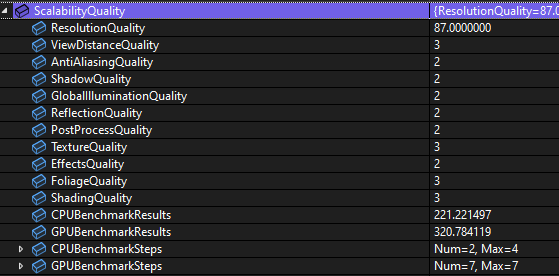

# 游戏设置

## Lyra 游戏设置框架

## 功能实现

### 设置游戏亮度

```cpp
if (GEngine)
{
    GEngine->DisplayGamma = DisplayGamma;
}
```

> 原理是直接设置显示 Gamma 值

### 垂直同步

```cpp
int32 VSyncValue = 0;
if (GConfig->GetInt(*ConfigSection, TEXT("r.Vsync"), VSyncValue, GEngineIni))
{
    // VSync was already set by system settings. We are capable of setting it here.
}
else
{
    static auto CVar = IConsoleManager::Get().FindConsoleVariable(TEXT("r.VSync"));
    CVar->Set(IsVSyncEnabled(), ECVF_SetByGameSetting);
}
```

### 渲染质量设置

```cpp
struct FQualityLevels
{
    float ResolutionQuality;           // 渲染分辨率比例
    int32 ViewDistanceQuality;         // 视距与 LOD 策略质量
    int32 AntiAliasingQuality;         // 抗锯齿质量与算法选择
    int32 ShadowQuality;               // 阴影质量
    int32 GlobalIlluminationQuality;   // 全局光照质量   
    int32 ReflectionQuality;           // 反射质量
    int32 PostProcessQuality;          // 整体后期处理质量
    int32 TextureQuality;              // 纹理质量
    int32 EffectsQuality;              // 特效质量
    int32 FoliageQuality;              // 植被质量
    int32 ShadingQuality;              // 着色质量/材质特性复杂度

    float CPUBenchmarkResults;         // CPU 基准测试的汇总得分 自动画质选择时作为依据
    float GPUBenchmarkResults;         // GPU 基准测试的汇总得分 
    TArray<float> CPUBenchmarkSteps;   // 基准测试的分步骤结果（通常是每个子场景/子任务的耗时或得分）
    TArray<float> GPUBenchmarkSteps;   // 基准测试的分步骤结果（通常是每个子场景/子任务的耗时或得分）
};
```



### 全屏、窗口

```cpp
int32 Mode = NewFullscreenMode == EWindowMode::Fullscreen ? 0 : 1;
auto CVar = IConsoleManager::Get().FindConsoleVariable(TEXT("r.FullScreenMode"));
if (CVar)
{
    CVar->Set(Mode, ECVF_SetByGameSetting);
}
```

### 设置分辨率

- `InResolutionX` 目标窗口的 Width
- `InResolutionY` 目标窗口的 Height
- `InWindowMode` 窗口模式： 全屏、全屏窗口、窗口模式

```cpp
FSystemResolution::RequestResolutionChange(InResolutionX, InResolutionY, InWindowMode);
```

也可以直接继承 `UGameUserSettings`，调用 `UGameUserSettings::SetScreenResolution` 函数
