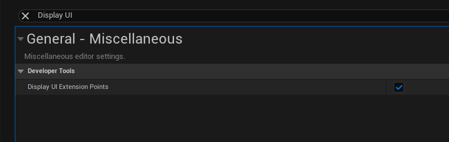
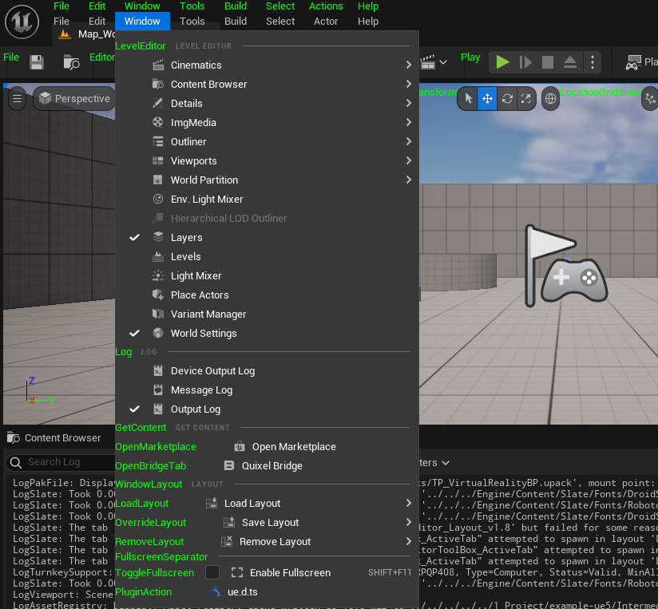

# 编辑器扩展

## 添加按钮

[编辑器扩展：自定义菜单栏](https://supervj.top/2021/08/09/%E7%BC%96%E8%BE%91%E5%99%A8%E6%89%A9%E5%B1%95%EF%BC%9A%E8%87%AA%E5%AE%9A%E4%B9%89%E8%8F%9C%E5%8D%95%E6%A0%8F/)

以前面这篇文章为例，常见的添加按钮的方式有两种 `FExtender` 和 `UToolMenus`

`FExtender` 可以实现 3 种类型的扩展，`UToolMenus` 较新。编辑器界面的 UI 扩展点在 C++ 中叫做拓展挂钩(`Extension Hook`)，在定义编辑器界面时经常要使用到用于定位拓展内容的**插槽**

在 `Editor Preferences` 中先打开 `Display Ui Extension Points` 可以显示插槽点名称

| 设置 | 效果 |
| --- | --- |
|  |  |

在 `Config/DefaultEditorPerProjectUserSettings.ini` 文件中添加如下部分，可以查看一些界面的调试信息

```ini
[/Script/UnrealEd.EditorExperimentalSettings]
bEnableEditToolMenusUI=True
```

> 最好添加到文件最上面


在 `Window` 窗口中选择开 `Enable Menu Edition` 即可开启调试


```cpp
UToolMenu* AddMenu = UToolMenus::Get()->ExtendMenu("LevelEditor.LevelEditorToolBar.AssetsToolBar");
FToolMenuSection& Section = AddMenu->FindOrAddSection("Content");

Section.AddMenuEntry("OpenTestEditTab",
    LOCTEXT("OpenBridgeTab_Label", "Test Edit Label"),
    LOCTEXT("OpenBridgeTab_Desc", "Test Edit Desc."),
    FSlateIcon(TEXT("BridgeStyle"), "Bridge.MenuLogo"),
    FUIAction(FExecuteAction::CreateRaw(this, &FTestEditModule::CreateWindow), FCanExecuteAction())
).InsertPosition = FToolMenuInsert("ImportContent", EToolMenuInsertType::After);
```

上述代码通过 `LevelEditor.LevelEditorToolBar.AssetsToolBar` 字符找到对应的 `UToolMenu` 


然后获得名为 `Content` 的 `Section`，接下来可以向其中添加 `MenuEntry` 了

