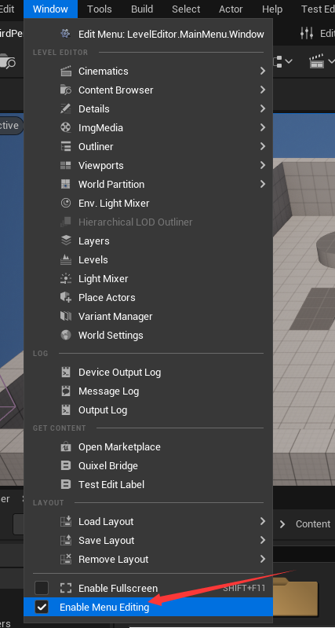
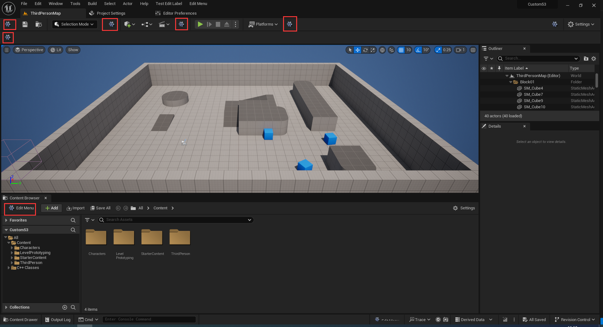
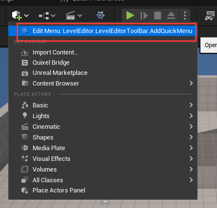
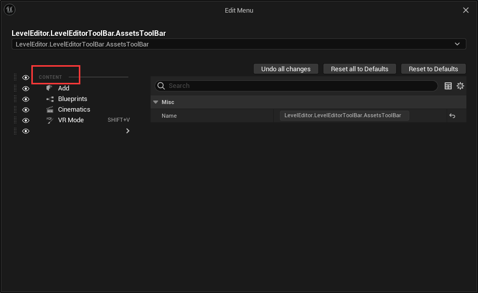

# 编辑器扩展

## 添加按钮

在 `Config/DefaultEditorPerProjectUserSettings.ini` 文件中添加如下部分，可以查看一些界面的调试信息

```ini
[/Script/UnrealEd.EditorExperimentalSettings]
bEnableEditToolMenusUI=True
```

> 最好添加到文件最上面



在 `Window` 窗口中选择开 `Enable Menu Edition` 即可开启调试




```cpp
UToolMenu* AddMenu = UToolMenus::Get()->ExtendMenu("LevelEditor.LevelEditorToolBar.AssetsToolBar");
FToolMenuSection& Section = AddMenu->FindOrAddSection("Content");

Section.AddMenuEntry("OpenTestEditTab",
    LOCTEXT("OpenBridgeTab_Label", "Test Edit Label"),
    LOCTEXT("OpenBridgeTab_Desc", "Test Edit Desc."),
    FSlateIcon(TEXT("BridgeStyle"), "Bridge.MenuLogo"),
    FUIAction(FExecuteAction::CreateRaw(this, &FTestEditModule::CreateWindow), FCanExecuteAction())
).InsertPosition = FToolMenuInsert("ImportContent", EToolMenuInsertType::After);
```

上述代码通过 `LevelEditor.LevelEditorToolBar.AssetsToolBar` 字符找到对应的 `UToolMenu` 





然后获得名为 `Content` 的 `Section`，接下来可以向其中添加 `MenuEntry` 了