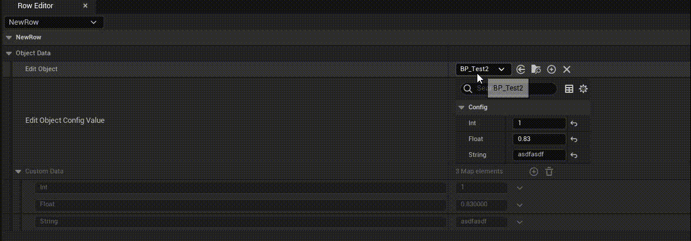

# 自定义细节面板

[《调教UE5：编辑器拓展指南》开篇及索引](https://zhuanlan.zhihu.com/p/604684703)

> 上面的文章解释了很多 Unreal 的扩展方式，包括提示消息、自定义细节面板、自定义数据类型、自定义世界大纲、自定义图标编辑器等

## 自定义细节面板

### 功能分析



目前需要一个结构体，结构体中有一个属性可以配置指定类型的类，将其指定类型的类的属性显示到一个 `Map` 中

根据前面的展示效果，需要两个事件

1. `EditObject` 属性变化事件
2. `Edit Object Config View` 显示对象的属性变化事件

### 面板显示

一般来说自定义细节面板是有着固定套路的

需要准备两个东西：对象类、自定义细节面板类，在模块加载的时候将对象类与自定义细节面板类关联起来

```cpp
USTRUCT(BlueprintType)
struct CUSTOMDATATABLERUNTIME_API FObjectData
{
	GENERATED_USTRUCT_BODY()

public:

	UPROPERTY(BlueprintReadWrite, EditAnywhere)
	TSoftClassPtr<class UEditObject> EditObject;

	UPROPERTY(BlueprintReadWrite, EditAnywhere)
	TMap<FString, FString> CustomData;
};

USTRUCT(BlueprintType)
struct CUSTOMDATATABLERUNTIME_API FEditData : public FTableRowBase
{
	GENERATED_USTRUCT_BODY()

public:

	// 自定义Object
	UPROPERTY(BlueprintReadWrite, EditAnywhere)
	FObjectData ObjectData;
};

/**
 * 
 */
UCLASS(BlueprintType, Blueprintable)
class CUSTOMDATATABLERUNTIME_API UEditObject : public UObject
{
	GENERATED_BODY()
};
```

以上述代码为例，`public FTableRowBase` 的结构体能够生成为 `DataTable` 表，表编辑的对象是 `FObjectData` 对象

`FObjectData` 中可以配置 `EditObject`，也就是能够选择继承自 `UEditObject` 的类，并将设置的属性值设置到 `CustomData` 映射表中


如上图所示，设置面板不仅 `CustomData` 不可手动修改，并且增加了一个名为 `Edit ObjectCOnfig Value` 的修改面板，其内容对应的就是 `BP_Test` 中的内容

前面这些代码写在 `Runtime` 模块中，因为这些结构体在游戏时会用到，对应的编辑界面则写在 `Editor` 模块中

根据 `Unreal` 自定义细节面板的套路，新建一个类 `FEditObjectCustomization` 继承自 `IPropertyTypeCustomization`，并且通过 `RegisterCustomPropertyTypeLayout` 将 `ObjectData` 与 `FEditObjectCustomization` 关联起来

由于细节面板需要模块加载的时候注册，在模块卸载的时候注销，所以在 `StartupModule` 中编写注册逻辑

```cpp
void FCustomDataTableModule::StartupModule()
{
	static FName PropertyEditor("PropertyEditor");
	FPropertyEditorModule& PropertyModule = FModuleManager::GetModuleChecked<FPropertyEditorModule>(PropertyEditor);
	PropertyModule.RegisterCustomPropertyTypeLayout("ObjectData", FOnGetPropertyTypeCustomizationInstance::CreateStatic(&FEditObjectCustomization::MakeInstance));
}
```

> 这里注册的 `ObjectData` 起始就是需要自定义细节面板的 `FObjectData` 结构体不要前面的 `F`

注册完毕之后，需要关注的就是 `FEditObjectCustomization` 类了，这个是实现自定义系界面面板的主要类

```cpp
class FEditObjectCustomization : public IPropertyTypeCustomization
{
public:
	static TSharedRef<IPropertyTypeCustomization> MakeInstance();

	FEditObjectCustomization() {}
	
	/** IPropertyTypeCustomization instance */
	virtual void CustomizeHeader(TSharedRef<IPropertyHandle> StructPropertyHandle, FDetailWidgetRow& HeaderRow, IPropertyTypeCustomizationUtils& StructCustomizationUtils) override;
	virtual void CustomizeChildren(TSharedRef<IPropertyHandle> StructPropertyHandle, IDetailChildrenBuilder& StructBuilder, IPropertyTypeCustomizationUtils& StructCustomizationUtils) override;

}
```

需要自己实现的就是有三个函数 `MakeInstance`、`CustomizeHeader`、`CustomizeChildren`

根据 `RegisterCustomPropertyTypeLayout` 函数可以推理出，当需要显示 `ObjectData` 时，会调用 `FEditObjectCustomization::MakeInstance` 函数获得面板对象

至于 `CustomizeHeader` 函数，顾名思义可以用来自定义头，一般来说不做什么操作直接显示 `Title` 就行了

```cpp
void FEditObjectCustomization::CustomizeHeader(TSharedRef<IPropertyHandle> StructPropertyHandle, FDetailWidgetRow& HeaderRow, IPropertyTypeCustomizationUtils& StructCustomizationUtils)
{
	const bool bDisplayResetToDefault = false;
	// const FText DisplayNameOverride = FText::GetEmpty();
	// const FText DisplayToolTipOverride = FText::GetEmpty();

	const FText DisplayNameOverride = FText::FromString(TEXT("DisplayNameOverride"));
	const FText DisplayToolTipOverride = FText::FromString(TEXT("DisplayToolTipOverride"));

	HeaderRow
		.NameContent()
		[
			StructPropertyHandle->CreatePropertyNameWidget(DisplayNameOverride, DisplayToolTipOverride, bDisplayResetToDefault)
		];
}
```


> 为了表示 `Header` 的作用这里设置了 `DisplayNameOverride` 的值，最简单的就可以像代码中的注释内容一样，直接设置为 `FText::GetEmpty()`

`CustomizeChildren` 说白了就是自定义细节面板的主要内容

| 参数 | 说明 |
| --- | --- |
| TSharedRef<IPropertyHandle> StructPropertyHandle | 属性的句柄，用于操作属性值和获取属性信息 |
| FDetailWidgetRow& StructBuilder | 用于构建自定义头部行的 UI |
| IPropertyTypeCustomizationUtils& StructCustomizationUtils | 提供了一些辅助功能，如刷新面板等 |

根据上面的解释，对于 `StructPropertyHandle` 和 `StructBuilder` 可以这么使用

```cpp
TSharedPtr<IPropertyHandle> EditObjectHandle = StructPropertyHandle->GetChildHandle(GET_MEMBER_NAME_CHECKED(FObjectData, EditObject));
StructBuilder.AddProperty(EditObjectHandle.ToSharedRef());
	
// 编辑回调
EditObjectHandle->SetOnPropertyValueChanged(FSimpleDelegate::CreateRaw(this, &FEditObjectCustomization::OnEditObjectChanged));

// 自定义数据仅查看
TSharedPtr<IPropertyHandle> CustomDataHandle = StructPropertyHandle->GetChildHandle(GET_MEMBER_NAME_CHECKED(FObjectData, CustomData));
StructBuilder.AddProperty(CustomDataHandle.ToSharedRef()).IsEnabled(false);
```

通过 `StructPropertyHandle` 获得指定属性的 `Handle`，再将其该属性添加到 `StructBuilder` 中，`StructBuilder` 会根据 `AddProperty` 创建并添加对应属性的细节面板

通过上面四行代码就可以将 `FObjectData::EditObject` 和 `FObjectData::CustomData` 两个属性设置添加到细节面板中

> `SetOnPropertyValueChanged` 可以设置属性修改的回调函数，通过这个回调可以设置其他属性的内容


然后是根据选择的类，显示对应的细节面板，也就是 `Edit Object Config Value` 那一栏

这里可以直接使用 `FDetailsViewArgs`，该对象能够直接使用

```cpp
// 创建属性编辑器
FPropertyEditorModule& PropertyEditorModule = FModuleManager::LoadModuleChecked<FPropertyEditorModule>("PropertyEditor");

FDetailsViewArgs DetailsViewArgs;
DetailsViewArgs.NameAreaSettings = FDetailsViewArgs::HideNameArea;
DetailsView = PropertyEditorModule.CreateDetailView(DetailsViewArgs);

// 设置属性可见性，分组在 Config 的才可以编辑
DetailsView->SetIsPropertyVisibleDelegate(FIsPropertyVisible::CreateLambda([](const FPropertyAndParent& PropertyAndParent)
{
	const FString* Category = PropertyAndParent.Property.FindMetaData(TEXT("Category"));
	const FString* OwnerCategory = PropertyAndParent.Property.GetOwnerProperty()->FindMetaData(TEXT("Category"));
	if ((Category && Category->Equals("Config")) || (OwnerCategory && OwnerCategory->Equals("Config")))
	{
		return true;
	}

	return false;
}));

// 绑定属性改变回调
DetailsView->OnFinishedChangingProperties().AddRaw(this, &FEditObjectCustomization::OnEditObjectPropertyChanged);
```

> 通过 `SetIsPropertyVisibleDelegate` 可以传入设置属性是否可见的回调函数
> 通过 `OnFinishedChangingProperties` 绑定对应的对象属性修改的时候会触发 `OnEditObjectPropertyChanged` 回调，因为我们需要将修改的内容写入到 `CustomData` 中

创建出 `FDetailsViewArgs` 之后，通过 `SetObject` 将其与 `FObjectData::EditObject` 指定类的对象进行绑定

```cpp
FString Path;
EditObjectHandle->GetPerObjectValue(0, Path);
auto DefaultValue = LoadClass<UObject>(nullptr, *Path);
auto ObjectClass = Cast<UClass>(DefaultValue);
if (IsValid(ObjectClass))
{
	EditObject = NewObject<UObject>(GetTransientPackage(), ObjectClass);
	// 重建属性 将对象的属性设置到 FObjectData::CustomData 中
	BuildObjectProperty();
	// 设置编辑对象
	DetailsView->SetObject(EditObject.Get(), true);
}
```

最后需要将对应的 Slate 布局添加到 `FObjectData` 细节面板中

```cpp
StructBuilder.AddCustomRow(LOCTEXT("EditObject", "EditObject"))
	.NameContent()
	[
		SNew(SBox)
		.Padding(FMargin(0.0f, 2.0f))
		.VAlign(VAlign_Center)
		.HAlign(HAlign_Left)
		[
			SNew(STextBlock)
			.Text(FText::FromString("Edit Object Config Value"))
		]
	]
	.ValueContent()
	[
		DetailsView.ToSharedRef()
	];
```
