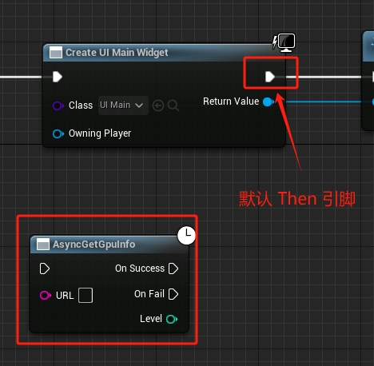

# 异步节点

自定义蓝图异步节点，最简单的方式是继承 `UBlueprintAsyncActionBase`

使用 `UFUNCTION` 定义一个 `BlueprintCallable` 的 `static` 函数作为入口函数

使用 `DELETAGE` 定义回调事件，作为出口节点，事件的参数就是节点的返回值

```cpp
DECLARE_DYNAMIC_MULTICAST_DELEGATE_OneParam(FOnRequestGPUInfoSuccess, int, Level);
DECLARE_DYNAMIC_MULTICAST_DELEGATE_OneParam(FOnRequestGPUInfoFail, int, Level);

UCLASS(meta = (HideThen = true))
class GPUINFO_API UGetGpuInfo : public UBlueprintAsyncActionBase
{
	GENERATED_BODY()

public:
	UPROPERTY(BlueprintAssignable)
	FOnRequestGPUInfoSuccess OnSuccess;
	
	UPROPERTY(BlueprintAssignable)
	FOnRequestGPUInfoFail OnFail;
	
	UFUNCTION(BlueprintCallable, meta=( BlueprintInternalUseOnly="true", WorldContext = "InWOrldContext", DisplayName = "AsyncGetGpuInfo"))
	static UGetGpuInfo* CreateAsyncNode(UObject* InWorldContext, const FString& URL);
}
```



> `UCLASS(meta = (HideThen = true))` 隐藏了默认的 `Then` 引脚

```cpp
UGetGpuInfo* UGetGpuInfo::CreateAsyncNode(UObject* InWorldContext, const FString& URL)
{
	UGetGpuInfo* DownloadTask = NewObject<UGetGpuInfo>();
	DownloadTask->Start(URL);
	return DownloadTask;
}
```

直接在 `static` 入口函数中创建对象，然后执行对应启动函数即可，在合适的时候 `Broadcast` 对应的事件即可

