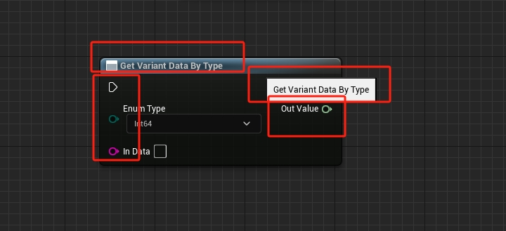
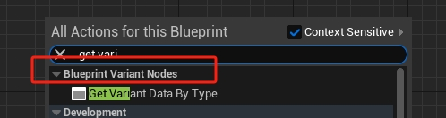
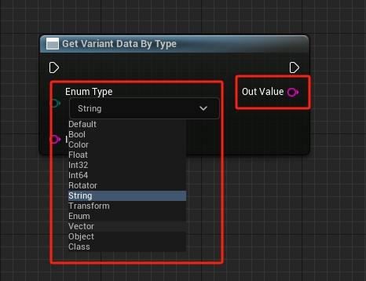

# K2Node

## 表现效果



以上图为例，一个蓝图节点从外观上看有四个部分

1. 节点名称 `Node Title`
2. 节点功能提示 `Tool Tip`
3. 节点的输入节点
4. 节点的输出节点

所以 `UK2Node` 提供了一些函数能够表现出这些内容

| 函数名 | 作用 |
| --- | --- | 
| AllocateDefaultPins() | 在这个函数中，你将为你的节点分配默认的输入和输出引脚 |
| GetMenuActions() | 这个函数用于将你的自定义节点添加到蓝图编辑器的节点菜单中 |
| GetNodeTitle() | 返回节点在蓝图编辑器中显示的标题 |
| GetTooltipText() | 提供当鼠标悬停在节点上时显示的工具提示文本 |
| GetMenuCategory() | 定义节点在菜单中的分类 |
| ExpandNode() | 如果你的节点需要在编译时执行特殊的行为，你可以在这个函数中实现 |

设置节点的 `Title` 和 `Tip`

```cpp
FText GetTooltipText() const override { return FText::FromString(TEXT("a custom node")); }
FText GetNodeTitle(ENodeTitleType::Type TitleType) const override { return 	FText::FromString(TEXT("Get Variant Data By Type")); }
```

使用 `AllocateDefaultPins` 来创建节点的输入输出针脚

```cpp
#define EnumPinName TEXT("Enum Type")
#define OutputPinName TEXT("Out Value")
#define InputPinName TEXT("In Data")

void UVariantNode::AllocateDefaultPins()
{
	// 获取关联的枚举类型
	EnumType = FindObject<UEnum>(ANY_PACKAGE, *VariantHelper::EnumName);

	// Create the output pin
	CreatePin(EGPD_Output, UEdGraphSchema_K2::PC_Exec, UEdGraphSchema_K2::PN_Then);
	CreatePin(EGPD_Output, UEdGraphSchema_K2::PC_Wildcard, OutputPinName);

	// Create the input pin
	CreatePin(EGPD_Input, UEdGraphSchema_K2::PC_Exec, UEdGraphSchema_K2::PN_Execute);
	CreatePin(EGPD_Input, UEdGraphSchema_K2::PC_Byte, EnumType, EnumPinName);
	CreatePin(EGPD_Input, UEdGraphSchema_K2::PC_String, InputPinName);
}
```



重写 `GetMenuCategory` 可以设置节点所属类型

```cpp
FText GetMenuCategory() const override { return FText::FromString(TEXT("BlueprintVariantNodes")); }
```

### 功能实现



这个节点的作用能够根据输入的 `Enum Type` 类型，能够修改 `Out Value` 输出类型

当输入针脚的值发生改变的时候会触发 `PinDefaultValueChanged` 函数，该函数定义在 `UK2Node` 的父类 `UEdGraphNode` 中

```cpp
UENUM(BlueprintType)
enum class EPARMS_TYPE :uint8
{
	EPARMS_TYPE_DEFAULT = 0					UMETA(DisplayName = "Default"),

	EPARMS_TYPE_BOOL = 2					UMETA(DisplayName = "Bool"),

	EPARMS_TYPE_COLOR = 6					UMETA(DisplayName = "Color"),

	EPARMS_TYPE_FLOAT = 10					UMETA(DisplayName = "Float"),
}

void UVariantNode::PinDefaultValueChanged(UEdGraphPin * Pin)
{
	if (Pin->PinName == EnumPinName)                   
	{
		// 获取当前枚举类型
		EPARMS_TYPE Type = (EPARMS_TYPE)EnumType->GetValueByName(FName(*Pin->DefaultValue));

		// 找到输出节点
		UEdGraphPin* OutputPin = FindPin(OutputPinName);

		// 修改输出节点的类型
		switch (Type)
		{
		case EPARMS_TYPE::EPARMS_TYPE_BOOL:
		{
			OutputPin->PinType.PinSubCategoryObject = nullptr;
			OutputPin->PinType.PinCategory = UEdGraphSchema_K2::PC_Boolean;
		}
		break;
        
		case EPARMS_TYPE::EPARMS_TYPE_COLOR:
		{
			OutputPin->PinType.PinSubCategoryObject = TBaseStructure<FColor>::Get();
			OutputPin->PinType.PinCategory = UEdGraphSchema_K2::PC_Struct;
		}
		break;
		case EPARMS_TYPE::EPARMS_TYPE_FLOAT:
		{
			OutputPin->PinType.PinSubCategoryObject = nullptr;
			OutputPin->PinType.PinCategory = UEdGraphSchema_K2::PC_Float;
		}
		break;
        }
    }
}
```

> 通过 `Pin->PinName` 可以判断是否是指定的针脚值被修改
> 根据 `FindPin(OutputPinName)` 可以通过名称获得指定的针脚

至于 `GetMenuActions` 函数就比较套路了，写法比较统一

```cpp
void UVariantNode::GetMenuActions(FBlueprintActionDatabaseRegistrar & ActionRegistrar) const
{
	UClass* ActionKey = GetClass();

	if (ActionRegistrar.IsOpenForRegistration(ActionKey))
	{
		UBlueprintNodeSpawner* NodeSpawner = UBlueprintNodeSpawner::Create(GetClass());
		check(NodeSpawner != nullptr);

		ActionRegistrar.AddBlueprintAction(ActionKey, NodeSpawner);
	}
}
```

然后就是真正功能实现的地方 `ExpandNode` 函数

```cpp
// 绑定的函数的名称
FName FunctionName;

UEnum* CurrentEnumType = FindObject<UEnum>(ANY_PACKAGE, *VariantHelper::EnumName);
EPARMS_TYPE Type = (EPARMS_TYPE)CurrentEnumType->GetValueByName(FName(*EnumPin->DefaultValue));

// 绑定函数
switch (Type)
{
case EPARMS_TYPE::EPARMS_TYPE_BOOL:
    FunctionName = GET_FUNCTION_NAME_CHECKED(UVariantHelper, GetBool);
    break;
// ....
// ....
// ....
}

// 创建一个函数节点
UK2Node_CallFunction* CallFuncNode = CompilerContext.SpawnIntermediateNode<UK2Node_CallFunction>(this, SourceGraph);
CallFuncNode->FunctionReference.SetExternalMember(FunctionName, UVariantHelper::StaticClass());
CallFuncNode->AllocateDefaultPins();

// 执行操作替换
CompilerContext.MovePinLinksToIntermediate(*ExecPin, *(CallFuncNode->GetExecPin()));
CompilerContext.MovePinLinksToIntermediate(*ThenPin, *(CallFuncNode->GetThenPin()));

// 输入和输出替换
FName Name = UEdGraphSchema_K2::PC_String;
CompilerContext.MovePinLinksToIntermediate(*InputPin, *(*CallFuncNode->Pins.FindByPredicate([Name](const UEdGraphPin* EdGraphPin)
{
    return EdGraphPin->PinType.PinCategory == Name;
})));
CompilerContext.MovePinLinksToIntermediate(*OutputPin, *(CallFuncNode->GetReturnValuePin()));

// 断开自身所有链接
BreakAllNodeLinks();
```

上面代码分为三个部分

1. 根据指定参数类型选择需要绑定的函数 `GET_FUNCTION_NAME_CHECKED(UVariantHelper, GetBool)`
2. 创建中间节点，并绑定指定函数 `CompilerContext.SpawnIntermediateNode<UK2Node_CallFunction>(this, SourceGraph)`
3. 将本节点的针脚移动到新创建的中间节点 `CompilerContext.MovePinLinksToIntermediate`

所以可以这么理解，继承 `UK2Node` 实现的节点仅用于显示，真正功能实现的是新创建的中间节点 `UK2Node_CallFunction`，然后将连接在 `UK2Node` 上的针脚移动到中间节点上，再有中间节点去执行指定的函数，得到最终的结果

# KNode_CallFunction

| 函数名 | 作用 |
| --- | --- |
| AllocateDefaultPins() | 为你的节点分配默认的输入和输出引脚 | 
| GetMenuActions() | 将你的节点添加到蓝图编辑器的节点菜单中 | 
| GetTooltipText() | 提供节点的工具提示文本 | 
| GetMenuCategory() | 定义节点在菜单中的分类 | 
| GetMenuActions() | 这个函数用于将你的自定义节点添加到蓝图编辑器的节点菜单中 | 
| IsNodePure() | 是否是纯函数 |

