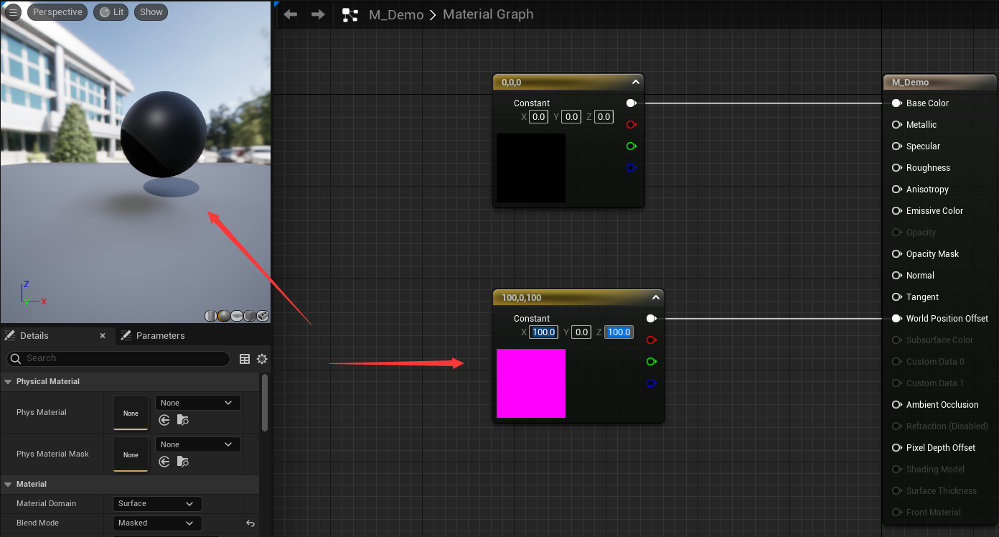
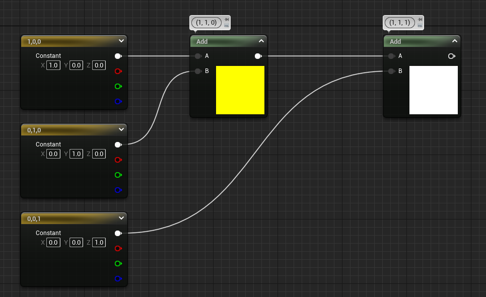
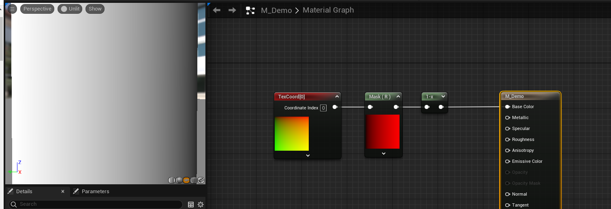

# 材质

## 简单介绍

### 材质的输出

> 简单输入控制

| 参数名称 | 作用 |
| --- | --- |
| Base Color | 控制材质表面漫反射颜色 |
| Metallic | 金属值，参数 0~1，1表示金属材质 |
| Specular | 高光度，参数 0~1，默认值 0.5，为0表示没有高光 |
| Roughness | 粗糙度，参数 0~1，值越高越粗糙，越低表面越平滑，对金属来说就是值越低越像镜子一样，值越高反射效果越差 |
| Anisotropy | 各向异性，参数 0~1，可以控制高光形状，默认高光是圆形的 |
| Emissive Color | 自发光颜色，控制材质的发光程度 |
| Opacity | 不透明度，参数 0~1，默认不开启，需要设置混合模式(Blend Mode) 为半透明(Translucent)可开启 |
| Opacity Mask | 不透明遮罩，一般用于带透明通道的贴图，默认不开启，需要设置混合模式(Blend Mode) 为已遮罩(Masked) |
| Normal | 法线贴图，通过设置法线贴图可以得到凹凸纹理效果 |
| Tangent | 切线，参数为 Vector3，用于控制高光旋转 |
| World Position Offset | 全局位置偏移，通过调节材质可以修改被赋予材质的模型在空间中的位置 |
| Subsurface Color | 次表面颜色，大概理解为透光效果，比如水晶的透光效果等，默认不开启，需要设置着色模型(Shading Model) 为 次表面 (Subsurface) |
| Ambient Occlusion | 环境光遮挡，用来输入AO贴图，模拟物体之间所产生的阴影，在不打光的时候增加体积感。 也就是完全不考虑光线，单纯基于物体与其他物体越接近的区域，受到反射光线的照明越弱这一现象来模拟现实照明（的一部分）效果。一般用于控制模型与模型的接缝处 |
| Refraction | 折射，一般用于玻璃材质 |
| Pixel Depth Offset | 像素深度偏移 |

材质各个参数的测试案例

- Base Color 基础颜色

- Metallic 金属值

| 值为0 | 值为1 |
| --- | --- |
|  |  |

- Specular 高光度，默认值为 0.5

| 值为0 | 值为 0.5 | 值为1 |
| --- | --- | --- |
|  |  |  |

- Roughness 粗糙度

| 值为0 | 值为1 |
| --- | --- |
|  |  |

- Anisotropy 各向异性

| 值为0 | 值为0.7 | 值为1 |
| --- | --- | --- |
|  |  |  |

- Tangent 切线

| 值为 (1, 0, 0) | 值为 (0, 1, 0) | 值为 (1, 1, 0)  |
| --- | --- | --- |
|  |  |  |

- Emissive Color 自发光颜色

| 值为0 | 值为10 | 值为100 |
| --- | --- | --- |
|  |  |  |

- Opacity 不透明度

| 值为0 | 值为0.5 | 值为1 |
| --- | --- | --- |
|  |  |  |

- Opcatiy Mask 不透明遮罩

| 不设置 Opacity Mask | 设置 Opacity Mask | 
| --- | --- | 
|  |  |

- Normal 法线贴图

| 不设置 Normal | 设置 Normal | 
| --- | --- | 
|  |  |

- World Position Offset 全局位置偏移

| 值为 (0, 0, 0) | 值为 (100, 0, 0) | 值为 (100, 0, 100)  |
| --- | --- | --- |
|  |  |  |

> 明明可以直接修改场景 Actor 坐标为什么还需要一个 World Position Offset 呢？因为一些“动态”材质需要修改模型外貌，比如随风飘动的旗帜

### 材质的分类

根据材质的作用不同，将材质分为六大类，在材质预设(Material Domain)中可以看到

| 材质预设 | 作用 |
| --- | --- | 
| Surface | 表面材质，对场景对象赋予表面质感的效果。包括透明材质、半透明材质、次表面材质、皮肤材质、布料材质等。这种材质域可以在3D场景中对物体表面进行着色、贴图和照明计算。Surface材质可以用于渲染静态网格、角色模型和许多其他场景元素 |
| Deferred Decal | 延迟贴画，属于投射材质，可以将调整好的材质效果投影到材质表面。延迟贴花是一种在渲染管线的最后阶段应用的效果，它可以通过在表面上贴上透明的纹理来添加细节。延迟贴花在游戏中常用于添加弹痕、血迹或其他动态效果 |
| Light Function | 光照函数，用于灯光处理。它允许开发者使用自定义的数学函数来修改场景中的光照。这种材质域通常用于在特定区域或特定对象上创建独特的光照效果，如光晕、投影或特殊的光照形状 |
| Volume | Volume材质域用于渲染体积效果，如雾、烟雾、云等。这种材质域允许开发者在三维空间中创建逼真的体积效果，并对光线进行散射和吸收，从而产生逼真的光照和阴影效果 |
| Post Process | 后处理(Post Process)材质域用于对整个场景进行后期处理效果的应用。开发者可以使用这种材质域在渲染管线的最后一步应用各种效果，如色彩校正、模糊、曝光调整等，以实现特定的视觉效果 |
| User Interface | User Interface材质域用于渲染游戏界面中的用户界面元素。这种材质域通常用于渲染按钮、文本、图标等UI元素，以及为交互元素添加特效和动画 |

### 纹理介绍

纹理可以让材质增加更多的细节，看起来更加真实

通常情况下，**纹理尺寸**长宽必须是 2 的幂数，最大不超过 8192*8192。不使用这些尺寸的纹理也是可以导入的，初看之下可能没有问题，但这类纹理不会生成多级渐进纹理(`mipmap`)

> PC 显卡支持的最大纹理就是 8192，手机好像是 4096 

UE 支持的 **纹理格式** 有：bmp、float、jpeg、jpg、pcx、png、psd、tga、Cubmap or 2D、dds、HDR、exr、TIFF、tif

虚幻引擎从 4.21 版本之后支持 3D Texture，需要使用 VolumeTexture 来进行转换

虚幻引擎从 4.23 版本开始支持虚拟纹理。利用虚拟纹理可以在运行时以更低内存占有率和更高一致性创建和使用大尺寸纹理

虚幻引擎还支持一些材质软件所完成的材质导入(比如: Substance Designer)，可以通过官方插件进行转换

## 数据运算

### 加减乘除

> 虚幻材质中，颜色的范围是 0~1

| 三维数据的加法 | 三维数据的乘法 | 三维数据的减法 | 三维数据的除法 |
| --- | --- | --- | --- |
|  |  |   |  |

> 二维数据和一维数据同理

在材质中**一维数据**可以和其他**多维数据**进行加减乘除操作，但是二维数据无法与三位数据进行加减乘除

如果对两张图片进行四则运算操作

- 两张图片相加：图片会变得更加明亮，黑色为0，白色为1，不存在负数，所以相加的结果会更加白
- 两张图片相减：图片会变得更加暗，与加法同理，由于不存在负数所以相减结果会更加的暗
- 两张图片相乘：图片会变得相对更暗，由于数值都是 0~1 之间，所以相乘的结果会比原来更小，因此更暗
- 两张图片相除：图片会变得更亮，与乘法同理由于参数值为 0~1，所以相除的结果会比原来更大，因此更暗

这里顺便介绍一个节点 `Constant Bias Scale` （**常量偏差比例**），这个节点的作用很简单，就是将原来的数值加上 `Bias` 配置的数值然后乘以 `Scale` 的数值

以上图为例，原本的 `TexCoord` 的数组是从 0~1 的，加上 Bias 配置的 -0.5 之后，得到的是一个 -0.5~0.5 的数组，然后乘以 Scale 配置的 0.5，最后得到一个的是一个 -0.25~0.25 的数组，这也就最后左边预览显示的效果

### 线性插值

通过快捷键 **L + 鼠标左键** 即可得到一个线性插值节点

作用其实很简单就是将 输入口 A 的值 和 输入口 B 的值进行一个线性插值，比如这里是 `Alpha` 配置的是 0.5，其实就是 `A * (1 - 0.5) + B * 0.5`

对比 `(0.5, 0.5, 0)` 的颜色和材质最后的表现效果就知道

| Alpha 值为 0 | Alpha 值为 1 | Alpha 值为 1000 |
| --- | --- | --- |
|  |  |  |

通过上面设置 Alpha 值可以推理出该节点的运算是 `A * (1 - Alpha) + B * Alpha`

`Alpha` 的取值范围在 0~1 之间，再观察 `Alpha` 值为 1000 的表现效果，可以发现最后的结果很奇怪，所以尽量不要设置超过 `Alpha` 的取值范围的值

> Alpha 的值超过取值范围，打包可能报错

为了防止 Alpha 的值超过取值范围，可以使用 `Clamp` 节点来对值进行限制

`Clamp` 节点会要求设置最大值和最小值，然后根据输入返回指定区间内的值

除了 `Clamp` 节点之外，还可以使用 `Saturate` 节点，该节点会直接帮你将值设置到 0~1 的区间内

> `Saturate` 直接锁死了区间范围，所以其**性能消耗**会比 `Clamp` 低，所以在做材质优化的伤害可以考虑使用

使用图片的 Alpha 通道配合线性插值得到的表现效果

### 维度控制

材质中一共存在 4 种维度：一维、二维、三维、四维，数据是可以**维度升级**或者**维度降级**的

两个一维数据通过合并可以得到二维数据；二维数据可以输出两个一维数据

> **U + 鼠标左键** 可以快速生成纹理坐标节点

高维数据如果想要转换成低维数据，使用 `mask` 节点即可

如上图所示，通过 `ComponentMask` 节点可以将多维数据分解成多个一维数据，并选择所需的进行处理或者组合

如上图所示，通过 `append`、`append3` 和 `append4` 可以多个低维数据组合成高维数据

如上图所示，通过 `MakeFloat2`、`MakeFloat3` 和 `MakeFloat4` 直接创建对应维度的节点可以实现对应功能

### 色彩控制

想对某一张纹理图片进行色彩偏移的控制，只需要对纹理图片进行**加法**、**乘法**等操作即可

比如，希望图片更加偏红、减少蓝色，直接**加**`(0.1, 0, -0.1)`就可以得到，如下图所示

同理，乘法也可以达到类似的效果，如果直接乘以`(2, 2, 2)`那么图片整体变亮、如果乘以`(0.5, 0.5, 0.5)`那么图片整体变暗

| 乘以 `(2, 2, 2)` | 乘以 `(0.5, 0.5, 0.5)` |
| --- | --- |
|  |  | 

如果想要调整图片的**对比度**，一般有两种方法

- 方法1：使用 `Power` 节点

`Powner` 本身是幂运算

| 原图 | 调整图 |
| --- | --- |
|  |  |

可以看到图片整体变暗，因为颜色取值范围是 0~1 所以其幂运算后会更小或者不变

| 幂为1 | 幂为2 | 幂为10 |
| --- | --- | --- |
|  |  |  |

使用 UV 和 Power 节点可以发现分界线根据幂的值向右移动，这是因为 UV 节点的值从左到右是 0 到 1，幂值越大，结果越小，表现更黑

- 方法2：使用 `CheapContrast` 对比度材质函数

`CheapContrast_RGB` 是对三维数据进行操作、`CheapContrast` 是对一维数据进行操作

其 `Contrast` 是一个一维数据，用于表示程度，0表示无调整

| 原图 | 调整图 | Contrast参数为0 |
| --- | --- | --- |
|  |  |  |

可以看到图片亮的地方更亮，暗的地方更暗

| Contrast 值为 0 | Constrast 值为 1 | Constrast 值为 10 |
| --- | --- | --- |
|  |  |  |

通过上面的值变化导致的表现变化可以推测： `CheapContrast` 是以0.5为中心，小于0.5的通过该节点会更小；大于0.5的通过该节点会更大

> Power 是以 1 为中心，大于 1 的会更大；小于 1 的会更小

如果想对颜色进行一个**反色操作**（黑色变成白色）操作，其实很容易想到，那就是用 `1 - 指定颜色` 

> 上面图片变成左边白色、右边黑色

对于这种常见用 1 减去指定值的操作，UE 封装了一个快速节点，使用 **O + 鼠标左键** 即可快速创建 `1-x` 节点

