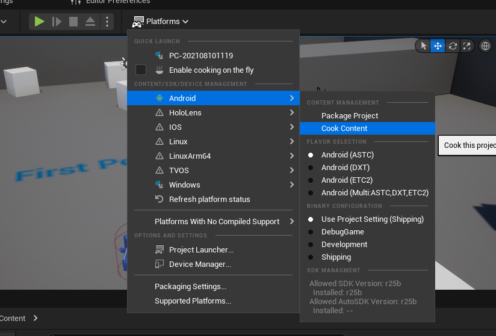
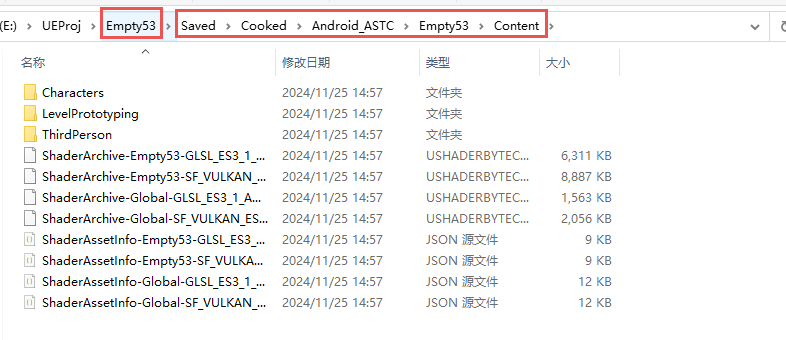
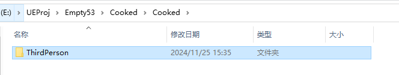
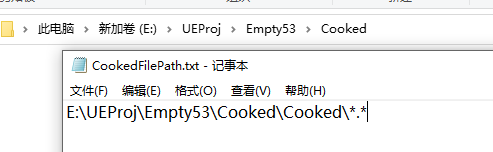
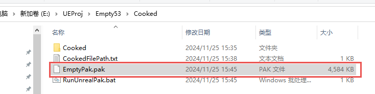
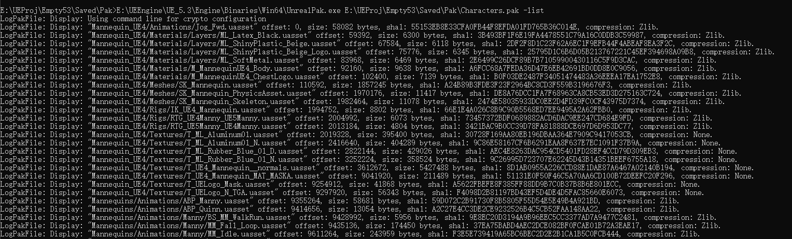

# UE的启动流程

[动态加载 PakFile](https://www.cnblogs.com/psklf/p/14778289.html)

在上述文章中简单介绍了一点 UE 的启动流程，大概在什么时候开始挂载 Pak 文件

## LaunchWindowsStartup

引擎从 `LaunchWindowsStartup` 函数开始，在解析完 `CmdLine` 并根据命令函参数进行属性设置之后，将 `CmdLine` 传入给 `GuardedMain` 函数

```cpp
// 在 LaunchWindowsStartup 根据 CmdLine 参数设置报错类型和全局变量

// If we're running in unattended mode, make sure we never display error dialogs if we crash.
if ( FParse::Param( CmdLine, TEXT("unattended") ) )
{
    SetErrorMode(SEM_FAILCRITICALERRORS | SEM_NOGPFAULTERRORBOX | SEM_NOOPENFILEERRORBOX);
}

if ( FParse::Param( CmdLine,TEXT("crashreports") ) )
{
    GAlwaysReportCrash = true;
}
```

## GuardedMain

在 `GuardedMain` 中

1. 根据 `CmdLine` 是否存在 `WaitForDebugger` 或者 `waitforattach` 参数决定是否要等待附加进程

```cpp
#if !(UE_BUILD_SHIPPING)
	// If "-waitforattach" or "-WaitForDebugger" was specified, halt startup and wait for a debugger to attach before continuing
	if (FParse::Param(CmdLine, TEXT("waitforattach")) || FParse::Param(CmdLine, TEXT("WaitForDebugger")))
	{
		while (!FPlatformMisc::IsDebuggerPresent())
		{
			FPlatformProcess::Sleep(0.1f);
		}
		UE_DEBUG_BREAK();
	}
#endif
```

2. 广播 `GetPreMainInitDelegate` 事件，通知即将开始 `EnginePreInit`

3. 创建 `EngineLoopCleanupGuard` 临时对象，`GuardedMain` 函数结束时对象被释放从而触发析构函数，进入出发 `EngineExit` 函数

```cpp
// make sure GEngineLoop::Exit() is always called.
struct EngineLoopCleanupGuard 
{ 
    ~EngineLoopCleanupGuard()
    {
        // Don't shut down the engine on scope exit when we are running embedded
        // because the outer application will take care of that.
        if (!GUELibraryOverrideSettings.bIsEmbedded)
        {
            EngineExit();
        }
    }
} CleanupGuard;
```


4. 触发 `EnginePreInit` 进入引擎预先初始化阶段

5. 根据 `GIsEditor` 判断是否是编辑器，分别进入 `EditorInit` 或者 `EngineInit` 真正初始化函数

```cpp
// 在 PreInit 中通过宏来设定 GIsEditor 的值
#if WITH_EDITORONLY_DATA
		GIsEditor = true;
#endif
```

6. 开始引擎的主循环

```cpp
if (!GUELibraryOverrideSettings.bIsEmbedded)
{
    while( !IsEngineExitRequested() )
    {
        EngineTick();
    }
}
```

7. 退出引擎时，根据 `GIsEditor` 来执行推出编辑器逻辑

```cpp
#if WITH_EDITOR
	if( GIsEditor )
	{
		EditorExit();
	}
#endif
```

## PreInit

```cpp
int32 EnginePreInit( const TCHAR* CmdLine )
{
	int32 ErrorLevel = GEngineLoop.PreInit( CmdLine );

	return( ErrorLevel );
}
```

`EnginePreInit` 本质就是调用 `GEngineLoop.PreInit`

```cpp
int32 FEngineLoop::PreInit(const TCHAR* CmdLine)
{
	const int32 rv1 = PreInitPreStartupScreen(CmdLine);
	if (rv1 != 0)
	{
		PreInitContext.Cleanup();
		return rv1;
	}

	const int32 rv2 = PreInitPostStartupScreen(CmdLine);
	if (rv2 != 0)
	{
		PreInitContext.Cleanup();
		return rv2;
	}

	return 0;
}
```

`PreInit` 分为两个粒度： `PreInitPreStartupScreen` 和 `PreInitPostStartupScreen`，也就是打开开始界面和打开开始界面后

### PreInitPreStartupScreen

1. 运行并清除延迟自动注册的委托

```cpp
FDelayedAutoRegisterHelper::RunAndClearDelayedAutoRegisterDelegates(EDelayedRegisterRunPhase::StartOfEnginePreInit);
```

2. 设置日志的主线程

```cpp
if (GLog)
{
    GLog->SetCurrentThreadAsPrimaryThread();
}
```

3. 解析命令行参数
4. 设置游戏标志

```cpp
#if UE_BUILD_DEVELOPMENT && defined(UE_BUILD_DEVELOPMENT_WITH_DEBUGGAME) && UE_BUILD_DEVELOPMENT_WITH_DEBUGGAME
FApp::SetDebugGame(true);
#endif
```

5. 注册平台特定的处理器

```cpp
#if PLATFORM_WINDOWS
FWindowsPlatformMisc::SetGracefulTerminationHandler();
#endif
```

6. 嵌入式应用程序的初始化

```cpp
#if BUILD_EMBEDDED_APP
FEmbeddedCommunication::Init();
FEmbeddedCommunication::KeepAwake(TEXT("Startup"), false);
#endif
```

7. 设置线程本地存储 TLS 缓存

```cpp
FMemory::SetupTLSCachesOnCurrentThread();
```

8. 设置 UTF-8 输出

```cpp
if (FParse::Param(CmdLine, TEXT("UTF8Output")))
{
    FPlatformMisc::SetUTF8Output();
}
```

9.  切换工作目录

```cpp
FPlatformProcess::SetCurrentWorkingDirectoryToBaseDir();
```

10. 从环境变量中获取额外的命令行参数

```cpp
#if !UE_BUILD_SHIPPING && WITH_EDITORONLY_DATA
FString Env = FPlatformMisc::GetEnvironmentVariable(TEXT("UE-CmdLineArgs")).TrimStart();
if (Env.Len())
{
    FCommandLine::Append(TEXT(" -EnvAfterHere "));
    FCommandLine::Append(*Env);
    CmdLine = FCommandLine::Get();
}
#endif
```

11. 设置游戏名称

```cpp
if (LaunchSetGameName(CmdLine, GameProjectFilePathUnnormalized) == false)
{
    return 1;
}
```

12. 初始化跟踪系统，用于性能分析和调试

```cpp
FTraceAuxiliary::Initialize(CmdLine);
FTraceAuxiliary::TryAutoConnect();
```

13. 根据命令行参数初始化低级内存管理系统，可能包括内存分析工具

```cpp
LLM(FLowLevelMemTracker::Get().ProcessCommandLine(CmdLine));
#if MEMPRO_ENABLED
FMemProProfiler::Init(CmdLine);
#endif
```

14. 注册垃圾回收和采样输入的回调

```cpp
#if WITH_ENGINE
FCoreUObjectDelegates::PostGarbageCollectConditionalBeginDestroy.AddStatic(DeferredPhysResourceCleanup);
#endif
FCoreDelegates::OnSamplingInput.AddStatic(UpdateGInputTime);
```

15. 初始化 IO 调度器

```cpp
#if USE_IO_DISPATCHER
if (FIoStatus Status = FIoDispatcher::Initialize(); !Status.IsOk())
{
    return 1;
}
#endif
```

16. 平台相关初始化

```cpp
    // platform specific initialization now that the SystemSettings are loaded
    FPlatformMisc::PlatformInit();
#if WITH_APPLICATION_CORE
    FPlatformApplicationMisc::Init();
#endif
    FPlatformMemory::Init();
```

17. 进入主线程、设置线程池

```cpp
if (bCreateTaskGraphAndThreadPools)
{
    // initialize task graph sub-system with potential multiple threads
    SCOPED_BOOT_TIMING("FTaskGraphInterface::Startup");
    FTaskGraphInterface::Startup(FPlatformMisc::NumberOfWorkerThreadsToSpawn());
    FTaskGraphInterface::Get().AttachToThread(ENamedThreads::GameThread);
}

if (FPlatformProcess::SupportsMultithreading() && bCreateTaskGraphAndThreadPools)
{
    // do some thing
}
```

18. 加载核心模块

```cpp
#if STATS
	FThreadStats::StartThread();
#endif

	FDelayedAutoRegisterHelper::RunAndClearDelayedAutoRegisterDelegates(EDelayedRegisterRunPhase::StatSystemReady);

	FScopeCycleCounter CycleCount_AfterStats(GET_STATID(STAT_FEngineLoop_PreInitPreStartupScreen_AfterStats));

	// Load Core modules required for everything else to work (needs to be loaded before InitializeRenderingCVarsCaching)
	{
		SCOPED_BOOT_TIMING("LoadCoreModules");
		if (!LoadCoreModules())
		{
			UE_LOG(LogInit, Error, TEXT("Failed to load Core modules."));
			return 1;
		}
	}
```

19. 配置文件读取和热修复

```cpp
if (bDumpEarlyConfigReads)
{
    UE::ConfigUtilities::RecordConfigReadsFromIni();
}

if (bDumpEarlyPakFileReads)
{
    RecordFileReadsFromPaks();
}

if(bWithConfigPatching)
{
    UE_LOG(LogInit, Verbose, TEXT("Begin recording CVar changes for config patching."));

    UE::ConfigUtilities::RecordApplyCVarSettingsFromIni();
}

UE::ConfigUtilities::ApplyCVarsFromBootHotfix();
```

20. 初始化渲染相关设置

```cpp
#if WITH_ENGINE
	extern ENGINE_API void InitializeRenderingCVarsCaching();
	InitializeRenderingCVarsCaching();
#endif
```

21. 初始化 Oodle, 加载 PreInit 模块

```cpp
// init Oodle here
FOodleDataCompression::StartupPreInit();

{
    SCOPED_BOOT_TIMING("LoadPreInitModules");
    LoadPreInitModules();
}
```

> `Oodle` 是一套高效的压缩工具集，用于压缩和解压缩游戏数据，以减少存储空间和提高数据传输速度

22. 应用程序初始化

```cpp
// Start the application
{
    SCOPED_BOOT_TIMING("AppInit");
    if (!AppInit())
    {
        return 1;
    }
}
```

23.  启动 IO 线程池

```cpp
if (FPlatformProcess::SupportsMultithreading())
{
    {
        SCOPED_BOOT_TIMING("GIOThreadPool->Create");
        GIOThreadPool = FQueuedThreadPool::Allocate();
        int32 NumThreadsInThreadPool = FPlatformMisc::NumberOfIOWorkerThreadsToSpawn();
        if (FPlatformProperties::IsServerOnly())
        {
            NumThreadsInThreadPool = 2;
        }
        verify(GIOThreadPool->Create(NumThreadsInThreadPool, 96 * 1024, TPri_AboveNormal, TEXT("IOThreadPool")));
    }
}
```

24. 初始化游戏系统设置

```cpp
#if WITH_ENGINE
	{
		SCOPED_BOOT_TIMING("System settings and cvar init");
		// Initialize system settings before anyone tries to use it...
		GSystemSettings.Initialize(bHasEditorToken);

		// Apply renderer settings from console variables stored in the INI.
		UE::ConfigUtilities::ApplyCVarSettingsFromIni(TEXT("/Script/Engine.RendererSettings"), *GEngineIni, ECVF_SetByProjectSetting);
		UE::ConfigUtilities::ApplyCVarSettingsFromIni(TEXT("/Script/Engine.RendererOverrideSettings"), *GEngineIni, ECVF_SetByProjectSetting);
		UE::ConfigUtilities::ApplyCVarSettingsFromIni(TEXT("/Script/Engine.StreamingSettings"), *GEngineIni, ECVF_SetByProjectSetting);
		UE::ConfigUtilities::ApplyCVarSettingsFromIni(TEXT("/Script/Engine.GarbageCollectionSettings"), *GEngineIni, ECVF_SetByProjectSetting);
		UE::ConfigUtilities::ApplyCVarSettingsFromIni(TEXT("/Script/Engine.NetworkSettings"), *GEngineIni, ECVF_SetByProjectSetting);
#if WITH_EDITOR
		UE::ConfigUtilities::ApplyCVarSettingsFromIni(TEXT("/Script/UnrealEd.CookerSettings"), *GEngineIni, ECVF_SetByProjectSetting);
#endif

#if !UE_SERVER
		if (!bIsRunningAsDedicatedServer)
		{
			if (!bHasCommandletToken)
			{
				// Note: It is critical that resolution settings are loaded before the movie starts playing so that the window size and fullscreen state is known
				UGameUserSettings::PreloadResolutionSettings();
			}
		}
#endif
	}
```

25.  `Slate` 应用程序初始化

```cpp
// Are we creating a slate application?
bool bSlateApplication = !IsRunningDedicatedServer() && (bIsRegularClient || bHasEditorToken);
if (bSlateApplication)
{
    if (FPlatformProcess::SupportsMultithreading() && !FParse::Param(FCommandLine::Get(), TEXT("RenderOffScreen")))
    {
        SCOPED_BOOT_TIMING("FPlatformSplash::Show()");
        FPlatformSplash::Show();
    }

    // Init platform application
    SCOPED_BOOT_TIMING("FSlateApplication::Create()");
    FSlateApplication::Create();
}
else
{
    // If we're not creating the slate application there is some basic initialization
    // that it does that still must be done
    EKeys::Initialize();
    FSlateApplication::InitializeCoreStyle();
}
```

26. 处理 Shader

### PreInitPostStartupScreen

1. 启动加载界面

```cpp
{
	SCOPED_BOOT_TIMING("GetMoviePlayer()->SetupLoadingScreenFromIni");
	// allow the movie player to load a sequence from the .inis (a PreLoadingScreen module could have already initialized a sequence, in which case
	// it wouldn't have anything in it's .ini file)
	GetMoviePlayer()->SetupLoadingScreenFromIni();
}

if (GetMoviePlayer()->HasEarlyStartupMovie())
{
	SCOPED_BOOT_TIMING("EarlyStartupMovie");
	GetMoviePlayer()->Initialize(SlateRendererSharedRef.Get(), FPreLoadScreenManager::Get() ? FPreLoadScreenManager::Get()->GetRenderWindow() : nullptr);

    /**
    * Do Something 
    */
}
```

2. 加载插件和项目的 `PreEarlyLoadingScreen` 模块

```cpp
if (!IProjectManager::Get().LoadModulesForProject(ELoadingPhase::PreEarlyLoadingScreen) || !IPluginManager::Get().LoadModulesForEnabledPlugins(ELoadingPhase::PreEarlyLoadingScreen))
{
    return 1;
}
```

3. 挂载 PAK 文件和应用配置

```cpp
//Now that our EarlyStartupScreen is finished, lets take the necessary steps to mount paks, apply .ini cvars, and open the shader libraries if we installed content we expect to handle
//If using a bundle manager, assume its handling all this stuff and that we don't have to do it.
if (BundleManager == nullptr || BundleManager->IsNullInterface() || !BundleManager->SupportsEarlyStartupPatching())
{
    // Mount Paks that were installed during EarlyStartupScreen
    if (FCoreDelegates::OnMountAllPakFiles.IsBound() && FPaths::HasProjectPersistentDownloadDir() )
    {
    // do something
    }
    // do something
}
```

4. 各种初始化

```cpp
    InitGameTextLocalization();
    FPackageName::RegisterShortPackageNamesForUObjectModules();
    FModuleManager::Get().LoadModule("AssetRegistry");
    IPackageResourceManager::Initialize();
    IBulkDataRegistry::Initialize();
    
    FDelayedAutoRegisterHelper::RunAndClearDelayedAutoRegisterDelegates(EDelayedRegisterRunPhase::PreObjectSystemReady);
    
    ProcessNewlyLoadedUObjects();
#if WITH_EDITOR
    if (!UE::Virtualization::ShouldInitializePreSlate())
    {
        // Explicit initialization of the virtualization system, after slate has initialized and we can show error dialogs.
        UE::Virtualization::Initialize(UE::Virtualization::EInitializationFlags::None);
    }
#endif //WITH_EDITOR

    // Ensure game localization has loaded before we continue
    FTextLocalizationManager::Get().WaitForAsyncTasks();

    FDelayedAutoRegisterHelper::RunAndClearDelayedAutoRegisterDelegates(EDelayedRegisterRunPhase::ObjectSystemReady);
    
    FPackageLocalizationManager::Get().PerformLazyInitialization();
    
    {
        SCOPED_BOOT_TIMING("InitDefaultMaterials etc");
        // Default materials may have been loaded due to dependencies when loading
        // classes and class default objects. If not, do so now.
        UMaterialInterface::InitDefaultMaterials();
        UMaterialInterface::AssertDefaultMaterialsExist();
        UMaterialInterface::AssertDefaultMaterialsPostLoaded();
    }

    // Initialize the texture streaming system (needs to happen after RHIInit and ProcessNewlyLoadedUObjects).
    IStreamingManager::Get();
```

5. 加载核心模块

```cpp
SCOPED_BOOT_TIMING("LoadStartupCoreModules");
if (!LoadStartupCoreModules())
{
    // At least one startup module failed to load, return 1 to indicate an error
    return 1;
}
```

> 就是分别加载 `Core`、`Networking` 和 `SlateCore` 等模块

6. 启动渲染线程

```cpp
SCOPED_BOOT_TIMING("PostInitRHI etc");
PostInitRHI();

if (GUseThreadedRendering)
{
    if (GRHISupportsRHIThread)
    {
        const bool DefaultUseRHIThread = true;
        GUseRHIThread_InternalUseOnly = DefaultUseRHIThread;
        if (FParse::Param(FCommandLine::Get(), TEXT("rhithread")))
        {
            GUseRHIThread_InternalUseOnly = true;
        }
        else if (FParse::Param(FCommandLine::Get(), TEXT("norhithread")))
        {
            GUseRHIThread_InternalUseOnly = false;
        }
    }
    StartRenderingThread();
}
```

7. 加载开始模块

```cpp
if (!LoadStartupModules())
{
    // At least one startup module failed to load, return 1 to indicate an error
    return 1;
}
```

> 这里就是分别加载 `PreDefault`、 `Default` 和 `PostDefault` 三个阶段的模块

8. 对 `Commandled` 提供支持，仅在非编辑器和 DS 情况下运行

```cpp
if (!bHasEditorToken && !IsRunningDedicatedServer())
{
	UClass* CommandletClass = nullptr;

	if (!bIsRegularClient)
	{
		checkf(PRIVATE_GIsRunningCommandlet, TEXT("This should have been set in PreInitPreStartupScreen"));

		CommandletClass = Cast<UClass>(StaticFindFirstObject(UClass::StaticClass(), *Token, EFindFirstObjectOptions::None, ELogVerbosity::Warning, TEXT("looking for commandlet")));

        /**
         * Do Something
         */
    }
}
```

## Init

```cpp
#if WITH_EDITOR
    if (GIsEditor)
    {
        ErrorLevel = EditorInit(GEngineLoop);
    }
    else
#endif
    {
        ErrorLevel = EngineInit();
    }
```

1. 引擎初始化

```cpp
int32 ErrorLevel = EngineLoop.Init();
if( ErrorLevel != 0 )
{
    FPlatformSplash::Hide();
    return 0;
}
```

2. 初始化 Actor 文件夹和 Misc 功能

```cpp
FActorFolders::Get();

// Initialize the misc editor
FUnrealEdMisc::Get().OnInit();
```

3. 设置退出时的回调，清理

```cpp
FCoreDelegates::OnExit.AddLambda([]()
{
    // Shutdown the global static mode manager
    if (Internal::GetGlobalModeManager().IsValid())
    {
        GLevelEditorModeTools().SetDefaultMode(FBuiltinEditorModes::EM_Default);
        Internal::GetGlobalModeManager().Reset();
    }
});
```

4. 加载保存的文件夹历史记录

```cpp
// Prime our array of default directories for loading and saving content files to
FEditorDirectories::Get().LoadLastDirectories();
```

5. 启动主编辑器窗口

```cpp
IMainFrameModule& MainFrameModule = FModuleManager::LoadModuleChecked<IMainFrameModule>(TEXT("MainFrame"));
if (!MainFrameModule.IsWindowInitialized())
{
    if (FSlateApplication::IsInitialized())
    {
        MainFrameModule.CreateDefaultMainFrame(bStartImmersive, bStartPIE);
    }
    else
    {
        RequestEngineExit(TEXT("Slate Application terminated or not initialized for MainFrame"));
        return 1;
    }
}
```

6. 检查项目文件状态

```cpp
// Prompt to update the game project file to the current version, if necessary
if ( FPaths::IsProjectFilePathSet() )
{
    FGameProjectGenerationModule::Get().CheckForOutOfDateGameProjectFile();
    FGameProjectGenerationModule::Get().CheckAndWarnProjectFilenameValid();
}
```

> 确保项目文件是最新格式。
> 检查项目文件名是否合法，并在必要时发出警告。

## Tick

# 挂载

## 从初始化中查找 Pak 挂载代码

在 `PreInitPreStartupScreen` 函数中存在着使用 `LaunchCheckForFileOverride` 方法

```cpp
SCOPED_BOOT_TIMING("LaunchCheckForFileOverride");
if (LaunchCheckForFileOverride(CmdLine, bFileOverrideFound) == false)
{
    // if it failed, we cannot continue
    return 1;
}
```

在 `LaunchCheckForFileOverride` 中会创建 `PakFile` 的文件接口

```cpp
IPlatformFile* PlatformFile = ConditionallyCreateFileWrapper(TEXT("PakFile"), CurrentPlatformFile, CmdLine);
if (PlatformFile)
{
    CurrentPlatformFile = PlatformFile;
    FPlatformFileManager::Get().SetPlatformFile(*CurrentPlatformFile);
}
```
 
在 `ConditionallyCreateFileWrapper` 会根据名称检索对应的文件接口类，并将其初始化 `Initialize`

```cpp
static IPlatformFile* ConditionallyCreateFileWrapper(const TCHAR* Name, IPlatformFile* CurrentPlatformFile, const TCHAR* CommandLine, bool* OutFailedToInitialize = nullptr, bool* bOutShouldBeUsed = nullptr )
{
	// 做一些条件判断
	IPlatformFile* WrapperFile = FPlatformFileManager::Get().GetPlatformFile(Name);
	if (WrapperFile != nullptr && WrapperFile->ShouldBeUsed(CurrentPlatformFile, CommandLine))
	{
    	// 做一些条件判断
		if (WrapperFile->Initialize(CurrentPlatformFile, CommandLine) == false)
		{
	        // 做一些条件判断 设置 bOutShouldBeUsed 和 OutFailedToInitialize 的值
		}
	}
	// 做一些条件判断
	return WrapperFile;
}
```

对应的类就是 `FPakPlatformFile`

```cpp
class FPakPlatformFile : public IPlatformFile
```

在 `FPakPlatformFile::Initialize` 中

- 指定特定类型的文件

```cpp
	// Extensions for file types that should only ever be in a pak file. Used to stop unnecessary access to the lower level platform file
	ExcludedNonPakExtensions.Add(TEXT("uasset"));
	ExcludedNonPakExtensions.Add(TEXT("umap"));
	ExcludedNonPakExtensions.Add(TEXT("ubulk"));
	ExcludedNonPakExtensions.Add(TEXT("uexp"));
	ExcludedNonPakExtensions.Add(TEXT("uptnl"));
	ExcludedNonPakExtensions.Add(TEXT("ushaderbytecode"));
```

- 初始化全局容器(`IoStore` 和 `PackageStore`)

```cpp
    if (ShouldCheckPak())
    {
        ensure(CheckIoStoreContainerBlockSignatures(*GlobalUTocPath));
    }

    FIoDispatcher& IoDispatcher = FIoDispatcher::Get();
    IoDispatcherFileBackend = CreateIoDispatcherFileBackend();
    IoDispatcher.Mount(IoDispatcherFileBackend.ToSharedRef());
    PackageStoreBackend = MakeShared<FFilePackageStoreBackend>();
    FPackageStore::Get().Mount(PackageStoreBackend.ToSharedRef());
```

- 查找并挂载 `Pak` 文件

```cpp
	// Find and mount pak files from the specified directories.
	TArray<FString> PakFolders;
	GetPakFolders(FCommandLine::Get(), PakFolders);
	MountAllPakFiles(PakFolders, *StartupPaksWildcard);
```

- 绑定事件，其他模块可以通过事件触发 回调 `FPakPlatformFile::MountAllPakFiles`

```cpp
FCoreDelegates::OnMountAllPakFiles.BindRaw(this, &FPakPlatformFile::MountAllPakFiles);
FCoreDelegates::MountPak.BindRaw(this, &FPakPlatformFile::HandleMountPakDelegate);
FCoreDelegates::OnUnmountPak.BindRaw(this, &FPakPlatformFile::HandleUnmountPakDelegate);
FCoreDelegates::OnOptimizeMemoryUsageForMountedPaks.BindRaw(this, &FPakPlatformFile::OptimizeMemoryUsageForMountedPaks);

FCoreDelegates::OnFEngineLoopInitComplete.AddRaw(this, &FPakPlatformFile::OptimizeMemoryUsageForMountedPaks);
```

在 `PreInitPostStartupScreen` 函数中使用 `OnMountAllPakFiles` 事件来触发挂载 `Pak` 文件的逻辑

```cpp
// Mount Paks that were installed during EarlyStartupScreen
if (FCoreDelegates::OnMountAllPakFiles.IsBound() && FPaths::HasProjectPersistentDownloadDir() )
{
    SCOPED_BOOT_TIMING("MountPaksAfterEarlyStartupScreen");

    FString InstalledGameContentDir = FPaths::Combine(*FPaths::ProjectPersistentDownloadDir(), TEXT("InstalledContent"), FApp::GetProjectName(), TEXT("Content"), TEXT("Paks"));
    FPlatformMisc::AddAdditionalRootDirectory(FPaths::Combine(*FPaths::ProjectPersistentDownloadDir(), TEXT("InstalledContent")));

    TArray<FString> PakFolders;
    PakFolders.Add(InstalledGameContentDir);
    FCoreDelegates::OnMountAllPakFiles.Execute(PakFolders);

    // Look for any plugins installed during EarlyStartupScreen
    IPluginManager::Get().RefreshPluginsList();
    IPluginManager::Get().LoadModulesForEnabledPlugins(ELoadingPhase::PreEarlyLoadingScreen);
}
```

通过 `FCoreDelegates::MountPak` 可以单独挂载一个 `Pak` 文件，也可以为这个 `Pak` 设置优先级，如果没有设置优先级会通过 `GetPakOrderFromPakFilePath(PakFilename)` 计算优先级

```cpp
int32 FPakPlatformFile::GetPakOrderFromPakFilePath(const FString& PakFilePath)
{
	if (PakFilePath.StartsWith(FString::Printf(TEXT("%sPaks/%s-"), *FPaths::ProjectContentDir(), FApp::GetProjectName())))
	{
		return 4;
	}
	else if (PakFilePath.StartsWith(FPaths::ProjectContentDir()))
	{
		return 3;
	}
	else if (PakFilePath.StartsWith(FPaths::EngineContentDir()))
	{
		return 2;
	}
	else if (PakFilePath.StartsWith(FPaths::ProjectSavedDir()))
	{
		return 1;
	}

	return 0;
}
```

换句话说，如果在 `FCoreDelegates::MountPak` 挂载的时候想要自己的这个 Pak 优先级最高，可以设置优先级为 4 即可


# 网络热更

1. 解压解密和压缩加密数据
2. OSS 数据上传和下载
3. Pak打包
4. Pak包安装和卸载

## 命令行 Pak

点击按钮， Cook 烘焙资源，在 `项目路径/Saved/Cooked/Android_ASTC/` 中会存储本次烘焙的结果，并按照引擎和项目资产进行区分

| 烘焙 | 烘焙结果 |
| --- | --- |
|   |  |

随便找个文件夹将烘焙的一些路径拷贝出来，后续测试可用



在上级目录，也就是 `E:\UEProj\Empty53\Cooked` 中新建文本文件，用于标记那些文件需要被打入到 `pak` 中



`E:\UEProj\Empty53\Cooked\Cooked\*.*` 使用 `*.*` 表示文件夹内所有文件

然后就可以直接使用 `UnrealPak.exe` 这个 UE 提供的 Pak 工具进行文件打包

`E:\UEEngine\UE_5.3\Engine\Binaries\Win64\UnrealPak.exe E:\UEProj\Empty53\Cooked\EmptyPak.pak -create=E:\UEProj\Empty53\Cooked\CookedFilePath.txt`

> 上述命令格式就是： `UnrealPak.exe` + `Pak` 文件输出路径 + `Cooked` 文件路径索引文件



使用 `E:\UEEngine\UE_5.3\Engine\Binaries\Win64\UnrealPak.exe E:\UEProj\Empty53\Saved\Pak\Characters.pak -list` 可以解析出 `Pak` 中文件列表



