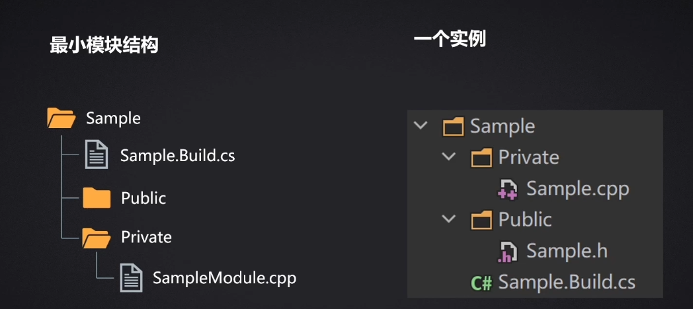
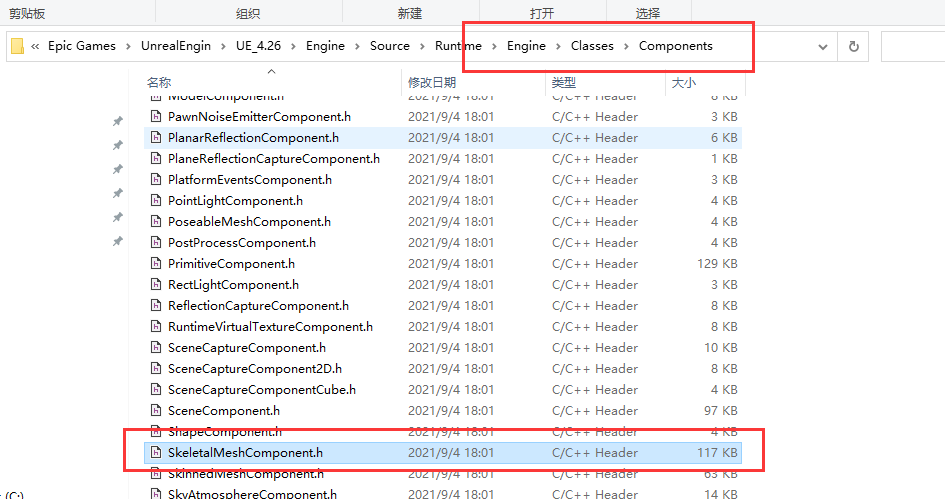
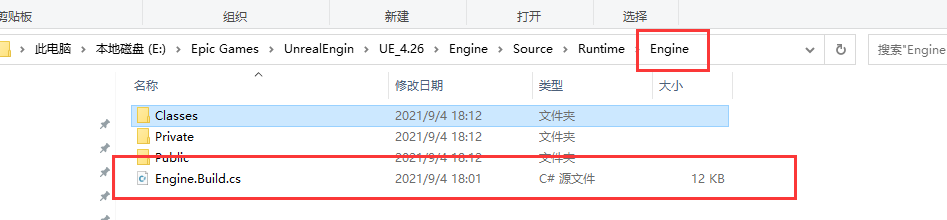

# 编辑器扩展

[基础视频](https://www.bilibili.com/video/BV1PW4y1v7Ca)

## 基础概念

### 模块

- 模块的结构
  - 完成一组功能的代码集合, 最终会编译为同一个dll
  - 模块(Modules)是虚幻引擎的软件架构的基本构建块
  - 插件是由模块组成的
  - 项目也是由模块组成的
  - 项目和插件都有且只有一个主模块, 但是可以有其他模块



```csharp
using UnrealBuildTool;

public class GASSample : ModuleRules
{
	public GASSample(ReadOnlyTargetRules Target) : base(Target)
	{
		PCHUsage = PCHUsageMode.UseExplicitOrSharedPCHs;

		PublicDependencyModuleNames.AddRange(new string[] { 
            "Core", 
            "CoreUObject", 
            "Slate",
            "SlateCore",
		});

		PrivateDependencyModuleNames.AddRange(new string[] { "Engine" });
	}
}
```

上述就是 `GASSample.build.cs` 文件的部分内容

`PublicDependencyModuleNames`表示公共依赖模块。公共依赖模块允许模块之间共享功能和接口，促进代码重用和模块化设计。通过指定公共依赖模块，当前模块可以使用其他模块提供的公共功能，而不需要重新实现这些功能

`PrivateDependencyModuleNames`表示私有依赖模块。私有依赖模块允许模块在内部使用其他模块的功能，但不会向外部公开这些功能。私有依赖模块用于实现模块内部的细节和功能，从而提高代码的封装性和安全性。

如果子模块被包含在 `PublicDependencyModuleNames` 中, 那么其他模块可以直接使用当前模块的子模块中的接口; 如果子模块被包含在 `PrivateDependencyModuleNames` 中, 那么其他模块无法直接使用当前模块的子模块的接口

一些建议

1. **头文件**中应避免直接引用其他模块的类
2. 尽可能使用 `Forward Declaration` 前置声明
3. 优先选择 `PrivateDependencyModuleNames`, 可减少项目编译时间

**项目中如何知道应该引用哪个模块**

以 `USkeletalMeshComponent` 为例, 定位到对应头文件的文件位置



然后往上级目录找, 直到直到 `Build.cs` 文件为止



一般来说文件名就是模块名, 比如这里文件名是 `Engine.Build.cs`, 那么模块名就是 `Engine`; 打开 `Engine.Build.cs` 文件, 该文件中定义的类名就是模块名

```csharp
using UnrealBuildTool;
using System.IO;

public class Engine : ModuleRules
{
	public Engine(ReadOnlyTargetRules Target) : base(Target)
	{
        // ... do something
    }
}
```

然后我们要做的就是将 `Engine` 这个模块添加到 `PrivateDependencyModuleNames` 中即可

在创建模块的时候, 会生成与模块同名的 `.h` 和 `.cpp `文件 

```cpp
class FModuleName : public IModuleInterface
{
public:
	virtual void StartupModule() override;
	virtual void ShutdownModule() override;
};
```

```cpp
#define LOCTEXT_NAMESPACE "FModuleName"

void FModuleName::StartupModule() { /* do something */ }

void FModuleName::ShutdownModule() { /* do something */ }

#undef LOCTEXT_NAMESPACE

IMPLEMENT_MODULE(FModuleName, ModuleName)
```

`StartupModule` 和 `ShutdownModule` 就是启动模块和关闭模块会激活的函数了

至于 `IMPLEMENT_MODULE` 宏

```cpp
#define IMPLEMENT_MODULE( ModuleImplClass, ModuleName ) \
    \
    extern "C" DLLEXPORT IModuleInterface* InitializeModule() \
    { \
        return new ModuleImplClass(); \
    } \
    extern "C" void IMPLEMENT_MODULE_##ModuleName() { } \
    PER_MODULE_BOILERPLATE \
    PER_MODULE_BOILERPLATE_ANYLINK(ModuleImplClass, ModuleName)
```

展开之后可以发现就是把我们的模块类实例化了一个, 最终这个函数会被 `ModuleManger` 调用, 从而到达模块注册的作用

至于模块内 `Public` 和 `Private` 文件夹的作用, 如果头文件放在 `Private` 文件夹中, 该文件中定义的类、结构、枚举仅对本模块内可见; 如果头文件放在 `Public` 文件夹中, 则其他模块都能使用文件内定义的类、结构、属性

如果模块不可能被其他模块引用, 那么 `Public` 、`Private` 无关紧要

可以在 `Private` 和 `Public` 文件夹中创建子文件夹, 进一步整理代码。但是 `Pubilc` 和 `Private` 中的子文件夹要一一对应

### 扩展的技能点

- 扩展功能菜单、工具栏
- 自定义编辑器模式
- 自定义细节面板
- 自定义资产类型
- 自定义图形节点编辑器

