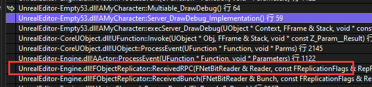
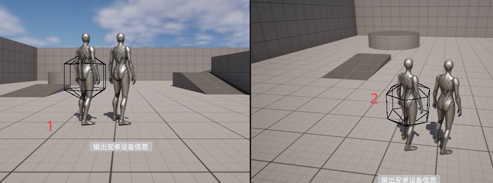
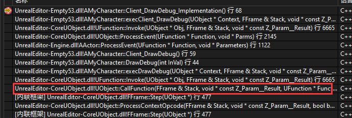
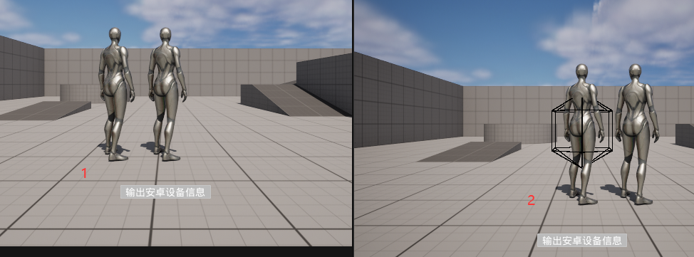
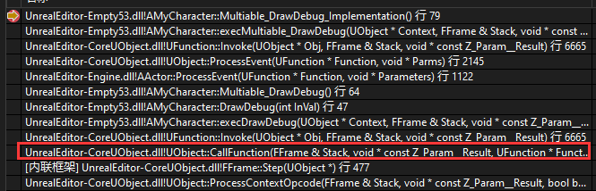
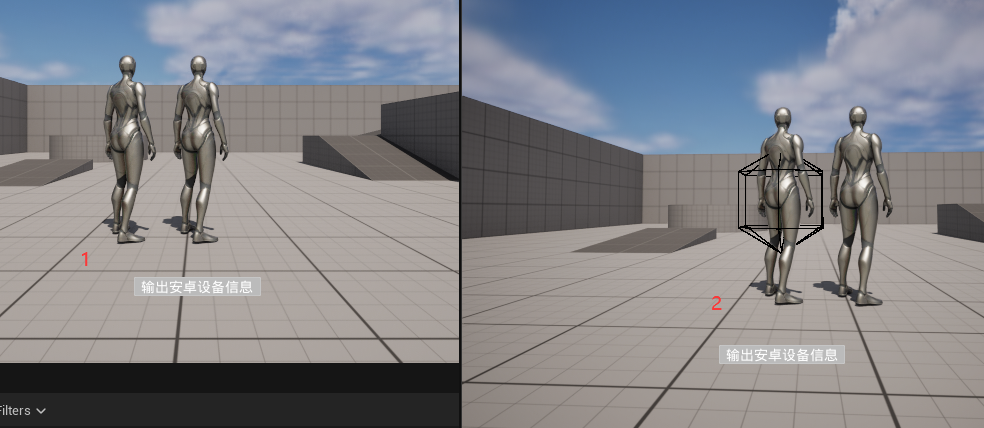
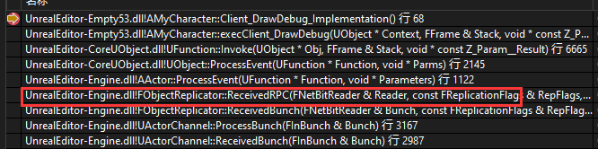
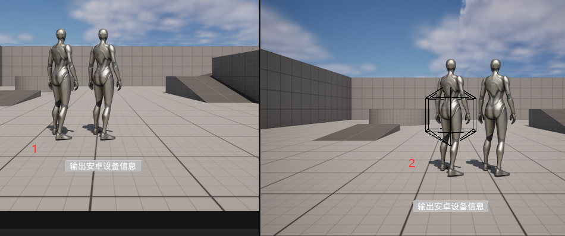
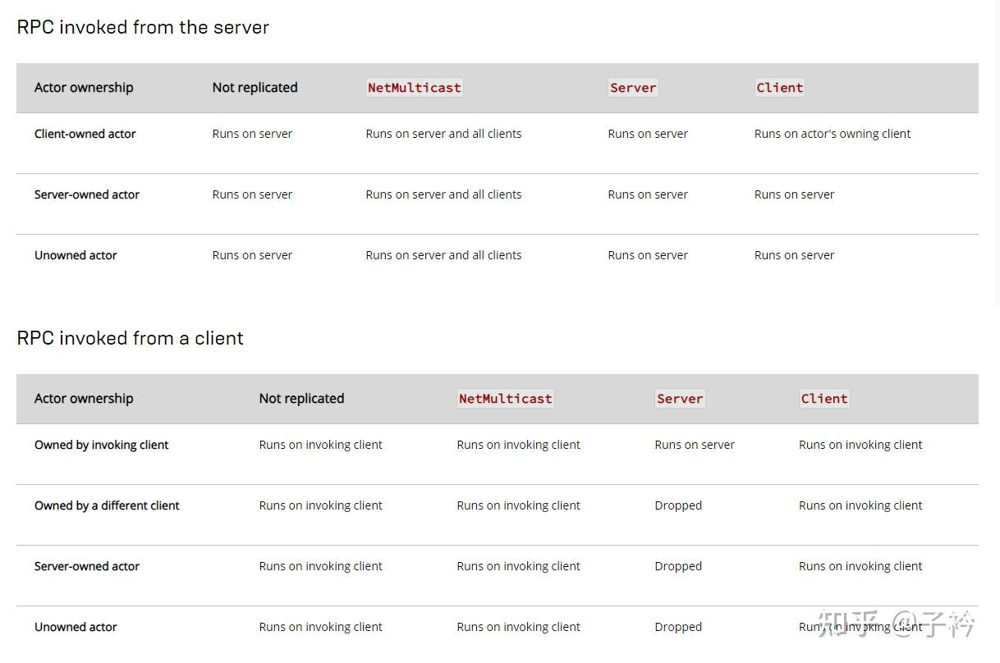

# RPC

RPC 全称 `Remote Procedure Call` 远程过程调用。一个通俗的描述是：客户端在不知道调用细节的情况下，调用存在于远程计算机上的某个对象，就像调用本地应用程序中的对象一样

RPC 有三种方式

| 类型 | 作用 |
| --- | --- | 
| NotReplicated | 默认值，表示该事件不进行复制。 | 
| RunOnServer | 通常在拥有目标所有权的客户端上调用，则事件将在服务器上运行。这是客户端向服务器发送数据的主要方法。如果从服务器调用该事件，则仅在该服务器上运行 | 
| RunOnOwningClient | 一般在服务器调用，则该事件将在拥有目标Actor的客户端上运行。特别地：如果服务器可以拥有Actor本身，则在服务器上运行。如果从客户端调用，则仅在调用该事件的客户端上运行 | 
| Multicast | 如果在服务器上调用组播事件，则该事件将复制到所有连接的客户端，无论拥有目标对象的是哪个连接。如果客户端调用组播事件，该事件会被视为未复制，并仅在调用该事件的客户端上运行 | 

在 DS 中如果想要使用 RPC，需要使用 `UFUNCTION` 标记函数，并且使用 `Client`、`Server`、`NetMulticast` 

例如 

```cpp
UFUNCTION(BlueprintCallable, Reliable, Server)
void Server_DrawDebug();

UFUNCTION(BlueprintCallable, Reliable, Client)
void Client_DrawDebug();

UFUNCTION(BlueprintCallable, Reliable, NetMulticast)
void Multiable_DrawDebug();
```

| MetaData | 作用 |
| --- | --- | 
| Server | 标记该函数由客户端调用，会在服务端执行 | 
| Client | 标记该函数由服务器调用，并在客户端执行 | 
| NetMulticast | 标记该函数会由服务器调用，并在所有客户端和服务器执行 | 
| Reliable | 保证 RPC 按发送顺序可靠送达，丢失数据包会重传  | 
| Unreliable | RPC 可能丢失或乱序 |

下面会提供一些执行过程，方便理解不同

```cpp
UFUNCTION(BlueprintCallable, Reliable, Server)
void Server_DrawDebug();

UFUNCTION(BlueprintCallable, Reliable, Server)
void Server_DrawDebug_Client();

UFUNCTION(BlueprintCallable, Reliable, Client)
void Client_DrawDebug();

UFUNCTION(BlueprintCallable, Reliable, NetMulticast)
void Multiable_DrawDebug();
```

| 情况 | 调用堆栈 | 表现效果 |理解 | 
| --- | --- | --- | --- |
| 客户端直接调用 Server_DrawDebug |  |  | 通过 `NewMultiCast` 所有客户端和服务器都执行了 DrawDebug 函数，所以客户端 1、2 都绘制了黑色球体 | 
| 客户端直接调用 Client_DrawDebug |  |  | 没有经过服务器，完全是本地执行逻辑，所以只有客户端 2 绘制了球体 |
| 客户端直接调用 Multiable_DrawDebug |  |  | 没有经过服务器，完全是本地执行逻辑，所以只有客户端 2 绘制了球体 |
| 客户端直接调用 Server_DrawDebug_Client |  |  | 通过服务器 RPC 调用本地函数，由于是 `Client` 类型，所有只有 客户端 2 绘制了球体 |

> 上述所有测试，输入都是在客户端 2 输入

通过上述四种情况对比，可以发现四种不同的情况，对应的四种结果



其实在 Unreal 的文档中有明确说明调用关系

根据 RPC 函数是 Client 还是 Server 调用，以及调用对象的 Actor 所有权 进行区分，对 `Not Replicated`、`Net Multicast`、`Server`、`Client` 执行情况整理出表格

- 在 Server 端调用 RPC 函数，根据 Actor 所有权不同，配置不同，调用情况不同

| Actor 所有权 | Not Replicated | NetMulticast | Server | Client | 
| --- | --- | --- | --- | --- |
| 客户端拥有 | 服务器调用 | 服务器和客户端全都调用 | 只在服务器调用 | 在客户端对应的 Actor 上调用  |
| 服务器拥有 | 服务器调用 | 客户端和服务器全部调用 | 只在服务器调用 | 只在服务器调用 |
| UnOwner | 服务器调用 | 客户端和服务器全部调用 | 只在服务器调用 | 只在服务器调用 |

- 在 Client 调用 RPC 函数，根据 Actor 所有权不同，配置不同，调用情况不同

| Actor 所有权 | Not Replicated | NetMulticast | Server | Client | 
| --- | --- | --- | --- | --- |
| 本客户端拥对象 | 在执行调用的客户端上运行 | 在执行调用的客户端上运行 | 在服务器上运行 | 在执行调用的客户端上运行  |
| 其他客户端同步过来的对象 | 在执行调用的客户端上运行 | 在执行调用的客户端上运行 | 丢弃 | 在执行调用的客户端上运行 |
| 服务器拥有的对象 | 在执行调用的客户端上运行 | 在执行调用的客户端上运行 | 丢弃 | 在执行调用的客户端上运行 |
| UnOwner | 在执行调用的客户端上运行 | 在执行调用的客户端上运行 | 丢弃 | 在执行调用的客户端上运行 |


