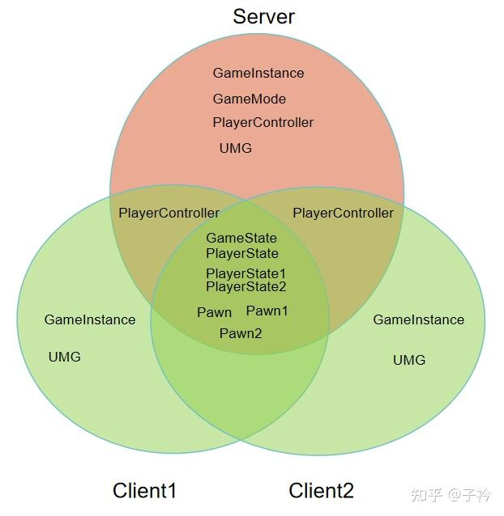

# DS

## 基本知识



https://zhuanlan.zhihu.com/p/684597439

> 红色 表示服务器；绿色表示 客户端

| 数据类型 | C-S 存储 |
| --- | --- |
| GameInstance | 服务器和每个客户端都存在一个独立的 GameInstance |
| GameMode | 只有服务器中存储 GameMode，用于设定游戏规则 |
| PlayerController | 每个客户端都有自己的 PlayerController。服务器和关联客户端之间的 PlayerController 会进行复制，但不会复制到其他客户端。服务器可以获取所有客户端的 PlayerController | 
| GameState | 存在于客户端和服务器上，因此服务器可以在 GameState 上使用复制，让所有客户端保持最新的游戏数据。通常是服务器上改变变量的值，客户端去读取。一般存储游戏中共有的数据。比如 LOL 中玩家的战绩等 |
| PlayerState | 服务器和客户端上存在与游戏项链的每个玩家的 PlayerState，存储玩家数据。比如 LOL 中玩家的金币数量 |
| Pawn | Pawn 和 Character 也存在于服务器和所有客户端上，可以复制变量和事件 |

在游戏运行中，对角色定义有三种

| 枚举值 | 含义 |
| --- | --- |
| ROLE_None | Actor在网络游戏中无角色，不会复制 |
| ROLE_SimulatedProxy | 只有模拟权，只是单纯把服务器的状态同步下来，无法直接改变其状态 |
| ROLE_AutonomousProxy | 自治权，一方面把服务器状态同步过来，另一方面能通过一些方式（属性同步和RPC）去改变服务器上的状态，再同步回自身 |
| ROLE_Authority | 	服务器或者单机游戏的客户端中，Actor的Role都为Authority。表示有完全控制权 |

> `enum ENetRole : int`

例如

- `Client1` 客户端上，`PlayerCharacter1` 拥有 `ROLE_AutonomousProxy`
- `Client2` 客户端上，`PlayerCharacter2` 拥有 `ROLE_AutonomousProxy`
- `Client1` 客户端上，`PlayerCharacter2` 仅拥有 `ROLE_SimulatedProxy`
- `Client2` 客户端上, `PlayerCharacter1` 仅拥有 `ROLE_SimulatedProxy`

在 `CharacterMovementComponent` 中，对不同的权限，执行不同的操作

角色的 `ENetRole` 不同，在 **属性同步** 和 `RPC` 中会有不同的表现

在多人网络游戏中，同一段逻辑可能会在服务器执行、本地客户端执行、其他客户端执行

例如一个在服务器创建的，具有网络复制属性的 `Pawn`，其 `BeginPlayEvent` 会在各个服务器和客户端中执行

有的时候，需要区分不同地方执行不同的逻辑，一方面可以通过前面的 `ENetRole` 枚举来判断，也可以使用 `IsServer` 和 `IsLocallyControlled` 函数来判断

更常见方法是 `IsServer` 和 `IsLocallyControlled` 函数来做判断

因为 `ENetRole` 在 `AActor` 创建之初并未正确指定， 在构造函数中或者 `BeginPlayEvent` 中可能获取错误的值

除了上述两种方式之外，还有一个 `World->GetNetMode()` 

```cpp
enum ENetMode
{
	NM_Standalone,			// 纯单机运行模式
	NM_DedicatedServer,		// 专用服务器，无本地玩家参与游戏
	NM_ListenServer,		// 监听服务器（玩家主机），同时具有服务器和客户端身份
	NM_Client,				// 纯客户端，连接到远程服务器
	NM_MAX,
};
```

日常开发首选 `GetNetMode`，更加安全可靠，无需空指针检查

使用 `IsServer` 之前，需要判断 `GetNewDriver` 是否为空

### 属性复制

无论是 `RPC` 还是 **属性赋值** 都需要设置 `Replicates` 属性为 `True`


`Pawn` 和 `Character` 默认开启 `Replicates`， `Actor` 需要手动开启

如果想要属性同步，则需要设置属性的 `Replication` 


| 枚举值 | 含义 |
| --- | --- |
| None | 不进行网络同步 |
| Replicated | 在服务器修改此值，会自动同步到客户端，但是有一定时间延迟 | 
| RepNotify | 在服务器修改此值，会自动同步到客户端，但是有一定时间延迟，同时会自动调用回调函数 |

当选择 `RepNotify` 时，蓝图中会自动生成一个名为 `OnRep_属性名` 的一个函数，该函数作为回调函数 

除了 `Replication` 之外，还有 `ReplicationCondition` 属性

`ReplicationCondition` 属性是 `ELifetimeCondition` 类型，用于精细控制属性复制的条件。定义了什么情况系啊服务器会将属性的更新发送给客户端

| 枚举值 | 作用 |
| --- | --- | 
| COND_None | 无条件复制，属性每次变化时都会发送给所有相关客户端 |
| COND_InitialOnly | 仅限初始同步，属性只在 Actor 首次出现在客户端时发送（创建时），后续变化不再同步 |
| COND_OwnerOnly | 仅发送给拥有者，属性只同步给控制该 Actor 的客户端 |
| COND_SkipOwner | 排除拥有者，属性同步给所有客户端，除了拥有者 |
| COND_SimulatedOnly | 仅模拟客户端，只发送给非控制该 Actor 的客户端 |
| COND_AutonomousOnly | 仅自主客户端，只发送给控制该 Actor 的客户端 |
| COND_SimulatedOrPhysics | 模拟或物理Actor，发送给模拟客户端或启用了物理复制(bRepPhysics)的客户端 |
| COND_InitialOrOwner | 初始或拥有者，首次出现时发送给所有客户端，后续变化只发送给拥有者 |

还有很多其他的条件枚举，不一一列举

在 C++ 中如果想要定义某个属性需要被复制，则需要使用 `Replicated`

```cpp
UPROPERTY(Replicated, ReplicatedUsing = OnRep_SpawnedAttributes, Transient)
TArray<TObjectPtr<UAttributeSet>>	SpawnedAttributes;
```

然后使用， 在 `GetLifetimeReplicatedProps` 函数中，定义哪些属性需要网络复制（Replicated）以及如何复制

对于需要复制的属性，通常需要 注册复制属性、配置复制规则

```cpp
void UAbilitySystemComponent::GetLifetimeReplicatedProps(TArray< FLifetimeProperty > & OutLifetimeProps) const
{	FDoRepLifetimeParams Params;
	Params.bIsPushBased = true;
	Params.Condition = COND_None;
	DOREPLIFETIME_WITH_PARAMS_FAST(UAbilitySystemComponent, SpawnedAttributes, Params);
	Super::GetLifetimeReplicatedProps(OutLifetimeProps);
}
```

除了 `DOREPLIFETIME` 之外，还有其他的，比如 `DOREPLIFETIME_WITH_PARAMS` 和 `DOREPLIFETIME_CONDITION` 等。这些宏本质上就是将属性快速注册到 `OutLifetimeProps` 参数中

针对 `SpawnedAttributes`，当从服务器同步属性之后，会触发 `ReplicatedUsing` 配置的 `OnRep_SpawnedAttributes` 函数
