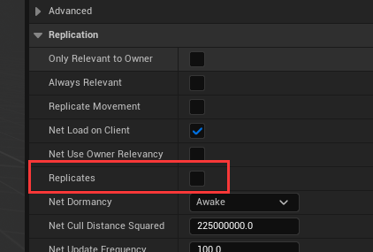
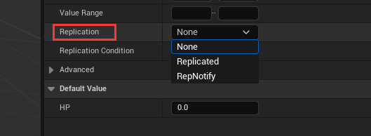

# 属性同步

## 简单使用

无论是 `RPC` 还是 **属性赋值** 都需要设置 `Replicates` 属性为 `True`



`Pawn` 和 `Character` 默认开启 `Replicates`， `Actor` 需要手动开启

如果想要属性同步，则需要设置属性的 `Replication` 



| 枚举值 | 含义 |
| --- | --- |
| None | 不进行网络同步 |
| Replicated | 在服务器修改此值，会自动同步到客户端，但是有一定时间延迟 | 
| RepNotify | 在服务器修改此值，会自动同步到客户端，但是有一定时间延迟，同时会自动调用回调函数 |

当选择 `RepNotify` 时，蓝图中会自动生成一个名为 `OnRep_属性名` 的一个函数，该函数作为回调函数 

除了 `Replication` 之外，还有 `ReplicationCondition` 属性

`ReplicationCondition` 属性是 `ELifetimeCondition` 类型，用于精细控制属性复制的条件。定义了什么情况系啊服务器会将属性的更新发送给客户端

| 枚举值 | 作用 |
| --- | --- | 
| COND_None | 无条件复制，属性每次变化时都会发送给所有相关客户端 |
| COND_InitialOnly | 仅限初始同步，属性只在 Actor 首次出现在客户端时发送（创建时），后续变化不再同步 |
| COND_OwnerOnly | 仅发送给拥有者，属性只同步给控制该 Actor 的客户端 |
| COND_SkipOwner | 排除拥有者，属性同步给所有客户端，除了拥有者 |
| COND_SimulatedOnly | 仅模拟客户端，只发送给非控制该 Actor 的客户端 |
| COND_AutonomousOnly | 仅自主客户端，只发送给控制该 Actor 的客户端 |
| COND_SimulatedOrPhysics | 模拟或物理Actor，发送给模拟客户端或启用了物理复制(bRepPhysics)的客户端 |
| COND_InitialOrOwner | 初始或拥有者，首次出现时发送给所有客户端，后续变化只发送给拥有者 |

还有很多其他的条件枚举，不一一列举

在 C++ 中如果想要定义某个属性需要被复制，则需要使用 `Replicated`

```cpp
UPROPERTY(Replicated, ReplicatedUsing = OnRep_SpawnedAttributes, Transient)
TArray<TObjectPtr<UAttributeSet>>	SpawnedAttributes;
```

然后使用， 在 `GetLifetimeReplicatedProps` 函数中，定义哪些属性需要网络复制（Replicated）以及如何复制

对于需要复制的属性，通常需要 注册复制属性、配置复制规则

```cpp
void UAbilitySystemComponent::GetLifetimeReplicatedProps(TArray< FLifetimeProperty > & OutLifetimeProps) const
{	FDoRepLifetimeParams Params;
	Params.bIsPushBased = true;
	Params.Condition = COND_None;
	DOREPLIFETIME_WITH_PARAMS_FAST(UAbilitySystemComponent, SpawnedAttributes, Params);
	Super::GetLifetimeReplicatedProps(OutLifetimeProps);
}
```

除了 `DOREPLIFETIME` 之外，还有其他的，比如 `DOREPLIFETIME_WITH_PARAMS` 和 `DOREPLIFETIME_CONDITION` 等。这些宏本质上就是将属性快速注册到 `OutLifetimeProps` 参数中

针对 `SpawnedAttributes`，当从服务器同步属性之后，会触发 `ReplicatedUsing` 配置的 `OnRep_SpawnedAttributes` 函数

## 同步流程

1. 收集所有的 Actor
2. 属性对比，对比哪些属性发生了变化
3. 遍历 Component 并进行属性对比
4. 遍历所有的 UActorChannel 

引擎通过引入 `ReplicationGraph` 和 `NetDormancy` 减少了 收集 Actor 阶段处理的 Actor 数量；通过 `PushModel` 减少了属性对比的执行次数


