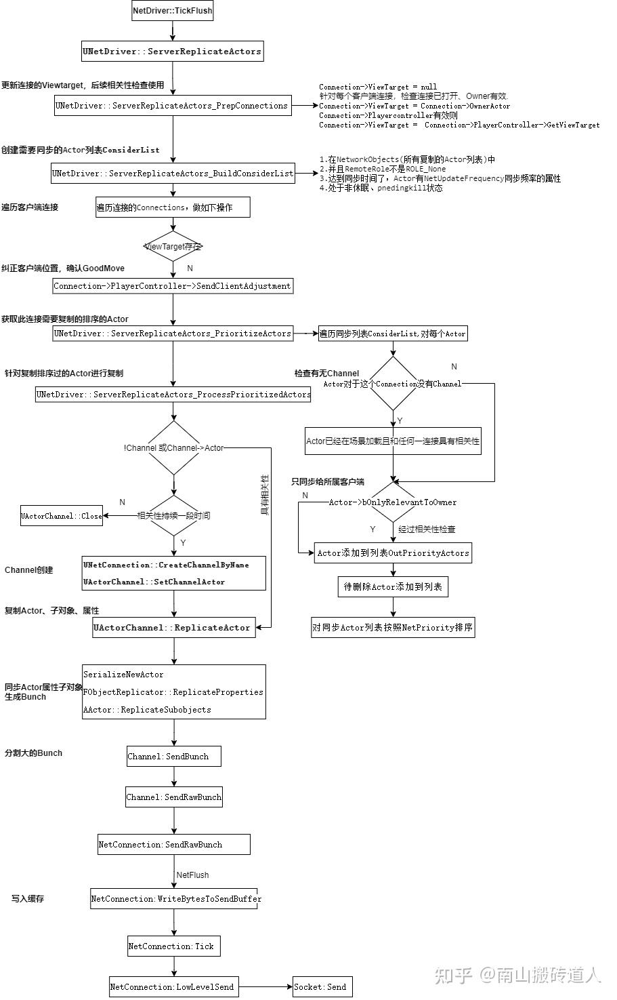
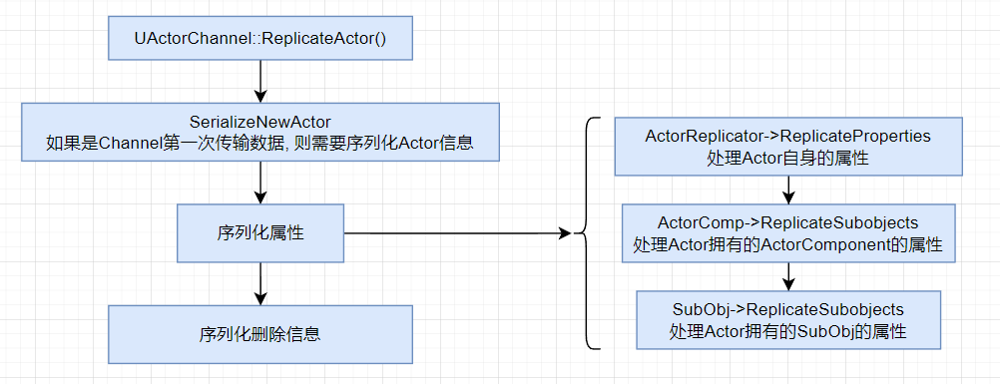
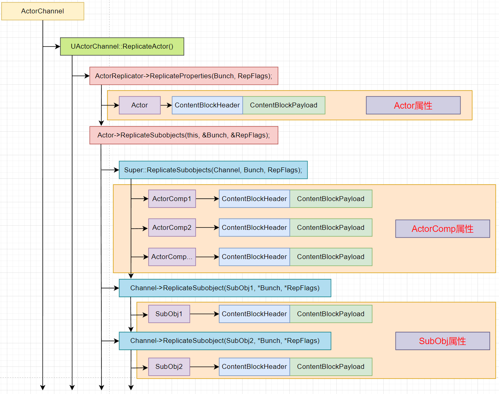
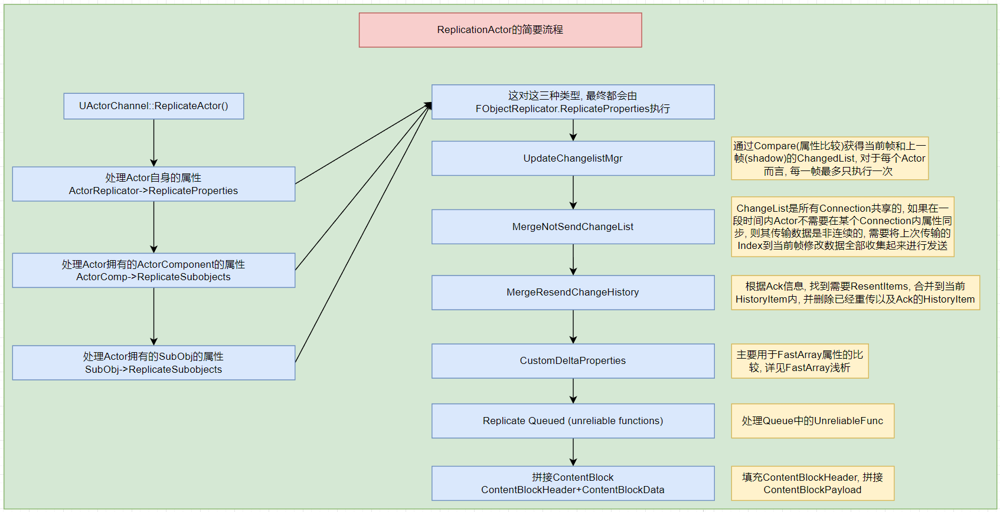

# 属性同步

## 简单使用

无论是 `RPC` 还是 **属性赋值** 都需要设置 `Replicates` 属性为 `True`


`Pawn` 和 `Character` 默认开启 `Replicates`， `Actor` 需要手动开启

如果想要属性同步，则需要设置属性的 `Replication` 


| 枚举值 | 含义 |
| --- | --- |
| None | 不进行网络同步 |
| Replicated | 在服务器修改此值，会自动同步到客户端，但是有一定时间延迟 | 
| RepNotify | 在服务器修改此值，会自动同步到客户端，但是有一定时间延迟，同时会自动调用回调函数 |

当选择 `RepNotify` 时，蓝图中会自动生成一个名为 `OnRep_属性名` 的一个函数，该函数作为回调函数 

除了 `Replication` 之外，还有 `ReplicationCondition` 属性

`ReplicationCondition` 属性是 `ELifetimeCondition` 类型，用于精细控制属性复制的条件。定义了什么情况系啊服务器会将属性的更新发送给客户端

| 枚举值 | 作用 |
| --- | --- | 
| COND_None | 无条件复制，属性每次变化时都会发送给所有相关客户端 |
| COND_InitialOnly | 仅限初始同步，属性只在 Actor 首次出现在客户端时发送（创建时），后续变化不再同步 |
| COND_OwnerOnly | 仅发送给拥有者，属性只同步给控制该 Actor 的客户端 |
| COND_SkipOwner | 排除拥有者，属性同步给所有客户端，除了拥有者 |
| COND_SimulatedOnly | 仅模拟客户端，只发送给非控制该 Actor 的客户端 |
| COND_AutonomousOnly | 仅自主客户端，只发送给控制该 Actor 的客户端 |
| COND_SimulatedOrPhysics | 模拟或物理Actor，发送给模拟客户端或启用了物理复制(bRepPhysics)的客户端 |
| COND_InitialOrOwner | 初始或拥有者，首次出现时发送给所有客户端，后续变化只发送给拥有者 |

还有很多其他的条件枚举，不一一列举

在 C++ 中如果想要定义某个属性需要被复制，则需要使用 `Replicated`

```cpp
UPROPERTY(Replicated, ReplicatedUsing = OnRep_SpawnedAttributes, Transient)
TArray<TObjectPtr<UAttributeSet>>	SpawnedAttributes;
```

然后使用， 在 `GetLifetimeReplicatedProps` 函数中，定义哪些属性需要网络复制（Replicated）以及如何复制

对于需要复制的属性，通常需要 注册复制属性、配置复制规则

```cpp
void UAbilitySystemComponent::GetLifetimeReplicatedProps(TArray< FLifetimeProperty > & OutLifetimeProps) const
{	FDoRepLifetimeParams Params;
	Params.bIsPushBased = true;
	Params.Condition = COND_None;
	DOREPLIFETIME_WITH_PARAMS_FAST(UAbilitySystemComponent, SpawnedAttributes, Params);
	Super::GetLifetimeReplicatedProps(OutLifetimeProps);
}
```

除了 `DOREPLIFETIME` 之外，还有其他的，比如 `DOREPLIFETIME_WITH_PARAMS` 和 `DOREPLIFETIME_CONDITION` 等。这些宏本质上就是将属性快速注册到 `OutLifetimeProps` 参数中

针对 `SpawnedAttributes`，当从服务器同步属性之后，会触发 `ReplicatedUsing` 配置的 `OnRep_SpawnedAttributes` 函数

## NetDriver 同步流程

1. 收集所有的 Actor
2. 属性对比，对比哪些属性发生了变化
3. 遍历 Component 并进行属性对比
4. 遍历所有的 UActorChannel 

引擎通过引入 `ReplicationGraph` 和 `NetDormancy` 减少了 收集 Actor 阶段处理的 Actor 数量；通过 `PushModel` 减少了属性对比的执行次数

### 收集 Actor

在当前 `UWorld::SpawnActor` 的时候，会调用在最后调用 `UWorld::AddNetworkActor` 函数就该 `Actor` 通知给 `UNetDriver` 

```cpp
ForEachNetDriver(GEngine, this, [Actor](UNetDriver* const Driver)
{
	if (Driver != nullptr)
	{
		Driver->AddNetworkActor(Actor);
	}
});
```

最后所有的 Actor 都会存储在 `UNetDriver` 的 `NetworkObjects` 容器中

```cpp
GetNetworkObjectList().FindOrAdd(Actor, this);
if (ReplicationDriver)
{
	ReplicationDriver->AddNetworkActor(Actor);
}
```

> `ReplicationDriver` 需要开启 Iris 才能使用，否则为 nullptr

> https://dev.epicgames.com/documentation/zh-cn/unreal-engine/iris-replication-system-in-unreal-engine


### 开始处理复制



#### 过滤/更新 ActorInfo

在 `UNetDriver::TickFlush` 时会调用 `ServerReplicateActors` 开启属性复制流程

首先通过 `ServerReplicateActors_BuildConsiderList` 对 `GetNetworkObjectList` 中缓存的 Actor 进行过滤，剔除无效或者不用复制的 Actor

1. 过滤 不强制更新 并且 ActorInfo->NextUpdateTime 时间未到到的 ActorInfo
2. 过滤 PendingKill 的 Actor，会从 NetworkObjects 容器中删除
3. 过滤 RemoteRole 为 ROLE_None 的 Actor，会从 NetworkObjects 容器中删除
4. 过滤与当前运行的 NetDriver 不一直的 Actor
5. 过滤还没有 Initialize 的 Actor
6. 过滤 Actor 所属的 Level 正处于 In 或者 Out 的 Actor
7. 过滤没有被唤醒的 Actor

每个 `Actor` 都被封装在 `FNetworkObjectInfo` 结构体中，除了 `Actor` 之外还有一些其他信息

| FNetworkObjectInfo 属性 | 作用 |
| --- | --- |
| Actor，WeakActor | 对 Actor 的强引用和软引用 |
| NextUpdateTime | 下一次更新时间 |
| LastNetReplicateTime | 上一次复制时间 |
| OptimalNetUpdateDelta | 期望的复制间隔 |
| LastNetUpdateTimestamp | 上一次基于 NextUpdateTime 进入 要考虑复制 状态时的内部时间戳 |

通过前面过滤，得到有效的 Actor 之后，对 Actor 所属的 ActorInfo 进行数据处理

1. 通过 `LastNetReplicateTime` 计算更新频率，更新后短期内保持高频更新，长期不更新则降低频率
2. 计算 `ActorInfo->NextUpdateTime` 下一次更新时间
3. 通知 `Actor->CallPreReplication` 要开始复制了

#### 处理 NetConnection 

核心处理函数是

1. 优先级排序，ServerReplicateActors_PrioritizeActors
2. 同步处理，ServerReplicateActors_ProcessPrioritizedActorsRange
3. 标记相关Actor，ServerReplicateActors_MarkRelevantActors

不过对 `NetConnection` 进行处理需要满足条件

1. `if (i >= NumClientsToTick)`
2. `if (Connection->ViewTarge)`

由于 `NetDriver` 中包含多个 `NetConnection`，i 就是遍历 `NetConnection` 的序号，`NumClientsToTick` 表示本次 `Tick` 更新多少个 `NetConnection`，这是为了解决服务器性能不足时跳过部分客户端

由于决定哪些 Actor 需要被赋值时，需要 `ViewTarget`，所以会要求 `ViewTarget` 有效

通过 `UNetConnection` 来构建 `FNetViewer`，计算得到 视图源点的世界坐标位置 和 视图方向的单位向量

```cpp
FNetViewer::FNetViewer(UNetConnection* InConnection, float DeltaSeconds) :
	Connection(InConnection),
	InViewer(InConnection->PlayerController ? InConnection->PlayerController : InConnection->OwningActor),
	ViewTarget(InConnection->ViewTarget),
{
	APlayerController* ViewingController = InConnection->PlayerController;

	// Get viewer coordinates.
	ViewLocation = ViewTarget->GetActorLocation();
	if (ViewingController)
	{
		FRotator ViewRotation = ViewingController->GetControlRotation();
		ViewingController->GetPlayerViewPoint(ViewLocation, ViewRotation);
		ViewDir = ViewRotation.Vector();
	}
}
```

| FNetViewer 属性 | 作用 |
| --- | --- |
| Connection | 当前视图关联的网络连接对象 |
| InViewer | 控制网络视图的 Actor（通常是 PlayerController） |
| ViewTarget | 实际用于观察的对象 Actor，比如 PlayerCharacter |
| ViewLocation | 视图源点的世界坐标位置 |
| ViewDir | 视图方向的单位向量 |

通过 `NetConnection` 和其 `ChildConnection` 得到 `TArray<FNetViewer>`

```cpp
const bool bProcessConsiderListIsBound = OnProcessConsiderListOverride.IsBound();

if (bProcessConsiderListIsBound)
{
	// 通过事件，转发给 DisplayClusterReplication 进行处理
	OnProcessConsiderListOverride.Execute( { DeltaSeconds, Connection, bCPUSaturated }, Updated, ConsiderList );
}

if (!bProcessConsiderListIsBound)
{
	// 执行常规复制流程 
	// ServerReplicateActors_PrioritizeActors
	// ServerReplicateActors_ProcessPrioritizedActorsRange
	// ServerReplicateActors_MarkRelevantActors
}
```

通过前面一系列操作，已经收集到这些信息

- `TArray<FNetworkObjectInfo*> ConsiderList` 存储着本帧需要被处理的对象
- `TArray<FNetViewer>& ConnectionViewers` 存储着本 `NetConnection` 关联的视角信息

##### ServerReplicateActors_PrioritizeActors

主要是对 `ConsiderList` 和 `DestroyedStartupOrDormantActors` 进行处理

`DestroyedStartupOrDormantActors` 主要是用于记录和管理 启动状态下被销毁 和 休眠状态下被销毁的 Actor 

针对 `ConsiderList`

通过 `AActor::IsNetRelevantFor` 筛选出与当前 `NetConnection` 相关的 `Actor`

- `bAlwaysRelevant` 强制相关开关
- 该 `Actor` 的 `Owner` 或者 `Instigator` 是 `ViewTarget` 或者 `InViewer`
- 该 `Actor` 的 `Owner` 的 `IsNetRelevantFor` 返回值，向 `Owner` 递归
- 该 `Actor` 的 `RootComponent` 的 `AttachParetn` 的 `Owner` 的 `IsNetRelevantFor` 
- 距离判断，`Actor` 与 `ViewTarget` 距离不嫩超过 `NetCullDistanceSquared` 

如果全局变量设置为允许休眠 也就是 `GSetNetDormancyEnabled`，需要判断 `Actor` 能否休眠 

```cpp
/** 如果需要休眠 返回 true */
ENGINE_API virtual bool GetNetDormancy(const FVector& ViewPos, const FVector& ViewDir, class AActor* Viewer, AActor* ViewTarget, UActorChannel* InChannel, float Time, bool bLowBandwidth);
```

> 需要子类重写该函数， `Actor` 默认函数返回 `false`

将符合条件的 `Actor` 封装到 `FActorPriority` 中

```cpp
OutPriorityList[FinalSortedCount] = FActorPriority( PriorityConnection, Channel, ActorInfo, ConnectionViewers, bLowNetBandwidth );
```

最后对 `OutPriorityList` 进行根据 `Priority` 属性大小，从大到小进行排序

```cpp
Algo::SortBy(MakeArrayView(OutPriorityActors, FinalSortedCount), &FActorPriority::Priority, TGreater<>());
```

`FActorPriority` 在构造的时候会计算 `Priority` 也就是优先级

```cpp
Priority = 0;
const float Time = Channel ? (InConnection->Driver->GetElapsedTime() - Channel->LastUpdateTime) : InConnection->Driver->SpawnPrioritySeconds;
for (int32 i = 0; i < Viewers.Num(); i++)
{
	Priority = FMath::Max<int32>(Priority, FMath::RoundToInt(65536.0f * ActorInfo->Actor->GetNetPriority(Viewers[i].ViewLocation, Viewers[i].ViewDir, Viewers[i].InViewer, Viewers[i].ViewTarget, InChannel, Time, bLowBandwidth)));
}
```

如果是新的 `Actor` 它没有 `Channel`，则使用 `SpawnPrioritySeconds` 配置进行赋值；否则使用当前时间减去上次更新时间的差值

然后调用 `AActor::GetNetPriority` 进行优先级计算

1. 自己就是 ViewTarget 则 Time * 4
2. 如果在 ViewTarget 后方，距离 ViewTarget 超过远距离 则 Time * 0.2；超过近距离 则 Time * 0.4
3. 如果在 ViewTarget 前方，距离 ViewTarget 不超过一定数值，且与角色夹角小于一定数值，则 Time * 2
4. 如果在 ViewTarget 前方，距离 VieTarget 超过一定数值，则 Time * 0.4
5. 其他情况 Time 不变

最后将 `Time * AActor::NetPriority` 得到该 `Actor` 真正的优先级

可见，一个 `Actor` 的复制优先级，是根据 `Actor` 在 `ViewTarget` 的 **视角** 和 **距离** 进行评判

如果想要手动设置 `Actor` 的优先级，可以直接其 `NetPriority` 属性的大小

> `NetPriority` 是 `BlueprintReadWrite` 的

##### ServerReplicateActors_ProcessPrioritizedActorsRange

按 **优先级顺序** 对一段 `Actors` 子集进行复制

- 传入 ActorsIndexRange 表示数组子区间
- 传入 bIgnoreSaturation 表示忽略带宽饱和，默认 false
- 输出 OutUpdated 计数

```cpp
FNetworkObjectInfo*	ActorInfo = PriorityActors[j]->ActorInfo;
```

PriorityActors 中包含需要被删除的 Actor

在处理一个 FNetworkObjectInfo 时，先判断其是否是要被销毁的 Actor 判断条件就是 `ActorInfo == NULL && PriorityActors[j]->DestructionInfo`

```cpp
// 发送销毁信息
SendDestructionInfo(Connection, PriorityActors[j]->DestructionInfo);
```

其他情况表示需要同步 Actor

如果 Actor 没有对应的 Channel 则创建对应的 Channel 并绑定 Actor

```cpp
Channel = (UActorChannel*)Connection->CreateChannelByName( NAME_Actor, EChannelCreateFlags::OpenedLocally );
if ( Channel )
{
	Channel->SetChannelActor(Actor, ESetChannelActorFlags::None);
}
```

设置本次复制的一些信息：`OptimalNetUpdateDelta` 、`LastNetReplicateTime` 、`RelevantTime` 用于以后的一些条件判断

在检查通道带宽之后，开始 **进行复制**

```cpp
// 检查 通道是否饱和
if ( Channel->IsNetReady( 0 ) || bIgnoreSaturation)
{
	// do something
	if(Channel->ReplicateActor())	// 真正复制 Actor 数据 并 发送数据
	{
		// do something
	}
	// do somehting
}
```

##### ServerReplicateActors_MarkRelevantActors

网络带宽不足时，智能标记那些需要在下帧优先处理的 Actor

```cpp
PriorityActors[k]->ActorInfo->bPendingNetUpdate = true;
```

## ReplicateActor

属性复制的核心逻辑就在 `Channel->ReplicateActor()` 中

核心做的事情就是：收集并序列化这个 Actor 及其子对象需要复制的属性、RPC 等，组装成一个或多个 FOutBunch，调用 SendBunch 入队，最终由连接发送到远端



其中序列化属性中的属性又分成三类: Actor自身属性 + ActorComponent 属性 + SubObject 属性

每类属性的序列化都会调用同一个函数:  FObjectReplicator::ReplicateProperties




