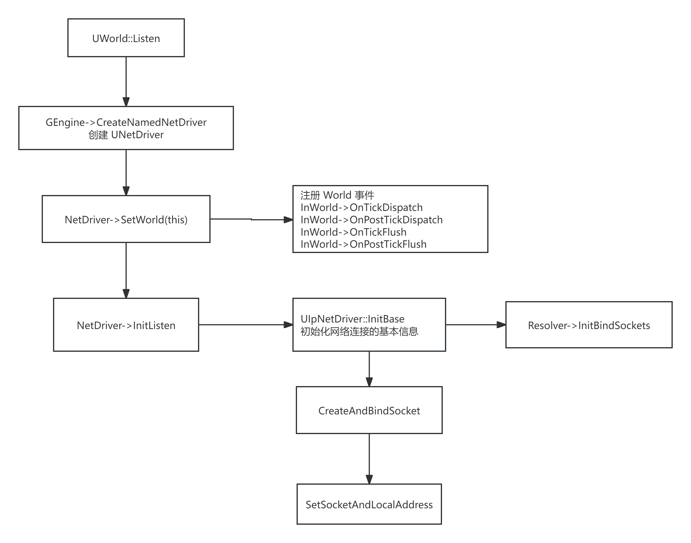
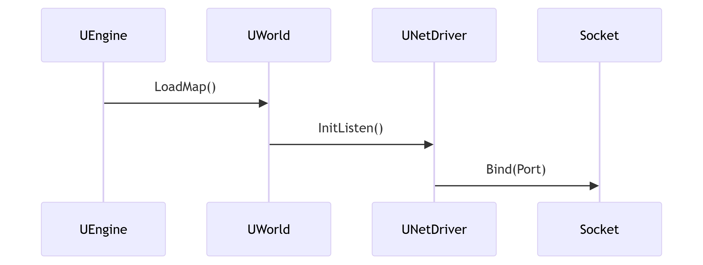
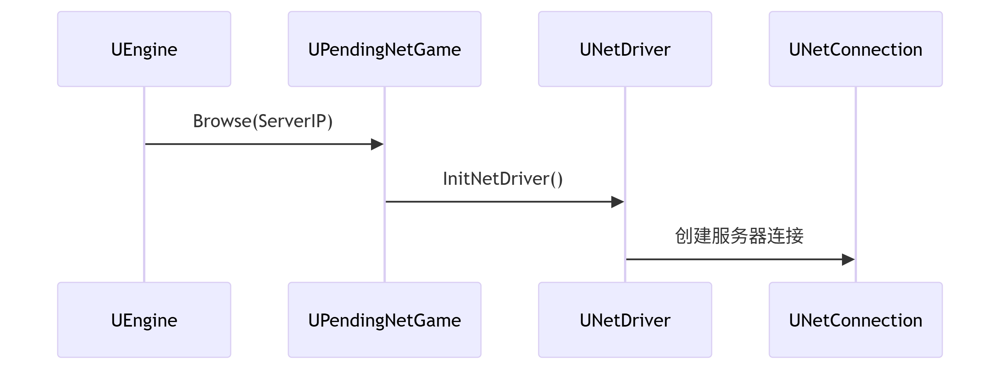
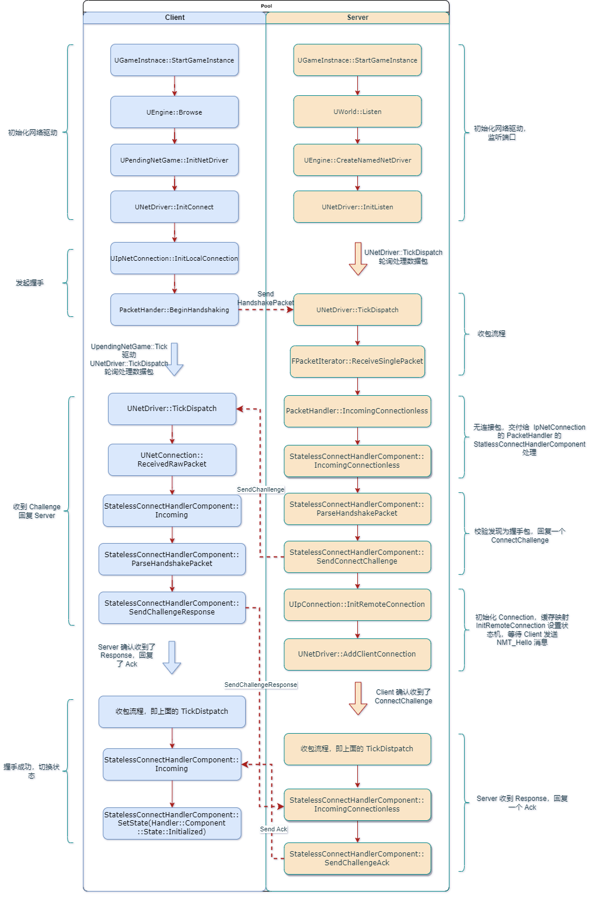
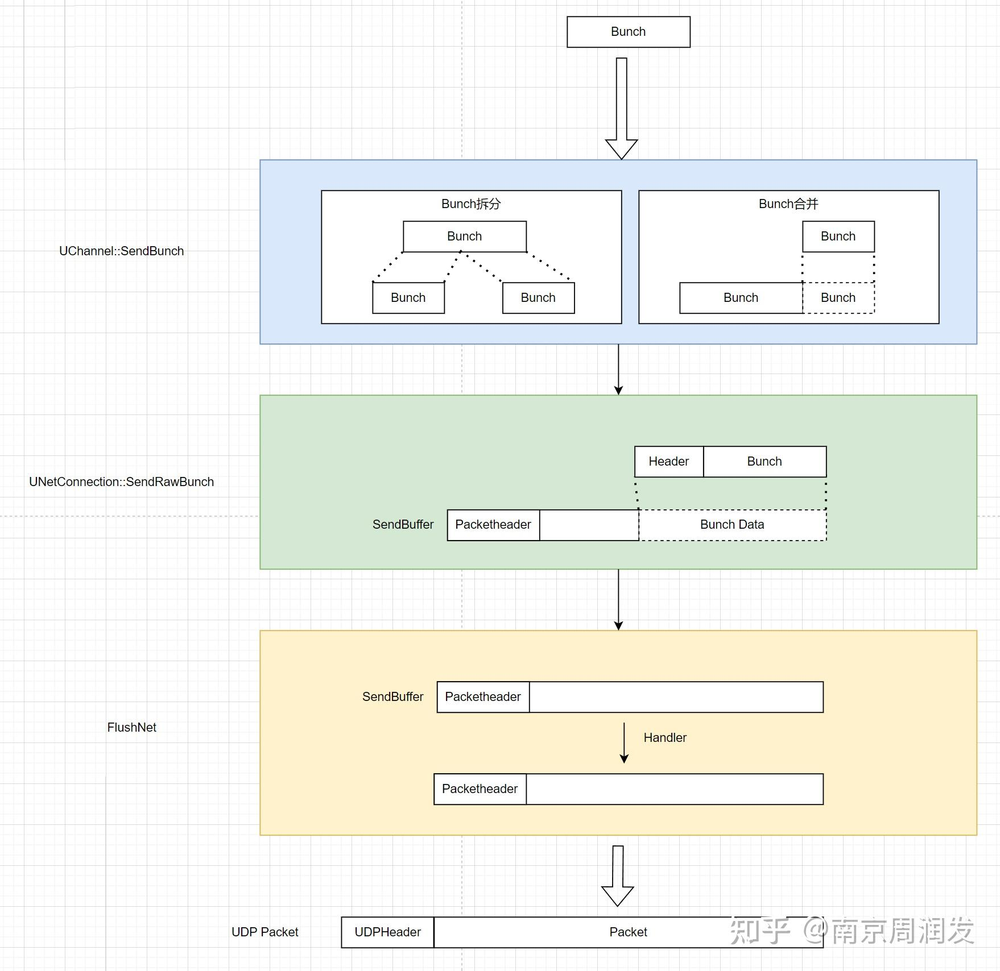
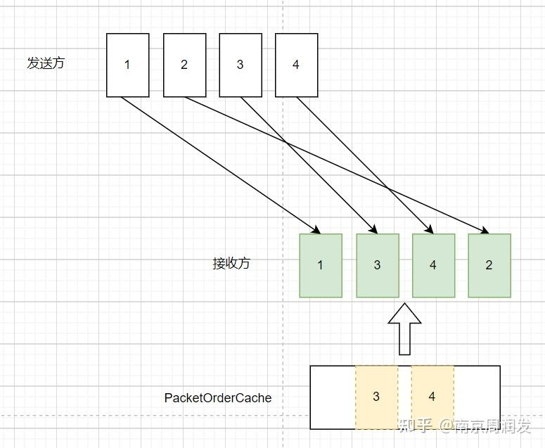

# 网络

## 基本类型

> https://www.cnblogs.com/lawliet12/p/17332897.html

### FSocket

代码太多了，直接贴文件路径吧 

[TestActor.h文件](./Src/TestSocket/TestActor.h)

[TestActor.cpp文件](./Src/TestSocket/TestActor.cpp)

核心代码就两部分

- 对于客户端来说，主要是 连接 和 发送信息

```cpp
ISocketSubsystem* System = ISocketSubsystem::Get();

// 创建地址
Addr = System->CreateInternetAddr();
// 创建 Socket
Host = System->CreateSocket(NAME_Stream, TEXT("default"), false);
// 绑定 Socket 和 地址 进行连接
Host->Connect(*Addr);
// 发送信息
Host->Send((uint8*)TCHAR_TO_UTF8(Data), Size, Send);
```

- 对于服务器来说，主要是 监听 和 收取信息

```cpp
ISocketSubsystem* System = ISocketSubsystem::Get();
Socket = System->CreateSocket(NAME_Stream, TEXT("default"), false);
// 绑定 IP 和 端口
Socket->Bind(*Addr);
// 监听事件
Socket->Listen(5);

while(true)
{
    // 检查是否有待处理的连接
    Socket->Wait(ESocketWaitConditions::WaitForRead, FTimespan::FromSeconds(2));

    // 接受新连接
    ClientSocket = Socket->Accept(TEXT("ClientConnection"));

    // 接收数据
    TArray<uint8> ReceiveData;
    ClientSocket->Recv(ReceiveData.GetData(), ReceiveData.Num(), Read);
    FString ReceivedString = FString(UTF8_TO_TCHAR(reinterpret_cast<const char*>(ReceiveData.GetData())));
}
```

这里  `CreateSocket` 的参数是 `NAME_Stream`，除了 `NAME_Stream` 之外还有 `Name_DGram`

- `Name_Stream` 是数据流，用于 TCP 连接
- `Name_DGram` 是 `DataGram` 的简写，表示是数据报，用于 UDP 连接

另外 `CreateSocket` 还有第三个参数 `ProtocolType`，有两个属性值 `FNetworkProtocolTypes::IPv4` 和 `FNetworkProtocolTypes::IPv6` 分别对应 IPV4 和 IPV6 两个

`FSocket` 属于网络中最基础的地方，根据不同的平台底层实现不同

比如 `FSocketWindows` 就是用于 Windows 平台的

### UNetDriver

是一个比较重要的网络管理类，可以简单看下其结构

```cpp
class UNetDriver : public UObject, public FExec
{
public:
    ENGINE_API virtual bool InitBase(bool bInitAsClient, FNetworkNotify* InNotify, const FURL& URL, bool bReuseAddressAndPort, FString& Error);
    ENGINE_API virtual bool InitConnect(class FNetworkNotify* InNotify, const FURL& ConnectURL, FString& Error ) PURE_VIRTUAL( UNetDriver::InitConnect, return true;);
    ENGINE_API virtual bool InitListen(class FNetworkNotify* InNotify, FURL& ListenURL, bool bReuseAddressAndPort, FString& Error) PURE_VIRTUAL( UNetDriver::InitListen, return true;);

    // 其他函数

public:
    UPROPERTY()
	TObjectPtr<class UNetConnection> ServerConnection;

	UPROPERTY()
	TArray<TObjectPtr<UNetConnection>> ClientConnections;

    // 其他属性
}
```

| UNetDriver 派生类 | 作用 |
| --- | --- |
| UWebSocketNetDriver | 用于实现 WebSocket 协议的网络通信 |
| UIpNetDriver | 用于实现基于 IP 的网络通信 |
| USteamSocketsNetDriver | 利用Steam新网络协议层的网络插件，从 Steamworks SDK 1.46版起 |
| UDemoNetDriver | 用来支持游戏录像和回放 |

在 `UWorld` 中存储着 `NetDriver` 用于网络信息处理，同时也有一个 `DemoNetDriver` 来支持游戏录像和回放

注意 `UNetDriver` 中维护着两个数组：`ServerConnection` 和 `ClientConnections`

- 如果当前属于 Server，那么使用 `ClientConnections` 来存储 Server 与 Client 的连接信息
- 如果当前属于 Client，那么使用 `ServerConnection` 来存储该 Client 与 Server 的连接信息

客户端通过调用 `UNetDriver::InitConnect` 来创建 `ServerConnection` 并初始化数据

服务器通过调用 `UNetDriver::InitListen` 来初始化服务端数据

`UNetDriver` 会监听 `TickDispatch` 和 `TickFlush`，驱动整个网络系统的更新循环



### UPlayer 和 UNetConnection

#### UPlayer

`UPlayer` 是 UE 中表示玩家的实体。并不直接与游戏场景中的对象关联，而是用于封装玩家的输入来源

这个 UPlayer 可以是一个本地人类玩家(Local Player)、一个网络连接的远程玩家 (NetConnection)，甚至在某些情况下可以代表一个模拟玩家的 AI

```cpp
class UPlayer : public UObject, public FExec
{
	TObjectPtr<class APlayerController> PlayerController;
	int32 CurrentNetSpeed;          // 表示当前用于该玩家网络连接的实际带宽限制
	int32 ConfiguredInternetSpeed;  // 为该类型玩家连接预设的最大带宽限制
	int32 ConfiguredLanSpeed;       // 在局域网环境下，为该类型玩家连接预设的最大带宽限制
}
```

#### ULocalPlayer

ULocalPlayer 代表本地玩家，包含视口配置等信息

```cpp
class ULocalPlayer : public UPlayer
{
	FUniqueNetIdRepl CachedUniqueNetId;     // 
	TObjectPtr<class UGameViewportClient> ViewportClient;       
	FVector2D Origin;                       // 上一帧 主视口区域 在归一化坐标空间中左上角的位置
	FVector2D Size;                         // 上一帧 主视口区域 在归一化坐标空间中的尺寸
	FVector LastViewLocation;               // 上一帧 玩家的摄像机位置
	TEnumAsByte<enum EAspectRatioAxisConstraint>        AspectRatioAxisConstraint;              // 当前游戏视口的宽高比与项目设置不同时，如何调整视场角
	TSubclassOf<class APlayerController>        PendingLevelPlayerControllerClass;      // 关卡切换过程中临时存储将要生成的 APlayerController 类
	uint32 bSentSplitJoin:1;                // 是否已发送分屏加入请求
}
```

参考 `APlayerController` 对 `LocalPlayer` 的使用

```cpp
void APlayerController::CreateTouchInterface()
{
    ULocalPlayer* LocalPlayer = Cast<ULocalPlayer>(Player);
    // ... do something else
    LocalPlayer->ViewportClient->AddViewportWidgetContent(VirtualJoystick.ToSharedRef());
}
```

在 `APlayerController` 中大部分都是通过 `Player` 来进行视口操作

#### UNetConnection

`UNetConnection` 就是抽象出来的连接，用于管理玩家与服务器，或其他客户端之间的网络通信

负责 接收 和 发送 玩家的输入数据，使网络玩家能够在游戏中进行互动

```cpp
class UNetConnection : public UPlayer
{
	TArray<TObjectPtr<class UChildConnection>> Children;    // 管理子连接（多用于分屏多人游戏）
	TObjectPtr<class UNetDriver> Driver;	    // 所属的网络驱动实例
	TSubclassOf<UPackageMap> PackageMapClass;   // 
	TObjectPtr<class UPackageMap> PackageMap;   // 
	TArray<TObjectPtr<class UChannel>> OpenChannels;    // 网络传输通道 特定类型的信息通过特定的 Channel 传输
	TArray<TObjectPtr<class AActor>> SentTemporaries;   // 标记为 bNetTemporary 的 Actor，表示 仅初始复制一次 不参加后续增量更新的 Actor
	TObjectPtr<class AActor> ViewTarget;    // 
	TObjectPtr<class AActor> OwningActor;   // 通常是 PlayerController
	int32	MaxPacket;	    // 最大数据包大小

    FActorChannelMap ActorChannels; // Key 是 Actor Value 是 ActorChannel，通过 Actor 找到与之对应的 ActorChannel
    // 其他 属性 和 函数
} 
```

从上面代码可以看到，`UNetConnection` 维护着一个 `UChannel` 的数组

### UChannel

Channel 的核心作用：
- 数据分类传输：将网络数据按类型隔离到不同通道
- 可靠性控制：提供可靠/不可靠两种传输模式
- 流量管理：控制数据发送频率和顺序
- 连接维护：管理通道生命周期（打开/关闭/休眠）

所以 UChannel 中维护这一堆状态属性，用于记录 Channel是否打开、是否休眠、是否损坏等状态

```cpp
uint32  OpenAcked:1;
uint32  Closing:1;	
uint32  Dormant:1;	will close but the client will not destroy
uint32  bIsReplicationPaused:1;
uint32  OpenTemporary:1;	.
uint32  Broken:1;
uint32  bTornOff:1;
uint32  bPendingDormancy:1;
uint32  bIsInDormancyHysteresis:1;
uint32  bPausedUntilReliableACK:1;
uint32  SentClosingBunch:1;

class FInBunch*		InRec;				// 输入可靠数据队列
class FOutBunch*	OutRec;				// 输出可靠数据队列
class FInBunch*		InPartialBunch;		// 部分接收的数据块
```

常见的 `UChannel` 有 `UActorChannel` 、`UControlChannel` 和 `UVoiceChannel`

- `UActorChannel` 是在服务器和客户端之间同步 Actor 状态的通道，确保所有客户端上 Actor 的状态相同
- `UControlChannel` 是特殊的网络通道，主负责处理底层的网络连接和控制消息，通常不传输游戏数据，主要用于维护网络连接状态、通知连接事件、传入核心控制信息等
  - 连接的建立和断开，比如当客户端与服务器建立连接时，UControlChannel会发送和接收连接请求和响应，以便双方建立通信
  - 心跳检测，为了确保连接保持活跃，`UControlChannel` 会定期发送和接收心跳消息
  - 通道管理，比如需要创建一个新的 UActorChannel 传输游戏数据时，通过 `UControlChannel` 发送相应的打开、关闭通道请求
  - 控制消息，比如暂停、回复游戏等
- `UVoiceChannel` 主要处理语音数据

### UNetDriver、UNetConnection、UChannel

通过上述代码可以发现

`UNetDriver` 管理多个 `UNetConnection`； `UNetConnection` 管理多个 `UChannel`

`UNetConnection` 本质是 客户端-服务器 的逻辑连接通道，用于管理所有的关联的 `UChannel`、处理数据包路由、维护连接状态

- 服务器的启动流程



- 客户端连接流程



- 双向握手协议



### Bunch 和 Packet

> https://zhuanlan.zhihu.com/p/606905438



在 `UChannel` 存储着 `FInBunch` 和 `FOutBunch`，分别对应接收数据和发送数据

`FInBunch` 表示接收数据

```cpp
class FInBunch : public FNetBitReader
{
public:
   int32           PacketId;  // Note this must stay as first member variable in FInBunch for FInBunch(FInBunch, bool) to work  
   FInBunch *       Next;  
   UNetConnection *   Connection;   // 属于哪个 Connection
   int32           ChIndex;         // channel 的下标
   int32           ChType;          // channel 的类型
   FName           ChName;          // channel 的名称
   int32           ChSequence;      // Channel 的 Seqid
   uint8           bOpen:1;         // 是否是 Channel 的首包
   uint8           bClose:1;        // 是否是 Channel 的结束包
   uint8           bDormant:1;      // 是否处于休眠
   uint8           bIsReplicationPaused:1;       // 复制同步是否被暂停了
   uint8           bReliable:1;             // 是否为可靠的 Bunch
   uint8           bPartial:1;              // 该 Bunch 是否被拆分
   uint8           bPartialInitial:1;       // 是不是分片传输中的第一个 Bunch
   uint8           bPartialFinal:1;         // 是不是分片传输中的最后一个 Bunch
    
    // 其他 属性 函数
};

class FOutBunch : public FNetBitWriter
{
public:
	FOutBunch *		Next;       // 
	UChannel *		Channel;    // 所属网络通道的指针
	double			Time;       // 数据块创建的时间戳
	int32			ChIndex;    // 通道在连接中的唯一索引
	FName			ChName;     // 通道类型名称标识符
	int32			ChSequence; // 通道内数据块的序列号
	int32			PacketId;   // 数据包在网络连接中的全局ID
    uint8           ReceivedAck:1;  // 标记这个数据包是否已经被确认，以避免重复发送
    // 其他 属性 函数
}
```

`FNetBitReader` 的基类是 `FBitReader`， `FBitReader` 维护着 `TArray<uint8>` 字节数组，用于存储数据

Bunch 偏向上层游戏业务，承载属性同步、rpc 等重要功能

Actor 在执行属性同步，或调用rpc后，会生成一个 OutBunch ，并向其中写入数据

通过 `UActorChannel::ReplicateActor` 可以窥探到如何设置一个 `FOutBunch` 的值

通过 `ActorReplicator->ReplicateProperties` 

```cpp
const bool bCanSkipUpdate = ActorReplicator->CanSkipUpdate(RepFlags);

if (UE::Net::bPushModelValidateSkipUpdate || !bCanSkipUpdate)
{
    bWroteSomethingImportant |= ActorReplicator->ReplicateProperties(Bunch, RepFlags);
}
```

在准备好一个 `Bunch` 之后，通过 `UChannel::SendBunch` 来发送这个 `Bunch`

在 `SendBunch` 函数中会对 `Bunch` 进行一些处理

1. 如果 Bunch 超过一定大小，需要拆分成多个 Bunch
2. 如果两个 Bunch 符合条件，也可以合并

然后通过 `UChannel::SendRawBunch` 将数据传输给 `UNetConnection::SendRawBunch`

最终将 `Bunch` 中的数据写入到 `SendBuffer` 中

```cpp
Bunch.PacketId = WriteBitsToSendBufferInternal(SendBunchHeader.GetData(), BunchHeaderBits, Bunch.GetData(), BunchBits, EWriteBitsDataType::Bunch);
```

`Bunch.PacketId` 值为 `OutPacketId`， 每次发送数据都会是的 `OutPacketId` 值加一

```cpp
void UNetConnection::FlushNet(bool bIgnoreSimulation)
{
    // 一些操作
    ++OutPackets;
    ++OutPacketsThisFrame;
    ++OutTotalPackets;
    ++OutPacketId;
    // 一些操作
}
```

`UNetConnection::FlushNet` 是发送数据的函数，该函数有两个执行点

1. 如果一帧中 `SendBuffer` 容量超过一定大小，则直接调用 `FlushNet`
2. 在 `Tick` 中调用 `FlushNet`


-----------------------

反过来看，如果想要接收数据呢？

在 `UNetDriver::TickDispatch` 中会遍历上一帧所有获取的 `Packet`，然后交给 `UNetConnection::ReceivedRawPacket` 进行数据处理

```cpp
void UNetConnection::ReceivedRawPacket( void* InData, int32 Count )
{
    // 数据处理

    ++InPackets;
	++InPacketsThisFrame;
	++InTotalPackets;

    // 数据处理
    ReceivedPacket(Reader);
}

void UNetConnection::ReceivedPacket( FBitReader& Reader, bool bIsReinjectedPacket, bool bDispatchPacket )
{
    // 数据处理
    if (IsInternalAck())
	{
		++InPacketId;
	}	
	else
    {
        // 数据处理
        UChannel* Channel = Channels[Bunch.ChIndex];
        Channel->ReceivedRawBunch(Bunch, bLocalSkipAck);
    }
}
```

> 注意 每次确认接收到 Packet 都会让 InPacketId 自增

通过 `Bunch.ChIndex` 找到对应的 `UChannel`，具体数据怎么操作，由 `UChannel` 自己决定


## 异常情况处理

### UDP 中数据包序列异常

在 `UNetConnection::ReceivedPacket` 对 Packet 进行处理时，通过 `PacketNotify` 和 当前 Packet 进行序号对比

```cpp
const int32 PacketSequenceDelta = PacketNotify.GetSequenceDelta(Header);
```

比如之前接收到的 Packet 的序号是 100，当前 Packet 的序号是 102，那么就出现了**丢包**，因为我们期望的序号是 101

再比如之前收到的 Packet 的序号是 100，当前 Packet 的序号是 100，那么出现了**乱序**（重复或者旧包）

-------------------

针对 **丢包** 的情况

如果 `PacketSequenceDelta` 值大于 1，表示存在丢包的情况

比如 100 和 102 的差值大于 1，表示序号为 101 的 Packet 没有收到。可能 101 很快就能收到，所以先把 102 存在 PacketOrderCache 这个循环缓冲区中

如果 `PacketSequenceDelta` 值等于 1，表示当前 Packet 就是我们需要的，此时顺便检查一下缓冲区，看缓冲区中有没有连续的 Packet。比如 先收到了 102，后收到了 101，那么在处理 101 的时候顺便也把循环缓冲区中的 102 取出来处理了

如果 `PacketSequenceDelta` 值特别大（`MaxMissingPackets`），表示中间丢的包太多了，这个包直接就不要了，后面走重传算了

```cpp
if (PacketSequenceDelta > 0)
{
    const int32 MissingPacketCount = PacketSequenceDelta - 1;

    // MissingPacketCount 小于 MaxMissingPackets 时
    {
        TUniquePtr<FBitReader>& CurCachePacket = PacketOrderCache.GetValue()[CircularCacheIdx];
        CurCachePacket = MakeUnique<FBitReader>(Reader);
        ResetReaderMark.Pop(*CurCachePacket);
    }
    // MissingPacketCount 大于 10 时
    {
        UE_LOG(LogNetTraffic, Verbose, TEXT("High single frame packet loss. PacketsLost: %i %s" ), MissingPacketCount, *Describe());
    }
}
```

> 在 `ReceivedPacket` 函数之后紧跟着就执行了 `FlushPacketOrderCache` 来处理循环缓冲区中的数据

针对 **乱序** 的情况

直接丢包即可，并且看情况创建环形缓冲



### Ack 和 Nak

- 使用 Ack 来标记某个 Packet 已经被收到了
- 使用 Nak 标记某个 Packet 没有被收到

接收方的特点为只处理新 Seq 的 Packet ，后面收到旧 Seq 的 Packet 会直接丢弃，缓存乱序 Packet 机制也是在此规则下工作的。因此接收方可以在收到 Packet 后立即产生对应的 Ack

这些通过 `ReceivedAck` 和 `ReceivedNak` 进行处理

在 `UNetConnection::ReceivedPacket` 函数中

```cpp
auto HandlePacketNotification = [&Header, &ChannelsToClose, this](FNetPacketNotify::SequenceNumberT AckedSequence, bool bDelivered)
{
    // do some functions
    
    if (bDelivered)
    {
        ReceivedAck(LastNotifiedPacketId, ChannelsToClose);
    }
    else
    {
        ReceivedNak(LastNotifiedPacketId);
    };
};

PacketNotify.Update(Header, HandlePacketNotification);
```

对 `UActorChannel` 来说，属性同步的数据被 Nak 之后，需要被标记重发

```cpp
void UActorChannel::ReceivedNak( int32 NakPacketId )
{
	UChannel::ReceivedNak(NakPacketId);	
	for (auto CompIt = ReplicationMap.CreateIterator(); CompIt; ++CompIt)
	{
		CompIt.Value()->ReceivedNak(NakPacketId);
	}
}

void FObjectReplicator::ReceivedNak( int32 NakPacketId )
{
    // ... some code
    HistoryItem.Resend = true;
    // ... some code
}
```

## 角色网络权限


https://zhuanlan.zhihu.com/p/684597439

> 红色 表示服务器；绿色表示 客户端

| 数据类型 | C-S 存储 |
| --- | --- |
| GameInstance | 服务器和每个客户端都存在一个独立的 GameInstance |
| GameMode | 只有服务器中存储 GameMode，用于设定游戏规则 |
| PlayerController | 每个客户端都有自己的 PlayerController。服务器和关联客户端之间的 PlayerController 会进行复制，但不会复制到其他客户端。服务器可以获取所有客户端的 PlayerController | 
| GameState | 存在于客户端和服务器上，因此服务器可以在 GameState 上使用复制，让所有客户端保持最新的游戏数据。通常是服务器上改变变量的值，客户端去读取。一般存储游戏中共有的数据。比如 LOL 中玩家的战绩等 |
| PlayerState | 服务器和客户端上存在与游戏项链的每个玩家的 PlayerState，存储玩家数据。比如 LOL 中玩家的金币数量 |
| Pawn | Pawn 和 Character 也存在于服务器和所有客户端上，可以复制变量和事件 |

在游戏运行中，对角色定义有三种

| 枚举值 | 含义 |
| --- | --- |
| ROLE_None | Actor在网络游戏中无角色，不会复制 |
| ROLE_SimulatedProxy | 只有模拟权，只是单纯把服务器的状态同步下来，无法直接改变其状态 |
| ROLE_AutonomousProxy | 自治权，一方面把服务器状态同步过来，另一方面能通过一些方式（属性同步和RPC）去改变服务器上的状态，再同步回自身 |
| ROLE_Authority | 	服务器或者单机游戏的客户端中，Actor的Role都为Authority。表示有完全控制权 |

> `enum ENetRole : int`

例如

- `Client1` 客户端上，`PlayerCharacter1` 拥有 `ROLE_AutonomousProxy`
- `Client2` 客户端上，`PlayerCharacter2` 拥有 `ROLE_AutonomousProxy`
- `Client1` 客户端上，`PlayerCharacter2` 仅拥有 `ROLE_SimulatedProxy`
- `Client2` 客户端上, `PlayerCharacter1` 仅拥有 `ROLE_SimulatedProxy`

在 `CharacterMovementComponent` 中，对不同的权限，执行不同的操作

角色的 `ENetRole` 不同，在 **属性同步** 和 `RPC` 中会有不同的表现

在多人网络游戏中，同一段逻辑可能会在服务器执行、本地客户端执行、其他客户端执行

例如一个在服务器创建的，具有网络复制属性的 `Pawn`，其 `BeginPlayEvent` 会在各个服务器和客户端中执行

有的时候，需要区分不同地方执行不同的逻辑，一方面可以通过前面的 `ENetRole` 枚举来判断，也可以使用 `IsServer` 和 `IsLocallyControlled` 函数来判断

更常见方法是 `IsServer` 和 `IsLocallyControlled` 函数来做判断

因为 `ENetRole` 在 `AActor` 创建之初并未正确指定， 在构造函数中或者 `BeginPlayEvent` 中可能获取错误的值

除了上述两种方式之外，还有一个 `World->GetNetMode()` 

```cpp
enum ENetMode
{
    NM_Standalone,			// 纯单机运行模式
    NM_DedicatedServer,		// 专用服务器，无本地玩家参与游戏
    NM_ListenServer,		// 监听服务器（玩家主机），同时具有服务器和客户端身份
    NM_Client,				// 纯客户端，连接到远程服务器
    NM_MAX,
};
```

日常开发首选 `GetNetMode`，更加安全可靠，无需空指针检查

使用 `IsServer` 之前，需要判断 `GetNewDriver` 是否为空
