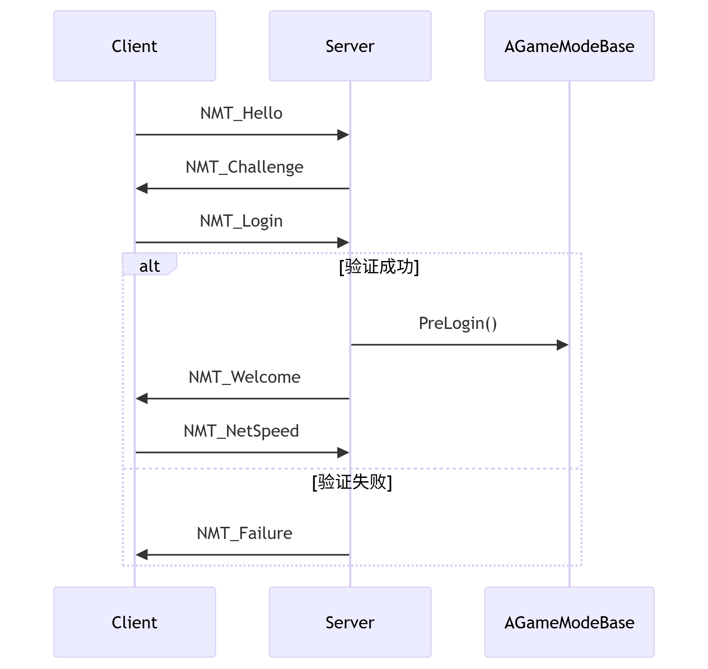

# 网络

## 基本类型

### FSocket

代码太多了，直接贴文件路径吧 

[TestActor.h文件](./Src/TestSocket/TestActor.h)

[TestActor.cpp文件](./Src/TestSocket/TestActor.cpp)

核心代码就两部分

- 对于客户端来说，主要是 连接 和 发送信息

```cpp
ISocketSubsystem* System = ISocketSubsystem::Get();

// 创建地址
Addr = System->CreateInternetAddr();
// 创建 Socket
Host = System->CreateSocket(NAME_Stream, TEXT("default"), false);
// 绑定 Socket 和 地址 进行连接
Host->Connect(*Addr);
// 发送信息
Host->Send((uint8*)TCHAR_TO_UTF8(Data), Size, Send);
```

- 对于服务器来说，主要是 监听 和 收取信息

```cpp
ISocketSubsystem* System = ISocketSubsystem::Get();
Socket = System->CreateSocket(NAME_Stream, TEXT("default"), false);
// 绑定 IP 和 端口
Socket->Bind(*Addr);
// 监听事件
Socket->Listen(5);

while(true)
{
    // 检查是否有待处理的连接
    Socket->Wait(ESocketWaitConditions::WaitForRead, FTimespan::FromSeconds(2));

    // 接受新连接
    ClientSocket = Socket->Accept(TEXT("ClientConnection"));

    // 接收数据
    TArray<uint8> ReceiveData;
    ClientSocket->Recv(ReceiveData.GetData(), ReceiveData.Num(), Read);
    FString ReceivedString = FString(UTF8_TO_TCHAR(reinterpret_cast<const char*>(ReceiveData.GetData())));
}
```

这里  `CreateSocket` 的参数是 `NAME_Stream`，除了 `NAME_Stream` 之外还有 `Name_DGram`

- `Name_Stream` 是数据流，用于 TCP 连接
- `Name_DGram` 是 `DataGram` 的简写，表示是数据报，用于 UDP 连接

另外 `CreateSocket` 还有第三个参数 `ProtocolType`，有两个属性值 `FNetworkProtocolTypes::IPv4` 和 `FNetworkProtocolTypes::IPv6` 分别对应 IPV4 和 IPV6 两个

`FSocket` 属于网络中最基础的地方，根据不同的平台底层实现不同

比如 `FSocketWindows` 就是用于 Windows 平台的

### UNetDriver

是一个比较重要的网络管理类，可以简单看下其结构

```cpp
class UNetDriver : public UObject, public FExec
{
public:
    ENGINE_API virtual bool InitBase(bool bInitAsClient, FNetworkNotify* InNotify, const FURL& URL, bool bReuseAddressAndPort, FString& Error);
    ENGINE_API virtual bool InitConnect(class FNetworkNotify* InNotify, const FURL& ConnectURL, FString& Error ) PURE_VIRTUAL( UNetDriver::InitConnect, return true;);
    ENGINE_API virtual bool InitListen(class FNetworkNotify* InNotify, FURL& ListenURL, bool bReuseAddressAndPort, FString& Error) PURE_VIRTUAL( UNetDriver::InitListen, return true;);

    // 其他函数

public:
    UPROPERTY()
	TObjectPtr<class UNetConnection> ServerConnection;

	UPROPERTY()
	TArray<TObjectPtr<UNetConnection>> ClientConnections;

    // 其他属性
}
```

| UNetDriver 派生类 | 作用 |
| --- | --- |
| UWebSocketNetDriver | 用于实现 WebSocket 协议的网络通信 |
| UIpNetDriver | 用于实现基于 IP 的网络通信 |
| USteamSocketsNetDriver | 利用Steam新网络协议层的网络插件，从 Steamworks SDK 1.46版起 |
| UDemoNetDriver | 用来支持游戏录像和回放 |

在 `UWorld` 中存储着 `NetDriver` 用于网络信息处理，同时也有一个 `DemoNetDriver` 来支持游戏录像和回放

注意 `UNetDriver` 中维护着两个数组：`ServerConnection` 和 `ClientConnections`

- 如果当前属于 Server，那么使用 `ClientConnections` 来存储 Server 与 Client 的连接信息
- 如果当前属于 Client，那么使用 `ServerConnection` 来存储该 Client 与 Server 的连接信息

客户端通过调用 `UNetDriver::InitConnect` 来创建 `ServerConnection` 并初始化数据

服务器通过调用 `UNetDriver::InitListen` 来初始化服务端数据

`UNetDriver` 会监听 `TickDispatch` 和 `TickFlush`，驱动整个网络系统的更新循环


### UPlayer 和 UNetConnection

#### UPlayer

`UPlayer` 是 UE 中表示玩家的实体。并不直接与游戏场景中的对象关联，而是用于封装玩家的输入来源

这个 UPlayer 可以是一个本地人类玩家(Local Player)、一个网络连接的远程玩家 (NetConnection)，甚至在某些情况下可以代表一个模拟玩家的 AI

```cpp
class UPlayer : public UObject, public FExec
{
	TObjectPtr<class APlayerController> PlayerController;
	int32 CurrentNetSpeed;          // 表示当前用于该玩家网络连接的实际带宽限制
	int32 ConfiguredInternetSpeed;  // 为该类型玩家连接预设的最大带宽限制
	int32 ConfiguredLanSpeed;       // 在局域网环境下，为该类型玩家连接预设的最大带宽限制
}
```

作为输入信号的发起者， `UPlayer` 代表了从本地或网络设备传递到游戏的所有输入

`UPlayer` 与 `PlayerController` 关联，帮助将玩家的输入转化为游戏中的动作和反馈，同时支持多种输入方式：键盘、手柄、网络信号

`UPlayer` 的设计核心是解耦输入处理与具体的游戏兑现，更关注玩家的输入行为，而非具体的游戏场景

#### ULocalPlayer

ULocalPlayer 代表本地玩家，包含输入设备关联、视口配置等信息

```cpp
class ULocalPlayer : public UPlayer
{
	FUniqueNetIdRepl CachedUniqueNetId;     // 
	TObjectPtr<class UGameViewportClient> ViewportClient;       
	FVector2D Origin;                       // 上一帧 主视口区域 在归一化坐标空间中左上角的位置
	FVector2D Size;                         // 上一帧 主视口区域 在归一化坐标空间中的尺寸
	FVector LastViewLocation;               // 上一帧 玩家的摄像机位置
	TEnumAsByte<enum EAspectRatioAxisConstraint>        AspectRatioAxisConstraint;              // 当前游戏视口的宽高比与项目设置不同时，如何调整视场角
	TSubclassOf<class APlayerController>        PendingLevelPlayerControllerClass;      // 关卡切换过程中临时存储将要生成的 APlayerController 类
	uint32 bSentSplitJoin:1;                // 是否已发送分屏加入请求
}
```

#### UNetConnection

`UNetConnection` 就是抽象出来的连接，用于管理玩家与服务器，或其他客户端之间的网络通信

负责 接收 和 发送 玩家的输入数据，使网络玩家能够在游戏中进行互动

```cpp
class UNetConnection : public UPlayer
{

}
```


## 初始化流程

### Server 的初始化流程



在 `Listen` 函数中会创建 `NetDriver`、`Socket` 并绑定

`InURL` 配置如下，监听接口为 17777


`Listen` 代码的执行流程如下


### Client 的初始化流程


默认创建下面这些 `Channel`，都是继承自 `UChannel` 基类，用于表示传递某种类型的信息

| Name | 对象 |
| --- | --- |
| Control | UControlChannel |
| Voice | UVoiceChannel |
| DataStream | UDataStreamChannel |
| Actor | UActorChannel |


