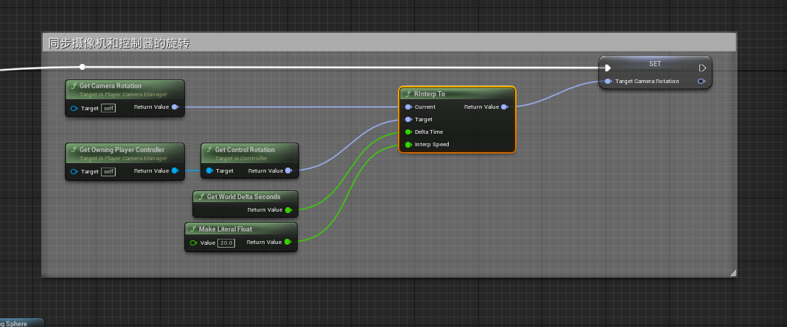

# 高级动画系统

## 从零开始复刻高级动画系统

[学习参考网址](https://www.bilibili.com/video/BV1WS4y1g7bf)

[高级动画系统](https://www.unrealengine.com/marketplace/zh-CN/product/advanced-locomotion-system-v1)

### ALS基本操作

右上角的UI菜单，使用`tab`键进行打开关闭，该UI菜单显示了ALS的一些基本操作

该UI显示了键位及其对应操作  

| 键位 | 控制操作 |
| --- | --- |
| WASD | 角色前后左右 |
| Mouse(鼠标) | 控制相机旋转移动 |
| Space | 角色跳跃 |
| LAlt(左Alt键) | 角色蹲(再次点击站起) |
| 2 * LAlt(连续两次左Alt) | 角色翻滚 |
| LShift(左Shift) | 角色冲刺 |
| LCtrl(左Ctrl) | 角色慢走 |
| 鼠标右键 | 瞄准 |
| Q | 覆盖菜单，切换角色状态，使用滚轮切换 |
| MW(mouse while 鼠标滑轮) | 切换覆盖菜单的选项 |
| 1， 2 | 切换旋转模式(1：速度方向 2：注视模式) |
| 单击C | 左肩、右肩视角切换 |
| 长按C | 切换角色视角(第一人称、第三人称) |
| X | 布娃娃系统 
| M | 切换角色模型 |

| 键位 | Debug操作 |
| --- | --- |
| Z | 时间膨胀，这里一般是让动作变慢，观察角色动作是否符合预期 |
| V | 调试视角 |
| T | 显示射线(角色脚步的两条射线做IK计算，翻墙时做IK和是否可以攀爬的计算) |
| Y | 显示形状(箭头、视角、摄像机锚点等) |
| U | 显示层的颜色，中立姿势为红色，被覆盖的位置变为其他颜色 |
| I | 显示角色信息 |

### 摄像机系统

- 摄像机主要的三种变换
  1. smooth 摄像机位置的平滑过度
  2. shake 摄像机的晃动
  3. fov 摄像机视野的变化

ALS中摄像机会根据角色的运动状态的变换进行调整 

> 走路时根据脚步来进行左右晃动  
> 根据运动速度调整晃动幅度  

即：角色不同的状态，会对应不同的**配置参数**

摄像机的管理交给**摄像机控制器**，摄像机控制器交给**玩家控制器**来操作  

新建`ALS_PlayerCameraManager`继承自`PlayerCameraManager`，并将其指定给玩家控制器

而在`ALS_PlayerCameraManager`控制器中，需要重写`Blueprint Update Camera`方法

- `Blueprint Update Camera`方法
  - `bool`类型变量 `Return Value`：表示该返回值是否生效(false不生效，true生效)
  - `Real`类型变量 `New Camera FOV`：表示视角，默认为0，设置为90查看效果
  - `Vector3`类型变量 `New Camera Location`：表示相机坐标

`PlayerController`在程序运行时，会捕获到可操作的角色对象，此时会触发`On Posses`事件，同时`PlayerController`中又设置了`CameraController`，因此在`CameraController`新建函数提供接口，让`PlayerController`将被控制的角色设置给`CameraController`即可

为了方便Debug，可以使用`Draw Debug Sphere`节点绘制Debug用的球体

为了减少各个模块之间的耦合情况，可以使用`Interface`接口来进行数据传递，比如这里的摄像机的坐标就需要依赖角色的位置和角度来设置

因此定义接口`BPI_Get_3P_PivotTarget`，由**角色基类实现**，由**角色类重写**

这样`CameraController`就可以通过`PlayerController`设置过来的`Player`变量，获得锚点信息

> 此处具体操作是定义在`Custom Camera Behaviour`方法中的，该方法由`Blueprint Update Camera`方法调用，只是把计算换了个函数罢了

### 试着做角色蓝图的基础移动

> 参数记一下

因为角色的控制大部分是可以公用的，所以这些输入事件的接收就放在**角色基类**中

调用`Character Movement`的`AddMovementInput`、`AddControllerYawInput`和`AddControllerPitchInput`函数控制角色的移动和旋转

因为控制角色前后左右移动都是相对世界而言的，所以需要`Get Control Rotation`的`Yaw`属性，来获得角色的旋转角度，从而计算角色的前后、左右移动的世界坐标

### 让摄像机变得具有丝滑感

此处涉及到插值计算`RInterpTo`，`RInterp To`这个节点实际上就是Rotation的一个插值的表述，该节点有四个参数，`Current`和`Target`分别表示当前角度和目的角度，`DeltaTime`为间隔时间，一般设置为我们计算机计算每帧的时间，`Interp speed`为调整的速度，越小速度越慢

这里`Get Owning Player Controller`获得的就是设置了该`Camera Controller`的`Player Controller`；`Get World Delta Seconds`获得每帧间隔

