# 通用工具

**C++11以及之后的版本**

## Pair和Tuple

### Pair

```cpp
namespace std{
	template <typename T1, typename T2>
	struct pair {
		// member
		T1 first,
		T2 second;
		...
	}
}
```

| 操作 | 影响 |
| --- | -- |
| pair\<T1, T2>  p | 默认构造函数，简历一个pair |
| pair\<T1, T2> p(val1, val2) | 建立一个pair，类型为T1，T2，val1和val2分别为初始值 | 
| pair\<T1, T2>  p(p2) | 拷贝构造 |
| pair\<T1, T2> p(std::move\<p2\>) | Move构造函数 |
| p = p2 | 赋值，运行隐式类型转换 |
| p = std::move(p2) | p2的值move assgn给p，运行隐式类型转换 |
| p.first | pair内第一个value |
| p.second | pair内第二个value |
| get\<0\>\(p\) | 等同 p.first |
| get\<1\>\(p\) | 等同p.second |
| p1 == p2 | 判断 p1.first == p2.first \&& p2.second == p1.second |
| p1.swap(p2) | p1和p2互换数据 |
| swap(p1, p2) | p1和p2互换数据 |
| make_pair(val1, val2) | 返回一个pair，数据类型自动转换 |

```cpp
namespace std {
	template <typename T1, typename T2>
	struct pair{
		...
		pair(const T1& x, const T2& y);
		template<typename U, typename V> pair(U&& x, V&& y);
		template<typename... Args1, typename... Args2>
			pair(piecewise_construct_t,
				tuple<Args1...> first_args,
				tuple<Args2...> second_args);
		...
	};
}
```

> 涉及到**变参模板**和**完美转发**  

**便捷函数`make_pair()`**

无须i而而出类型就能生成一个pair对象，`std::make_pair(42, '@')`等价于`std::pair<int, char>(42, '@')`  
但是该函数会蛀蚀实参，即`make_pair("a", "xy")`产生的是`std::pair<const char*, const char*>` 而不是 `std::pair<const char[2], const char[3]>`；同理`std::pair<int, float>(42, 7.77)`也与`std::make_pair(42, 7.77)`不同，后者等价于`std::pair<int, double>`

**支持`std::move`和`std::ref`操作**

```cpp

int i = 0;
auto p = std::make_pair(std::ref(i), std::ref(i));
p.first ++;
p.second ++;
std::cout << "i = " << i < std::endl;	// 输出2

std::string s,t;
auto p = std::make_pair(std::mvoe(s), std;:move(t));

```

**pair的比较**

```cpp
namespace std{
	template <typename T1, typename T2>
	bool operator== (const pair<T1, T2> &x, const pair<T1, T2>& y)
	{
		return x.first == y.first && x.second == y.second;
	}
	
	template<typename _Ty1, typename _Ty2> 
	bool operator<(const pair<_Ty1, _Ty2>& _Left,
		const pair<_Ty1, _Ty2>& _Right)
	{
	return (_Left.first < _Right.first ||
		(!(_Right.first < _Left.first) && _Left.second < _Right.second));
	}
}
```

### Tuple（不定数的值组）
- 通过明白的声明，或者使用便捷函数`make_tuple()`，创建tuple
- 通过`get<>()`的模板方法访问tuple元素

```cpp
tuple<string, int, int, complex<double>> t;
tuple<int, float ,string> t1(41, 6.3, "nico");
cout << get<0>(t1) << " ";
cout << get<1>(t1) << " ";
cout << get<2>(t1) << " ";

auto t2 = make_tuple(22, 33, "nico");
get<1>(t1) = get<1>(g2)
```

Tuple允许引用传递

```cpp
std::string s;
tuple<string&> t(s);
get<0>(t) = "hello";
cout << s << endl;
```

- Tuple不是寻常容器，在运行期才传入一个索引值是不允许的
- Tuple还有拷贝、复制和比较操作，允许隐式类型转换，但是元素个数必须绝对温和
- 如果两个Tuple 的所有元素都相等，则整体相等
- 检查某个Tuple是否小于另一个Tuple，采用的是字典编篡式比较法则

**便捷函数`make_tuple()`和`tie()`**

`make_tuple`会根据传入的值建立tuple，不需要明确指出元素的类型

```cpp
make_tuple(22, 44, "nico")
string s;
make_tuple(std::ref(s))	// 等价 std::tuple<string&>
```

| 操作 | 效果 |
| --- | --- |
| tuple<T1, T2, ..., Tn> t | 根据n个给定类型建立一个tuple，各元素按类型初始化 |
| tuple<T1, T2, ..., Tn> t(v1, v2... vn) | 以n个给定类型的元素建立tuple，并按值初始化 |
| t = t2 | 将t2赋值给t |
| t = pair | 将pair赋值给一个带两个元素的tuple |
| t1 ! = t2 | |
| t1 == t2 | |
| t1 > t2 ||
| t2 < t2 ||
| t1 >= t2 ||
| t1 <= t2 ||
| t1.swap(t2) | 互换ti和t2的数据 |
| swap(t1, t2) | 互换t1和t2的数据 |
| make_tuple(v1, v2, ...) | 根据数值类型建立一个tuple |
| tie(ref1, ref2, ...) | 建立一个由引用构成的tuple |

```cpp
std::string s;
auto x = std::make_tuple(s);
std::get<0>(x) = "my value";		// 只改变了x中的值，没有改变字符串s

auto y = std::make_tuple(std::ref(s));
std::get<0>(y) = "my value";		// y和字符串s都改变了

std::tuple<int, float, std::string> t(77, 1.1, "more light");
int i;
float f;
std::string s;
std::tie(i, f, s) = t;

// 使用std::ignor允许呼吁列tuple的某些元素

std::tuple<int, float, std::string> t(77, 1.1, "more light");
int i;
std::string s;
std::tie(i, std::ignor, s) = t;

```

**Tuple和初值列**

```cpp
namespace std{
	template <typename... Type>
	class tuple{
		public:
			explicit tuple(const Type&...);
			template<typename... UTypes> explicit tuple(&&...);
	}
}
```

这里使用explicit，是为了避免单一值被隐式转换为"带一个元素"的tuple

```cpp
template <typename... Args>
void foo(const std::tuple<Args...> t);

foo(42);				// 报错
foo(make_tuple(42));	// 正常

// 对于pair和容器（除了array之外）可以
std::vector<int> func()
{
	return {1, 2, 3};	// 正确
}

std::tuple<int, int, int> func2()
{
	return {1, 2, 3};	// 错误
}
```

**其他特性**

- `tuple_size<tupletype>::value`获得元素个数
- `tuple_element<idx, tupletype>::type`取得第idx个元素的类型
- `tuple_cat()`可将多个tuple串接成一个tuple

## 智能指针

确保指针的寿命和指针所指向的对象寿命一致，不能出现空指针或者多次删除指向对象，也不能出现资源泄漏问题。为了解决这些问题，通常的做法就是smart pointer 智能指针

智能指针可以在很多方面发挥其智能，并且满足不同终点，但是也可能因为他的智能付出代价。

- Class `shared_ptr` 实现共享式拥有的概念。多个智能指针可以指向相同对象，该对象和其相关资源会在“最后一个引用被销毁”时释放。为了在结构较复杂的情况中执行上述工作，标准库提供`weak_ptr`,`bad_weak_ptr`和`enable_shared_from_this`等辅助类
- Class `unique_ptr`实现独占式拥有或严格拥有概念，保证同一时间内只有一个智能指针可以指向该对象。可以移交拥有权。它对于避免资源泄露特别有用

> C++98标准库提供了一个智能指针`auto_ptr<>`，其审计是为了执行现今的`unique_ptr`所提供的服务。C++11中强烈不推荐使用
> 所有智能指针都定义于\<memory\>中

### shared_ptr
多个`shared_ptr`可以共享（拥有）同一个对象，对象的最末一个拥有者有责任销毁对象，并清理与该对象相关的所有资源

如果对象以`new`产生，默认情况下工作由`delete`完成，但是也可以（往往必须）定义其他清理方法

**使用`shared_ptr`**

```cpp
int main()
{
	shared_ptr<string> pNico(new string("nico"));
	shared_ptr<string> pJutta(new string("jutta"));

	// 像普通指针一样使用shared_ptr
	(*pNico)[0] = 'N';
	pJutta->replace(0, 1, "J");

	// push_back时传入的其实是shared_ptr的拷贝
	vector<shared_ptr<string>> whoMadeCoffee;
	whoMadeCoffee.push_back(pJutta);
	whoMadeCoffee.push_back(pJutta);
	whoMadeCoffee.push_back(pNico);
	whoMadeCoffee.push_back(pJutta);
	whoMadeCoffee.push_back(pNico);

	for(auto ptr : whoMadeCoffee)
	{
		cout << *ptr << " ";
	}
	cout << endl;

	*pNico = "Nicolai";

	for(auto ptr : whoMadeCoffee)
	{
		cout << *ptr << " ";
	}
	cout << endl;

	cout << "use_count :" << whoMadeCoffee[0].use_count() << endl;
}

/*
Jutta Jutta Nico Jutta Nico 
Jutta Jutta Nicolai Jutta Nicolai 
use_count :4
*/
```

因为`shared_ptr`的构造函数时`explicit`的

```cpp
shared_ptr<string> pNico = new string("nico"); // 错误
shared_ptr<string> pNico{new string("nico")};  // 正确
shared_ptr<string> pNico = make_shared<string>("nico"); // 正确、快、安全

shared_ptr<string> pNico;
pNico = new string("nico");	// 错误
pNico.reset(new string(nico));// 正确
```

**自定义Deleter**

声明属于自己的delter

```cpp
shared_ptr<string> pNico(new string("nico"), [](string *p){
	cout << "delete " << *p << endl;
	delete p;
});
// 在删除该对象的时候 打印一句话
```

当智能指针最末一个拥有者被销毁时，会调用后面的lambda函数

**处理数组**

```cpp
std::shared_ptr<int> p(new int[10], [](int *p){
	delete[] p;
});
std::shared_ptr<int> p(new int[10],std::default_delete<int[]>());

std::unique_ptr<int[]> p(new int[10]);	// 正确
std::shared_ptr<int[]> p(new int[10]);	// 错误
std::unique_ptr<int, void(*)(int*)> p(new int[10], [](int *p){
	delete[] p;
});
```

> `shared_ptr`不提供`opeartor []`
> `unique_ptr`有一个针对数组的偏特化版本，该版本提供`operator []`取代 `operator *`和`opeartor ->`

### `weak_ptr`

使用`shared_ptr`在某些情况下无法与做或不被期望

- 环式指向，两个`shared_ptr`互相指向对方
- “明确想共享但不愿拥有”。指针的寿命比其指向的对象更长，因此`shared_ptr`绝不释放对象，而寻常指针可能不会注意到他们所指向的对象已经不再有效，导致“访问已被释放的数据”

`weak_ptr`中，一旦最末一个拥有该对象的`shared_ptr`失去了拥有权，任何`weak_ptr`都会自动成空。因此，在default和copy构造函数之外，`weak_ptr`值提供“接受一个shared_ptr”的构造函数

### `unique_ptr`

```cpp
void func()
{
	ClassA* ptr = new ClassA;
	...
	delete ptr;
}
// 可能在中间有return语句 退出整个函数 导致delete没有执行 从而导致内存泄漏

void func()
{
	ClassA* ptr = new ClassA;
	try{
		...
	}
	catch(...)
	{
		delete ptr;
		throw;
	}
	delete ptr;
}
// 为了防止内存泄漏而捕捉所有异常 虽然减少泄漏可能 但是代码冗余
```

智能指针可以在自身被销毁时释放其所指向的数据，而且由于它是一个局部变量，所以会在函数结束时被自动销毁——不论正常结束还是异常结束。而`unique_ptr`就是这样的智能指针

`unique_ptr`时“其所指向的对象”的唯一拥有者，那么当`unique_ptr`被销毁时，其所指向的对象也就自动被销毁

```cpp
std::unique<ClassA> ptr(new ClassA);
// 不需要delete和catch子句
```

**使用`unique_ptr`**

`unique_ptr`跟平常指针的使用非常相似，操作符`*`用来提领指向对象，操作符`->`用来访问成员

```cpp
std::unique_ptr<std::string> up(new std::string("nico"));

(*up)[0] = 'N';
up->append("lai");
std::cout << *up << std::endl;
```

- `unique_ptr`不提供算数 例如 ++ 等，因为指针的运算往往是麻烦的来源
- `unique_ptr`不允许以赋值语法将一个寻常的指针当作初始值，因此必须直接初始化`unique_ptr`
- `unique_ptr`不必一定拥有对象，可以是empty
- `unique_ptr`可以被赋予`nullptr`或者调用`reset()`
- 调用`release()`获得`unique_ptr`拥有的对象并放弃拥有权
- 调用操作符`bool()`可以判断智能指针是否拥有对象
- `unique_ptr`喝nullptr比较，查询是否拥有对象

```cpp
std::unique_ptr<int> up = new int;		// 错误
std::unique_ptr<int> up(new int);		// 正确

std::unique_ptr<std::string> up;		// 正确 不拥有对象
up = nullptr;
up.reset();

std::unique_ptr<std::string> up(new std::string("nico"));
...
std::string* sp = up.release();

if(up)
{
	std::cout << *up << std::endl;
}

if(up != nullptr)
if(up.get() != nullptr)
```

**转移`unique_ptr`的所有权**

```cpp
std::string *sp = new std::strinng("hello");
std::unique_ptr<std::string> up1(sp);
std::unique_ptr<std::string> up2(sp);	// 报错
std::unique_ptr<std::string> up3(up1);	// 报错 
std::unique_ptr<std::string> up4(std::move(up1));// 正确
std::unique_ptr<std::string> up5;
up5 = up1;				// 报错
up5 = std::move(up1);	// 正确
```

> 这里会报出一个运行期错误，需要由程序员来避免这种错误的出现
> 如果`up5 = std::move(up1)`的赋值动作之前，up5原本拥有其他对象，那么会先执行`delete`操作，删除该对象

**源头和去处**

函数可以利用`unique_ptr`所有权的转移将拥有权移交给其他函数

1. 函数接收端

如果将一个`unique_ptr`由`std::move()`的右值引用当作函数实参，那么被调用函数的参数将会取得`unique_ptr`的拥有权。因此，如果该函数不再转移所有权，对象将会在函数结束时被`delete`

```cpp
void func(std::unique_ptr<ClassA> up)
{
	...
}

std::unique_ptr<ClassA> up(new ClassA);
...
func(std::move(up));
...
```

2. 函数是供应端

当函数返回一个`unique_ptr`，其拥有权会转移至调用端场景内

```cpp
std::unique<ClassA> source()
{
	std::unique_ptr<ClassA> ptr(new ClassA);
	...
	return ptr;
}

void func()
{
	std::unique_ptr<ClassA> p;
	for(int i=0; i<10; ++i)
	{
		p = source();
	}
}
```

> 每当`source()`被调用，就会`new`创建对象并返回给调用者，夹带着其拥有权。返回值被赋值给p，于是拥有权也被转移给p。
> 在循环的第二次迭代中，对p赋值导致p先前拥有的对象被删除
> 当`func()`函数结束，p被销毁，最后一个p拥有的对象被析构
> 理论上无论如何都不会发生资源泄露，即使抛出异常，任何拥有数据的`unique_ptr`也能确保数据被删除

**`unique_ptr`被当作成员**

在Class内使用`unique_ptr`可避免你资源泄露。
如果使用`unique_ptr`取代普通指针，就不需要析构函数，因为对象被删除会连带使所有成员被删除。此外`unique_ptr`也可协助避免“对象初始化期间因抛出异常而造成资源泄漏”。

**处理数组**

```cpp
std::unique_ptr<std::string> up(new std::string[10]); // 错误写法
std::unique_ptr<std::string[]> up(new std::string[10]); // 正确
```

> C++标准库为`unique_ptr`提供了针对数组的偏特化版本
> **但是**`unique_ptr`不提供操作符`*`和`->`，改而提供`[ ]`用来访问其所指向的数组中的某个对象

```cpp
std::unique_ptr<std::string[]> up(new std::string[10]);
...
std::cout << *up << std::endl;		// 错误
std::cout << up[0] << std::endl;	// 正确
```

### `auto_ptr`
已经被C++11明确声明不再支持


## 数值的极值

C++标准库借由templatenumberic_limits提供极值

| 类型 | 最小长度 |
| --- | --- |
| char | 1byte |
| short int | 2 bytes |
| int | 2 bytes |
| long int | 4 bytes |
| long long int | 8 bytes |
| float | 4 bytes |
| double | 8 bytes |
| long double | 88 bytes |

**`numeric_limits<>`**

- 使用template，通常是为了对所有类型一次性地撰写出一个通用解决方案
- 在必要时以template为每个类型提供共同接口

```cpp
namespace std{
	// 通用性的template，为所有类型提供默认极值
	template <typename T>
	class numeric_limits {
		public:
			static constexpr bool is_specialized = false;
			...
	};

	// 各具体类型的极值，由特化版本提供
	template<> class numeric_limits<int>{
		static constexpr bool is_specialized = true;
		static constexpr int min() noexcept{
			return -2147483648;
		}
		static constexpr int max() noexcept{
			return 2147483648;
		}
		static constexpr int digits = 3;
		...
	}
}
```

特化版本包括所有数值基础类型：bool、char、signed char、unsigned char、char16_t、char32_t、wchar_t、short、unsigned short、int、unsigned int、long、unsigned long、long long、unsigned long long、float、double和long double

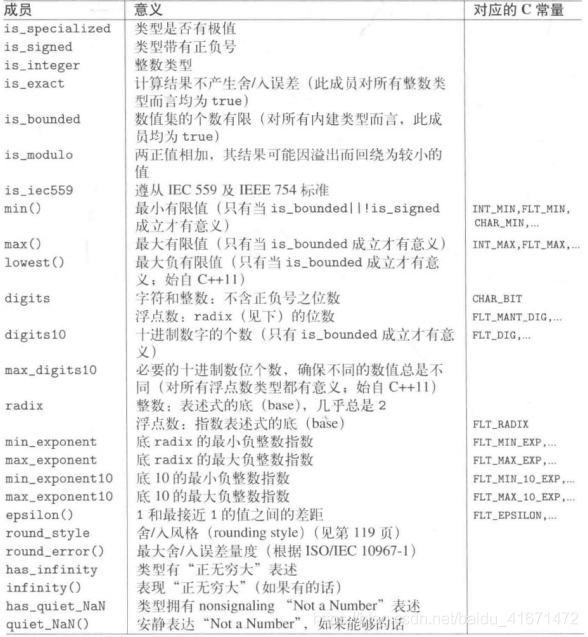
```cpp
// CLASS numeric_limits<int>
template<> class numeric_limits<int>
	: public _Num_int_base
	{	// limits for type int
public:
	_NODISCARD static constexpr int (min)() noexcept
		{	// return minimum value
		return (INT_MIN);
		}

	_NODISCARD static constexpr int (max)() noexcept
		{	// return maximum value
		return (INT_MAX);
		}

	_NODISCARD static constexpr int lowest() noexcept
		{	// return most negative value
		return ((min)());
		}

	_NODISCARD static constexpr int epsilon() noexcept
		{	// return smallest effective increment from 1.0
		return (0);
		}

	_NODISCARD static constexpr int round_error() noexcept
		{	// return largest rounding error
		return (0);
		}

	_NODISCARD static constexpr int denorm_min() noexcept
		{	// return minimum denormalized value
		return (0);
		}

	_NODISCARD static constexpr int infinity() noexcept
		{	// return positive infinity
		return (0);
		}

	_NODISCARD static constexpr int quiet_NaN() noexcept
		{	// return non-signaling NaN
		return (0);
		}

	_NODISCARD static constexpr int signaling_NaN() noexcept
		{	// return signaling NaN
		return (0);
		}

	static constexpr bool is_signed = true;
	static constexpr int digits = 31;
	static constexpr int digits10 = 9;
	};
```

> `numeric_limits<int>`的源码

```cpp
#include <iostream>
#include <limits>
#include <string>

using namespace std;
int main()
{
	cout << "max(short)" << numeric_limits<short>::max() << endl;
	cout << "max(int)" << numeric_limits<int>::max() << endl;
	cout << "max(long)" << numeric_limits<long>::max() << endl;

	return 0;
}

```

## Type Trait 和 Type Utility

Type trait由TR1引入而在C++11中大幅扩展的一项机制，定义出因type而异的行为。它们可被用来针对type优化代码，以便一同特别能力

所谓type trait，提供一种用来处理type属性的方法。他是个tamplate，可在编译器根据一个或多个template实参（通常也是type）产出一个type或value

```cpp
template <typename T>
void foo(const T& val)
{
	if(std::is_pointer<T>::value) {
		std::cout << "foo() called for a pointer " << std::endl;
	}
	else {
		std::cout << "foo() called for a value" << std::endl;
	}
}
```

> `std::is_pointer`定义于`<type_traits>`，用来检查T是否是个指针类型
> `std::is_pointer`产生的值若非`true_type`就是`false_type`，而`::value`产出的就是false和true

```cpp
template<typename T>
void foo(const T& val)
{
	std::cout << (std::is_pointer<T>::value? *val : val) << endl;
}
```

上述代码会报错，原因是如果传入参数为`int`，在*编译*阶段`*val`就会报错  
不过代码可以写成下面的方式

```cpp
template <typename T>
void foo_impl(const T& val, std::true_type)
{
	std::cout << *val << endl;
}

template <typename T>
void foo_impl(const T& val, std::false_type)
{
	std::cout << val << endl;
}

template <typename T>
void foo(const T& val)
{
	foo_impl(val, std::is_pointer<T>());
}
```

**针对整型类型的弹性处理**

```cpp
template <typename T>
void foo_impl(T val, true_type);

template <typename T>
void foo_impl(T val, false_type);

template <typename T>
void foo(T val)
{
	foo_impl(val, std::is_integral<T>());
}
```

**处理共通类型**

处理两个或多个类型中的“共通类型”。那是一个可以用来丢夫两个不同类型的值“的类型，前提是的确存在一个共通类型。

比如，不同类型的两个值的综合或最小值，就应该使用这个所谓的共通类型，否则怎么判断其返回值类型

```cpp
template <typename T1, typename T2>
??? min(const T1 &x, const T2 &y);

// 如果使用type trait
template <typename T1, typename T2>
typename std::common_type<T1, T2>::type min(const T1&x, const T2& y);
```

> 如果两个实参都是int或都是long，或一个int另一个long，则`std::common_type<T1, T2>`会产出`int`
> 如果一个是string，另一个是`const char*`，则产出结果为`std::string`

- 类型判断工具
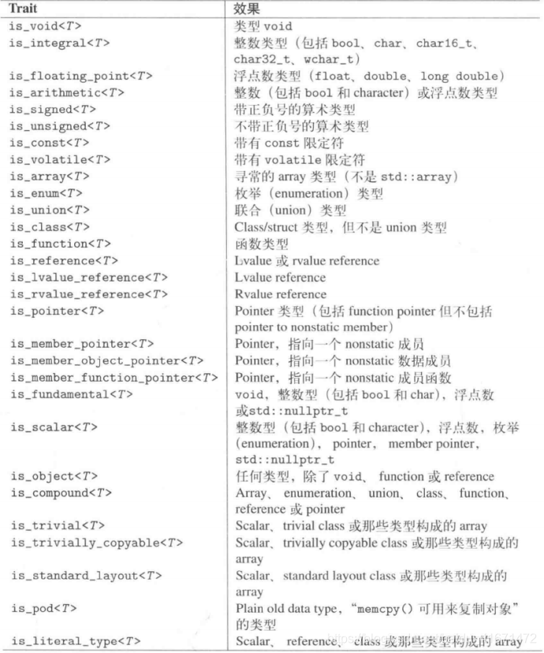
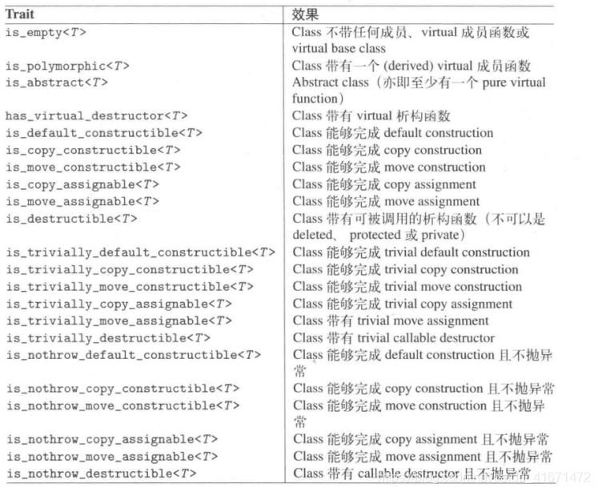

> `bool`和所有`character`(char、char16_6等)类型都被视为整数类型
> `std::nullptr_t`被视为基础数据类型

- 用以检测类型关系

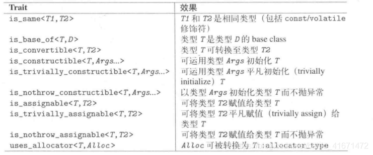

- 用以完成类型改变

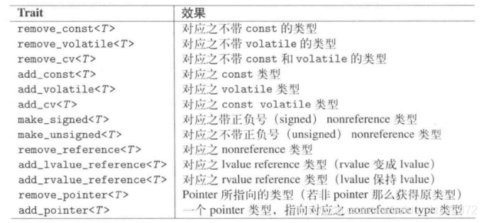

```cpp
typedef const int& T;
add_const<T>::type					// const int&
add_lvalue_reference<T>::type		// const int&
add_rvalue_reference<T>::tye		// const int&
add_pointer<T>::type				// const int*
make_signed<T>::type				// 无法定义的行为
make_unsigned<T>::type				// 无法定义的行为
remove_const<T>::type				// const int&
remove_reference<T>::type			// const int
remove_pointer<T>::type				// const int&
```

```cpp
typedef int T;
add_const<T>::type				// const int
add_lvalue_reference<T>::type	// int &
add_rvalue_reference<T>::type	// int &&
add_pointer<T>::type			// int *
make_signed<T>::type			// int
make_unsigned<T>::type			// unsigned int
remove_const<T>::type			// int
remove_reference<T>::type		// int
remove_pointer<T>::type			// int
```

- 其他`type trait`

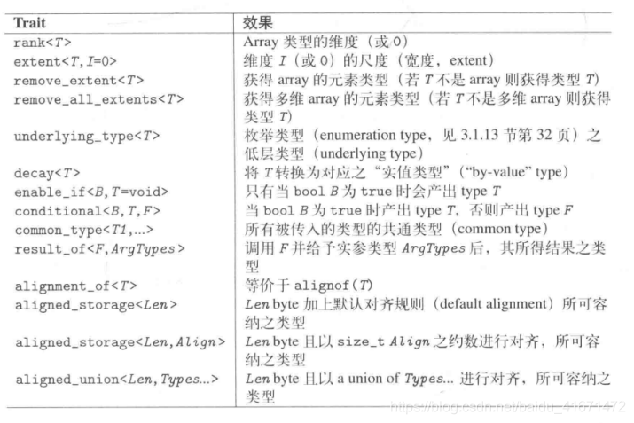

```cpp
rank<int>::value			0
rank<int[]>::value			1
rank<int[6]>::value			1
rank<int[][7]>::value		2
rank<int[5][7]>::value		2

extent<int>::value			0
extent<int[]>::value		0
extent<int[5]>::value		5
extent<int[][7]>::value		0
extent<int[5][7]>::value	5
extent<int[][7],1>::value	7
extent<int[5][7],1>::value	7
extent<int[5][7],2>::value	0

remove_extent<int>::type		int
remove_extent<int[]>::type		int
remove_extent<int[5]>::type		int
remove_extent<int[][7]>::type	int[7]
remove_extent<int[5][7]>::type	int[7]

remove_all_extents<int>::type		int
remove_all_extents<int[]>::type		int
remove_all_extents<int[5]>::type	int
remove_all_extents<int[][7]>::type	int
remove_all_extents<int[5][7]>::type	int
```

**外覆器**

声明于`<functional>`中的`std::reference_wrapper<>`，主要用于将引用传给模板函数。对于一个给定类型T，这个类提供`std::ref()`用以隐式转换为`T&`，一个`std::cref()`用以隐式转换为`const T&`，这往往允许模板方法得以操作数据而不用另写特化版本

```cpp
template <typename T>
void foo(T val);

int x;
foo(std::ref(x));
// T变成了 int &

int y;
foo(std::cref(y));
// T变成了const int &
```

## `ratio<>`编译期分数运算

```cpp
namespace std{
	class ratio {
		public:
			typedef ratio<num, den> type;
			static constexpr intmax_t num;
			static constexpr intmax_t den;
	}
}
```

> `intmax_t`是个带正负号的整数类型、有能力表现任何带正负号的证书（至少具备64bit）
> 分子和分母都是`public`且被自动降至最简式

```cpp
#include <ratio>
#include <iostream>
using namespace std;

int main()
{
	typedef ratio<5, 3> FiveThirds;
	cout << FiveThirds::num << "/"" << fiveThirds::den << endl;
	ratio<42, 42> one;
	cout << one.num << "/" << one.den << endl;

	ratio<0> zero;
	cout << zero.num << "/" << zero.den << endl;
	return 0;
}

```
 
 | 运算 | 意义 | 结果 |
 | --- | --- | --- |
 | ratio_add | 换算出ratio的和 | ratio<> |
 | ratio_subtract| 换算出ratio的差 | ratio<> |
 | ratio_multiply| 换算出ratio的积 | ratio<> |
 | ratio_divide| 换算出ratio的商 | ratio<> |
 | ratio_equal|  检查是否相等 == | true_type或false_type |
 | ratio_not_equal| 检查是否不相等 != |  true_type或false_type |
 | ratio_less| 检查是否小于 < |  true_type或false_type |
 | ratio_less_equal| 检查是否小于等于 <= | true_type或false_type |
 | ratio_greater| 检查是否大于 > | true_type或false_type |
 | ratio_greater_equal| 检查是否大于等于 >= |  true_type或false_type |
 
 **预定义的`ratio`单位**

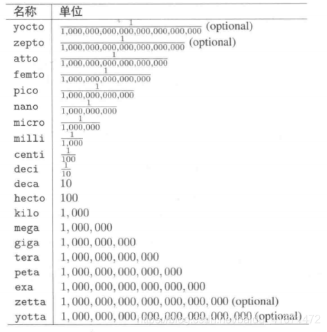

```cpp
std::nano
```

## 几个头文件

**`<cstddef>`**

| 标识符 | 意义 |
| --- | --- |
| NULL | 指针值， 用来表示”未定义“或”无值“ |
| nullptr_t | nullptr的类型 开始于C++11 |
| size_t | 一种无正负号类型，用来表示大小（例如元素个数） |
| ptrdiff_t | 一种带正负号类型，用来表示指针指甲牛的距离 |
| max_align_t | 所有环境的最大齐位所对应的类型 |
| offsetof(type, mem) | 表示成员mem在某个struct或union中的偏移量 |

**`<cstdlib>`**

| 定义 | 意义 |
| --- | --- |
| EXIT_SUCCESS | 程序正常结束 |
| EXIT_FAILURE | 程序不正常结束 |
| exit(int status) | 退出（离开）程序并清理static对象 |
| quick_exit(int status) | 退出程序时以`at_quick_exit()`清理 |
| _Exit(int status) | 退出程序而不清理 |
| abort() | 退出程序（在某些系统上可能导致崩溃） |
| atexit(void (*func)()) | 退出程序时调用`func` |
| at_quick_exit(void (*func)()) | 在`quick_exit()` 上调用`func` |

**`<cstring>`**

| 定义 | 意义 |
| --- | --- |
| memchr(const void* ptr, int c, size_t len) | 在ptr所指的前len个byte中找出字符c |
| memcmp(const void* ptr, const void** ptr2, size_t len) | 比较ptr1和ptr2所指的前len个bytre |
| memcpy(void* toPtr, const void* fromPtr, size_t len) | 将fromPtr所指的前llen个byte复制到toPtr |
| memmove(void* toPtr, const void *fromPtr, size_t len) | 将formPtr所指的前len个byte复制到toPtr |
| memset(void *ptr, int c, size_t len) | 将ptr所指的前len个byte赋值位字符c |

# 标准模板库

## 容器

1. 序列式容器
	- 有序集合，其内每个元素均有确凿的位置——取决于插入时机和地点，与元素值无关
	- array、vector、deque、list、forward_list

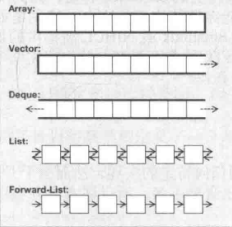


2. 关联式容器
	- 已排序集合，元素位置取决于其value或者key和给定的某个排序准则
	- 自动为其元素排序，排序准则以函数形式呈现用来比较value
	- 通常关联式容器由二叉树实现出来
	- set、multiset、map、multimap

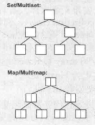


3. 无序容器
	- 其内每个元素的位置都无关紧要，唯一重要的是某特定元素是否位于此集合内。元素值或安插顺序都不影响。
	- 通常用hash表来实现，内部结构是一个由链表组成的数组
	- 唯一关心的是 某个特定元素是否位于容器内
	- unordered_set、unordered_multiset、unordered_map、unordered_multimap

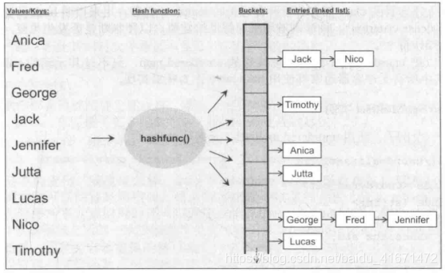


**std::vector**

vector置于一个动态数组中管理

- 允许随机访问，通过索引访问任何一个元素
- 在尾部附加元素或移除元素都很快速
- 在中段或起始端安插元素比较费时，因为安插点后的所有元素都必须移动以保持原本的相对次序

**std::deque**

双向数组或双相队列  
是一个动态数组，可以向两端发展，因此不论在尾部或头部安插元素都十分迅速

```cpp
int main()
{
	std::deque<float> coll;
	for(int i=0; i<=6; ++i)
	{
		coll.push_front(i*1.1);
	}
	for(int i=0; i<coll.size(); ++i)
	{
		cout << coll[i] << " " ;
	}
	return 0;
}
```

**std::array**

是一个在固定大小的数组内管理元素（不可以改变元素个数）
必须建立时就指明其大小
允许随机访问

```cpp
std::array<std::string, 6> coll = {"hello", "world"};
for(int i=0; i<coll.size(); ++i)
{
	cout << i << " : " << coll[i] << endl;
}
```

**std::list**

`std::list<>`是由双向链表实现而成
不提供随机访问，因此如果要访问第10个元素，需要先访问前9个元素
在任何位置上执行安插或删除动作都非常迅速，因为只需该百年链接点九号

```cpp
int main()
{
	std::list<char> coll;
	for(char c='a'; c <= 'z'; ++c)
	{
		coll.push_back(c);
	}
	for(auto elem : coll)
	{
		cout << elem << " ";
	}
	std::cout << std::endl;
	while(!coll.empty())
	{
		cout << coll.front() << " ";
		coll.pop_front();
	}
	
}
```

> elem永远是当前正在被处理的元素的一个拷贝，coll内部并没有任何东西被改变

**forward_list**

是一个由元素构成的单向链表
不支持`push_back()`或者`size()`

**set**

元素依据其value自动排序，每个元素只能出现一次，不允许重复

**multiset**

和set唯一的区别是元素可以重复

**map**

每个元素都是k/v键值对，key是排序准则，每个key只能出现一次，不允许重复

**multimap**

和map唯一的区别就是元素可以重复

**其他容器**

- `std::string`
- 普通C语言数组
- 用户自定义容器

**容器适配器**

为了满足特殊需求，C++标准库提供了一些所谓的*容器适配器*，同事也是预定义容器

- stack
- queue
- priority_queue

## 迭代器

C++11开始，使用`rangge-based for`循环来处理所有元素，可以用来迭代所有元素，直到找到目标
有时我们希望找到某个元素，并存放在某个位置，以便后续能够继续迭代或者进行其他操作，这就是*迭代器*

**迭代器**是一个“可遍历STL容器全部或部分元素”的对象。迭代器用来表现容器中的某一个位置

- `Operator *` 返回当前位置的元素值
- `Operator ++` 令迭代器前进至下一元素 部分可以用`--`回到上一元素
- `Operator == !=` 判断两个迭代器是否指向同一位置
- `Operator =` 对迭代器赋值，也就是知名迭代器所指向的元素位置

迭代器的给人的感觉就像使用指针操作数组元素一样，不同的是**迭代器**是所谓的智能指针，具有遍历复杂数据结构的能力，其内部运作极值取决于其遍历的数据结构

所有容器类都提供一些基本的成员函数，使我们得以取得迭代器并用迭代器来遍历所有元素

- `begin()` 返回一个迭代器，指向容器的起点
- `end()`返回一个迭代器返回元素终点（最后一个元素的下一个位置，其内容为空）

于是`begin()`和`end()`组成一个半开区间（`[)`）
1. 为遍历元素时的循环结束时机提供一个简单的判断依据，只要尚未达到`end()`循环就可以继续
2. 不必对空区间采取特殊处理手法，空区间的`begin()`等于`end()`

```cpp
int main(){
	list<char> coll;
	for(char c= 'a'; c <= 'z'; ++c)
		coll.push_back(c);

	list<char>::const_iterator pos;
	for(pos = coll.begin(); pos != coll.end(); ++pos){
		cout << *pos << " "; 
	}
}
```

迭代器pos被声明于循环之前，其类型是只想容器内的常量元素迭代器

1. *container*::iterator 以读/写 模式 遍历元素
2. *container*::iterator 以 只读 模式 遍历元素

在循环内部，*pos表示当前元素。因为这里定义的是`const_iterator`，所以你不能改变元素内容，以迭代器的观点来看，元素是常量，不能更改。
如果使用非常量迭代器，而且元素本身的类型也是非常量，就可以通过迭代器来改变元素值

```cpp
list<char>::iterator pos;
for(pos = coll.begin(); pos != coll.end(); ++pos)
{
	*pos = tuupper(*up);
}
```

如果用迭代器遍历的是 `map` 或者 `multimap`，则pos会指向key/value的pair，使用`pos->first`和`pos->second`访问key和value


**++pos 和pos++**

前面使用的都是前置式递增，因为它比后置式递增效率高
后置式递增内部需要一个临时变量，因为它必须存放迭代器的原本位置并返回它

这种效率改善几乎总适无关紧要的，所以只是推荐而不是强制

**cbegin()和cend()**

C++11开始，可以使用`auto`关键字代替迭代器的精确类型

```cpp
auto pos = coll.begin()
```

除了代码精简之外，采用这种循环写法，万一容器类型有所改变，程序整体仍能保持较佳的健壮性

*但是*使用`auto`回到导致迭代器失去常量（constness）性，可能引发计划外的赋值风险，因为`begin()`返回的是一个`cont::iterator`的迭代器

从C++11开始，容器提供 `cbegin()`和`cend()`，他们返回的类型就是`cont::const_iterator`对象

```cpp
for(auto pos = coll.cbegin(); pos != coll.end(); ++pos)
{
	...
}
```

**Range-Based for循环和迭代器**

```cpp
for(type elem : coll){
	...
}
// 等价于
for(auto pos = coll.begin(), end = coll.end(); pos != end; ++pos)
{
	type elem = *pos;
	...
}
```

对于容器而言，range-based for 循环其实不过是个便捷接口，用来迭代它“所接收到的集合区间”内每一个元素

**迭代器种类**

1. 向前迭代器
	- 只能够以累加操作符`++`向前迭代
	- unordered_set、unordered_multiset、unordered_map、unordered_multimap、forward_list
2. 双向迭代器
	- 可以双向行进：以递增运算前进或以递减运算后退
	- list、set、multiset、map、multimap
3. 随机访问迭代器
	- 不仅具备双向迭代器的所有属性，还具有随机访问能力
	- 你可以对迭代器增加或减少一个偏移量、计算两迭代器间的距离，或使用<和>之类的相对关系操作符
	- vector、deque、array、string

STL还停工两个类别

1. 输入型迭代器：向前迭代时能够读取/处理value（input Stream迭代器）
2. 输出型迭代器：向前迭代时能够涂写value（Inserter和output Stream迭代器）

为了写出尽可能与容器类型无关的泛型代码，最好不要使用随机访问迭代器的特有操作

## 算法（Algorithm）

STL提供一些标准算法，包括查找、排序、拷贝、重新排序、修改、数值运算等基本而普通的算法

```cpp
#include <algorithm>

int main()
{
	std::vector<int> coll = {2 ,3 ,4, 5, 6};
	auto minPos = min_element(coll.begin(), coll.end());
	auto maxPos = max_element(coll.begin(), coll.end())'

	sort(coll.begin(), coll.end());;
	auto pos = std::find(coll.begin(), coll.end(), 3);

	std::reverse(pos3, coll.end());

	for(int i=0; i<coll.size(); ++i)
	{
		cout << coll[i]<< " ";
	}

	return 0;
}

```

- `min_element / max_element` 传入两个实参所谓欲处理的范围，返回一个目标位置的迭代器，指向目标元素
- `sort`前两个参数也是表示欲处理的范围，对范围内数据进行值排序，第三个参数为仿函数用于处理自定义判断大小
- `find`在给定范围内查找某值，上面代码查找的就是值为3的第一个元素。如果找到返回目标元素的迭代器，否则返回`coll.end()`
- `reverse`将区间内的元素反转放置

所有算法有是用来处理一个或多个区间内的元素。这样的接口灵活又危险，调用者必须确保经由两实参定义出来的区间是有效的。

- 两个迭代器必须隶属同一容器
- 前后的放置是正确的
- 区间都是半开区间，包括起始元素不包括末尾元素的位置

否则有可能出现死循环、程序崩溃、访问内存禁区等情况

```cpp
pos = find_if(coll.begin(), coll.end(), [](int i){
	return i == 25 || i == 35;
});
if(pos == coll.end()){
	...
}
else if(*pos = 25){

}
```

**处理多重区间**

有几个算法需要同时处理多重区间。通常必须舍弟那个一个区间的起点和终点，至于其他区间，只需要设定起点即可，终点通常可由第一区间的元素数量推导出来

```cpp
if(equal(coll1.begin(), coll1.end(), coll2.begin())){
	// 
}
```

*如果某个算法用来处理多重区间，那么当你调用它时，无比确保第二（以及其他）区间所拥有的元素个数至少和第一区间内的元素个数相同*

> 特别是执行涂写动作时，无比确保目标区间够大

```cpp
int main()
{
	list<int> coll1 = {1, 2, 3, 4, 5, 6};
	vector<int> coll2;

	copy(coll1.cbegin(), coll1.end(), coll2.begin());
}
```


> `copy`算法，将第一区间内的全部元素拷贝到目标区间

- 为了让目标区间够大
	- 要么一开始就给它一个正确大小
	- 要么就显示变更大小

> 关联式容器不用但系这个大小的问题，因为关联式容器不可能被当作覆写式算法的操作目标

## 迭代器的适配器 Iterator Adapter

1. 安插型迭代器

使算法以安插方式而非覆写方式运作，可以解决算法的目标空间不足问题

- 如果你对某个元素赋值，会引发“对其所属集合的安插动作”，至于安插位置要视情况而定
- 单步前进不会造成任何东京

```cpp
list<int> coll1 = {1, 2, 3, 4, 5};
vector<int> coll2;
copy(col1.cbegin(), coll1.cend(), back_inserter(coll2));
vector<int> coll3;
copy(col1.cbegin(), coll1.cend(), front_inserter(coll3));
vector<int> coll4;
copy(col1.cbegin(), coll1.cend(), inserter(coll4, coll4.begin()));
```

- Back Inserter 安插于容器最末端
- Front Inserter 安插于容器最前端
- General Inserter 一般inserter，作用于 初始化接收的第二实参

2. 串流迭代器

Stream Iterator 串流迭代器被用来读/写stream
提供必要的抽象性，使得来自键盘的输入像是个集合，能够从中读取内容
同理也可以把一个算法的输出结果重新导向到某个文件或屏幕上

```cpp
int main()
{
	vector<string> coll;
	copy(istream_iterator<string>(cin),	// 起始
		 istream_iterator<string>(),	// 结束
		 back_inserter(coll));			// 目标

	sort(coll.begin(), coll.end());

	unique_copy(coll.cbegin(), coll.cend(), ostream_iterator<string>(cout, "\n"));
}
```

> 从标准输入设备读取所有输入文字，然后排序，然后将他们打印到屏幕

- 表达式 `istream_iterator<string>(cin)`
	- 产生一个从“标准输入串流cin”读取数据的stream iterator（串流迭代器）
	- `<string>`这个template表示串流迭代器使专门用来读取该类型（string）的元素
	- 这些元素一般通过`operator >>`被读取进来

- 表达式`istream_iterator<string>()`
	- 会调用串流迭代器的默认构造函数，产生一个代表“串流结束符”，这个东西代表的意义使 你不能再从中读取任何东西
	- 这里的end-of-stream迭代器正式作为区间终点的作用
	- 因此这个算法可以从`cin`读取所有`string`，直到无法读取为止

3. 逆向迭代器

反向迭代器会造成算法逆向操作，其内部将对递增操作符的调用转化为递减操作符的调用，反之亦然

所有提供双向或随机访问迭代器的容器都可以通过他们的成员函数`rbegin()`、`rend()`、`crbegin()`和`crend()`返回反向迭代器和只读反向迭代器

```cpp
int main()
{
	vector<int> coll{1, 2 ,3 ,4 ,5 ,6};
	copy(coll.crbegin(), coll.crend(), ostream_iterator<int>(cout, " "));
	cout << endl;
	// 输出 6 5 4 3 2 1 
	return 0;
}
```

> 再次提醒，千万不要对一个并未表现出有效元素的位置使用操作符`*`或`->`。比如`*coll.crend()`，没人知道它代表什么

4. 搬移迭代器

用来讲任何对低层元素的访问转换为一种moev操作。也就是说允许从一个容器移动元素至另一个容器，不存是在构造函数内或是在运用算法时。


## 更易型算法

这里指的是 会移除或重排或修改元素的算法


**移除元素**

```cpp
int main()
{
	list<int> coll;
	for(int i=1; i<=6; i++)
	{
		coll.push_back(i);
		coll.push_front(i);
	}
	PRINT_LIST(coll);	// 6 5 4 3 2 1 1 2 3 4 5 6 
	remove(coll.begin(), coll.end(), 3);
	PRINT_LIST(coll);	// 6 5 4 2 1 1 2 4 5 6 5 6
}
```

`remove`并没有改变集合中的元素数量。`crend()`返回的还是当初那个终点，`size()`返回的还是当初那个大小    
变化的是元素次序，有些元素被删除了，数值为3的那个元素被其后的元素覆盖了，至于集合尾端那些违背覆盖的元素，原封不动——从逻辑角度来说，这些元素已经不属于这个集合了
但是`remove()`返回了新的终点，改良后代码为

```cpp
int main()
{
	list<int> coll;
	for(int i=1; i<=6; i++)
	{
		coll.push_back(i);
		coll.push_front(i);
	}
	PRINT_LIST(coll);	// 6 5 4 3 2 1 1 2 3 4 5 6 
	list<int>::iterator end = remove(coll.begin(), coll.end(), 3);
	PRINT_LIST(coll);	// 6 5 4 2 1 1 2 4 5 6 5 6
	cout << "删除元素个数" << std::distance(end, coll.end()) << endl;
	coll.erase(end, coll.end());
	PRINT_LIST(coll);	// 6 5 4 2 1 1 2 4 5 6
}
```

> 这里`distance`的功用时返回两个迭代器之间的距离
> `erase`方法是彻底删除想要删除的区间内的元素

**更易关联式和无序容器**

更易型蒜贩指的是会移除、重排、修改元素的算法，若用于关联式容器或无序容器会出问题。

那么如何从关联容器和无序容器中删除元素呢？使用他们的成员函数。
每一种关联式容器和无序容器都提供，用以移除元素的成员函数

```cpp
int main()
{
	set<int> coll = {1, 2, 3 ,4 ,5 ,6};

	PRINT_SET(coll);
	int num = coll.erase(3);	// 1 2 3 4 5 6
	cout <<< "被删除的数量" << num << enld;	// 1
	PRINT_SET(coll);			// 1 2 4 5 6
	return 0;
}
```

**算法和成员函数**

就算我们使用符合条件的算法，也不一定比容器本身的成员函数好用

比如算法`remove()`，算法本身不知道它将工作在list上，因此它为了能工作在任何容器上工作，做了些四平八稳的处理：改变元素值，从而重新排列元素；但这样就跟list的优点（修改链接而非值来实现元素增删改）相违背  
但是list针对所有 更易型算法提供了一些对应成员函数，特性优化

## 以函数作为算法的实参

最简单的例子莫过于`for_each()`算法了

```cpp
void print(int element)
{
	cout << element << " " ;
}

int main()
{
	vector<int> coll;
	for(int i=1; i<=9; ++i)
	{
		coll.push_back(i);
	}
	for_each(coll.cbegin(), coll.cend(), print);
	cout << endl;
	return 0;
}
```

算法以数种态度来面对这些辅助函数：有的视为可有可无，有的视为必要。可以利用它们来指定查找准则、排序准则，或定义某种操作使其在“容器元素转换至另一容器”时被调用

```cpp
int square(int val)
{
	return val * val;
}
int main()
{
	std::set<int> coll;
	set::vector<int> coll2;
	
	for(int i=0; i<9; ++i){
		coll1.insert(i);
	}
	
	PRINT_SET(coll1);

	std::transform(coll1.cbegin(), coll1.cend(), std::back_inserter(coll2), square);
	PRINT_VECTOR(coll2);
}
```

**判断型**

即表达式返回值为bool类型，常被用来作为排序准则或查找准则

1. 单参判断式

```cpp

// 判断是否是质数
bool isPrime(int number)
{
	number = abs(number);
	if(number == 0 || number == 1)
		return false;

	int divisor;
	for(divisor = number / 2; number % divisor != 0; -divisor){;}
	return divisor == 1;
}

int main()
{
	list<int> coll;
	// 插入值
	...
	auto pos = find_if(coll.cbegin(), coll.cend(), isPrime);
	if(pos != coll.cend())
	{
		cout << *pos << endl;
	}
}

```

`find_if`实在给定区间内寻找使“转入的单参数判断式”结果为true的**第一个**元素


2. 双参判断式

比较两个实参的特定属性，比如大小等

```cpp
class Person{
	int a;
	int b;
}

bool personSortCompare(const Person &x, const Person &y)
{
	if(x.a != y.a)
		return x.a < y.a;
	return x.b < y.b;
}

int main())
{
	deque<Person> coll;
	// 插入数据
	...
	sort(coll.begin(), coll.end(), personSortCompare);
}

```

## Lambda表达式

Lambda使一种在表达式或语句内指明函数行为的定义式

最小型的lambda表达式没有参数，什么也不做

```cpp
[]{
    std::cout << "hello world" << endl;
}
```

或者直接调用

```cpp
[]{
    std::cout << "hello world" << endl;    
}();
```


或者作为参数传递 调用

```cpp
auto l = []{
    std::cout << "hello world" << endl;
};

l();
```

lambda总是由一个所谓的*lambda introducer*引入：就是一组方括号， 可以在方括号内指明捕获区域。如果无需访问外部数据，则方括号内部可以为空。static对象，例如`std::cout`可以被直接使用

在lambda的*lambda introducer*和*lambda body*之间，还可以指定参数类型、异常和返回值类型

```cpp
[]() -> double{
    return 4;
}
```

**Capture捕获作用域**

在方括号内，可以指明一个捕获类型来处理外部作用域内未被传递为实参的数据

- `[=]`意味着外部作用域以赋值的方式传递给lamdba，你可以读取所有可读数据，但是不能改动
- `[&]`意味着以引用的方式传递给lambda，因此对所有数据的涂写都合法，前提是数据可以涂写
- 也可以单独指明哪些数据值传递哪些数据引用传递

```cpp
int x = 0;
int y = 32;
auto func = [x, &y] {
    std::cout << "x : " x << std::endl;
    std::cout << "y : " y++ << std::endl;    
};

func();
func();
std::cout << "final y : " y++ << std::endl;    
```

你也可以使用`mutable`关键字来修改值传递的lambda中的值

```cpp
int id = 0;
auto func = [id]() mutable{
    std::cout << id << std::endl;
    id++;
}
id = 42;        
func();         // 输出0
func();         // 输出1
func();         // 输出2
```

**lambda的类型**

lambda的类型是个不具名*function object*。每个lambda表达式的类型是独一无二的。因此如果想根据类型声明对象，可借助`template`或`auto`，或者`std::function<> class template`来指明一个一般化类型

```cpp
std::function<int(int, int)> returenLambda()
{
    return [](int x, int y) {
        return x * y;
    };
}

int main()
{
    auto func = returenLambda();
    std::cout << func(1, 2) << std::endl;  // 输出2
    return 0;
}
```

**使用lambda的好处**

运用lambda具体指定STL框架内部将采取的行为

```cpp
deque<int> coll;

// 插入数据
...

int x = 10, y = 20;
auto pos = find_if(coll.cbegin(), coll.cend(), [=](int i){
    return i > x && i < y;    
});


// 很快找到第一个大于10小于20的值
if(pos != coll.cend())
{
    std::cout << *pos << std::endl;    
}

```

- 相比手写循环判断大小，`find_if`节省了遍历代码
- 相比于定义仿函数判断大小，lambda节省了定义函数的部分

**lambda的局限性**

```cpp
auto cmp = [](const Person&x, const Person&y)
{
    if(x.a != y.a)    
        return x.a < y.a;
    return x.b < y.b;
}
std::set<Person, decltype(cmp)> coll(cmp);
```

因为关联型容器需要指出一个排序准则，而`std::set`需要只指明lambda类型，所以需要使用`decltype`来推理类型，同时你也必须把lambda对象传给coll构造函数，否则coll会调用被传入的排序准则的默认构造函数，而根据C++语言规则，lambda没有默认构造函数。
从这种情况来说，还不如class定义某个函数对象作为排序准则来的直观

另一种情况，是lambda无法拥有跨越多次调用都能保存下来的内部状态。如果需要这种内部状态，则需要在外围作用域中声明一个对象或变量，将它搭配某种捕获区域传入lambda

## 函数对象

任何东西，只要其行为像函数，他就是一个函数。因此如果你定义了一个对象，行为像函数，他就可以被当作函数使用。这种对象称为函数对象、或者仿函数

```cpp
class X{
    public:
        return-value operator() (arguments) const;
        ...
}

X fo;
fo(arg1, arg2);
// 等价于
fo.operator()(arg1, arg2);


class PrintInt{
    public:
        void operator() (int elem) const{
            cout << elem << " ";
        }
};

int main()
{
    vector<int> coll;
    for (int i=1; i<= 9; i++)
    {
        coll.push_back(i);
    }
    for_each(coll.cbegin(), coll.cend(), PrintInt());
    cout << endl;
    return 0;
}
```

这里的` for_each(coll.cbegin(), coll.cend(), PrintInt());`语句等价于

```cpp
Operation for_each(Iterator act, Iterator end, Operation op)
{
    while(act != end) {
        op(*act)l
        ++act;
    }
    return op;
}
```

其实就在在循环中调用`PrintInt::operator()(*act)`，这种写法十分对于没见过的人来说十分诡异，令人讨厌，但是它具有几个优点和实用性

1. 函数对象是一种带状态的函数
2. 每个函数对象有其自己的类型
3. 函数对象通常比寻常函数快

```cpp
void add10(int& elem)
{
    elem += 10;    
}

template <int theValue>
void add(int& elem)
{
    elem += theValue;
}

class AddValue{
    private:
        int theValue;
    
    public:
        AddValue(int v) : theValue(v){} // 构造函数
        void operator()(int& elem) const {
            elem += theValue;
        }
}

int func()
{
    vector<int>  coll;
    // todo 插入值 1 2 3 4 5
    ...
    // 写死函数为10
    for_each(coll.begin(), coll.end(), add10);     // 值变为 11 12 13 14 15

    // 编译器确定为10
    for_each(coll.begin(), coll.end(), add<10>);   // 值变为 21 22 23 24 25

    // 程序运行时也可以动添加不确定的值
    for_each(coll.begin(), coll.end(), AddValue(10));   // 值变为 31 32 33 34 35
}
```

相比于写死的函数，函数对象可以指定不同的值


**预定义的函数对象**

C++标准库内预定义了一些函数对象，涵盖一些基础运算
比如：`operation <` 对应`std::less<>`

```cpp
std::set<int, less<int>> coll1;     // 从小到达排序
std::set<int, greater<int>> coll2;  // 从大到小排序
```

当然函数对象也可以用于STL算法中

```cpp
coll;           // 1 2 3 
transform(coll.cbegin(), coll.cend(), coll.begin(), negate<int>());
// -1 -2 -3
transform(coll.cbegin(), coll.cend(), coll.begin(), multiplies<int>());
// 1 4 9
```

- `negate<int>`将修改数值正负号
- `multiplies<int>`将数值平方

> 预定义的**函数对象**，其头文件是`<functional>`

**Binder**

可以使用特定的*function adapter*函数适配器，或者所谓的*binder*，将预定义的函数对西昂和其他数值结合为一体

```cpp
transform(coll1.begin(), coll1.end(), back_inserter(coll2), bind(multiplies<int>, _1, 10));
// 将coll1数组中的值乘以10 并将结果插入到coll2末尾
replace_if(coll2.begin(), coll2.end(), bind(equal_to<int>, _1, 70), 42);
// 将coll2数组中的70 替换为 42
coll2.erase(remove_if(coll2.begin(), coll2.end(), 
    bind(logical_and<bool>(),
    bind(greater_equal<int>(), _1, 50), 
    bind(less_equal<int>(), _1, 80))), 
    coll2.end());
```

> 注意，占位符(palceholder)有自己的命名空间：std::placeholders。所以需要引用命名空间才能使用_1或者_2作为binder的第一或第二参数


# 容器

## 容器的共同能力和共通操作

**共通能力**

1. 所有容器提供的都是值传递而非引用传递。容器进行元素的安插动作时，内部实施的是copy或move操作，而不是原理元素的引用。因此理想上STL容器的每个元素都必须能够被copy或move，当然如果存储的为指针就另当别论
2. 元素在容器内有特定顺序。每一种容器都会在“返回迭代器”的操作函数，这些迭代器可用来遍历各个元素
3. 一般而言，各项操作并非绝对安全，也就是说他们并不会检查每一个可能发生的错误。调用者必须确保传给操作函数的实参符合条件。违反条件会导致不明确的行为，那就是说任何事情都可能发生


**容器的共通操作**

- 初始化

每个容器类都提供一个默认构造函数、一个拷贝构造函数和一个析构函数

| 操作 | 效果 |
| --- | --- |
| T c | 默认构造函数 |
| T c(c2) | 拷贝构造函数 |
| T c = c2 | 拷贝构造函数 |
| T c(std::move(v)) | Move构造函数 |
| T c = std::move(v) | Move构造函数 |
| T c(x.beg, x.end) | 以[beg, end)区间内所有元素拷贝为初值 |
| T c({initlist}) | 建立一个容器，并以初始化列表为初值 |
| T c = {initlist} | 建立一个容器，并以初始化列表为初值 |
| c.~T() | 删除所有元素，释放内存 |
| c.empty() | 判断容器是否为空 |
| c.size() | 返回容器元素数量 |
| c.max_size() | 返回容器最大可能数量 |
| c1 == c2 | 判断是否相等 |
| c1.swap(c2) | 置换c1和c2的数据 |
| std::swap(c1, c2) | 置换c1和c2的数据 |
| c.begin() | 返回一个迭代器，指向第一个元素 |
| c.cbegin() | 返回一个不可修改(*const iterator*)迭代器，指向第一个元素 |
| c.end() | 返回一个迭代器，指向最末元素的下一个元素 |
| c.cend() | 返回一个不可修改迭代器，指向最末元素的下一个元素 |

```cpp
const std::vector<int> v1 = {1, 2 ,3 ,4 ,5};
const std::vector<int> v2{1, 2 ,3 ,4 ,5};

///
int carry[] = {1, 2 ,3 ,4 ,5};
std::set<int> c(std::begin(carry), std::end(carry));

///
std::vector<int> v1;
std::vector<int> v2 = std::move(v1);

```

- 赋值和`swap()`

对容器赋予元素时，所有元素被复制到目标容器内，可能存在大量的资源消耗。自C++起，可以使用*move assignment*取代上述赋值行为。所有容器都提供*move assignmeng*操作符，针对右值引而声明，其内部只是将指针（指向value所在的内存）交换而已，并不赋值所有value。

C++11并没有指明精确行为，只保证它拥有常量复杂度，而现实往往就是伤处做法。C++标准库仅仅指出，在一个*move assignment*之后，赋值操作的左侧容器将拥有右侧容器的所有元素，至于右侧容器的内容，此后将**不明确**

- 与大小相关的操作函数

1. `empty()` 判断容器是否为空，效率比`size() == 0`更快
2. `size()` 返回当前容器元素数量
3. `max_size()` 返回容器所能容纳最大元素数量

- 比较

除了无序容器(unordered)，常用的比较操作符`==, !=,  <, <=, >, >=`

1. 比较动作的两端必须属于同一类型
2. 如果两个容器的所有元素依次相等，则两个容器相等。（==常用来检查元素是否相等）
3. 采用”字典式“比较，来判断某个容器是否小于另一个容器


- 元素访问

最容易访问元素的方法

```cpp
for(const auto& elem : coll)
{
    std::cout << elem << std::endl;
}

for(auto& elem : coll)
{
    // 可以操作elem
    std::cout << elem << std::endl;
}

for(auto pos = coll.cbegin(); pos != coll.cend(); ++pos)
{
    std::cout << *pos << std::endl;
}

for(auto pos = cool.begin(); pos != coll.end(); ++pos)
{
    // 可以对pos指向的节点进行操作
    std::cout << *post << std::endl;
}
```

**容器提供的类型**

| 类型 | 效果 |
| --- | --- |
| size_type | 用来表现容器大小的无正负整数类型 |
| difference_type | 带正负号的差距值类型 |
| value_type | 元素的类型 |
| reference | 元素的reference的类型 |
| const_reference | 常量元素的reference的类型 |
| iterator | 迭代器类型 |
| const_iterator | 指向只读元素的迭代器类型 |
| pointer | 指向元素的指针类型 |
| const_pointer | 指向只读元素的指针类型 |

## Array

容器类`array<>`模塑出一个array，它包括一个寻常的C语言类型的数组，并提供一个STL容器结构。观念上array是指一系列元素，有着固定大小，因此无法增加或移除元素，只能改变元素内容

```cpp
#include <array>
namespace std{
    template <typename T, size_t N>
    class array;
}
```

array的元素可属于任何被指明的类型T。
第二个template参数用来指出这个array在其生命期中拥有的元素棵树。因此size()返回的总是N
array并不支持也不允许使用分配器(allocator)

**array的能力**

array会把元素复制到其内部的 *static C-style array*中，这些元素总是拥有一个明确次序，因此array是一种有序集合。
array允许随机访问，也就是在常量时间内直接访问任何元素，前提是知道元素位置
array打的迭代器属于随机访问迭代器，所以你可以对他引用任何STL算法
如果是一个固定元素量的序列，那么array将带来最佳效能，因为内存被分配与stack中，绝不会被重分配

- 初始化

array是唯一一个无任何东西被指定为初值时，也会被*预初始化*的容器，这意味着对于基础类型，初值可能不明确
你可以提供一个空白初始值列，这种情况下所有元素保证被初始化

```cpp
std::array<int, 4> x = {};                  // 全部初始化为0
std::array<int, 5> x = {1, 2, 3, 4, 5};     // 初始化为1， 2， 3 ，4 ，5
std::array<int, 5> x = {1};                 // 第一个初始化为1， 其他为0
std::array<int> x = {1, 2, 3, 4, 5, 6};     // 初始化
```

```cpp

template<class _Ty,
	size_t _Size>
	class array
	{	// fixed size array of values
        public:
        /////
        ... some function
        /////
            _Ty _Elems[_Size];
	};

```

从源码可见用来保存所有元素的那个成员是public的，但任何直接的访问都会导致不可预期的行为，也不具备移植性

- swap和move

array提供swap操作，因此可以和一个相同类型的容器（元素类型和元素个数都相同）置换彼此的元素
然而，arrary不能仅仅置换其内部pointer，基于这个原因，swap拥有线性复杂度，并且iterator和reference不会随着元素的置换而改变所指的容器，所以置换之后iterator和reference指向原本容器，但指向至不同元素

- 大小（size）

array大小为0是可能的，那就是个没有任何元素的array
这种情况下，begin()和end()，cbegin()和cend()以及相应的反向迭代器会释放出统一value
但是front()和back()的返回值就不买明确了

```cpp
std::array<int, 0> coll;
std::sort(coll.begin(), coll.end());    // 没影响  但也没意义
std::cout << coll.front() << std::endl; // ERROR 未知操作
```

**array的操作**

- 建立/复制/销毁

| 操作 | 效果 |
| --- | --- |
| array<Elem, N> c | 默认构造函数，建立一个array |
| array<Elem, N> c(c2) | 拷贝构造 |
| array<Elem, N> c = c2 | 拷贝构造 |
| array<Elem, N> c(std::move(c2)) | Move构造函数 |
| array<Elem, N> c = std::move(c2) | Move构造函数 |
| array<ELem, N> c = initlist | 取初值列的元素为初值 |

- 赋值

| 操作 | 效果 |
| --- | --- |
| c = c2 | 将c2的所有元素赋给c |
| c = std::move(c2) | 以move的方式赋值给c |
| c.fill(val) | 将val赋值给array的所有元素 |
| c1.swap(c2) | 置换c1和c2的数据 |
| swap(c1, c2) | 置换c1和c2的数据 |

- 元素访问

| 操作 | 结果 |
| --- | --- |
| c\[index] | 返回索引index所指的元素 |
| c.at(index) | 返回索引index所指的元素 |
| c.front() | 返回第一元素（不检查是否存在第一元素，数组可能为空）|
| c.back() | 返回最末元素（不检查是否存在最末元素，数组可能为空，操作可能越界） |

- 迭代器相关

| 操作 | 效果 |
| --- | --- |
| c.begin() | 返回一个随机迭代器，指向第一个元素 |
| c.end() | 返回一个随机迭代器， |
| c.cbegin() | 返回一个const的随机迭代器，指向第一个元素 |
| c.cend() | 返回一个const的随机迭代器，指向最末元素的下一个位置 |
| c.rbegin() | 返回一个反向的迭代器，指向反向迭代的第一元素 |
| c.rend() | 返回一个反向的迭代器，指向反向迭代的最末元素的下一个元素 |
| c.crbegin() | 返回一个const的反向迭代器，指向反向迭代的第一个元素 |
| c.crend() | 返回一个const的反向迭代器，指向反向迭代的最末元素的下一个元素 |


## Vector

vector模塑出一个动态数组。它本身是将元素置于动态数组种加以管理的一个抽象概念


```cpp
#include <vector>

namespace std{
    template<typename T, typename Allocator = allocator<T>>
    class vector;
}
```

**Vetor的能力**

vector将元素复制到内部的动态数组种，元素之间总是存在一定的顺序，所以vector是有序集合
vector支持随机访问，因此只要知道位置，就可以在常量的时间内访问任何元素
vector提供随机访问迭代器，使用任何STL算法

- 大小和容量

vector提供用于操作大小的函数有size()，empty()和max_size()；另一个相关的函数时capacity()返回vector实际能够容纳的元素量，如果超过这个量，vector就有必要重新分配内存

vector的容量很重要

1. 一旦内存重新分配，vector元素相关的所有reference，pointer，iterator都会失效
2. 内存重新分配很耗时间

所以如果程序使用了vector元素相关的 reference，pointer，iterator或程序对执行速度要求极高，就必须考虑容量问题

使用`reserve()`方法来预先分配适当容量，避免重新分配内存

```cpp
std::vector<int> v;
v.reserve(100);
```

或者初始化期间就向构造函数传递额外实参，构造足够的空间

```cpp
std::vector<T> v(100);
```

如果使用构造传参来构建足够空间，你的对象需要提供默认构造函数，如果默认构造函数比较繁琐，那么初始化动作也会很耗时，这时使用`reserve`比较好

vector的容量概念与string类似，但是vector不能通过`reserve`来缩减容量，如果`reserve`设置的值比当前vector容量低则不会有任何效果
事实上，为了防止内存破碎，在很多实现方案种即使不调用`reserve`，当第一次插入元素时也会一口气分配整块内存。如果有一大堆vector，但每个vector的实际元素寥寥无几，浪费内存相当可观
C++11引入一个新函数`shrink_to_fit()`，一个不具备强制力，可以缩减容量以符合当前的元素个数，这个要求不具强制力，以便为实现可能的特有优化保留回旋余地

> 因为不具备强制性，所以不能要求执行`shrink_to_fit()`后 `v.capacity == v.size()`

在C++11之前，有个简介缩减vector容量的窍门，两个vector交换内容后，两者容量也会互换，因此可以这么写

```cpp
template <tepename T>
void shrinkCapacity(std::vector<T> &v)
{
    std::vector<T> tmp(v);      // 把值给一个新的vector，新vecotr容量小于等于v的容量
    v.swap(tmp);                // 交换之后v的值没变，容量变为tmp的容量 
}
```

> 至于，swap后所有的reference，iterator和pointer都换了指向对象

**vector的操作**

- 构造、复制、销毁

| 操作 | 效果 |
| --- | --- |
| vector\<Elem\> c | 默认构造函数，建立一个空的vector |
| vector\<Elem\> c(c2) | 拷贝构造 |
| vector\<Elem\> c = c2 | 拷贝构造 |
| vector\<Elem\> c(std::move(c2)) | Move构造函数 |
| vector\<Elem\> c = std::move(c2) | Move构造函数 |
| vector\<ELem\> c = initlist | 取初值列的元素为初值 |
| vector\<ELem\> c(n) | 利用元素的默认构造函数生成一个大小为n的vector |
| vector\<ELem\> c(n, elem) | 建议个大小为n，每个元素值都是elem的vector |
| vector\<ELem\> c(beg, end) | 建立一个vecctor，以区间[beg, end)为初始值 |
| vector\<ELem\> c(initlist) | 以初值列的元素为初值 |
| c.~vector() | 销毁所有元素，释放内存 |

- 非更易型操作

| 操作 | 效果 |
| --- | --- |
| c.empty() | 返回容器是否为空 |
| c.size() | 返回目前元素个数 |
| c.max_size() | 返回元素个数的最大可能量 |
| c.capacity() | 返回不进行空间冲i性能分配条件下的元素最大容纳量 |
| c.reserve(num) | 如果容量不足num，就扩大 |
| c.shrink_to_fit() | 要求降低容量，以符合元素个数 |

- 赋值

| 操作 | 效果 |
| --- | --- |
| c = c2 | 将c2的全部元素赋值给c |
| c = move(v) | 将c2的所有元素以move的方式给予c |
| c = initlist | 将初值列表的所有元素赋值给c |
| c.assign(n, elem) | 复制n个elem，赋值给c |
| c.assign(beg, end) | 将区间[beg, end)内的元素赋值给c |
| c.assign(initlist) | 将初值列表initlist赋值给c |
| c1.swap(c2) | 置换c1和c2 |
| swap(c1, c) | 置换c1和c2 |

- 元素访问

| 操作 | 结果 |
| --- | --- |
| c\[index] | 返回索引index所指的元素 |
| c.at(index) | 返回索引index所指的元素 |
| c.front() | 返回第一元素（不检查是否存在第一元素，数组可能为空）|
| c.back() | 返回最末元素（不检查是否存在最末元素，数组可能为空，操作可能越界） |

> 访问vector之前先判断是否越界，做防御式编程


- 迭代器相关

| 操作 | 效果 |
| --- | --- |
| c.begin() | 返回一个随机迭代器，指向第一个元素 |
| c.end() | 返回一个随机迭代器， |
| c.cbegin() | 返回一个const的随机迭代器，指向第一个元素 |
| c.cend() | 返回一个const的随机迭代器，指向最末元素的下一个位置 |
| c.rbegin() | 返回一个反向的迭代器，指向反向迭代的第一元素 |
| c.rend() | 返回一个反向的迭代器，指向反向迭代的最末元素的下一个元素 |
| c.crbegin() | 返回一个const的反向迭代器，指向反向迭代的第一个元素 |
| c.crend() | 返回一个const的反向迭代器，指向反向迭代的最末元素的下一个元素 |

- 安插和移除元素

| 操作 | 效果 |
| --- | --- |
| c.push_back(elem) | 附加一个elem拷贝与末尾 |
| c.pop_back() | 移除最后一个元素，但不返回它 |
| c.insert(pos, elem) | 在iterator位置pos的前面插入一个elem拷贝，并返回新元素的位置 |
| c.insert(pos, n, elem) | 在pos之前插入n个elem拷贝，并返回第一个新元素的位置 |
| c.insert(pos, beg, end) | 在pos之前插入区间[beg, end)内所有元素 |
| c.insert(pos, initlist) | 在pos之前插入处置列表的所有元素 |
| c.emplace(pos, args...) | 在pos之前插入一个以args为初值的元素 |
| c.empalce_back(args...) | 附加一个以args为初始值的元于默默为 |
| c.erase(pos) | 移除pos位置上的元素，并返回下一元素位置 |
| c.erase(beg, end) | 移除[beg, end)区间内所有元素，返回下一元素位置 |
| c.resize(num) | 将元素数量改为num，多出来的元素都以默认构造函数创建 |
| c.resize(num, elem) | 将元素数量改为num，如果size变大，多出来的新元素都是elem的拷贝 |
| c.clear() | 移除所有元素，清空容器 |

## Deque

deque和vector非常相似，也采用动态数组来管理元素，提供随机访问，并有着和vector一模一样的接口
不同的是deque的动态数组都为都开放，因此能在头尾两端进行快速安插和删除

为了提供这种能力，deque通常时限为一组独立区块，第一区块朝某方向扩展，最末区块朝另一方向扩展

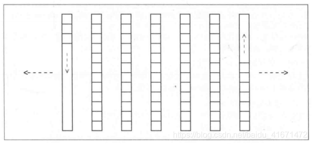


```cpp
#include <deque>

namespace std{
    template <typename T, typename Allocator = allocator<T>>
    class deque;
}
```

第一个参数用来表示元素类型，第二个参数可有可无，用来指定内存模型

**Deque的能力**

- 与vector不同的点
  - 两端都能快速安插、移除元素。这些操作可以是常量时间
  - 访问元素时deque内部结构会多一个间接过程，所以元素的访问和迭代器的动作会稍稍慢一些
  - 迭代器需要在不同区块间跳转，所以必须是个智能指针，不能是普通指针
  - 在内存区块大小有限制的系统中（PC系统），deque可以内含更多元素，因为它使用的不止一块内存
  - deque不支持对容器和内存的重新分配时机的控制。除了头尾两端，在任何地点安插或删除元素都将导致指向deque元素的任何指针、reference和iterator失效。
  - deque的内存分配优于vector，因为其内部结构显示，deque不必再内存重分配时赋值所有元素
  - deque会释放不再使用的内存区块，deque的内存大小时可缩减的，但要不要缩减由实现决定

- 与vector类似的点
  - 在中断安插、移除元素的速度相对较慢，因此所有元素都需要移动以腾出或填补空间
  - 迭代器属于随机访问迭代器*random-access iterator*

- 推荐使用deque的场景
  - 需要两端安插、移除元素
  - 无须指向容器内的元素
  - 需求“不再使用的元素必须释放”

> vector和deque的接口几乎一样

**deque的操作**

1. deque不提供容量操作(`capacity()`和`reserve()`)
2. deque直接提供函数完成头部元素的安插和删除
3. 其他操作相同

```cpp
std::deque<int> c({1, 2, 3, 4});
std::deque<int> c1;
c.empty();
c.size();
c.max_size();
c.shrink_to_fit();
c[index];
c.at(index);
c.front();
c.back();
c.begin();
c.end();
c.cbegin();
c.cend();
c.rbegin();
c.rend();
c.crbegin();
c.crend();
```

tip:
1. 除了`at()`，没有任何成员函数会检查“索引迭代器是否有效”
2. 元素的插入删除可能导致内存重新分配，所以任何插入删除动作都会使所有指向deque元素的pointer、reference和iterator失效。唯一例外时在头部或尾部插入元素，头尾操作后pointer和reference仍然有效，但是iterator失效

- 头尾操作

```cpp
std::deque<int> c({1, 2, 3, 4});
c.push_back(1);             // 附加一个elem的拷贝与末尾
c.pop_back();               // 移除末尾元素
c.push_front(1);            // 附加一个elem的拷贝与头部
c.pop_front();              // 移除第一个元素
```

> 其他deque的操作与vector类似或相同

## List

`list<>`使用一个双向队列管理元素


```cpp
#include <list>
namespace std{
    template <typename T, typename Allocator = allocator<T>>
    class list;
}
```

**List的能力**

list的内部结构完全迥异于array、vector、deque
list对象自身提供两个指针或称锚点，用来指向第一个和最末一个元素。每个元素都有指针指向前一个和下一个元素

- 与上面的array、vector、deque不同
  - list不支持随机访问。如果要访问第5个元素，需要顺着链表遍历前四个
  - 任何位置上执行元素的安插和删除都很快
  - 删除和安插动作不会照成任何指向其他元素的pointer、reference和iterator的失效
  - list对于异常处理：要么成功，要么什么都不发生

- list的成员函数不同
  - list提供front、push_front、pop_front、back、push_back、pop_back等
  - 由于不支持随机访问，所以list不提供下表访问符
  - list提供不少特殊的成员函数，专门用于移动和移除元素

**List的操作**

- 创建、复制、销毁 最开始提到的差不多

| 操作 | 效果 |
| --- | --- |
| list\<Elem\> c | 默认构造 |
| list\<Elem\> c(c2) | 拷贝构造函数 |
| list\<Elem\> c = c2 | 拷贝构造函数 |
| list\<Elem\> c = move(c2) | move构造函数 |
| list\<Elem\> c(n) | 利用默认构造函数生成一个大小为n的list |
| list\<Elem\> c(n, elem) | 建立一个大小为n的list，每个元素值都是elem |
| list\<Elem\> c(beg, end) | 以区间[beg, end)作为元素的初值 |
| list\<Elem\> c = initlist | 初始列表 |
| c.~list() | 销毁所有元素，释放内存 |

- 非更易型操作 最开始提到的差不多

| 操作 | 效果 |
| --- | --- |
| c.empty() | 返回是否容器为空 |
| c.size() | 返回目前元素的个数 |
| c.max_size() | 发挥元素的最大可能量 |

- 赋值
 
| 操作 | 效果 |
| --- | --- |
| c = c2 | 将c2的全部元素赋值给c |
| c = move(v) | 将右值的所有元素move给c |
| c = initlist | 将初值列initlist的所有元素赋值给c |
| c.assign(n, elem) | 赋值n个elem，赋值给C |
| c.assign(beg, end) | 将区间[beg, end)内的元素赋值给c |
| c.assign(initlist) | 将初值列initlist的所有元素赋值给c |
| c1.swap(c2) | 置换c1和c2的数据 |
| swap(c1, c2) | 置换c1和c2的数据 |

- 元素访问

| 操作 | 效果 |
| --- | --- |
| c.front() | 返回第一元素(不检查是否存在) |
| c.back() | 返回最末元素(不检查是否存在) |

- 迭代器相关函数

只有运用迭代器，才能访问list中的各个元素
list的迭代器是一个双向迭代器（不是随机迭代器），所以凡是用到随机迭代器的算法都不可用来处理list（比如sort），不过list中有特殊成员函数sort

| 操作 | 效果 |
| --- | --- |
| c.begin() | 返回一个双向迭代器，指向第一个元素 |
| c.end() | 返回一个双向迭代器， |
| c.cbegin() | 返回一个const的双向迭代器，指向第一个元素 |
| c.cend() | 返回一个const的双向迭代器，指向最末元素的下一个位置 |
| c.rbegin() | 返回一个反向的迭代器，指向反向迭代的第一元素 |
| c.rend() | 返回一个反向的迭代器，指向反向迭代的最末元素的下一个元素 |
| c.crbegin() | 返回一个const的反向迭代器，指向反向迭代的第一个元素 |
| c.crend() | 返回一个const的反向迭代器，指向反向迭代的最末元素的下一个元素 |

- 元素的安插和删除

list提供的deque的所有功能，并增加了试用于list的remove和remove_if特殊版本

list的成员函数remove的速度比`std::remove()`更快，因为他们只进行内部的指针操作，不改变元素，所以试用list更多的调用成员函数更好

> 大部分函数于deque的函数相同 这里就不写了

- 特殊操作

| 操作 | 效果 |
| --- | --- |
| c.unique() | 如果存在若干**相邻而数值相同**的元素，就移除重复元素，只留一个 |
| c.unique(op) | 如果存在若干相邻元素都使op()的结果为true，则移除重复元素，只保留一个 |
| c.splice(pos, c2) | 将c2内所有元素转移move到c内的pos所指位置， c2和c可相同 |
| c.splice(pos, c2, c2pos) | 将c2内的c2pos所指元素移动到c内pos所指位置 |
| c.splice(pos, c2, c2beg, c2end) | c2内[c2beg, c2ed)区间内所有元素转移到c内的pos之前 |
| c.sort() | 以operator < 为准则对所有元素排序 |
| c.sort(op) | 以op()为准则对所有元素排序 |
| c.merge(c2) | 假设c和c2容器都包含op()准则下的已排序元素，将c2的全部元素转移到c，并保证合并后的list仍为已排序 |
| c.merge(c2, op) | |
| c.reverse() | 将所有元素反转 |


## Forward List

其内部是一个单向链表来管理元素

```cpp
#include <forward_list>

namespace std{
    template <typename T, typename Allocator = allocator<T>>
    class forward_list;
}
```

- 相比list的约束
  - 只提供前向迭代器，而不是双向迭代器。因此它也不支持反向迭代器，所以reverse_iterator之类的类型注入rbegin、rend、crbegin、crend的成员函数都不提供
  - 不提供成员函数size()
  - 没有指向最末元素的锚点。所以forward list 不提供用以处理最末元素的成员函数，例如back、push_back等
  - 对于令元素被安插或删除与forward list的某特定位置上的成员数，forward list都体统特殊版本。比如insert_after替代insert等
  - 同样的，forward list提供before_begin()和cbefore_begin()，他们会产出第一元素之前的一个虚拟元素的位置（头节点）


forward_list的设计理念是与手写单项链表相比绝不造成空间或时间上的额外开销
例如，如果要支持size()成员函数，要么调用size的时候遍历一遍，增加了时间开销；要么用一个成员变量存储size的值，每次添加删除就更新size值，这样增加了一个int空间的开销。

“这么做会造成所有用户都必须支付的一项成本，不论他们是不是需要这个特性。”——设计报告

- 与list相同的地方
  - 都不支持随机访问
  - 任何位置安插或移除元素都很快
  - 安插和移除元素不会造成pointer、reference和iterator的失效
  - forward_list 也提供了许多特殊成员函数用以搬移和移除元素

- 创建、复制、销毁


| 操作 | 效果 |
| --- | --- |
| forward_list\<Elem\> c | 默认构造函数，建立一个空的vector |
| forward_list\<Elem\> c(c2) | 拷贝构造 |
| forward_list\<Elem\> c = c2 | 拷贝构造 |
| forward_list\<Elem\> c(std::move(c2)) | Move构造函数 |
| forward_list\<Elem\> c = std::move(c2) | Move构造函数 |
| forward_list\<ELem\> c = initlist | 取初值列的元素为初值 |
| forward_list\<ELem\> c(n) | 利用元素的默认构造函数生成一个大小为n的vector |
| forward_list\<ELem\> c(n, elem) | 建议个大小为n，每个元素值都是elem的vector |
| forward_list\<ELem\> c(beg, end) | 建立一个vecctor，以区间[beg, end)为初始值 |
| forward_list\<ELem\> c(initlist) | 以初值列的元素为初值 |
| c.~forward_list() | 销毁所有元素，释放内存 |

- 元素访问

访问所有元素，必须使用range-based for循环、特定的操作函数或迭代器
与list相比，唯一能够直接访问的元素是第一元素

| 操作 | 效果 |
| --- | --- |
| c.front() | 返回第一元素（不检查是否存在） |

- 迭代器相关

| 操作 | 效果 |
| --- | --- |
| c.begin() | 返回一个单向迭代器，指向第一个元素 |
| c.end() | 返回一个单向迭代器， |
| c.cbegin() | 返回一个const的单向迭代器，指向第一个元素 |
| c.cend() | 返回一个const的单向迭代器，指向最末元素的下一个位置 |
| c.before_begin() | 返回一个单向的迭代器，指向第一元素的前一个位置 |
| c.cbefore_begin() | 返回一个单向的迭代器，指向地元素的前一位置 |

> before_begin和cbefore_begin都不是一个合法位置，在这个位置做任何STL算法都会导致错误
> before_begin和cbefore_begin的合法操作只有 赋值、复制、++、==和!=

## Set和Multiset

set和muliset会根据特定的排序基准，自动将元素排序。两者不同的地方在于multiset允许元素重复而set不允许

```cpp
#include <set>

namespace std{
    template <typename T, typename Compare = less<T>, template Allocator = allocator<T>>
    class set;

    
    template <typename T, typename Compare = less<T>, template Allocator = allocator<T>>
    class multiset;
}
```

只要是可依据某排序基准被比较的任意类型T都可以成为set或multiset的元素类型
可有可无的第二个template实参用来定义排序准则
可有可无的第三个参数用来定义内存模型

- 配许准则
  - 必须是**非对称的**，即 a < b，则b > a必须成立，或者op(a, b)与op(b, a)返回值不能相同
  - 必须是**可传递的**，即 a < b， b < c，则必有a < c
  - 必须是**非自反**，即x < x 永远为false
  - 必须是**等效传递性**，即 a = b，b = c，则必有 a = c


**set和multiset的能力**

set和multiset通常以平衡二叉树完成
自动排序的主要优点在于令二叉树于查找元素时拥有良好效能。其查找函数具有对数复杂度
自动排序造成set和multiset的一个重要限制：不能直接改变元素值，因为这会改变原本正确的顺序

因此如果想要改变元素值，必须删除旧元素，再插入新元素
- set和multiset不提供任何操作函数可以直接访问元素
- 通过迭代器进行元素间接访问，迭代器元素值是常量

**set和multiset的操作函数**

- 创建、复制和销毁

| 操作 | 内容 |
| --- | --- |
| set c | 默认构造函数，建立一个空的set/multiset |
| set c(op) | 建立一个空的set/multiset，以op为排序基准 |
| set c(c2) | 拷贝构造函数 |
| set c = c2 | 拷贝构造函数 |
| set c(move(v)) | move构造函数 |
| set c = move(v) | move构造函数 |
| set c(beg, end) | 将区间[beg, end)的元素作为初值，建立set/multiset |
| set c(beg, end, op) | 将区间[beg, end)的元素作为初值，以op为基准，建立set/multiset  |
| set c(initlist) | 建立set/multiset，以initlist元素为初值 |
| set c = initlist | 建立set/multiset，以initlist元素为初值 |
| set c.~set() | 销毁所有元素，释放内存 |

----

| 使用形式 | 效果 |
| --- | --- |
| set\< Elem \> | 一个set，以less<>为排序基准 |
| set\< Elem, OP \> | 一个set，OP为排序基准 |
| multiset\< Elem \> | 一个multiset，以less<>为排序基准 |
| multiset\< Elem, OP \> | 一个multiset，OP为排序基准 |

- 好处
  - 只需要传递一个实参作为排序基准
  - 不必针对元素类型提供 operator ==
  - 可以对相等性有截然相反的定义

- 非更易型操作

| 操作 | 效果 |
| --- | --- |
| c.key_comp() | 返回比较准则 |
| c.value_comp() | 返回针对value的比较准则(跟key_comp相同) |
| c.size() | 返回目前元素个数 |
| c.max_size() | 返回元素个数最大值 |
| c.empty() | 判断容器是否为空 |

- 特殊的查找函数

| 操作 | 效果 |
| --- | --- |
| c.count(val) | 返回元素值为val的个数 |
| c.find(val) |返回元素值为val的第一个元素，如果找不到返回end() |
| c.lower_bound(val) | 返回val的第一个可安插的位置，也就是元素值>=val的第一个元素位置 |
| c.upper_bound(val) | 返回val的最后一个可安插位置 |
| c.equal_range(val) | 返回val可悲安插的第一个位置和最后一个位置 |

- 赋值 

| 操作 | 效果 |
| --- | --- |
| c = c2 | 将c2的全部元素赋值给c |
| c = move(c2) | 将c2的值全部赠与给c，move |
| c = initlist | 将初值列赋值给c |
| c1.swap(c2) | c1和c2交换数据 |
| swap(c1, c2) | c1和c2交换数据 |

- 迭代器相关

| 操作 | 效果 |
| --- | --- |
| c.begin() | 返回一个双向迭代器，指向第一个元素 |
| c.end() | 返回一个双向迭代器，指向最后一个元素的下一个位置 |
| c.cbegin() | 返回const的双向迭代器，指向第一个元素 |
| c.cend() | 返回const的双向迭代器，指向最后一个元素的下一个位置 |
| c.rbegin() | 返回一个反向迭代器，指向反向迭代的第一元素 |
| c.rend() | 返回一个反向迭代器，指向反向迭代的最后一个元素的下一个位置 |
| c.crbegin() | 返回一个const的反向迭代器，指向反向迭代的第一元素 |
| c.crend() | 返回一个const的反向迭代器，指向反向迭代的最后一个元素的下一个位置 |

和所有关联式容器类型，这里的迭代器是双向迭代器，所以对于哪些只能接收随机访问迭代器的STL算法不可使用

从迭代器的角度去看，所有元素都被视为常量，这可全包元素不被改动以至于打乱既有顺序

- 元素的安插和移除

| 操作 | 效果 |
| --- | --- |
| c.insert(val) | 安插一个val的拷贝 |
| c.insert(pos, val) | 安插一个val的拷贝，pos为指出搜寻安插位置的起点，pos得当可加快插入速度 |
| c.insert(beg, end) | 将区间[beg, end)的值拷贝到c中 |
| c.insert(initlist) | 插入初值列 |
| c.emplace(args...) | 安插一个以args为初值的元素，并返回新元素的位置 |
| c.emplace_hint(pos, args...) | 安插一个以args为初值的元素，并返回新元素的位置，pos作用于insert中pos相同 |
| c.erase(val) |移除与val相同的所有元素 |
| c.erase(pos) | 移除iterator位置pos上的元素 |
| c.erase(beg, end) | 移除区间内的元素 |
| c.clear() | 清空数据 |

| set |  multiset | 
| --- | --- | 
| pair<iterator, bool> insert(const value_type&val) | iterator insert(const value_type& val) |
| iterator insert(const _iterator posHint, const value_type& val) | iterator insert(const_iterator posHint, const value_type& val) |
| pair<iterator, bool> emplace(args...) | iterator emplace(args...) |
| iterator emplace_hint(pos, args...) | iterator emplace_hint(pos, args...) |

set和multiset的返回类型并不相同，原因是multiset允许重复元素而set不允许
如果set中存在与插入值相同的元素，则不会插入并返回插入失败

set的返回值中 first表示新元素的位置或现存的同值元素位置，second表示插入是否成功

## map和multimap

// todo

## 无序容器 Unordered Container

以 hash table 为基础的容器，其内的元素没有清晰明确的次序
概念上，无序容器以一种随意顺序，包含你安插进去的所有元素。比如你把东西丢到袋子里面，但是当你要对袋子的东西进行操作的时候是以一种随机的次序来访问他们
相比set和map来说，无序容器不需要排序基准；相比顺序(vector, list)容器来说，你们有予以可以用来放元素到某个特定位置

- 无序的set和multiset存放的是某特定类型的个别value
- 无序的map和multimap存档的是 K/B 键值对，其中key被用来作为存放和查找某特定元素的依据
- 无序的set和multiset都不允许元素重复
- 无序的map和multimap都允许


```cpp
#include <unordered_set>
#include <unordered_map>

namespace std{
	template <typename T, typename Hash = hash<T>, typename EqPred = equal_to<T>, typename Allocator = allocator<T>>
	class unordered_set;
	
	template <typename T, typename Hash = hash<T>, typename EqPred = equal_to<T>, typename Allocator = allocator<T>>
	class unordered_multiset;
	
	template <typename Key, typename T, typename Hash = hash<T>, typename EqPred = equal_to<T>, typename Allocator = allocator<const Key, T>>
	class unordered_map;

	template <typename Key, typename T, typename Hash = hash<T>, typename EqPred = equal_to<T>, typename Allocator = allocator<const KeyT>>
	class unordered_multimap;
}
```

- 这些hash table使用链接的做法，于是一个hash code将被关联至一个linked list中
- 上述的linked list是单链或者双链，看具体实现
- 关于重新散列
  - 传统做法：在单一insert火erase动作出现时，有时会发生一次内部数据重新组织
  - 递进式做法：渐进改变bucket或slot的数量，这对即时环境特别有用

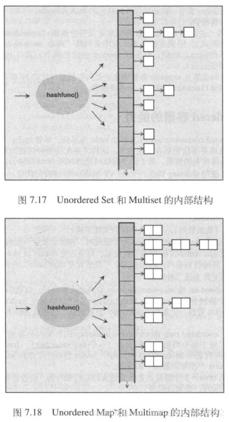

内部使用hash table，其主要优点是，惊人的运行期行为。假设拥有良好的hasing策略，并且有良好的实现，可以保证在安插、删除、查找元素时获得摊提（amortized）常量时间

> 因为偶尔发生的在散列可能是个大操作，带着线性复杂度

无序容器几乎所有的操作——拷贝构造、赋值、元素的安插和找寻、等价比较的预期行为，都取决于hash function的质量

> 如果hash function对不同的元素竟产生相同数值，hashtable的任何操作都会导致低下的执行效率，或者缺点不完全是由数据结构本身，也因为客户对此没有足够的意识

- 无序容器的缺点
  - 无序容器不提供 operator <、>、<= 和 >=用以安排布置这些容器的多重实例。但是提供了 == 和 !=
  - 不提供lower_bound和upper_bound(排序方式)
  - 由于ierator至少是一个单向迭代器，因此反向迭代器包括rbegin()、rend()、crbegin()和crend()都不提供

由于key或者value关系到元素在hash表的位置，所以不可以直接改动元素的key(value)，必须移除旧的元素，才能安插一个新的元素

- 无序容器不提供直接元素访问操作
- 通过iterator进行的间接访问有其束缚：从iterator的角度来看，元素的value(key)是常量


程序员的影响

- 指定bucket的最小数量
- 可以（有时必须）提供自己的hash funciton
- 可以（有时必须）提供自己的等价准则：必须是个判断式，用来在bucket list的所有数据项中找出准确的元素
- 可以指定一个最大负载系数，一旦超过就会自动rehashing（再散列）
- 可以强制rehasing

程序员的不可操作

- 成长系数，这个是自动rehasing时用来成长或缩小list of buckets的系数
- 最小负载系统，用来强制进行rehasing

```cpp
class Customer {};
class CustomerHash{
	public:
		std::size_t operator()(const Customer& c) const {
			return ...
		}
};

std::unordered_set<Customer, CustomerHas> custset;
```

> 定义并使用自己的hash function

```cpp
class Customer {};
class CustomerHash{
	public:
		std::size_t operator()(const Customer& c) const {
			return ...
		}
};
class CustomerEqual{
	public:
		std::size_t operator()(const Customer& c1, const Customer& c2) const {
			return ...
		}
};

std::unorder_multiset<Customer, CustomerHash, CustomerEqual> custset;
```

> 定义自己的等价准则
> 或者直接重载operator == 方法

**特殊的查找操作**

| 操作 | 效果 |
| --- | --- |
| c.count(val) | 返回元素值为val的元素个数 |
| c.find(val) | 返回元素值为val的一个元素，如果找不到就返回val |
| c.equal_range(val) | 返回val可被安插的一个位置和最后一个位置 |

**Bucket接口**

| 操作 | 效果 |
| --- | --- |
| c.bucket_count() | 返回当前bucket个数 |
| c.bucket(val) | 返回val将（或可能）被找到的哪个bucket的编号 |
| c.bucket_size(buckidx) | 返回低buckindx个bucket所含的元素个数 |
| c.begin(buckidx) | 返回一个单向iterator，指向第buckidx个bucket中的第一个元素 |
| c.end(buckidx) |  返回一个单向iterator，指向第buckidx个bucket中的最末元素的下一位置 |
| c.cbegin(buckidex) | 返回一个const的单向iterator，指向第buckidx个bucket中的第一个元素 |
| c.cend(buckidx) | 返回一个const单向iterator，指向第buckidx个bucket中的最末元素的下一位置 |

**unordered map的操作**

| 操作 | 效果 |
| --- | --- |
| c\[key\] | 安插一下带着key的元素——如果不存在，否则返回一个reference指向带着key的元素 |
| c.at(key) | 返回一个reference指向带着key的元素 |

> 仅限unordered map
