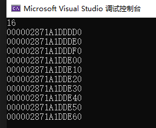

# 内存管理


## Primitives 基础写法

### new / delete

| 分配 | 释放 | 类型 | 可否重载 |
| --- | --- | --- | --- |
| malloc() | free() | C函数 | 不可 |
| new | delete | C++表达式 | 不可 |
| ::operator new() | ::operator delete() | C++函数 | 可 |
| allocator<T>::allocate() | allocator<T>::deallocate() | C++标准库 | 可自由设计并与之搭配任何容器 |

```cpp
#include <iostream>
#include <complex>

using namespace std;

int main() {

	void* p1 = malloc(521);
	free(p1);

	complex<int>* p2 = new complex<int>;
	delete p2;

	void* p3 = ::operator new(512);
	::operator delete(p3);

#ifdef _MSC_VER
	// 以下两个函数都是non-static，一定要通过object调用，以下分配3个int空间
	int* p4 = allocator<int>().allocate(3, (int*)0);		
    // 上面的 (int*)0 暂时没有用
    // 通过 allocator<int>() 创建要给临时对象，执行临死对象的allocate方法
	allocator<int>().deallocate(p4, 3);						
    // 通过 allocator<int>() 创建要给临时对象，执行临死对象的deallocate方法
#endif // _MSC_VER
#ifdef __BORLANDC__
	// 以下两个函数都是non-static，一定要通过object调用，以下分配5个int空间
	int* p4 = allocator<int>().allocator(5);
	allocator<int>().deallocate(p4, 5);
#endif // __BORLANDC__
#ifdef __GNUC__
	// 以下两个函数都是static，可通过全名调用，一下分配512bytes
	void* p4 = alloc::allocate(512);
	alloc::deallocate(p4, 512);
#endif // __GNUC__


	return 0;
}
```

> 上述代码为四种内存分配的基本用法

-----

```cpp
class Complex {
public:
	Complex(int x, int y) {
		m_x = x;
		m_y = y;
		std::cout << "constructor Complex" << std::endl;
	}
	Complex() {
		m_x = 0;
		m_y = 0;
		std::cout << "constructor Complex" << std::endl;
	}

private:
	int m_x;
	int m_y;
};

void func_new() {
	Complex* p1 = new Complex(1, 2);
	delete p1;

    // 等价于
	Complex* p2;
	try
	{
		void* mem = operator new(sizeof(Complex));
		p2 = static_cast<Complex*>(mem);
		p2->Complex::Complex(1, 2);
		operator delete(p2);
        // 这里直接调用构造函数的动作 只有编译器才可以这么写 自己写不同平台可能报错
	}
	catch (std::bad_alloc)
	{
		
	}
}
```

> tip: 上述代码中说明了不可直接`pc->Complex::Complex(1,2)`方法，如果想直接调用构造函数可以运用**placement new**，写法是`new(p)Complex(1,2)`

-----

```cpp
// gcc 中 operator new的实现方式
void *operator new(std::size_t size) _THROW_BAD_ALLOC
{
    if (size == 0)
        size = 1;
    void* p;
    while ((p = ::malloc(size)) == nullptr)
    {
        // If malloc fails and there is a new_handler,
        // call it to try free up memory.
        std::new_handler nh = std::get_new_handler();
        if (nh)
            nh();
        else
#ifndef _LIBCPP_NO_EXCEPTIONS
            throw std::bad_alloc();
#else
            break;
#endif
    }
    return p;
}
```

从上面的代码可以看到，`new`的实现方式就是调用了`operator new`方法，在强转之后执行了对应的构造函数

而`operator new`方法中，真正分配内存的是`malloc`方法

> [网上看到的资料](https://witgao.com/2021/07/07/c++/libc++%E6%BA%90%E7%A0%81%E5%88%86%E6%9E%90%E4%B9%8Bnew%E5%92%8Cdelete/)

-----

```cpp
Complex* pc = new Complex(1, 2);
// ... some operation
delete pc;

// 编译器将delete转换成下面操作
pc->~Complex();         // 先析构
operator delete(pc);    // 然后释放内存
```

> 上述为delete的操作，这里直接调用析构函数不会报错

```cpp
void operator delete(void* ptr) noexcept
{
    ::free(ptr);
}
```

> `operator delete`底层通过`free`释放内存

-----

上述代码中`pc->Complex::Complex(1, 2)`直接执行构造函数没有报错，并不能表示我们可以都这么直接调用构造，下面代码就是一个反例

```cpp	
string* pstr = new string;
pstr->string::string();
pstr->~string();
delete pstr;
```

这里的代码会明显报错`class std::basic_string<char> has no member named string`  
这里报错的原因是`string`本来的名字其实叫`basic_string`，是被`typedef`成`string`,所以`string`的构造函数应该是`basic_string()`才对

除了`typedef`导致构造函数名字不对的问题之外，**编译器的严格程度**不同也会出现报错，即存在平台差异性，所以不推荐手动调用构造函数

### array new / array delete

```cpp
Complex* pca = new Complex[3];    // 唤起三次构造函数
// ... some operation
delete[] pca;                     // 唤起三次析构
```

> 如果写的是`delete`而不是`delete[]`，那么编译器只会执行一次析构函数，而不是三次，也就是说有两个对象的析构函数没有执行，如果对象中存在`new`操作，这样会导致无法执行`delete`进而导致内存泄漏


从上图中可以看到，`new`出的内存块除了包含三个`Complex`对象外，还包含一些`cookie`信息，这些信息帮助操作系统释放整块内存，而`delete`与`delete[]`区别仅仅在于数组中所有对象是否都执行析构

```cpp
class A{
public:
    int id;

    A(): id(0) { std::cout << "default " << this << " " << this->id << std::endl; };
    A(int i): id(i) { std::cout << this << " "  << "int cons" << i << std::endl; }
    ~A() { std::cout << " ~ " << this << " "  << this->id << std::endl; }
};

void test_placement_new() {

	A* buf = new A[3];              // 调用A的默认构造函数，创建对象
	A* tmp = buf;

	for (int i = 0; i < 3; i++) {
		new(tmp++)A(i);             // placement new的写法，在tmp地址的构建A对象，调用A的构造函数
	}

	delete[] buf;
}

```

```bash
default 00A64CF4 0
default 00A64CF8 0
default 00A64CFC 0
00A64CF4 int cons0
00A64CF8 int cons1
00A64CFC int cons2
~ 00A64CFC 2
~ 00A64CF8 1
~ 00A64CF4 0
```

通过**查看输出**，可以发现这上述代码的执行顺序

### placement new

- `placement new` 允许我们将object建构于`allocated memory`(已经分配的内存)中
- 没有`placement delete`，因为`placement new`根本没有分配内存 

> 因为是构建于已经分配的内存中，所以需要一个现成的被分配的内存空间的指针

```cpp
#include <new>

void func(){
    char* buf = new char[sizeof(Complex) * 3];
    Complex* pc = new(buf)Complex(1, 2);
    // ....
    delete[] buf;
}
void func_1(){
    Complex* pc = new(buf)Complex(1, 2);
    // 上面一行代码 等价下面的代码  

    Complex* pc;
    try{
        void* mem = operator new(sizeof(Complex), buf);
        pc = static_cast<Complex*>(mem);
        pc->Complex::Complex(1, 2);
    }
    catch(std::bad_alloc){

    }
}

// 下面为当 operator new的两个参数为size_t和void*的源码
void* operator new(size_t, void* loc){
    return loc;
}
```

上面的代码使用了 `placement new`，它可以让你在已经分配好的内存上构造对象。`placement new`的语法是：`new (address) (type) initializer`。其中，`address` 是你指定的内存地址，`type` 是你要构造的对象的类型，`initializer` 是你要传递给对象构造函数的参数

定位 new 操作符的优点是可以提高性能和异常安全性，因为它不需要再次分配内存，而且可以在程序员控制的内存上创建对象。定位 new 操作符的缺点是需要手动调用对象的析构函数来释放资源，而且不能使用 delete 操作符来删除对象，只能删除分配给它们的内存。

分析上述代码可以发现

1. `operator new(size_t, void* loc)`什么都没做，因为此时`loc`是已经分配好了的内存地址，所以不需要再分配内存
2. `placement new`其实就是执行了一次构造函数


### C++分配内存的途径


一般来说，我们会重载类的`Foo::operator new`和`Foo::operator delete`，将对象的创建和内存分配自己来控制(通过自己控制可以减少内存块上的cookie的使用)

```cpp
Foo*p = (Foo*)malloc(sizeof(Foo));
new(p)Foo(x);
// ...
p->~Foo();
free(p);
```

当然也可以重载全局`::operator new / ::operator delete`

```cpp
// 测试重写代码

void* myAlloc(size_t size){
    return malloc(size);
}

void myFree(void* ptr){
    return free(ptr);
}

inline void* operator new(size_t size){
    cout << "my new" << std::endl;
    return myAlloc(size);
}

inline void* operator new[](size_t size){
    cout << "my new[]" << std::endl;
    return myAlloc(size);
}

inline void operator delete(void* ptr){
    cout << "my delete" << std::endl;
    myFree(ptr);
}

inline void operator delete[](void* ptr){
    cout << "my delete[]" << std::endl;
    myFree(ptr);
}
```

更常见的写法是**类中重载**

```cpp
class Foo {
public:
	int _id;
	long _data;
	std::string _str;

public:
	Foo() : _id(0) { std::cout << "default ctor " << this << " " << this->_id << std::endl; }
	Foo(int i): _id(i) { std::cout << "ctor " << this << " " << this->_id << std::endl; }

	virtual ~Foo() { std::cout << "dtor " << this << std::endl; }


	static void* operator new(size_t size);
	static void operator delete(void* pdead, size_t size);
	static void* operator new[](size_t size);
	static void operator delete[](void* pdead, size_t size);
};

void* Foo::operator new(size_t size) {
	Foo* p = (Foo*)malloc(size);
	std::cout << "my alloc Foo " << p << std::endl;
	return p;
}

void Foo::operator delete(void* pdead, size_t size) {
	std::cout << "my delete " << pdead << std::endl;
	free(pdead);
}

void* Foo::operator new[](size_t size) {
	Foo* p = (Foo*)malloc(size);
	std::cout << "my alloc Foo " << p << std::endl;
	return p;
}

void Foo::operator delete[](void* pdead, size_t size) {
	std::cout << "my delete " << pdead << std::endl;
	free(pdead);
}

int main() {
	std::cout << sizeof(Foo) << std::endl;

	Foo* p = new Foo(7);
	delete p;

	Foo* pArray = new Foo[5];
	delete[] pArray;
	return 0;
}
```

```bash
40
my alloc Foo 00C2DA78
ctor 00C2DA78 7
dtor 00C2DA78
my delete 00C2DA78
my alloc Foo 00C30110
default ctor 00C30114 0
default ctor 00C3013C 0
default ctor 00C30164 0
default ctor 00C3018C 0
default ctor 00C301B4 0
dtor 00C301B4
dtor 00C3018C
dtor 00C30164
dtor 00C3013C
dtor 00C30114
my delete 00C30110
```

但是，如果使用`::new`和`::delete`则会绕过类定义的`operator new / operator delete`方法，转而执行**全局的**`new / delete`

```cpp
int main() {
	std::cout << sizeof(Foo) << std::endl;

	Foo* p = ::new Foo(7);
	::delete p;

	Foo* pArray = ::new Foo[5];
	::delete[] pArray;
	return 0;
}
```

### 分配内存

```cpp
Foo* p = new Foo();

delete p;
```

上述代码等价于下面的代码，原理不再解释

```cpp
Foo* p = (Foo*)operator new(sizeof(Foo));
new(p) Foo(x);

p->~Foo();
operator delete (p);
```

`operator new` 本质上还是调用 `malloc` 来分配内存，虽然这个过程一般来说很快，但是如果可以减少 `malloc` 调用的次数，一定程度上可以加快程序运行效率

那么我们可以一开始就分配一个很大的内存，然后切成一个个小块分配给具体的对象，这样就只用 `malloc` 一次，然后我们手动对内存分块


还有一点就是这样子可以减少 `cookie` 的量，每一次 `malloc` 除了分配指定大小的内存之外，还在内存块前后分别额外申请了内存用于存放 `cookie`，`cookie`中的信息用于表示内存**是否被分配**以及**分配的大小**等信息

> `cookie` 并不是C++语言标准中的术语


如果是一开始自己申请一大块内存，手动切割内存可以减少 `cookie` 的量，从而提升内存的使用率

基于上面的想法，我们得到了如下的设计

```cpp
#include <cstddef>
#include <iostream>

class Screen {
public:
	Screen(int x): i(x) {};
	int get() { return i; }

	static void* operator new(size_t);
	static void operator delete(void*, size_t);

private:
	Screen* next;
	static Screen* freeStore;
	static const int screenChunk;

private:
	int i;
};

Screen* Screen::freeStore = nullptr;
const int Screen::screenChunk = 24;

void* Screen::operator new(size_t size)
{
	Screen* p = nullptr;
	if (!freeStore) {
		// linked list 为空 需要申请一大块内存
		size_t chunk = screenChunk * size;
		freeStore = p = reinterpret_cast<Screen*>(new char[chunk]);
		// &freeStore[screenChunk - 1] 表示 freeStore 数组中最后一个 Screen 的内存地址 p 指向最后一个 Screen 时表示遍历结束
		for (; p != &freeStore[screenChunk - 1]; ++p) {
			p->next = p + 1;
		}
		p->next = nullptr;
	}

	p = freeStore;
	freeStore = freeStore->next;
	return p;
}

void Screen::operator delete(void* p, size_t)
{
	(static_cast<Screen*>(p))->next = freeStore;
	freeStore = static_cast<Screen*>(p);
}
```

```cpp
int main() {
	std::cout << sizeof(Screen) << std::endl;

	size_t const N = 100;
	Screen* p[N];

	for (int i = 0; i < N; ++i) {
		p[i] = new Screen(i);
	}

	for (int i = 0; i < 10; ++i) {
		std::cout << p[i] << std::endl;
	}

	for (int i = 0; i < N; ++i) {
		delete p[i];
	}
	
	return 0;
}
```

在自定义 `opeator new` 和 `operator delete` 之前，连续申请100个 Screen，每个对象的地址信息，可见虽然是连续申请的对象，但是地址之间插值并不是 16，可见有 cookie 存在


在使用自定义 `operator new` 和 `operator delete` 之后，Screen 对象地址连续，并没有被 Cookie 占用



这里 Screen 使用了链表来连接整个大内存空间中的 Screen 对象

有一个问题就是 Screen 对象中仅仅存在一个 `int i` 的属性大小是 8 个字节，但是为了自己分配内存空间需要额外定义 `Screen* next` 指针，指针也占用 8 个字节，浪费了 50% 的空间

为了节省指针导致的内存浪费，可以使用 `union` 来处理

```cpp
class Airplane {
private:
	struct AirplaneRep {
		unsigned long miles;
		char type;
	};

private:
	union {
		AirplaneRep rep;	// 指针对使用中的 objects
		Airplane* next;		// 指针对 fire list 中的object
	};

public:
	unsigned long getMiles() { return rep.miles; }
	char getType() { return rep.type; }

	void set(unsigned long m, char t) {
		rep.miles = m; rep.type = t;
	}

public:
	static void* operator new (size_t size);
	static void operator delete (void* deadObject, size_t size);

private:
	static const int BLOCK_SIZE;
	static Airplane* headOfFreeList;
};

Airplane* Airplane::headOfFreeList = nullptr;
const int Airplane::BLOCK_SIZE = 512;

void* Airplane::operator new(size_t size) {
	// 如果大小有误 转交 ::operator new
	if(size!=sizeof(Airplane)) {
		return ::operator new(size);
	}

	Airplane* p = headOfFreeList;
	if (p) {
		headOfFreeList = p->next;
	}
	else {
		// free list 为空 需要申请初始内存
		Airplane* newBlock = static_cast<Airplane*>(::operator new(BLOCK_SIZE * sizeof(Airplane)));
		
		// 将小块串成 free list
		// 但跳过 #0 因为它将作为本次返回结果
		for (int i = 1; i < BLOCK_SIZE - 1; i++)
		{
			newBlock[i].next = &newBlock[i + 1];
		}
		newBlock[BLOCK_SIZE - 1].next = nullptr;
		p = newBlock;
		headOfFreeList = &newBlock[1];
	}
	return p;
}

void Airplane::operator delete(void* p, size_t size)
{
	if (p == nullptr) {
		return;
	}

	if (size != sizeof(Airplane)) {
		::operator delete(p);
		return;
	}

	Airplane* carcass = static_cast<Airplane*>(p);
	carcass->next = headOfFreeList;
	headOfFreeList = carcass;
}
```

`Airplane` 的 `sizeof` 大小为 8


