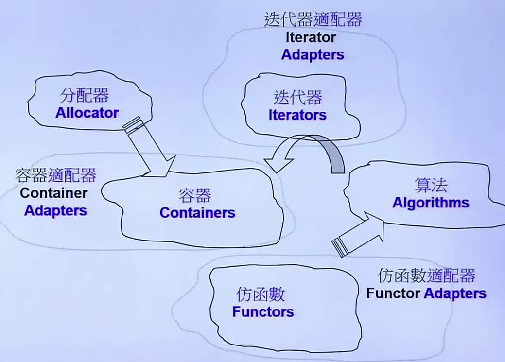
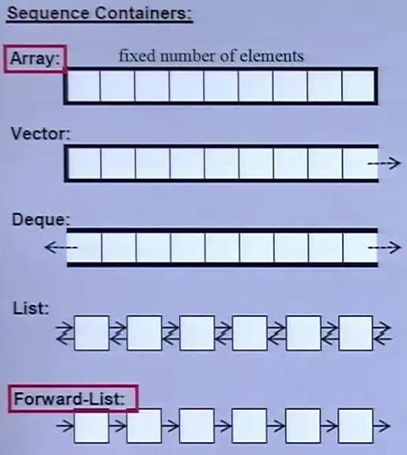
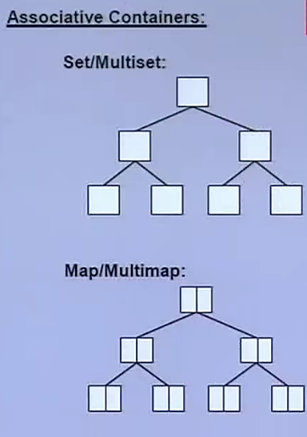

# 标准库与范型

## C++ 标准库 介绍

C++ Standard Library => C++标准库

Standerd Template Library => STL => 标准模板库

C++标准库 包含 STL

标准库以 Header File 形式呈现

- C++ 标准库的 Header Files 不带文件后缀，比如 `#include <vector>`
- 新式 头文件(Header Files) 不带文件后缀，比如 `#include <cmath>`
- 旧版 头文件(Header Files) 带文件后缀，仍然可用，比如 `#include <stdio.h>`
- 新式 头文件(Header Files) 内的组件封装于 `namespace std`
- 旧版 头文件(Header Files) 内的组件不封装于 `namespace std` 中

```cpp
#include <string>
#include <iostream>
#include <algorithm>
#include <functional>

using namespace std;
```

> 不推荐在项目中直接使用 `using namespace std` 这样会失去名空间的作用

### 结构

STL六大部件

- 容器(Containers)
- 分配器(Allocators)
- 算法(Algorithms)
- 迭代器(Iterators)
- 仿函式(Adapters)
- 适配器(Functors)



- 数据存储在 **容器** 中
- 操作数据的动作封装在 **算法** 中
- **算法** 通过 **迭代器** 操作 **容器** 中的数据
- **容器** 通过 **分配器** 得到内存
- **适配器** 包括 仿函数适配器、容器适配器、迭代器适配器

```cpp
#include <vector>
#include <algorithm>
#include <iostream>
#include <functional>

using namespace std;

int main() {
    int ia[6] = {-1, 5, 6, 1, 2, 3};
    // vector 容器
    // allocator 分配器
    vector<int, allocator<int>> vi(ia, ia+6);

    // count_if 属于 algorithm 算法模块
    // vi.end() 和 vi.begin() 属于 iterator 迭代器
    // bind2nd 属于 function adapter 函数适配器
    // less<int>() 仿函数
    // not1 function adapter 函数适配器
    
    // 输出 等于等于 4 的数的个数
    cout << count_if(vi.begin(), vi.end(), not1(bind2nd(less<int>(), 4)));

    return 0;
}

```

### 容器

- 线性容器
  - Array (连续数组 不可扩容)
  - Vector (连续数组 可扩容)
  - Deque (双向队列)
  - List (链表)
  - Forward-List



- 关联容器
  - Set
  - Multiset
  - Map
  - Multimap



