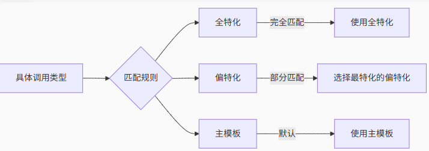

# C++ 模板

## 函数模板 基本认知

**类型推断中的类型转换**

在类型推断的时候自动的类型转换是受限制的：

- 如果调用参数是按引用传递的，任何类型转换都不被允许。通过模板类型参数T定义的两个参数，它们实参的类型必须完全一样
- 如果调用参数是按值传递的，那么只有退化（decay）这一类简单转换是被允许的：`const` 和 `volatile` 限制符会被忽略，引用被转换成被引用的类型，`raw array` 和 函数 被转换为相应的指针类型。通过模板类型参数T定义的两个参数，它们实参的类型在退化（ `decay` ）后必须一样

```cpp
template<typename T>
T m_max(T& a, T& b)
{
    return a > b ? a : b;
}

template<typename T>
T mmmax(T a, T b)
{
    return a > b ? a : b;
}

int const c = 42;
int i = 1;
int& ri = i;

mmmax(c, c);      // ok
mmmax(c, i);      // ok
mmmax(ri, c);     // ok

m_max(c, c);      // ok
m_max(c, i);      // error 如果模板函数参数是 T& 引用，则任何转换都不允许
m_max(ri, c);     // error 同理 由于参数是 T& 无法转化 
```

### 默认模板参数

**默认调用参数的类型推断**

类型推断并不适用于默认调用参数,比如下面的 `foo_1` 函数,虽然设置了 x 的默认值是 `"12"`,但是编译器并不会认为 `x` 的默认类型是 `std::string`, 需要像 `foo_1_o` 中设置 `T = std::string`,编译器才知道 T 的默认类型是 `std::string`

```cpp
template<typename T>
void foo_1(T x = "12")
{
    std::cout << "x = " << x << std::endl;
}

template<typename T = std::string>
void foo_1_o(T x = "123")
{
    std::cout << "x = " << x << std::endl;
}

foo_1(1);               // 正确的
// foo_1();             // 错误的 因为未明确参数类型 无法给形参 x 定义
foo_1<std::string>();   // 正确的
// foo_1<int>();        // 错误的 定义形参 x 为 int 无法使用默认值 "123"

foo_1_o();              // 正确的 指定 T 的默认类型为 std::string
```

也可以向下面这样使用

```cpp
template<typename RT = long, typename T1, typenameT2>
RT mmax(T1 a, T2 b)
{
    return b < a ? a : b;
}

mmax(1, 1.1);   // 无需指定返回值类型,自动使用默认的 long
mmax<int>(1, 1.1);  // 指定返回值类型,使用 int
```


### 多个默认参数

**多个模板参数**

如果想要让函数接受传入两个不同类型的参数,可以通过 `typename` 定义多个类型

```cpp
template<typename T1, typename T2>
T1 mTest(T1 a, T2 b)
{
    std::cout << typeid(a).name() << "  " << typeid(b).name() << std::endl;
    return a < b ? a : b;
}

int main() {
    std::cout << mTest(2, 1.1) << std::endl;
    return 0;
}
```

不过有一个问题,那就是 `mTest` 函数的返回值类型是 T1,以 `mTest(2, 1.1)` 来说返回值类型是 `int`, 但是返回的值却是 `1.1` 导致数据类型转换,最终得到的是 `1`

为了解决这个问题

1. 引入第三个模板参数作为返回类型
2. 让编译器找出返回类型
3. 将返回类型定义为两个参数类型的 **公共类型**

引入第三个模板参数的解决方法如下

```cpp
// 解决方法 1
template<typename RT, typename T1, typename T2>
RT mTest(T1 a, T2 b)
{
    std::cout << typeid(a).name() << "  " << typeid(b).name() << std::endl;
    return a < b ? a : b;
}
// mTest<int, double, double>(2, 1.1);
// mTest<double>(2, 1.1);   // T1 和 T2 的类型能够通过编译器推理出来,只用显式指定 RT 类型为 double 即可
```

让编译器找出返回类型的解决方法如下,使用 C++ 提供的类型推导 `decltype`

| 组成部分 | 作用 | |
| --- | --- | --- |
| b < a | **类型检查**：确保这两个类型可以比较 | 必要 |
| ? a : b | **类型推导**：确定条件表达式的公共类型 | 核心 |

无论 `mTest(1, 1.1)` 还是 `mTest(2, 1.1)` 返回类型都是 `double`, 因为通过 `? a : b` 类型推导得到公共类型是 `double`,与传入参数的 a,b 的具体值没有关系

```cpp
// 解决方法 2
template<typename T1, typename T2>
auto mTest (T1 a, T2 b)-> decltype(b<a?a:b)
{
    return b < a ? a : b;
}
```

> 不要以为 `mTest(1, 1.1)` 返回值类型是 `int`

如果传入参数是 `int` 和 `std::string`, 就算类型比较能够通过,但是 `int` 和 `std::string` 是没有公共类型的 `decltype` 会在编译器报错

将返回类型声明为公共类型的解决方法如下

使用 `std::common_type_t` 

```cpp
template<typename T1, typename T2>
std::common_type_t<T1,T2> max (T1 a, T2 b)
{
    return b < a ? a : b;
}
```

> C++14 使用 `std::common_type_t<T1, T2>`  
> C++11 使用 `std::common_type<T1, T2>::type`

### 函数模板的重载

```cpp
int mmax(int a, int b)
{
    std::cout << "normal" << std::endl;
    return a > b ? a : b;
}

template<typename T>
T mmax(T a, T b)
{
    std::cout << "template" << std::endl;
    return a > b ? a : b;
}

int main() {
    int a = 1, b = 2;
    std::cout << mmax<int>(a, b) << std::endl;
    return 0;
}
```

上述代码能够正常运行,并输出结果 `2`,并没有出现函数重定义的错误

一个非模板函数可以和一个与其同名的函数模板共存，并且这个同名的函数模板可以被实例化为与非模板函数具有相同类型的调用参数

在所有其它因素都相同的情况下，模板解析过程将**优先选择非模板函数**，而不是从模板实例化出来的函数

```cpp
int main()
{
    int a = 1, b = 2;
    std::cout << mmax(a, b) << std::endl;
    return 0;
}
```

上述代码的输出是 `normal` 也就是说,证明了相同情况下优先选择**非模板函数**

```cpp
int main()
{
    std::cout << mmax(1.1, 2.2) << std::endl;
    return 0;
}
```

上述代码的输出是 `template` 虽然 `double` 能转换成 `int` 然后匹配 `mmax(int, int)`,但是 `template` 函数能够直接生成 `mmax(double, double)` 更加匹配这个情况

所以如果模板能够实例化一个**更加匹配**的函数,则会选择使用模板

```cpp
int main()
{
    std::cout << mmax<>(1, 2) << std::endl;
    return 0;
}
```

上述代码输出的是 `template`,虽然参数都是 `int` 能够匹配 `mmax(int, int)` 但是 `mmax<>(1, 2)` 显式的指定一个空的**模板列表**,表明期望使用模板函数

```cpp
int main()
{   
    std::cout << mmax('a', 2) << std::endl;
    return ;
}
```

上述代码输出的是 `normal`,虽然 char 能够转成 int,但是在模板参数推导时不允许**自动类型转换**,但是常规函数允许

所以 `mmax('a', 2)` 无法匹配模板函数,但是能够匹配普通函数

```cpp
template<typename T1, typename T2>
auto mmax(T1 a, T2 b)
{
    return a > b ? a : b;
}

template<typename RT, typename T1, typename T2>
RT mmax(T1 a, T2 b)
{
    return a > b ? a : b;
}

int main() {
    std::cout << mmax<int>(1, 2) << std::endl;
    return 0;
}
```

上述代码会报错,因为都匹配成功了,导致模板解析时不知道该调用哪个模板,从而导致未知错误

所以当重载函数模板时,需要保证对于任意一个调用,都只会有一个匹配模板

```cpp
template<typename T>
T mmax(T a, T b)
{
    std::cout << "mmax(T, T)" << std::endl;
    return a > b ? a : b;
}

template<typename T>
T mmax(T a, T b, T c)
{
    std::cout << "mmax(T, T, T)" << std::endl;
    return mmax(mmax(a, b), c);
}

int mmax(int a, int b)
{
    std::cout << "mmax(int, int)" << std::endl;
    return a > b ? a : b;
}

int main() {
    std::cout << mmax(1, 2, 3) << std::endl;
    // mmax(T, T, T)
    // mmax(T, T)
    // mmax(T, T)
    return 0;
}
```

上述代码的执行过程中使用的全部是模板函数,但是明明有更加合适 `mmax(int, int)` 函数却没有被调用

这是因为 `mmax(int, int)` 定义在 `mmax(T, T, T)` 之后，将 `mmax(int, int)` 定义在 `mmax(T, T, T)` 就能够正常调用了

### 一些建议

#### 按值传递还是按引用传递？

通常建议将**引用传递**用于除简单类型(基础类型和std::string_view) 以外的类型，可以避免不必要的**拷贝成本**

不过出于一些原因，还是使用值传递更好

1. 语法简单
2. 编译器能够更好地进行优化
3. 移动语义通常使拷贝成本比较低
4. 某些情况下可能没有拷贝或者移动

对于模板，还有一些特殊情况

1. 模板既可以是简单类型，也可以是复杂类型，因此如果默认选择适合于复杂类型的方式，对简单类型可能产生不利影响
2. 作为调用者，可以使用 `std::ref` 和 `std::cref` 来按引用传递参数
3. 对于 `string literal` 和 `raw array` 使用值传递可能会带来一些问题，但是使用引用传递只会带来更多的问题

#### 不适用 inline

#### 可以搭配 constexpr 使用

`constexpr` 可以在编译阶段进行一些计算，比如下面这个例子，数组的长度其实在编译期是可以计算出来的

```cpp
template<typename T1, typename T2>
constexpr auto max (T1 a, T2 b)
{
    return b < a ? a : b;
}

int a[::max(sizeof(char),1000u)];
```

## 类模板

和函数模板类似，类也可以被一个或多个类型参数化

```cpp
template<typename T>
class Stack {
    private:
        std::vector<T> elements;
    public:
        void push(T const& elem); 
        void pop();
        T const& top() const;
};
```

由于历史原因，还可以这么定义类模板

```cpp
template<class T>
class Stack{
    // ....
}
```

> 对函数模板也可以使用 class 来定义类型

自定义**拷贝构造函数**和**赋值构造函数**

```cpp
template<typename T>
class Stack {
    Stack (Stack const&);
    Stack& operator= (Stack const&);
};

template<typename T>
class Stack {
    Stack (Stack<T> const&);
    Stack<T>& operator= (Stack<T> const&); 
};
```

上面两种写法是等价的，不过通常来说，如果特殊定义了 `<T>` 表明是要特殊处理的。所以一般使用第一种就行了

不过如果函数定义在类模板外面，需要写成下面这样

```cpp
template<typename T>
bool operator == (Stack<T> const& lhs, Stack<T> const& rhs);
```

成员函数的实现可以放在类的内部，也可以放在外部

```cpp
// 在类外部实现
template<typename T>
T const& Stack<T>::top () const
{
    // impl
}

// 在类内部实现
template<typename T>
class Stack {
    void push (T const& elem) {
        // impl
    }
};
```

不过需要注意的是，**模板参数**要支持类中的各种操作，比如对 `std::string` 不能执行 `++` 运算，所以如果类中有 ++ 操作，那么模板参数不能选择 `std::string`

另外，对于 `Stack<Stack<int>>` 这种嵌套式模板类，在 **C++11** 中要注意后面的 `>>` 不能连写，中间必须添加一个空格 `> >`，否则 `>>` 会被解析成 `>>` 运算符

```cpp
template<typename T>
class Stack {
private:
    T _value;
    
public:
    Stack() {}
    
    void Func()
    {
        _value++;
    }
};

int main() {
    Stack<int> a;
    Stack<std::string> b;
    
    a.Func();
    b.Func();   // Error std::string 没有 ++ 操作
    return 0;
}
```

虽然 `b.Func()` 运行报错，但是如果 `Stack<std::string>` 不调用 `Func` 函数是可以正常通过编译和运行的

因为模板类实例化时，只会提供哪些用到的操作

所以当实例一个 `Stack<std::string>` 的时候，如果没有人调用过 `Func` 函数，那么实例化出来的 `Stack<std::string>` 就没有 `Func` 这个成员函数，那么就可以正常编译运行了

### 模板类特化

可以对类模板的**某一个模板参数**进行特化

类模板的特化允许对一个特定类型做优化

如果对类模板进行了特化，那么大多数情况是需要去特化所有的成员函数

> 通常来说，类的特化模板是为了在功能对外接口相同的情况下，做特殊优化，所以原本提供的接口，特化模板也要提供

```cpp
template<typename T>
class Stack {
private:
    T _value;
    
public:
    Stack() { std::cout << "T" << std::endl; }
};

template<>
class Stack<bool>{
public:
    Stack() { std::cout << "bool" << std::endl; }
    
    void push();
    void pop() {
        std::cout << "bool pop" << std::endl;
    }
};

void Stack<bool>::push()
{
    std::cout << "bool push" << std::endl;
}

int main() {
    Stack<int> a;           // T
    Stack<bool> b;          // bool
    b.push();               // bool push
    b.pop();                // bool pop
    return 0;
}
```

对于被特化的模板，所有成员函数的定义都应该被定义成**常规**成员函数，也就是说所有出现 T 的地方，都应该被替换成用于特化类模板的类型

> 参考 `push` 函数在类歪的实现

### 多模板参数的部分特化

类模板也可以特化多个模板参数之间的关系

```cpp
// 主模板
template<typename T, typename U>
struct Test {
    static constexpr char* name() { return "Primary"; }
};

// 偏特化 1：当两个类型相同
template<typename T>
struct Test<T, T> {
    static constexpr char* name() { return "Same Type"; }
};

// 偏特化 2：当第二个类型是 int
template<typename T>
struct Test<T, int> {
    static constexpr char* name() { return "Second int"; }
};

// 全特化
template<>
struct Test<int, int> {
    static constexpr char* name() { return "Full int,int"; }
};
```

当主模板、全特化和偏特化同时存在时，编译器按此优先级选择如下图所示



```cpp
template<typename T1, typename T2>
class MyCls{}

template<typename T>
class MyCls<T, T> {}

template<typename T>
class MyCls<T, int> {}

template<typename T1, typename T2>
class MyCls<T1*, T2*> {}

MyClass< int, float>    mif;    // uses MyClass<T1,T2>
MyClass< float, float>  mff;    // uses MyClass<T,T>
MyClass< float, int>    mfi;    // uses MyClass<T,int>
MyClass< int*, float*>  mp;     // uses MyClass<T1*,T2*>
```

不过，与模板函数重载一样，如果对**偏特化**存在多个匹配情况，就会报错

```cpp
MyClass< int, int>  mii;    // Error 匹配 MyClass<T, T> 也可以匹配 MyClass<T, int>
MyClass< int*, int*> m;     // Error 匹配 MyClass<T,T> 也可以匹配 MyClass<T1*,T2*>
```

### 默认类模板参数

```cpp
template<typename T, typename Cont = std::vector<T>>
class Stack {
    private:
        Cont elements;
};

// 定义 double 类型元素的 Stack，使用的容器时 std::deque
Stack< double,std::deque<double>>
```

### 类型别名

对于常见的别名就是 `typedef` 

```cpp
typedef Stack<int> IntStack;
```

从 C++11 开始，可以使用 `using` 来定义别名

```cpp
using IntStack = Stack<int>
```

不同于 `typedef`， `using` 支持模板

```cpp
template<typename T>
using DequeStack = Stack<T, std::deque<T>>;
```

同理，对于类成员的别名模板

```cpp
struct CCC {
    typedef .... iterator;
}

struct CCC{
    using iterator = ....;
}

template<T>
using MyCCCIterator = typename MyType<T>::iterator;

// 就可以使用
MyCCCIterator<int> Pos;
```

为什么需要使用 `typename`

```cpp
template<typename T>
struct Example {
    using type = T;    // 类型成员
    static int value;  // 非类型成员
};

template<typename T>
void foo() {
    Example<T>::type x;  // 错误：编译器不知道 type 是类型
    Example<T>::value = 10; // 正确：编译器默认假设是非类型
}

template<typename T>
void foo() {
    typename Example<T>::type x;  // 正确：明确指示是类型
}
```

通过 `typename` 关键字明确说明是一个类型

### 类模板的类型推导

```cpp
Stack<int> intStack1; // 定义一个 Stack
Stack<int> intStack2 = intStack1; // 正常赋值
Stack intStack3 = intStack1; // 从 C++17 开始正常赋值
```

如何自动推导？

```cpp
template<typename T>
class Stack {
    private:
        std::vector<T> elements; // elements
    public:
        Stack () = default;
        Stack (T const& elem) : elements({elem}) {}
};
int main() {
    Stack a = 0;
    return 0;
}
```

`Stack a = 0` 触发的是 `Stack(T const& elem)` 拷贝构造函数，进而帮助编译器推导出 `elements` 的类型是 `std::vector<int>` 进而得到 `T = int`

但是如果下面这样定义呢？

```cpp
Stack a = "bottom";
```

由于 `Stack(T const& elem)` 是引用，不能进行类型转换，推导得到的 `T = char const[7]`

为了解决这个问题，可以修改 `Stack(T const& elem)` 为 `Stack(T elem)`，不用引用形参

此时得到的 `T = char const*`

### 推断指引(Deduction Guides)

为了方便使用，通常不会直接使用 `char const*` 这个原始指针，而是使用 `std::string` 

那么，如何让编译器在推断类型时，发现类型是 `char const*` 时，使用 `std::string` 作为类型呢？

```cpp
template<typename T>
class Stack {
private:
    std::vector<T> elems;
public:
    Stack() = default;
    Stack(T elem) : elems({elem}) {}
    
    void print() const {
        std::cout << "Stack of " << typeid(T).name() 
                  << " with value: " << elems[0] << "\n";
    }
};

// 关键：自定义推导指引
Stack(const char*) -> Stack<std::string>;

int main() {
    std::cout << typeid(std::string).name() << std::endl;
    
    Stack a{"123"}; // 现在推导为 Stack<std::string>
    a.print();      // 输出类型为 string
    
    Stack b = 42;    // 仍然推导为 Stack<int>
    b.print();
}
```

根据语言规则，不能通过将字符串字面量传递给一个期望接受 `std::string` 的构造函数来拷贝初始化（使用 `=` 初始化）一个对象

也就是说 `Stack a = "123";` 是错误的

### 聚合类的模板化

**聚合类** 指的是 用户没有定义的显式的或者继承而来的构造函数，没有 `private`、`protected` 的非静态成员，没有虚函数，没有 `virtual`、`private` 或者 `protected` 的基类

```cpp
template<typename T>
struct ValueWithComment {
    T value;
    std::string comment;
}

ValueWithComment<int> vc;
vc.value = 42;
vc.comment = "initial value";

ValueWithComment(char const*, char const*)-> ValueWithComment<std::string>;

ValueWithComment vc2 = {"hello", "initial value"};
```

没有**推断指引**的话，就不能使用上述初始化方法，因为`ValueWithComment` 没有相应的构造函数来完成相关类型推断

## 非类型模板参数

模板参数不一定非得是某种具体的类型，也可以是**常规数值**

与类模板使用类型作为参数类似，可以使代码的另一些细节留到被使用时再确定

```cpp
template<typename T, std::size_t MaxSize>
class Stack{
public:
    T x[MaxSize];
};

int main() {
    Stack<int, 10> a;
    std::cout << sizeof(a.x) << std::endl;  // Log: 40 
    return 0;
}
```

> 输出 40，一个 int 占 4 字节，10个元素就是 4 * 10 = 40 字节

```cpp
template<int Val, typename T>
T addValue (T x)
{
    return x + Val;
}

int main() {
    std::cout << addValue<10>(2) << std::endl;  // log: 12
    return 0;
}
```

除了常规定义之外，还可以做一些其他的事情，比如下面当作仿函数使用（不是真的仿函数）

```cpp
std::transform (
    source.begin(), 
    source.end(),
    dest.begin(), 
    addValue<5,int>)
```

> 这里 `addValue` 被实例化为 传入int 型参数加 5 的函数实例

也可以像下面这样操作，通过传入的 `Val` 推导出结果

```cpp
template<auto Val, typename T = decltype(Val)>
T foo();
```

### 非类型模板参数的限制

通常只能是

- 整型常量（包括枚举）
- 指向 objects/functions/members 的指针
- objects 或 functions 的左值引用
- std::nullptr_t 

```cpp
// 整型常量
template<int Size>
struct FixedArray {};

FixedArray<5> arr5;

// 枚举常量
enum class Color { Red, Green, Blue };
template<Color C>
struct TrafficLight {};

TrafficLight<Color::Red> redLight;

// 一些定义 方便后面使用
int global_value = 42;
void print_hello() {}
struct MyClass {
    int value = 100;
    void print() { 
        std::cout << "MyClass::print()\n"; 
    }
};

// 指向对象的指针
template<int* Ptr>
struct PointerWrapper {};

PointerWrapper<&global_value> pw;

// 指向函数的指针
template<void (*FuncPtr)()>
struct FunctionWrapper {};

FunctionWrapper<&print_hello> fw;

// 指向成员对象的指针
template<int MyClass::*MemberPtr>
struct MemberWrapper {};

MemberWrapper<&MyClass::value> mw;

// 指向成员函数的指针
template<void (MyClass::*MemberFuncPtr)()>
struct MemberFunctionWrapper {};

MemberFunctionWrapper<&MyClass::print> mfw;
```

**浮点型数值**或者 class 类型的对象都不能作为非类型模板参数使用

```cpp
template<double VAT>    // Error
double process (double v) 
{
    return v * VAT;
}
template<std::string name> // ERROR:
class MyClass {};
```

**非类型模板参数**支持**编译期表达式**

```cpp
C<sizeof(int) + 4, sizeof(int)==4> c
```

但是如果涉及到 `operator >` 计算的时候要小心，容易被解析成类型模板的 反尖括号

```cpp
C<sizeof(int) + 4, sizeof(int) > 4> c; // Error 第一个 > 符号被理解成模板的反尖括号结尾，导致解析错误
C<sizeof(int) + 4, (sizeof(int) > 4)> c; // OK 用括号抱起来
```

## 变参模板


