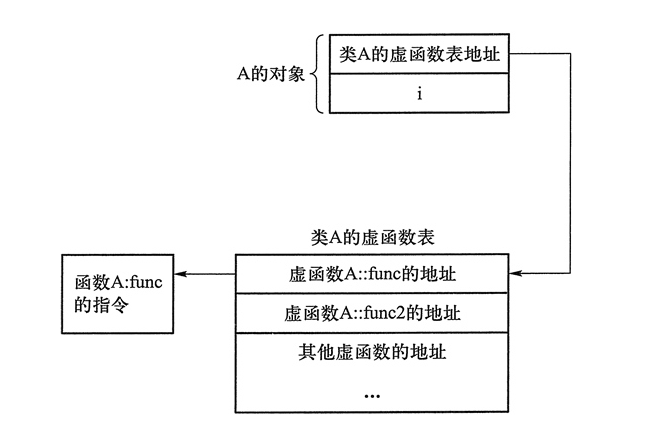
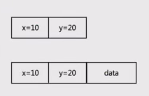
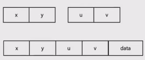
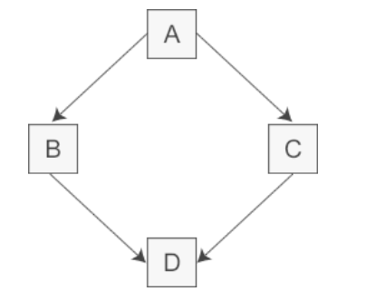
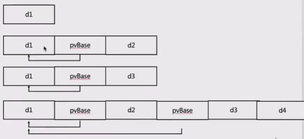

# 现代 C++

## 基于对象基础

一个类基本包括数据成员(字段) + 函数成员

```cpp
class Point {
		int x;
		int y;

		static int xx;

		void Process() {
				// do something
				Process2(100);
		}

		void Process2(int x) {
				// do something
		}

		static void Process3() {
				xx++;
		}
};

int Point::x = 0;

int main() {
		Point pt;
		pt.Process();
}
```

对于编译器来说，它可以这么理解上述代码

```cpp
struct Point {
		int x;
		int y;

		static int xx;
}

int Point::xx = 0;

void Process(Point* this) {
		// do something
		this->Process2(100);
}

void Process2(Point* this, int x) {
		// do something
}

void Process3() {
		Point::xx++;
}
```

将所有的成员函数都定义为，上述这种普通函数，然后给每个函数额外添加一个 `Point*` 的参数，用于指向执行该函数的对象

因为 `Process3` 是一个 static 函数，所以无法访问非 static 的成员属性，这个时候 `Process3` 就不用添加 `Point*` 

相对来说，使用 C++ 的定义 `class` 的方法编写代码，可以将**行为**(函数)和**状态**(属性)结合起来进行编写

### 内存对齐

对于下面两个类的定义，虽然属性相同，但是对象内存大小占用却不相同

```cpp
#pragma pack(8)

class P1 {
		char a1;
		int x;
		char a2;
};

class P2 {
		char a1;
		char a2;
		int x;
};

// sizeof(P1) 12
// sizeof(P2) 8
```

在 C++ 中存在内存对齐，使用内存对齐可以优化 CPU 存储数据效率、避免数据截断。对按对齐系数（4、8字节）整倍数进行对齐

> 可以使用 `#pragma pack(4)` 控制对齐大小

- **内存对齐规则**
	- 成员对齐：每个成员的地址必须是其自身大小或 `#pragma pack(n)` 设置值的较小值的**倍数**
	- 结构体总大小：必须是所有成员中最大对齐值的整数倍
	- 填充字节：编译器在成员之间插入空隙（padding），以满足对齐要求

对于 `class P1` 来说

- char a1
	- 大小：1 字节
	- 对齐要求：min(1, 8) = 1
	- 地址范围：0
- int x
	- 大小：4 字节
	- 对齐要求：min(4, 8) = 4
	- 起始地址必须是 4 的倍数
	- 当前地址是 1，需填充 3 字节（地址 1-3），使 x 从地址 4 开始
	- 地址范围：4-7
- char a2
	- 大小：1 字节
	- 对齐要求：1
	- 直接放在 x 后面，地址 8

当前总大小：0-8（共 9 字节）。结构体总大小必须是**最大对齐值**（4）的整数倍。9 向上取整到最近的 4 的倍数是 12，因此末尾填充 3 字节

> **最大对齐值**：最大对齐值是结构体中所有成员的对齐值中的**最大值**，成员的对齐值 = `min(成员自身大小, #pragma pack(n) 设置的值)`

最终内存布局

```
| a1 (1) | padding (3) | x (4) | a2 (1) | padding (3) |
```

对于 `class P2` 来说

- char a1
	- 地址范围：0
- char a2
	- 地址范围：1
- int x
	- 对齐要求：4 
	- 当前地址是 2，需填充 2 字节（地址 2-3），使 x 从地址 4 开始
	- 地址范围：4-7

当前总大小：0-7（共 8 字节）。8 已经是最大对齐值（4）的整数倍，无需额外填充

最终内存布局

```
| a1 (1) | a2 (1) | padding (2) | x (4) |
```

通过对比 `P1` 和 `P2` 的内存，可以得到结论：大内存属性放前面，小内存属性放后面

那么，如果在类中添加一个函数，会影响这个对象大小吗？

```cpp
class Point {
		int x;
		int y;

		void Process() {}
};

// sizeof(Point) 8
```

通过上面的代码可以发现，`sizeof(Point)` 的大小还是 8，函数定义并没有增加 `Point` 的大小

这是因为前面解释过编译器如何理解 C++ 对象的，就是一个数据结构体 + 全局函数

也就是说，`Point` 对象被解析成了下面这样, `Process` 被解析成了全局函数，占用的是代码段大小，不影响对象大小

```cpp
struct Point { int x; int y;};
Process(Point* this)
{
		// do something
}
```

但是，如果是下面定义的对象，又不一样，`Point1` 对象有一个虚函数 `Process2`，需要一个指针指向虚函数表，所以 `Point1` 额外需要一个虚函数指针，因此 `sizeof(Point1)` 大小是 16

> 指针的大小根据平台不同，可能是 4，也可能是 8

```cpp
class Point1 {
		int x;
		int y;

		void Process() {}
	virtual void Process2() {}
};
```



以上图为例，如果一个类有虚函数，那么这个类对象在内存中第一个属性是一个指针，指向这个类的虚函数表

既然知道这个类的第一个属性是一个指针，是否可以通过指针获取到虚函数表，然后获取虚函数表的第一个函数并执行它呢？

> **tip**: 下面的例子可能在 MSVC 中运行失败，因为 MSVC 的虚函数表的第一位存储着 type_info 也就是类的类型信息

```cpp
#include <iostream>
using namespace std;

class Point1 {
	int x;
	int y;
	virtual void Process2(int InParam) { std::cout << "hello world " << InParam << std::endl; }
};

typedef void(*Fun)(Point1*, int);

int main()
{
	auto a = new Point1();

	std::cout << sizeof(int) << " " << sizeof(long) << " " << sizeof(void*) << std::endl;

	Fun pfun = (Fun)*((long *)*(long *)(a));
	pfun(a, 4);

	delete a;
	return 0;
}
```

> 这里使用 `long*` 而不是 `int*` 是因为我机器上指针大小是 8 与 `long` 的大小相同

通过 `*(long *)a` 将对象 `a` 从 `Point*` 强转成 `long*`，然后对其取地址，得到虚函数表的首地址

将虚函数表的首地址强转成 `long*` 并对其取地址，得到第一个虚函数的指针，再将其强转成 `void *(int)` 的函数指针，就可以执行它

> 为什么要定义 `Fun` 为 `void(*)(Point*, int)`，还记得之前说过编译器如何对 C++ 类的函数做处理的吗？


### 继承的内存模型

- 单继承的内存结构



- 多继承的内存结构



- 菱形继承



```cpp
#include <iostream>
class Base {
		int x;
};
class A : public Base {
		int XX;
};
class B : public Base {
		int YY;
};
class C : public A, public B {
		int ZZ;
};

int main()
{
		std::cout << "sizeof(Base) = " << sizeof(Base) << std::endl;  // 4
		std::cout << "sizeof(A) = " << sizeof(A) << std::endl;        // 8
		std::cout << "sizeof(B) = " << sizeof(B) << std::endl;        // 8  
		std::cout << "sizeof(C) = " << sizeof(C) << std::endl;        // 20
		return 0;
}
```

根据上面的例子，不难发现， 类 C 的大小是**两个父类的大小的和** + **自己属性 ZZ 的大小**，也就是说 C 中有两份 `Base` 数据

传统菱形继承存在很多问题，包括命名冲突、冗余数据等

为了解决菱形继承的问题，C++ 提出了 **虚继承**

```cpp
class Base {
		int x;
};
class A : public virtual Base {
		int XX;
};
class B : public virtual Base {
		int YY;
};
class C : public A, public B {
		int ZZ;
};
```

这里 `Base` 就是一个虚基类， 不论虚基类再继承体系中出现多少次，在派生类中只包含一份虚基类的成员

```cpp
sizeof(Base)  // = 4
sizeof(A)  // = 16
sizeof(B)  // = 16
sizeof(C)  // = 40
```

注意这里 `A` 和 `B` 的内存大小，增加了 8 个 字节，也就是一个指针的大小

很明显，虚基类和虚函数一样，增加了个一个指针，指向这个类的虚基类表，同时由于多了一个指针，需要**内存对齐**，所以 `sizeof(A)` 的内存大小是 4 + 8 + 4(空白内容)

<!--  -->

```
════════════ Base ════════════
┌───────────┐
│    x      │ 4字节
└───────────┘

════════════ A ════════════
┌───────────┬───────────┬───────────┬───────────┐
│  vbase_ptr (8字节)    │   XX (4)  │ padding (4) │
└───────────┴───────────┴───────────┴───────────┘

════════════ C 的内存布局 ════════════
┌───────────┬───────────┬───────────┬───────────┐ ← A部分
│      A的虚基类指针     │     XX    │  padding  │
├───────────┼───────────┼───────────┼───────────┤ ← B部分 ← C自身
│      B的虚基类指针     │     YY    │     ZZ    │ 
├───────────┼───────────┼───────────┴───────────┤ ← 虚基类Base
│     x     │  padding  │
└───────────┴───────────┘
```

此时 C 的内存大小是 `Base::x` + `A::XX` + A的虚基类表指针 + `B::XX` + B的虚基类表指针 + `C::ZZ`

```cpp
#include <iostream>

class Base {
public:
		int x;
};
class A : public virtual Base {
public:
		int XX;
};
class B : public virtual Base {
public:
		int YY;
};
class C : public A, public B {
public:
		int ZZ;
};

int main()
{
		auto t = new C();
		t->x = 10;
		t->XX = 11;
		t->YY = 12;
		t->ZZ =13;
		std::cout << (*(int*)((void *)t + 8)) << std::endl;           // 11
		std::cout << (*(int*)((void *)t + 16 + 8)) << std::endl;      // 12
		std::cout << (*(int*)((void *)t + 16 + 8 + 4)) << std::endl;  // 13
		std::cout << (*(int*)((void *)t + 16 + 16)) << std::endl;     // 10
		std::cout << sizeof(C) << std::endl;                          // 40
		return 0;
}
```

> Base实例被放在整个对象末尾，通过指针偏移访问

### 空类的内存模型

```cpp
class A{

};

// sizeof(A) = 1
```

对于空类 `A`，它的内存大小 sizeof 是多少呢？

答案是 1

为什么一个空类的大小是 1 呢？

在 C++ 中，只要是一个对象，它一定是有大小的，否则怎么给他分配内存、怎么通过寻址查找对象呢？

所以，对于一个编译器来说，如果这个类没有任何属性，编译器会自动给他添加一个 `char` 属性，用于分配内存

那对下面这个情况呢？

```cpp
class A {};

class B : public A {
	int X;
};

class C {
	A a;
	int X;
};

class D : public A {};

// sizeof(B) = 4
// sizeof(C) = 8
// sizeof(D) = 1
```

- 对于 B 来说，已经存在需要占用内存的属性了，不需要再为了分配内存而给 B 的父类 A 额外添加一个 char 
	- 简称 **空基类优化**
- 对于 C 来说，`A a` 仍然需要一个 char 类区分内存，再加上内存对齐，所以占 8 字节

> 除了空基类的情况，一般来说继承和组合的方式构成的新类内存大小相同

绝大部分情况，**组合优于继承**

除此之外，对于空基类还有一些使用方法，比如下面这种写法

```cpp
class A {
public:
	void ReleaseImpl() {}
};

class B : private A {
public:
	void Release() { ReleaseImpl(); }

private:
	int x;
};

class C {
public:
	void Release() { a.ReleaseImpl(); }
	
private:
	A a;
	int x;s
}
```

上述代码，对比类 B 和类 C 的实现方式，这个时候更倾向于使用类 B 而不是类 C

1. 更小的内存占用
2. 使用 `private` 的继承方式，不会暴露内部接口

除此之外，还有一些使用方法

```cpp
#include <iostream>
class A1 {
public:
	void ReleaseImpl() { std::cout << "A1" << std::endl; }
};
class A2 {
public:
	void ReleaseImpl() {std::cout << "A2" << std::endl; }
};

template<typename ToolBase = A1>
class B : private ToolBase {
public:
	void Release() { ToolBase::ReleaseImpl(); }
};

int main()
{
		auto b = B<A2>();
		auto c = B<A1>();
		auto d = B();
		b.Release();
		c.Release();
		d.Release();
		return 0;
}
```

结合模板的使用，能够将一些功能拆分到不同的类中，并通过模板选择不同的继承类，来修改程序执行过程中的一些内容

比如，根据继承的基类不同，资源释放的方式也可能不同

### 类的类型信息

```cpp
#include <iostream>
class A {
public:
		int X;
		double Y;
		virtual ~A(){}
};

class B : public A {
};

int main()
{
		A* a = new A(); 
		A* b = new B();

		const std::type_info& t1 = typeid(*a);
		const std::type_info& t2 = typeid(*b);

		std::cout << t1.name() << std::endl;
		std::cout << t2.name() << std::endl;

		B* c = dynamic_cast<B*>(a);   // nullptr
		B* d = dynamic_cast<B*>(b);   // success

		std::cout << t1 == t2 << std::endl; // false

		return 0;
}
```

> `a` 的编译时类型是 `A`，实际类型是 `A`  
> `b` 的编译时类型时 `A`，实际类型时 `B`

根据编译器不同，`type_info` 存储的位置也不相同

- MSVC 存储在类型关联的虚函数表中
- GCC/Clang 存储在独立的内存区域中

也就是说，如果使用 `MSVC` 运行前面的通过虚函数表直接执行虚函数的例子是不能正常运行的，因为 `MSVC` 的虚函数表存储着额外的信息


### 类的析构要定义为虚函数

```cpp
#include <iostream>
class A {
public:
		~A(){
				std::cout << "~A" << std::endl;
		}
};

class B : public A {
public:
		~B() {
				std::cout << "~B" << std::endl;
		}
};

class C : public B {
public:
		~C() {
				std::cout << "~C" << std::endl;
		}
};

int main()
{
		A* b = new C();
		delete b;
		return 0;
}
```

对于上述代码，理论上我们期望的输出结果是 `~C ~B ~A`，因为 `b` 的实际类型是 `C`，根据继承规则应该从子类到父类逐步析构

但是实际上的输出结果是 `~A`，也就是说并没有执行 `C` 和 `B` 的析构

如果类 B 或者类 C 中申请了内存，在析构函数中释放申请的内存，遇到上述情况就会出现析构函数不执行，进而导致内存泄漏的问题

为了解决这个隐患，通常都是讲析构函数定义为虚函数

```cpp
class A {
public:
		virtual ~A(){
				std::cout << "~A" << std::endl;
		}
};
```

### 左值右值

#### 定义

- 左值：命名对象、可取地址、可赋值
	- 基本变量类型、数组、数组元素
	- 字符串字面量 `"success"[0]` 和 `&"success"` 可以正常编过
	- 对象变量、对象成员
	- 函数（可取地址）
	- 返回左值的表达式
- 右值：无名、无法取地址、不可赋值
	- 各种临时变量（函数返回值）、字符串临时变量
	- 除字符串外的其他基本类型字面量
	- lambda 表达式
	- 运算符表达式

```cpp

#include <string>
#include <iostream>
#include <utility>

using namespace std::literals;

template<typename T>
void log(T&& in)
{
  std::cout << "log && " << in << std::endl;
}

template<typename T>
void log(T& in)
{
  std::cout << "log & " << in << std::endl;
}

void process(int&& data);       
void process(int& data);

void process(int&& data)
{
    std::cout << "process && " << std::endl;
    process(data);// 记得前置声明 void process(int& data) ，这里的 data 是个左值，不前置声明找不到可以匹配的函数
}

void process(int& data)
{
    std::cout << "process & " << std::endl;
}

int main()
{
    int a = 0;
    log(1);             // 右值
    log(a = 30);        // 左值
    log("123");         // 左值
    log("456"s);        // 右值 "456"s 等于 string("456") 得到的是一个临时变量

    std::cout << &"success" << std::endl;

    int x = 1, y = 2;
    process(x+y);            //
    return 0;
}
```

> msvc 编不过，clang 可以

可以注意以下 `process` 函数，虽然 `process(x+y)` 触发的是右值，但是在函数中，`data` 其实是个左值

#### 移动

- 左值：有身份，不呢个移动
- 纯右值：没身份，可移动
- 将亡值：有身份，可以移动

当源对象是一个左值，移动左值并不安全，因为左值后续持续存在，可能被引用，虽然可以将左值强制转换为右值，但是需要自负安全

当源对象是一个右值，移动很安全

```cpp
void func(TestCls&& in);
```

上述代码，形参 `in` 到底是右值还是左值？

- 对函数调用者来说， `in` 是一个右值引用，要传递优质
- 对函数内部来说，`in` 是一个左值引用（可以取地址）

```cpp
TestCls a1(1, 2);
TestCls a2 = a1;		// 左值源 拷贝构造
a1 = a2;				// 左值源 拷贝赋值
a1 = std::move(a2);		// 移动赋值

// a2.process();		// 危险操作 
```

> `std::move` 转为右值

一般来说，一个对象被 `std::move` 之后，这个对象被认定为无效对象，后续代码中不应再次使用，所以在 `std::move` 之后仍然执行 `a2.process()` 是危险操作，可能导致不确定后果

```cpp
TestCls GetTestCls()
{
	TestCls a1(1, 2);
	return a1;
	// 编译器自动优化为 return std::move(a1);
}

TestCls a2 = GetTestCls();	// 不触发任何构造 复制初始化，但可能被优化
TestCls a3(GetTestCls());	// 不触发任何构造 直接初始化
a2 = GetTestCls();			// 触发移动赋值，此时 a2 已经构造完毕，无法触发优化
```

上述代码，`GetTestCls` 函数返回值是一个临时对象，在接收的时候触发的是移动构造

上述代码，`TestCls a3(GetTestCls())` 不会触发任何构造，这是因为 C++ 的返回值优化，编译器优化**直接构造对象到目标内存**，消除临时对象

- 返回值优化（RVO）：编译器优化直接构造对象到目标内存，消除临时对象
- 命名返回值优化（NRVO）：针对命名局部变量返回时的优化（C++17 起部分场景被强制要求）

针对 `TestCls a(GetTestCls())` 预期行为是构建临时对象，调用移动构造。实际是编译器直接在 `a` 对象的内存位置构造对象，完全跳过了拷贝、移动构造

针对 `TestCls a2 = GetTestCls()` 从 C++17 开始强制要求进行拷贝省略，等同于直接构造，无需任何拷贝、移动操作

| 构造表达式 | C++ 标准 | 是否触发拷贝、移动构造 | 原因 |
| --- | --- | --- | --- |
| TestCls a(GetTestCls()) | <C++17 | 无 | RVO 优化 |
|  | ≥C++17 | 无 | 强制拷贝省略 |
| TestCls a2 = GetTestCls() | <C++17 | 无 | 拷贝省略优化 |
|  | ≥C++17 | 无 | 强制拷贝省略 |

#### 赋值规则

左值、左值引用、右值、右值引用的赋值规则

|  | & | const & | && | const && |
| --- | --- | --- | --- | --- |
| 左值 | 可以 | 可以 |  |  |
| const 左值 |  | 可以 |  |  |
| 右值 |  | **可以** | 可以 | 可以 |
| const 右值 |  | 可以 |  | 可以 |

#### 转发

以下面的代码为例

```cpp
#include <string>
#include <iostream>
#include <utility>

void log(int&& x) { std::cout << "right value" << std::endl; }
void log (int& x) { std::cout << "left value " << std::endl; }

void test(int&& x) { log(x); }
void test(int& x) { log(x); }

int main()
{
    int x = 1;	
    test(x);				// 输出 left value
    test(std::move(x));		// 输出 left value
    return 0;
}
```

无论是传入 `test` 的是左值还是右值，最终都只会触发 `log(int&)`，因为传入的右值 `int&& x` 在函数内部被看作是左值 

那么一般来说会希望，`test` 传入右值，则调用 `log(int&&)`; `test` 传入左值，则调用 `log(int&)`

接下来将代码修改为下面这个样子，发现实现了我们的目标

```cpp
void log(int&& x) { std::cout << "right value" << std::endl; }
void log(int& x) { std::cout << "left value " << std::endl; }

template<typename T>
void test(T&& in)
{
    log(std::forward<T>(in));
}
// test(x);						// 输出 left value
// test(std::move(x));			// 输出 right value
```

这里需要引入一个概念：**引用折叠**

| 引用 | | 结果 |
| --- | --- | --- |
| `T& &` | -> | `T&` |
| `T& &&` | -> | `T&` |
| `T&& &` | -> | `T&` |
| `T&& &&` | -> | `T&&` |

这里顺便给出 `vs2022` 中 `std::forward` 的实现方式

```cpp
_EXPORT_STD template <class _Ty>
_NODISCARD _MSVC_INTRINSIC constexpr _Ty&& forward(remove_reference_t<_Ty>& _Arg) noexcept {
    return static_cast<_Ty&&>(_Arg);
}

_EXPORT_STD template <class _Ty>
_NODISCARD _MSVC_INTRINSIC constexpr _Ty&& forward(remove_reference_t<_Ty>&& _Arg) noexcept {
    static_assert(!is_lvalue_reference_v<_Ty>, "bad forward call");
    return static_cast<_Ty&&>(_Arg);
}
```

这里通过模板的方式来匹配左值和右值，通过 `is_lvalue_reference_v` 可以判断模板类型是左值还是右值

上述代码可以理解下面这样

```cpp
template<typename T>
T&& forward(T&& param) {
	if(is_lvalue_reference_v<T>::value) {
		return param;
	} else {
		return std::move(param);
	}
}
```

不过上面的代码是运行时判断的，通过 `template` 可以实现编译时执行

> 所以当遇到 `auto&& obj` 的时候，不能直接断定 `obj` 是右值

### 智能指针 和 shared_from_this

#### shared_from_this

```cpp
class TestCls {
public:
	std::unique_ptr<TestCls> GetThis() {
		return std::unique_ptr<TestCls>(this);
	}
	std::shared_ptr<TestCls> GetSharedThis() {
		return std::shared_ptr<TestCls>(this);
	}
};

int main() {
	TestCls a;
	auto a1 = TestCls.GetThis();
	// auto a2 = TestCls.GetSharedThis();
	return 0;
}
```

上述代码

- 如果想要使用 `unique_ptr` 包装自己，最终会 `delete` 原始指针两次，**这是不合理的**
- 如果想要使用 `shared_ptr` 包装自己，最终会 `delete` 原始指针两次，**这是不合理的**

想要实现通过自身创建智能指针的功能，只需要继承 `std::enable_shared_from_this` 即可

```cpp

#include <string>
#include <iostream>
#include <utility>
#include <memory>

class TestCls : public std::enable_shared_from_this<TestCls> {};

int main() {
    TestCls* a = new TestCls();
    std::shared_ptr<TestCls> a1{ a };
    auto a2 = a->shared_from_this();
    std::cout << a1.use_count() << std::endl;		// 2
    std::cout << a2.use_count() << std::endl;		// 2 
	
	// TestCls b;
	// auto b1 = b.shared_from_this(); 				
	// 错误 b 会被栈回收 b1 会执行 delete 

	// TestCls* c = new TestCls();
	// {
		// auto c1 = c->shared_from_this();						
	// }
	// delete c;
	// 错误 c 和 c1 的生命周期不匹配，c1 销毁后 delete 原始指针，但 c 可能仍会被使用
    return 0;
}
```

这里 `a1` 和 `a2` 的引用计数都是 2，说明他们指向了同一个 `shared_ptr`

使用 `enable_shared_from_this` 需要满足以下几个条件

1. 必须是 public 继承
2. 不能通过栈对象使用 `share_from_this()`，上述案例 `b`
3. 不能通过裸指针使用 `share_from_this()`，上述案例 `c`
4. 必须通过 `shared_ptr` 来使用

所以，一般使用 `enable_shared_from_this` 的类的时候，会通过静态函数来创建，尽量避免直接使用构造函数创建对象

```cpp
#include <string>
#include <iostream>
#include <utility>
#include <memory>

class TestCls : public std::enable_shared_from_this<TestCls> {
public:
    static std::shared_ptr<TestCls> Create() {
        return std::make_shared<TestCls>();
    }

public:
    TestCls() = default;
};

int main() {
    auto a = TestCls::Create();
    std::shared_ptr<TestCls> a1{ a };
    auto a2 = a->shared_from_this();
    std::cout << a1.use_count() << std::endl;		// 3
    std::cout << a2.use_count() << std::endl;		// 3
    return 0;
}
```

---------------------------

#### weak_ptr

那么怎么 `shared_from_this` 实现的呢？

在说明实现之前，需要先介绍 `weak_ptr`,

`weak_ptr` 是对对象的一种弱引用，它不会增加对象的 `use_count`，`weak_ptr` 和 `shared_ptr` 可以相互转化， `shared_ptr` 可以直接赋值给 `weak_ptr`，`weak_ptr` 也可以通过调用 `lock` 函数来获得 `shared_ptr`

- `weak_ptr` 指针通常不单独使用，只能和 `shared_ptr` 类型指针搭配使用。将一个 `weak_ptr` 绑定到一个 `shared_ptr` 不会改变 `shared_ptr` 的引用计数。一旦最后一个指向对象的 `shared_ptr` 被销毁，对象就会被释放。即使有 `weak_ptr` 指向对象，对象也还是会被释放。
- `weak_ptr` 并没有重载 `operator->` 和 `operator *` 操作符，因此不可直接通过 `weak_ptr` 使用对象，典型的用法是调用其 `lock` 函数来获得 `shared_ptr` 示例，进而访问原始对象。

```cpp

#include <string>
#include <iostream>
#include <utility>
#include <memory>

std::weak_ptr<int> wptr;

void check() {
    std::cout << "wptr ref count = " << wptr.use_count() << std::endl;\
    if(!wptr.expired()) {
        std::shared_ptr<int> sptr = wptr.lock();
        std::cout << "value = " << *sptr << std::endl;
    } else {
        std::cout << "value is invalid" << std::endl;
    }
}

int main() {
    {
        auto s = std::make_shared<int>(5);
        wptr = s;
        check();    // count = 1 value = 5
    }
    check();        // cout = 0 value is invalid
    return 0;
}
```

上面的代码，就是对 `weak_ptr` 和 `shared_ptr` 转化的基本能使用，可以发现对象 `s` 创建的时候 `wptr` 引用计数加一，对象 `s` 销毁的时候 `wptr` 引用计数减一。当对象因为引用计数归零而销毁的时候，`wptr` 的值也无效了

其实在 `shared_ptr` 中提供一个通过 `weak_ptr` 初始化的函数，这也是 `wptr.lock()` 中会调用的函数

```cpp
// weak_ptr::lock
_NODISCARD shared_ptr<_Ty> lock() const noexcept { // convert to shared_ptr
	shared_ptr<_Ty> _Ret;
	(void) _Ret._Construct_from_weak(*this);
	return _Ret;
}

// shared_ptr::_Construct_from_weak
template <class _Ty2>
bool _Construct_from_weak(const weak_ptr<_Ty2>& _Other) noexcept {
	// implement shared_ptr's ctor from weak_ptr, and weak_ptr::lock()
	if (_Other._Rep && _Other._Rep->_Incref_nz()) {
		_Ptr = _Other._Ptr;
		_Rep = _Other._Rep;
		return true;
	}

	return false;
}
```

> `_Incref_nz` 执行的是**线程安全无锁**的**引用计数增加**

观察 `_Construct_from_weak` 可以看到，新创建的 `shared_ptr` 和原来的 `weak_ptr` 指向同一个原始指针和引用计数指针

所以在 `wptr.lock()` 的时候，其引用计数和增加，新创建的 `shared_ptr` 对象销毁的时候，引用计数减少

#### shared_from_this 的实现原理

再看 `enable_shared_from_this` 是如何实现的？

```cpp
_EXPORT_STD template <class _Ty>
class enable_shared_from_this {
public:
	// 有些对外接口函数    
	_NODISCARD shared_ptr<_Ty> shared_from_this() {
        return shared_ptr<_Ty>(_Wptr);
    }
private:
    template <class _Yty>
    friend class shared_ptr;

    mutable weak_ptr<_Ty> _Wptr;
};
```

在 `enable_shared_from_this` 对 `shared_ptr` 是友元，同时自己存储了一个 `weak_ptr` 的对象

在调用 `shared_from_this` 的时候，直接通过 `_Wptr` 的构造出一个 `shared_ptr` 出来，新对象的出事后走的就是前面介绍的 `_Construct_from_weak` 函数

------------------------

那么 `_Wptr` 对象什么时候**初始化**的呢？

以前面解释的静态函数 `Create` 为例，下面贴出来关键代码的实现源码和调用过程，包括：`std::make_shared` 和 `shared_ptr::_Set_ptr_rep_and_enable_shared`

```cpp
class TestCls : public std::enable_shared_from_this<TestCls> {
public:
    static std::shared_ptr<TestCls> Create() {
        return std::make_shared<TestCls>();
    }
}

// std::make_shared
_EXPORT_STD template <class _Ty, class... _Types>
_NODISCARD_SMART_PTR_ALLOC
#if _HAS_CXX20
    enable_if_t<!is_array_v<_Ty>, shared_ptr<_Ty>>
#else // _HAS_CXX20
    shared_ptr<_Ty>
#endif // _HAS_CXX20
    make_shared(_Types&&... _Args) { // make a shared_ptr to non-array object
    const auto _Rx = new _Ref_count_obj2<_Ty>(_STD forward<_Types>(_Args)...);
    shared_ptr<_Ty> _Ret;
    _Ret._Set_ptr_rep_and_enable_shared(_STD addressof(_Rx->_Storage._Value), _Rx);
    return _Ret;
}

// shared_ptr::_Set_ptr_rep_and_enable_shared
template <class _Ux>
void _Set_ptr_rep_and_enable_shared(_Ux* const _Px, _Ref_count_base* const _Rx) noexcept { // take ownership of _Px
	this->_Ptr = _Px;
	this->_Rep = _Rx;
	if constexpr (conjunction_v<negation<is_array<_Ty>>, negation<is_volatile<_Ux>>, _Can_enable_shared<_Ux>>) {
		if (_Px && _Px->_Wptr.expired()) {
			_Px->_Wptr = shared_ptr<remove_cv_t<_Ux>>(*this, const_cast<remove_cv_t<_Ux>*>(_Px));
		}
	}
}
```
| 模板、变量名 | 作用 |
| --- | --- |
| _Px, _Ptr | 原始指针  |
| _Rx, _Rep | 引用计数  |
| _Ux | 原始对象类型  |
| negation | 否定的，取反 |
| is_array<_Ty> | 数组对象 | 
| is_volatile<_Ux> | volatile 限定类型 |
| _Can_enable_shared<_Ux> | 类型支持启用共享（如存在 _Wptr 成员） |

在调用 `TestCls::Create` 的时候，会调用 `std::make_shared`，构建出一个 `shared_ptr` 的时候，调用其 `_Set_ptr_rep_and_enable_shared` 初始化对象

在 `_Set_ptr_rep_and_enable_shared` 中会通过 `_Can_enable_shared` 模板来检查对象是否支持 `enable_shared_from_this`

当原始指针 `_Px` 有效，并 `_Wptr` 中没有有效值，那么就会初始化或者 `_Wptr` 对象

所以，`enable_shared_from_this` 对象的构造顺序应该是这样

1. 通过 `TestCls::Create` 创建第一个 `shared_ptr` 对象
   - 得到一个 `shared_ptr` 对象
   - 初始化 `enable_shared_from_this` 这个基类中的 `_Wptr`
2. 后续使用时通过 `shared_from_this` 函数创建新的 `shared_ptr` 对象
   - 此时直接通过 `_Wptr.lock()` 来构建新的 `shared_ptr`

-----------------------------

tip: `_Can_enable_shared` 的实现？

```cpp
_EXPORT_STD template <class _Ty>
class enable_shared_from_this { // provide member functions that create shared_ptr to this
public:
    using _Esft_type = enable_shared_from_this;
	// 一些接口函数
private:
	// 原始指针和引用计数
}
```

通过定义可以知道，存在名为 `enable_shared_from_this::_Esft_type` 的类型

```cpp
template <class _Yty, class = void>
struct _Can_enable_shared : false_type {}; // detect unambiguous and accessible inheritance from enable_shared_from_this

template <class _Yty>
struct _Can_enable_shared<_Yty, void_t<typename _Yty::_Esft_type>>
    : is_convertible<remove_cv_t<_Yty>*, typename _Yty::_Esft_type*>::type {
    // is_convertible is necessary to verify unambiguous inheritance
};
```

通过 `SFINAE` 来匹配类型，如果没有 `_Yty::_Esft_type` 会匹配到上面的 `_Can_enable_shared` 类型，得到 `false_type`

很明显，`enable_shared_from_this` 存在 `_Esft_type`，所以会匹配到下面的 `_Can_enable_shared` 类型

#### 智能指针的使用

在使用智能指针的时候，需要考虑**所有权**转移的问题，一些时候没必要转移所有权

```cpp
void process(const TestCls& );			// 极力推荐
void process2(TestCls*);				// 可以使用

void process3(unique_ptr<TestCls>);		// 一般不推荐，强制转移所有权
void process4(shared_ptr<TestCls>);		// 比 unique_ptr 好一点，共享所有权

void process5(const unique_ptr<TestCls>&);	// 没必要，大部分情况可以替换成 process(const TestCls&)
void process5(const shared_ptr<TestCls>&);	// 比 process4 好一点，用的引用
```

如果功能函数中不涉及所有权传递，应该使用 `T&` 或者 `T*` 作为参数，而不是智能指针

一般建议创建对象的时候使用智能指针

### 内存机制

[之前写过C++的内存机制](../内存机制.md)
