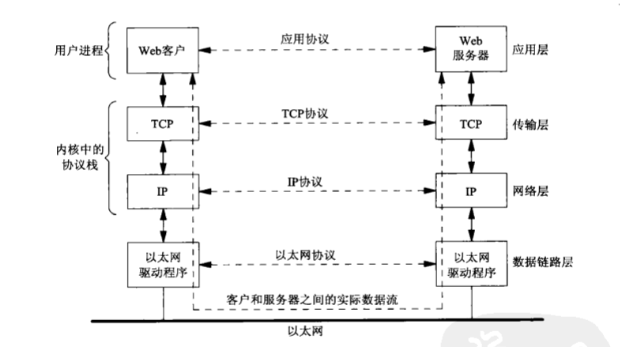
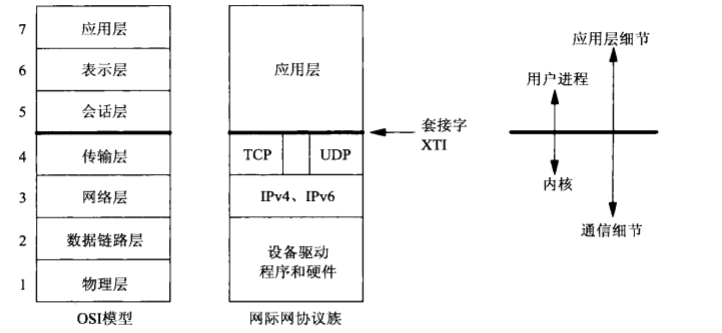
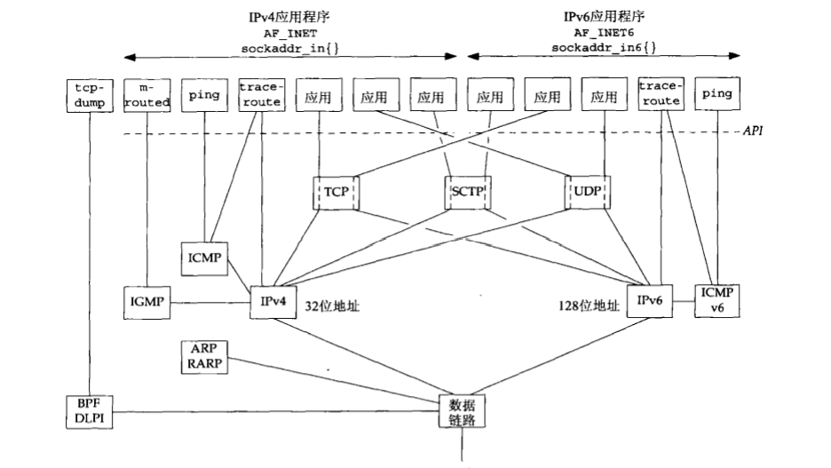
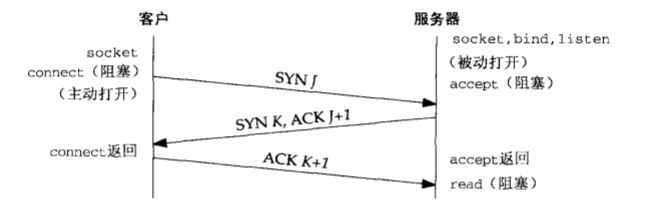
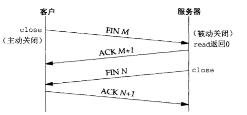
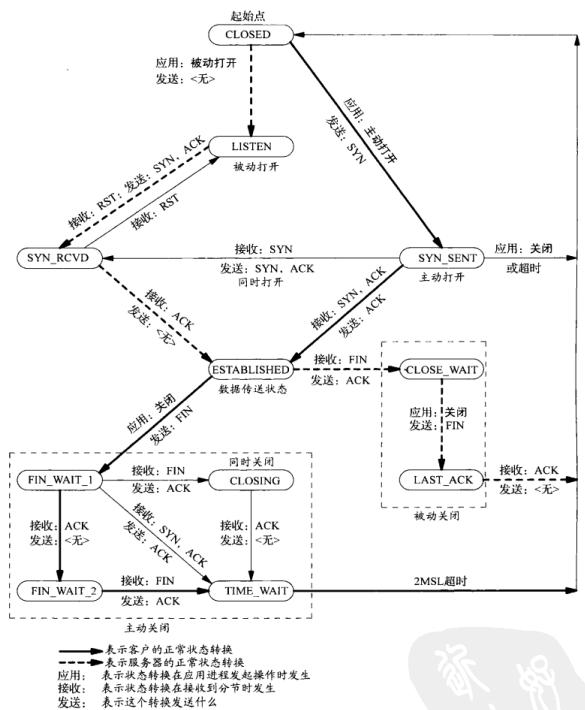

# 网络编程

所有代码源于 **Unix网络编程**，源码文件来自同文件夹下的`unpv13e.tar.gz`

## TCP/IP

### 基本使用



尽管客户与服务器之间使用某个应用协议通信，传输层确实用TCP(Transmission Control Protocol，传输控制协议)通信，TCP又转而使用IP(Internet Protocol，网际协议)通信，IP再通过某种形式的数据链路层通信

> 客户端与服务器之间的信息流再一端是向下通过协议栈的，跨越网络后，在另一端是向上通过协议栈的

#### 从服务器获得时间

```cpp
// #define	SA	struct sockaddr
// #define	bzero(ptr,n)		memset(ptr, 0, n)
// 

int main(int argc, char **argv)
{
	int			sockfd, n;
	char			recvline[MAXLINE + 1];
	struct sockaddr_in	servaddr;

	if (argc != 2)
		err_quit("usage: a.out <IPaddress>");

	if ( (sockfd = socket(AF_INET, SOCK_STREAM, 0)) < 0)
		err_sys("socket error");

	bzero(&servaddr, sizeof(servaddr));
	servaddr.sin_family = AF_INET;
	servaddr.sin_port   = htons(13);	/* 设置端口 */
	if (inet_pton(AF_INET, argv[1], &servaddr.sin_addr) <= 0)   /* 设置IP地址 */
		err_quit("inet_pton error for %s", argv[1]);

	if (connect(sockfd, (SA *) &servaddr, sizeof(servaddr)) < 0)
		err_sys("connect error");

	while ( (n = read(sockfd, recvline, MAXLINE)) > 0) {
		recvline[n] = 0;	/* null terminate */
		if (fputs(recvline, stdout) == EOF)
			err_sys("fputs error");
	}
	if (n < 0)
		err_sys("read error");

	exit(0);
}
```

> intro/daytimetcpcli.c文件

1. 创建TCP套接字`socket(AF_INET, SOCK_STREAM, 0)`，创建一个网际(`AF_INET`)字节流(`SOCK_STREAM`)套接字，它是TCP套接字的花哨名字，`socket`函数返回一个小整数描述符，以后的所有函数调用就用该描述符来标识这个套接字

**套接字**(`socket`)，现在正在使用的API成为**套接字API**，例如`socket`函数就是套接字API的一部分

2. 指定服务器的IP地址和端口

把服务器的IP地址和端口填入网际套接字地址结构(`sockaddr_in`)，使用`memset`将结构清零，设置地址族为`AF_INET`并且设置端口号

网际套接字地址结构中**IP地址**和**端口号**这两个成员需使用**特定格式**，为此需要调用库`htons`(主机到网络短整数)去转换二进制端口号，调用`inet_pton`(呈现形式到数值)去把`char*`转化成合适的格式

3. 建立服务器连接

`connect`函数用于一个TCP套接字时，将于由它的第二个参数指向的套接字地址结构指定的服务器建立一个TCP连接，该套接字地址结构的长度也必须作为该函数的第三个参数指定

> 对于网际套接字地址结构，一般使用sizeof操作符由编译器来计算长度

使用`#define	SA	struct sockaddr`定义**通用套接字地址结构**，每当一个套接字函数需要一个指向某个套接字地质结构的指针使，这个指针必须强制类型转换成一个指向通用套接字地址结构的指针

> 使用宏定义可以缩减编码字符

4. 读入服务器的应答

使用`read`函数读取服务器的应答，并用标准的IO函数`fputs`输出结构

使用TCP时需要小心，因为TCP是一个**没有记录边界的字节流协议**

比如服务器返回时间可以能使如下26字节的字符串

`Mon May 26 20:58:40 2003\r\n`

总计26个字符，大小为26字节可以有多种返回方式，既可以是包含所有26个字节的单个TCP分节，也可以是每个分节只含1个字节的26个TCP分节，还可以是总共26个字节的任何其他组合

通常服务器返回包含所有26个字节的单个分节，但是如果数据量很大，就**不能确保**一次`read`调用能返回服务器的整个应答，因此TCP套接字读取数据时，总是需要把`read`编写再某个循环中，当`read`返回0(表示**对端关闭连接**)或负值(表示**发生错误**)时中止循环

#### 使用IPv6获得服务器时间

```cpp
// #define	SA	struct sockaddr
// #define	bzero(ptr,n)		memset(ptr, 0, n)

int main(int argc, char **argv)
{
	int			sockfd, n;
	char			recvline[MAXLINE + 1];
	struct sockaddr_in6 servaddr;

	if (argc != 2)
		err_quit("usage: a.out <IPaddress>");

	if ( (sockfd = socket(AF_INET6, SOCK_STREAM, 0)) < 0)
		err_sys("socket error");

	bzero(&servaddr, sizeof(servaddr));
	servaddr.sin6_family = AF_INET6;
	servaddr.sin6_port   = htons(13);	/* 设置端口 */
	if (inet_pton(AF_INET6, argv[1], &servaddr.sin6_addr) <= 0)   /* 设置IP地址 */
		err_quit("inet_pton error for %s", argv[1]);

	if (connect(sockfd, (SA *) &servaddr, sizeof(servaddr)) < 0)
		err_sys("connect error");

	while ( (n = read(sockfd, recvline, MAXLINE)) > 0) {
		recvline[n] = 0;	/* null terminate */
		if (fputs(recvline, stdout) == EOF)
			err_sys("fputs error");
	}
	if (n < 0)
		err_sys("read error");

	exit(0);
}
```

对比前面的例子可以发现，只修改了5行代码，得到的确实另一个与协议相关的程序
所以更好的做法是**编写协议无关的程序**

另一个问题是，用户必须输入**点分十进制数**格式给出服务器的IP地址(比如:206.168.112.219)，可以使用 **IP地址与主机名之间** 以及 **服务名与端口之间** 的**转换函数**

#### 返回时间的服务器程序

```cpp
// #define	LISTENQ		1024	/* 2nd argument to listen() */
#include	<time.h>

int Socket(int family, int type, int protocol)
{
	int		n;

	if ( (n = socket(family, type, protocol)) < 0)
		err_sys("socket error");
	return(n);
}

void Bind(int fd, const struct sockaddr *sa, socklen_t salen)
{
	if (bind(fd, sa, salen) < 0)
		err_sys("bind error");
}


void Listen(int fd, int backlog)
{
	char	*ptr;

		/*4can override 2nd argument with environment variable */
	if ( (ptr = getenv("LISTENQ")) != NULL)
		backlog = atoi(ptr);

	if (listen(fd, backlog) < 0)
		err_sys("listen error");
}

int main(int argc, char **argv)
{
	int                     listenfd, connfd;
	struct sockaddr_in	servaddr;
	char                    buff[MAXLINE];
	time_t                  ticks;

	listenfd = Socket(AF_INET, SOCK_STREAM, 0);

	bzero(&servaddr, sizeof(servaddr));
	servaddr.sin_family      = AF_INET;
	servaddr.sin_addr.s_addr = htonl(INADDR_ANY);
	servaddr.sin_port        = htons(13);	/* daytime server */

	Bind(listenfd, (SA *) &servaddr, sizeof(servaddr));

	Listen(listenfd, LISTENQ);

	for ( ; ; ) {
		connfd = Accept(listenfd, (SA *) NULL, NULL);

        ticks = time(NULL);
        snprintf(buff, sizeof(buff), "%.24s\r\n", ctime(&ticks));
        Write(connfd, buff, strlen(buff));

		Close(connfd);
	}
}
```

1. 创建TCP套接字

`Socket`是自行封装的`socket`函数，里面封装了初始化不成的的警告函数

2. 端口绑定

通过填写一个网际套接字地址结构并调用`bind`函数，服务器的接口就被捆绑到所创建的套接字
指定IP地址为`INADDR_ANY`，这样服务器进程可以在任意网络接口上接受客户连接

3. 把套接字转换成监听套接字

调用`listen`函数把该套接字转换成一个监听套接字，这样来自客户的外来连接就可以在该套接字上由内核接收

`socket`、`bind`和`listen`3个调用步骤是任何TCP服务器准备所谓的**监听描述符**(listening descriptor)的正常步骤

4. 接收客户连接，发送应答

通常情况下，服务器进程再accept调用中被投入睡眠，等待某个客户连接的到达并被内核接收
TCP连接通过**三次握手**来建立，握手完毕后accept返回，其返回值是一个称为**已连接描述符**的新描述符(上述代码中的connfd)，通过该描述符与新进连接的客户端通信

5. 关闭连接

调用`close`关闭与客户的连接

#### OSI七层模型



> 除需要直到数据链路的某些特性外(比如以太网的MTU大小)，不用关心物理层和数据链路层

套接字提供的是从OSI模型的**顶上三层进入传输层的接口**

- 顶上三层不太需要了解通信细节；底下四层对网络应用不需要了解，只需要处理通信细节：发送数据、等待确认、对无序到达的进行排序、计算并验证校验和等等
- 顶上三层通常构成**用户进程**，底下四层通常作为**操作系统内核**的一部分提供

### 传输层：TCP、UDP、SCTP

SCTP(Stream Control Transmission Protocol，流控制传输协议)，绝大多数客户端、服务器网络应用使用TCP或UDP

UDP一给简单的、不可靠的数据报协议；TCP复杂、可靠的字节流协议



| 协议 | 作用 |
| --- | --- |
| IPv4 | 网际协议版本4(Internet Protocol version 4) 为TCP、UDP、SCTP、ICMP和IGMP提供分组递送服务 |
| IPv6 | 使用128更大地址以应对因特网的告诉发展 |
| TCP | 传输控制协议(Transmission Control Protocol) 为用户进程提供可靠的全双工字节流。TCP套接字是一种流套接字。TCP关系确认、超市和重传之类的细节 |
| UDP | 用户数据报协议(User Datagram Protocol)。UDP是一个无连接协议。UDP套接字是一种数据报套接字。UDP数据报不能保证最终到达它们的目的地 |
| SCTP | 流控制传输协议(Stream Control Transimission Protol)提供可靠全双工关联的面向连接的协议 |
| ICMP | 网际控制信息协议(Internet Control Message Protocol)。ICMP处理在路由器和主机之间流通的错误和控制消息。这些消息通常由TCP/IP网络支持软件(不是用户进程)本身产生和处理 |
| IGMP | 网际组管理协议(Internet Group Management Protocol)，用于多播 |
| ARP | 地址解析协议(Address Resolution Protocol)。ARP把一个IPv4地址映射成一个硬件地址。ARP通常用于诸如以太网、令牌环网和FDDI等广播网络，在点到点网络上不需要 |
| RARP | 反向地址解析协议(Reverse Address Resolution Protocol)。RARP把一个硬件地址映射成一个IPv4地址。有适用于无盘节点的引导 |
| ICMPv6 | 网际控制消息协议版本6(Internet Control Message Protocol version 6) |
| BPF | BSD分组过滤器(BSD packet filter) 提供对于数据链路层的访问能力，通常源自Berkeley的内核 |
| DLPI | 数据链路提供者接口(datalink provider interface) 提供对于书链路层的访问能力，通常随SVR4内核提供 |

#### UDP、TCP、SCTP

- UDP

应用进程往UDP套接字写入信息，随后信息被封装到一个UDP数据报，UDP数据报进而封装到IP数据报，然后发送到目的地

UDP不保证数据报回到达最终目的、不保证各个数据报到达的先后顺序、不保证每个数据报只到达一次

UDP的问题就是缺乏可靠性，如果想要确保一个数据报到达其目的地，可以往应用程序中添置一大堆特性：来自对端的确认、本端的超时重重等

每个UDP数据报都有一个长度，如果一个数据报正确地到达其目的地，那么该数据报的程度将随数据一并传递给接收端应用程序

UDP提供**无连接**的服务，因为UDP客户端与服务器之间不必存在任何长期的关系。UDP客户端可以创建一个套接字，用这个套接字发送数据给多个服务器

- TCP

TCP提供客户端与服务器之间的连接，TCP客户端先于某个服务器建立连接，随后通过该连接与服务器交换数据，然后中止这个连接

TCP提供可靠性。TCP向一端发送数据时，要求那一段返回一个确认，如果没有收到确认，TCP就会自动重传并等待更长时间。在数次重传失败后，TCP才放弃

> TCP并不保证数据一定会被对方收到，只保证在可能送到的情况下，数据可以送到，否则就通过**放弃重传并中断连接**来通知用户

TCP含有用于动态估算客户和服务器之间的往返时间(round-trip time，RTT)的算法，以便知道等待一个确认需要多少时间

TCP通过给其中每个字节关联一个序列号对所发送的数据进行排序(当进行一条数据发送的时候，首先，TCP会将这条数据拆分成不同的片段，然后把片段进行一个排序。然后把排序号的片段顺序进行发送)

TCP提供流量控制。TCP总是告诉对端在任何时刻他一次能够从对端接收多少字节的数据，这称为**通告窗口**(滑动窗口)

TCP时全双工的，在给定的连接上应用可以在任何时刻在进出两个方向上即发送数据又接收数据(TCP必须为每个数据流方向跟踪诸如序列号和通告窗口大小等信息)

- SCTP

暂且跳过，用的少 ZZZ

#### TCP连接的建立和中止

1. 三次握手



- 服务器必须准备好接收外来的连接，通常通过`socket`、`bind`和`listen`完成，称之为**被动打开**
- 客户端通过调用`connect`发起**主动打开**，这导致客户端发送一个SYN(同步)分节，告诉服务器客户端将在连接中发送的数据的初始序列号。**此时可以确认客户端具有发送信息的能力**
- 服务器必须确认(ACK)客户端的SYN，同时自己也发送一个SYN分节，它含有服务器将在同一连接中发送的数据的初始序列号。服务器在单个分节中发送SYN和对客户SYN的ACK(确认)。**此时可以确认服务器具有接收和发送数据的能力**
- 客户端必须确认服务器的SYN。**此时可以确认服务器具有接收数据的能力**

2. TCP选项

每一个SYN可以含有多个TCP选项

| 选项 | 作用 |
| --- | --- |
| MSS选项 | 发送SYN的TCP一段使用本选项通告对端它的**最大分节大小**(maximum segment size)即MSS，也就是它在本连接的每个TCP分节中愿意接受的最大数据量 |
| 窗口规模选项 | TCP连接任何一端能够通告对端的最大窗口大小时65535，因为在TCP首部中响应的字段占16位。但是随着网络的普及，这个选项指定TCP首部中的通告窗口必须扩大的位数(0~14)，即最大可以提供 65535 * (2 ^ 14) |
| 时间戳选项 | 对于告诉网络时必要的，可以防止由失而复现的分组可能造成的数据损坏，一般无需考虑 |

3. TCP连接终止

TCP的中止需要4个分节



- 某个应用程序首先调用`close`，**主动关闭**，该端TCP发送FIN分节
- 接收到这个FIN的对端执行**被动关闭**，这个FIN由TCP确认，它的接收也作为要给文件结束符传递给接收端应用程序
- 一段时间后接收到这个文件结束符的应用程序将调用`close`关闭它的套接字，这导致TCP也发送一个FIN
- 接收这个最终FIN的原发送端TCP确认这个FIN



