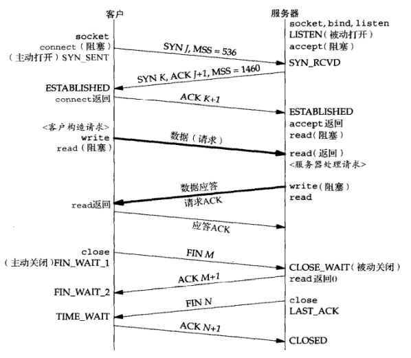
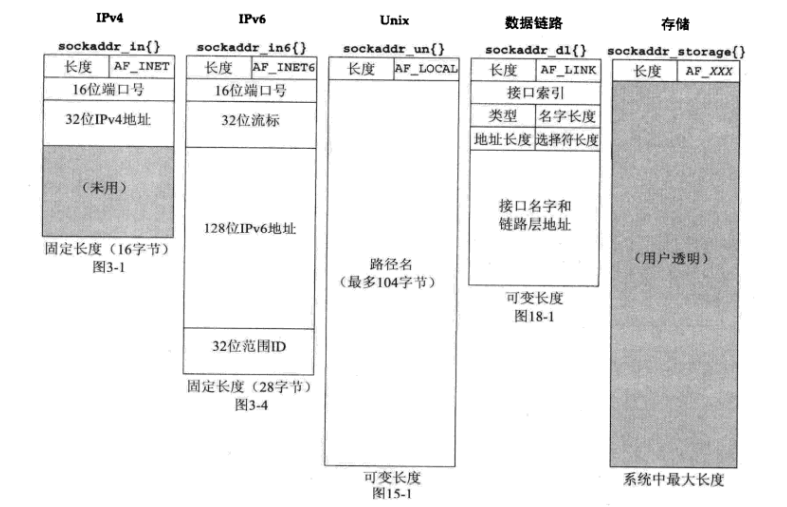
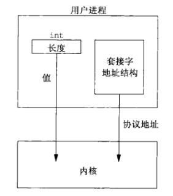
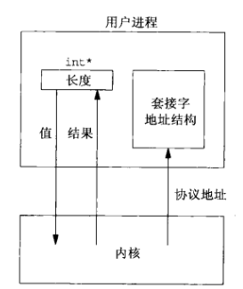
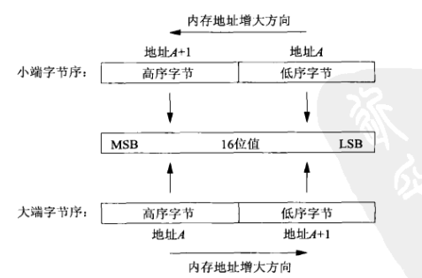
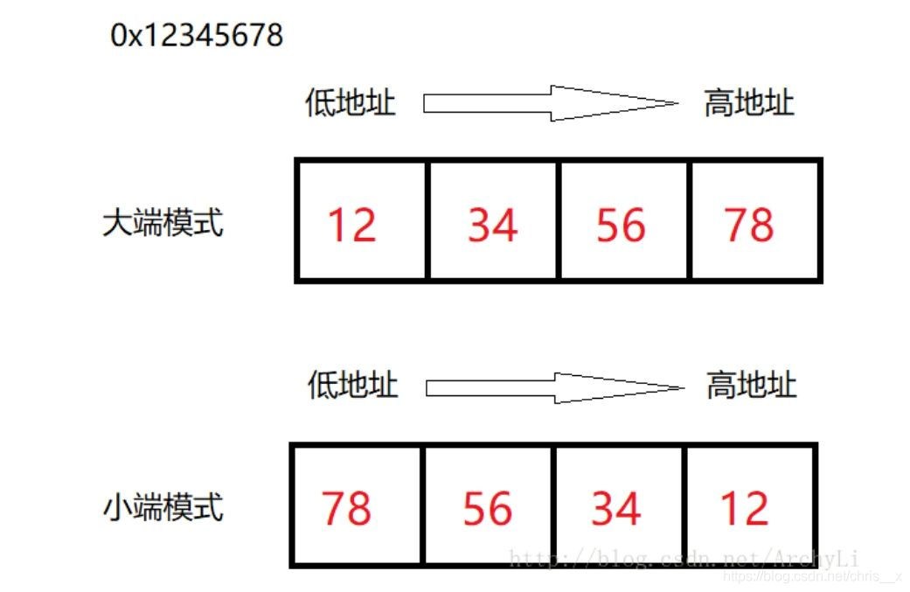
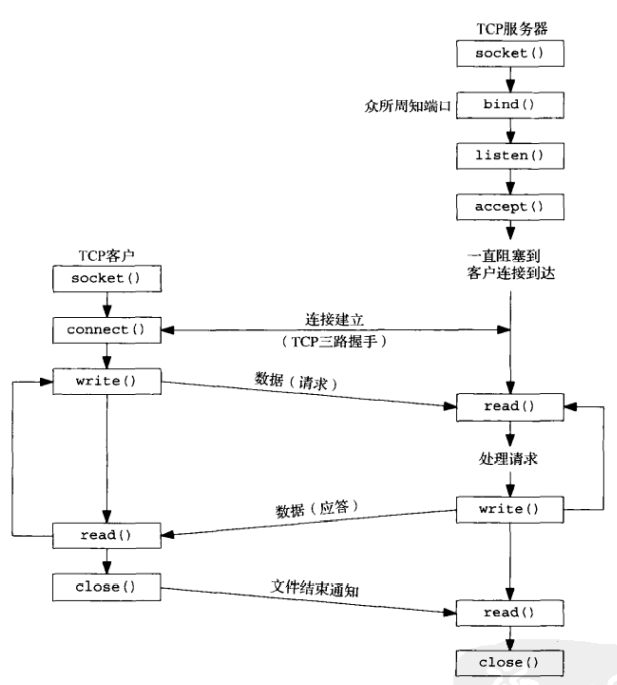

# 网络编程

所有代码源于 **Unix网络编程**，源码文件来自同文件夹下的`unpv13e.tar.gz`

## TCP/IP

### 基本使用


尽管客户与服务器之间使用某个应用协议通信，传输层确实用TCP(Transmission Control Protocol，传输控制协议)通信，TCP又转而使用IP(Internet Protocol，网际协议)通信，IP再通过某种形式的数据链路层通信

> 客户端与服务器之间的信息流再一端是向下通过协议栈的，跨越网络后，在另一端是向上通过协议栈的

#### 从服务器获得时间

```cpp
// #define	SA	struct sockaddr
// #define	bzero(ptr,n)		memset(ptr, 0, n)
// 

int main(int argc, char **argv)
{
	int			sockfd, n;
	char			recvline[MAXLINE + 1];
	struct sockaddr_in	servaddr;

	if (argc != 2)
		err_quit("usage: a.out <IPaddress>");

	if ( (sockfd = socket(AF_INET, SOCK_STREAM, 0)) < 0)
		err_sys("socket error");

	bzero(&servaddr, sizeof(servaddr));
	servaddr.sin_family = AF_INET;
	servaddr.sin_port   = htons(13);	/* 设置端口 */
	if (inet_pton(AF_INET, argv[1], &servaddr.sin_addr) <= 0)   /* 设置IP地址 */
		err_quit("inet_pton error for %s", argv[1]);

	if (connect(sockfd, (SA *) &servaddr, sizeof(servaddr)) < 0)
		err_sys("connect error");

	while ( (n = read(sockfd, recvline, MAXLINE)) > 0) {
		recvline[n] = 0;	/* null terminate */
		if (fputs(recvline, stdout) == EOF)
			err_sys("fputs error");
	}
	if (n < 0)
		err_sys("read error");

	exit(0);
}
```

> intro/daytimetcpcli.c文件

1. 创建TCP套接字`socket(AF_INET, SOCK_STREAM, 0)`，创建一个网际(`AF_INET`)字节流(`SOCK_STREAM`)套接字，它是TCP套接字的花哨名字，`socket`函数返回一个小整数描述符，以后的所有函数调用就用该描述符来标识这个套接字

**套接字**(`socket`)，现在正在使用的API成为**套接字API**，例如`socket`函数就是套接字API的一部分

2. 指定服务器的IP地址和端口

把服务器的IP地址和端口填入网际套接字地址结构(`sockaddr_in`)，使用`memset`将结构清零，设置地址族为`AF_INET`并且设置端口号

网际套接字地址结构中**IP地址**和**端口号**这两个成员需使用**特定格式**，为此需要调用库`htons`(主机到网络短整数)去转换二进制端口号，调用`inet_pton`(呈现形式到数值)去把`char*`转化成合适的格式

3. 建立服务器连接

`connect`函数用于一个TCP套接字时，将于由它的第二个参数指向的套接字地址结构指定的服务器建立一个TCP连接，该套接字地址结构的长度也必须作为该函数的第三个参数指定

> 对于网际套接字地址结构，一般使用sizeof操作符由编译器来计算长度

使用`#define	SA	struct sockaddr`定义**通用套接字地址结构**，每当一个套接字函数需要一个指向某个套接字地质结构的指针使，这个指针必须强制类型转换成一个指向通用套接字地址结构的指针

> 使用宏定义可以缩减编码字符

4. 读入服务器的应答

使用`read`函数读取服务器的应答，并用标准的IO函数`fputs`输出结构

使用TCP时需要小心，因为TCP是一个**没有记录边界的字节流协议**

比如服务器返回时间可以能使如下26字节的字符串

`Mon May 26 20:58:40 2003\r\n`

总计26个字符，大小为26字节可以有多种返回方式，既可以是包含所有26个字节的单个TCP分节，也可以是每个分节只含1个字节的26个TCP分节，还可以是总共26个字节的任何其他组合

通常服务器返回包含所有26个字节的单个分节，但是如果数据量很大，就**不能确保**一次`read`调用能返回服务器的整个应答，因此TCP套接字读取数据时，总是需要把`read`编写再某个循环中，当`read`返回0(表示**对端关闭连接**)或负值(表示**发生错误**)时中止循环

#### 使用IPv6获得服务器时间

```cpp
// #define	SA	struct sockaddr
// #define	bzero(ptr,n)		memset(ptr, 0, n)

int main(int argc, char **argv)
{
	int			sockfd, n;
	char			recvline[MAXLINE + 1];
	struct sockaddr_in6 servaddr;

	if (argc != 2)
		err_quit("usage: a.out <IPaddress>");

	if ( (sockfd = socket(AF_INET6, SOCK_STREAM, 0)) < 0)
		err_sys("socket error");

	bzero(&servaddr, sizeof(servaddr));
	servaddr.sin6_family = AF_INET6;
	servaddr.sin6_port   = htons(13);	/* 设置端口 */
	if (inet_pton(AF_INET6, argv[1], &servaddr.sin6_addr) <= 0)   /* 设置IP地址 */
		err_quit("inet_pton error for %s", argv[1]);

	if (connect(sockfd, (SA *) &servaddr, sizeof(servaddr)) < 0)
		err_sys("connect error");

	while ( (n = read(sockfd, recvline, MAXLINE)) > 0) {
		recvline[n] = 0;	/* null terminate */
		if (fputs(recvline, stdout) == EOF)
			err_sys("fputs error");
	}
	if (n < 0)
		err_sys("read error");

	exit(0);
}
```

对比前面的例子可以发现，只修改了5行代码，得到的确实另一个与协议相关的程序
所以更好的做法是**编写协议无关的程序**

另一个问题是，用户必须输入**点分十进制数**格式给出服务器的IP地址(比如:206.168.112.219)，可以使用 **IP地址与主机名之间** 以及 **服务名与端口之间** 的**转换函数**

#### 返回时间的服务器程序

```cpp
// #define	LISTENQ		1024	/* 2nd argument to listen() */
#include	<time.h>

int Socket(int family, int type, int protocol)
{
	int		n;

	if ( (n = socket(family, type, protocol)) < 0)
		err_sys("socket error");
	return(n);
}

void Bind(int fd, const struct sockaddr *sa, socklen_t salen)
{
	if (bind(fd, sa, salen) < 0)
		err_sys("bind error");
}


void Listen(int fd, int backlog)
{
	char	*ptr;

		/*4can override 2nd argument with environment variable */
	if ( (ptr = getenv("LISTENQ")) != NULL)
		backlog = atoi(ptr);

	if (listen(fd, backlog) < 0)
		err_sys("listen error");
}

int main(int argc, char **argv)
{
	int                     listenfd, connfd;
	struct sockaddr_in	servaddr;
	char                    buff[MAXLINE];
	time_t                  ticks;

	listenfd = Socket(AF_INET, SOCK_STREAM, 0);

	bzero(&servaddr, sizeof(servaddr));
	servaddr.sin_family      = AF_INET;
	servaddr.sin_addr.s_addr = htonl(INADDR_ANY);
	servaddr.sin_port        = htons(13);	/* daytime server */

	Bind(listenfd, (SA *) &servaddr, sizeof(servaddr));

	Listen(listenfd, LISTENQ);

	for ( ; ; ) {
		connfd = Accept(listenfd, (SA *) NULL, NULL);

        ticks = time(NULL);
        snprintf(buff, sizeof(buff), "%.24s\r\n", ctime(&ticks));
        Write(connfd, buff, strlen(buff));

		Close(connfd);
	}
}
```

1. 创建TCP套接字

`Socket`是自行封装的`socket`函数，里面封装了初始化不成的的警告函数

2. 端口绑定

通过填写一个网际套接字地址结构并调用`bind`函数，服务器的接口就被捆绑到所创建的套接字
指定IP地址为`INADDR_ANY`，这样服务器进程可以在任意网络接口上接受客户连接

3. 把套接字转换成监听套接字

调用`listen`函数把该套接字转换成一个监听套接字，这样来自客户的外来连接就可以在该套接字上由内核接收

`socket`、`bind`和`listen`3个调用步骤是任何TCP服务器准备所谓的**监听描述符**(listening descriptor)的正常步骤

4. 接收客户连接，发送应答

通常情况下，服务器进程再accept调用中被投入睡眠，等待某个客户连接的到达并被内核接收
TCP连接通过**三次握手**来建立，握手完毕后accept返回，其返回值是一个称为**已连接描述符**的新描述符(上述代码中的connfd)，通过该描述符与新进连接的客户端通信

5. 关闭连接

调用`close`关闭与客户的连接

#### OSI七层模型


> 除需要直到数据链路的某些特性外(比如以太网的MTU大小)，不用关心物理层和数据链路层

套接字提供的是从OSI模型的**顶上三层进入传输层的接口**

- 顶上三层不太需要了解通信细节；底下四层对网络应用不需要了解，只需要处理通信细节：发送数据、等待确认、对无序到达的进行排序、计算并验证校验和等等
- 顶上三层通常构成**用户进程**，底下四层通常作为**操作系统内核**的一部分提供

### 传输层：TCP、UDP、SCTP

SCTP(Stream Control Transmission Protocol，流控制传输协议)，绝大多数客户端、服务器网络应用使用TCP或UDP

UDP一给简单的、不可靠的数据报协议；TCP复杂、可靠的字节流协议


| 协议 | 作用 |
| --- | --- |
| IPv4 | 网际协议版本4(Internet Protocol version 4) 为TCP、UDP、SCTP、ICMP和IGMP提供分组递送服务 |
| IPv6 | 使用128更大地址以应对因特网的告诉发展 |
| TCP | 传输控制协议(Transmission Control Protocol) 为用户进程提供可靠的全双工字节流。TCP套接字是一种流套接字。TCP关系确认、超市和重传之类的细节 |
| UDP | 用户数据报协议(User Datagram Protocol)。UDP是一个无连接协议。UDP套接字是一种数据报套接字。UDP数据报不能保证最终到达它们的目的地 |
| SCTP | 流控制传输协议(Stream Control Transimission Protol)提供可靠全双工关联的面向连接的协议 |
| ICMP | 网际控制信息协议(Internet Control Message Protocol)。ICMP处理在路由器和主机之间流通的错误和控制消息。这些消息通常由TCP/IP网络支持软件(不是用户进程)本身产生和处理 |
| IGMP | 网际组管理协议(Internet Group Management Protocol)，用于多播 |
| ARP | 地址解析协议(Address Resolution Protocol)。ARP把一个IPv4地址映射成一个硬件地址。ARP通常用于诸如以太网、令牌环网和FDDI等广播网络，在点到点网络上不需要 |
| RARP | 反向地址解析协议(Reverse Address Resolution Protocol)。RARP把一个硬件地址映射成一个IPv4地址。有适用于无盘节点的引导 |
| ICMPv6 | 网际控制消息协议版本6(Internet Control Message Protocol version 6) |
| BPF | BSD分组过滤器(BSD packet filter) 提供对于数据链路层的访问能力，通常源自Berkeley的内核 |
| DLPI | 数据链路提供者接口(datalink provider interface) 提供对于书链路层的访问能力，通常随SVR4内核提供 |

#### UDP、TCP、SCTP

- UDP

应用进程往UDP套接字写入信息，随后信息被封装到一个UDP数据报，UDP数据报进而封装到IP数据报，然后发送到目的地

UDP不保证数据报回到达最终目的、不保证各个数据报到达的先后顺序、不保证每个数据报只到达一次

UDP的问题就是缺乏可靠性，如果想要确保一个数据报到达其目的地，可以往应用程序中添置一大堆特性：来自对端的确认、本端的超时重重等

每个UDP数据报都有一个长度，如果一个数据报正确地到达其目的地，那么该数据报的程度将随数据一并传递给接收端应用程序

UDP提供**无连接**的服务，因为UDP客户端与服务器之间不必存在任何长期的关系。UDP客户端可以创建一个套接字，用这个套接字发送数据给多个服务器

- TCP

TCP提供客户端与服务器之间的连接，TCP客户端先于某个服务器建立连接，随后通过该连接与服务器交换数据，然后中止这个连接

TCP提供可靠性。TCP向一端发送数据时，要求那一段返回一个确认，如果没有收到确认，TCP就会自动重传并等待更长时间。在数次重传失败后，TCP才放弃

> TCP并不保证数据一定会被对方收到，只保证在可能送到的情况下，数据可以送到，否则就通过**放弃重传并中断连接**来通知用户

TCP含有用于动态估算客户和服务器之间的往返时间(round-trip time，RTT)的算法，以便知道等待一个确认需要多少时间

TCP通过给其中每个字节关联一个序列号对所发送的数据进行排序(当进行一条数据发送的时候，首先，TCP会将这条数据拆分成不同的片段，然后把片段进行一个排序。然后把排序号的片段顺序进行发送)

TCP提供流量控制。TCP总是告诉对端在任何时刻他一次能够从对端接收多少字节的数据，这称为**通告窗口**(滑动窗口)

TCP时全双工的，在给定的连接上应用可以在任何时刻在进出两个方向上即发送数据又接收数据(TCP必须为每个数据流方向跟踪诸如序列号和通告窗口大小等信息)

- SCTP

暂且跳过，用的少 ZZZ

#### TCP连接的建立和中止

1. 三次握手


- 服务器必须准备好接收外来的连接，通常通过`socket`、`bind`和`listen`完成，称之为**被动打开**
- 客户端通过调用`connect`发起**主动打开**，这导致客户端发送一个SYN(同步)分节，告诉服务器客户端将在连接中发送的数据的初始序列号。**此时可以确认客户端具有发送信息的能力**
- 服务器必须确认(ACK)客户端的SYN，同时自己也发送一个SYN分节，它含有服务器将在同一连接中发送的数据的初始序列号。服务器在单个分节中发送SYN和对客户SYN的ACK(确认)。**此时可以确认服务器具有接收和发送数据的能力**
- 客户端必须确认服务器的SYN。**此时可以确认服务器具有接收数据的能力**

2. TCP选项

每一个SYN可以含有多个TCP选项

| 选项 | 作用 |
| --- | --- |
| MSS选项 | 发送SYN的TCP一段使用本选项通告对端它的**最大分节大小**(maximum segment size)即MSS，也就是它在本连接的每个TCP分节中愿意接受的最大数据量 |
| 窗口规模选项 | TCP连接任何一端能够通告对端的最大窗口大小时65535，因为在TCP首部中响应的字段占16位。但是随着网络的普及，这个选项指定TCP首部中的通告窗口必须扩大的位数(0~14)，即最大可以提供 65535 * (2 ^ 14) |
| 时间戳选项 | 对于告诉网络时必要的，可以防止由失而复现的分组可能造成的数据损坏，一般无需考虑 |

3. TCP连接终止

TCP的中止需要4个分节


- 某个应用程序首先调用`close`，**主动关闭**，该端TCP发送FIN分节
- 接收到这个FIN的对端执行**被动关闭**，这个FIN由TCP确认，它的接收也作为要给文件结束符传递给接收端应用程序
- 一段时间后接收到这个文件结束符的应用程序将调用`close`关闭它的套接字，这导致TCP也发送一个FIN
- 接收这个最终FIN的原发送端TCP确认这个FIN

4. TCp状态转换


5. 观察分组



> 客户端536的MSS，服务器1460的MSS

MSS（最大分段大小）限制通过网络（例如互联网）传输的数据包或小数据块的大小。通过网络传输的所有数据都被分解成数据包。数据包附有几个标头，其中包含有关其内容和目的地的信息。MSS 测量数据包的非标头部分，称为有效负载

#### TIME_WAIT状态


## 基本套接字

### 套接字地址结构

#### IPv4套接字地址结构

大多数套接字函数都需要一个指向套接字地址结构的指针作为参数

每个协议族都定义它自己的套接字地址结构，这些结构的名字均以`sockaddr_`开头，并以对应每个协议族的唯一后缀结尾

```cpp
struct in_addr{
	in_addr_t s_addr;			// 32-bit IPv4 address
};

struct sockaddr_in {
	uint8_t			sin_len;			// length of structure(16)
	sa_family_t   	sin_family;         //address family
	in_port_t 		sin_port;           //16 bit TCP/UDP port number
	struct  in_addr sin_addr;   		//32 bit IP address
	char    		sin_zero[8];        //not use, for align
};
```

> `sin_len`长度字段是为了增加对OSI协议的支持而增加的，在此之前第一个成员是`sin_family`也就是说不是所有厂家都支持`sin_len`字段，而且POSIX规范也不要求这个成员

- 即使有`sin_len`长度字段，也无需设置和检查它，触发涉及路由套接字。它是由处理来自不同协议族的套接字地址结构的例程在内核中使用的

> 在源自`Berkeley`的实现中，从进程到内核传递套接字地址结构的4个套接字函数(`bind`,`connet`,`sendto`和`sendmsg`)打偶要调用`sockargs`函数，该函数从进程复制套接字地址结构，并显式地把它的`sin_len`字段设置成早先作为参数传递给这个4个函数的该地址结构的长度

> 从内核到进程传递套接字地址结构的5个套接字函数分别是`accept`,`recefrom`,`recvmsg`,`getpeername`和`getsockname`，均在返回进程之前设置`sin_len`字段

- POSIX规范只需要`sin_family`,`sin_addr`和`sin_port`三个字段。对于符合POSIX的实现来说，定义额外的结构字段是可以接受的，这队伍网际套接字地址结构来说也是正常的。几乎所有的试下你都增加了`sin_zero`字段，所以所有的套接字地质结构大小都至少是16字节

- `struct in_addr`数据类型必须是一个至少32位无符号整数类型，`in_port_t`必须是一个至少16位的无符号整数类型，`sa_family_t`可以是任何无符号整数类型

> 在支持长度字段的实现中，`sa_family_t`通常是一个8位的无符号整数；在不支持长度字段的实现中，它一般是16位无符号整数

| 数据类型 | 说明 | 头文件 |
| --- | --- | --- |
| int8_t | 带符号的8位整数 | `<sys/types.h>` |
| uint8_t | 不带符号的8位整数 | `<sys/types.h>` |
| int16_t | 带符号的16位整数 | `<sys/types.h>` |
| uint16_t | 不带符号的16位整数 | `<sys/types.h>` |
| int32_t | 带符号的32位整数 | `<sys/types.h>` |
| uint32_t | 不带符号的32位整数 | `<sys/types.h>` |
| sa_family_t | 套接字地址结构的地址族 | `<sys/socket.h>` |
| socklen_t | 套接字地址结构的长度，一般为uint32_t | `<sys/socket.h>` |
| in_addr_t | IPv4地址，一般为uint32_t | `<netinet/in.h>` |
| in_port_t | TCP或UDP端口，一般为uint16_t | `<netinet/in.h>` |

- IPv4地址和TCP或UDP开端口号在套接字地址结构中总是以**网络字节序**来存储
- 32位IPv4地址存在两种不同的访问方法，所以必须正确使用IPv4地址，尤其是在它作为函数的参数时，因为编译器对**传递结构**和**传递整数**的处理时完全不同的
- `sin_zero`字段未曾使用，一般把整个结构置为0，而不是单单把`sin_zero`置0
- 套接字地址结构仅在给定主机上使用。虽然结构中的某些字段用在不同主机之间的通信中，但是结构本身并不在主机之间传递

#### 通用套接字地址结构

当作为一个参数传递进任何套接字函数时，套接字地址结构总是以引用形式(指向该结构的指针)来传递。但是以这样的**指针作为参数**之一的任何套接字函数必须处理来自所支持的**任何协议族**的套接字地址结构

`void*`类型是在套接字函数定义之后出现的，所以当时的为了解决适配所有协议族的套接字函数，在`<sys/socket.h>`中定义了`sockaddr`**通用套接字地址结构**

```cpp
struct sockaddr {
	__uint8_t       sa_len;         /* total length */   
	sa_family_t     sa_family;      /* [XSI] address family */
	char            sa_data[14];    /* [XSI] addr value (actually larger) */
};
```

套接字函数被定义为指向某个通用套接字地址结构的一个指针作为其参数之一

```cpp
int bind(int, struct sockaddr*, socklen_t);
```

> `bind`将`sockaddr*`作为参数

这就要求这些函数的任何调用都必须要指向特定于协议的套机子地址结构的指针进行强制类型转换

```cpp
struct sockaddr_in serv;
bind(sockfd, (struct sockaddr*)&serv, sizeof(serv));
```

#### IPv6套接字地址结构

```cpp
struct sockaddr_in6
{
	uint8_t			sin6_len;			
	sa_family_t 	sin6_family;   	/* 地址协议簇： AF_INET6 */
	u_int16_t 		sin6_port;      /* 端口号， 要用网络字节序表示 */
	u_int32_t 		sin6_flowinfo   /* 流信息， 应设置为0 */
	struct in6_addr sin6_addr; 		/* ipv6 地址结构体， 见下面 */
	u_int32_t 		sin6_socpe_id;  /* scope ID， 尚处于实验阶段 */
}；

struct in6_addr
{
	unsigned char sa_addr[16]; 	/* ipv6地址， 要使用网络字节序表示 */
};
```

> `<netinet/in.h>`中定义

- 如果系统支持套接字地址结构中的长度字段`sin6_len`，那么`sin6_len`必须定于
- `IPv6`的地址族时`AF_INET6`，`IPv4`的地址族时`AF_INET`
- 结构中字段的先后顺序做过编排，是的如果`sockaddr_in6`结构本身是64位对其的，那么128位的`sin6_addr`字段也是64位对其的
- `sin6_flowinfo`字段分成两个字段
  - 低序20位是流标
  - 高序12位保留
- 对于具备范围的地址(scoped address)，`sin6_scope_id`字段标识其范围，最常见的是链路局部地址(link-local address)的接口索引(interface index)

#### 新的通用套接字地址结构

作为IPv6套接字API的一部分而定义的新的通用套机子地址结构克服了现有的`struct sockaddr`的一些缺点，新的`struct sockaddr_storage`足以容纳系统所支持的任何套接字地质结构

```cpp
struct sockaddr_storage {
    uint8_t ss_len;
    sa_family_t ss_family;
    char ss_padding[SIZE];
}
```

- 与`sockaddr`存在的区别
  - 系统支持的任何套接字地址结构有对其需要，`sockaddr_storage`都能够满足
  - `sockaddr_storage`足够大，容纳系统支持的任何套接字地址结构

- 注意
  - `sockaddr_storage`中除了`ss_family`和`ss_len`之外的其他字段，对用户同某个
  - `sockaddr_storage`结构必须强制类型转换成或复制到适合于`ss_family`字段所给出地址类型的套接字地址结构中，才能访问其他字段

#### 套接字地址结构的比较



### 值-结果参数

套接字函数传递一个套接字地址结构时，总是以指针的形式传递，该结构的长度作为另一个参数来传递，不过该传递分两种：内核到进程、进程到内核

1. 从进程到内核传递套接字地址结构的函数有3个：`bind`,`connect`和`sendto`，这些函数的一个参数是指向某个套接字地址结构的指针，另一个参数是该结构的整数大小

```cpp
int send(
  _In_       SOCKET s,
  _In_ const char   *buf,
  _In_       int    len,
  _In_       int    flags
);

int connect(
  _In_ SOCKET                s,
  _In_ const struct sockaddr *name,
  _In_ int                   namelen
);
```

指针和指针所指内容的大小都传递给了内核，于是内核知道需要从进程复制多少数据进来



2. 从内核到进程传递套接字地质结构的函数有4个：`accept`,`recvfrom`,`getsockname`和`getpeername`

这些函数的一个参数指向某个套接字地址结构的指针，另一个表示指向该结构带线啊哦的指数变量的指针

```cpp
int accept(int socket, struct sockaddr *restrict address, socklen_t *restrict address_len);
ssize_t recvfrom(int socket, void *restrict buffer, size_t length, int flags, struct sockaddr *restrict address, socklen_t *restrict address_len);
int	getsockname(int, struct sockaddr *restrict, socklen_t *restrict);
int getpeername(int, struct sockaddr *restrict, socklen_t *restrict);
```



把套接字地址结构大小这个参数从一个整数改为指向某个整数变量的指针，是为了

1. 当时被调用时，结构大小是一个值，它告诉内核该结构的大小，这样内核在写该结构时不至于越界
2. 当函数返回时，结构大小是一个结果，它告诉进程内核在结构中究竟存储了多少信息

使用值-结果参数作为套接字地址结构的长度时
1. 如果套接字地址结构是固定长度(sockaddr_in 长度是16，sockaddr_in6长度是28)，那么内核返回的长度也是那个固定值
2. 如果是可变长度的套接字地址结构(Unix域的sockaddr_un)，内核返回的长度可能是小于该结构的最大长度

### 字节排序函数

一个16位的整数，由两个字节组成，内存中存储这两个字节有两种方法
1. 低序（就是权值较小的后面那几位）字节存储在起始地址，称为**小端字节序**
2. 高序字节存储在起始地址，称为**大端字节序**



遗憾的是，这两种字节序之间没有标准可循，两种格式都有系统使用

```cpp
union {
	short s;
	char c[sizeof(short)];
} un;
un.s = 0x0102;
std::cout << (int)un.c[0] << " " << (int)un.c[1] << std::endl;
```

> 输出`1 2`是大端，输出`2 1`是小端



一般把某个给定系统所用的字节序称为**主机字节序**

网络协议指定的字节序称为**网络字节序**

在每个TCP分节中都有16位端口号和32位的IPv4地址。发送协议栈和接收协议栈必须就这些多字节字段和各个字节的传送顺序达成一致。**网际协议使用大端字节序**来传送这些多字节整数

> 网络使用大端的一种解释：先收到校验信息，提前预处理

理论上，按主机字节序存储套接字地质结构中的各个字段，等到需要时再在主机字节序和网络字节序之间进行自动转换，使用者无需关注细节。但是历史原因，套接字地址结构中的某些字段必须按照网络字节序进行维护

因此，需要关注如何在主机字节序和网络字节序之间相互转换

```cpp
#include <arpa/inet.h>

// 均返回网络字节序的值
uint32_t htonl(uint32_t hostlong);
uint16_t htons(uint16_t hostshort);

// 均返回主机字节序的值
uint32_t ntohl(uint32_t netlong);
uint16_t ntohs(uint16_t netshort);
```

> h表示`host`主机，n表示`network`网络，s表示`short`，l表示`long`

使用这些函数时，不关系主机字节序和网络字节序的真实值，只用调用合适的函数在主机和网络字节序之间转换某个给定值

### 字节操纵函数

以空字符结尾的C字符串是由在`<string.h>`头文件中定义、名字以str开头的函数处理  

名字以mem开头的函数用于处理内存

名字以b开头的函数用于处理字节

```cpp
#include <strings.h>

void bzero(void *s, size_t n); 
void bcopy(const void *s1, void *s2, size_t n);
int bcmp(const void *s1, const void *s2, size_t n);	// 若相等 返回0，否则返回非0
```

`bzero`把目标字节串中指定数据的字节置为0，经常用来把一个套接字地址结构初始化0

`bcopy`将指定数目的字节从源字节串移到目标字节串

`bcmp`用于比较两个字节串

```cpp
#include <string.h>

void *memcpy(void *restrict s1, const void *restrict s2, size_t n);
void *memcpy(void *restrict s1, const void *restrict s2, size_t n);
int memcmp(const void *s1, const void *s2, size_t n);
```

`memset`把目标字节串指定数目的字节置为值C

`memcpy`类似`bcopy`不过两个指针参数的顺序相反

`memcmp`比较两个任意的字节串，相同返回0，否则返回非0

### inet_aton、inet_addr、inet_ntoa函数

用于ASCII字符串域网络字节序的二进制之间转换网际地址

1. `inet_aton`、`inet_addr`、`inet_ntoa`在点分十进制数串(例如`206.140.23.123`)与它长度为32位的网络字节序二进制值之间转换IPv4地址
2. `inet_pton`和`inet_ntop`对于IPv4和Ipv6都适用

```cpp
#include <arpa/inet.h>

int inet_aton(const char *string, struct in_addr*addr);		// 若字符串有效 返回1 否则返回0
in_addr_t inet_addr(const char *cp);						// 若字符串有效 返回32位二进制网络字节序IPv4地址，否则返回INADDR_NONE
char *inet_ntoa(struct in_addr in);							// 返回点分十进制数串的指针
```

> inet_addr返回值INADDR_NONE是每个位全为1的常值，也就是255.255.255.255，那么对于IPv4的广播地址就无法使用inet_addr表示，所以应该**尽可能不用**`inet_addr`

### inet_pton和inet_ntop函数

这两个函数是随IPv6出现的函数，对于IPv4地址和IPv6地址都适用

函数中p和n分别代表表达（presentation)和数值（numeric)

```cpp
#include <arpe/inet.h>
int inet_pton(int family, const char *strptr, void *addrptr);   //将点分十进制的ip地址转化为用于网络传输的数值格式
// 返回值：若成功则为1，若输入不是有效的表达式则为0，若出错则为-1
 
const char * inet_ntop(int family, const void *addrptr, char *strptr, size_t len);     //将数值格式转化为点分十进制的ip地址格式
// 返回值：若成功则为指向结构的指针，若出错则为NULL
```

这两个函数的`family`参数既可以是`AF_INET`，也可以是`AF_INET6`，如果不被不支持的地址族作为family，会返回一个错误，毕竟`errno`置为`EAFNOSUPPORT`

`inet_ntop`中的len表示目标存储单元的大小(strptr)，一面该函数溢出其调用者的缓冲区。下面的宏定义有助于指定大小。

```cpp
#define INET_ADDRSTRLEN 	16
#define INET6_ADDRSTRLEN 	46
```

如果len太小，不足与容纳表达式格式(包括串结束符)，会返回**空指针**，并置errno位`ENOSPC`

`inet_ntop`函数的`strptr`不可为空指针，调用者必须为目标存储单元分配内存并指定其大小

### readn、writen和readline函数

字节流套接字上的`read`和`write`函数所表现的行为不同于通常的文件IO

字节流套接字上调用`read`或`write`输入或输出的字节数可能比请求的数量少，因为内核中用于套接字的缓冲区可能已经达到了极限。此时，所需的是调用者再次调用`read`或`write`函数，以输入或输出剩余的字节

> 这种现象在read一个字节流套接字时很常见，但是在write一个字节流套接字时只能在该套接字为非阻塞的前提下才出现

为了以防万一，使用`writen`函数来替代`write`函数

```cpp
ssize_t writen (int fd, const void *buf, size_t num)
{
	ssize_t res;
	size_t n;
	const char *ptr;
	
	n = num;
	ptr = buf;
	while (n > 0) {
	/* 开始写*/ 
		if ((res = write (fd, ptr, n)) <= 0) 
		{
			if (errno == EINTR)
				res = 0;
			else
				return (-1);
		}
	
		ptr += res;/* 从剩下的地方继续写     */ 
		n -= res;
	}
	return (num);
}

ssize_t readn (int fd, void *buf, size_t num)
{
	ssize_t res;
	size_t n;
	char *ptr;
	
	n = num;
	ptr = buf;
	while (n > 0) {
		if ((res = read (fd, ptr, n)) == -1) 
		{
			if (errno == EINTR)
				res = 0;
			else
				return (-1);
		}
		else if (res == 0)
			break;
	
		ptr += res;
		n -= res;
	}
	
	return (num - n);
}

ssize_t readline(int fd, void *vptr, size_t maxlen)
{
	ssize_t	n, rc;
	char	c, *ptr;
 
	ptr = vptr;
	for (n = 1; n < maxlen; n++) {
        again:
		if ( (rc = read(fd, &c, 1)) == 1) {
			*ptr++ = c;
			if (c == 'n')
				break;	/* newline is stored, like fgets() */
		} else if (rc == 0) {
			*ptr = 0;
			return(n - 1);	/* EOF, n - 1 bytes were read */
		} else {
			if (errno == EINTR)
				goto again;
			return(-1);		/* error, errno set by read() */
		}
	}
 
	*ptr = 0;	/* null terminate like fgets() */
	return(n);
}

```

## 基本TCP套接字编程



### socket函数

为了执行网络IO，一个进程必须做的第一件事情就是调用socket函数，指定期望的通信协议类型

```cpp
#include <sys/socket.h>

int socket(int family, int type, int protocol);		// 成功返回非负描述符，否则返回-1
```

`family`用于指明协议族，也往往被称为协议域；`type`指明套接字类型；`protocol`用于设定某个协议类型的常值

| family | 说明 |
| --- | --- |
| AF_INET | IPv4协议 |
| AF_INET6 | IPv6协议 |
| AF_LOCAL | Unix域协议 |
| AF_ROUTE | 路由套接字 |
| AF_KEY | 密钥套接字 |

> family协议族的一些常值

| type | 说明 |
| --- | --- |
| SOCK_STREAM | 字节流套接字，提供面向连接的稳定数据传输，即TCP协议 |
| SOCK_DGRAM | 数据报套接字，使用不连续不可靠的数据包连接 |
| SOCK_SEQPACKET | 有序分组套接字，提供连续可靠的数据包连接 |
| SOCK_RAW | 原始套接字，提供原始网络协议存取 |
| SOCK_RDM | 提供可靠的数据包连接 |
| SOCK_PACKET | 与网络驱动程序直接通信 |

> type套接字类型的一些常值

| protocol | 说明 |
| --- | --- |
| IPPROTO_TCP | TCP传输协议 |
| IPPROTO_UDP | UDP传输协议 |
| IPPROTO_SCTP | SCTP传输协议 |

> protocol的一些类型常值，**或者设置为0**

| | AF_INET | AF_INET6 | AF_LOCAL | AF_ROUTE | AF_KEY |
| --- | --- | --- | --- | --- | --- |
| SOCK_STREAM | TCP、SCTP | TCP、SCTP | 是 | | |
| SOCK_DGRAM | UDP | UDP | 是 | | |
| SOCK_SEQPACKET | SCTP | SCTP | 是 | | |
| SOCK_RAW | IPv4 | IPv6 | | 是 | 是 |

并非所有的family与type的组合都是有效的，上面列表中空白格表示无效，其余都是有效

`socket()`函数在成功之后返回一个小的非负整数，它与文件描述符类似，一般称之为**套接字描述符**，也叫`sockdf`

### connet函数

```cpp
#include <sys/socket.h>

int connect(int socket, const struct sockaddr *address, socklen_t address_len);
```

TCP客户端用connect函数来建立与TCP服务器的连接

`socket`参数是用`socket()`函数返回的套接字描述符，`address`和`address_len`分别是一个指向套接字地址结构的指针和该结构的大小

> 客户在调用`connect`之前并不是非得调用`bind`函数，因为如果需要的话，内核会确定源IP地址，并选择一个临时端口作为源端口

如果是TCP套接字，调用`connect`函数会激发TCP的三次握手，而且仅在连接建立成功或出错时才返回，其中出错可能有几种情况

1. TCP客户端没有收到SYN分节的响应，则返回ETIMEDOUT错误
2. 若对客户的SYN的响应是RST(表示复位)，则表明该服务器主机在我们指定的端口上没有进程在等待与之连接(服务器进程没有运行也有可能)。这是一种硬错误(hard error)，客户端一接收到RST就马上返回ECONNREFUSED错误
	- RST产生的条件1：目的地为某端口的SYN到达，然而该端口没有正在监听的服务器
	- RST产生的条件2：TCP想取消一个已有连接
	- RST产生的条件3：TCP接收到一个根本不存在的连接上的分节
3. 客户发出的SYN在中间的某个路由器上引发`destination unreachable`目的地不可达的ICMP错误，则认为是一种软错误(soft error)

### bind函数

bind函数把一个本地协议地址赋予一个套接字，对于网际网协议，协议地址是32位IPv4地址或128位Ipv6地址与16位的TCP或UDP端口号的组合

```cpp
#include <sys/socket.h>

int bind(int socket, const struct sockaddr *address, socklen_t address_len);
```

`socket`参数是用`socket()`函数返回的套接字描述符，`address`和`address_len`分别是一个指向套接字地址结构的指针和该结构的大小

对于TCP，`bind`函数可以指定一个端口号，或者指定IP地址，也可以两个都指定或都不指定

如果TCP客户端或服务器未曾调用`bind`函数绑定端口，当调用`connect`或`listen`时，内核会临时分配端口。让内核选择临时端口对TCP客户端来说正常，但是**服务器的端口必须指定**，因为服务器端口需要外部知道才能主动连接

进程可以把一个特定的IP绑定到它的套接字上，不过这个IP地址必须属于其所在主机的网络接口之一

- 对于TCP客户端来说，这就是为在该套接字上发送的IP数据报制定了源IP地址
- 对于服务器来说，这就限定该套接字只接受那些目的地为这个IP地址的客户连接

| IP地址 | 端口 | 结果 |
| --- | --- | --- |
| 通配地址 | 0 | 内核选择IP地址和端口 |
| 通配地址 | 非0 | 内核选择IP地址，进程指定端口 |
| 本地IP地址 | 0 | 进程指定IP地址，内核选择端口 |
| 本地IP地址 | 非0 | 进程指定IP地址和端口 |


