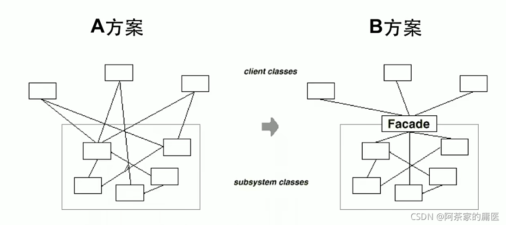
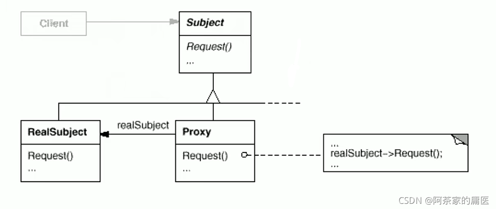
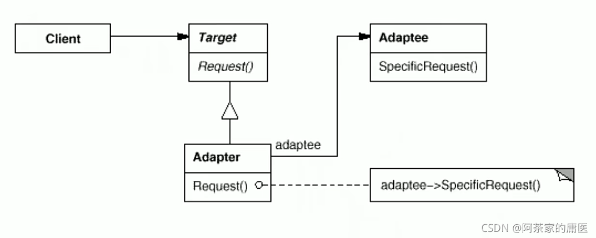

# 一些设计模式

## 设计原则

1. 依赖倒置原则
	- 高层模块（稳定）不应该依赖于底层模块（不稳定），而这应该都依赖于抽象（稳定）
	- 抽象（稳定）不应该依赖于实现细节（变化），实现细节应该依赖于抽象（稳定）
2. 开放封闭原则
	- 对扩展开放，对更改封闭
	- 类模块应该是可扩展的，但是不可修改的
3. 单一职责原则
	- 一个类应该仅有一个引起他变化的原因
	- 变化的方向隐含着类的责任
4. Liskov替换原则
	- 子类必须能够替换他们的基类
	- 继承表达类型抽象
5. 接口隔离原则
	- 不应该强迫客户程序依赖他们不用的方法
	- 接口应该小而完备
6. 优先使用对象组合，而不是类继承
	- 类继承通常为“白箱复用”，对象组合通常为“黑箱复用”
	- 继承在某种程度上破坏了封装性，子类父类耦合度很高
	- 对象组合只要求被组合的独享具有良好定义的接口，耦合度低
7. 封装变化点
	- 使用封装来创建对象之间的分界曾，让设计者可以在分界一侧进行修改，不会对另一侧产生不良的印象，从而实现层次间的松耦合
8. 针对接口编程，而不是针对实现变成
	- 客户程序无需获知对象的具体类型，只需要知道对象所具有的接口
	- 减少系统中各个部分的依赖关系，从而实现高内聚低耦合的类型设计方案

## 模式分类

- 目的
	1. 创建型模式：将对象的部分创建工作延迟到子类或者其他对象，从而应对需求变化为对象创建时具体类型实现引来的冲击
	2. 结构型模式：通过类继承或者对象组合获得更灵活的结构，从而应对需求变化为对象的结构带来的冲击
	3. 行为型模式：通过类继承或者对象组合来划分类与对象间的职责，从而应对需求变化为多个交互的对象带来的冲击

- 从范围来看：
	1. 类模式处理类与子类的静态关系
	2. 对象模式处理对象间的动态关系

## 模式

### Template-method 模式
非常基础设计模式，在面向对象系统中有着大量的应用。它用最简洁的机制（虚函数的多态性）
为很多应用程序框架提供了灵活的扩展点，是代码复用方面的基本实现结构

**“不要调用我，让我来调用你”**的反向控制结构是Template Method的典型应用

在具体实现方面，被Template Method调用的虚方法可以具有实现，也可以没有任何实现（抽象方法、纯虚方法），但一般推荐将它们设置为protected方法

```cpp
int Application::run()
{
    PVRFrameEnableControlWindow(false);
    UINT TARGET_RESOLUTION = 1; // 1 millisecond target resolution
    TIMECAPS tc;
    UINT wTimerRes = 0;
    if (TIMERR_NOERROR == timeGetDevCaps(&tc, sizeof(TIMECAPS)))
    {
        wTimerRes = std::min(std::max(tc.wPeriodMin, TARGET_RESOLUTION), tc.wPeriodMax);
        timeBeginPeriod(wTimerRes);
    }

    LARGE_INTEGER nLast;
    LARGE_INTEGER nNow;

    QueryPerformanceCounter(&nLast);

    initGLContextAttrs();

    if (!applicationDidFinishLaunching())
    {
        return 1;
    }

    auto director = Director::getInstance();
    auto glview = director->getOpenGLView();

    glview->retain();

    LONGLONG interval = 0LL;
    LONG waitMS = 0L;

    LARGE_INTEGER freq;
    QueryPerformanceFrequency(&freq);

    while(!glview->windowShouldClose())
    {
        QueryPerformanceCounter(&nNow);
        interval = nNow.QuadPart - nLast.QuadPart;
        if (interval >= _animationInterval.QuadPart)
        {
            nLast.QuadPart = nNow.QuadPart;
            director->mainLoop();
            glview->pollEvents();
        }
        else
        {
            waitMS = (_animationInterval.QuadPart - interval) * 1000LL / freq.QuadPart - 1L;
            if (waitMS > 1L)
                Sleep(waitMS);
        }
    }
    
    if (glview->isOpenGLReady())
    {
        director->end();
        director->mainLoop();
        director = nullptr;
    }
    glview->release();
    if (wTimerRes != 0)
    {
        timeEndPeriod(wTimerRes);
    }
    return 0;
}

#include "main.h"
#include "AppDelegate.h"

USING_NS_CC;

int WINAPI _tWinMain(HINSTANCE hInstance,
					   HINSTANCE hPrevInstance,
                       LPTSTR    lpCmdLine,
                       int       nCmdShow)
{
    UNREFERENCED_PARAMETER(hPrevInstance);
    UNREFERENCED_PARAMETER(lpCmdLine);

    // create the application instance
    AppDelegate app;
    return Application::getInstance()->run();
}
```

> 这里为cocos2dx的main.cpp源码，这里AppDelegate很明显是cocos2dx框架提供的对象，我们要做的只是修改run执行的对象，对run不需要更改

对该模式进行分析：`run()`方法是较为稳定的方法，开发者需要修改的只是`run()`中的`director->mainLoop()`  
作为模板的框架提供相对静止的`run()`，作为开发者为框架提供比较动态的`mainloop()`，再有框架来调用即可  
将框架内部实现细节对开发者隐藏，让开发者仅对自己需要注意的部分花费心思  

### 策略模式

在软件构建中，某些对象使用的算法可能多种多样，经常改变，如果将这些算法都编码到对象中，将会使对象变得异常复杂；而且有时候支持不适用的算法也是一种性能负担

```cpp
/**
 * 常规写法
 */

enum CalculateType
{
    Tpye_1,
    Tpye_1,
    Tpye_1,
};

class CalculateClass
{
    CalculateType _type;

  public:
    void calculateFunc() 
    {
        switch (_type)
        {
        case CalculateType::Tpye_1:
            // 算法1
            break;
        case CalculateType::Tpye_2:
            // 算法2
            break;
        case CalculateType::Tpye_3:
            // 算法3
            break;

        default:
            break;
        }
    }
}

```

> 该方法虽然能够针对不同类型做不同处理，但是不符合开闭原则：对扩展开放对修改关闭，这里如果添加新的类型只能修改源码才能继续运行

```cpp
/**
 * 策略模式 
 */

class CalculateCls
{
  public:
    virtual int Calculate() = 0;
    virtual ~CalculateCls() {}
};

class CalculateType_1 : public CalculateCls
{
  public:
    virtual int Calculate() override
    {
        // 算法1
    }
};
class CalculateType_2 : public CalculateCls
{
  public:
    virtual int Calculate() override
    {
        // 算法2
    }
};
class CalculateType_3 : public CalculateCls
{
  public:
    virtual int Calculate() override
    {
        // 算法3
    }
};

class CalculateClass
{
  private:
    CalculateCls *_cal;

  public:
    void setCalculateCls(CalculateCls *cls)
    {
        this->_cal = cls;
    }
    // 使用策略模式之后，calculateFunc方法无需根据类型修改，类型增加删除也不会影响该方法，需要修改只是设置的CalculateCls对象
    void calculateFunc() 
    {
        cls.Calculate();
    }
}
```

> 警惕if~else和 switch的使用，有些情况使用策略模式来替换是更好的选择

1. 策略模式及其子类为组件提供了一系列可重用的算法，从而可以使得类型在运行时方便地根据需要在各个算法之间切换
2. 策略模式提供了用条件判断语句以外的另一种选择，消除条件判断语句，就是在解耦合
3. 如果策略对象没有实例变化，那么各个上下文可以共享同一个策略对象，从而节省对象开销

### 观察者模式

需要为某些对象建立一种**“通知依赖关系”**——一个对象的状态发生改变，所有的依赖对象都将得到通知。如果这样的依赖关系过于紧密，将使软件不能很好的抵御变化

```cpp

/**
 * 常规写法 
 */
class ReadFile
{
  private:
    PrograssBar *_progreess;

  public:
    ReadFile(const std::string &filename)
    {
        // ....
    }
    void setProgress(ProgressBar *progress)
    {
        this->_progreess = progress;
    }
    void read()
    {
        bool readFinish = false;
        while (readFinish)
        {
            // ... 读取处理
            _progreess->updateProgress();
        }
    }
};

```

> 该写法不符合依赖倒置原则，这里依赖的具体的实现细节，如果后面不想用progress(进度条)而是想要文本框，岂不是又需要修改代码吗

```cpp
/**
 * 观察者模式
 */
class Observer // 基类
{
  public:
    virtual void update(int val) = 0;
    virtual void ~Observer() {}
};

class PrograssBar : public Forum, public Observer{
	// .... 进度条处理
	// Forum是普通的显示基类
	virtual void update(int val) override{
		// 更新进度条操作
	}
};
class Text: public Forum, public Observer{
	// .... 文本处理
	// Forum是普通的显示基类
	virtual void update(int val) override{
		// 更新文本内容
	}
};
class ReadFile 
{
  private:
    Observer *_observer ;

  public:
    ReadFile(const std::string &filename)
    {
        // ....
    }
    void setProgress(Observer *progress)
    {
        this->_progreess = progress;
    }
    void read()
    {
        bool readFinish = false;
        while (readFinish)
        {
            // ... 读取处理
            _progreess->update();
        }
    }
};
```

1. 使用面向对象的抽象，观察者模式使得我们可以**独立**改变目标与观察者，从而使二者之间的依赖关系松耦合
2. 目标发送通知时，无需指定观察者，通知会自动传播
3. 观察者自己决定是否需要订阅通知，目标对象对此一无所知
4. 观察者模式是基于时间的UI框架中非常常用的设计模式，也是MVC模式的重要组成部分

### 装饰模式

某些情况下过度地使用继承来扩展对象的功能，由于继承为类型引入的静态特质，使得这种扩展方式缺乏灵活性；并且伴随着子类的增多（扩展功能的增多），各种子类的组合（扩展功能的组合）会导致更多子类的碰撞

```cpp
/**
 * 常规写法 
 */
 // 接口
 class MyStream{
 	virtual char Read(int number) = 0;
 	virtual void Seek(int pos) = 0;
 	virtual void Write(char data) = 0;

	virtual void ~MyStream() {};
 };
// 文件流
class FileStream : public MyStream{
public:
	virtual char Read(int number){
	}
	virtual void Seek(int pos){
	}
	virtual void Write(char data){
	}
	virtual FileStream (){}
};
// 网络流
class NetworkStream : public MyStream{
	// ....
};
// 加密文件流
class CryptoFileStream : public FileStream{
public:
	virtual char Read(int number){
		// 加密操作
		FileStream::Read(number);
		// 加密操作
	}
	virtual void Seek(int pos){
		// 加密操作
		FileStream::Seek(pos);
		// 加密操作
	}
	virtual void Write(char data){
		// 加密操作
		FileStream::Write(data);
		// 加密操作
	}
};
// 网络流加密
class CryptoNetworkStream : public NetworkStream {
	// ...
};
// 文件流缓冲
class BufferedFileStream : public FileStream{
	// ...
};
// 网络流流缓冲
class BufferedNetworkStream : public NetworkStream{
	// ...
};
```

> `CryptoNetworkStream `和`CryptoFileStream `的加密操作几乎相同，`BufferedFileStream `和`BufferedNetworkStream`缓存操作几乎相同，除了内部调用`read`、`write`和`Seek`调用的基类函数不同，可见这里存在明显的代码冗余

```cpp
/**
 * 装饰模式
 */
 // 接口
 class MyStream{
 	virtual char Read(int number) = 0;
 	virtual void Seek(int pos) = 0;
 	virtual void Write(char data) = 0;

	virtual void ~MyStream() {};
 };
// 文件流
class FileStream : public MyStream{
public:
	virtual char Read(int number){
	}
	virtual void Seek(int pos){
	}
	virtual void Write(char data){
	}
	virtual FileStream (){}
};
// 网络流
class NetworkStream : public MyStream{
	// ....
};
// 加密流
class CryptoStream : public MyStream{
	MyStream* stream;
public:
	CryptoStream (MyStream* str) : stream(str) {}
	virtual char Read(int number){
		// 加密操作
		stream->Read(number);
		// 加密操作
	}
	virtual void Seek(int pos){
		// 加密操作
		stream->Seek(pos);
		// 加密操作
	}
	virtual void Write(char data){
		// 加密操作
		stream->Write(data);
		// 加密操作
	}
};
// 缓冲流
class BufferedStream : public MyStream{
	MyStream* stream;
public:
	BufferedStream(MyStream* str) : stream(str) {}
	virtual char Read(int number){
		// 缓冲操作
		stream->Read(number);
		// 缓冲操作
	}
	virtual void Seek(int pos){
		// 缓冲操作
		stream->Seek(pos);
		// 缓冲操作
	}
	virtual void Write(char data){
		// 缓冲操作
		stream->Write(data);
		// 缓冲操作
	}
};
```

1. 通过采用组合而非继承的手法，装饰模式实现了在运行时动态扩展对象功能的能力，而且可以根据需要扩展多个功能
2. 装饰模式的类在接口上表现了继承关系，又表现了组合关系
3. 装饰模式的目的并非解决“多子类衍生的多继承”问题，装饰模式应用的要点在于解决**“主体类在多个方向上的扩展功能”**

### 桥模式

```cpp
class Messager{
public:
	virtual void SendMessage() = 0;
	virtual void WriteText() = 0;
	virtual ~Messager() {}
};

// 平台实现
class PcMessagerBase : public Messager{
	virtual void SendMessage() {
	}
	virtual void WriteText() {
	}
};
// 移动
class MobileMessagerBase : public Messager{
	virtual void SendMessage() {
	}
	virtual void WriteText() {
	}
};

```

### 工厂模式

在软件系统中，经常面临创建对象的工作，有需求的变化，需要创建的对象的具体类型经常变化

```cpp
// 分割器
class Spliter{ };
class BinarySpliter : public Spliter{};	// 二进制分割器
class PictureSpliter : public Spliter{};// 图片分割器
class TxtSpliter : public Spliter{};//文本分割器

class MainForum : public Forum{
public:
	void Click(const std::string &file){
		Spliter* spliter = new BinarySpliter();	
		// ...
	}
};

```

> 这里使用的分割器依赖了具体类

```cpp
class Spliter{ };
class BinarySpliter : public Spliter{};	// 二进制分割器
class PictureSpliter : public Spliter{};// 图片分割器
class TxtSpliter : public Spliter{};//文本分割器

class SpliterFactory{
public:
	Spliter* CreateSpliter() = 0;
	virtual ~SpliterFactory(){}
};
class BinarySpliterFactory{
public:
	Spliter* CreateSpliter() {
		return new BinarySpliter();
	}
};
class PictureSpliterFactory{
public:
	Spliter* CreateSpliter() {
		return new PictureSpliter ();
	}
};
class TxtSpliterFactory{
public:
	Spliter* CreateSpliter() {
		return new TxtSpliter ();
	}
};

class MainForum : public Forum{
private:
	SpliterFactory* _spliterFactory;
public:
	void setSpliteerFactory(SpliterFactory* spliterFactory){
		_spliterFactory = spliterFactory;
	}
	void Click(const std::string &file){
		Spliter* spliter = _spliterFactory->CreateSpliter();	
		// ...
	}
};
```

> 把动态的（具体是哪个工厂也需要明确指出）部分赶出了该类的设计

定义一个用于创建对象的接口，让子类决定实例化哪一个类。工厂模式使得一个类的实例化延迟到子类

1. 工厂模式用于隔离类对象的使用者和具体类之间的耦合关系。面对一个经常变化的具体类型，紧耦合关系（new）会导致软件的脆弱
2. 工厂模式通过面向对象的手法，将所要创建的具体对象工作延迟到子类，从而实现一种扩展的策略
3. 工厂模式解决单个对象的需求变化，缺点在于要求创建方法/参数相同

### 抽象工厂模式

在软件系统中，经常面临这“一系列相互依赖的对象”的创建工作；同时，由于需求的变化，往往存在更多系列对象的创建工作

```cpp
class DBConnection {};
class DBCommand();
class DBDataReader();
class DBConnectionFactory {};
class DBCommandFactory {};
class DBDataReaderFactory {};

class SQLServerConnection:public DBConnection {};
class SQLServerCommand:public DBCommand {};
class SQLServerDataReader:public DBDataReader{};
class SQLServerConnectionFactory:public DBConnectionFactory  {};
class SQLServerCommandFactory:public DBCommandFactory  {};
class SQLServerDataReaderFactory:public DBDataReaderFactory {};


class OracleConnection : public DBConnection {};
class OracleCommand : public DBCommand{};
class OracleDataReader : public DBDataReader {};
class OracleConnectionFactory :public DBConnectionFactory  {};
class OracleCommandFactory :public DBCommandFactory  {};
class OracleDataReaderFactory :public DBDataReaderFactory {};


class MySqlConnection : public DBConnection {};
class MySqlCommand : public DBCommand{};
class MySqlDataReader : public DBDataReader{};
class MySqlConnectionFactory :public DBConnectionFactory  {};
class MySqlCommandFactory :public DBCommandFactory  {};
class MySqlDataReaderFactory :public DBDataReaderFactory {};

class Dao{
private:
	DBConnectionFactory * _connection; 
	DBCommandFactory * _command;
	DBDataReaderFactory * _dataReader;
public:
	std::vector<Student> getAllStudent(){
		
		// ...
	}
};
```

> 存在一个问题是：Connection、Command、DataReder必须是同一系列的，不同系列肯定出错

```cpp

class DBConnection {};
class DBCommand();
class DBDataReader();
class DBFactory{
	virtual DBConnection* CreaeConnection() = 0;
	virtual DBCommand* CreaeCommand() = 0;
	virtual DBDataReader* CreaeDataFactory() = 0;
};

class Dao{
private:
	DBFactory * _factory; 
public:
	std::vector<Student> getAllStudent(){
		
		// ...
	}
};
```

> **提供一个接口，让该结构负责创建一系列相关或者互相依赖的对象，无需执行他们具体的类**

### 原型模式

在软件系统中，经常面临着某些结构复杂的对象的创建工作，由于需求的变化，这些对象经常面临这剧烈的变化，但是他们却拥有比较稳定一直的接口

使用原型实例指定创建对象的种类，然后通过拷贝这些原型来创建新的对象

```cpp
/**
 * Prototype 原型模式
 * 由于不知道未来Image的子类的名称，所以Image使用一个_prototypes来记录子类的原型
 * 原型需要实现自己的Clone()函数，方便Image通过Type来管理和创建
 * 原型需要实现自己的returnType()函数，方便Image来获得Type做一些判断
 * 原型需要一个static的自己并且在默认构造函数中将自己添加到Image的管理中
 * 
 * ——————————————————————————————————————————————————————
 * 
 * 通过上面的操作，可以用Image创建出其子类，不管这个子类在当时知不知道
 * 原型模式的重点是Clone和基类的管理，子类的构造函数在protected和private是因为这些子类不准备自己创建，而是通过Image来创建
 **/

enum imageType
{
    LAST,
    SPOT
};

class Image
{
  public:
    virtual void draw() = 0;
    static Image *findAndClone(imageType type)
    {
        for (int i = 0; i < _nextSlot; i++)
        {
            if (_prototypes[i]->returnType() == type)
            {
                return _prototypes[i]->Clone();
            }
        }
    }

  protected:
    virtual imageType returnType() = 0;
    virtual Image *Clone() = 0;

    static void addPrototype(Image *image)
    {
        _prototypes[_nextSlot++] = image;
    }

  private:
    static Image *_prototypes[10];
    static int _nextSlot;
};

Image *Image::_prototypes[];
int Image::_nextSlot;

class NewImageType : public Image
{
  public:
    Image *Clone() override
    {
        return new NewImageType(1);
    }

    imageType returnType() override
    {
        return imageType::LAST;
    }

    void draw() override
    {
        std::cout << "NewImageType" << std::endl;
    }

  protected:
    NewImageType(int _dummy) // 为了跟默认构造函数做区别，所以加了个参数，因为默认构造函数是注册用的
    {
        _id = _count++;
    }

  private:
    static NewImageType _newImageType; // 创建一个static的自己，调用下面的默认构造，将自己添加到Image的管理中
    NewImageType()
    {
        addPrototype(this); // 将自己添加到Image的管理中
    }
    int _id;
    static int _count;
};

NewImageType NewImageType::_newImageType;
int NewImageType::_count = 1;
```

### 构建器

在软件系统中，有时候面临着“一个复杂对象”的创建工作，其通常由各个部分的子对象用一定的算法构成；由于需求的变化，这个复杂对象的各个部分经常面临这剧烈的变化，但是将他们组合在一起的算法却相对稳定

构建器：将一个复杂对象的构建与其表示相分离，使得同样的构建过程（稳定）可以创建不同的表示（变化）

```cpp
class House{
public:
	void init(){
		this->BuilderPart1();
		// ...其他操作
		this->BuilderPart2();
		// ...其他操作
		this->BuilderPart3();
		// ...其他操作
		this->BuilderPart4();
		// ...其他操作
	}
	virtual ~House(){}
protected:
	virtual void BuilderPart1() = 0;
	virtual void BuilderPart2() = 0;
	virtual void BuilderPart3() = 0;
	virtual void BuilderPart4() = 0;
};

class StoneHouse : public House{
	virtual void BuilderPart1() {}
	virtual void BuilderPart2() {}
	virtual void BuilderPart3() {}
	virtual void BuilderPart4() {}
};

int main()
{
	StoneHouse stoneHouse = new StoneHouse ();
	stoneHouse->init();
	return 0;
}
```

> 这个还能继续优化，将init部分拆出来等

1. 分步骤构建一个复杂的对象，分步骤是一个稳定算法，复杂对象的各个部分经常变
2. 比那花点在哪，就封装哪里。构建器主要在于应对复杂对象各个部分的频繁需求变动，缺点是难以应对分步骤构建算法的变动
3. 需要注意不同语言中构造器内部调用虚函数的区别

### 单例模式

在软件系统中，经常有一些特殊的类，必须保证他们在系统中只存在一个实例，才能确保他们的逻辑正确性以及良好的效率

```cpp
/**
 * 单例模式
 * 
 */

class Singleton
{
  private:
	Singleton();					   // 构造需要是私有 防止外部创建
	Singleton(const Singleton &other); // 拷贝构造需要是私有 防止外部创建

  public:
	static Singleton *getInstance() // 多线程下不安全，可能多次执行new操作
	{
		if (m_instance == nullptr)
		{
			m_instance = new Singleton();
		}
		return m_instance;
	}
	static Singleton *getInstance() //加锁 保证多线程安全 但是代价较高每次调用getInstance都会加锁
	{
		Lock lock;
		if (m_instance == nullptr)
		{
			m_instance = new Singleton();
		}
		return m_instance;
	}
	static Singleton *getInstance() //双检查锁，但由于内存读写reorder不安全
	{
		if (m_instance == nullptr)
		{
			Lock lock;
			if (m_instance == nullptr)
			{
				m_instance = new Singleton();
			}
		}
		return m_instance;
	}
	static Singleton *m_instance;
};

Singleton *Singleton::m_instance = nullptr;

class Single
{
  public:
	static Single &GetInstance();

  private:
	Single();
	~Single();
	Single(const Single &signal);
	const Single &operator=(const Single &signal);
};

Single &Single::GetInstance()
{
	static Single signal;
	return signal;
}
```

> 单例模式需要注意线程安全问题   
> 注意构造、拷贝构造的位置，防止外部有人主动new出对象  

### 享元模式

在软件系统采用纯粹面向对象方案的问题在于大量细粒度的对象会很快充斥再系统中，从而带来很高的运行时代价——主要指内存需求方面的代价  

运用共享技术有效地支持大量细粒度的对象   

```cpp
 
class Font
{
  private:
	std::string key; // 字体的key，通过key获得相关的资源

  public:
	Font(const string &key)
	{
	}
};

class FontFactory
{
  private:
	std::map<std::string, Font *> fontPool;

  public:
	Font *GetFontData(const std::string &key)
	{
		map<std::string, Font *>::iterator item = fontPool.find(key);
		if (item != fontPool.end())
		{
			return fontPool[key];
		}
		else
		{
			Font *font = new Font(key);
			fontPool[key] = font;
			return font;
		}
	}
}
```

1. 面向对象很好的解决了抽象性的问题，但是作为运行计算机中的实体程序，我们需要考虑对象的代价问题。享元模式主要解决面向对象的代价问题，一般触及面向对象的抽象性问题
2. 享元模式采用对象共享的的做法来降低系统中对象的个数，从而降低细粒度对象给系统带来的内存压力。在具体实现方面，要注意对象状态的处理
3. 对象数量的多少需要根据具体应用情况进行评估

### 门面模式


新增一层接口，隐藏内部模块的对象接口，同时也可以方便外部调用  

1. 从客户程序的角度来看，门面模式简化了整个组件系统的接口，对于组件内部与外部客户程序来说，达到了一种解耦的效果，内部子系统的任何变化都不会影响到门面模式接口的变化
2. 门面模式更注重从架构的层次去看整个系统，而不是单个类的层次
3. 门面模式并非一个集装箱，可以任意的放入任意多个对象。门面模式内部组件必须是互相耦合关系比较大的一系列组件

### 代理模式

在面向对象系统中，有些独享由于某些原因（比如对象创建的开销很大，或者某些操作需要安全控制，或者需要进程外的访问等），直接访问会给使用者、或者系统结构带来很多麻烦




1. 增加一层间接层，是软件系统中对许多复杂问题的一种常见解决方法
2. 具体的代理模式设计的实现方法、实现粒度差别很大，有可能对单个对象做细粒度的控制，如copy-on-write技术，有可能对组件模块提供抽象代理曾，在架构层次对对象做proxy
3. 代理模式不一定要保持接口完整的一致性，只要能实现间接控制，有时候损失一些透明性是可以接受的

### 适配器模式

在软件系统中，由于应用环境的变化，常常需要将一些显存的对象放在新的环境中应用，但是新环境要求的接口是这些现存对象所不满足的

适配器模式是将一个类的接口转换成客户希望的另一个接口。适配器模式使得原本由于接口不兼容而不能一起工作的那些类可以一起工作



### 中介者模式

在软件构建过程中，经常会出现多个对象互相关联交互的情况，对象之间常常会维持一种复杂的引用关系，如果遇到一些需求的更改，这种直接的引用关系将面临不断的变化

用一个中介对象来封装（封装变化）一系列的对象交互。中介者使各个对象不需要显式的相互引用（编译时依赖->运行时依赖），从而使其耦合松散（管理变化），而且可以独立地改变它们之间的交互  

### 状态模式

在组件构建过程中，某些对象的状态经常面临变化，如何对这些变化进行有效的管理？同时又维持高层模块的稳定？状态模式为这问题提供了解决方案

某些对象的状态改变，他的行为也随之发生变化，比如文档处于只读状态
状态模式：允许一个对象在其内部状态改变时改变它的行为，从而使对象看起来似乎修改了其行为

```cpp
enum NetworkState {
	Network_Open,
	Network_Close,
	Network_Connect,
};

class NetworkProcessor
{
	NetworkState _state;

  public:
	void Operatrion1()
	{
		switch (_state)
		{
		case NetworkState::Network_Open:
			// 一些操作
			_state = NetworkState::Close;
			break;
		case NetworkState::Network_Close:
			// 一些操作
			_state = NetworkState::Network_Connect;
			break;
		case NetworkState::Network_Connect:
			// 一些操作
			_state = NetworkState::Network_Open;
			break;

		default:
			break;
		}
	}
}

```

> 跟以前策略模式的反例一样 违反了开闭原则

```cpp

/**
 * 状态模式
 * 
 */

enum NetworkState {
	Network_Open,
	Network_Close,
	Network_Connect,
};

class NetworkStateBase
{
  public:
	virtual void Operatrion1() = 0;
	virtual ~NetworkStateBase();

	NetworkStateBase *_state;
};

class OpenState : public NetworkStateBase
{
  public:
	static OpenState *getInstance()
	{
		static OpenState state;
		return &state;
	}
	void Operatrion1()
	{
		// Open的一些操作
		this->_state = CloseState::getInstance();
	}
};
class CloseState : public NetworkStateBase
{
  public:
	static CloseState *getInstance()
	{
		static CloseState state;
		return &state;
	}
	void Operatrion1()
	{
		// Close的一些操作
		this->_state = ConnectState::getInstance();
	}
};
class ConnectState : public NetworkStateBase
{
  public:
	static ConnectState *getInstance()
	{
		static ConnectState state;
		return &state;
	}
	void Operatrion1()
	{
		// Connect的一些操作
		this->_state = OpenState::getInstance();
	}
}

class NetworkProcessor
{
  private:
	NetworkStateBase *_netstate;

  public:
	NetworkProcessor(NetworkStateBase *pState)
	{
		_netstate = pState;
	}
	void Operatrion1()
	{
		_netstate->Operatrion1();
		_netstate = _netstate->_state;
	}
}
```

> 这里每个状态一个单例模式，是因为很多情况下单例就行了，具体情况具体分析  
> 这个每个状态都单独写了一个类，保证NetworkProcessor的开闭原则  

1. 状态模式将所有于一个特定状态相关的行为都放在一个状态的子类对象中，再度向状态切换时，切换相应的对象；但同时维持状态的接口，这样实现了具体操作与状态转换之间的解耦
2. 为不同的状态引入不同的对象使得状态转换变得更加明确，而且可以保证不会出现状态不一致的情况，因为转换是原子性的——要么彻底转换过来，要么不转换
3. 如果状态对象没有实力变量，那么各个上下文可以共享同一个状态对象，从而节省对象的开销

### 备忘录