# NodeJS 的学习


## NodeJs介绍

什么是NodeJS?

官方定义是：`NodeJs Is a JavaScript Runtime Built On Chrome's v8 JavaScript Engine`  
NodeJs 是一个基于 V8 Javascript 引擎的 Javascript 运行时环境  

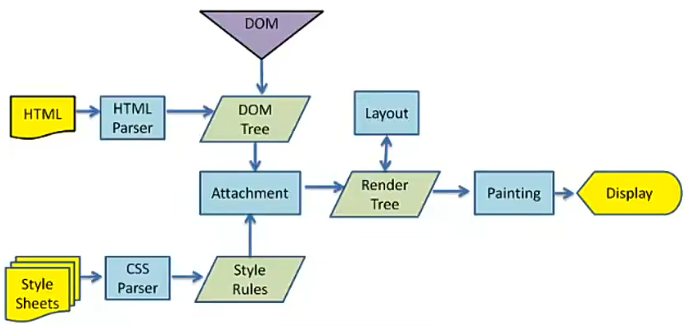

上图是一个渲染引擎的工作流程

1. 首先将 HTML 通过 HTMLParser 解析生成 Dom 树
2. 将 StyleSheets 通过 CSSParser 解析成 StyleRules
3. 将 StyleRules 附加到 Dom 树上，生成 RenderTree，也就是渲染树
4. RenderTree 和 Layout(布局) 结合之后就可以进行绘制

> 前端渲染引擎是浏览器中负责将 HTML、CSS 和 JavaScript 转换为可视化页面的核心组件

Javascript 可以操作上面的 Dom 树，所以为了执行 Javascript 代码的逻辑，需要一个解释器来解释 JavaScript 代码并将其翻译成机器语言执行

NodeJS 中运行 JavaScript 代码是通过 V8 引擎的

- V8 是用 C++ 编写的 Google 开源高性能 JavaScript 和 WebAssembly 引擎
- 它实现 ECMAScript 和 WebAssembly，并且实现Windows、MacOS和Linux的跨平台
- V8 可以独立运行，也可以嵌入到任何 C++ 应用程序中


> V8 的运行流程 

NodeJS 不仅仅只有 V8 引擎，V8 只是帮助 JS 代码执行，除此之外 NodeJS 还需要处理文件系统读/写、网络IO、加密、压缩解压缩等操作

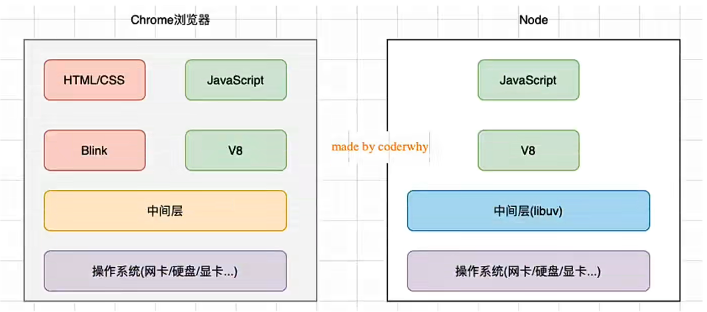

> NodeJS 和 浏览器 的差异


> NodeJS 的架构图

- 上图左上角的 APPLICATION 表示用户所写的 Javascript 代码
- 用户写的 JS 代码交给 V8 来执行
- V8 执行的代码的时候会通过 `NODE.JS BINDINGS` 也就是 NodeJS 的 API 来连接 LIBUV
- LibUV 中包括事件循环、文件系统、网络等核心模块

> LibUV 是用 C语言 编写的库

**安装 NodeJS**

安装完毕之后，可以测试使用 NodeJS 来运行 JS 代码

直接在命令行中输入 node + 要运行的JS文件即可

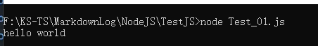

## Node的REPL

什么是REPL？

REPL 是 `Read-Event-Print Loop` 的简称，即 **读取-求值-输出的循环**
REPL 是一个简单的、交互式的编程环境

比如直接在命令行输入 python，就是进入 python 的 REPL 交互环境

node 与 python 类似，在命令行中直接输入 node，就是进入 Node 的 REPL 的交互环境

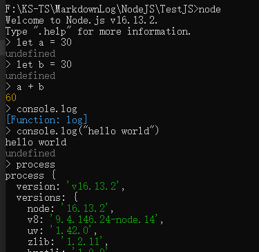

> process 翻译过来就是进程，在 node 中是一个全局变量，存储了很多有用信息

## Node 程序传递参数

按照之前所讲，Node 运行 JS 文件只需要通过 `node 文件名.js` 即可执行对应文件

那么如果想要给执行的js文件传递参数又该如何处理？

`console.log(process)` 在 node 执行的 js 文件中输出 process 的内容

然后使用 `node 文件名.js t1 t2 t3` 去执行指定的 js 文件

> 这里 t1、t2、t3 就是模拟参数输入

在 process 中可以找到 argv 属性，它的值是一个数组

```json
{
    argv: [
        'E:\\nodejs\\node.exe',
        'F:\\KS-TS\\MarkdownLog\\NodeJS\\TestJS\\Test_02.js',
        't1',
        't2',
        't3'
    ],
    execArgv: []
}
```
 
- `'E:\\nodejs\\node.exe'` 表示 node 可执行程序所在路径
- `'F:\\KS-TS\\MarkdownLog\\NodeJS\\TestJS\\Test_02.js'` 表示执行的js文件所在路径
- 剩下的就是命令行传入的参数了

那么为了输出所有的参数，使用数组的遍历即可

```javascript
process.argv.forEach((val, index) => {
    console.log(`index = ${index} value = ${val}`)
})
```

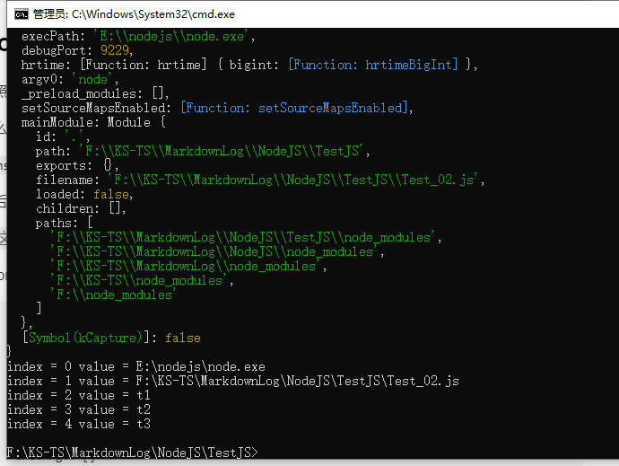

- argc：argument counter的缩写，传递参数的个数
- argv：argument vector的缩写，传入的具体参数

> vector翻译过来是矢量的意思，在程序中表示的是一种数据结构

## Node 的输出

`console.log` 最常用的输入内容的方式

`console.clear` 清除输出

`console.trace` 跟踪，输出**调用栈**

[console的一些调用API](https://nodejs.org/dist/latest-v18.x/docs/api/console.html)

遇到问题直接查找 Node 的 API 文档，更加准全

## Node 常见的全局对象

全局对象可以在程序的任何位置都可以访问到

[官方文档中说明的Global对象](https://nodejs.org/dist/latest-v18.x/docs/api/globals.html)

> 并不是所有的全局对象都会被用到

模块化相关的 `exports`、`module`、`require()` 经常用到

web服务器会用到 `URL`

有一些**特殊的全局对象**是每个模块都私有一份的，而不是整个程序通用的，比如：`__dirname`、`__filename`、`exports`、`module`、`require()`

- `__dirname`：目录名称
- `__filename`：文件名称


> 但是 __dirname 和 __filename 等特殊全局对象在 REPL 环境下是无效值


还有一些比较**常用的全局对象**

- `process`：提供了 node 的进程相关的信息
  - 比如 node 的运行环境、参数信息等
  - 还可以一些环境变量读取到 process 的 env 中
- `console`：提供了简单的调试控制台
- 定时器函数： `setTimeout`、`setInterval`、`setImmediate`
  - `setImmediate`：它的作用是将回调函数放入事件循环的检查阶段，以便在当前一轮事件循环的末尾立即执行
  - 除此之外，`process.nextTick` 也可以在下一帧执行某个操作
- `global`对象

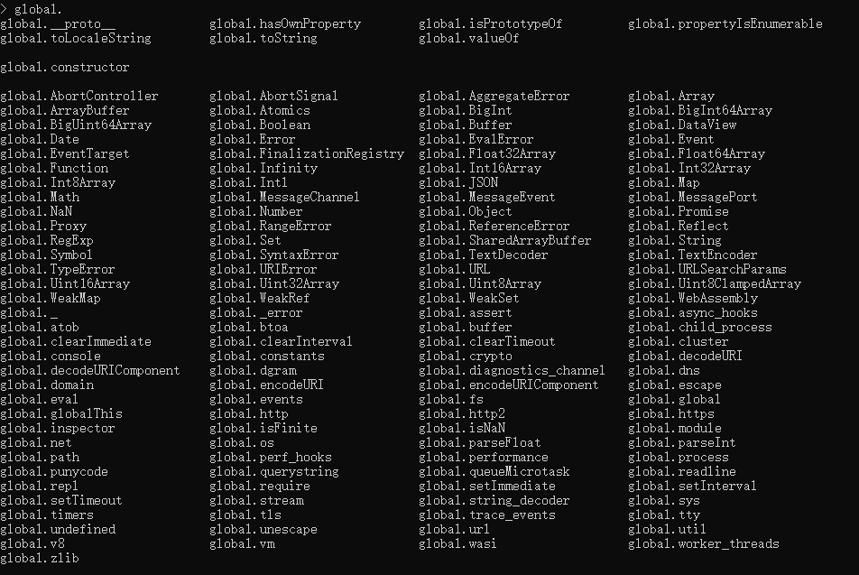

> 在 REPL 环境中，输入 `gloabl.` 然后双击 tab 即可得到 global 所有的属性

通过上面 global 的属性图可以看到，global中封装了很多常用属性，包括 `Date`、`Array`、`Set`、`Object`、`URL`、`v8` 等常用数据对象

为什么要将很多数据对象放在 `global` 中？因为方便获取，参考浏览器中的 window 对象，方便使用者调用

> global.process 就是全局对象 process `global.process === process`


参考 `node` 的源码，就是直接将 `process` 设置为 `global` 的属性

> global === globalThis，两个完全一样

## JavaScript 的模块化

基于node进行开发时，绝大多数情况都是编写 JS 代码

什么是模块化？

- 事实上模块化开发的最终目的是将程序分成**一个个小的结构**
- 不同结构编写属于**自己的逻辑代码**，并且有自己的作用域，不会影响到其他结构
- 每个结构可以将自己希望暴露的**变量**、**函数**、**对象**等导出给其他结构使用
- 每个结构可以通过某种方式，导入其他结构的**变量**、**函数**、**对象**等 

> 上面的**结构**就是**模块**；按照这种结构划分的过程，就是**模块化**开发的过程

### CommonJS

`node` 中使用的模块规范是 `CommonJS`

`CommonJS`是一个**规范**，最初提出来是在浏览器以外的地方使用，并且当时被命名为`ServerJS`，后来为了体现它的广泛性，修改为`CommonJS`，简称为`CJS`

- `Node`是`CommonJS`在服务器端一个具有代表性的实现
- `Browserify`是`CommonJS`在浏览器中的一种实现
- `webpack`打包工具具备对`CommonJS`的支持和转换

`Node`中对 `CommonJS` 进行了支持和实现，帮助可以方便的进行模块化开发
- 在`Node`中每一个 JS 文件都是一个**单独的模块**
- 单独的模块中包括 `CommonJS` 规范的核心变量：`exports`、`module.exports`、`require`，可以使用这些变量进行模块化开发

`exports` 和 `module.exports` 负责导出，但是两者是不一样的

`require`函数可以帮助导入其他模块(自定义模块、系统模块、第三方模块)

#### 测试案例1

为了证明一个JS文件就是一个模块

新建两个js文件：`bar.js` 和 `main.js`

在 `bar.js` 中定义属性和函数，在`main.js`中直接调用`bar.js`中定义的属性和函数

```js
// bar.js
const name = "bar.js"

const age = 10

let message = "my name is bar.js"

function barFunc(name) {
    console.log("hello " + name);
}
```

```js
// main.js
console.log(name)
console.log(age)
```

最后的结果就是报错，在`main.js`中并不能找到`name`属性

#### 测试案例2

将前面 `bar.js` 中定义的属性和函数导出

还记得前面提到的全局对象吗？其中有一个叫 exports 的特殊全局对象，它是每个模块都有一个的对象

exports 是一个对象，那么就可以给对象添加属性，属性就会跟着 exports 对象一起被导出

```js
// bar.js
const name = "bar.js"

const age = 10

const obj = {
    name: "bar",
    age: 10
}

let message = "my name is bar.js"

function barFunc(name) {
    console.log("hello " + name);
}

exports.name = name
exports.age = age
exports.obj = obj

setInterval(() => {
    console.log(obj.name)
    console.log(age)
}, 1000);
```

`main.js`需要导入对应的`bar.js`的`name`和`age`

```js
// 获得整个对象
const bar = require('./bar')

console.log(bar.name)
console.log(bar.age)

// 通过解构获得对象对应的属性
const {name, age} = require('./bar')

console.log(name)
console.log(age)

setTimeout(() => {
    bar.obj.name = "main"
    bar.age = 0;
}, 1500);
```

通过`require()` 会返回一个对象，这个对象就是 `bar.js` 的 `exports` 对象

参考 `bar.js` 中 `interval` 回调函数的输出，可以发现 obj 的属性被修改了(即使 obj 是 const 的)，因为 obj 是浅拷贝

但是 `bar.js` 中的 `age` 作为 `number`，是值传递，所以 `main.js` 不能对 `bar.js` 中的 `age` 产生修改

通过输出结果的变化，可以论证 `require('./bar')` 函数的返回值就是 `bar.js` 中的 `exports` 对象

> 每个模块的 `exports` 对象默认是一个空对象 `exports = {}`

所以单从 `require` 和 `exports` 来看，就是一个浅拷贝罢了

#### 测试案例3

`module.exports` 是什么？

`CommonJS`中是没有 `module.exports` 的概念的，但是为了实现模块的导出，`node`中使用的是 `Module` 的类，每一个模块都是 `Module` 的一个实例，也就是 `module` 

> `let module = new Module()`

所以在 `Node` 中真正用于导出的其实根本不是 `exports`，而是 `module.exports`，因为 `module` 才是导出的真正实现者


```js
console.log(module.exports === exports)// true
console.log(module) // 查看对象的所有属性
```


> module 对象中有个 exports 属性，exports 属性存储了所有设置的导出对象

node 的逻辑大概是将 exports 赋值给 module 的对应属性中

```js
module.exports = exports
```

本质上是 `module.exprots` 在导出，为了验证这个观点，我们对 `module.exports` 做一些操作

```js
// bar.js
const name = "bar.js"

const age = 10

exports.name = name
exports.age = age

module.exports = {}
```

```js
// main.js
const bar = require('./bar')

console.log(bar.name)   // undefined
console.log(bar.age)    // undefined
```

命名 `bar.js` 的 `exports` 对象中存在 `name` 和 `age` 属性，但是 `main.js` 获得的对象却没有 `name` 和 `age` 属性

由此可见，导出本质上是导出 `module.exports` 而不是 `exports` 对象

那么 `exports` 对象有什么存在的必要呢？

因为 `CommonJS` 的规范要求必须有一个 `exports` 对象作为导出，`nodejs` 为了满足 `CommonJS` 做出了一种妥协

#### 测试案例4

```js
// bar.js
exports = 123

```

```js
// main.js
console.log(require(`./bar`)) // 输出 {}
```

根据 main.js 的输出可以得出结论， `module.exports = exports` 赋值是在文件一开始就做了，如果赋值是在文件最后做的话 `main.js` 应该输出 `123` 才对

#### 关于 require 的细节

[官方文档中 require 的查找细节](https://nodejs.org/dist/latest-v18.x/docs/api/modules.html#all-together)

require 是一个**函数**，可以帮助引入一个文件(模块)中导入的对象

一些比较常用的规则(规则很多不全部介绍)，导入格式：`require(X)`

1. 如果 X 是一个核心模块，比如`path`、`http`、`fs`等
   - 直接返回核心模块，并停止查找（优先查找核心模块）
2. 如果 X 是以 `./` 或者 `../` 或 `/`(根目录) 开头的
   - 说明是查找文件或者文件夹
   - 如果是查找文件
     - 如果有后缀名，按照后缀名的格式查找对应的文件
     - 如果没有后缀名，按照如下顺序查找
       - 直接查找文件 X
       - 查找 X.js 文件
       - 查找 X.json 文件
       - 查找 X.node 文件
   - 如果没有找到对应文件，那么将 X 看成是目录
     - 查找目录下的 index 文件
       - 查找 X/index.js 文件
       - 查找 X/index.json 文件
       - 查找 X/index.node 文件
   - 如果都没有找到，那就报错：not found

3. 如果直接是一个 X ，不是路径也不是一个核心模块
   - 优先查找是否是核心模块
   - 然后在运行 `require` 函数的js文件同级目录的 node_modules 中查找
   - 然后在上一层级的 node_modules 文件夹中查找
   - 更上一级的 node_modules 文件夹中查找
   - 直至查找到根目录位置

假设当前运行 `require` 函数的是 `main.js` 文件，其路径是 `/User/codewhy/Desktop/Node/TestCode/04_learn_node/05_javascript-module/02_commonjs/main.js` 那么其 `require` 的查找路径如下


```js
console.log(module.path)
console.log(module.paths)
```

通过 `module.paths` 即可获得查找路径

#### 模块的加载过程

1. 模块在被第一次引入时，模块中的js代码会被运行一次

```js
// bar.js
console.log(`bar`)
```

```js
// main.js
require("./bar")

console.log("main")
```

其打印顺序是先打印 `bar` 再打印 `main` 

`CommondJS` 的加载是同步的，也就是说等到 `require` 加载的模块执行完毕之后，才会执行后续代码

`CommondJS` 的加载规则用在服务器上不会出现什么问题，因为文件都在本地，同步加载不会影响模块的执行

`CommondJS` 的加载规则如果用在浏览器中会出现大问题，必须等到 `require` 的文件下载完毕才能加载，会严重阻碍当前模块的运行

2. 模块被多次引入时，会缓存，最终只加载(运行)一次

`module` 对象有一个属性叫做 `loaded` ，值为 `false` 表示没有被加载，为 `true` 表示被加载了

```js
// bar.js
console.log(`bar`)
```

```js
// foo.js
require("./bar")

console.log(`foo`)
```

```js
// main.js
require("./bar")
require("./foo")

console.log(module.children)
console.log(module.loaded)
```

最终只会输出一个 `bar`，说明了一个模块只会被加载一次

关注一下 main.js 中的输出

- `module.children` 输出了子模块的 `module` 信息，其中就包括其 `loaded` 的值
- `module.loaded` 表示当前模块的是否被加载完毕，当前模块没有全部执行完毕，所以 `loaded` 的值是 `false`

> module.children 中存储了所有加载的子模块的 module

3. 如果存在循环引用，如何处理？

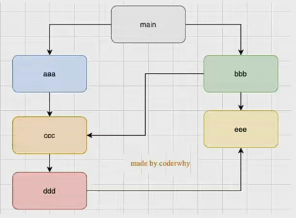

Node 采用的是深度优先算法，也就是 main => aaa => ccc => ddd => eee => bbb，按照这个顺序加载文件

```js
// main.js

console.log("main")
require("./foo")
console.log("main finish")
```

```js
// foo.js

console.log("foo")
require("./bar")
console.log("foo finish")
```

```js
// bar.js

console.log("bar")
require("./main")
console.log("bar")
```


#### 对应 node 代码

当前使用的 node 版本为 v16.13.2，不同版本目录可能不同

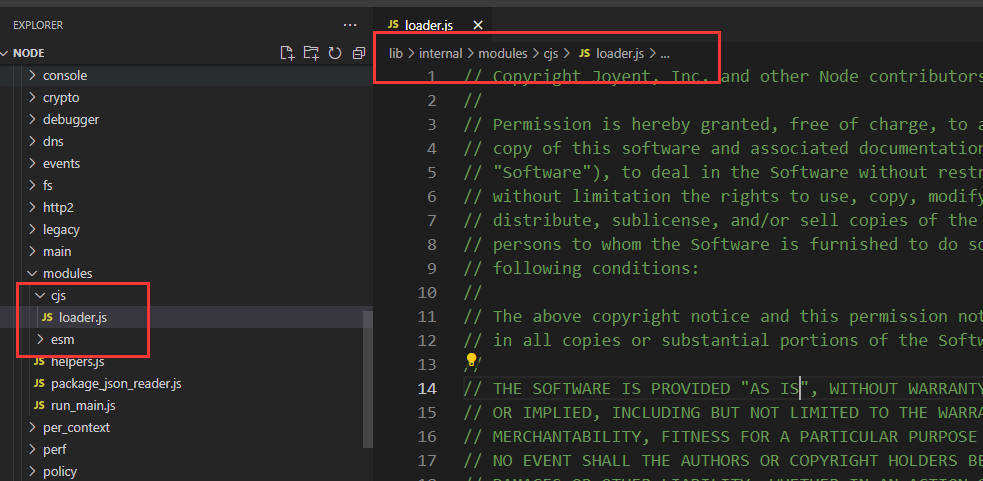

模块相关内容在 `modules` 文件夹中，其包含了两种加载规则 `cjs` 和 `esm`

```js
Module.prototype.require = function(id) {
  validateString(id, 'id');
  if (id === '') {
    throw new ERR_INVALID_ARG_VALUE('id', id,
                                    'must be a non-empty string');
  }
  requireDepth++;
  try {
    return Module._load(id, this, /* isMain */ false);
  } finally {
    requireDepth--;
  }
};
```

在 `Module` 的原型上添加了 `require` 函数，其本质就是调用了 `Module._load` 函数

```js
Module._load = function(request, parent, isMain) {
    if(parent) {
        // 如果存在父模块，说明当前模块被加载过，则直接从 Module._cache[filename] 中获取缓存的 module 对象
        return cachedModule.exports;
    }

    // ... to some thing
    return module.exports;
};
```

### ESModule

`ESModule` 使用了 `import` 和 `export` 关键字，采用编译器的**静态分**析，同时也加入了**动态引用**

`ESModule` 中 `export` 负责将模块内的内容导出，`import` 负责从其他模块导入内容

使用 `ESModule` 将自动采用严格模式 `use strick`

[什么是严格模式？](https://developer.mozilla.org/zh-CN/docs/Web/JavaScript/Reference/strict_mode)

#### named export 有名字的导出

常用的导出主要有三种

1. 在想导出的对象前面加上 export 关键字

```js
export const name = "bar";
```

2. 统一导出

```js
const name = "bar";
const sayHello = function(name) {
    console.log("hello");
}

export {
    name,
    sayHello
}
```

需要注意， `export {}` 后面的 `{}` 并不是一个Object对象，而是放置要导出的变量的引用列表

3. 导出时可以给变量起别名

```js
const name = "bar";
const sayHello = function(name) {
    console.log("hello");
}

export {
    name as FName,
    sayHello as FSayHello
}
```

常用的导入方式也有三种

1. 使用 `import` 关键字

```js
import { name, sayHello } from "./bar.js"
```

<!-- > 必须指定确定文件后缀，原生ESM不会像 CJS 去搜索文件 -->

2. 起别名

```js
import { name as FName, sayHello as FSayHello } from "./bar.js"
```

3. 通过 `* as ` 

```js
import * as bar from "./bar.js"

console.log(bar.name);
bar.sayHello();
```

> 本质来看就是将 bar.js 中导出的东西放置到 bar 对象中，作为属性进行调用

`export` 和 `import` 还可以结合使用

```js
// foo.js
export { name, sayHello } from "./bar.js"
```

通过上面的写法可以直接在在 `foo.js` 中导出 `bar.js` 中的内容，而不用先写 `import` 导入 `bar.js` 的内容， 再写 `export` 导出刚导入的 `bar.js` 的内容

上面这种写法一般用在自己开发或者封装一个功能库的时候，通常希望将暴露的所有接口放到一个文件中

比如模块中有 `mathUtil.js` 文件里面有三四个工具函数，有 `format.js` 里面有一个工具函数，希望把这些工具函数暴露给其他模块使用，但是其他模块又不知道我自己模块的内部文件名，所以一般在模块中有一个 `index.js` 专门负责导出

#### default export 默认导出

`export` 时不需要使用 `{}` 来指定名称，导入时也不需要使用 `{}`

```js
// bar.js

export default function() {
    console.log("hello world")
}
```

```js
// main.js
import format from 'bar.js'

format();
```

一个模块中，只能有一个默认导出

如上代码所示，直接导出对应函数，在 main 中也直接使用对应，因为只能有一个默认导出，所以导入的时候就知道导出的是什么

#### import 函数

通过 import 加载一个模块时不可以将其放到逻辑代码中，比如

```js
if(falg) {
    import * as bar from './bar.js';
}
else {
    import * as bar from './foo.js';
}
```

上述代码会报错，因为依赖关系是在解析的时候就确定了的，没有等到运行时。解析的时候 `flag` 值并没有确定，所以这个时候会报错

> 之前 `cjs` 的 `require` 是一个函数，是运行阶段时处理的，所以 cjs 可以通过 `if-else` 进行处理

由于 webpack 支持 ESM 和 CJS，所以在 webpack 的环境下可以直接使用 `require` 来进行条件判断式的模块导入

如果在纯 ESM 环境下运行，可以使用 `import(模块名)` 来条件判断式的加载模块

```js
if(flag) {
    import('./bar.js').then(res => {
        console.log(res.name)
    }).catch(err => {
        // 错误处理
    })
}
```

注意，此时 `import()` 是一个函数，只有函数才能在运行时执行。使用 `import()` 函数本质上返回的就是一个 `Promise` 

#### ESModule 加载过程

ESModule 加载 JS 文件的过程是编译(解析)时加载的，并且是异步的

- 编译(解析)时加载，意味着 `import` 不能和运行时相关的内容放在一起使用
  - 比如 import from 后的路径不能动态设置
  - 比如 import 不能放在 if 语句中判断执行

```js
// bar.js

let name = "bar"

setTimeout(() => {
    name = "aaa"
}, 1000);

export {
    name
}
```

```js
// main.js
import { name } from './bar.js'

setTimeout(() => {
    console.log(name)   // 输出 aaa
}, 2000)
```

如果与 CJS 一样 `bar.js` 导出的是一个对象，那么 `main.js` 应该输出 `bar`，但是这里输出的是 `aaa`，说明 ESM 导出的是**变量的引用**

根据 ESM 的解释，创建了一块内存空间，名为模块环境记录(module environment record) 用于绑定(bindings)导出数据，并且是实时绑定。这一系列操作都是在 JS引擎 解析的时候进行处理的

```js
// main.js
import { name } from './bar.js'

setTimeout(() => {
    name = "bbb"
}, 1000)
```

上面修改其他模块变量的操作，会直接报错。因为 import 的变量是 const 的，所以不能修改

但是，众所周知，JS对const对象只封装了一层，也就是说可以通过下面的操作进行值的修改

```js
// bar.js

let obj = {
  name: "bar",
  age: 18
}

setTimeout(() => {
  console.log(obj.name) // 输出 main
}, 1000)

export {
  obj
}
```

```js
// main.js

import { obj } from './bar.js'

console.log(obj.name)

obj.name = "main"
```

### CJS 和 ESM 交互

- 通常情况下 CJS 不能加载 ESM

因为 CJS 是同步加载；ESM 必须经过静态分析，此时并没有运行JS代码

但是某些平台在实现的时候可以对代码进行针对性的解析，也可能会支持；但是Node是不支持的 

- 多数情况下，ESM 可以加载 CJS

ESM 在加载 CJS 时，会将其 module.exports 导出的内容作为 default 导出方式来使用

这个依然需要看具体实现，比如webpack支持，Node 新版本支持

```js
// bar.js
const name = "bar";

module.exports = {
    name
}
```

```js
// main.mjs
import foo from './bar.js';

console.log(foo.name)
```

> 为什么是 mjs 后缀，因为如果要模块支持 ESM 需要设置 package.json 或者将 js 后缀改为 mjs

## node常见的内置模块

### Path

path 模块用于对路径和文件进行处理，提供了很多好用的方法

由于 MacOs/Linux 和 Windows 的文件层级符号不同，所以对路径直接硬编码会导致平台兼容性问题，因此推荐使用 path 模块进行路径处理，而不是手动编写 `bastPath + "\\" + filename`

[path官方文档](https://nodejs.org/dist/latest-v18.x/docs/api/path.html)

```js
const path = require('path');
// import path from 'path' // ESM 导入

const bastPath = 'Temp';
const rootPath = "/User/root/Temp"
const filename = 'test.txt'

// resolve 用于路径拼接
const fileFullPath = path.resolve(bastPath, filename)
const fileFullPath2 = path.resolve(rootPath, filename)

console.log(fileFullPath);  // 以 当前运行文件夹为相对路径
console.log(fileFullPath2); // 以 根目录 为绝对路径

// 获取路径信息
const TempFilePath = "/User/root/config.txt"
const TempFileDir = "/User/root/config"

console.log(path.dirname(TempFilePath))     // /User/root
console.log(path.dirname(TempFileDir))      // /User/root

console.log(path.basename(TempFilePath))    // 文件名 config.txt

console.log(path.extname(TempFilePath))     // 文件后缀 .txt

// join 路径拼接
const TempBasePath = '/User/root'
const TempFileName = 'acb.txt'

console.log(path.join(TempBasePath, TempFileName))

// resolve 路径拼接 对比 join resolve 会多判断判断路径字符串开头是否有 "/" "./" "../"
console.log(path.resolve(TempBasePath, TempFileName))
```

### FS

File System 简称 FS，表示文件系统

[官方文档中对 FS 的解释](https://nodejs.org/dist/latest-v18.x/docs/api/fs.html)

借助 node 封装的文件系统，可以在任何操作系统上直接操作文件

FS 的 API 非常多，这些 API 大多数提供三种操作方式

1. 同步操作文件：代码会阻塞，不会继续执行
2. 异步回调函数操作文件：代码不会被阻塞，需要传入回调函数，当获取到结果时，回调函数执行
3. 异步`Promise`操作文件：代码不会被阻塞，通过`fs.promises`调用方法操作，会返回一个`Promise`，可以通过`then`、`catch`进行处理

```js
const fs = require('fs')

const filepath = './tempfil.txt'

// 同步执行
// const info = fs.statSync(filepath)
// console.log("后续需要执行的代码")
// console.log(info);

// 异步操作
// fs.stat(filepath, (err, info) => {
//     if(err) {
//         console.log(err)
//     }
//     else {
//         console.log(info);
//     }
// })
// console.log("后续需要执行的代码")

// promise
fs.promises.stat(filepath).then((info) => {
    console.log(info);
}).catch(err => {})
console.log("后续需要执行的代码")
```

#### 文件描述符

什么是文件描述符？为什么需要文件描述符？

```js
fs.open('./tempfil.txt', (err, fd) => {
    if(err) {
        console.log(err);
        return;
    }
    console.log(fd);
})
```

> fd 即 文件描述符

fs 的 API 如果以 **f** 开头，那么一般都是需要传入 文件描述符 的 API

#### 写文件

`fs.writeFile(file, data[, options], callback)` API 除了文件路径、文本信息外还有一个 options 的选项参数

options 包括 `encoding`、`mode`、`flag` 和 `signla`

[flags的选项及其含义](https://nodejs.org/dist/latest-v18.x/docs/api/fs.html#file-system-flags)

| flag | 含义 |
| --- | --- |
| w | 打开文件写入，默认值 |
| w+ | 打开文件进行读写，如果不存在创建文件 |
| r+ | 打开文件进行读写，如果不存在抛出异常 |
| r | 打开文件读取，读取时的默认值 |
| a | 打开要写入的文件，将流放在文件末尾。如果不存在则创建文件 |
| a+ | 打开文件进行读写，将流放在文件末尾。如果不存在则创建文件 |

```js
const fs = require('fs')

const filepath = './tempfil.txt'

const fileContent = 'file content ....'

// 回调写入文件
fs.writeFile(filepath, fileContent, {flag : "a"}, (err) => {
    console.log(err)
});
```

至于默认编码 `encoding` 使用的是 `utf-8`

#### 读文件

那么如何读取文件呢？肯定是 `readFile` 相关接口了

```js
fs.readFile(filepath, (err, data) => {
    if(err) {
        console.log(err)
    }
    else {
        console.log(data)   // 输出 buffer 十六进制
    }
})
```

以 `fs.readFile` 为例，直接输入 data 内容 其实是一个 buffer 对象，是文件的 **十六进制** 内容

为了输出的是十六进制内容，而不是具体文字内容呢？是因为没有指定字符串，fs并不知道应该如何解析

```js
fs.readFile(filepath, {encoding: 'utf-8'}, (err, data) => {
    if(err) {
        console.log(err)
    }
    else {
        console.log(data)   // 输出 buffer 十六进制
    }
})
```

如果输出乱码，那么就是文本的读取编码设置错误

#### 文件夹相关操作

创建文件夹： `fs.mkdir` 

一般创建文件夹是会先判断文件夹是否存在 `fs.existsSync` ，如果文件不存在那么需要创建文件夹，如果文件不存在就不需要创建

读取文件夹下所有的文件： `fs.readdir`

文件夹重命名：`fs.rename`

> 很少会做重命名的事情，一般都是新建文件或者文件夹

### Events

[官方文档中对Events的介绍](https://nodejs.org/dist/latest-v18.x/docs/api/events.html)

Node 中的核心 API 都是基于异步事件驱动的，在这个体系中，某些对象(发射器`Emitters`) 发出某一个事件；其他部分可以监听这个事件(监听器`Listeners`)，并且可以传入回调函数，这个回调函数会在监听到这个事件时调用

发出事件和监听事件都是通过 `EventEmitter` 类来完成的，它们都属于 `events` 对象

- `emitter.on(eventName, listener)`： 监听事件，也可以使用 addListener
- `emitter.off(eventName, listener)`： 移除事件监听，也可以使用 removeListener
- `emitter.emit(eventName[, ...args])`：发出事件，也可以携带一些参数

```js
const EventEmitter = require('events')

// 创建发射器
const emitter = new EventEmitter();

// 监听事件： on 和 addListener 作用一样
emitter.on('click', (args) => {
    console.log(`listener1 clicked, args => ${args}`);
})

const listener2 = (arg1, arg2, arg3) => {
    console.log(`listener2 clicked, args =>`, arg1, arg2, arg3);
};

const listener3 = (args) => {
    console.log(`listener3 clicked, args => ${args}`);
};

emitter.on('click', listener2)

emitter.once('click', listener3)    // 只监听一次

// 发送事件
emitter.emit(`click`, 1, 2, 3, 4, 5);

// 取消事件监听
emitter.off(`click`, listener2);

// 发送事件
emitter.emit(`click`, 1, 2, 3, 4, 5);
```

> 为什么要新建 listener2 变量，是因为要知道取消哪个回调

`events` 还提供很多事件信息获取接口

```js
// 获取注册的事件
console.log(emitter.eventNames()); // 获得所有事件的名称

console.log(emitter.listenerCount(`click`));    // 获取事件绑定的回调个数

console.log(emitter.listeners('click'));    // 获取所有回调函数对象
```

`events` 还有一些其他接口

- `emitter.prependListener` 将当前监听回调放到最前面执行
- `emitter.prependOnceListener` 将当前监听回调放到最前面执行一次
- `emitter.removeAllListeners()` 移除所有的监听器，参数可以填入事件的string，移除指定事件

还有很多 API 就需要看文档了，其他 API 用的不多

## 包管理工具

如何想要把自己开发的工具分享给其他程序员使用？

首先想到的就是上传到 Github 并且提供说明文档

存在一些小问题：
- 需要手动管理相关依赖
- 需要手动下载
- 版本升级时需要重复上面的操作

所以我们需要一个工具，可以直接让我们把自己的库发到工具的仓库中，并且对所有人开放下载、升级、删除接口

`npm`(`node package manager`)就是这样一种工具，它也可以管理 `express`、`koa`、`react`、`react-dom`、`axios`、`babel`、`webpack` 等

npm管理的包可以在哪里查看、搜索？ [npm包的官网](https://www.npmjs.com/)

### 项目配置文件

每个项目都会有一个对应的配置文件，这个配置文件记录项目的名称、版本号、项目描述、对其他库的依赖信息等

这个配置文件在 node 环境下就是 `package.json`

通过 `npm init` 即可创建一个 `package.json` 并设置一些参数；通过 `npm init -y` 所有信息使用默认的

| 属性名 | 含义 |
| --- | --- |
| name | 项目名称(必填) |
| version | 当前版本号(必填) |
| description | 描述信息 |
| author | 作者相关信息(发布时用到) |
| licnese | 开源协议(发布时用到) |
| private | 表示当前项目是否是私有的，如果为true，则npm不能发布它，这是为了防止私有项目或者模块被发布出去 |
| main | 设置程序的入口 |
| script | 配置一些脚本命令，以键值对的形式存在。比如 `"start" : "node index.js"` 表示通过 `start` 去执行 `node index.js` 命令来启动 `index.js` 文件  |
| dependencies | 无论开发环境还是生成环境都需要依赖的包 |
| devDependencies | 一些包在生成环境是不需要的，开发项目时需要，比如 webpack、label 等。会通过 `npm install webpack --save-dev` 将其安装到 `devDependencies` 属性中 |
| engines | 指定 node 和 npm 的版本号，安装的过程中先检查对应的引擎版本，如果不符合就会报错；也可以指定所在的操作系统 `"os" : [""darwin", "linux"]` |
| browserslist | 用于配置打包后的 JavaScript 浏览器的兼容情况，决定是否需要手动添加一些 `polyfills`(补丁) |


在 `dependencies` 属性中会写明依赖模块的名称和它的版本，其版本号有 `^2.0.3` 或者 `~2.0.3`，那么或者 `^` 和 `~` 分别表示什么呢？

npm 的包通常需要遵从 semver 版本规范： [semver规范](https://semver.org/lang/zh-CN/)

根据 semver 版本规范，`2.0.3` 对应的就是： **主版本号.次版本号.修订号**

版本号递增规则如下：
- 主版本号：当你做了不兼容的 API 修改 （可能不兼容之前的版本）
- 次版本号：当你做了向下兼容的功能性新增（新功能增加，但是兼容之前的版本）
- 修订号：当你做了向下兼容的问题修正（没有新功能，修复了之前版本的bug）

至于 `^` 和 `~` 的区别

- `^x.y.z`: 表示 x 保持不变的，y 和 z 永远安装最新版本
- `~x.y.z`: 表示 x 和 y 保持不变的，z 永远安装最新版本

### npm install 命令

- 全局安装: `npm install <package> -g`
- 项目(局部)安装: `npm install <package>`

通常使用 npm 全局安装的包都是一些**工具包**: yarn、webpack等

但是一些库文件比如 axios、express、koa 等即使全局安装了之后，也并不能让我们在所有项目中使用 axios 等库

还记得前面所讲的 `require` 导入库的顺序吗？它会去一级一级查找 `node_modules` 文件中的库，全局安装时库所在的路径可能并不再它`require`的查找路径中，从而会导致报错

```bash
# 安装开发和生产依赖
npm install axios
npm i anxios

# 开发依赖
npm install webpack --save-dev
npm install webpack -D
npm i webpack -D

# 根据 package.json 中的依赖包进行安装
npm install
```

在执行了 `npm install` 之后到底进行了哪些操作？
为什么会有一个 `package-lock.json`文件？它的作用是什么？
npm5开始，npm支持缓存策略，那么缓存有什么作用？

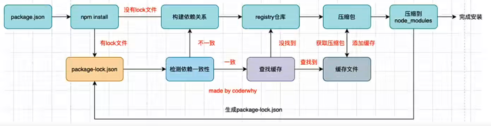

> npm install 的原理图

第一次启动项目，执行 `npm install` 命令
 
- 先判断当前是否存在 `package-lock.json`文件，由于是第一次启动项目，所以没有`package-lock.json`文件
- 通过 `package.json` 文件构建依赖关系
- 通过 `registry` 仓库下载对应模块的压缩包(下载仓库可配置，就是设置npm镜像)
- npm5 之后会将下载的压缩包缓存起来，方便其他项目使用
- 将下载的压缩包解压到当前项目的 `node_modules` 文件夹中
- 生成 `package-lock.json` 文件

第二次启动项目，执行 `npm install`命令

- 存在 `package-lock.json` 文件
- 检查依赖一致性
  - `package.json`可以记录`^2.0.3` 这种动态版本，但是`package-lock.json`记录的是明确的版本，也就是`2.0.3`
  - 此时会检查当前`package-lock.json`中记录的版本是否符合 `package.json` 中配置的版本规则，如果不符合就重新构建依赖关系
- 如果存在缓存，则查找缓存，无需重新下载
- 找到缓存文件对应的压缩包，解压到 `node_modules` 文件夹中

```json
{
  "name": "test-npm",
  "version": "1.0.0",
  "description": "",
  "main": "index.js",
  "scripts": {
    "test": "echo \"Error: no test specified\" && exit 1"
  },
  "author": "",
  "license": "ISC",
  "dependencies" : {
    "axios": "^0.20.0"
  }
}
```

通过上面的 `package.json` 会生成下面的 `package-lock.json`

> 我删除了 `package-lock.json` 中的 `package` 部分，内容太多 

```json
{
  "name": "test-npm",
  "version": "1.0.0",
  "lockfileVersion": 2,
  "requires": true,
  "dependencies": {
    "axios": {
      "version": "0.20.0",
      "resolved": "https://registry.npmmirror.com/axios/-/axios-0.20.0.tgz",
      "integrity": "sha512-ANA4rr2BDcmmAQLOKft2fufrtuvlqR+cXNNinUmvfeSNCOF98PZL+7M/v1zIdGo7OLjEA9J2gXJL+j4zGsl0bA==",
      "requires": {
        "follow-redirects": "^1.10.0"
      }
    },
    "follow-redirects": {
      "version": "1.15.2",
      "resolved": "https://registry.npmmirror.com/follow-redirects/-/follow-redirects-1.15.2.tgz",
      "integrity": "sha512-VQLG33o04KaQ8uYi2tVNbdrWp1QWxNNea+nmIB4EVM28v0hmP17z7aG1+wAkNzVq4KeXTq3221ye5qTJP91JwA=="
    }
  }
}
```

`package-lock.json` 中

| 属性 | 作用 |
| --- | --- |
| lockfileVersion | 表示 lock 文件的版本 |
| requires | 表示后面的模块通过 require 来管理子依赖 |

然后 `dependencies` 就是具体依赖的包

`axios` 的版本 `version` 是 `0.20.0` 是真实版本；`resolved` 表示压缩包下载路径； `requires` 表示依赖其他的库，这里依赖 `follow-redirects` 

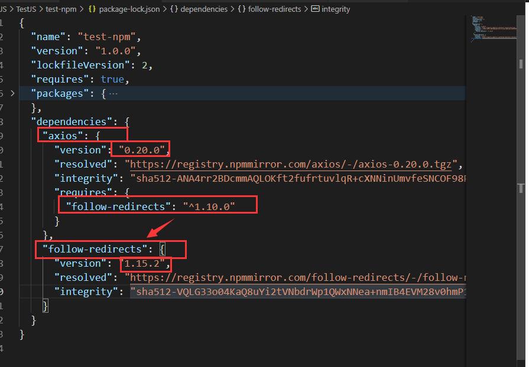

通过 `npm config get cache` 可以看到当前配置的缓存路径

### npm 的其他命令

删除某个依赖包

```bash
npm uninstall <package>
npm uninstall <package> --save-dev
npm uninstall <package> -D
```

强制重新build

```bash
npm rebuild
```

清除缓存

```bash
npm cache clean
```

> 可能是缓存包被破坏了，不能正常使用了，这个时候就需要 clean 掉

[npm的命令](https://docs.npmjs.com/cli/v10/commands)

### yarn 工具

一个 node 包管理工具 yarn

yarn 是由 Facebook、Google、exponent 和 Tilde 联合推出了新的 JS 包管理工具

yarn 是为了弥补 npm 的一些缺陷而出现的。早期 npm 存在很多缺陷，比如安装依赖速度慢、版本依赖混乱等问题。虽然 npm5 版本开始有很多的改进和升级，但是仍然有很多人喜欢使用 yarn

```
npm install yarn -g
```

通过上面的命令就可以安装 yarn 工具了

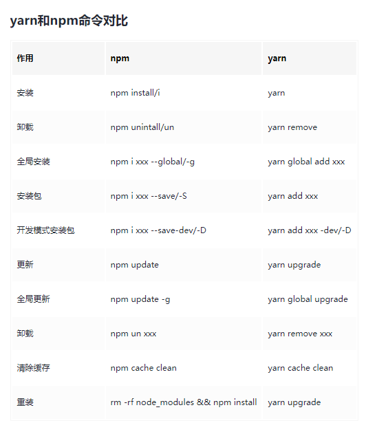

## 实现自己的脚手架

项目在 `TestJs/Custom_CLI` 文件夹中

具有 自动拉去项目模板、安装项目依赖、打开浏览器`http://localhost:8080`、启动启动项目 功能

### 命令行直接运行自己的项目

首先在 `package.json` 文件中定义项目的入口文件 `"main": "index.js"`

然后 index.js 文件头需要写一些内容

```js
#!/usr/bin/env node

console.log("hello custom-cli")
```

`#!` 称之为 `shebang` 或者 `hashbang`, 后面跟着的是配置的环境 路径 和 命令来启动该文件

那么按照上面的写法 `#!/usr/bin/env node` 就是找到对应路径下的`node`来启动该文件

然后就是注册运行的指令

```json
"main": "index.js",
"bin": {
  "custom-cli": "index.js"
},
```

最后在项目文件夹下启动命令行，使用 `npm link` 来连接项目

```bash
F:\TestJS\test-npm>npm link

added 1 package in 564ms
```

然后就可以使用在 `bin` 中配置的命令来启动 `index.js` 文件了

### 命令参数解析

直接使用三方库，这里使用的是 `commander` 库

[Commander项目库](https://github.com/tj/commander.js)

对应的安装命令 `npm install commander`

`commander` 的使用大致如下，先导入、再配置、最后解析参数

```js
// 导入库
const program = require("commander")

// program.version(`1.0.0`)    // 直接设置版本号
program.version(require('./package.json').version)  // 从 package.json 中获取 version 信息

program.option('-s, --separator <char>', "测试参数设置");

// 最后解析传入参数
program.parse(process.argv)

const opts = program.opts()

console.log(opts.separator)
```

> 还记得 `process.argv` 是什么吗？ `process` 是常用的全局变量之一前面有介绍过

通过 `option` 可以获得设置的参数, `'-s, --separator <char>'` 表示设置 `-s` 和 `--separator` 命令，其作用是设置后续的参数到 `option` 中。通过 `option` 设置的命令表示运行时是可选的，但是 `<char>` 表示后续必须跟着参数不能为空

```js
program.option('-t, --Test');

program.on('option:Test', function() {
    console.log("-s 命令触发")
});
```

还可以通过 `.on` 来自定义一些命令触发的事件

不过一般来说，对于命令行参数的设置肯定不会放置在 `index.js` 中，会单独封装到某个文件中

```js
// index.js
const program = require("commander")
const helpOptions = require('./src/core/help')

program.version(require('./package.json').version)  // 从 package.json 中获取 version 信息

// helpOptions();
helpOptions()

program.parse(process.argv)
```

```js
// src/core/help.js

const program = require('commander')

const helpOptions = () => {
    program.option('-s, --separator <char>');

    program.option('-t, --Test');

    program.on('option:Test', function() {
        console.log("-s 命令触发")
    });
}

module.exports = helpOptions
```

> 这里使用 exports 直接导出一个方法出去
> 还记得 CJS 中 exports 和 module.exports 的作用和区别吗

### 执行命令

以 `vue` 为例，下载 模板项目、重命名部分文件、安装项目依赖（`npm install`）、运行 `npm run server`

比如接下来我们要 `custom-cli create demo` 命令来创建 demo 项目

使用 `program.command` 来创建命令，使用 `description` 设置命令描述，使用 `action` 来设置命令回调

`action` 绑定回调函数就是命令输入的参数

```js
// src/core/create.js
const program = require("commander")

const createCommand = () => {
    // custom-cli create demo
    program
        .command('create <project> [others...]')
        .description(`创建一个自定义项目`)
        .action((project, others) => {
            console.log(project, others);
        })
}

module.exports = createCommand
```

以 `custom-cli create demo d f s` 为例，`action` `回调函数中project` 对应的就是 `demo`， `other` 对应的就是 `[d, f, s]`

- 拉取github上的demo项目

需要使用 `download-git-repo` 库, [库的使用文档](https://www.npmjs.com/package/download-git-repo)

`download-git-repo` 会用到的只有一个函数 `download`, 根据不同的类型需要设置不同的路径

`download` 函数参数是 下载路径、本地路径、下载结束回调函数， 由于下载结束的回调函数可能会套其他事件的回调函数，这里使用 `promisify` 将其转换成 `promise`， 然后使用 `async` 和 `await` 将异步功能用同步的写法完成

- 执行命令，可以 `npm install` 也可能是其他命令

JS 执行命令需要使用 `child_process` 库，这个是核心库，不需要 `npm install`

[Spawn执行命令行说明](https://nodejs.org/dist/latest-v18.x/docs/api/child_process.html#child_processspawncommand-args-options)

```js
const childProcess = spawn(command, args, options)
childProcess.stdout.pipe(process.stdout)
```

命令行是创建一个新的进程执行命令，所以命令的输出其实是在另一个进程中，为了将命令的输出显示到当前命令行窗口中需要将输入输出流进行绑定

windows 跑这个命令工具库可能会出现一些问题，需要特殊处理解决

### 增加选项

`inquirer` 库


### 模板代码

有些时候我们需要新建项目相关的文件，可能是组件、可能是其他的，像这种文件需要先提供模板，然后根据模板生成对应的文件

模板使用 ejs 模板库即可，根据命令编译对剑的 ejs模板，将编译的结果写入到指定文件中

[ejs语法文档](https://ejs.bootcss.com/)

可以先将目标文件赋值一遍，将其中需要动态设置的部分替换成ejs的代码

`ejs.renderFile` 需要传入模板文件的绝对路径，第二个是传入 `ejs` 文件所需的数据，第三个是 `Option`，最后一个是渲染的回调函数

```js
const ejs = require('ejs')
const path = require('path')

const compile = (template, data) => {
    const templatePosition = `../template/${template}`
    const templatePath = path.resolve(__dirname, templatePosition)
    // console.log(templatePath)
    return new Promise((resolve, reject) => {
        ejs.renderFile(templatePath, {data}, {}, (err, result) => {
            if(err) {
                reject(err);
                return;
            }

            resolve(result);
        })
    })
}
```

> `result` 就是编译之后 js 文件的内容


[Buffer的官方文档S](https://nodejs.org/dist/latest-v18.x/docs/api/buffer.html)

在 node 中想要操作图片、音频、视频、文本等文件，需要将其转换成**二进制**数据才能进行后续操作

比如某一个保存文本的文件并不是使用 utf-8 进行编码的，而使用 GBK，需要读取到它的二进制数据，再通过GKB转换成对应的文字

比如需要读取一张图片数据，再通过某些手段对图片数据进行二次处理， node 中有一个 sharp 的库，就是读取图片或者传入图片的 buffer 再对其进行处理

比如 node 中通过 tcp 建立长链接， tcp 传输的是字节流， 需要将数据转换成自己再进行传入，并且需要治澳传输字节的大小（客户端需要根据大小来判断读取多少内容）

对前端来说很少会与二进制打交道，但是对服务端来说为了很多功能必须与二进制打交道， node 为了可以方便开发者完成更多功能提供了一个类 Buffer，并且是全局的

Buffer 中存储的是二进制数据，可以将 Buffer 看成是一个存储二进制的数组，这个数组的中的每一项可以保存 **8位** 二进制

```js
const msg = "hello world";

// 1. 直接new，过时的方法，会有警告
const buffer = new Buffer(msg);
console.log(buffer) // 输出对应字符串的十六进制

// 其他创建方法
// Buffer.alloc()、Buffer.allocUnsafe()、Buffer.from()
// const buffer1 = Buffer.from(msg)
const buffer1 = Buffer.from(msg, , 'utf8')
console.log(buffer)
```

除了 `from` , `Buffer` 还可以通过 `alloc` 分配内存的方式来创建

```js
const buffer = Buffer.alloc(8); // 申请了8字节的Buffer

console.log(buffer);  // 00 00 00 00 00 00 00 00

buffer[0] = 88;
buffer[1] = 0x11;

console.log(buffer);  // 58 11 00 00 00 00 00 00
```

## 事件循环和异步IO

什么是事件循环？事实上，可以把事件循环理解成我们编写的 JavaScript 和浏览器或者Node之间的一个桥梁

- 浏览器的事件循环是一个我们编写的JavaScript代码和浏览器API调用(setTimeout/Ajax/监听事件等)的一个桥梁，桥梁之间通过回调函数进行沟通

- Node的事件循环是一个我们编写的JavaScript代码和系统调用(file system、newworld等)之间的一个桥梁，桥梁之间通过回调函数进行沟通

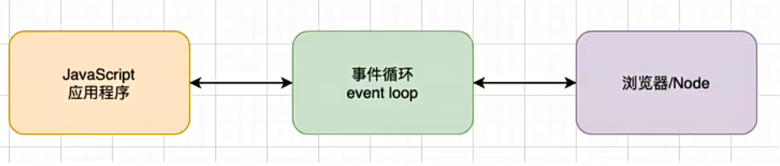

JavaScript 是单线程的，但是 JavaScript 的线程应该有自己的容器进程：浏览器或者 node

目前多数浏览器其实是多进程的，当打开一个新的tab页面时就会开启一个新的进程，这是为了防止一个页面卡死而造成所有页面无法响应，整个浏览器需要强制退出。每个页面进程又包括很多线程，其中就有执行 JavaScript 的线程

JavaScript 代码的执行是在一个单独的线程中，所以 JavaScript 在同一个时刻只能做一件事情，如果这个事情非常耗时，就意味着当前的线程被阻塞

```js
const name = "name"
console.log(name)

function sum(s1, s2) {
  return s1 + s2;
}

function bar() {
  return sum(1, 2)
}

setTimeout(() => {}, 1000);

const resule = bar()
console.log(resule)
```

上述代码的执行流程如下

1. 定义变量 name
2. 执行 log 函数，压入调用栈
3. log 函数执行完毕，退出调用栈
4. 调用 setTimeout 函数，压入调用栈
5. setTimeout 函数执行完毕，退出调用栈
6. 调用 bar 函数，压入调用栈
7. 执行 sum 函数，压入调用栈
8. sum 函数执行完毕，退出调用栈
9. bar 函数执行完毕，退出调用栈
10. 执行 log 函数，压入调用栈
11. log 函数执行完毕，退出调用栈

当执行 setTimeout 函数时，该函数会被压入调用栈，但是会立刻执行结束，不会影响后续代码的执行

通过 setTimeout 传入的回调函数存储起来，并且在时间到达的时候将其放到事件队列中，而事件循环发现事件队列中存在值，就会将其取出放入函数调用栈中执行

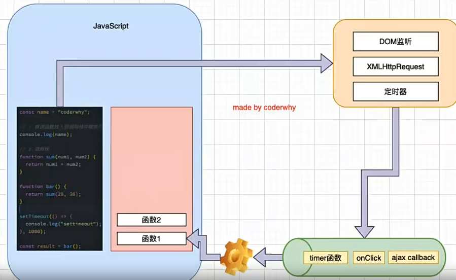

### 微任务 宏任务

前面事件队列中的回调函数可以理解为是一个个的任务，这些任务被称为 `macrotask` 宏任务，宏任务会被添加到宏任务队列中

除了宏任务外，还有微任务(`microtask`)，最常见的微任务是 `Promise().then()`。微任务也有一个微任务队列

所以事件队列并不是只有一个，而是有两个。不同的任务添加到不同的队列中

- 宏任务队列：ajax、setTimeout、setInterval、Dom监听、UI Rendering 等
- 微任务队列：Promise的then回调、Mutation Observer API、queueMicrotask() 等

> queueMicrotask 可以自己定义微任务

当微任务队列和宏任务队列中都存在任务时

1. 优先执行微任务队列中的任务，然后再执行宏任务队列
2. 当微任务队列执行完毕之后，执行**一个**宏任务队列的任务
3. 当**一个**宏任务执行完毕后，再次检测微任务队列中是否存在任务

### 案例1

```js
setTimeout(function() {
  console.log("set1");
  new Promise(function(resolve) {
    resolve()
  }).then(function() {
    new Promise(function (resolve) {
      resolve()
    }).then(function() {
      console.log("then4")
    })
    console.log("then2")
  })
})

new Promise(function(resolve) {
  console.log("pr1")
  resolve();
}).then(function() {
  console.log("then1")
})

setTimeout(function() {
  console.log("set2")
})

console.log(2)

queueMicrotask(() => {
  console.log("queueMicrotask1")
})

new Promise(function(resolve) {
  resolve();
}).then(function() {
  console.log("then3")
})
```

根据所学知识，判断上述代码的输出顺序

首先先从上到下执行整个js文件

第一段代码，将回调函数添加到**宏任务**队列中

```js
setTimeout(function() {
  console.log("set1");
  new Promise(function(resolve) {
    resolve()
  }).then(function() {
    new Promise(function (resolve) {
      resolve()
    }).then(function() {
      console.log("then4")
    })
    console.log("then2")
  })
})
```

第二段代码，对于 Promise 来说，会直接执行回调函数，然后将 then 的回调函数添加到**微任务**队列中

所以这里会输出 `pr1`

```js
new Promise(function(resolve) {
  console.log("pr1")
  resolve();
}).then(function() {
  console.log("then1")
})
```

第三段代码，将回调函数添加到**宏任务**队列中

```js
setTimeout(function() {
  console.log("set2")
})
```

第四段代码，直接输出 `2`

```js
console.log(2)
```

第五段代码，新建一个**微任务**，添加到微任务列表中

```js
queueMicrotask(() => {
  console.log("queueMicrotask1")
})
```

第五段代码，新建一个 Promise，并将 then 中的回调函数作为微任务添加到微任务列表中

```js
new Promise(function(resolve) {
  resolve();
}).then(function() {
  console.log("then3")
})
```

现在整个 JS 文件执行完毕，此时微任务队列和宏任务队列中都存在任务，优先执行微任务队列中的任务

也就是输出 `then1` 、 `queueMicrotask1` 、 `then3`

此时微任务队列空，开始执行宏任务

此时执行第一段代码中的回调函数，根据执行顺序，会先输出 `set1`，然后将 then 中的回调函数添加到**微任务**队列中

```js
console.log("set1");
new Promise(function(resolve) {
  resolve()
}).then(function() {
  new Promise(function (resolve) {
    resolve()
  }).then(function() {
    console.log("then4")
  })
  console.log("then2")
})
```

此时微任务队列不为空，所以开始执行微任务队列中的任务，输出 `then2`， 然后将新 Promise 的 then 回调函数作为**微任务**添加到微任务列表中

```js
new Promise(function (resolve) {
  resolve()
}).then(function() {
  console.log("then4")
})
console.log("then2")
```

此时微任务队列不为空，所以开始执行微任务队列中的任务，输出 `then4`

此时微任务队列为空，开始执行宏任务队列，输出 `set2`

此时微任务队列和宏任务队列均为空，程序执行结束

```
pr1
2
then1
queueMicrotask1
then3
set1
then2
then4
set2
```

### 案例2

async、await 是 Promise 的一个语法糖，可以将 await 关键字后面执行的代码，看作是包裹在 `(resolve, reject) => {函数执行}` 中的代码， await 后面的代码可以看作是 `then(res => {函数执行})` 中的代码

也就是说

```js
async function async2() {
  console.log(`async2`)
}
async function async1() {
  console.log(`async1 start`)
  await async2();
  console.log(`async1 end`)
}
```

对于 async1 函数来说就是 await 部分的代码可以理解为

```js
new Promise((resolve, reject) => {
  async2();
  resolve()
}).then((res) => {
  console.log(`async1 end`)
})
```

----

后面是面试题，请输出正确的输出顺序

```js
async function async1() {
  console.log(`async1 start`)
  await async2();
  console.log(`async1 end`)
}

async function async2() {
  console.log(`async2`)
}

console.log(`script start`)

setTimeout(function() {
  console.log(`setTimeout`)
})

async1()

new Promise(function(resolve) {
  console.log(`promise1`)
  resolve();
}).then(function() {
  console.log(`promise2`)
})

console.log(`script end`)
```

输出结果

```
script start
async1 start
async2
promise1
script end
async1 end
promise2
setTimeout
```

前面解释的是**浏览器**的事件循环，浏览器中的事件循环是根据 `HTML5` 定义的规范来实现的，不同的浏览器可能由不同的实现

**Node** 中是由 `libuv` 实现的，`libuv` 中主要维护了一个 `EventLoop` 和 `worker threads`(线程池)

`EventLoop` 负责调用系统的一些其他操作：文件IO、Newwork、`child-process`等


对应 `libuv` 的源码存放在 `node` 项目的 `deps` 文件夹内， `deps` 就是 `depends`(依赖)的简称，在 `deps` 文件夹下有很多依赖的库，比如：`npm`、`openssl`、`base64`、`v8`等，`libuv` 相关源码就存在 `uv` 文件夹中

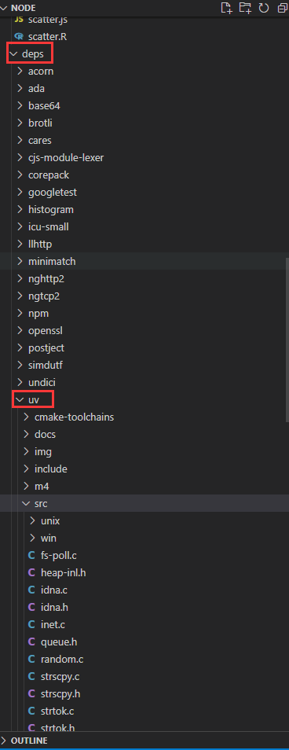

### 异步IO
 
当我们对一个文件进行操作的时候，我们需要打开这个文件：通过**文件描述符**，但是 JavaScript 可以直接对一个文件进行操作吗？事实上任务程序中的文件操作都是需要进行**系统调用**(操作系统的文件系统、IO系统)

其实 `JavaScript` 操作就是将 `JavaScript` 通过 `v8` 进行翻译执行，通过 `libuv` 调用系统命令，才能操作具体文件

操作系统通常提供两种调用方式：**阻塞式调用**和**非阻塞式调用**

- 阻塞式调用：调用结果返回之前，当前线程处于阻塞态(阻塞态CPU不会分配时间片)，调用线程只有在得到调用结果之后才会继续执行
- 非阻塞式调用：调用结束后，当前线程不会停止执行，只需要过一段事件来检查一下有没有结果返回即可

一般来说开发中很多**耗时操作**都可以基于**非阻塞式调用**

- 比如网络请求本身使用了scoket通信，而socket本身提供了select模型，可以进行非阻塞方式工作
- 比如文件读写的IO操作，可以使用操作系统提供的基于事件的回调机制

非阻塞IO也会存在一些问题，当函数执行完毕之后我们并没有获取到需要的数据，为了知道文件是否读取完毕，我们需要频繁的询问，这个过程就是**轮询操作**

轮询操作肯定不能在主线程中处理，因为轮询会影响到主线程执行代码的效率，尤其是多文件读写、网络IO、数据库IO、自进程调用的时候轮询更加耗时

所以 `libuv` 提供了 **线程池**，线程池负责所有相关的操作，并且会通过轮询或者其他方式等待结果，当获取结果时，就可以将对应的回调放到事件循环中。事件循环就可以负责接关后续的回调工作，告知 JavaScript 应用程序执行对应的回调函数

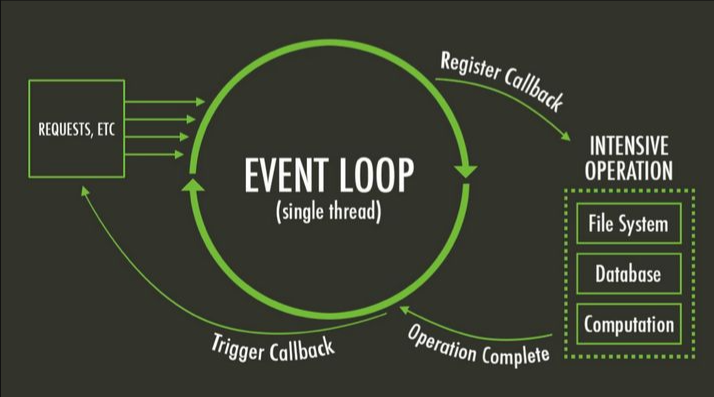

### Node 的事件循环

node 的事件循环与浏览器的事件循环有些许**差别**， node 中会做的事情比浏览器更多，所以 node 的事件循环更加复杂

事件循环是一个桥梁，连接着应用程序的JavaScript和系统调用之间的通道

无论时文件IO、数据库、网络IO、定时器、子进程，在完成对应的操作后，都会将对应的结果和回调函数放到事件循环中。然后事件循环会不断的从任务队列中取出对应的事件(任务)来执行

在 node 中一次完整的事件循环 Tick 分成很多个阶段

- 定时器 (Timers)：本阶段执行已经被 `setTimeout` 和 `setInterval` 的调度回调函数
- 待定回调 (Pending Callback)：对某些系统操作(如 TCP 错误类型)执行回调，比如 TCP 连接时接收到 ECONNREFUSED
- idle、prepare：仅系统内部使用
- 轮询 (Poll)：检索新的 IO 事件；执行与 IO 相关的回调
- 检测：`setImmediate` 回调函数在此执行
- 关闭的回到函数：一些关闭的回调函数，如：`socket.on('close', ...)`

[官方文档对事件循环的解释](https://nodejs.org/zh-cn/docs/guides/event-loop-timers-and-nexttick)

Node 的事件循环更加复杂，也分为微任务和宏任务

- 宏任务：setTimeout、setInterval、IO事件、setImmediate、Close事件
- 微任务：Promise的then回调、process.nextTick、queueMicrotask

> Promise的then回调 和 queueMicrotask 会添加到相同的微任务队列中
> process.nextTick 会单独添加到一个单独的微任务队列中

当然宏任务也有很多个宏任务的队列

在一次 tick 中，执行顺序如下

1. `tick microtask queue` 简称 ticks 队列
2. 其他的微任务队列
3. `setTimeout` 等 `timer` 队列
4. IO 队列 (占用大部分时间)
5. `setImmediate` 队列
6. `close` 队列

```js
async function async1() {
  console.log(`async1 start`)
  await async2()
  console.log(`async1 end`)
}

async function async2() {
  console.log(`async2`)
}

console.log(`script start`)

setTimeout(function () {
  console.log(`setTimeout 0`)
}, 0)

setTimeout(function() {
  console.log(`setTimeout 2`)
}, 300)

setImmediate(() => { console.log(`setImmediate`) })

process.nextTick(() => { console.log(`nextTick1`) })

async1()

process.nextTick(() => { console.log(`nextTick2`) })

new Promise(function (resolve) {
  console.log(`promise 1`)
  resolve()
  console.log(`promise 2`)
}).then(function() {
  console.log(`promise 3`)
})

console.log(`script end`)
```

根据上面的代码和前面说明的 node 执行策略，可以得到如下的输出

```js
script start
async1 start
async2
promise 1
promise 2
script end
nextTick1
nextTick2
async1 end
promise 3
setTimeout 0
setImmediate
setTimeout 2
```

`setImmediate` 和 `setTimeout` 理论执行顺序是 `setTimeout` 先执行，但是并不能确定每次执行都是 `setTimeout` 先执行

```js
setTimeout(function () {
console.log(`setTimeout`)
}, 0)

setImmediate(() => { console.log(`setImmediate`) })
```

多次执行上述代码，会发现两个回调的执行顺序并不是每次都一样

`setTimeout` 会将定时任务先添加到一个**时间管理器**中，然后由时间管理器判断是否可以执行，再将其添加到宏任务列表

初始化时间管理器，并将任务添加到事件列表中，假设这个流程花费 **10ms**；与此同时，`node` 也会初始化事件循环，假设初始化事件循环需要 **20ms**。那么事件管理器开始运行的时候 `setTimeout` 的队列中存在任务，就会正常执行

如果 初始化时间管理器用时**20ms**, 但是`node` 的初始化事件循环用了 **5ms**，那么此时 `setTimeout` 的队列中还没有任务，因为此时时间管理器的初始化流程还没有结束，所以不会执行第一个 `setTimeout，而是去执行` `setImmediate`

上面 `setImmediate` 和 `setTimeout` 的执行乱序只会在初始化的时候出现

## Stream

流，什么是流?

程序中的流和流水类似，不过流动的是数据，文件的二进制(字节)数据会源源不断的被读取到程序中

流 是对连续字节的一种表现形式和抽象概念。流应该是可以读和可写的

直接读写文件的方式虽然简单，但是无法控制一些细节的操作，比如从什么位置开始读、读到什么位置、一次性读取多少字节等，同时如果文件非常大(视频文件等)那么一次性读入也是不合适的。所以用流的方式，一次读取一点，读取一部分处理一部分，就方便一些

node 中的很多对象都是基于流实现的

- http模块的Request 和 Response 对象
- process.stdout 对象

所有的流都是 EventEmitter 的实例，从源码上看

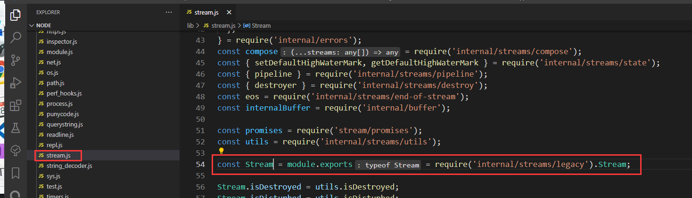

可见 `Stream` 是从 `lib/internal/streams/legacy` 中导出的，查看该文件可得

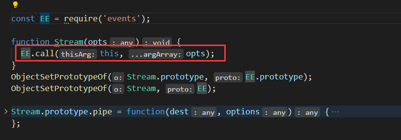

| | |
| --- | --- |
| ObjectSetPrototypeOf(Stream.prototype, EE.prototype) | 将 Steam 原型上的方法映射到 EventEmitter 的原型方法中 |
| ObjectSetPrototypeOf(Stream, EE) | 将 Stream 上的属性映射到 EventEmitter 上 |

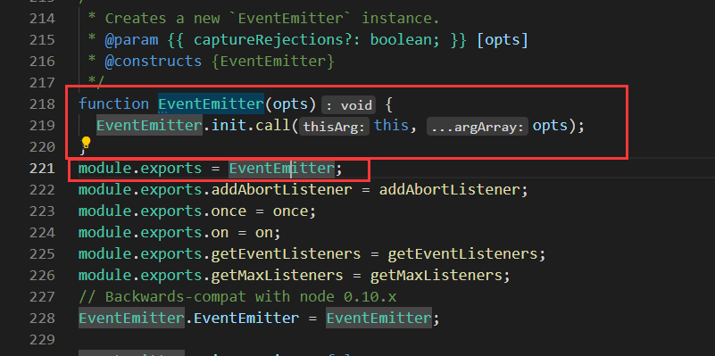

可见 `Stream` 都是 `EventEmitter` 的实例

Node.js中由四种基本流类型

- `Writable` ： 可以向其写入数据的流，例如：`fs.createWriteStream()`
- `Readble` ： 可以从中读取数据的类，例如：`fs.createReadStream()`
- `Duplex` ： 同时为 `Readable` 和 `Writable`，例如：`net.Socket()`
- `Transofrm` ： `Duplex` 可以在写入和读取数据时修改或者转换数据的流，例如：`zlib.createDefalte()`

实际使用中，以 `fs.createWriteStream()` 为例

官方解释： https://nodejs.org/dist/latest-v18.x/docs/api/fs.html#filehandlecreatereadstreamoptions

| Option 参数 | 数据类型 | 作用 
| --- | --- | --- |
| start | integer | 开始位置 |
| end | integer | Default: Infinity 结束位置，默认无限 |
| highWaterMark | integer | Default: 64 * 1024 每次读多少 默认64kb |

使用 `fs.createWriteStream()` 会返回一个 `ReadStream` 对象，该对象读取数据不是通过回调函数，而是通过事件监听 (因为 `Stream` 本身是 `EventEmitter` 的实例)

使用 `on` 监听具体字符串事件即可

```js
on(event: 'close', listener: () => void): this;
on(event: 'data', listener: (chunk: Buffer | string) => void): this;
on(event: 'end', listener: () => void): this;
on(event: 'error', listener: (err: Error) => void): this;
on(event: 'open', listener: (fd: number) => void): this;
on(event: 'pause', listener: () => void): this;
on(event: 'readable', listener: () => void): this;
on(event: 'ready', listener: () => void): this;
on(event: 'resume', listener: () => void): this;
```

通过读取流从文件中读取数据

```js
const fs = require(`fs`)

// 传统读取
// fs.readFile('./tempfile.txt', {encoding: "utf8"}, (err, data) => {

// })

// 通过流读取

const reader = fs.createReadStream(`./tempfile.txt`, {
    start: 3,               // 从第三个字节开始读取
    end: 6,                 // 读到第六个字节
    highWaterMark: 2,       // 每次读取2个字节
    encoding: `utf8`        // 通过 utf8 字节
})

reader.on(`data`, (data) => {
    console.log(data)

    reader.pause()      // 暂停读取
    setTimeout(() => {
        reader.resume()
    }, 100)         // 0.1 s之后恢复读取
})

reader.on(`close`, () => {
    console.log(`file closed`)
})

reader.on(`open`, () => {
    console.log(`file opened`)
})
```

通过上面 `data` 事件，可以设置每次读取的操作，比如上述代码就是每次读取都暂停 `0.1s` 之后，再继续向后读取

通过写入流向文件中写入数据

```js
const fs = require(`fs`)

// 普通写文件操作
// fs.writeFile(`./tempfile.txt`, "asdfrgs", {falg:`a`}, (err) => {
// })

//  Stream 写入
const writer = fs.createWriteStream(`./tempfile.txt`, {
    flags : "r+",
    start : 4,
    encoding : "utf8"
})

writer.write('你好啊', (err) => {
    if(err) {
        console.log(err)
        return;
    }
    console.log(`写入成功`)
})

writer.write('你好啊', (err) => {
    if(err) {
        console.log(err)
        return;
    }
    console.log(`写入成功`)
})

writer.on(`close`, () => {
    console.log(`file closed`)
})

// 需要手动关闭文件
// writer.close();
writer.end("最后的内容")
```

这里 `writer.end` 和 `writer.close` 都会将文件流关闭，并且**文件流必须关闭**，也就是说必须手动调用一次 `end` 或者 `close`

`writer.end` 会向文件中写入最后的内容，并且调用一次 `close`，随意指定 `end` 也会关闭文件
