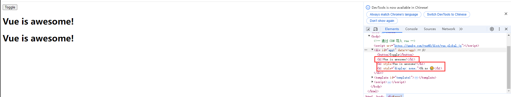
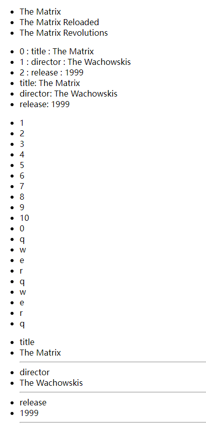
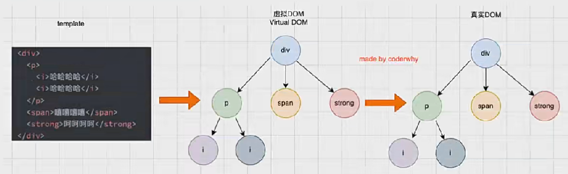

# Vue.js

## 简单使用

> 介绍、例子

`Vue` 的本质就是一个 `Javascript` 的库

使用方式

1. 页面中通过 `CDN` 导入
2. 下载 `Vue` 的 `JS` 文件
3. 通过 `npm` 包管理工具安装
4. 直接通过 `Vue CLI` 工具生成项目


以当前官网推荐的 `CDN` 地址为例,从源码上看可以发现 `VueJS` 定义了一个全局变量 `Vue`,很多功能都是直接通过这个全局对象进行操控的

以直接通过 `CDN` 导入为例

```html
<!DOCTYPE html>
<html lang="en">
<head>
    <meta charset="UTF-8">
    <meta name="viewport" content="width=device-width, initial-scale=1.0">
    <title>My Web Page</title>

    
</head>
<body>
    <h1>Hello, world!</h1>
    <div id="app"> </div>
    <!-- 通过 CDN 导入 vue -->
    <script src="https://unpkg.com/vue@3/dist/vue.global.js"></script>
    <script>
        const app = Vue.createApp({
            template: `<h2>{{ message }}</h2>`,

            data() {
                return {
                    message: 'Hello, Vue!'
                }
            }
        });
        app.mount('#app');  // 将 App 对象挂载到 id 为 app 的元素上
    </script>
</body>
</html>
```

通过 `Vue.createApp` 创建了一个 `Vue` 对象,再通过 `id` 将对象绑定到 `<div id="app">` 中

> `mount` 就是挂载


```html
<script>
Vue.createApp({
    template: `
        <h2> value = {{ counter }}</h2>
        <button @click='increment'>+1</button>
        <button @click='decrement'>-1</button>
    `,
    // 定义属性，data 是个函数
    data: function() {
        return {
            counter: 100
        }
    },
    // 定义方法
    methods: {
        increment() {
            this.counter++;
        },
        decrement() {
            this.counter--;
        }
    }
}).mount("#app1");
</script>
```

使用响应式，Vue 中使用 `{{  }}` 可以获取 `data` 返回的对象中的属性，在 `methods` 中可以通过 `this` 获取 `data` 返回对象的**代理**

对比原生的 JS 和 Vue 的开发来说

- 原生 JS 更像命令式编程，即先获取对象，再修改参数，最后设置回去
- Vue 更像是声明式编程，即提前声明数据、方法，然后将数据和方法绑定到 `template` 中，将显示与数据进行分离

通常将 Vue 看作是 MVVM(Module-Vie-MoudleView) 框架。虽然官方说法是 Vue 并没有完全遵守 MVVM 模型，但整体设计受 MVVM 的启发


如上图所示

- 通常将 `Dom` 或者 `Vue` 对象中的 `template` 认为是 `View`(视图)
  - 因为 `Vue` 的 `template` 会先生成 `vdom` 再渲染为真实 `Dom`
- 通常将整个 Javascript 对象看作是 Module
  - 一般 `Vue` 对象的 `template` 会分离出去，保留 `data` 和 `methods`，这一块被认为是 `Module`
- `Vue` 帮助将 `Module` 和 `View` 进行绑定，比如 `View` 直接通过 `{{message}}` 就可以显示 `Module` 的 `data` 的 `message` 属性
  - 按上图，`Vue` 进行了 `Data Bindings` 进行数据绑定，将 Model 的数据绑定到 View 上
  - 按上图，`Vue` 进行了 `Dom Listeners` 进行了事件监听

### template、data、methods

通过前面的例子，已经可以知道 `Vue.createApp` 传入对象的 `template` 属性的作用了，Vue 通过 `template` 属性进行一个效果显示

`template` 属性就表示 `Vue` 需要帮助渲染的模板信息。其中会写很多 Html 标签，这些标签会替换掉关在到的元素的 innerHTML

`template` 中有一些起卦的语法，比如 `{{}}`、`@click`，这些都是 `template` 特有的语法

> 也就说如果原本挂载标签中有内容，Vue 挂载之后会先把原内容清空

不过这个 `template` 的写法略显麻烦，并且 IDE 无法提供提示

因此 Vue 提供了两种来解决这个问题

1. 使用 script 标签，并且标记类型为 x-template
2. 使用任意标签(通常使用 template，因为不会被渲染)，设置 id

> template 元素是一种用于保存客户端内容的机制，该内容在加载页面时不会被呈现，但随后在运行时使用 JS 实例化

```html
<script type="x-template" id="template1">
        <h2>{{ message }}</h2>
</script>
<div id="app2"></div>
<script>
    Vue.createApp({
        // 通过 template1 查找 id 为 template1 的标签并将内容设置到 template 中
        template: '#template1',
        data() {
            return {
                message: 'Hello, Vue!'
            }
        }
    }).mount('#app2');
</script>
```

```html
<div id="app3"></div>
<template id="template2">
    <h2>{{ message }}</h2>
</template>
<script>
    Vue.createApp({
        template: '#template2',
        data() {
            return {
                message: 'Hello, Vue! template2'
            }
        }
    }).mount('#app3');
</script>
```

> [template标签](https://developer.mozilla.org/zh-CN/docs/Web/HTML/Element/template)
> 其实不仅可以用 template，还可以使用其他任何标签，主要是 template 不会被渲染。因为本质来说都是使用 `document.querySelector` 来查找对象

------------------------

通过前面的例子，可以知道传入 `Vue.createApp` 的对象的 `data` 属性的作用，该属性在 Vue3 中必须是一个函数，否则**报错**

data 中返回的对象会被 Vue 的响应式系统劫持，只会对该对象的修改或者访问都会在劫持中被处理

这就是为什么 `{{message}}` 可以显示 `message` 的数据，以及为什么修改 `message` 的值其显示内容也会改变

------------------------

通过前面的例子，可以知道传入 `Vue.createApp` 的对象的 `methods` 属性用于定义系列功能函数，这些方法可以绑定到 `template` 模板中，同时这些方法可以通过 `this` 关键字来直接访问到 `data` 中返回的对象的属性

-----------------------

除了前面几个属性之外，还有可以定义很多其他的属性，比如：`props`、`computed`、`watch`、`emits`、`setup` 和 **声明周期函数**等

### 源码查看

[Github仓库](https://github.com/vuejs/core)

在 `dev` 中开启 `sourcemap` 源码映射，然后示例项目进行测试即可

### methods 中禁止使用箭头函数

```html
<div id="app3"></div>
<template id="template2">
    <h2>{{ message }}</h2>
    <button @click="btnClick">测试</button>
</template>
<script>
    Vue.createApp({
        template: '#template2',
        data() {
            return {
                message: 'Hello, Vue! template2'
            }
        },
        methods: {
            btnClick: () => {
                console.log(this);
                console.log(this.message);
            }
        }
    }).mount('#app3');
</script>
```

首先 `methods` 中定义的函数通常要通过 `this` 来访问 `data` 的属性，如果 `methods` 里面定义箭头函数，函数中使用的 `this` 其实是 `Window` 对象，也就是浏览器窗口对象

在 `Window` 对象中肯定是没有名为 `message` 的属性的，所以使用 `this.message` 会直接报错

在箭头函数中是不绑定 `this` 的

```html
<script>
    const foo = function() {
        console.log(this);  
    }
    foo();  // 输出 Window
    const obj = {bar: foo};
    obj.bar();  // 输出 obj 对象
</script>
```

普通函数执行时都会进行 `this` 的绑定，也就是说 `foo()` 其实是 `Window.foo()` 进行了隐式绑定

```html
<script>
    const foo = () => {
        console.log(this);  
    }
    foo();  // 输出 Window
    const obj = {bar: foo};
    obj.bar();  // 输出 Window

    const foo1 = foo.bind(obj);
    foo1();
</script>
```

箭头函数不会绑定 `this`，所以此时无论是 `foo()` 还是 `obj.bar()` 输出的都是 `Window`
为什么都是都是 `Window` 是因为箭头函数中的 this 并没有进行任何绑定，所以找不到 `this` 对象，于是就会像上层作用域查找 `this` 对象，最后找到 `Window` 对象

```html
<script>
    const obj = {
        {
            template: '#template2',
            data() {
                return {
                    message: 'Hello, Vue! template2'
                }
            },
            methods: {
                btnClick: () => {
                    console.log(this);
                    console.log(this.message);
                }
            }
        }
    }
    Vue.createApp(obj).mount('#app3');
</script>
```

这里 `btnClick` 的上层作用域并不是 `methods`，`methods` 只是在定义对象，`obj` 也只是定义对象，所以 `btnClick` 上层作用域其实是 `<script>` 最终找的的是 `Window`

[this的绑定规则](https://mp.weixin.qq.com/s?__biz=Mzg5MDAzNzkwNA==&mid=2247483847&idx=1&sn=fe8089ded81098b35461d3c14bb85cde)

以源码 `componentOptions.ts` 中代码示例

```ts
if (methods) {
    for (const key in methods) {
        const methodHandler = (methods as MethodOptions)[key]
        if (isFunction(methodHandler)) {
            // In dev mode, we use the `createRenderContext` function to define
            // methods to the proxy target, and those are read-only but
            // reconfigurable, so it needs to be redefined here
            if (__DEV__) {
                Object.defineProperty(ctx, key, {
                value: methodHandler.bind(publicThis),
                configurable: true,
                enumerable: true,
                writable: true,
                })
            } else {
                ctx[key] = methodHandler.bind(publicThis)
            }
            if (__DEV__) {
                checkDuplicateProperties!(OptionTypes.METHODS, key)
            }
        } else if (__DEV__) {
            warn(
                `Method "${key}" has type "${typeof methodHandler}" in the component definition. ` +
                `Did you reference the function correctly?`,
            )
        }
    }
}
```

> `const publicThis = instance.proxy`

通过上述代码，可以看到其实就是将 `methods` 中每个函数都取出来然后通过 `bind` 绑定函数的 `this` 为 `publicThis`

关于 `bind` 的使用，当一个方法使用 `bind` 绑定对象时会返回一个新的方法，新的方法就是绑定了对象之后的方法

```js
function foo() {
    console.log(this);  
}
foo();  // 输出 Window
var obj = {bar: "foo"};

var foo1 = foo.bind(obj);
foo1();
```

### 模板语法

React 使用的 jsx，对应的代码都是编写的类似于 js 的一种语法。之后通过 Babel 将 jsx 编译成 React.CreateElement 函数调用

Vue 也支持 Jsx 的开发模式，但是大多数情况系啊，使用基于 HTML 的模板语法。在模板中，允许开发者以声明式的方式将 **DOM** 和 **底层组件实例的数据** 绑定在一起。在底层的实现中， VUe 将模板编译成虚拟 DOM 渲染函数

如果希望将数据显示到模板中，使用最多的语法是 `Mustache` 语法(双大括号)的文本插值，`Mustache` 不仅支持属性显示还支持 JS 表达式和函数调用

```html
<div id="app4"></div>
<template id="template3">
    <h2>{{ getReverseMessage() }}</h2>
    <h2>{{ message }}</h2>
    <h2>{{ `${message} ~~~~~~~~~` }}</h2>
    <h2>{{ message.split(" ") }}</h2>
    <h2>{{ message === undefined ? "true" : "false" }}</h2>
</template>
<script>
    Vue.createApp({
        template: '#template3',
        data() {
            return {
                message: 'Hello  Vue! template2'
            }
        },
        methods: {
            getReverseMessage() {
                return this.message.split(" ").reverse().join(" ");
            }
        }
    }).mount('#app4');
</script>
```

注意 `Mustache` 只支持表达式，并不支持语句，下面都是错误写法

```html
<h2> let name = "abc" </h2>     
<h2> if(message === undefined) { return "true" }  </h2>
```

> 赋值语句、条件判断语句

#### v-once 指令

`v-once` 用于指定元素或者组件只渲染一次，当数据发生变化时，元素或者组件以及其所有的子元素将视为静态内容并且跳过，该指令可以用于**性能优化**

```html
<div id="app5"></div>
<template id="template5">
    <div v-once>
        <h2>{{ count }}</h2>
        <h2>{{ message }}</h2>
    </div>
    <h2>{{ count }}</h2>
    <h2>{{ message }}</h2>
    <button @click="addCount">+1</button>
</template>
<script>
    Vue.createApp({
        template: '#template5',
        data() {
            return {
                message: 'Hello  Vue! template2',
                count: 100
            }
        },
        methods: {
            addCount() {
                this.count++;
                this.message = "update message"
            }
        }
    }).mount('#app5');
</script>
```


在 `template` 中使用 `v-once` 标记的 `tag` 只会在一开始计算、渲染，再之后不会更新渲染

`v-once` 标记的 `tag` 及其子 `tag` 都不会更新渲染，从上述代码上看就知道

#### v-text 指令

用于更新元素的 textContent

用 `<h2 v-text="count"></h2>` 和 `<h2>{{ count }}</h2>` 的表现和作用相同都是用来显示内容

```html
<div id="app6"></div>
<template id="template6">
    <h2 v-text="count"></h2>
    <h2>{{ count }}</h2>
    <h2 v-text="message"></h2>
    <h2>{{ message }}</h2>
    <button @click="addCount">+1</button>
</template>
<script>
    Vue.createApp({
        template: '#template6',
        data() {
            return {
                message: 'Hello  Vue! template2',
                count: 100
            }
        },
        methods: {
            addCount() {
                this.count++;
                this.message = "<b>update message</b>"
            }
        }
    }).mount('#app6');
</script>
```


> 一般来说直接 `{{}}` 就行了

#### v-html 指令

默认情况下，如果展示的内容本身是 html 的， vue 并不会对其进行特殊的解析。如果希望这个内容被解析出来，可以使用 `v-html`

```html
<div id="app7"></div>
<template id="template7">
    <h2 v-html="message"></h2>
    <h2>{{ message }}</h2>
    <button @click="addCount">+1</button>
</template>
<script>
    Vue.createApp({
        template: '#template7',
        data() {
            return {
                message: 'Hello  Vue! template2',
            }
        },
        methods: {
            addCount() {
                this.message = "<b>update message</b>"
            }
        }
    }).mount('#app7');
</script>
```


> `{{}}` 不会解析 html，所以会显示 `<b>`；`v-html` 会解析 html

#### v-pre 指令

`v-pre` 用于跳过元素和它的子元素的编译过程，显示原始的 Mustache 标签

一般用于跳过不需要编译的节点，加快编译的速度

```html
<div id="app8"></div>
<template id="template8">
    <h2 v-pre>{{ message }}</h2>
    <h2>{{ message }}</h2>
    <button @click="addCount">+1</button>
</template>
<script>
    Vue.createApp({
        template: '#template8',
        data() {
            return {
                message: 'Hello  Vue! template2',
            }
        },
        methods: {
            addCount() {
                this.message = "<b>update message</b>"
            }
        }
    }).mount('#app8');
</script>
```


#### v-cloak

这个指令保持在元素上直到关联组件实例结束编译。和 CSS 规则如 `[v-cloak]{ display: none }` 一起用时，这个指令可以隐藏未编译的 `Mustache` 标签直到组件实例准备完毕

```html
<style>
    [v-cloak] {
        display: none;
    }
</style>

<div id="app8"></div>
<template id="template8">
    <h2 v-cloak>{{ message }}</h2>
</template>
```

通过 `CSS` 设置，如果存在 `v-cloak` 则不会显示 `h2` 极其内容。当组件实例编译完毕之后，`v-cloak` 标签被删除，`h2` 内容就又会出现

> Vue3 一般用不到

#### v-bind 绑定属性

除了内容需要动态决定外，某些属性也希望动态绑定，比如动态绑定 `<a>` 的 `href` 属性、动态绑定 `` 元素的 `src` 属性

```html
<div id="app1"></div>
<template id="template1">
    <a v-bind:href="href">{{message}}</a>
    <button @click="changeHref">+1</button>
</template>
<script>
    Vue.createApp({
        template: '#template1',
        data() {
            return {
                href: 'https://baidu.com',
                message: '打开百度',
            }
        },
        methods: {
            changeHref() {
                this.href = 'https://google.com';
                this.message = "打开谷歌";
            }
        }
    }).mount('#app1');
</script>
```

在需要使用 `v-bind` 的属性之前，添加 `v-bind:` 然后将属性值设置为 `data` 中的属性名即可

由于 `v-bind` 在开发中经常用到，为了提升编码效率，`vue` 提供了一个语法糖

```html
<a :href="href">{{message}}</a>
```

没错，直接省略掉了 `v-bind`，只需要在对应的属性前加上 `:` 即可

#### v-bind 绑定 class

`class` 其实也是一种属性

通常来说 `class` 也是动态的，比如数据为真时文本为红色，否则为黑色

除了常规的 `v-bind` 的绑定方法之外，绑定 `class` 还有两种方法

1. 对象语法
2. 数组语法

什么是**对象语法**，如题所示，就是 class 属性绑定的其实是一个对象

`<h2 :class="{'active':false, 'disabled': true}">{{ message }}</h2>`

如上述代码所示，绑定了一个对象，其有两个属性：`active` 和 `disabled`，这就是 `class` 的值，通过 `true`、`false` 来决定是否需要启用这个 `class`

```html
<!-- 对象语法 -->
<style>
    .active {
        color: red;
    }
    .disabled {
        color: gray;
    }
</style>

<div id="app2"></div>
<template id="template2">
    <h2 :class="{'active':isValid, 'disabled': !isValid}">{{ message }}</h2>
    <button @click="changeHref">+1</button>
</template>
<script>
    Vue.createApp({
        template: '#template2',
        data() {
            return {
                isValid: false,
                message: '打开百度', 
            }
        },
        methods: {
            changeHref() {
                this.isValid = !this.isValid;
            }
        }
    }).mount('#app2');
</script>
```


> 可以看到值为 `false` 的 `class` 不会添加到标签上

通过下面这种写法，可以将确定的 class 和动态的 class 结合起来，前面没有 `v-bind` 就是确定需要的 class

```html
<h2 class="abc cba" :class="{'active':isValid, 'disabled': !isValid}">{{ message }}</h2>
```


除了将对象写在标签的属性上之外，还可以直接绑定 `data` 中的一个对象，或者 `methods` 中方法的返回值

```html
<h2 class="abc cba" :class="classObj">{{ message }}</h2>
<h2 class="abc cba" :class="getClassObj()">{{ message }}</h2>

<script>
    Vue.createApp({
        template: '#template2',
        data() {
            return {
                message: '打开百度', 
                classObj: {
                    active: true,
                    disabled: false
                }
            }
        },
        methods: {
            getClassObj() {
                return {
                    active: true,
                    disabled: false
                }
            }
        }
    }).mount('#app2');
</script>
```

什么是**数组语法**，如题所示，就是 class 属性绑定的其实是一个数组，这个数组中所有的 class 都会被添加

**数组语法**的用法跟对象语法类似，除此之外，**数组语法**的数组中还可以嵌套对象语法和三元运算

```html
<div id="app3"></div>
<template id="template3">
    <h2 class="abc cba" :class="['active']">{{ message }}</h2>
    <h2 class="abc cba" :class="[isValid ? 'active' : 'disable']">{{ message }}</h2>
    <h2 class="abc cba" :class="['active', { disable: isValid }]">{{ message }}</h2>
    <h2 class="abc cba" :class="classes">{{ message }}</h2>
    <h2 class="abc cba" :class="getClasses()">{{ message }}</h2>
    <button @click="toDisable">+1</button>
</template>
<script>
    Vue.createApp({
        template: '#template3',
        data() {
            return {
                classes: ['active'],
                message: '打开百度',
                isValid: true
            }
        },
        methods: {
            getClasses() {
                return ['active'];
            },
            toDisable() {
                this.classes = ['disabled'];
            }
        }
    }).mount('#app3');
</script>
```

#### v-bind 绑定 style

可以使用 `v-bind:style` 来绑定 css 内联样式。因为某些样式需要根据数据动态决定，比如颜色、字体大小等

> CSS Property 名可以用 **驼峰式** 或 **短横线分隔符** 来命名

style 的绑定方法也是两种：**对象语法**和**数组语法**

style 的对象语法与 class 的对象语法相似

```html
<div id="app4"></div>
<template id="template4">
    <span :style="{'font-size': '10px'}">{{ message }}</span>
    <span :style="{'font-size': size+'px'}">{{ message }}</span>
    <span :style="{fontSize: '10px'}">{{ message }}</span>
    <span :style="styles">{{ message }}</span>
    <span :style="getStyle()">{{ message }}</span>
    <button @click="toDisable">+1</button>
</template>
<script>
    Vue.createApp({
        template: '#template4',
        data() {
            return {
                styles: { 'font-size': '10px'},
                size: 15,
                message: '打开百度',
            }
        },
        methods: {
            toDisable() {
                this.styles = { 'font-size': '20px'};
            },
            getStyle() {
                return {
                    'font-size': '30px'
                }
            }
        }
    }).mount('#app4');
</script>
```


style 的数组语法与 class 的数组语法类型，都支持数组嵌套数组对象

#### v-bind 动态绑定属性

标签的一些属性可能会动态改变，比如 `<hello abc="123">` 修改为 `<hello cba="321">`

```html
<div id="app5"></div>
<template id="template5">
    <a :[name]="value">{{message}}</a>
</template>
<script>
    Vue.createApp({
        template: '#template5',
        data() {
            return {
                name: 'href',
                value: 'https://baidu.com',
                message: '打开百度', 
            }
        },
        methods: {
        }
    }).mount('#app5');
</script>
```


#### v-bind 绑定对象

将一个对象的所有属性，绑定到元素上的所有属性

使用方法很简单，直接通过 `v-bind="对象"` 即可

> 也可以直接 `:="对象"`，但是不推荐

```html
<div id="app6"></div>
<template id="template6">
    <div v-bind="divProperty">
        <span>{{message}}</a>
    </div>
</template>
<script>
    Vue.createApp({
        template: '#template6',
        data() {
            return {
                divProperty: {
                    name: 'div1',
                    class: 'disabled',
                    style: {
                        'font-size': '30px'
                    }
                },
                message: '打开百度',
            }
        },
        methods: {
        }
    }).mount('#app6');
</script>
```


#### v-on 绑定事件

[官方文档-事件处理](https://cn.vuejs.org/guide/essentials/event-handling.html#event-modifiers)

比如点击、拖拽、键盘事件等

`v-on` 的缩写是 `@`，比如之前的 `@click`

```html
<div id="app1"></div>
<template id="template1">
    <button v-on:click="changeHref">{{message}}</button><!-- v-on -->
    <button @click="changeHref">{{message}}</button><!-- 语法糖 -->
    <button @click="logParam('hello')">{{message}}</button><!-- 传参 -->
    <div v-on="{click:changeHref, mousemove: logParam}">{{message}}</div><!-- 对象 -->
    <div @="{click:changeHref, mousemove: logParam}">{{message}}</div><!-- 对象语法糖 -->
</template>
<script>
    Vue.createApp({
        template: '#template1',
        data() {
            return {
                message: '打开百度', 
            }
        },
        methods: {
            changeHref() {
                console.log(`btn click`);
            },
            logParam(param) {
                console.log(param);
            }
        }
    }).mount('#app1');
</script>
```

当鼠标点击、移动、拖拽时，浏览器在触发事件时会携带一个 event 对象，想通过 `v-on` 得到 event 对象有两种方式

1. Vue 会在执行事件触发函数时，自动将 event 传递给绑定的函数

```js
Vue.createApp({
    template: '#template1',
    data() {
        return {
            message: '打开百度', 
        }
    },
    methods: {
        changeHref(event) {
            console.log(event);
        }
    }
}).mount('#app1');
```

2. 如果事件绑定函数携带参数，那么不会自动传递 `event`，需要通过 `$event` 获得事件发生时的事件对象，函数的其他参数正常传递即可

```html
<template id="template1">
    <button @click="logParam($event, 'hello')">{{message}}</button><!-- 传参 -->
</template>
<script>
    Vue.createApp({
        template: '#template1',
        data() {
            return {
                message: '打开百度', 
            }
        },
        methods: {
            changeHref(event, name) {
                console.log(name);
                console.log(event);
            }
        }
    }).mount('#app1');
</script>
```

#### v-on 修饰符

[v-on事件处理-修饰符](https://cn.vuejs.org/guide/essentials/event-handling.html#event-modifiers)

| 修饰符 | 作用 |
| --- | --- |
| .stop | 调用 event.stopPropagation() |
| .prevent | 调用 event.preventDefault() |
| .capture | 添加事件侦听器时使用 capture 模式 |
| .self | 只有当事件是从侦听器绑定的元素本身触发时才会触发回调 |
| .{keyAlias} | 仅当事件是从特定键触发时才触发回调 |
| .once | 只触发一次回调 |
| .left | 只当点击鼠标左键时触发 |
| .right | 只当点击鼠标右键时触发 |
| .middle | 只当点击鼠标中键时触发 |
| .passive | {passive: true} 模式添加侦听器 |

```html
<div @click="divClick">
    <button @click="btnClick">{{message}}</button>
</div>
```

以上述代码为例，当 `button` 被点击时会触发 `button` 自己的 `btnClick`，也会因为事件冒泡触发 `div` 的 `divClick`

这个时候只需要设置 `button` 为 `@click.stop="btnClick"` 即可，这就是 `.stop` 的作用

#### v-if v-show 条件渲染 

[条件渲染](https://cn.vuejs.org/guide/essentials/conditional.html)

```html
<div id="app1"></div>
<template id="template1">

    <button @click="awesome = !awesome">Toggle</button>

    <h1 v-if="awesome">Vue is awesome!</h1>
    <h1 v-else>Oh no 😢</h1>
    
    <h1 v-show="awesome">Vue is awesome!</h1>
    <h1 v-show="!awesome">Oh no 😢</h1>
</template>
<script>
    Vue.createApp({
        template: '#template1',
        data() {
            return {
                awesome: true, 
            }
        },
        methods: {
        }
    }).mount('#app1');
</script>
```



通过 F12 查看源码

- v-if 为 false 时，其标签会直接从 dom 树中移除
- v-show 为 false 时，标签依然存在在 dom 树中，只是不显示

- 如果元素需要在显示和隐藏之间频繁的切换，那么使用 v-show，因为不用操作 dom
- 如果不会频繁的发生切换，那么使用 v-if

> v-for的优先级是高于v-if的，如果两者同时使用，那么v-if会在每一个v-for循环渲染出来的项上作用，造成性能上的浪费

#### v-for 列表渲染

[vue列表渲染](https://cn.vuejs.org/guide/essentials/list.html)

`v-for` 的基本格式是 `item in Array`，数组通常来自 data 或者 prop，可以是其他方式，item 是给每项元素起的别名

```html
<div id="app2"></div>
<template id="template2">
    <ul>
        <li v-for="movie in movies">{{ movie }}</li>
    </ul>
    <ul>
        <li v-for="(value, key, index) in info"> {{ index }} : {{ key }} : {{ value }}</li>
        <li v-for="(value, key) in info">{{ key }}: {{ info[key] }}</li>
    </ul>
    <ul>
        <li v-for="num in 10">{{ num }}</li><!-- 输出 0 1 2 3 4 5 .... -->
        <li v-for="num in '0qwerqwerq'">{{ num }}</li> <!-- 输出 0 q w e r... -->
    </ul>
    <ul>
        <template v-for="(value, key) in info">
            <li>{{ key }}</li>
            <li>{{ value }}</li>
            <hr>
        </template>
    </ul>
</template>
<script>
    Vue.createApp({
        template: '#template2',
        data() {
            return {
                movies: ['The Matrix', 'The Matrix Reloaded', 'The Matrix Revolutions'],
                info: {
                    title: 'The Matrix',
                    director: 'The Wachowskis',
                    release: '1999'
                }
            }
        },
        methods: {
        }
    }).mount('#app2');
</script>
```



参考上面的写法，如果想要将几个 `li` 打包成一个组，理论上可以使用 `div` 来包裹多个 `li`，然后在 `div` 中使用 `v-for`，但官方（HTML官方）不建议在 `ul` 中使用 `div`

为了实现打包成组的需求，使用 `template` 不被渲染的特性，实现

```html
<ul>
    <template v-for="(value, key) in info">
        <li>{{ key }}</li>
        <li>{{ value }}</li>
        <hr>
    </template>
</ul>
```

> 这里 ul 中使用了 hr 其实不符合要求，所以理论上这里的 hr 应该也换成 li，然后设置该 li 的 style

Vue 会监听数组的变更方法，当方法被调用时，会更新视图

被监听的数组方法包括：push、pop、shift、unshift、splice、sort、reverse，这些方法会改变源数组的内容

`v-for` 进行列表渲染时，通常要给元素或者组件绑定一个 `key` 属性

```html
<ul>
    <li v-for="(movie) in movies" :key="movie">{{movie}}</li>
</ul>
```

[v-for中的key](https://cn.vuejs.org/guide/essentials/list.html#maintaining-state-with-key)

按照官方说法：`Vue` 默认按照“就地更新”的策略来更新通过 `v-for` 渲染的元素列表。当数据项的顺序改变时，`Vue` 不会随之移动 `DOM` 元素的顺序，而是就地更新每个元素，确保它们在原本指定的索引位置上渲染

在 Vue 中，浏览器的节点被称为 Dom 节点，也称 Dom 的 Node，真实的 Node；除此之外， Vue 还会生成 VNode，也就是 Virtual-Node，是存在在内存中的 JS 对象

在 Vue 中，组件和元素都表示为一个个 VNode，其本质是 JS 对象，描述标签的内容

```html
<div class="title" style="font-size: 30px; color: red">3333</div> 
```

`Vue` 会先将上述 `template` 中 `div` 内容转换成 `VNode` 对象，再转换成真实的 `Dom`

```js
const vnode = {
    type: "div",
    props: {
        class: "title",
        style: {
            "font-size": "30px",
            color: "red"
        }
    },
    children: "3333"
}
```

> 上述 div 会转换为上述的 vnode

使用 `VNode` 可以方便的进行多平台适配，移动端、浏览器等

如果是一大堆元素，最后会形成一个 `VNode Tree`



```html
<template id="template3">
    <ul>
        <li v-for="movie in movies" :key="movie">{{ movie }}</li>
    </ul>
</template>
```

以上述代码为例，当 `movies` 内容为 `[1, 2, 3, 4]` 时，会生成 4 个 `li`。当在 `movies` 中插入一个 5，变成 `[1, 2, 5, 3, 4]` 时，应该如何更新 `ul` 的内容呢

1. 方法1：完全清空 `ul` 的内容，重新创建 `li` 塞入
2. 方法2：创建一个 `li` 插入到 `ul`，然后重新设置每个 `li` 的内容
3. 方法3：创建一个 `li` 内容设置为 5，直接插入到合适的位置中

上述三种解决方案，消耗从大到小

在 `Vue` 中会根据 `v-for` 有没有设置 `key` 走不同的方法 `patchUnkeyedChildren` 和 `patchKeyedChildren`

- `patchUnkeyedChildren` 使用的是上述的方法2，即创建一个新的，比较和更新内容
- `patchKeyedChildren` 使用的上述的方法3，即创建一个新的，插入到合适的位置

> 如果新的数组比旧的数组短，就走删除逻辑

所以使用 `v-for` 时需要使用 `:key` 来标记每个 `li`，方便 `Vue` 来更新数据，优化性能

### 计算属性

[计算属性](https://cn.vuejs.org/guide/essentials/computed.html)

在 `template` 中可以使用 `{{}}` 来显示 `data` 中的数据

某些情况下，需要对**数据进行一些转换**后再显示，或者将**多个数据结合**起来显示

```html
<span>{{ author.books.length > 0 ? 'Yes' : 'No' }}</span>
```

可能需要对多个 `data` 数据进行运算、三元运算符决定结果、数据转化等，在 `template` 中使用表达式可以非常方便的实现一些效果，但是在 `template` 中放入过多的逻辑会导致 `template` 过重和难以维护

> 如果多个地方都要显示相同的计算结果，会导致代码重复

- 一种解决方案是将计算放到 `methods` 里面
- 一种解决方案是使用计算属性 `computed`

对于任何包含响应式数据的复杂逻辑，都应该使用 **计算属性** 

