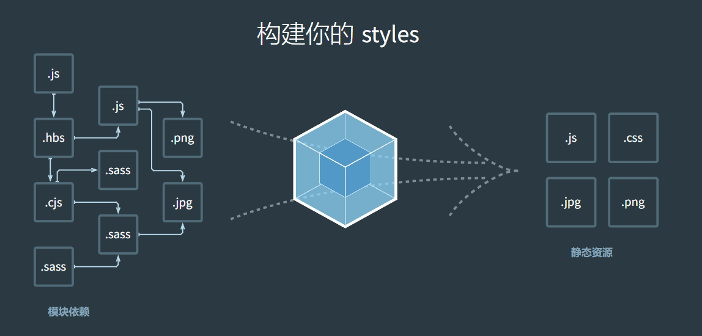

# Webpack

`webpack` 是一个为现代的 JavaScript 应用程序进行模块化打包的工具

- `webpack` 是一个打包工具
- `webpack` 可以将打包打包成最终的静态资源，来部署到静态服务器
- `webpack` 默认支持各种模块化开发， ESModule、CommonJS、AMD等



## 介绍

`Webpack` 的运行依赖 `Node` 环境，需要先安装 `Node.js` 

`Webpack` 的安装从 4 版本之后，需要安装两个: `Webpack`（核心功能） 和 `Webpack-cli` （脚手架）

执行 `webpack` 命令会执行 `node_modules` 下的 `bin` 目录下的 `webpack`。 `webpack` 再执行时是依赖 `webpack-cli` 的，`webpack-cli` 在执行时，会利用 `webpack` 进行编译和打包过程

> 也就是说，`webpack` 是必须的。如果不使用 `webpack` 命令，而是自己写命令的话是可以不用 `webpack-cli` 的

使用命令行 `npm install webpack webpack-cli -g` 直接进行**全局安装**即可

使用命令行 `npm install webpack webpack-cli -D` 直接进行**局部安装**即可

### 第一次使用

正如当前 `src` 目录中的 `01` 项目所示，项目结构简单，一个 `html` 和三个 `js` 文件

```
│  index.html
│
└─src
    │  index.js
    │
    └─util
            add.js
            data.js
```

在 `index.html` 根据引入 js 的方式不同，会出现不同的情况

| 引入代码 | 出现错误 | 错误原因 |
| --- | --- | --- |
| `<script src="./src/index.js"></script>` | Cannot use import statement outside a module (at index.js:1:1) | 这是因为浏览器不支持 import 语句，需要修改引入代码为 `<script src="./src/index.js" type="module"></script>` | 
| `<script src="./src/index.js" type="module"></script>` | 01/src/util/add net::ERR_ABORTED 404 | 这是因为浏览器不会自动查找指定文件夹下同名的 js 文件，也就是说找不到 `./util/add` 这个文件，需要修改为 `./util/add.js`, 对 `./util/data` 找不到也是同理 |

通过给 `script` 标签添加 `type` 属性和修改模块引入路径，成功让代码运行起来了

为了解决上面的问题，直接使用 `webpack` 命令来打包项目试试

直接使用 `webpack` 打包的时候，会检索当前目录下的 `src/index.js` 文件，并在同级目录下生成 `dist/main.js` 

```js
<script src="./dist/main.js" ></script>
```

成功运行，因为 `main.js` 是一个单独的文件，没有引入其他模块，所以不需要指定 `type="module"`，也不需要修改 `import` 模块的路径

> 注意: 直接运行 `webpack` 会搜索当前目录下的 `src/index.js` 所以要注意执行命令时所在的文件路径，如果没有会报错 `Module not found: Error: Can't resolve './src'`

一般会使用 `npm init -y` 来创建 `package.json`, 进而通过局部安装的方式来安装所需的模块

可以通过 `npx webpack` 来运行局部安装的 `webpack`

> `npx` 会执行当前项目的 `node_modules/bin` 中的模块

可以通过向 `package.json` 的 `script` 中添加命令的方式来运行 `webpack`，使用 `npm run build` 来执行 `build` 命令

```json
"scripts": {
"build": "webpack"
},
```

`package.json` 在执行命令的时候会优先查找当前目录中的 `node_modules/bin` 

