# Webpack

`webpack` 是一个为现代的 JavaScript 应用程序进行模块化打包的工具

- `webpack` 是一个打包工具
- `webpack` 可以将打包打包成最终的静态资源，来部署到静态服务器
- `webpack` 默认支持各种模块化开发， ESModule、CommonJS、AMD等


`Webpack` 的运行依赖 `Node` 环境，需要先安装 `Node.js` 

`Webpack` 的安装从 4 版本之后，需要安装两个: `Webpack`（核心功能） 和 `Webpack-cli` （脚手架）

执行 `webpack` 命令会执行 `node_modules` 下的 `bin` 目录下的 `webpack`。 `webpack` 再执行时是依赖 `webpack-cli` 的，`webpack-cli` 在执行时，会利用 `webpack` 进行编译和打包过程

> 也就是说，`webpack` 是必须的。如果不使用 `webpack` 命令，而是自己写命令的话是可以不用 `webpack-cli` 的

使用命令行 `npm install webpack webpack-cli -g` 直接进行**全局安装**即可

使用命令行 `npm install webpack webpack-cli -D` 直接进行**局部安装**即可

## 第一次使用

正如当前 `src` 目录中的 `01` 项目所示，项目结构简单，一个 `html` 和三个 `js` 文件

```
│  index.html
│
└─src
    │  index.js
    │
    └─util
            add.js
            data.js
```

在 `index.html` 根据引入 js 的方式不同，会出现不同的情况

| 引入代码 | 出现错误 | 错误原因 |
| --- | --- | --- |
| `<script src="./src/index.js"></script>` | Cannot use import statement outside a module (at index.js:1:1) | 这是因为浏览器不支持 import 语句，需要修改引入代码为 `<script src="./src/index.js" type="module"></script>` | 
| `<script src="./src/index.js" type="module"></script>` | 01/src/util/add net::ERR_ABORTED 404 | 这是因为浏览器不会自动查找指定文件夹下同名的 js 文件，也就是说找不到 `./util/add` 这个文件，需要修改为 `./util/add.js`, 对 `./util/data` 找不到也是同理 |

通过给 `script` 标签添加 `type` 属性和修改模块引入路径，成功让代码运行起来了

为了解决上面的问题，直接使用 `webpack` 命令来打包项目试试

直接使用 `webpack` 打包的时候，会检索当前目录下的 `src/index.js` 文件，并在同级目录下生成 `dist/main.js` 

```js
<script src="./dist/main.js" ></script>
```

成功运行，因为 `main.js` 是一个单独的文件，没有引入其他模块，所以不需要指定 `type="module"`，也不需要修改 `import` 模块的路径

> 注意: 直接运行 `webpack` 会搜索当前目录下的 `src/index.js` 所以要注意执行命令时所在的文件路径，如果没有会报错 `Module not found: Error: Can't resolve './src'`

一般会使用 `npm init -y` 来创建 `package.json`, 进而通过局部安装的方式来安装所需的模块

可以通过 `npx webpack` 来运行局部安装的 `webpack`

> `npx` 会执行当前项目的 `node_modules/bin` 中的模块

可以通过向 `package.json` 的 `script` 中添加命令的方式来运行 `webpack`，使用 `npm run build` 来执行 `build` 命令

```json
"scripts": {
"build": "webpack"
},
```

`package.json` 在执行命令的时候会优先查找当前目录中的 `node_modules/bin` 

## 配置选项

### 入口文件

正如前面所讲，直接使用 `webpack` 命令会以 `src/index.js` 为入口(`entry`)，查找依赖图结构

不是所有的项目的入口都是 `src/index.js`，打包之后的路径也不都是 `dist` 文件夹，所以 `webpack` 提供指定入口文件和输出路径的 `option`

```bash
npx webpack --entry ./src/main.js --output-path ./build
```

>  以 02 文件夹中的项目为例运行上述命令，会以 `src/main.js` 为入口，并将输出的 `main.js` 打包到 `build` 文件夹中

在 [官方文档](https://webpack.docschina.org/api/cli/) 中也有详细说明


当然，如果全部使用命令进行 `flag` 配置，会非常麻烦，尤其是配置项目多了之后，会导致配置项难以查找，所以一般都是创建一个 `webpack` 的配置文件 `webpack.config.js`

`webpack` 是通过 `commonjs` 的方式来读取 `webpack.config.js`，所以使用 `module.export = {}` 方式来导出配置

> 毕竟最终 `webpack` 也是依赖 `node` 来运行的，所以会使用 `node` 的模块导入机制

[官网](https://webpack.docschina.org/api/cli/#config)中也有对 `config` 的解释说明

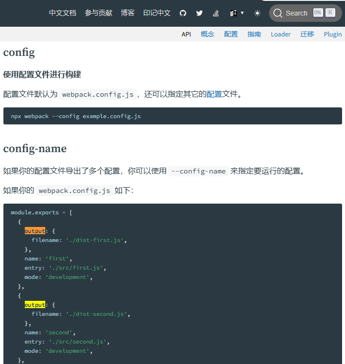

```js
const path = require("path")

module.exports = {
    entry: "./src/main.js",
    output: {
        filename: "./bundle.js",
        path: path.resolve(__dirname, "./build")
    }
}
```

将上述代码写入 `webpack.config.js` 文件中，效果等同于 `--entry ./src/main.js --output-path ./build`

为什么 `output.path` 需要指定为 `path.resolve(__dirname, "./build")` ？

因为 `webpack.config.js` 的 `output.path` 需要指定为绝对路径，这个是 `webpack` 要求的，所以可以用到 `node` 内置的 `path` 模块，来获取当前文件(`webpack.config.js`) 的绝对路径

然后直接执行 `npx webpack`，自动读取当前项目目录中的 `webpack.config.js` 文件来进行操作，从而会生成 `build/bundle.js` 文件

如果当前目录中不存在 `webpack.config.js` 文件，而是 `wp.config.js`，这个时候需要指定配置文件的名称

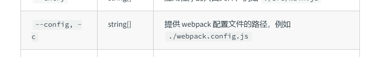

```bash
npx webpack --config ./wp.config.js
```

### 依赖图

如果有一个 js 文件名为 `test.js`，这个文件没有被其他任何模块 `import`，那么这个文件就不会打包到 `webpack` 的最终产物中去

`webpack` 在处理应用程序时，会根据命令或配置文件找到入口文件(比如 `main.js`)，从入口开始，会生成一个**依赖关系图**，这个**依赖关系图**会包含应用程序所需的所有模块，然后遍历图结构，打包一个个模块（根据文件的不同使用不同的 `loader` 来解析）

> `webpack` 提供 `tree-shaking` 消除无用代码

也就是说，有一个 `test.js` 文件

```js
console.log(`hello world`);

export function foo()
{
    console.log(`test.js foo`);
}
```

在 `main.js` 中

如果使用如下代码，则不会引入 `test.js` 

```js
console.log(`main.js`);
```

如果使用如下代码，则会引入 `test.js` 但开启 `tree-shaking` 之后会消除 `foo` 函数，因为 `foo` 并没有被使用

```js
import "./test"

console.log(`main.js`)
```

如果使用如下代码，则会将 `foo` 函数打包到最终文件中，因为 `foo` 被使用了

```js
import * as test from "./test"

test.foo();
console.log(`main.js`)
```

### loader

前面提到过，不同类型文件需要不同的 loader 进行处理，比如 js、html、css 等

如果不对 `webpack` 做任何处理，运行 `03` 项目

> 官方案例 `https://webpack.docschina.org/guides/asset-management/#loading-css`

在 `component.js` 中通过 `import ../css/index.css` 会出现以下错误

```bash
ERROR in ./src/css/index.css 1:0
Module parse failed: Unexpected token (1:0)
You may need an appropriate loader to handle this file type, currently no loaders are configured to process this file. See https://webpack.js.org/concepts#loaders
> .content {
|     color: red;
| }
 @ ./src/util/component.js 1:0-25
 @ ./src/index.js 1:0-25
```

根据 `You may need an appropriate loader` 你需要一个合适的 `loader` 来处理这个 css 文件

`loader` 可以用于对模块的源代码进行转换，这里将 `index.css` 看作是一个模块，通过 `import ../css/index.css` 来加载这个模块，但是 `webpack` 并不知道如何对这个模块进行加载，所以报错

为了让 `webpack` 知道如何加载，需要指定对应的 `loader` 来完成加载功能

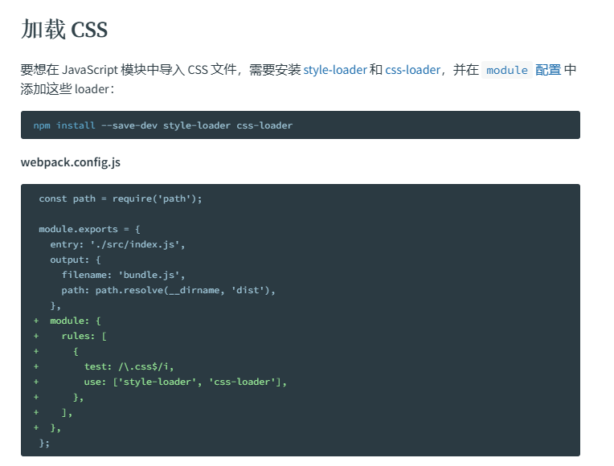

直接使用 npm 局部安装 `css-loader` 和 `style-loader` 即可安装所需 `loader`

```bash
npm install css-loader style-loder -D
```

安装了 `loader` 只是表示你有这工具，但是如何使用这个工具需要通过配置来告诉 `webpack`

官网对 loader 的配置也有[说明](https://webpack.docschina.org/concepts/loaders/#configuration)

- 内联方式 指明 `loader`

```js
import "style-loader!css-loader!../css/index.css"
```

- 配置方式

```js
    module: {
        rules: [
            {
                test: /\.css$/,
                use: [
                    {
                        loader: 'css-loader',
                    },
                ],
            },
        ],
    },
```

`module` 属性可以配置 `rules` 规则数组

`rules` 是一个包含多个 `rule` 的数组

```js
{
    test: /\.css$/,
    use: [
        {
            loader: 'css-loader',
        },
    ],
},
```

`test` 用于正则匹配，对匹配上的资源，使用该规则中配置的 `loader`

> `/\.css$/` 由于 `.` 在正则中是特殊符号，需要用 `\` 转译；`$` 表示匹配末尾

官网中对 `loader` 也有[详细说明](https://webpack.docschina.org/configuration/module/#rule)


| 写法一 | 写法二 | 写法三 |
| --- | --- | --- |
| `use: [ { loader: "css-loader" } ]` | `loader: "css-loader"` | `use: [ "css-loader" ]` |

> 上述三种写法等价

通过上述修改, 终于能够让 `webpack` 命令正常运行, 得到最后的 `bundle.js` 文件

但是实际运行的时候, `.content` 样式并没有正确显示在页面中, 这是因为 `css-loader` 只是负责解析 css 文件,并不负责插入 css, 所以还需要使用 `style-loader` 插入 style

常见的样式引入有三种方法

1. 行内样式, 即直接写在标签中
2. 页内样式, 即在 html 文件中通过 `style` 标签进行设置
3. 外部样式, 即通过外部的 `.css` 文件进入引入

```js
{
    test: /\.css$/,
    use: [
        { loader: 'style-loader' },
        { loader: 'css-loader' },
    ],
},
```

**注意**: `webpack` 加载 `loader` 的顺序是数组序号从大到小执行的

也就是根据上述配置, `webpack` 会先执行 `css-loader` 再执行 `style-loader`. 这个顺序就是正确的, 如果反向的话会执行 `style-loader` 再执行 `css-loader`, 但是没有 `css-loader` 解析 `style-loader` 怎么插入呢? 

通过观察生成的 `bundle.js` 可以看到 `webpack` 是如何处理 `css` 的. 它通过创建一个 `style` 的方式将内容通过页内样式插入到 `html` 中

```js
e.exports = function(e) {
    var t = document.createElement("style");
    return e.setAttributes(t, e.attributes), e.insert(t, e.options), t
}
```

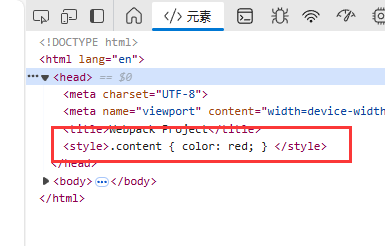

可能会用 `less`、`sass`、`stylus` 的预处理器来编写 css 样式，效率更高，那么如何支持呢？

以 `less` 为例，想要将 `less` 转为 `css`，需要使用 less 这个库。想要解析 `less` 需要使用使用 `less-loader` 库

> `less-loader` 的执行需要 `less`, 所以两个库都要安装

所以需要执行以下代码

```bash
npm install less less-loader -D
```

那么根据流水线操作，针对 `.less` 结尾的文件，需要首先使用 `less-loader` 将其转为 `css`，然后使用 `css-loader` 解析，最后使用 `style-loader` 插入到界面中

所以最终得到 `less` 的 `rule` 内容如下

```js
{
    test: /\.less$/,
    use: [
        "style-loader",
        "css-loader",
        "less-loader"
    ]
}
```

> 记得 `rule` 不同的等效写法吗

### 浏览器兼容性

针对不同的浏览器支持的特性，比如 css 特性、js 语法等，会导致各种兼容性问题

那么某个功能如果存在兼容性问题，是否需要针对这个功能对不同的浏览器做特殊处理呢？很多情况都是根据浏览器的市场占有率来决定的

[caniuse](https://caniuse.com/usage-table) 是一个判断某些功能能否使用的网站，其在 `usage-table` 界面中提供了市场占有率

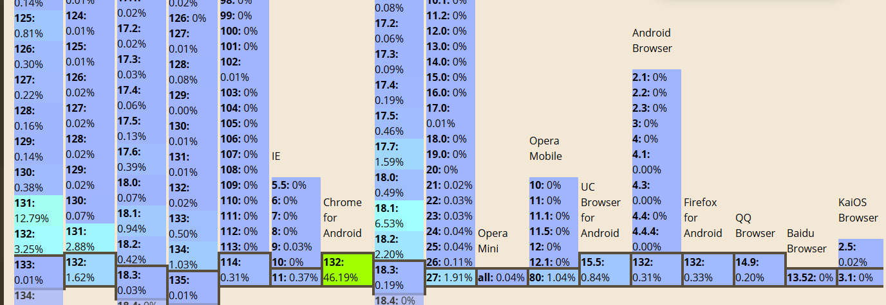

很多项目存在 `.browserslistrc` 文件，内容可能如下

```bash
> 1%
last 2 versions
not dead
```

这里的 `> 1%` 就是指市场占有率大于 1%，根据当前运行的浏览器的版本，查找 `caniuse` 网站中的占有率，进而判断是否需要支持

通过 `Browserslist` 工具来共享兼容性配置给其他工具(`babel`、`autoprefixer`等)使用

`Browserslist` 是一个在不同的前端工具之间，共项**目标浏览器**和**Node.js**版本的配置

上述例子有一个叫 `not dead` 的配置，译为没有死亡的。 `Browserslist` 对 `dead` 的定义是 24 个月内没有官方支持或更新的浏览器

上述例子有一个叫 `last 2 versions` 的配置，表示每个浏览器的最后 2 个版本。比如 `last 2 Chrome versions` 就是 Chrome 浏览器最近的两个版本

除此之外，还有针对 node 的版本规则、针对指定平台浏览器的规则、支持特定功能浏览器的规则 等

首先通过 `npm` 安装 `browserslist`

```bash
npm install browserslist -D
```

然后就可以使用 `browserslist` 查询支持的浏览器了

```bash
cmd: npx browserslist ">1%, last 2 versions, not dead"

and_chr 132
and_ff 132
and_qq 14.9
and_uc 15.5
android 132
chrome 132
chrome 131
chrome 109
edge 132
edge 131
firefox 134
firefox 133
ios_saf 18.3
ios_saf 18.2
ios_saf 18.1
ios_saf 17.6-17.7
kaios 3.0-3.1
kaios 2.5
op_mini all
op_mob 80
opera 114
opera 113
safari 18.3
safari 18.2
samsung 27
samsung 26
```

> 在命令中 `,` 等价于 `or` 也就是只要满足其中一个条件即可

```bash
cmd: npx browserslist ">1% and last 2 versions and not dead"
and_chr 132
chrome 132
chrome 131
edge 132
edge 131
firefox 134
ios_saf 18.2
op_mob 80
samsung 27
```

> 在命令中 and 表示所有条件必须全部满足才行

那么如何在项目中进行配置呢？

- 通过在 `package.json` 中新增 `browserslist` 属性进行配置，其他工具会根据该配置自动适配

```json
{
  "name": "01",
  "version": "1.0.0",
  "description": "",
  "main": "index.js",
  "scripts": {
    // ..
  },
  "keywords": [],
  "author": "",
  "license": "ISC",
  "devDependencies": {
    // ..
  },
  "browserslist": [
    ">1%",
    "last 2 version",
    "not dead",
  ]
}
```

- 通过新增 `.browserslistrc` 文件，进行配置

```
>1%"
last 2 version"
not dead"
```

### CSS 的浏览器适配

在前端开发中，CSS 属性需要加上浏览器前缀（如 `-webkit-`、`-moz-`、`-ms-` 等）的原因主要是为了兼容不同浏览器的实验性功能或尚未成为标准的 CSS 特性

浏览器前缀是为了让浏览器厂商能够在 CSS 标准尚未完全确定或实现时，提前引入实验性功能。不同浏览器可能会以不同的方式实现某些特性，前缀可以确保这些实验性功能不会影响其他浏览器的正常渲染

- `-webkit-`：用于基于 WebKit 内核的浏览器（如 `Chrome`、`Safari`、旧版 `Edge`）
- `-moz-`：用于基于 Gecko 内核的浏览器（如 `Firefox`）
- `-ms-`：用于基于 Trident 内核的浏览器（如 `Internet Explorer` 和旧版 `Edge`）
- `-o-`：用于基于 Presto 内核的浏览器（如旧版 `Opera`）

以 `transition` 为例

```css
-webkit-transition: all 2s ease; /* 兼容 WebKit 内核浏览器 */
-moz-transition: all 2s ease;    /* 兼容 Gecko 内核浏览器 */
-ms-transition: all 2s ease;     /* 兼容 Trident 内核浏览器 */
-o-transition: all 2s ease;       /* 兼容 Presto 内核浏览器 */
transition: all 2s ease;         /* 标准写法 */
```

> `transition` 是为了让 css 属性值发生变化时不会立刻变化，而是线性的过渡变化。比如从红色设置为黑色，会逐渐变化

为了浏览器兼容性，单单 `transition` 这个属性就要添加好几个带浏览器前缀的属性，而且我们不知道那些属性需要添加浏览器属性，所以人工手动添加是费时费力的

为了浏览器兼容性和方便编写，这个时候就需要用到 `autoprefixer`，能够自动为 `css` 添加浏览器前缀

配合 `autoprefixer` 还需要使用一个 `postcss`， `PostCSS` 是一种 `JavaScript` 工具，可将你的 `CSS` 代码转换为抽象语法树 (`AST`)，然后提供 `API`（应用程序编程接口）用于使用 `JavaScript` 插件对其进行分析和修改

基本执行概念就是，先使用 `postcss` 将指定的 `css` 文件转化为抽象语法树，然后使用 `autoprefixer` 来解析这个抽象语法树，并输出为带有浏览器前缀的新 `css` 文件

`autoprefixer` 并不会将所有 `css` 属性都添加上浏览器前缀，而是根据前面所讲的 `browserslist` 配置，将所有需要兼容 `css` 属性添加上浏览器前缀

比如：`transition` 其实现在新的浏览器都已经实现了该功能，不需要添加上浏览器前缀了，那么 `transition` 这个属性就不会特殊处理添加上 浏览器前缀

需要使用 npm 安装 `postcss` 和 `autoprefixer`

```bash
npm install postcss postcss-cli -D
npm install autoprefixer -D
```

然后使用 `postcss` 对 css 文件进行处理

```bash
npx postcss --use autoprefixer -o nnn.css src/css/prefix.css
```

原文件如下

```css
.content {
    transition: all 2s ease;
    user-select: none;
}
```

转换之后的文件如下

```css
.content {
    transition: all 2s ease;
    -webkit-user-select: none;
       -moz-user-select: none;
            user-select: none;
}
/*# sourceMappingURL=data:application/json;base64,eyJ2ZXJzaW9uIjozLCJzb3VyY2VzIjpbInNyYy9jc3MvcHJlZml4LmNzcyJdLCJuYW1lcyI6W10sIm1hcHBpbmdzIjoiQUFBQTtJQUNJLHVCQUF1QjtJQUN2Qix5QkFBaUI7T0FBakIsc0JBQWlCO1lBQWpCLGlCQUFpQjtBQUNyQiIsImZpbGUiOiJubm4uY3NzIiwic291cmNlc0NvbnRlbnQiOlsiLmNvbnRlbnQge1xyXG4gICAgdHJhbnNpdGlvbjogYWxsIDJzIGVhc2U7XHJcbiAgICB1c2VyLXNlbGVjdDogbm9uZTtcclxufSJdfQ== */
```

很明显，根据浏览器兼容性配置，不需要再对 `transition` 属性做特殊处理了，但是针对 `user-select` 还是需要特殊处理的

那么如何在 `webpack` 中使用呢？

根据处理顺序

1. 使用 `postcss` 解析，并交给 `autoprefixer` 插件进行处理得到新的 css
2. 使用 `css-loader` 进行解析
3. 使用 `style-loader` 插入到界面样式中

最终得到配置如下

```js
{
    test: /\.css$/,
    use: [
        { loader: 'style-loader' },
        { loader: 'css-loader' },
        {
            loader: "postcss-loader",
            options: {
                postcssOptions: {
                    plugins: [
                        require("autoprefixer")
                    ]
                }
            }
        }
    ],
},
```

记得安装 `postcss-loader`

```bash
npm install postcss-loader -D
```

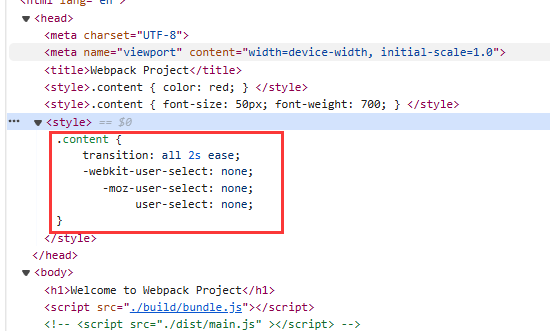

不过 `autoprefixer` 也是有局限性的，它只会添加浏览器前缀，对于一些写法并不会做优化，比如

```css
.content {
    color: #12345678;
}
```

上述写法使用了 16 进制表现颜色的 `RGBA`，可惜的是一些旧的浏览器可能并不支持这种十六进制的写法，如果使用 `autoprefixer` 并不会将这些写法进行优化，使其兼容旧浏览器

为了让 css 兼容大部分旧的浏览器，一般不仅仅使用 `autoprefixer`，还要使用 `postcss-preset-env`

```bash
npm install postcss-preset-env -D
```

```js
{
    test: /\.css$/,
    use: [
        { loader: 'style-loader' },
        { loader: 'css-loader' },
        {
            loader: "postcss-loader",
            options: {
                postcssOptions: {
                    plugins: [
                        require("postcss-preset-env"),
                    ]
                }
            }
        }
    ],
},
```

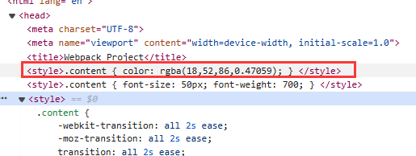

> `postcss-preset-env` 中集成了 `autoprefixer` 的特性，所以不需要再使用 `autoprefixer` 了

这里不得不提到 `css` 的 `import` 语法，以 `index.css` 为例

```css
@import "./test.css";

.demo {
    color: red;
}
```

根据 `css` 的处理规则，依次 `postcss-loader`、`css-loader`、`style-loader`，那么 `@import "./test.css"` 的处理时机其实是在 `css-loader` 阶段，进而导致 `test.css` 这个文件没有被 `postcss-loader` 处理，那么浏览器兼容性就会失效

> `index.css` 是在 `js` 文件中 `import` 的，所以走正常处理流程
> `test.css` 是在 `css` 文件中 `import` 的，所以无法全部流程

为了处理上述问题，需要对 `css` 的 `rule` 做一些修改

```js
{
    test: /\.css$/,
    use: [
        { loader: 'style-loader' },
        { 
            loader: 'css-loader',
            options: {
                importLoaders: 1
            }
        },
        {
            loader: "postcss-loader",
            options: {
                postcssOptions: {
                    plugins: [
                        require("postcss-preset-env"),
                    ]
                }
            }
        }
    ],
},
```

添加 `importLoaders: 1` 表示当前 `loader` 的序号后 1 个的 `loader` 开始，这里 `css-loader` 后一个 `loader` 就是 `postcss-loader`

以 `less` 的 `rule` 为例

```js
{
    test: /\.less$/,
    use: [
        "style-loader",
        { 
            loader: 'css-loader',
            options: {
                importLoaders: 2
            }
        },
        {
            loader: "postcss-loader",
            options: {
                postcssOptions: {
                    plugins: [
                        require("postcss-preset-env"),
                    ]
                }
            }
        },
        "less-loader"
    ]
}
```

在 `less` 的 `rule` 中，`css-loader` 后面有 2 个 `loader`，为了让 `css` 中 `import` 的 `css` 能够走完整的流程，所以 `importLoaders = 2`

### 图片处理

> 项目 04

在 css 中使用图片

```css
.content {
    color: #12345678;
    background-image: url('../img/miku.jpg');
}
```

在 js 中使用图片

```js
let img = new Image();
img.src = require("../img/miku.jpg").default;
element.appendChild(img);

return element;
```

老样子，处理图片，需要能够处理图片的 `loader`

```bash
npm install file-loader -D
```

直接使用 `npx webpack` 可以发现生成了两个 `jpg` 文件：`c1641b10aa8c32f4ca06c0e618bbb45f.jpg` 和 `e0c798acd7d0b4d488c0.jpg`

其中 `c1641b10aa8c32f4ca06c0e618bbb45f.jpg` 是正常的图片文件，但是 `e0c798acd7d0b4d488c0.jpg` 是一个无法解析的图片

通过文本打开无法解析的图片，得到如下内容

```txt
export default __webpack_public_path__ + "c1641b10aa8c32f4ca06c0e618bbb45f.jpg";
```

这表示 `e0c798acd7d0b4d488c0.jpg` 是 webpack5 打包生成的多余图片，该图片直接引
用 `c1641b10aa8c32f4ca06c0e618bbb45f.jpg`

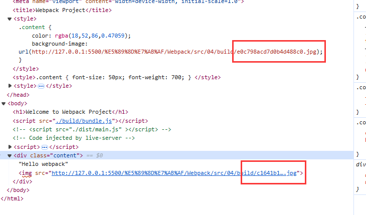

在 web 界面中可以发现， `style` 中引用了这个多余的图片，所以修改 `css-loader`


```js
{
    test: /\.css$/,
    use: [
        { loader: 'style-loader' },
        { 
            loader: 'css-loader',
            options: {
                importLoaders: 1,
                esModule: false,
            }
        },
        {
            loader: "postcss-loader",
            options: {
                postcssOptions: {
                    plugins: [
                        require("postcss-preset-env"),
                    ]
                }
            }
        }
    ],
},
```

添加 `esModule: false`

`js` 代码中 `img.src = require("../img/miku.jpg").default` 的写法与 `file-loader` 版本相关

在 4.x 版本的 `file-loader`，使用 `require("file")` 直接得到的就是资源；在 5.x 之后的版本，使用 `require("file")` 得到的是是一个对象，对象中有一个 `default` 属性对应的才是资源

除了 `require` 之外，还可以使用 `import` 来加载图片，这样无需考虑是否要添加 `default` 的问题

```js


import miku from "../img/miku.jpg"

let img2 = new Image();
img2.src = miku;
element.appendChild(img2);
```

[官网对 file-loader 有详细说明](https://v4.webpack.js.org/loaders/file-loader/#options)

可以通过如下配置，设置 `file-loader` 处理图片之后，图片的名称

```js
module.exports = {
  module: {
    rules: [
      {
        test: /\.(png|jpe?g|gif)$/i,
        loader: 'file-loader',
        options: {
          name: '[path][name].[ext]',
          outputPath: 'images', // 指定文件输出路径
        },
      },
    ],
  },
};
```

`file-loader` 使用 `md4` 来处理图片名称

比如 `name: '[name][hash:6].[ext]'` 表示新的文件名称为 图片原名称 + hash 值的前 6 位 + 图片原后缀

对于一些小的图片，可以使用 `url-loader` 直接将图片转换成 `base64` 嵌入到代码中

```js
{
    test: /\.(png|jpg|jpeg|gif|svg)$/,
    use: [
        {
            loader: "url-loader",
            options: {
                name: '[name][hash:6].[ext]'
            }
        }
    ]
}
```

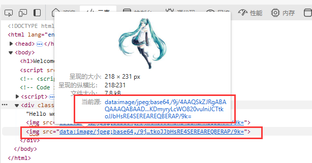

在实际开发过程中，更倾向于小的图片使用 base64 跟随网页一同下载显示，大的图片使用使用路径请求

如果大的图片也转换成 base64，会严重影响网页下载速度和渲染速度，进而影响体验

如果全部使用 url 请求，会增加服务器压力

`url-loader` 提供 `limit` 的 `option`，用于限制转换图片的大小

```js
{
    test: /\.(png|jpg|jpeg|gif|svg)$/,
    use: [
        {
            loader: "url-loader",
            options: {
                name: '[name][hash:6].[ext]',
                limit: 100 * 1024
            }
        }
    ]
}
```

> `limit: 100 * 1024` 表示只有 100kb 以下的图片会转换为 base64

### 图片处理-新

在 `webpack5` 不需要使用 `file-loader` 来加载图片资源

> 项目 05

使用 **资源模块类型** `asset module type` 的方式来替代提到之前提到的 `url-loader`、`file-loader` 等

- 资源模块类型
  - `asset/resource` 发送一个单独的文件并导出 `URL`，之前通过 `file-loader` 实现
  - `asset/inline` 导出一个资源的 `data` `URI`, 之前通过 `url-loader` 实现
  - `asset/source` 到处资源的源代码，之前通过 `raw-loader` 实现
  - `asset` 在到处一个 `data` `URI` 和发送一个单独的文件之间自动选择。之前通过使用 `url-loader`，并配置资源体积限制实现

在 rule 中针对图片文件，直接使用 `type: "asset/resource"` 来指定模块类型即可

```js
{
    test: /\.(png|jpg|jpeg|gif|svg)$/,
    type: "asset/resource",
    generator: {
        // publicPath: 'assets/',
        filename: 'img/[name]-[hash][ext]',
    },
}
```

成功在输出目录中看到到处的图片和生成的 `bundle.js`

> 官方文档中对图片资源的加载也有[例子](https://webpack.docschina.org/configuration/module/#rulegeneratorfilename)

- `publicPath` 指的是在引用图片的路径上添加 `assets/`
- `filename` 指的是导出图片时重新设置图片的名称

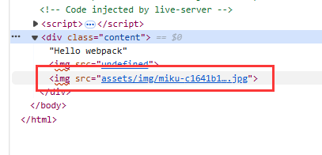

以上述图片为例，最后图片的索引路径就是 `publicPath` + `filename`

所以一般 `publicPath` 可以设置为 CDN 中存放图片或者其他资源的网络路径

官网对 `asset/inline` 也有[比较详细的说明](https://webpack.docschina.org/guides/asset-modules/#inlining-assets)

```js
{
    test: /\.(png|jpg|jpeg|gif|svg)$/,
    // type: "asset/resource",
    type: "asset/inline",
}
```

最后的效果跟 `url-loader` 一样，图片生成了 base64 嵌套进了网页

如果想要根据图片大小，选择 `asset/inline` 或者 `asset/resource` ，可以直接设置 `type = "asset"`，然后专门配置这个 `rule`

```js
{
    test: /\.(png|jpg|jpeg|gif|svg)$/,
    type: "asset",
    generator: {
        filename: "image/[name]-[hash:6][ext]"
    },
    parser: {
        dataUrlCondition: {
            maxSize: 10 * 1024 // 10kb
        }
    }
}
```

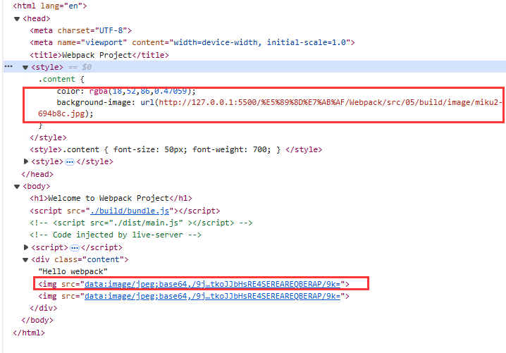

最后生成出来的界面

- 对于小的 `miku.jpg` 只有 7kb，会直接生成 base64 码
- 对于大的 `miku2.jpg` 有 180kb，会通过 http 请求图片进行下载显示

> 使用 `asset` 加载图片时，直接使用 `img.src = require("../img/miku.jpg")` 即可，不需要跟之前使用 `file-loader` 一样

### Plugin

插件目的在于解决 `loader` 无法实现的其他事

`Loader` 用于**特定的模块类型**进行转换

`Plugin` 执行`更加广泛的任务`，比如打包任务、资源管理、环境变量注入等

前面的例子遇到问题

1. 每次修改完 `webpack.config.js` 之后，重新打包之前，会把 `build` 文件夹删除掉，这样是最保险的。每次都要删除，而对于这种流程化机械化的东西还是希望能够放在工具中自动处理
2. `build` 文件夹作为发布文件夹，居然没有 `index.html`(不是每个项目都有，但是前面的例子项目得有)

