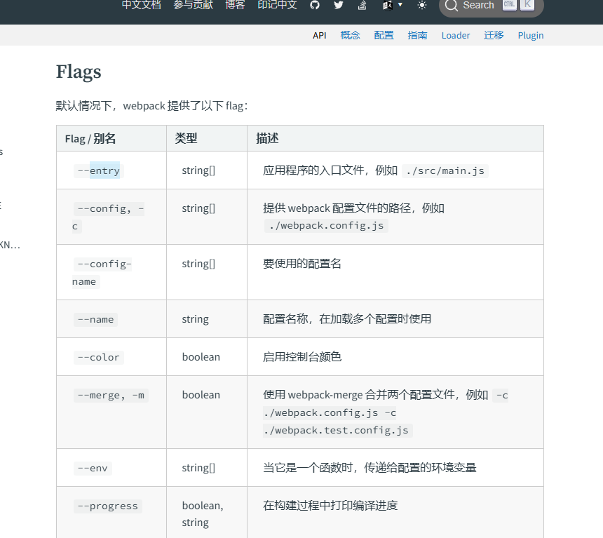
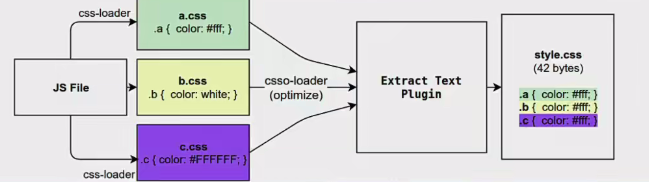
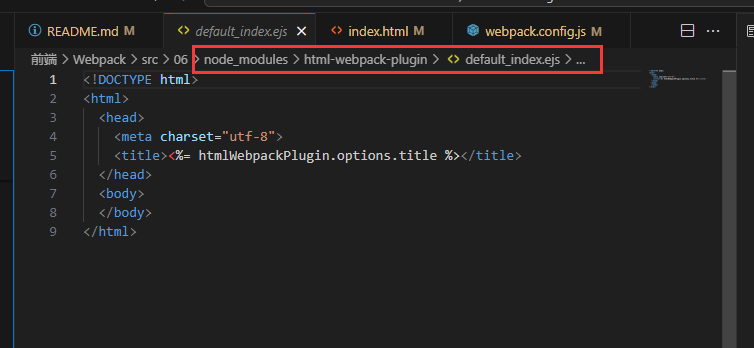
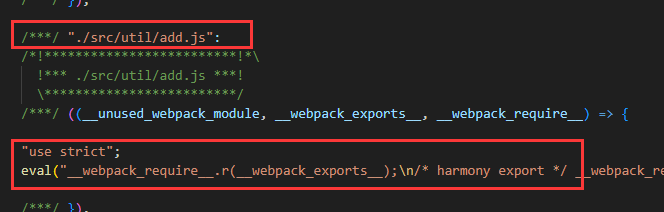
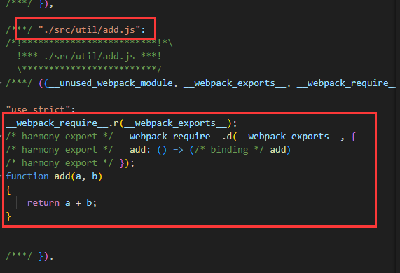
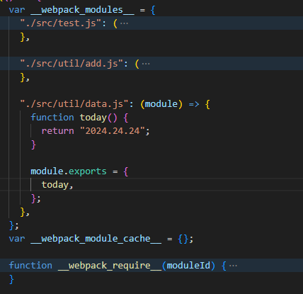
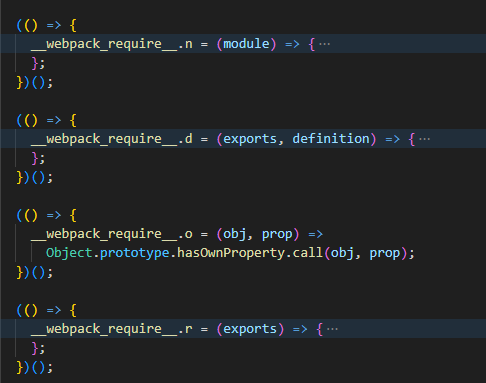
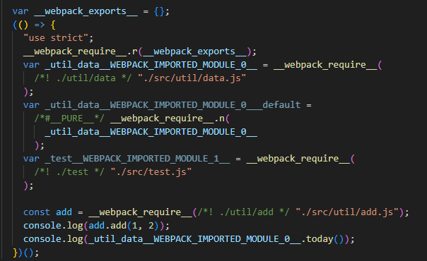

# Webpack

`webpack` 是一个为现代的 JavaScript 应用程序进行模块化打包的工具

- `webpack` 是一个打包工具
- `webpack` 可以将打包打包成最终的静态资源，来部署到静态服务器
- `webpack` 默认支持各种模块化开发， ESModule、CommonJS、AMD等


`Webpack` 的运行依赖 `Node` 环境，需要先安装 `Node.js` 

`Webpack` 的安装从 4 版本之后，需要安装两个: `Webpack`（核心功能） 和 `Webpack-cli` （脚手架）

执行 `webpack` 命令会执行 `node_modules` 下的 `bin` 目录下的 `webpack`。 `webpack` 再执行时是依赖 `webpack-cli` 的，`webpack-cli` 在执行时，会利用 `webpack` 进行编译和打包过程

> 也就是说，`webpack` 是必须的。如果不使用 `webpack` 命令，而是自己写命令的话是可以不用 `webpack-cli` 的

使用命令行 `npm install webpack webpack-cli -g` 直接进行**全局安装**即可

使用命令行 `npm install webpack webpack-cli -D` 直接进行**局部安装**即可

## 第一次使用

正如当前 `src` 目录中的 `01` 项目所示，项目结构简单，一个 `html` 和三个 `js` 文件

```
│  index.html
│
└─src
    │  index.js
    │
    └─util
            add.js
            data.js
```

在 `index.html` 根据引入 js 的方式不同，会出现不同的情况

| 引入代码 | 出现错误 | 错误原因 |
| --- | --- | --- |
| `<script src="./src/index.js"></script>` | Cannot use import statement outside a module (at index.js:1:1) | 这是因为浏览器不支持 import 语句，需要修改引入代码为 `<script src="./src/index.js" type="module"></script>` | 
| `<script src="./src/index.js" type="module"></script>` | 01/src/util/add net::ERR_ABORTED 404 | 这是因为浏览器不会自动查找指定文件夹下同名的 js 文件，也就是说找不到 `./util/add` 这个文件，需要修改为 `./util/add.js`, 对 `./util/data` 找不到也是同理 |

通过给 `script` 标签添加 `type` 属性和修改模块引入路径，成功让代码运行起来了

为了解决上面的问题，直接使用 `webpack` 命令来打包项目试试

直接使用 `webpack` 打包的时候，会检索当前目录下的 `src/index.js` 文件，并在同级目录下生成 `dist/main.js` 

```js
<script src="./dist/main.js" ></script>
```

成功运行，因为 `main.js` 是一个单独的文件，没有引入其他模块，所以不需要指定 `type="module"`，也不需要修改 `import` 模块的路径

> 注意: 直接运行 `webpack` 会搜索当前目录下的 `src/index.js` 所以要注意执行命令时所在的文件路径，如果没有会报错 `Module not found: Error: Can't resolve './src'`

一般会使用 `npm init -y` 来创建 `package.json`, 进而通过局部安装的方式来安装所需的模块

可以通过 `npx webpack` 来运行局部安装的 `webpack`

> `npx` 会执行当前项目的 `node_modules/bin` 中的模块

可以通过向 `package.json` 的 `script` 中添加命令的方式来运行 `webpack`，使用 `npm run build` 来执行 `build` 命令

```json
"scripts": {
"build": "webpack"
},
```

`package.json` 在执行命令的时候会优先查找当前目录中的 `node_modules/bin` 

## 配置选项

### 入口文件

正如前面所讲，直接使用 `webpack` 命令会以 `src/index.js` 为入口(`entry`)，查找依赖图结构

不是所有的项目的入口都是 `src/index.js`，打包之后的路径也不都是 `dist` 文件夹，所以 `webpack` 提供指定入口文件和输出路径的 `option`

```bash
npx webpack --entry ./src/main.js --output-path ./build
```

>  以 02 文件夹中的项目为例运行上述命令，会以 `src/main.js` 为入口，并将输出的 `main.js` 打包到 `build` 文件夹中

在 [官方文档](https://webpack.docschina.org/api/cli/) 中也有详细说明



当然，如果全部使用命令进行 `flag` 配置，会非常麻烦，尤其是配置项目多了之后，会导致配置项难以查找，所以一般都是创建一个 `webpack` 的配置文件 `webpack.config.js`

`webpack` 是通过 `commonjs` 的方式来读取 `webpack.config.js`，所以使用 `module.export = {}` 方式来导出配置

> 毕竟最终 `webpack` 也是依赖 `node` 来运行的，所以会使用 `node` 的模块导入机制

[官网](https://webpack.docschina.org/api/cli/#config)中也有对 `config` 的解释说明


```js
const path = require("path")

module.exports = {
    entry: "./src/main.js",
    output: {
        filename: "./bundle.js",
        path: path.resolve(__dirname, "./build")
    }
}
```

将上述代码写入 `webpack.config.js` 文件中，效果等同于 `--entry ./src/main.js --output-path ./build`

为什么 `output.path` 需要指定为 `path.resolve(__dirname, "./build")` ？

因为 `webpack.config.js` 的 `output.path` 需要指定为绝对路径，这个是 `webpack` 要求的，所以可以用到 `node` 内置的 `path` 模块，来获取当前文件(`webpack.config.js`) 的绝对路径

然后直接执行 `npx webpack`，自动读取当前项目目录中的 `webpack.config.js` 文件来进行操作，从而会生成 `build/bundle.js` 文件

如果当前目录中不存在 `webpack.config.js` 文件，而是 `wp.config.js`，这个时候需要指定配置文件的名称


```bash
npx webpack --config ./wp.config.js
```

### 依赖图

如果有一个 js 文件名为 `test.js`，这个文件没有被其他任何模块 `import`，那么这个文件就不会打包到 `webpack` 的最终产物中去

`webpack` 在处理应用程序时，会根据命令或配置文件找到入口文件(比如 `main.js`)，从入口开始，会生成一个**依赖关系图**，这个**依赖关系图**会包含应用程序所需的所有模块，然后遍历图结构，打包一个个模块（根据文件的不同使用不同的 `loader` 来解析）

> `webpack` 提供 `tree-shaking` 消除无用代码

也就是说，有一个 `test.js` 文件

```js
console.log(`hello world`);

export function foo()
{
    console.log(`test.js foo`);
}
```

在 `main.js` 中

如果使用如下代码，则不会引入 `test.js` 

```js
console.log(`main.js`);
```

如果使用如下代码，则会引入 `test.js` 但开启 `tree-shaking` 之后会消除 `foo` 函数，因为 `foo` 并没有被使用

```js
import "./test"

console.log(`main.js`)
```

如果使用如下代码，则会将 `foo` 函数打包到最终文件中，因为 `foo` 被使用了

```js
import * as test from "./test"

test.foo();
console.log(`main.js`)
```

## loader

前面提到过，不同类型文件需要不同的 loader 进行处理，比如 js、html、css 等

如果不对 `webpack` 做任何处理，运行 `03` 项目

> 官方案例 `https://webpack.docschina.org/guides/asset-management/#loading-css`

在 `component.js` 中通过 `import ../css/index.css` 会出现以下错误

```bash
ERROR in ./src/css/index.css 1:0
Module parse failed: Unexpected token (1:0)
You may need an appropriate loader to handle this file type, currently no loaders are configured to process this file. See https://webpack.js.org/concepts#loaders
> .content {
|     color: red;
| }
 @ ./src/util/component.js 1:0-25
 @ ./src/index.js 1:0-25
```

根据 `You may need an appropriate loader` 你需要一个合适的 `loader` 来处理这个 css 文件

`loader` 可以用于对模块的源代码进行转换，这里将 `index.css` 看作是一个模块，通过 `import ../css/index.css` 来加载这个模块，但是 `webpack` 并不知道如何对这个模块进行加载，所以报错

为了让 `webpack` 知道如何加载，需要指定对应的 `loader` 来完成加载功能


直接使用 npm 局部安装 `css-loader` 和 `style-loader` 即可安装所需 `loader`

```bash
npm install css-loader style-loder -D
```

安装了 `loader` 只是表示你有这工具，但是如何使用这个工具需要通过配置来告诉 `webpack`

官网对 loader 的配置也有[说明](https://webpack.docschina.org/concepts/loaders/#configuration)

- 内联方式 指明 `loader`

```js
import "style-loader!css-loader!../css/index.css"
```

- 配置方式

```js
    module: {
        rules: [
            {
                test: /\.css$/,
                use: [
                    {
                        loader: 'css-loader',
                    },
                ],
            },
        ],
    },
```

`module` 属性可以配置 `rules` 规则数组

`rules` 是一个包含多个 `rule` 的数组

```js
{
    test: /\.css$/,
    use: [
        {
            loader: 'css-loader',
        },
    ],
},
```

`test` 用于正则匹配，对匹配上的资源，使用该规则中配置的 `loader`

> `/\.css$/` 由于 `.` 在正则中是特殊符号，需要用 `\` 转译；`$` 表示匹配末尾

官网中对 `loader` 也有[详细说明](https://webpack.docschina.org/configuration/module/#rule)


| 写法一 | 写法二 | 写法三 |
| --- | --- | --- |
| `use: [ { loader: "css-loader" } ]` | `loader: "css-loader"` | `use: [ "css-loader" ]` |

> 上述三种写法等价

通过上述修改, 终于能够让 `webpack` 命令正常运行, 得到最后的 `bundle.js` 文件

但是实际运行的时候, `.content` 样式并没有正确显示在页面中, 这是因为 `css-loader` 只是负责解析 css 文件,并不负责插入 css, 所以还需要使用 `style-loader` 插入 style

常见的样式引入有三种方法

1. 行内样式, 即直接写在标签中
2. 页内样式, 即在 html 文件中通过 `style` 标签进行设置
3. 外部样式, 即通过外部的 `.css` 文件进入引入

```js
{
    test: /\.css$/,
    use: [
        { loader: 'style-loader' },
        { loader: 'css-loader' },
    ],
},
```

**注意**: `webpack` 加载 `loader` 的顺序是数组序号从大到小执行的

也就是根据上述配置, `webpack` 会先执行 `css-loader` 再执行 `style-loader`. 这个顺序就是正确的, 如果反向的话会执行 `style-loader` 再执行 `css-loader`, 但是没有 `css-loader` 解析 `style-loader` 怎么插入呢? 

通过观察生成的 `bundle.js` 可以看到 `webpack` 是如何处理 `css` 的. 它通过创建一个 `style` 的方式将内容通过页内样式插入到 `html` 中

```js
e.exports = function(e) {
    var t = document.createElement("style");
    return e.setAttributes(t, e.attributes), e.insert(t, e.options), t
}
```


可能会用 `less`、`sass`、`stylus` 的预处理器来编写 css 样式，效率更高，那么如何支持呢？

以 `less` 为例，想要将 `less` 转为 `css`，需要使用 less 这个库。想要解析 `less` 需要使用使用 `less-loader` 库

> `less-loader` 的执行需要 `less`, 所以两个库都要安装

所以需要执行以下代码

```bash
npm install less less-loader -D
```

那么根据流水线操作，针对 `.less` 结尾的文件，需要首先使用 `less-loader` 将其转为 `css`，然后使用 `css-loader` 解析，最后使用 `style-loader` 插入到界面中

所以最终得到 `less` 的 `rule` 内容如下

```js
{
    test: /\.less$/,
    use: [
        "style-loader",
        "css-loader",
        "less-loader"
    ]
}
```

> 记得 `rule` 不同的等效写法吗

### 浏览器兼容性

针对不同的浏览器支持的特性，比如 css 特性、js 语法等，会导致各种兼容性问题

那么某个功能如果存在兼容性问题，是否需要针对这个功能对不同的浏览器做特殊处理呢？很多情况都是根据浏览器的市场占有率来决定的

[caniuse](https://caniuse.com/usage-table) 是一个判断某些功能能否使用的网站，其在 `usage-table` 界面中提供了市场占有率


很多项目存在 `.browserslistrc` 文件，内容可能如下

```bash
> 1%
last 2 versions
not dead
```

这里的 `> 1%` 就是指市场占有率大于 1%，根据当前运行的浏览器的版本，查找 `caniuse` 网站中的占有率，进而判断是否需要支持

通过 `Browserslist` 工具来共享兼容性配置给其他工具(`babel`、`autoprefixer`等)使用

`Browserslist` 是一个在不同的前端工具之间，共项**目标浏览器**和**Node.js**版本的配置

上述例子有一个叫 `not dead` 的配置，译为没有死亡的。 `Browserslist` 对 `dead` 的定义是 24 个月内没有官方支持或更新的浏览器

上述例子有一个叫 `last 2 versions` 的配置，表示每个浏览器的最后 2 个版本。比如 `last 2 Chrome versions` 就是 Chrome 浏览器最近的两个版本

除此之外，还有针对 node 的版本规则、针对指定平台浏览器的规则、支持特定功能浏览器的规则 等

首先通过 `npm` 安装 `browserslist`

```bash
npm install browserslist -D
```

然后就可以使用 `browserslist` 查询支持的浏览器了

```bash
cmd: npx browserslist ">1%, last 2 versions, not dead"

and_chr 132
and_ff 132
and_qq 14.9
and_uc 15.5
android 132
chrome 132
chrome 131
chrome 109
edge 132
edge 131
firefox 134
firefox 133
ios_saf 18.3
ios_saf 18.2
ios_saf 18.1
ios_saf 17.6-17.7
kaios 3.0-3.1
kaios 2.5
op_mini all
op_mob 80
opera 114
opera 113
safari 18.3
safari 18.2
samsung 27
samsung 26
```

> 在命令中 `,` 等价于 `or` 也就是只要满足其中一个条件即可

```bash
cmd: npx browserslist ">1% and last 2 versions and not dead"
and_chr 132
chrome 132
chrome 131
edge 132
edge 131
firefox 134
ios_saf 18.2
op_mob 80
samsung 27
```

> 在命令中 and 表示所有条件必须全部满足才行

那么如何在项目中进行配置呢？

- 通过在 `package.json` 中新增 `browserslist` 属性进行配置，其他工具会根据该配置自动适配

```json
{
  "name": "01",
  "version": "1.0.0",
  "description": "",
  "main": "index.js",
  "scripts": {
    // ..
  },
  "keywords": [],
  "author": "",
  "license": "ISC",
  "devDependencies": {
    // ..
  },
  "browserslist": [
    ">1%",
    "last 2 version",
    "not dead",
  ]
}
```

- 通过新增 `.browserslistrc` 文件，进行配置

```
>1%"
last 2 version"
not dead"
```

### CSS 的浏览器适配

在前端开发中，CSS 属性需要加上浏览器前缀（如 `-webkit-`、`-moz-`、`-ms-` 等）的原因主要是为了兼容不同浏览器的实验性功能或尚未成为标准的 CSS 特性

浏览器前缀是为了让浏览器厂商能够在 CSS 标准尚未完全确定或实现时，提前引入实验性功能。不同浏览器可能会以不同的方式实现某些特性，前缀可以确保这些实验性功能不会影响其他浏览器的正常渲染

- `-webkit-`：用于基于 WebKit 内核的浏览器（如 `Chrome`、`Safari`、旧版 `Edge`）
- `-moz-`：用于基于 Gecko 内核的浏览器（如 `Firefox`）
- `-ms-`：用于基于 Trident 内核的浏览器（如 `Internet Explorer` 和旧版 `Edge`）
- `-o-`：用于基于 Presto 内核的浏览器（如旧版 `Opera`）

以 `transition` 为例

```css
-webkit-transition: all 2s ease; /* 兼容 WebKit 内核浏览器 */
-moz-transition: all 2s ease;    /* 兼容 Gecko 内核浏览器 */
-ms-transition: all 2s ease;     /* 兼容 Trident 内核浏览器 */
-o-transition: all 2s ease;       /* 兼容 Presto 内核浏览器 */
transition: all 2s ease;         /* 标准写法 */
```

> `transition` 是为了让 css 属性值发生变化时不会立刻变化，而是线性的过渡变化。比如从红色设置为黑色，会逐渐变化

为了浏览器兼容性，单单 `transition` 这个属性就要添加好几个带浏览器前缀的属性，而且我们不知道那些属性需要添加浏览器属性，所以人工手动添加是费时费力的

为了浏览器兼容性和方便编写，这个时候就需要用到 `autoprefixer`，能够自动为 `css` 添加浏览器前缀

配合 `autoprefixer` 还需要使用一个 `postcss`， `PostCSS` 是一种 `JavaScript` 工具，可将你的 `CSS` 代码转换为抽象语法树 (`AST`)，然后提供 `API`（应用程序编程接口）用于使用 `JavaScript` 插件对其进行分析和修改

基本执行概念就是，先使用 `postcss` 将指定的 `css` 文件转化为抽象语法树，然后使用 `autoprefixer` 来解析这个抽象语法树，并输出为带有浏览器前缀的新 `css` 文件

`autoprefixer` 并不会将所有 `css` 属性都添加上浏览器前缀，而是根据前面所讲的 `browserslist` 配置，将所有需要兼容 `css` 属性添加上浏览器前缀

比如：`transition` 其实现在新的浏览器都已经实现了该功能，不需要添加上浏览器前缀了，那么 `transition` 这个属性就不会特殊处理添加上 浏览器前缀

需要使用 npm 安装 `postcss` 和 `autoprefixer`

```bash
npm install postcss postcss-cli -D
npm install autoprefixer -D
```

然后使用 `postcss` 对 css 文件进行处理

```bash
npx postcss --use autoprefixer -o nnn.css src/css/prefix.css
```

原文件如下

```css
.content {
    transition: all 2s ease;
    user-select: none;
}
```

转换之后的文件如下

```css
.content {
    transition: all 2s ease;
    -webkit-user-select: none;
       -moz-user-select: none;
            user-select: none;
}
/*# sourceMappingURL=data:application/json;base64,eyJ2ZXJzaW9uIjozLCJzb3VyY2VzIjpbInNyYy9jc3MvcHJlZml4LmNzcyJdLCJuYW1lcyI6W10sIm1hcHBpbmdzIjoiQUFBQTtJQUNJLHVCQUF1QjtJQUN2Qix5QkFBaUI7T0FBakIsc0JBQWlCO1lBQWpCLGlCQUFpQjtBQUNyQiIsImZpbGUiOiJubm4uY3NzIiwic291cmNlc0NvbnRlbnQiOlsiLmNvbnRlbnQge1xyXG4gICAgdHJhbnNpdGlvbjogYWxsIDJzIGVhc2U7XHJcbiAgICB1c2VyLXNlbGVjdDogbm9uZTtcclxufSJdfQ== */
```

很明显，根据浏览器兼容性配置，不需要再对 `transition` 属性做特殊处理了，但是针对 `user-select` 还是需要特殊处理的

那么如何在 `webpack` 中使用呢？

根据处理顺序

1. 使用 `postcss` 解析，并交给 `autoprefixer` 插件进行处理得到新的 css
2. 使用 `css-loader` 进行解析
3. 使用 `style-loader` 插入到界面样式中

最终得到配置如下

```js
{
    test: /\.css$/,
    use: [
        { loader: 'style-loader' },
        { loader: 'css-loader' },
        {
            loader: "postcss-loader",
            options: {
                postcssOptions: {
                    plugins: [
                        require("autoprefixer")
                    ]
                }
            }
        }
    ],
},
```

记得安装 `postcss-loader`

```bash
npm install postcss-loader -D
```


不过 `autoprefixer` 也是有局限性的，它只会添加浏览器前缀，对于一些写法并不会做优化，比如

```css
.content {
    color: #12345678;
}
```

上述写法使用了 16 进制表现颜色的 `RGBA`，可惜的是一些旧的浏览器可能并不支持这种十六进制的写法，如果使用 `autoprefixer` 并不会将这些写法进行优化，使其兼容旧浏览器

为了让 css 兼容大部分旧的浏览器，一般不仅仅使用 `autoprefixer`，还要使用 `postcss-preset-env`

```bash
npm install postcss-preset-env -D
```

```js
{
    test: /\.css$/,
    use: [
        { loader: 'style-loader' },
        { loader: 'css-loader' },
        {
            loader: "postcss-loader",
            options: {
                postcssOptions: {
                    plugins: [
                        require("postcss-preset-env"),
                    ]
                }
            }
        }
    ],
},
```


> `postcss-preset-env` 中集成了 `autoprefixer` 的特性，所以不需要再使用 `autoprefixer` 了

这里不得不提到 `css` 的 `import` 语法，以 `index.css` 为例

```css
@import "./test.css";

.demo {
    color: red;
}
```

根据 `css` 的处理规则，依次 `postcss-loader`、`css-loader`、`style-loader`，那么 `@import "./test.css"` 的处理时机其实是在 `css-loader` 阶段，进而导致 `test.css` 这个文件没有被 `postcss-loader` 处理，那么浏览器兼容性就会失效

> `index.css` 是在 `js` 文件中 `import` 的，所以走正常处理流程
> `test.css` 是在 `css` 文件中 `import` 的，所以无法全部流程

为了处理上述问题，需要对 `css` 的 `rule` 做一些修改

```js
{
    test: /\.css$/,
    use: [
        { loader: 'style-loader' },
        { 
            loader: 'css-loader',
            options: {
                importLoaders: 1
            }
        },
        {
            loader: "postcss-loader",
            options: {
                postcssOptions: {
                    plugins: [
                        require("postcss-preset-env"),
                    ]
                }
            }
        }
    ],
},
```

添加 `importLoaders: 1` 表示当前 `loader` 的序号后 1 个的 `loader` 开始，这里 `css-loader` 后一个 `loader` 就是 `postcss-loader`

以 `less` 的 `rule` 为例

```js
{
    test: /\.less$/,
    use: [
        "style-loader",
        { 
            loader: 'css-loader',
            options: {
                importLoaders: 2
            }
        },
        {
            loader: "postcss-loader",
            options: {
                postcssOptions: {
                    plugins: [
                        require("postcss-preset-env"),
                    ]
                }
            }
        },
        "less-loader"
    ]
}
```

在 `less` 的 `rule` 中，`css-loader` 后面有 2 个 `loader`，为了让 `css` 中 `import` 的 `css` 能够走完整的流程，所以 `importLoaders = 2`

### 图片处理

> 项目 04

在 css 中使用图片

```css
.content {
    color: #12345678;
    background-image: url('../img/miku.jpg');
}
```

在 js 中使用图片

```js
let img = new Image();
img.src = require("../img/miku.jpg").default;
element.appendChild(img);

return element;
```

老样子，处理图片，需要能够处理图片的 `loader`

```bash
npm install file-loader -D
```

直接使用 `npx webpack` 可以发现生成了两个 `jpg` 文件：`c1641b10aa8c32f4ca06c0e618bbb45f.jpg` 和 `e0c798acd7d0b4d488c0.jpg`

其中 `c1641b10aa8c32f4ca06c0e618bbb45f.jpg` 是正常的图片文件，但是 `e0c798acd7d0b4d488c0.jpg` 是一个无法解析的图片

通过文本打开无法解析的图片，得到如下内容

```txt
export default __webpack_public_path__ + "c1641b10aa8c32f4ca06c0e618bbb45f.jpg";
```

这表示 `e0c798acd7d0b4d488c0.jpg` 是 webpack5 打包生成的多余图片，该图片直接引
用 `c1641b10aa8c32f4ca06c0e618bbb45f.jpg`


在 web 界面中可以发现， `style` 中引用了这个多余的图片，所以修改 `css-loader`


```js
{
    test: /\.css$/,
    use: [
        { loader: 'style-loader' },
        { 
            loader: 'css-loader',
            options: {
                importLoaders: 1,
                esModule: false,
            }
        },
        {
            loader: "postcss-loader",
            options: {
                postcssOptions: {
                    plugins: [
                        require("postcss-preset-env"),
                    ]
                }
            }
        }
    ],
},
```

添加 `esModule: false`

`js` 代码中 `img.src = require("../img/miku.jpg").default` 的写法与 `file-loader` 版本相关

在 4.x 版本的 `file-loader`，使用 `require("file")` 直接得到的就是资源；在 5.x 之后的版本，使用 `require("file")` 得到的是是一个对象，对象中有一个 `default` 属性对应的才是资源

除了 `require` 之外，还可以使用 `import` 来加载图片，这样无需考虑是否要添加 `default` 的问题

```js


import miku from "../img/miku.jpg"

let img2 = new Image();
img2.src = miku;
element.appendChild(img2);
```

[官网对 file-loader 有详细说明](https://v4.webpack.js.org/loaders/file-loader/#options)

可以通过如下配置，设置 `file-loader` 处理图片之后，图片的名称

```js
module.exports = {
  module: {
    rules: [
      {
        test: /\.(png|jpe?g|gif)$/i,
        loader: 'file-loader',
        options: {
          name: '[path][name].[ext]',
          outputPath: 'images', // 指定文件输出路径
        },
      },
    ],
  },
};
```

`file-loader` 使用 `md4` 来处理图片名称

比如 `name: '[name][hash:6].[ext]'` 表示新的文件名称为 图片原名称 + hash 值的前 6 位 + 图片原后缀

对于一些小的图片，可以使用 `url-loader` 直接将图片转换成 `base64` 嵌入到代码中

```js
{
    test: /\.(png|jpg|jpeg|gif|svg)$/,
    use: [
        {
            loader: "url-loader",
            options: {
                name: '[name][hash:6].[ext]'
            }
        }
    ]
}
```


在实际开发过程中，更倾向于小的图片使用 base64 跟随网页一同下载显示，大的图片使用使用路径请求

如果大的图片也转换成 base64，会严重影响网页下载速度和渲染速度，进而影响体验

如果全部使用 url 请求，会增加服务器压力

`url-loader` 提供 `limit` 的 `option`，用于限制转换图片的大小

```js
{
    test: /\.(png|jpg|jpeg|gif|svg)$/,
    use: [
        {
            loader: "url-loader",
            options: {
                name: '[name][hash:6].[ext]',
                limit: 100 * 1024
            }
        }
    ]
}
```

> `limit: 100 * 1024` 表示只有 100kb 以下的图片会转换为 base64

### 图片处理-新

在 `webpack5` 不需要使用 `file-loader` 来加载图片资源

> 项目 05

使用 **资源模块类型** `asset module type` 的方式来替代提到之前提到的 `url-loader`、`file-loader` 等

- 资源模块类型
  - `asset/resource` 发送一个单独的文件并导出 `URL`，之前通过 `file-loader` 实现
  - `asset/inline` 导出一个资源的 `data` `URI`, 之前通过 `url-loader` 实现
  - `asset/source` 到处资源的源代码，之前通过 `raw-loader` 实现
  - `asset` 在到处一个 `data` `URI` 和发送一个单独的文件之间自动选择。之前通过使用 `url-loader`，并配置资源体积限制实现

在 rule 中针对图片文件，直接使用 `type: "asset/resource"` 来指定模块类型即可

```js
{
    test: /\.(png|jpg|jpeg|gif|svg)$/,
    type: "asset/resource",
    generator: {
        // publicPath: 'assets/',
        filename: 'img/[name]-[hash][ext]',
    },
}
```

成功在输出目录中看到到处的图片和生成的 `bundle.js`

> 官方文档中对图片资源的加载也有[例子](https://webpack.docschina.org/configuration/module/#rulegeneratorfilename)

- `publicPath` 指的是在引用图片的路径上添加 `assets/`
- `filename` 指的是导出图片时重新设置图片的名称


以上述图片为例，最后图片的索引路径就是 `publicPath` + `filename`

所以一般 `publicPath` 可以设置为 CDN 中存放图片或者其他资源的网络路径

官网对 `asset/inline` 也有[比较详细的说明](https://webpack.docschina.org/guides/asset-modules/#inlining-assets)

```js
{
    test: /\.(png|jpg|jpeg|gif|svg)$/,
    // type: "asset/resource",
    type: "asset/inline",
}
```

最后的效果跟 `url-loader` 一样，图片生成了 base64 嵌套进了网页

如果想要根据图片大小，选择 `asset/inline` 或者 `asset/resource` ，可以直接设置 `type = "asset"`，然后专门配置这个 `rule`

```js
{
    test: /\.(png|jpg|jpeg|gif|svg)$/,
    type: "asset",
    generator: {
        filename: "image/[name]-[hash:6][ext]"
    },
    parser: {
        dataUrlCondition: {
            maxSize: 10 * 1024 // 10kb
        }
    }
}
```


最后生成出来的界面

- 对于小的 `miku.jpg` 只有 7kb，会直接生成 base64 码
- 对于大的 `miku2.jpg` 有 180kb，会通过 http 请求图片进行下载显示

> 使用 `asset` 加载图片时，直接使用 `img.src = require("../img/miku.jpg")` 即可，不需要跟之前使用 `file-loader` 一样

## Plugin

[官网对 plugin 的解释](https://webpack.docschina.org/concepts/plugins/)

插件目的在于解决 `loader` 无法实现的其他事

`Loader` 用于**特定的模块类型**进行转换

`Plugin` 执行`更加广泛的任务`，比如打包任务、资源管理、环境变量注入等



以上述图片为例，使用了 `css-loader` 加载了 `css` 文件，也使用了 `csso-loader` 对 css 文件进行了优化，最后使用 `Plugin` 将所有的 `css` 进行封包，抽取到单独的 `css` 文件中

前面的例子遇到问题

1. 每次修改完 `webpack.config.js` 之后，重新打包之前，会把 `build` 文件夹删除掉，这样是最保险的。每次都要删除，而对于这种流程化机械化的东西还是希望能够放在工具中自动处理
2. `build` 文件夹作为发布文件夹，居然没有 `index.html`(不是每个项目都有，但是前面的例子项目得有)

`Webpack` 提供一个名为 `CleanWebpackPlugin` 的插件，用于清除生成文件夹的内容

```bash
npm install clean-webpack-plugin -D
```

在 `webpack.config.js` 文件中，新增 `plugins` 属性，他是一个 `Object` 数组

`Plugin` 都是一个一个的类对象，所以在使用时都是 `new Class` 的方式创建对象来使用

```js
const path = require("path")

const { CleanWebpackPlugin } = require('clean-webpack-plugin')

module.exports = {
    entry: "./src/index.js",
    output: {
        filename: "./bundle.js",
        path: path.resolve(__dirname, "./build")
    },    
    module: {
        rules: [
            // rules
        ]
    },
    plugins: [
        new CleanWebpackPlugin(),
    ]
}
```

此时如果在 `build` 文件夹中添加任意个文件，在执行 `npx webpack` 打包之后，`build` 文件夹会被清空，然后再进行打包

还记得前面例子中，在 `index.html` 中如何引入 `script` 吗？

```js
<script src="./build/bundle.js" ></script>
```

这明显是错误的，因为他应该引用的是同级目录的 js 文件，而不应该直接引用发布文件夹的中，也就是应该是下面这样

```js
<script src="./bundle.js" ></script>
```

此时可以使用 `html-webpack-plugin` 来实现这个功能

```js
const { CleanWebpackPlugin } = require('clean-webpack-plugin')
const HtmlWebpackPlugin = require(`html-webpack-plugin`)

module.exports = {
    entry: "./src/index.js",
    output: {
        filename: "./bundle.js",
        path: path.resolve(__dirname, "./build")
    },    
    module: {
        rules: [
            // rules
        ]
    },
    plugins: [
        new CleanWebpackPlugin(),
        new HtmlWebpackPlugin(),
    ]
}
```

最后会生成一个 `index.html`

```js
<!doctype html>
<html>
	<head>
		<meta charset="utf-8">
		<title>Webpack App</title>
		<meta name="viewport" content="width=device-width,initial-scale=1">
		<script defer="defer" src="./bundle.js"></script>
	</head>
	<body></body>
</html>
```

虽然它生成了 `index.html`，但这个不是我想要的 `html`，因为 `html-webpack-plugin` 中内置了一个 ejs 的模板，根据这个模板生成的 `html`



> `html-webpack-plugin` 中默认的 ejs 的 html 模板

可以通过外部传入配置的方式，修改 html 模板

```js
plugins: [
    new CleanWebpackPlugin(),
    new HtmlWebpackPlugin({
        template: "./index.html"
    }),
]
```

如果 你使用了到了全局常量，比如 Vue 中有定义 `BASE_URL` 

```html
<!doctype html>
<html>
	<head>
		<meta charset="utf-8">
		<title>Webpack App</title>
        <link rel="icon" href="<%= BASE_URL %>favicon.ico">
	</head>
	<body></body>
</html>
```

如果想要定义**全局常量**，需要使用到另一个插件 `DefinePlugin`，这个插件内置在 webpack 中，无需安装

```js
const { CleanWebpackPlugin } = require('clean-webpack-plugin')
const HtmlWebpackPlugin = require(`html-webpack-plugin`)
const { DefinePlugin } = require('webpack')

module.exports = {
    entry: "./src/index.js",
    output: {
        filename: "./bundle.js",
        path: path.resolve(__dirname, "./build")
    },    
    module: {
        rules: [
            // ...
        ]
    },
    plugins: [
        new CleanWebpackPlugin(),
        new HtmlWebpackPlugin({
            template: "./index.html"
        }),
        new DefinePlugin({
            BASE_URL: '"./"'
        }),
    ]
}
```

注意这里对 `BASE_URL: '"./"'` 的处理

如果直接 `BASE_URL: "./"`，那么在定义的时候是 `const BASE_URL = ./` 这对 js 来说是错误的写法

也可以从这点窥探到，如果 `Define` 的是 `String`，它会直接把字符串的内容定义到值上

## Mode 的配置

使用 `webpack` 进行打包的时候会报如下警告

```bash
WARNING in configuration
The 'mode' option has not been set, webpack will fallback to 'production' for this value.
Set 'mode' option to 'development' or 'production' to enable defaults for each environment.
You can also set it to 'none' to disable any default behavior. Learn more: https://webpack.js.org/configuration/mode/
```

根据警告内容可以发现是 `mode` 没有进行配置

[官网配置](https://webpack.docschina.org/guides/production/#specify-the-mode) 和 [官网指南](https://webpack.docschina.org/configuration/mode/) 对 `mode` 的配置有详细讲解

通过配置 `mode` 选项，告知 webpack 使用相应模式的内置优化

| 选项 | 描述 |
| --- | --- |
| `development` | 会将 DefinePlugin 中 process.env.NODE_ENV 的值设置为 development. 为模块和 chunk 启用有效的名 |
| `production` | 会将 DefinePlugin 中 process.env.NODE_ENV 的值设置为 production。为模块和 chunk 启用确定性的混淆名称，FlagDependencyUsagePlugin，FlagIncludedChunksPlugin，ModuleConcatenationPlugin，NoEmitOnErrorsPlugin 和 TerserPlugin  |
| `none` | 不使用任何默认优化选项 |

> mode 的默认值为 `production`

分别设置 `webpack.config.js` 的 `mode` 属性，来比较不同属性的打包结果

```js
module.exports = {
    mode: "development",
    // mode: "production",
    entry: "./src/main.js",
    output: {
        filename: "./bundle.js",
        path: path.resolve(__dirname, "./build")
    },
    plugins: [
        // plugins 
    ]
}
```

对比 `development` 和 `production` 可以发现最终的 `bundle.js` 内容完全不同

- 使用 `production` 得到的 js 文件是压缩过的，被明显混淆的
- 使用 `development` 可以到的条理清晰的 js 内容

除此之外，还有其他内容的优化

由于 `mode` 最终会通过 `DefinePlugin` 设置为**全局常量**，所以在开发中也可以使用读值的方式来判断当前的环境

```js
if (process.env.NODE_ENV !== 'production') {
    console.log('Looks like we are in development mode!');
}
```

## Webpack 的模块化

### 生成代码解析

`Webpack` 打包的代码，允许使用各种模块化，包括 `CommonJS` 和 `ES Module`

对于 `ES Module` 的模块导入导出写法

```js
// 导出
export const sum = function() { return true; }

// 导入
import { sum } from "math"
```

对于 `CommonJS` 的模块导入导出写法

```js
// 导出
function sum() { return true; }
module.exports = { sum }

// 导入
const data = require("./util/data")
data.sum()
```

那么使用 `webpack` **打包之后**， 如果我对 `CommonJS` 的导出用 `ESModule` 的导入，或者对 `ESModule` 的导出用 `CommonJS` 的导入会报错吗？

```js
// add.js
export function add(a, b) { return a + b; }

// data.jss
function today() { return "2024.24.24"; }

module.exports = { today }

// main.js
const add = require('./util/add')
import * as data from "./util/data"
console.log(add.add(1, 2)); // 输出 3
console.log(data.today())   // 输出 2024.24.24
```

使用 `webpack` 打包之后的项目 其实不会报错

> 如果直接用上述代码，在浏览器会报错(2024.12)，无法使用 `require` 或者 `module.exports`

为什么源码中使用 `require` 的项目在使用 `webpack` 打包之后的项目在浏览器中不会报错呢？

想要通过查看 `bundle.js` 源码分析原理，但是各种 `eval` 函数调用让代码没有格式化，比较难看

因为 `mode` 设置为 `development`，在该模式下 `devtool` 属性的默认值是 `eval`，为了方便查看代码，将其设置为 `source-map`

```js
module.exports = {
    mode: "development",
    entry: "./src/main.js",
    devtool: "source-map",
    // ...
}
```

| eval | source-map |
| --- | --- |
|  |  |

我将处理后的 `js` 代码复制一份到 [07/bundle.js](./src/07/bundle.js)  

观察这个 `bundle.js` 文件

该文件可以分成三大块

1. 定义模块



2. 定义工具函数



3. 执行



并且整个 `bundle.js` 的代码内容都包含在一个大的**立即执行函数**中，所以该文件一经加载，就会立刻执行

首先关注一下 `__webpack_require__` 函数，在 `js` 中 `function` 定义的对象也可以看作是一个 `Object`

所以可以定义 `__webpack_require__.d`、`__webpack_require__.n ` 等函数

- `__webpack_require__.o` 

```js
__webpack_require__.o = (obj, prop) => Object.prototype.hasOwnProperty.call(obj, prop);
```

用于检查 `obj` 对象是否拥直接有名为 `prop` 的属性(不继承自原型链)，也就是检查属性是否存在

- `__webpack_require__.r`

```js
__webpack_require__.r = (exports) => {
    if (typeof Symbol !== "undefined" && Symbol.toStringTag) {
        Object.defineProperty(exports, Symbol.toStringTag, { value: "Module" });
    }
    Object.defineProperty(exports, "__esModule", { value: true });
};
```

用于标记 `exports` 对象是否是 `ES` 模块，由于模块导出有 `CommonJS` 和 `ESModule`，所以需要通过特殊标记来区分不同的模块导出

如果环境支持，设置 `exports` 对象的 `toStringTag` 为 `Module`，这样通过 `Object.prototype.toString.call(exports)` 会输出 `[Object Module]`，方便开发者或者工具识别这是一个 **模块对象**

- `__webpack_require__.d`

```js
__webpack_require__.d = (exports, definition) => {
    for (var key in definition) {
    if (
        __webpack_require__.o(definition, key) &&
        !__webpack_require__.o(exports, key)
    ) {
        Object.defineProperty(exports, key, {
        enumerable: true,
        get: definition[key],
        });
    }
    }
};
```

用于将 `definition` 的属性定义到 `exports` 对象上，值的获取方式是直接通过 `definition[key]` 的方式获取，减少了数据拷贝的消耗

- `__webpack_require__.n`

```js
__webpack_require__.n = (module) => {
    var getter =
    module && module.__esModule ? () => module["default"] : () => module;
    __webpack_require__.d(getter, { a: getter });
    return getter;
};
```

如果 `module` 是一个 `ES Module`，则返回 `Module` 的 `default` 对象；否则返回 `module` 对象本身 

上面所有的工具函数都包装在立即执行函数中，会立刻注册到 `__webpack_require__` 中，所以可以直接调用

--------------------------

在原本的 `main.js` 中，使用不同的导入方式

```js
import * as data from "./util/data"
const data1 = require('./util/data')
```

在 `bundle.js` 中被转换成下面这段，也就是 `bundle.js` 最下面的一个立即执行函数

```js
var _util_data__WEBPACK_IMPORTED_MODULE_1__ = __webpack_require__(/*! ./util/data */ "./src/util/data.js");
var _util_data__WEBPACK_IMPORTED_MODULE_1___default = /*#__PURE__*/__webpack_require__.n(_util_data__WEBPACK_IMPORTED_MODULE_1__);

const data1 = __webpack_require__(/*! ./util/data */ "./src/util/data.js");
```

那么接下来就是要关注 `__webpack_require__` 函数本体了

```js
function __webpack_require__(moduleId) {
    var cachedModule = __webpack_module_cache__[moduleId];
    if (cachedModule !== undefined) {
        return cachedModule.exports;
    }
    var module = (__webpack_module_cache__[moduleId] = {
        exports: {},
    });

    __webpack_modules__[moduleId](module, module.exports, __webpack_require__);

    return module.exports;
}
```

内容很简单，想要加载 `./src/util/data.js` 文件，会从 `__webpack_module_cache__` 这个全局对象中获取 `module` 的缓存，避免一个文件重复加载、重复执行导致问题

如果 `__webpack_module_cache__` 没有缓存目标文件，那么会先塞一个 名为 `{ exports: {} }` 的空对象并赋值给 `module` 对象，然后从 `__webpack_modules__` 中查找目标模块，并对 `module.exports` 对象进行初始化

看来最终还是要回到 `__webpack_modules__` 对象

----------------------

在 `__webpack_modules` 对象中，根据导出的写法不同，绑定的函数也不相同

```js
// util/add.js 使用 ESModule 导出
export function add(a, b) { return a + b; }

// util/data.js 使用 CommonJS 导出
function today() { return "2024.24.24"; }
module.exports = { today }
```

反映到 `bundle.js` 的 `__webpack_modules` 中就是

```js
"./src/util/add.js": (__unused_webpack_module, __webpack_exports__, __webpack_require__) => {
    "use strict";
    __webpack_require__.r(__webpack_exports__);
    __webpack_require__.d(__webpack_exports__, {
        add: () => /* binding */ add,
    });
    function add(a, b) {
        return a + b;
    }
},

"./src/util/data.js": (module) => {
    function today() {
        return "2024.24.24";
    }

    module.exports = {
        today,
    };
},
```

先从简单的 `data.js` 开始

对于 `data.js` 来说，执行 `__webpack_modules__[moduleId](module, module.exports, __webpack_require__)` 代码，多传入的两个参数不会影响 JS 代码的执行

由于 JS 对复杂对象是浅拷贝，所以函数执行的 `module.exports = { today }` 就直接修改了 `__webpack_module_cache__` 中缓存的对象

那么 `const data1 = __webpack_require__("./src/util/data.js");` 直接就获取到了 `data.js` 导出的内容并存储到 `data1` 对象中，后续可以直接通过 `data1.today()` 来执行导出的函数

```js
module = {
    exports: {
        today: `data.js`.today
    }
}
```

接下来从相对复杂的 `add.js` 开始

对于 `add.js` 来说，执行 `__webpack_modules__[moduleId](module, module.exports, __webpack_require__)` 函数是一一对应的

因为 `add.js` 使用的是 `ESModule`，所以先通过 `__webpack_require__.r` 标记 `module.exports`

然后通过 `__webpack_require__.d` 将 `{ add: () => add }` 绑定到 `module.exports` 对象上

代码执行到这， `module.exports` 上添加了一个名为 `add` 的函数，该函数会转去执行真正的 `add` 函数

> 这里 `module.exports` 对象的 `add` 函数并不是 `add.js` 中定义的 `add` 函数
> `module.exports` 对象的 `add` 函数中执行的 `add` 函数才是 `add.js` 中定义的 `add` 函数

```js
module = {
    exports: {
        add: (a, b) => { `add.js`.add(a, b) } 
    }
}
```

> **注意**，要理解这里 `exports.add` 和 `exports.data` 两个函数有本质区别，可以说 `exports.data` 等于 `data.js` 中定义的 `function data`，但是 `exports.add` 不等于 `add.js` 中定义的 `function add`

-----------------------------

说白了就是 `Webpack` 写了一套自己的模块管理，通过上述代码，来兼容 `ESModule` 和 `CommonJS` 不同的导入导出

### source-map

之前提到过，为了生成代码易读，修改 `devtool` 属性为 `source-map`，那么什么是 `devtool` ？

官网中对 `source-map` 也有比较详细的[介绍](https://webpack.docschina.org/configuration/devtool/#root)

`devtool` 专门用于控制是否生成、如何生成 `source-map` 

那么什么是 `source-map` ?

`source-map` 翻译过来就是**源码映射**，是一种用于将压缩、合并或者转译后的代码映射回原始源代码的技术。它的核心目的是解决**代码在构建过程中被转换后难以调试的问题**，让开发者能在浏览器中直接调试原始代码，而不是处理后的代码

以 `webpack` 为例，最终项目执行的是 `bundle.js`，如果代码执行过程中出现错误，在没有 `source-map` 的情况下会报错到 `bundle.js` 中的某一行，这是不利于 debug 的，因为我们最终还是希望能够在源文件也就是 `main.js` 中找到对应错误的行

一个典型的 `source-map` 是一个 `json` 文件，内容大致如下

```json
{
  "version": 3,                   // Source Map 版本
  "sources": ["src/app.ts"],      // 原始文件列表
  "names": ["functionA", "varX"], // 原始变量名列表
  "mappings": "AAAA,MAAM...",     // 编码后的映射关系
  "file": "app.js",               // 转换后的文件名
  "sourcesContent": ["..."],      // 原始源代码内容（可选）
  "sourceRoot": "/"               // 原始文件根路径（可选）
}
```

> `mappings` 字段是关键，使用 VLQ 编码来表示转后的代码位置与原始代码位置的映射关系

在转换后的代码，这里的例子就是 `webpack` 生成出来的 `bundle.js` 文件的末尾，会有一个注释，用于表明使用哪个 `source-map`

```js
//# sourceMappingURL=bundle.js.map
```

根据[官网介绍](https://webpack.docschina.org/configuration/devtool/#root)对 `devtool` 值设置的介绍

- 以下几个值不会生成 `source-map`
  - `false`: 不使用 `source-map`
  - `(none)`: `production` 模式下的默认值，不生成 `source-map`，这里的 `none` 是指不要写 `devtool` 属性
  - `eval`: `development` 模式下的默认值，不生成 `source-map`
    - 但是会在 eval 执行的代码中添加 `//# sourceURL=;` 用于浏览器在执行时解析，并且在调试面板中生成对应的一些文件目录，方便调试

- `eval-source-map` 会将 `source-map` 的内容以 `base64` 的方式编写在 `eval` 函数参数的字符串中
- `inline-source-map` 会将 `source-map` 的内容以 `base64` 的方式编写在 `output-file` 这里是 `bundle.js` 的文件末尾
- `cheap-source-map` 生成 `source-map`，但是低开销的，但是不会生成**列映射**。也就是说报错只会报错到文件的行数，不会说第多少列报错
  - 这个会用的多一点，因为一般来说知道行数就能知道错误位置
- `cheap-module-source-map` 效果类似于 `cheap-source-map`，但是对 `loader` 的支持会更好
  - 有些 `loader` 可以给最终文件添加或者修改一些 js 代码
  - 比如 `babel-loader` 能够将 `es6` 代码转为 `es5` 代码，此时通过 `source-map` 查找到报错的只能找到 `es5` 代码的错误，而不是我们原本编写的 `es6` 代码，增加的 `debug` 定位的难度
- `hidden-source-map` 就是删除了 `bundle.js` 文件最后指定的映射文件，此时会生成映射文件，但是由于删除了关联关系，所以就算报错也无法定位到源文件
- `nosources-source-map` 会生成 `sourcemap`，但是只有错误提示，不会生成源代码文件
  - 对于普通的 `source-map`，报错之后会提示错误位置，并且点击错误位置之后会跳转到还原之后的代码位置
  - 对于 `nosources-source-map` 会提示错误位置，但是无法跳转到还原之后的代码位置，因为没有生成源代码文件

虽然 `devtool` 的可选类型很多，但大都是一些固定属性的排列组合

