# DirectX学习

[教程地址](https://www.bilibili.com/video/BV1KC4y1Y7tc)

## 创建窗口项目

直接使用 `visual studio` 创建空白项目，并创建 `WinMain.cpp` 作为程序入口

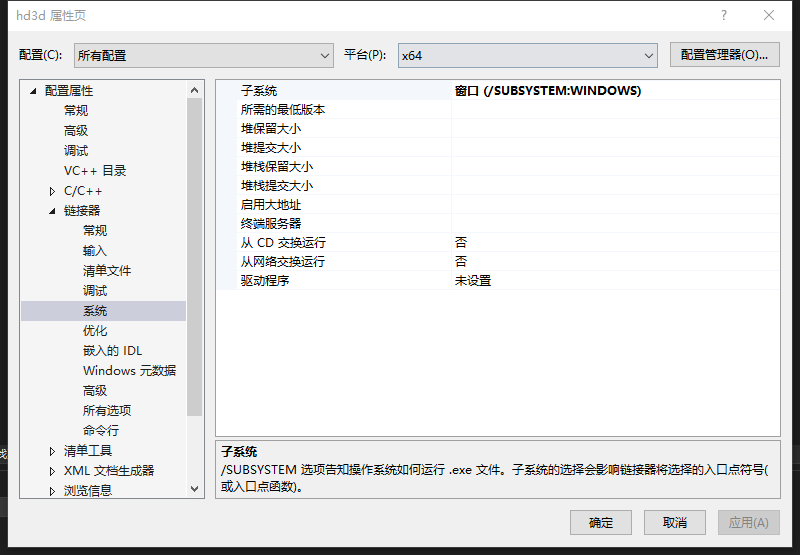

由于设置的是窗口系统，所以不能使用 `main` 作为入口函数，而是 `WinMain`

```cpp
#include <Windows.h>

int WINAPI WinMain(HINSTANCE hInstance, 
					HINSTANCE hPrevInstance, 
					LPSTR lpCmdLine, 
					int nCmdSHow) {
	while (true)
	{
        // 防止程序结束 用 while 阻塞函数 
	}

	return 0;
}
```

[微软官方文档](https://learn.microsoft.com/zh-cn/windows/win32/)

根据文档解释，`WinMain` 函数的参数分别表示如下几个

- `hInstance` 是 实例的句柄 或模块的句柄。 当可执行文件加载到内存中时，操作系统使用此值来标识可执行文件或 EXE。 某些 Windows 函数需要实例句柄，例如加载图标或位图
- `hPrevInstance` 没有任何意义。 它在 16 位 Windows 中使用，但现在始终为零
- `pCmdLine` 以 Unicode 字符串的形式包含命令行参数
- `nCmdShow` 是一个标志，指示主应用程序窗口是最小化、最大化还是正常显示

> `nCmdShow` 的使用，[文档](https://learn.microsoft.com/zh-cn/windows/win32/api/winuser/nf-winuser-showwindow)中也有解释

至于 `WinMain` 函数返回值，一般来说操作系统不使用返回值，但是可以使用该值将状态代码传递给另一个程序

> 一般来说返回 0 表示没有任何问题 

至于 `WINAPI` 和 `CALLBACK` 宏

```cpp
#define CALLBACK    __stdcall
#define WINAPI      __stdcall
#define WINAPIV     __cdecl
```

一般来说

- `WINAPI` 指的是 `Windows API` 使用的一种调用约定。通常用于定义 `API` 函数，很多 `Windows API` 都这样
- `CALLBACK` 常用于回调函数，例如事件处理或窗口处理函数（如 `WindowProc`）。这确保这些函数能与发出回调的 Windows 操作系统兼容

使用 `__stdcall` 调用约定意味着参数从右至左被推送到堆栈上，且函数自己清理堆栈。这对于减少应用程序中的错误非常有用，因为堆栈管理是自动的

除了 `__stdcall` 之外，还有 `__cdecl` 和 `__fastcall`

- `__cdecl`: 参数同样是从右至左推入堆栈，但是调用者清理堆栈。这使得 `__cdecl` 支持可变数量的参数
- `__fastcall`: 一种尽可能通过寄存器而非堆栈传递参数的调用约定，可以提高函数的调用效率，特别是在参数数量较少时

因为 `__stdcall` 是由函数自己清理堆栈，所以需要明确知道堆栈上有多少字节需要被清理。所以 `__stdcall` 不支持可变数量参数。而 `__cdecl` 是调用者清理堆栈，所以根据传递给函数实际参数数量来调整堆栈指针

参数从左到右入栈的顺序不是在常见的 **C/C++** 调用约定中看到的模式，因为在 **C/C++** 中，无论是 `__cdecl` 还是 `__stdcall` 调用约定，参数都是从右到左入栈的。然而，在一些其他语言或特定的场景中，可能会看到从左到右的参数推入顺序。这些语言或平台可能设计了不同的调用约定来满足特定的需求或优化

使用 `WINAPI` 和 `CALLBACK` 宏的主要目的是确保函数与操作系统的互操作性，保持调用约定的一致性，从而使编译生成的代码能够正确地与操作系统交互。不正确的调用约定可能导致运行时错误，比如堆栈损坏，这会是难以调试的错误。通过标准化调用约定，`Windows` 确保了不同编译器和代码库之间的兼容性和稳定性

### 注册窗口

对于一个窗口程序来说，要做的事情有：窗口显示（窗口样式、行为等），在 `Win32` 程序中一般是先**注册**窗口类，再根据注册类创建窗口**实例**，实例就是真正控制的窗口
   
> 一个程序一般不止一个窗口

```cpp
ATOM
WINAPI
RegisterClassExW(
    _In_ CONST WNDCLASSEXW *);
#ifdef UNICODE
#define RegisterClassEx  RegisterClassExW
#else
#define RegisterClassEx  RegisterClassExA
#endif // !UNICODE
```

一般使用 `RegisterClassEx` 来注册类，它是 `RegisterClass` 函数的扩展

- `RegisterClass` 参数为 `WNDCLASS` 的结构指针
- `RegisterClassEx` 参数为 `WNDCLASSEX` 的结构指针，该结构包括 `WNDCLASS` 的全部内容，并添加了额外字段：小图标(`hIconSm`)、任务栏图标等

```cpp
typedef struct tagWNDCLASSEXA {
  UINT      cbSize;             
  UINT      style;              
  WNDPROC   lpfnWndProc;        
  int       cbClsExtra;         
  int       cbWndExtra;
  HINSTANCE hInstance;
  HICON     hIcon;
  HCURSOR   hCursor;
  HBRUSH    hbrBackground;
  LPCSTR    lpszMenuName;
  LPCSTR    lpszClassName;
  HICON     hIconSm;
} WNDCLASSEXA, *PWNDCLASSEXA, *NPWNDCLASSEXA, *LPWNDCLASSEXA;
```

[WNDCLASSEX](https://learn.microsoft.com/zh-cn/windows/win32/api/winuser/ns-winuser-wndclassexa) 官方解释

官方文档对结构体成员属性有比较详细的解释，这里就不再搬运

需要注意的是 `style` 属性，我们使用的是 `CS_OWNDC`，也就是为类中的每个窗口分配唯一的设备上下文，也就是 `Device Context` 简称 `DC`，然后每个窗口就能被独立渲染。通常情况下，多个窗口可能会共享相同的设备上下文。如果一个窗口类被定义为 `CS_OWNDC`，则每个该类的窗口将获取一个独占的设备上下文，并保持这个设备上下文，直到窗口被销毁。这意味着窗口不需要在每次绘制时重新获取设备上下文，可以提高绘制效率

> 关于 `style` 的[官方解释](https://learn.microsoft.com/zh-cn/windows/win32/winmsg/window-class-styles)

另一个需要注意的是 `WNDPROC lpfnWndProc`，指向窗口过程的指针。这个函数将处理所有有关这个窗口的信息，这些消息可以是用户的操作（如键盘输入、鼠标移动、点击等），或者是系统事件（如绘制消息、窗口大小改变等）。

```cpp
typedef LRESULT (CALLBACK* WNDPROC)(HWND, UINT, WPARAM, LPARAM);
```

关于 `WNDPROC` 在[官方文档](https://learn.microsoft.com/zh-cn/windows/win32/api/winuser/nc-winuser-wndproc)有比较详细的解释

### 创建窗口

创建窗口一般使用 `CreateWindowExA` 函数

```cpp
HWND CreateWindowExA(
  [in]           DWORD     dwExStyle,   // 窗口样式
  [in, optional] LPCSTR    lpClassName,
  [in, optional] LPCSTR    lpWindowName,
  [in]           DWORD     dwStyle,     // 窗口样式
  [in]           int       X,           // 窗口位置 X 坐标
  [in]           int       Y,           // 窗口位置 Y 坐标
  [in]           int       nWidth,      // 窗口宽度
  [in]           int       nHeight,     // 窗口高度
  [in, optional] HWND      hWndParent,
  [in, optional] HMENU     hMenu,
  [in, optional] HINSTANCE hInstance,
  [in, optional] LPVOID    lpParam      // 用与传递自定义数据
);
```

关于创建窗口，[官方文档](https://learn.microsoft.com/zh-cn/windows/win32/api/winuser/nf-winuser-createwindowexa)提供了比较详细的解释

创建窗口之后需要展示窗口， 也就是 `ShowWindow`

```cpp
BOOL ShowWindow(
  [in] HWND hWnd,
  [in] int  nCmdShow
);
```

关于显示窗口，[官方文档](https://learn.microsoft.com/zh-cn/windows/win32/api/winuser/nf-winuser-showwindow)有比较详细的解释

```cpp
#include <Windows.h>

int WINAPI WinMain(HINSTANCE hInstance,
	HINSTANCE hPrevInstance,
	LPSTR lpCmdLine,
	int nCmdSHow) {

	const wchar_t* pClassName = L"hw3dbutts";

	// 注册类
	WNDCLASSEX wc = { 0 };
	wc.cbSize = sizeof(wc);
	wc.style = CS_OWNDC;
	wc.lpfnWndProc = DefWindowProc;
	wc.cbClsExtra = 0;
	wc.cbWndExtra = 0;
	wc.hInstance = hInstance;
	wc.hIcon = nullptr;
	wc.hCursor = nullptr;
	wc.hbrBackground = nullptr;
	wc.lpszMenuName = nullptr;
	wc.lpszClassName = pClassName;
	wc.hIconSm = nullptr;
	RegisterClassEx(&wc);

	// 创建窗口
	HWND hWnd = CreateWindowEx(
		WS_EX_RIGHTSCROLLBAR,
		pClassName,
		L"Hello World",
		WS_SYSMENU | WS_CAPTION | WS_MAXIMIZEBOX,
		200, 200, 640, 480,
		nullptr, nullptr, hInstance, nullptr
	);

	// 展示窗口
	ShowWindow(hWnd, SW_SHOW);


	while (true)
	{

	}

	return 0;
}
```

然后就可以得到一个不能做任何事情的窗口

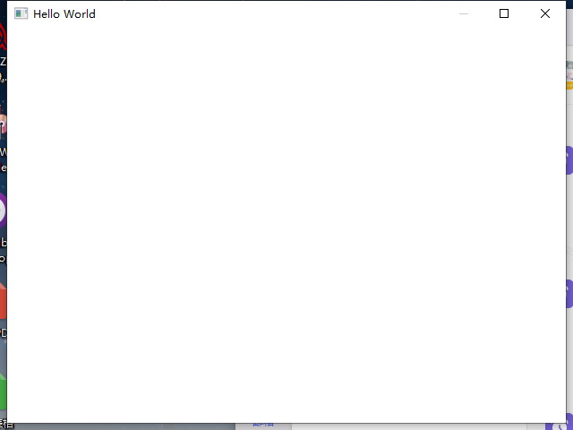

### 消息循环

对于窗口来说，除了窗口显示之外，还需要处理信息

比如 `Visual Studio` 需要处理键盘输入，我们要处理的窗口消息(`Window Message`) 本质上来说就是**事件**(`Event`)

当鼠标点击、鼠标移动、键盘输入等事件触发之后，窗口会首先把消息按顺序放进到消息队列(`Message Queue`) 中，可以通过 `GetMessage` 来获取队列中的消息，之后通过 `DispatchMessage` 把消息从应用传递给对应的窗口的 `lpfnWndProc` 函数

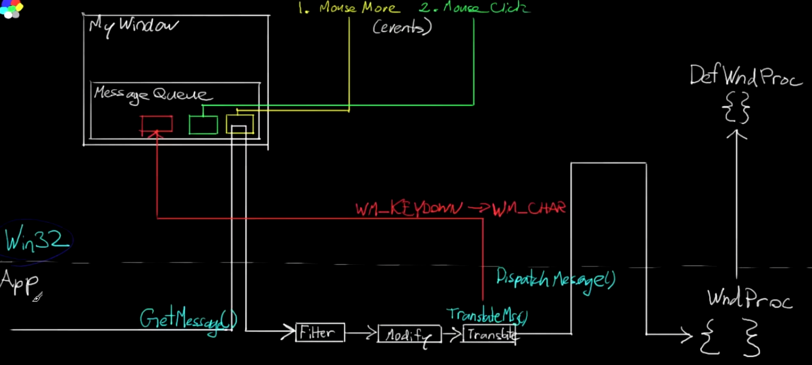

```cpp
BOOL GetMessage(
  [out]          LPMSG lpMsg,           // 消息的指针
  [in, optional] HWND  hWnd,            // 处理信息的窗口指针
  [in]           UINT  wMsgFilterMin,
  [in]           UINT  wMsgFilterMax
);
```

`wMsgFilterMin` 和 `wMsgFilterMax` 用与过滤信息

如果 `hWnd` 为 `NULL`，`GetMessage` 将检索属于当前线程的任何窗口的消息

`GetMessage` 的值也同样需要注意，如果是退出窗口 `WM_QUIT` 则返回值为 0，否则是非零值。如果出现错误，则返回 -1

```cpp
LRESULT CALLBACK WndProc(HWND hWnd, UINT msg, WPARAM wParam, LPARAM lParam) {
	switch (msg)
	{
	case WM_CLOSE:
		PostQuitMessage(69);
		break;
	default:
		break;
	}
	return DefWindowProc(hWnd, msg, wParam, lParam);
}

// WinMain function 
{
    // Do Something 

	// 消息处理
	MSG msg;
	BOOL gResult;

	while ((gResult = GetMessage(&msg, nullptr, 0, 0)) > 0)
	{
		TranslateMessage(&msg);
		DispatchMessage(&msg);
	}

	if (gResult < 0) {
		return -1;	// 表示程序错误
	}
	return msg.wParam;	// 否则输出我们期望的值 也就是 PostQuitMessage 传入的参数值
}
```

这里使用 `WndProc` 自定义的函数来接管默认的 `DefWindowProc`(`Def` 开头表示 `Default`)，然后特殊处理 `WM_CLOSE` 时关闭程序，否则 `DefWindowProc` 只会关闭窗口而不会关闭进程

`PostQuitMessage` 函数将 `WM_QUIT` 消息发布到线程的消息队列并立即返回;函数只是向系统指示线程正在请求在将来的某个时间退出

当线程从其消息队列中检索 `WM_QUIT` 消息时，它应退出其消息循环，并将控制权返回到系统。 返回到系统的退出值必须是 `WM_QUIT` 消息的 `wParam` 参数

所以最后 `WinMain` 的输出是 `msg.wParam`，这样程序的代码是可以自定义的，未来可以通过这个结束码通知其他进程

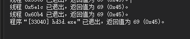

> 输出为 69 结果生效

这里使用 `PostQuitMessage(69)` 没有任何含义，单纯就是为了测试输出结果是否生效

### 窗口消息

消息的类型有很多

[list of windows Message](https://wiki.winehq.org/List_Of_Windows_Messages)

大概四百种类型，每种消息的触发条件可能需要自行测试

当然官网上也有一些消息类型的解释

除了官网和谷歌之外，还可以通过运行代码测试，何种情况触发何种宏来确定宏的触发条件

项目中使用 `WIndowsMessageMap` 来测试宏的触发，[代码地址](https://github.com/planetchili/hw3d/blob/master/hw3d/WindowsMessageMap.cpp)

以键盘按键为例

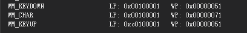

一次键盘的按下和松开会触发三个消息：`WM_KEYDOWN`、`WM_CHAR` 和 `WM_KEYUP`。当按下 `D` 键时，`WM_KEYDOWN` 的 `wParam` 输出为 **0x0000044** ；当按下 `F` 键时，`wParam` 输出为 **0x0000046**，所以 `wParam` 可能存储了按下按钮相关信息

- 关于 `WM_CHAR` 具体内容可以查[官方文档](https://learn.microsoft.com/zh-cn/windows/win32/inputdev/wm-char)
- 关于 `lParam` 表示的虚拟按键，可以通过[官方文档](https://learn.microsoft.com/zh-cn/windows/win32/inputdev/virtual-key-codes) 获取更多信息

`WM_CHAR` 是用于文本输入的信息，所以一些按键按下之后不会触发 `WM_CHAR`，比如 `F1`、`F2`，并且 `WM_CHAR` 是大小写敏感的，`WM_KEYDOWN` 则大小写不敏感

同样按下 `F` 键，`WM_KEYDOWN` 的 `wParam` 是 **0x0000046**，表示大写的 `F`；而 `WM_CHAR` 的 `wParam` 是 **0x0000066** 表示小写的 `f`

```cpp
case WM_CHAR:
{
	static std::string title;
	title.push_back((char)wParam);
	SetWindowText(hWnd, to_wide_string(title).c_str());
	break;
}
```

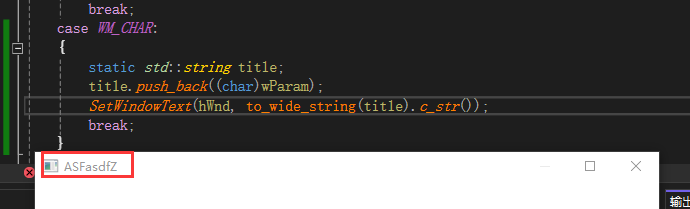

以鼠标点击为例

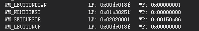

主要的消息触发就是：`WM_LBUTTONDOWN` 和 `WM_LBUTOTNUP` 来表示鼠标左键的点击和松开，对应的鼠标右键点击就是 `WM_RBUTTONDOWN` 和 `WM_RBUTTONUP`，鼠标移动有 `WM_MOUSEMOVE`

[LBUTTONDOWN](https://learn.microsoft.com/zh-cn/windows/win32/inputdev/wm-lbuttondown) 更多参数信息官方文档有说明

```cpp
POINT pt;
pt.x = GET_X_LPARAM(lParam);
pt.y = GET_Y_LPARAM(lParam);

pt = MAKEPOINTS(lParam);
```

通过上面俩种方法可以获得鼠标相对工作区左上角的坐标

```cpp
case WM_LBUTTONDOWN:
{
	POINTS pt = MAKEPOINTS(lParam);
	std::ostringstream oss;
	oss << "(" << pt.x << ", " << pt.y << ")";
	SetWindowText(hWnd, to_wide_string(oss.str()).c_str());
	break;
}
```

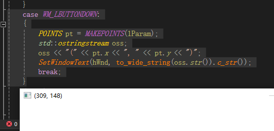

### 封装Window

由于该项目只有一个窗口，所以直接做成一个单例类

```cpp
class Window
{
private:
	// singleton manages registration/cleanup of window class
	class WindowClass;

	
private:
	static LRESULT CALLBACK HandleMsgSetup(HWND hWnd, UINT msg, WPARAM wParam, LPARAM lParam) noexcept;
	static LRESULT CALLBACK HandleMsgThunk(HWND hWnd, UINT msg, WPARAM wParam, LPARAM lParam) noexcept;
	LRESULT HandleMsg(HWND hWnd, UINT msg, WPARAM wParam, LPARAM lParam) noexcept;
}
```

`WindowClass` 是窗口的实例类，由 `Window` 来管理

`WindowClass` 是单例类，所以会在获取 `GetInstance` 时构建和注册一个窗口

```cpp
Window::WindowClass::WindowClass() noexcept : hInst(GetModuleHandle(nullptr))
{
	WNDCLASSEX wc = { 0 };
	wc.cbSize = sizeof(wc);
	wc.style = CS_OWNDC;
	wc.lpfnWndProc = HandleMsgSetup;
	// ... 其他注册内容
	RegisterClassEx(&wc);
}
```

在 `Window` 类创建的时候会通过 `WindowClass` 构建和注册一个窗口，再由 `Window` 来创建出窗口

```cpp
Window::Window(int InWidth, int InHeight, const wchar_t* InName) noexcept
{
	RECT Wr;
	Wr.left = 100;
	Wr.right = InWidth + Wr.left;
	Wr.top = 100;
	Wr.bottom = InHeight + 100;

	// AdjustWindowRect 会根据样式重新计算 RECT 中各个参数的值
	AdjustWindowRect(&Wr, WS_CAPTION | WS_MINIMIZEBOX | WS_SYSMENU, FALSE);

	// 重新设置过 RECT 参数，所以这里不能直接使用 InWidth 和 InHeight
	hWnd = CreateWindow(
		WindowClass::GetName(), InName,
		WS_CAPTION | WS_MINIMIZEBOX | WS_SYSMENU,
		CW_USEDEFAULT, CW_USEDEFAULT, Wr.right - Wr.left, Wr.bottom - Wr.top,
		nullptr, nullptr, WindowClass::GetInstance(), this
	);

	ShowWindow(hWnd, SW_SHOWDEFAULT);
}
```

这里需要注意的是 `wc.lpfnWndProc = HandleMsgSetup` 绑定的窗口信息函数

```cpp
LRESULT Window::HandleMsgSetup(HWND hWnd, UINT msg, WPARAM wParam, LPARAM lParam) noexcept
{
	if (msg == WM_NCCREATE)
	{
		const CREATESTRUCTW* const pCreate = reinterpret_cast<CREATESTRUCTW*>(lParam);
		Window* const pWnd = static_cast<Window*>(pCreate->lpCreateParams);
		SetWindowLongPtr(hWnd, GWLP_USERDATA, reinterpret_cast<LONG_PTR>(pWnd));
		SetWindowLongPtr(hWnd, GWLP_WNDPROC, reinterpret_cast<LONG_PTR>(&Window::HandleMsgThunk));
		return pWnd->HandleMsg(hWnd, msg, wParam, lParam);
	}
	return DefWindowProc(hWnd, msg, wParam, lParam);
}
```

当 `WM_NCCREATE` 被触发的时候，重新设置 `GWLP_USERDATA` 和 `GWLP_WNDPROC`，也就将消息的回调函数设置成了 `Window::HandleMsgThunk`

为什么要切换信息回调函数呢？

1. 组织性：`HandleMsgSetup` 专注于窗口创建时的设置工作，而 `HandleMsgThunk` 用于处理窗口的常规消息。这种分离使得代码更加清晰和易于管理
2. 安全性：在窗口创建期间，可能会收到各种消息，但在窗口类与窗口句柄关联之前，这些消息不应该被传递到窗口类的实例。`HandleMsgSetup` 确保只有在关联建立之后，消息才会被转发到窗口类的实例
3. 效率：一旦窗口创建完成并且关联建立，`HandleMsgThunk` 将直接转发消息到窗口类的实例，无需每次都检查 `WM_NCCREATE` 消息。这提高了消息处理的效率
4. 灵活性：如果将来需要在窗口创建过程中添加更多的初始化代码，只需修改 `HandleMsgSetup` 函数即可，而不会影响到常规消息处理的代码

这里不得不提到 `WM_NCCREATE` ，这个宏的 `NCCREATE` 可以拆分成 `NC` 和 `CREATE`，后者 `CREATE` 就是创建的意思；前者 `NC` 表示的是 `No-Client`

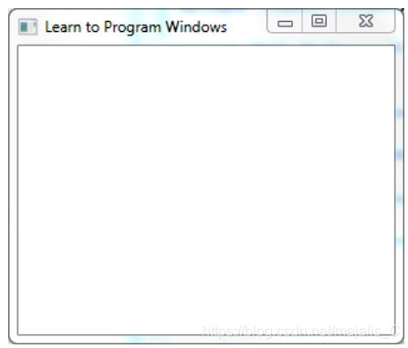

以上图为例，图中标题栏的边框，最大化最小化按钮，以及其他UI元素，这个边框称为 `Window`的 `no-client` 区域。

`WM_NCCREATE` 在 `WM_CREATE` 之前发送

在这之前的消息都会被 `HandleMsgSetup` 吃掉，因为客户端一般不用处理这之前的消息

通过 `SetWindowLongPtr` 就设定了 `GWLP_USERDATA` 用户自定义数据中存储的 `Window` 对象指针

```cpp
LRESULT Window::HandleMsgThunk(HWND hWnd, UINT msg, WPARAM wParam, LPARAM lParam) noexcept
{
	Window* const pWnd = reinterpret_cast<Window*>(GetWindowLongPtr(hWnd, GWLP_USERDATA));
	return pWnd->HandleMsg(hWnd, msg, wParam, lParam);
}
```

在 `HandleMsgThunk` 函数中，通过 `GetWindowLongPtr` 的方式将 `Window` 对象的指针从 `GWLP_USERDATA` 中取出，并将消息转发到 `HandleMsg` 中

由于 `WINAPI` 回调函数需要符合特定的签名，并且必须能够通过全局访问，因此它们不能直接绑定到类的非静态成员函数，这个函数必须是一个全局函数或静态成员函数

所以通过上面的方法，将全局事件分发到成员函数 `Window::HandleMsg` 中

### 异常处理

```cpp
// 异常基类
class ChiliException: public std::exception
{
public:
	ChiliException(int line, const char* file) noexcept;
	const char* what() const noexcept override;
	virtual const char* GetType() const noexcept;
	int GetLine() const noexcept;
	const std::string& GetFile() const noexcept;
	std::string GetOriginString() const noexcept;

private:
	int line;				// 错误出现的行
	std::string file;		// 错误出现的文件

protected:
	mutable std::string whatBuffer;
};

// Window 异常类
class Exception : public ChiliException {
public:
	Exception(int line, const char* file, HRESULT InHr);
	const char* what() const noexcept override;
	virtual const char* GetType() const noexcept;
	static std::string TranslateErrorCode(HRESULT InHr);
	HRESULT GetErrorCode() const noexcept;
	std::string GetErrorString() const noexcept;
private:
	HRESULT hr;
};

#define CHWND_EXCEPT(hr) Window::Exception(__LINE__, __FILE__, hr)
```

所以的异常都基于 `ChiliException` 扩展即可，重写 `GetType` 和 `what` 函数，即可将错误分类

那么，在日常使用的时候，如果 `Window` 需要抛出异常，直接使用 `CHWND_EXCEPT` 即可

常见的 `system error code` 在 [官方文档](https://learn.microsoft.com/zh-cn/windows/win32/debug/system-error-codes) 中有比较详细的介绍

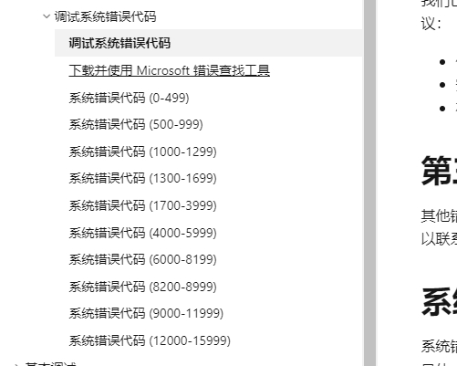

```cpp
throw CHWND_EXCEPT(ERROR_ARENA_TRASHED)
```

## D3D

[官方文档](https://learn.microsoft.com/zh-cn/windows/win32/direct3d12/direct3d-12-graphics)

### 架构/交换链

#### 架构

D3D: DirectX 3D

D3D 是面向对象对象的架构，建立在 `COM`(`Component Object Moduel`, **组件对象模型**) 对象上，这些对象表示着 D3D 中的实体(例如：着色器、纹理、状态等)，这些物体的父类都是 `Device`

`COM` 是 `D3D` 中使用的软件架构，旨在突进软件组件之间的交互。`COM` 是一个面向接口的系统，它定义了对象如何通过一组明确的接口与外部世界通信。所有 `COM` 对象都继承自 `IUnknow` 接口，这是 `COM` 规范中的基础接口，提供了对象**生命周期管理**(引用计数)和**接口查询功能**

在 `Direct3D` 中，几乎所有的对象（如设备、纹理、缓冲区等）都是以 `COM` 接口的形式实现的。这些对象实现 `COM` 接口，确保了它们可以在多种编程环境中以一致的方式使用，并且能够在不同版本的 `Direct3D` 间提供一定程度的向后兼容性

1. 接口查询(`Query Interface`)：每个 COM 对象都可以通过 `QueryInterface` 来查询是否支持特定的接口，这运行开发者根据运行时可以同的功能动态访问不同的接口
2. 引用计数：通过 `AddRef` 和 `Release` 来增减引用计数
3. 版本控制和兼容性，在不破坏现有程序的情况下引入新的接口和功能

`Device` 在 `Direct3D` 中扮演中心角色，是进行所有渲染操作和资源管理的核心接口。它是由 Direct3D 创建并返回给应用程序的一个 `COM` 接口，允许应用程序通过调用此接口的方法来执行图形和计算任务

- 纹理：通过 `ID3D11Device::CreateTexture2D` 等方法创建
- 着色器：通过 `ID3D11Device::CreateVertexShader`、`ID3D11Device::CreatePixelShader` 等方法创建
- 状态对象：如通过 `ID3D11Device::CreateBlendState`、`ID3D11Device::CreateRasterizerState` 等方法创建

在 Direct3D 中，Device 和其他资源如着色器、纹理、状态等之间的关系可以总结如下：

- **创建者与被创建者**：`Device` 是创建和管理所有其他图形资源的中心。所有这些资源（着色器、纹理、状态等）都由 `Device` 接口创建
- **COM 对象**：`Device` 以及它创建的所有其他资源都是 `COM` 对象，遵守 `COM` 接口和引用计数的规则
- **接口和实现解耦**：作为 `COM` `对象，Device` 和其他资源的实现被抽象和封装，开发者主要通过接口与这些资源交互。这允许 Direct3D 在不影响已有应用的情况下进行更新和改进

#### 交换链

如果显存中只存在一块区域用与显示，每次显卡都会将这块区域的数据发送到显示器中绘制。当我们更新数据时，可能只绘制了一部分就被显卡发送到显示进行绘制了，这样会出现屏幕的撕裂

所以一般使用俩块**缓冲区**，一块专门用于提供给显示器进行渲染，称为**前缓冲区**；一块专门用于实际绘制，称为**后缓冲区**

当后缓冲区绘制完毕之后，会使用 `Present` 的方法，将后缓冲区非常快的复制到前缓冲上；或者使用 `Flip` 的方法，直接将后缓冲重命名为前缓冲，前缓冲重命名为后缓冲

这里必须提到 `DXGI`(`DirectX Graphics Infrastructure`) 是一个低级的 API，用于抽象和管理图形硬件资源。它是 DirectX 家族的一部分，主要负责处理图形设备的枚举、显示监控的管理、交换链（用于图像呈现的缓冲区管理）以及帧的呈现

DXGI 为 DirectX 提供核心功能，特别是与显示设备和屏幕缓冲区的交互


[DXGI官方文档](https://learn.microsoft.com/zh-cn/windows/win32/direct3ddxgi/d3d10-graphics-programming-guide-dxgi)

`DXGI` 的目的是与内核模式驱动程序和系统硬件通信

应用程序可以直接访问 `DXGI`，也可以调用 `Direct3D API`，以处理与 `DXGI` 的通信。 如果应用程序需要枚举设备或控制如何将数据呈现给输出，则可能需要直接使用 `DXGI`

#### 上下文

D3D 除了创建交换链、设备外还会创建上下文(`Context`)，用于发出渲染你命令平配置渲染管道

一般来说 设备(`Device`) 用于创建物体，上下文(`Context`) 用于绘制

上下文分为即时和延迟俩种，当调用即时上下文时，会让硬件马上执行渲染工作；延迟上下文会建立指令集，然后将指令发布到即时上下文中，所以延迟上下文在多线程中表现良好

#### 命令队列、命令列表、命令分配器

图形编程时，CPU 和 GPU 都在参与处理工作，为了获得最佳性能，最好的情况就是让两者尽量同时工作

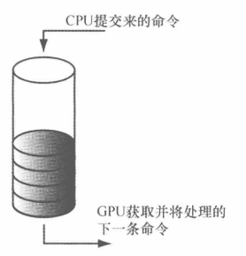

**命令队列**是一个接口，用于管理和调度待执行的命令列表。它负责接收提交的命令列表，并按照特定的顺序（如先入先出）将命令发送到 GPU 执行。命令队列可以是不同类型的，例如直接命令队列（用于大部分渲染和复制操作）、复制命令队列（专门用于复制操作）、计算命令队列（专门用于计算任务）

> 当一系列命令被提交到命令队列时，并不会被 GPU 立即执行，GPU 可能正在处理先前插入的命令

**命令分配器**是用于命令列表的内存管理。每个命令列表在记录命令之前都需要绑定一个命令分配器。命令分配器负责分配存储命令的内存空间。当命令列表被执行完毕后，可以重置命令分配器以回收内存资源，供未来的命令列表重用。重要的是，命令分配器在重置时必须确保没有任何与之相关的命令列表正在 GPU 上执行

**命令列表**是记录所有渲染和计算命令的接口。开发人员使用命令列表来设置渲染状态、绑定资源和调度渲染命令等。命令列表在使用前需要与一个命令分配器关联，以获得所需的内存资源。完成命令的记录后，命令列表会被提交给命令队列进行执行

- **命令分配器和命令列表**：每个命令列表在创建时都需要指定一个命令分配器。命令分配器为命令列表提供所需的内存资源。一个命令分配器可以与多个命令列表关联，但在任意时刻只能有一个命令列表与之关联。当命令列表执行完毕并且命令队列不再引用该命令列表时，可以重置命令分配器以供其他命令列表使用
- **命令队列和命令列表**：命令列表记录完毕后，通过命令队列提交给 GPU 执行。命令队列负责安排这些命令的执行顺序，并确保它们被正确处理

这种设计允许高度的并行和效率，因为可以同时记录多个命令列表，而这些命令列表又可以在不同的线程中被创建和管理。此外，通过独立控制命令的记录和执行，DirectX 12 能够提供比以往更精细的控制和更优的性能

#### Fence 围栏

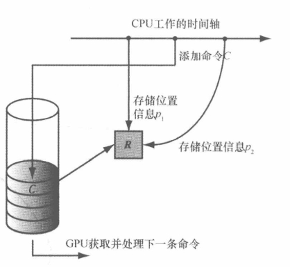

模型资源 R

1. CPU 一开始设置了 R 的位置信息 P1
2. 添加命令 C 给 GPU 绘制模型 R
3. CPU 继续计算，重新设置模型 R 的位置信息 P2

在进行到第三步的时候，如果 GPU 此时并没有执行完命令 C (可能还没执行，也可能在执行中)，所以模型的坐标不会被绘制到 P1 上，这与期待的命令不合

这种情况的一种解决方案是强制 CPU 等待，知道 GPU 完成所有的命令处理，达到某个指定的围栏点(`Fence Point`)

这种方法称为**刷新命令队列**，可以通过**围栏**(`Fence`) 来实现

```cpp
HRESULT CreateFence(
        UINT64            InitialValue,		// 围栏的初始值
        D3D12_FENCE_FLAGS Flags,
        REFIID            riid,
  [out] void              **ppFence
);
```

围栏对象维护着一个 UINT64 类型的值，这是用来表示围栏点的整数，每当需要标记新的围栏点时就将其加1

这样做并不完美，因为在等待 GPU 执行命令时 CPU 会进入空闲状态

#### 资源、描述符、描述符堆

通过 `D3D12_DESCRIPTOR_HEAP_DESC` 堆描述结构体，来描述一个堆，然后通过 `device` 来创建这个描述符堆，例如：`rtvHeapDesc` 和 `dsvHeapDesc`

常用的描述符有：

- `CBV`(constant buffer view）：常量缓冲区视图
- `SRV`(shader resource view)：着色器资源视图
- `UAV`(unorder access view)：无序访问视图
- `Sampler`：采样器，用于采样纹理资源
- `RTV`(render target view)：渲染目标视图
- `DSV`(depth/stencil view)：深度/模板视图

**描述符**：是对资源的引用，存储在描述符堆中，用于高效的 GPU 访问

**视图**：是资源的具体解释，定义了资源的使用方式（如读取、写入等），实际上通过描述符来创建

描述符堆（Descriptor Heap）是一种关键的资源管理工具，用于存储和组织资源描述符。资源描述符是指向资源（如纹理、缓冲区、采样器等）的句柄或指针，它提供了 GPU 所需的足够信息来访问这些资源

描述符堆实际上就是存放描述符的数组，本质上是存放特定类型描述符的一块内存

关于[D3D12_DESCRIPTOR_HEAP_DESC](https://learn.microsoft.com/zh-cn/windows/win32/api/d3d12/ns-d3d12-d3d12_descriptor_heap_desc)的各个属性文档中有比较的说明

描述符堆具体是存储什么描述符是通过 `D3D12_DESCRIPTOR_HEAP_DESC` 的 `Type` 属性来决定的

- `D3D12_DESCRIPTOR_HEAP_TYPE_CBV_SRV_UAV`: 可以存放CBV, SRV和UAV
- `D3D12_DESCRIPTOR_HEAP_TYPE_SAMPLER`: 存放sampler
- `D3D12_DESCRIPTOR_HEAP_TYPE_RTV`: 存放RTV
- `D3D12_DESCRIPTOR_HEAP_TYPE_DSV`: 存放DSV

描述符堆的 `Flag` 属性用来指定描述符堆的可见性，即可以被哪些管线阶段访问

- `D3D12_DESCRIPTOR_HEAP_FLAG_NONE`: 创建只由 CPU 访问的描述符堆，例如专门用于渲染目标视图（RTV）或深度模板视图（DSV）的描述符堆
- `D3D12_DESCRIPTOR_HEAP_FLAG_SHADER_VISIBLE`: 述符堆可以被着色器程序直接访问

> RTVs 和 DSVs 在常规渲染流程中不需要由着色器直接访问，因为它们通常是由输出合并阶段使用

在发出绘制命令之前，需要将本次绘制调用(`draw call`)相关的资源**绑定**(`bind`或`link`)到资源流水线上。部分资源可能在每次绘制调用时都会有所变化，所以每次按需更新绑定

`GPU` 资源并非直接与流水线相绑定，而是通过**描述符**对象来间接引用，通过描述符 GPU 既能获取实际的资源数据，也能了解到资源的必要信息，即资源格式和如何使用

使用描述符来表示资源是因为 GPU 资源实际上都是一些普通的内存块，很多时候只希望将部分数据绑定到渲染流水线，那么从整个资源中将其选出？或者内存块如何使用？这些都是记录在描述符中的

#### 资源转换

为了实现常见的渲染效果，经常会通过 GPU 对某个资源 R 按顺序进行先写后读两种操作

当 GPU 的写操作还没完成或者甚至没开始的时候，却开始读取资源，便会导致**资源冒险**

`Direct3D` 专门针对资源提供了一组相关状态，资源最开始处于默认状态，该状态会一直持续到应用程序通过 `Direct3D` 将其转换(`transition`)为另一中状态为止

比如如果要对某个纹理资源执行写操作，需要先将其设置为渲染目标状态；如果对纹理进行读操作，需要将其转换为着色器资源状态

通过命令列表设置**转换资源屏障**数组，即可执行资源的转换

```cpp
mCommandList->ResourceBarrier(1, &CD3DX12_RESOURCE_BARRIER::Transition(mDepthStencilBuffer.Get(),
		D3D12_RESOURCE_STATE_COMMON, D3D12_RESOURCE_STATE_DEPTH_WRITE));
```

#### 资源驻留

对于复杂场景，一些资源并不需要一开始就加载在显存中

一般来说，资源在创建时就会驻留在现存中，而当被销毁时清出。但是 DirectX 提供两种方法来主动控制资源的驻留

```cpp
HRESULT ID3D12Device::MakeResident

HRESULT ID3D12Device::Evict
```


### 初始化项目

封装报错宏

```cpp
#ifndef ThrowIfFailed
#define ThrowIfFailed(x)                                              \
{                                                                     \
    HRESULT hr__ = (x);                                               \
    std::wstring wfn = AnsiToWString(__FILE__);                       \
    if(FAILED(hr__)) { throw DxException(hr__, L#x, wfn, __LINE__); } \
}
#endif
```

需要**初始化窗口**和 **D3D 程序**

初始化窗口其实就是前面封装的 `Window`，而 `DX12` 中初始化 `D3D` 需要依次创建 

1. `DXGI` 工厂，用于创建设备和交换链，以及查询显卡（适配器）信息

```cpp
// 创建 DXGI 工厂
ThrowIfFailed(CreateDXGIFactory1(IID_PPV_ARGS(&mdxgiFactory)));
```

2. `Device` 设备，图形驱动程序的接口。它用于创建所有的D3D资源，如纹理、缓冲区和命令列表

```cpp
// 创建硬件 Device
HRESULT hardwareResult = D3D12CreateDevice(
	nullptr,             // nullptr 表示默认显卡适配器
	D3D_FEATURE_LEVEL_11_0,
	IID_PPV_ARGS(&md3dDevice));

// 如果硬件 Device 无法创建
if(FAILED(hardwareResult))
{
	// 通过 EnumWarpAdapter 获取 WARP 软件光栅器
	ComPtr<IDXGIAdapter> pWarpAdapter;
	ThrowIfFailed(mdxgiFactory->EnumWarpAdapter(IID_PPV_ARGS(&pWarpAdapter)));
	ThrowIfFailed(D3D12CreateDevice(pWarpAdapter.Get(),  D3D_FEATURE_LEVEL_11_0, IID_PPV_ARGS(&md3dDevice)));
}
```

> `WARP` （`Windows Advanced Rasterization Platform`），高性能的软件光栅器

3. `Command Queue`，命令队列，用于与设备通信的接口，用于提交执行命令列表，GPU 执行命令的调度基础

```cpp
void D3DApp::CreateCommandObjects()
{
	D3D12_COMMAND_QUEUE_DESC queueDesc = {};
	queueDesc.Type = D3D12_COMMAND_LIST_TYPE_DIRECT;
	queueDesc.Flags = D3D12_COMMAND_QUEUE_FLAG_NONE;
	ThrowIfFailed(md3dDevice->CreateCommandQueue(&queueDesc, IID_PPV_ARGS(&mCommandQueue)));

	ThrowIfFailed(md3dDevice->CreateCommandAllocator(
		D3D12_COMMAND_LIST_TYPE_DIRECT,
		IID_PPV_ARGS(mDirectCmdListAlloc.GetAddressOf())));

	ThrowIfFailed(md3dDevice->CreateCommandList(
		0,							// 0 表示节点掩码，用于单 GPU 系统
		D3D12_COMMAND_LIST_TYPE_DIRECT,
		mDirectCmdListAlloc.Get(), // Associated command allocator
		nullptr,                   // 表示初始状态下没有绑定任何管线状态对象（PSO）
		IID_PPV_ARGS(mCommandList.GetAddressOf())));

	// 创建后，默认命令列表是开放状态，可以记录命令。调用 Close 方法将其关闭，这是提交之前的必要步骤
	mCommandList->Close();
}
```

4. `Swap Chain` 交换链，用于管理渲染数据缓冲区

```cpp
void D3DApp::CreateSwapChain()
{
    // Release the previous swapchain we will be recreating.
    mSwapChain.Reset();

    DXGI_SWAP_CHAIN_DESC sd;
    sd.BufferDesc.Width = mClientWidth;				// 缓冲区分辨率的宽度
    sd.BufferDesc.Height = mClientHeight;			// 缓冲区分辨率的高度
    sd.BufferDesc.RefreshRate.Numerator = 60; 		// 刷新率
    sd.BufferDesc.RefreshRate.Denominator = 1;
    sd.BufferDesc.Format = mBackBufferFormat;		// 缓冲区的显示格式
    sd.BufferDesc.ScanlineOrdering = DXGI_MODE_SCANLINE_ORDER_UNSPECIFIED;	// 逐行扫描 / 隔行扫描
    sd.BufferDesc.Scaling = DXGI_MODE_SCALING_UNSPECIFIED;	// 图像如何对屏幕进行拉伸
    sd.SampleDesc.Count = m4xMsaaState ? 4 : 1;				// 每个像素的多样本数
    sd.SampleDesc.Quality = m4xMsaaState ? (m4xMsaaQuality - 1) : 0;	// 图像质量级别。 质量越高，性能越低
    sd.BufferUsage = DXGI_USAGE_RENDER_TARGET_OUTPUT;	// 
    sd.BufferCount = SwapChainBufferCount;				// 交换链中所用的缓冲区数量
    sd.OutputWindow = mhMainWnd;						// 渲染窗口的句柄
    sd.Windowed = true;									// true 窗口模式 / false 全屏模式
	sd.SwapEffect = DXGI_SWAP_EFFECT_FLIP_DISCARD;		// 设置交换效果，这里使用 `DXGI_SWAP_EFFECT_FLIP_DISCARD`，这意味着使用翻转模型并且在显示后丢弃旧内容，这种方式可以提高性能并减少延迟
    sd.Flags = DXGI_SWAP_CHAIN_FLAG_ALLOW_MODE_SWITCH;	// 

	// 使用 DXGI 工厂对象 (mdxgiFactory) 创建交换链，传入先前配置的描述符 sd 和使用的命令队列（mCommandQueue）
    ThrowIfFailed(mdxgiFactory->CreateSwapChain(
		mCommandQueue.Get(),
		&sd, 
		mSwapChain.GetAddressOf()));
}
```

5. `Descriptor Heaps` 描述符堆，用于春初资源描述符的几何
6. `Command Alloctor` 命令分配器，每个命令列表需要一个命令分配器用于管理内存
7. `Command List` 命令列表，用于记录所以的渲染命令
8. `Fence` 用于 CPU 和 GPU 之间的同步

```cpp
ThrowIfFailed(md3dDevice->CreateFence(0, D3D12_FENCE_FLAG_NONE, IID_PPV_ARGS(&mFence)));
```

> 围栏是一种同步机制，用于协调 CPU 和 GPU 之间的操作顺序。通过围栏，开发者可以控制资源的使用时机，确保在资源被 GPU 更新或读取前，CPU 上的操作已经完成，从而避免竞态条件和数据损坏

9.  资源和视图

以 `RTV`（`Render Target View`，**渲染目标视图**） 和 `DSV`（`Depth Stencil View`，**深度模板视图**） 为例

```cpp
void D3DApp::CreateRtvAndDsvDescriptorHeaps()
{
    D3D12_DESCRIPTOR_HEAP_DESC rtvHeapDesc;
    rtvHeapDesc.NumDescriptors = SwapChainBufferCount;
    rtvHeapDesc.Type = D3D12_DESCRIPTOR_HEAP_TYPE_RTV;
    rtvHeapDesc.Flags = D3D12_DESCRIPTOR_HEAP_FLAG_NONE;
	rtvHeapDesc.NodeMask = 0;
    ThrowIfFailed(md3dDevice->CreateDescriptorHeap(
        &rtvHeapDesc, IID_PPV_ARGS(mRtvHeap.GetAddressOf())));


    D3D12_DESCRIPTOR_HEAP_DESC dsvHeapDesc;
    dsvHeapDesc.NumDescriptors = 1;
    dsvHeapDesc.Type = D3D12_DESCRIPTOR_HEAP_TYPE_DSV;
    dsvHeapDesc.Flags = D3D12_DESCRIPTOR_HEAP_FLAG_NONE;
	dsvHeapDesc.NodeMask = 0;
    ThrowIfFailed(md3dDevice->CreateDescriptorHeap(
        &dsvHeapDesc, IID_PPV_ARGS(mDsvHeap.GetAddressOf())));
}
```

由于不同平台描述符大小不同，所以通过特定接口获得描述符大小，并存储下来供未来使用

```cpp
mRtvDescriptorSize = md3dDevice->GetDescriptorHandleIncrementSize(D3D12_DESCRIPTOR_HEAP_TYPE_RTV);
mDsvDescriptorSize = md3dDevice->GetDescriptorHandleIncrementSize(D3D12_DESCRIPTOR_HEAP_TYPE_DSV);
mCbvSrvUavDescriptorSize = md3dDevice->GetDescriptorHandleIncrementSize(D3D12_DESCRIPTOR_HEAP_TYPE_CBV_SRV_UAV);
```

### Resize

在所有数据都初始化完毕之后，就可以根据窗口大小和视口大小来设置数据

由于这些操作在屏幕大小更改之后也要进行，所以直接一起封装到 `OnResize` 函数中

1. 检查关键对象存在，并清空命令队列

```cpp
assert(md3dDevice);
assert(mSwapChain);
assert(mDirectCmdListAlloc);

// Flush before changing any resources.
FlushCommandQueue();
```

2. 重置命令列表

```cpp
ThrowIfFailed(mCommandList->Reset(mDirectCmdListAlloc.Get(), nullptr));
```

3. 释放旧资源

释放所有交换链缓冲区和深度模板缓冲区的引用，准备重新创建它们

```cpp
for (int i = 0; i < SwapChainBufferCount; ++i)
    mSwapChainBuffer[i].Reset();
mDepthStencilBuffer.Reset();
```

4. 调整交换链大小

使用新的窗口 dimensions 调整交换链缓冲区的大小。mClientWidth 和 mClientHeight 为新的尺寸

```cpp
ThrowIfFailed(mSwapChain->ResizeBuffers(SwapChainBufferCount, mClientWidth, mClientHeight, mBackBufferFormat, DXGI_SWAP_CHAIN_FLAG_ALLOW_MODE_SWITCH));
```

5. 重新创建和绑定 RTV

重新获取每个交换链缓冲区的引用，并为每个缓冲区创建新的 RTV

```cpp
CD3DX12_CPU_DESCRIPTOR_HANDLE rtvHeapHandle(mRtvHeap->GetCPUDescriptorHandleForHeapStart());
for (UINT i = 0; i < SwapChainBufferCount; i++)
{
    ThrowIfFailed(mSwapChain->GetBuffer(i, IID_PPV_ARGS(&mSwapChainBuffer[i])));
    md3dDevice->CreateRenderTargetView(mSwapChainBuffer[i].Get(), nullptr, rtvHeapHandle);
    rtvHeapHandle.Offset(1, mRtvDescriptorSize);
}

```

6. 创建新的深度/模板缓冲区

配置并创建新的深度/模板缓冲区以匹配新的窗口尺寸

设置资源的类型、宽度、高度和格式等属性

创建深度模板视图 (DSV)

```cpp
// Various settings for the depth/stencil buffer are defined here.
D3D12_RESOURCE_DESC depthStencilDesc;
...
ThrowIfFailed(md3dDevice->CreateCommittedResource(...));

D3D12_DEPTH_STENCIL_VIEW_DESC dsvDesc;
...
md3dDevice->CreateDepthStencilView(mDepthStencilBuffer.Get(), &dsvDesc, DepthStencilView());
```

7. 设置资源状态和执行命令

之前创建的深度模板视图是一个 `Texture2D` 的资源，资源需要设置状态才能给对应部分使用，所以使用 `CD3DX12_RESOURCE_BARRIER::Transition` 设置资源状态

```cpp
// Transition the resource from its initial state to be used as a depth buffer.
mCommandList->ResourceBarrier(1, &CD3DX12_RESOURCE_BARRIER::Transition(mDepthStencilBuffer.Get(),
	D3D12_RESOURCE_STATE_COMMON, D3D12_RESOURCE_STATE_DEPTH_WRITE));

// Execute the resize commands.
ThrowIfFailed(mCommandList->Close());
ID3D12CommandList* cmdsLists[] = { mCommandList.Get() };
mCommandQueue->ExecuteCommandLists(_countof(cmdsLists), cmdsLists);
```

8. 等待命令执行完毕，更新视口大小

```cpp
// Wait until resize is complete.
FlushCommandQueue();

// Update the viewport transform to cover the client area.
mScreenViewport.TopLeftX = 0;
mScreenViewport.TopLeftY = 0;
mScreenViewport.Width    = static_cast<float>(mClientWidth);
mScreenViewport.Height   = static_cast<float>(mClientHeight);
mScreenViewport.MinDepth = 0.0f;
mScreenViewport.MaxDepth = 1.0f;

mScissorRect = { 0, 0, mClientWidth, mClientHeight };
```

### Draw

通过 `OnResize` 创建/更新了所有数据，然后通过 `Draw` 就可以根据已有数据进行绘制

```cpp
void InitDirect3DApp::Draw(const GameTimer& gt)
{
	// 重置命令分配器和命令列表
	ThrowIfFailed(mDirectCmdListAlloc->Reset());
    ThrowIfFailed(mCommandList->Reset(mDirectCmdListAlloc.Get(), nullptr));

	// 设置资源状态转换
	// 这行代码指示 GPU 将当前后台缓冲区的状态从 PRESENT（表示缓冲区已准备好显示）转换为 RENDER_TARGET（表示缓冲区准备接受渲染命令）
	mCommandList->ResourceBarrier(1, &CD3DX12_RESOURCE_BARRIER::Transition(CurrentBackBuffer(),
		D3D12_RESOURCE_STATE_PRESENT, D3D12_RESOURCE_STATE_RENDER_TARGET));

	// 设置视口和剪裁矩形
    mCommandList->RSSetViewports(1, &mScreenViewport);
    mCommandList->RSSetScissorRects(1, &mScissorRect);

	// 清除后台缓冲区和深度缓冲区 
	// 使用 Colors::LightSteelBlue 来填充后台缓冲区颜色
	mCommandList->ClearRenderTargetView(CurrentBackBufferView(), Colors::LightSteelBlue, 0, nullptr);
	mCommandList->ClearDepthStencilView(DepthStencilView(), D3D12_CLEAR_FLAG_DEPTH | D3D12_CLEAR_FLAG_STENCIL, 1.0f, 0, 0, nullptr);
	
	// 指定 GPU 在渲染过程中使用的渲染目标（后台缓冲区）和深度模板视图
	mCommandList->OMSetRenderTargets(1, &CurrentBackBufferView(), true, &DepthStencilView());
	
	// 在渲染命令完成后，将后台缓冲区的状态从 RENDER_TARGET 转换回 PRESENT，准备显示
	mCommandList->ResourceBarrier(1, &CD3DX12_RESOURCE_BARRIER::Transition(CurrentBackBuffer(),
		D3D12_RESOURCE_STATE_RENDER_TARGET, D3D12_RESOURCE_STATE_PRESENT));

	// 提交命令列表，执行和呈现
	ThrowIfFailed(mCommandList->Close());
 
	ID3D12CommandList* cmdsLists[] = { mCommandList.Get() };
	mCommandQueue->ExecuteCommandLists(_countof(cmdsLists), cmdsLists);
	
	ThrowIfFailed(mSwapChain->Present(0, 0));
	mCurrBackBuffer = (mCurrBackBuffer + 1) % SwapChainBufferCount;

	//  后台缓冲区序号更新和命令队列清空
	FlushCommandQueue();
}
```

`mCurrBackBuffer = (mCurrBackBuffer + 1) % SwapChainBufferCount` 用于获取当前能够使用的后台缓冲区，当前缓冲区正在使用，所以下一帧只能用另一个，避免使用同一个缓冲区

### 基本运行框架

基本按照之前的 Windows 窗口程序来运行

如果存在消息，则优先处理窗口信息；如果信息都处理完了，则开始更新数据和绘制画面

如果 `mAppPaused`，一般是处在后台，那么直接粗暴的 `Sleep`

```cpp
int D3DApp::Run()
{
	MSG msg = {0};
 
	mTimer.Reset();

	while(msg.message != WM_QUIT)
	{
		// If there are Window messages then process them.
		if(PeekMessage( &msg, 0, 0, 0, PM_REMOVE ))
		{
            TranslateMessage( &msg );
            DispatchMessage( &msg );
		}
		// Otherwise, do animation/game stuff.
		else
        {	
			mTimer.Tick();

			if( !mAppPaused )
			{
				CalculateFrameStats();
				Update(mTimer);	
                Draw(mTimer);
			}
			else
			{
				Sleep(100);
			}
        }
    }

	return (int)msg.wParam;
}
```

