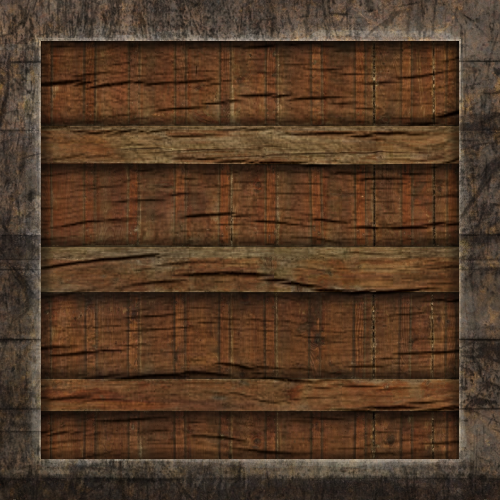
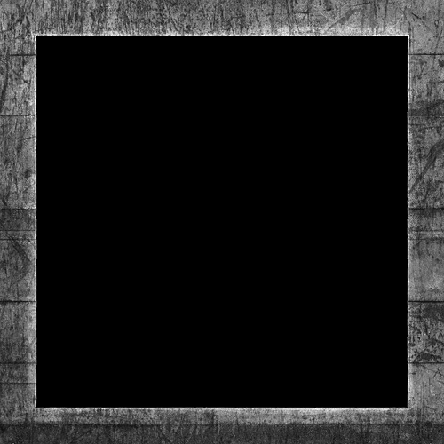
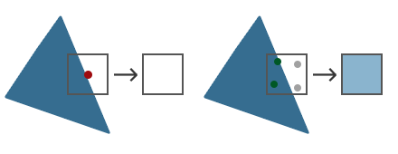
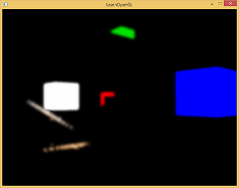

# OpenGl Demo

- 配合 src/OpenGLDemo 项目使用
- 配合 [learn-opengl-cn](learnopengl-cn.github.io) 使用

## 创建项目

这次使用的是 GLFW 和 GLAD

- `GLFW` 管理窗口和事件
- `GLAD` 管理版本

### 初始化项目

```cpp
glfwInit();                                                             // 初始化
glfwWindowHint(GLFW_CONTEXT_VERSION_MAJOR, 3);                          // 设置主版本为 3
glfwWindowHint(GLFW_CONTEXT_VERSION_MINOR, 3);                          // 设置次版本为 3.  MAJOR + MINOR 得到 3.3 版本
glfwWindowHint(GLFW_OPENGL_PROFILE, GLFW_OPENGL_CORE_PROFILE);          // 使用核心模式 Core-Profile
// 在 macOS 上启用向前兼容（Forward Compatibility），确保代码符合苹果平台的严格限制
// glfwWindowHint(GLFW_OPENGL_FORWARD_COMPAT, GL_TRUE);                 // MacOS 系统使用 
```

`GLFW_OPENGL_PROFILE` 设置 OpenGL 使用模式：**核心模式** or **兼容模式**

- **核心模式**
  - 3.2 之后引入的上下文模式
  - 完全移除旧版 OpenGL 的遗留功能（如固定管线函数 glBegin/glEnd、立即模式等）
  - 所有渲染必须通过可编程管线（Shader）完成，强制开发者使用现代 OpenGL 的最佳实践（如 VBO、VAO、着色器等）
- **兼容模式**
  - 允许新旧 OpenGL API 混合使用，保留传统功能（如固定管线），但可能导致代码臃肿和性能损失
  - 通常不建议使用，除非需要维护旧代码

一般需要显示设置目标模式，部分驱动可能默认选择兼容模式

### 创建窗口视口

使用 `glfwCreateWindow` 创建窗口，使用 `glfwMakeContextCurrent` 设置窗口环境上下文，使用 `glViewport` 设置视口大小

```cpp
GLFWwindow* window = glfwCreateWindow(800, 600, "LearnOpenGL", NULL, NULL);
if (window == NULL)
{
    std::cout << "Failed to create GLFW window" << std::endl;
    glfwTerminate();
    return -1;
}
glfwMakeContextCurrent(window);

if (!gladLoadGLLoader((GLADloadproc)glfwGetProcAddress))
{
    std::cout << "Failed to initialize GLAD" << std::endl;
    return -1;
}

glViewport(0, 0, 800, 600);
```

需要明确的是 **窗口** 和 **视口** 不是同一个东西


| 特性 | 窗口（Window） | 视口（Viewport） | 
| --- | --- | --- |
| 创建者 | 操作系统（通过 GLFW 创建） | OpenGL（通过 glViewport 设置） | 
| 作用 | 显示图形、接收输入事件 | 定义渲染内容在窗口中的显示区域 | 
| 坐标系 | 屏幕像素坐标（如 (0,0) 是左上角或左下角） | 相对于窗口的像素坐标（左下角为原点） | 
| 动态调整 | 用户可拖动窗口改变大小 | 需手动调用 glViewport 更新 | 
| 多视口支持 | 一个窗口只能有一个 | 一个窗口可以设置多个视口（多视角渲染） | 

这里只是恰好 `glfwCreateWindow` 创建的窗口和  `glViewport` 创建的视口大小一样

- `glViewport` 前两个参数 (x, y) 表示视口左下角相对窗口左下角的位置偏移
- `glViewport` 后两个参数 (width, height) 表示视口宽高(像素)

在窗口大小改变的时候，通常期望修改视口大小，可以通过注册回调函数来实现这个功能

```cpp
// 定义回调函数
void framebuffer_size_callback(GLFWwindow* window, int width, int height)
{
    glViewport(0, 0, width, height);
}

// 绑定回调函数
glfwSetFramebufferSizeCallback(window, framebuffer_size_callback);
```

在使用 `glViewPort` 之前，需要先初始化 `glad`

`glad` 用于管理 `OpenGL` 的函数指针，所以在使用 `OpenGL` 的函数之前，一定要先初始化 `glad`

在 glfw、flad、窗口、视口 都创建完毕之后，就可以开始**渲染循环**(`Render Loop`)

```cpp
// 每帧检查是否需要关闭窗口，不需要则进入渲染循环
while (!glfwWindowShouldClose(window))
{
    
    glfwSwapBuffers(window);    // 交换缓冲区
    glfwPollEvents();           // 检查触发的事件
}
```

`glfwSwapBuffers` 用于交换缓冲区，那么什么是缓冲区？为什么需要交换缓冲区？

缓冲区用于存储绘制生成的图像

由于图片不是一次性绘制好，而是一个像素一个像素的从左到右从上到下的绘制出来的，如果使用单缓冲区很容易出现图像闪烁的问题，并且由于最终图像不是瞬间显示出来，可能会导致渲染结果不真实

为了规避上面说的问题，一般采用双缓冲渲染窗口应用程序。**前缓冲**保存着最终输出的图像，所有渲染指令都在**后缓冲**上绘制

当所有渲染指令执行完毕之后，直接交换(`swap`)前后缓冲区，就能立刻得到最终图片，所以这个函数叫 `glfwSwapBuffers`

> `OpenGL` 默认启用双缓冲，可以通过 `glGetIntegerv` 函数检查 `GL_DOUBLEBUFFER` 的值是否为 1

当关闭窗口，准备退出程序的时候，需要释放/删除分配的所有资源，也就是在 `main` 函数退出的地方调用 `glfwTerminate` 

```cpp
glfwTerminate();
return 0;
```

### 输入和渲染

使用 `glfwGetKey` 可以通过 `window` 判断是否触发按键

```cpp
void ProcessInput(GLFWwindow* window)
{
    // 监听 ECS 按键
    if (glfwGetKey(window, GLFW_KEY_ESCAPE) == GLFW_PRESS)
        glfwSetWindowShouldClose(window, true);
}
```

使用 `glClear` 来清空屏幕，可以通过 `glClearColor` 设置清空屏幕所用的颜色

```cpp
// 如果不需要关闭窗口，则持续进入循环
while (!glfwWindowShouldClose(window))
{
    ProcessInput(window);       // 检查按键触发

    // 清空屏幕颜色 防止上一帧的内容影响这一帧的内容
    glClearColor(0.2f, 0.3f, 0.3f, 1.0f);
    glClear(GL_COLOR_BUFFER_BIT);

    // TestRenderImGUI(window); // ImGUI 测试 不用管

    glfwSwapBuffers(window);    // 交换缓冲区
    glfwPollEvents();           // 检查触发的事件
}
```

## 渲染流水线

> https://learnopengl-cn.github.io/01%20Getting%20started/04%20Hello%20Triangle/#_3


### 顶点着色器

顶点着色器的核心作用之一是将顶点的 3D 坐标 转换为另一种 3D 坐标（通常是 **裁剪空间坐标**）。这个过程涉及多个坐标系的变换：

- 模型空间（Local Space）：顶点在原始模型中的坐标（例如一个立方体的顶点坐标可能是 (-0.5, -0.5, 0.0)）。
- 世界空间（World Space）：通过模型矩阵（Model Matrix）将顶点坐标变换到场景中的全局位置（例如将立方体放置在 (x, y, z) 处）。
- 观察空间（View Space）：通过视图矩阵（View Matrix）将顶点坐标变换到摄像机视角下的坐标系。
- 裁剪空间（Clip Space）：通过投影矩阵（Projection Matrix）将顶点坐标变换到一个规范化空间（范围 [-1, 1]^3），超出范围的顶点会被裁剪掉。


裁剪剪切体块之外的顶点后，剩余顶点的位置将标准化为称为 NDC（**标准化设备坐标**）的通用坐标系。

标准化设备坐标是一个x、y和z值在-1.0到1.0的一小段空间。任何落在范围外的坐标都会被丢弃/裁剪，不会显示在你的屏幕上


通过使用由 `glViewport` 函数提供的数据，进行视口变换(`Viewport Transform`)，**标准化设备坐标**(`Normalized Device Coordinates`)会变换为**屏幕空间坐标**(`Screen-space Coordinates`)。所得的屏幕空间坐标又会被变换为片段输入到**片段着色器**中

顶点着色器除了处理位置坐标之外，还能对顶点的其他属性进行初步计算，比如

- 颜色：为顶点赋予颜色
- 纹理坐标：传递或动态生成纹理坐标（UV）
- 法线：对法线进行变化
- 自定义属性：如顶点动画中的位移

顶点着色器只能处理单个顶点的数据，无法直接访问其他顶点的信息

顶点着色器必须输出 `gl_Position` 裁剪空间坐标，其他属性通过 `out` 传递到后续阶段

顶点着色器代码大致如下

```glsl
#version 450 core

layout(location = 0) in vec3 position;
layout(location = 1) in vec4 inColor;
layout(location = 2) in vec2 texCoord;
layout(location = 3) in float texIndex;

uniform mat4 u_MVP;

out vec2 v_TexCoord;
out vec4 v_Color;
out float v_TexIndex;

void main() {
	gl_Position = u_MVP * vec4(position, 1.0);
	v_TexCoord = texCoord;
	v_TexIndex = int(texIndex);
	v_Color = inColor;
}
```

### 传入顶点数据

在 [OpenGLStudy](./README.md) 中有详细解释过 VertexArray、VertexBuffer、IndexBuffer，以及如何将数据传递给 OpenGL 以及顶点着色器

### 封装 Shader

[封装Shader](https://learnopengl-cn.github.io/01%20Getting%20started/05%20Shaders/#_6)

### Texture

在 [OpenGLStudy](./src/OpenGLStudy/OpenGLStudy/src/Texture.h) 项目中，有对 `Texture` 贴图的封装

```cpp
void Texture::Init(const std::string& filePath)
{
	m_FilePath = filePath;

	stbi_set_flip_vertically_on_load(1);
	m_LocalBuffer = stbi_load(filePath.c_str(), &m_Width, &m_Height, &m_BPP, 4);

	GL_CALL(glGenTextures(1, &m_RenderID));
	GL_CALL(glBindTexture(GL_TEXTURE_2D, m_RenderID));

	// 一定要设置的纹理 否则只能得到黑色纹理
	GL_CALL(glTexParameteri(GL_TEXTURE_2D, GL_TEXTURE_MIN_FILTER, GL_LINEAR));	// 指定缩小器
	GL_CALL(glTexParameteri(GL_TEXTURE_2D, GL_TEXTURE_MAG_FILTER, GL_LINEAR));	// 指定放大器
	GL_CALL(glTexParameteri(GL_TEXTURE_2D, GL_TEXTURE_WRAP_S, GL_CLAMP_TO_EDGE));
	GL_CALL(glTexParameteri(GL_TEXTURE_2D, GL_TEXTURE_WRAP_T, GL_CLAMP_TO_EDGE));

	// 传递数据 GL_RGBA8 后面加8 用与表示每个通道站多少位
	GL_CALL(glTexImage2D(GL_TEXTURE_2D, 0, GL_RGBA8, m_Width, m_Height, 0, GL_RGBA, GL_UNSIGNED_BYTE, m_LocalBuffer));

	GL_CALL(glBindTexture(GL_TEXTURE_2D, 0));

	if (m_LocalBuffer) {
		stbi_image_free(m_LocalBuffer);
		m_LocalBuffer = nullptr;
	}
}
```

这里对贴图进行设置时，涉及到了几个设置 `GL_TEXTURE_WRAP_T`、`GL_TEXTURE_WRAP_S`、`GL_TEXTURE_MAG_FILTER`、`GL_TEXTURE_MIN_FILTER`

根据 `docs.gl` 对 `glTexParameteri` 函数的[解释](https://docs.gl/gl4/glTexParameter)，对于贴图的设置还有很多种

| 贴图设置的参数名称 | 作用 | 可选值 | 默认值 |
| --- | --- | --- | --- | 
| GL_TEXTURE_MIN_FILTER | 设置纹理缩小（远距离）时的采样方式 | GL_NEAREST, GL_LINEAR, GL_NEAREST_MIPMAP_NEAREST, GL_LINEAR_MIPMAP_NEAREST, GL_NEAREST_MIPMAP_LINEAR, GL_LINEAR_MIPMAP_LINEAR | GL_NEAREST_MIPMAP_LINEAR | 
| GL_TEXTURE_MAG_FILTER | 设置纹理放大（近距离）时的采样方式 | GL_NEAREST, GL_LINEAR | GL_LINEAR | 
| GL_TEXTURE_WRAP_S/T/R | 设置纹理坐标在 S/T/R 轴超出 [0,1] 时的处理方式 | GL_REPEAT, GL_MIRRORED_REPEAT, GL_CLAMP_TO_EDGE, GL_CLAMP_TO_BORDER | GL_REPEAT | 
| GL_TEXTURE_BASE_LEVEL | 设置纹理 Mipmap 的最小使用级别（0 表示最高分辨率） | 非负整数 | 0 | 
| GL_TEXTURE_MAX_LEVEL | 设置纹理 Mipmap 的最大使用级别 | 非负整数 | 000（实际由硬件决定） | 
| GL_TEXTURE_MIN_LOD | 设置纹理细节级别（LOD）的最小值 | 浮点数 | 1000（允许最低细节） | 
| GL_TEXTURE_MAX_LOD | 设置纹理细节级别（LOD）的最大值 | 浮点数 | 1000（允许最高细节） | 
| GL_TEXTURE_LOD_BIAS | 设置 LOD 的偏移值（正值为模糊，负值为锐利） | 浮点数 | 0.0 | 
| GL_TEXTURE_COMPARE_MODE | 设置深度/模板纹理的比较模式 | GL_NONE（禁用比较）, GL_COMPARE_REF_TO_TEXTURE（启用比较） | GL_NONE | 
| GL_TEXTURE_COMPARE_FUNC | 设置深度比较函数（需与 GL_COMPARE_REF_TO_TEXTURE 配合使用） | GL_LEQUAL, GL_GEQUAL, GL_LESS, GL_GREATER, GL_EQUAL, GL_ALWAYS 等 | GL_LEQUAL | 
| GL_DEPTH_STENCIL_TEXTURE_MODE | 设置深度/模板纹理的采样模式（返回深度值还是模板值） | GL_DEPTH_COMPONENT, GL_STENCIL_INDEX | GL_DEPTH_COMPONENT | 
| GL_TEXTURE_SWIZZLE_R/G/B/A | 设置纹理颜色通道的映射关系（重新排列或复制通道） | GL_RED, GL_GREEN, GL_BLUE, GL_ALPHA, GL_ZERO, GL_ONE | 各通道对应自身（如 R→R） | 

#### 贴图设置

`GL_TEXTURE_MIN_FILTER` 和 `GL_TEXTURE_MAG_FILTER` 表示贴图放大缩小时，采用的纹理过滤方式

| GL_NEAREST | GL_LINEAR |
| --- | --- | --- |
| 中文 | 临近过滤 | 线性过滤 |
| 作用 | 选择离中心点最接近的纹理坐标的像素 | 基于纹理坐标附近的纹理像素，计算插值 |
| 表现效果 |  |  |


对比 `GL_NEAREST` 和 `GL_LINEAR` 在图片放大之后的表现效果，很明显发现 `GL_NEAREST` 锯齿感明显，`GL_LINEAR` 更加自然

贴图设置的 `GL_TEXTURE_WRAP_S/T/R` 的 `S/T/R` 对应可以理解为 x、y、z，这个设置的作用就是当纹理坐标超过 `[0, 1]` 的取值范围之后，应该如何处理


贴图设置的 `GL_TEXTURE_SWIZZLE_R/G/B/A` 用于通道映射

```cpp
glTexParameteri(GL_TEXTURE_2D, GL_TEXTURE_SWIZZLE_A, GL_RED)
```

通过上述代码的设置，读取贴图的 `alpha` 通道的时，从 `r` 通道读取

```cpp
glTexParameteri(GL_TEXTURE_2D, GL_TEXTURE_SWIZZLE_R, GL_RED);
glTexParameteri(GL_TEXTURE_2D, GL_TEXTURE_SWIZZLE_G, GL_RED);
glTexParameteri(GL_TEXTURE_2D, GL_TEXTURE_SWIZZLE_B, GL_RED);
```

通过上述代码的设置，读取贴图的 `RGB` 都是通过 `R` 通道获取值，比如 `R` 值为 0.8, `A` 值为 1.0，最后得到的就是 `(0.8, 0.8, 0.8, 1.0)` 的灰度值

#### 贴图的 Mipmap

在游戏运行过程中，物体有远有近

现在有一个大房子，用了一张 1024 * 1024 的贴图，在近距离观看细节丰富，但是远距离一般不需要这么丰富的细节，为了性能考虑可以把贴图换成 512 * 512；如果距离再远一些，即使使用 256 * 256 的贴图效果也不差

为了运行时性能，会根据举例的远近使用不同尺寸的贴图，这就是 `MipMap` **多级渐远纹理**


在 `OpenGL` 中可以使用 `glGenerateMipmap` 函数来创建多级纹理，而不需要自己手动创建


| 过滤方式 | 描述 | 
| --- | --- |
| GL_NEAREST_MIPMAP_NEAREST | 使用最邻近的多级渐远纹理来匹配像素大小，并使用邻近插值进行纹理采样 | 
| GL_LINEAR_MIPMAP_NEAREST | 使用最邻近的多级渐远纹理级别，并使用线性插值进行采样 | 
| GL_NEAREST_MIPMAP_LINEAR | 在两个最匹配像素大小的多级渐远纹理之间进行线性插值，使用邻近插值进行采样 | 
| GL_LINEAR_MIPMAP_LINEAR | 在两个邻近的多级渐远纹理之间使用线性插值，并使用线性插值进行采样 | 

```cpp
glTexParameteri(GL_TEXTURE_2D, GL_TEXTURE_MIN_FILTER, GL_LINEAR_MIPMAP_LINEAR);
glTexParameteri(GL_TEXTURE_2D, GL_TEXTURE_MAG_FILTER, GL_LINEAR);
```

> 注意，只有在 `GL_TEXTURE_MIN_FILTER` 也就是缩小的时候才设置 `MipMap`，`GL_TEXTURE_MAG_FILTER` 放大的时候设置无效

#### 纹理单元

在 [OpenGLStudy的着色器](./src/OpenGLStudy/OpenGLStudy/res/shader/Fragment.frag) 中使用 `uniform sampler2D u_Texture` 来接收一个贴图

但是在代码中却使用 `glUniform1i` 设置贴图为 0

```cpp
m_shader->SetUniform1i("u_Texture", 0);
```

这是因为，这里设置的 0 并不是指贴图自身，而是贴图的槽位，也被称为 **纹理单元**

```cpp
glActiveTexture(GL_TEXTURE0); // 在绑定纹理之前先激活纹理单元
glBindTexture(GL_TEXTURE_2D, texture);
```

使用 `glActiveTexture` 激活指定的纹理单元之后，使用 `glBindTexture` 会将贴图绑定到当前激活的纹理单元中

`OpenGL` 至少保证有 16 个纹理单元，根据机器不同有的可以支持 32 个，也就是支持 `GL_TEXTURE0` ~ `GL_TEXTURE15`，可以写成 `GL_TEXTURE0 + Index` 的方式

> `GL_TEXTURE8` 等价于 `GL_TEXTURE0 + 8`

#### 封装类

为了方便贴图的使用，封装了下面这样一个简单的 texture 类

```cpp
#include "Texture.h"
#include "stb_image.h"

Texture::~Texture()
{
	DeleteTexture();
}

void Texture::Init(const std::string& filePath)
{
	if (m_FilePath == filePath) {
		return;
	}

	DeleteTexture();
	m_FilePath = filePath;

	stbi_set_flip_vertically_on_load(1);
	m_LocalBuffer = stbi_load(filePath.c_str(), &m_Width, &m_Height, &m_BPP, 4);

	GL_CALL(glGenTextures(1, & m_TextureId));
	GL_CALL(glBindTexture(GL_TEXTURE_2D, m_TextureId));

	GL_CALL(glTexParameteri(GL_TEXTURE_2D, GL_TEXTURE_MIN_FILTER, GL_LINEAR));		// 指定缩小器
	GL_CALL(glTexParameteri(GL_TEXTURE_2D, GL_TEXTURE_MAG_FILTER, GL_LINEAR));		// 指定放大器
	GL_CALL(glTexParameteri(GL_TEXTURE_2D, GL_TEXTURE_WRAP_S, GL_CLAMP_TO_EDGE));	// 设置贴图超过 0~1 之后的读取方式
	GL_CALL(glTexParameteri(GL_TEXTURE_2D, GL_TEXTURE_WRAP_T, GL_CLAMP_TO_EDGE));	// 

	GL_CALL(glTexImage2D(GL_TEXTURE_2D, 0, GL_RGBA8, m_Width, m_Height, 0, GL_RGBA, GL_UNSIGNED_BYTE, m_LocalBuffer));

	GL_CALL(glBindTexture(GL_TEXTURE_2D, 0));		// 解绑

	if (m_LocalBuffer) {
		stbi_image_free(m_LocalBuffer);
		m_LocalBuffer = nullptr;
	}
}

void Texture::Bind(GLuint slot)
{
	GL_CALL(glActiveTexture(GL_TEXTURE0 + slot));
	GL_CALL(glBindTexture(GL_TEXTURE_2D, m_TextureId));
}

void Texture::UnBind()
{
	GL_CALL(glBindTexture(GL_TEXTURE_2D, 0));
}

int Texture::GetHeight()
{
	return m_Height;
}

int Texture::GetWidth()
{
	return m_Width;
}

void Texture::DeleteTexture()
{
	stbi_image_free(m_LocalBuffer);
	m_LocalBuffer = nullptr;

	GL_CALL(glDeleteTextures(1, &m_TextureId));
	m_TextureId = GL_ZERO;
}

这个类存在一个问题，下面这段代码在运行时会出现问题

```cpp
m_Tex1.Init("res/textures/test2.png");
m_Tex1.Bind(0);
m_Tex2.Init("res/textures/test3.png");
m_Tex2.Bind(1);
```

1. `m_Tex1.Bind(0)` 激活了 `GL_TEXTURE0` 槽位并绑定了贴图
2. 因为当前激活了 `GL_TEXTURE0`，所以`m_Tex2.Init` 仍然在 `GL_TEXTURE0` 槽位上进行
3. `m_Tex2.Init` 最后 `glBindTexture(GL_TEXTURE_2D, 0)` 解绑了 `GL_TEXTURE0` 上的贴图

那么，最后 `m_Tex1` 这个贴图就是绑定失败的，它被 `m_Tex2` 给无意间释放掉了

所以，`Texture` 建议下面这样操作，一起初始化，一起绑定

```cpp
m_Tex1.Init("res/textures/test2.png");
m_Tex2.Init("res/textures/test3.png");
m_Tex1.Bind(0);
m_Tex2.Bind(1);
```

## 坐标系统

`MVP` 矩阵 Module、View、Projection

模型的顶点坐标的原点一般是模型的中心点，通过 Module 矩阵得到顶点的世界坐标

得到世界坐标之后，将其转换成观察空间，也就是以相机为原点的坐标系下

最后通过 Projectin 将顶点坐标进行裁剪，对于空间外的点剔除

### 相机坐标

相机需要定位朝向和坐标，以此来确定视图矩阵

坐标无需多言，由 3 个 float 组成的结构体

```cpp
glm::vec3(0.0f, 0.0f, 3.0f);
```

`OpenGL` 是右手坐标系， X 轴正方向向右，Y轴正方向向上，Z轴正方向垂直屏幕向外

所以，如果想要看到位于（0,0） 坐标的物体，并且相机向后移动的时候，物体缩小，一般是让相机沿着 Z 轴正方向移动

接下来就是确定相机的朝向

通过两个向量就可以确定相机的朝向，一个是 `LoopAt` 一个是 `Up Vector`

确定 `LookAt` 的坐标点，通过 `LookAt` 坐标减去 相机坐标 得到一个方向向量，该向量就是相机朝向，通过这个向量可以确定相机朝向中的 `Yaw` 和 `Pitch`

`Up Vector` 表示相机向上的向量，通过这个向量，确定相机朝向的 `Rall`

不过有的时候，也可以需要知道相机的 `Right Vector`，不过这个比较好计算，通过 `Look` 和 `Up Vector` 通过**叉乘**便可以计算出 `Right Vector`

```cpp
// 计算 LookAt Vector
glm::vec3 cameraTarget = glm::vec3(0.0f, 0.0f, 0.0f);
glm::vec3 cameraDirection = glm::normalize(cameraPos - cameraTarget);

// 定义 Up Vector
glm::vec3 up = glm::vec3(0.0f, 1.0f, 0.0f);

// 计算 Right Vector
glm::vec3 cameraRight = glm::normalize(glm::cross(up, cameraDirection));
```

通过上面计算的向量和坐标，可以计算得到 View 矩阵

```cpp
glm::mat4 view;
						// 相机坐标					 	目标坐标							Up Vector
view = glm::lookAt(glm::vec3(0.0f, 0.0f, 3.0f),  glm::vec3(0.0f, 0.0f, 0.0f),  glm::vec3(0.0f, 1.0f, 0.0f));
```

记住，`OpenGL` 的坐标系是右手坐标系，y轴向上，x轴向左，z轴垂直屏幕向外


所以 `direction.y = sin(pitch)`


在计算 `xz` 轴是，向量长度是 `cos(pitch)` 

对应的点的坐标是 

- `direction.x = cos(pitch) * cos(yaw)`
- `direction.z = cos(pitch) * sin(yaw)`

注意：此时 `Camera Up Vector` 保持不变，因为 `Up Vector` 是用于控制 `Roll` 的，一般不会变化

## 颜色和光照

人能观察到物体的颜色，其实是物体不能吸收的颜色，也可以理解为反射的颜色


如果一个物体是白色，那么它对 RGB 三通道的颜色的吸收率是 0%，也就是 RGB 的反射率是 100%，所以它的 RGB 值为 (1.0, 1.0, 1.0)

如果一个物体是黑色，那么它对 RGB 三通道的颜色的吸收率是 100%，也就是 RGB 的反射率是 0%，所以它的 RGB 值为 (0.0, 0.0, 0.0)

如果一个物体是正红色，那么它对 RGB 三通道的颜色的吸收率是 0%，100%，100%，所以它的 RGB 值为 (1.0, 0.0, 0.0)

如果一个红色光打在蓝色的物体上，这个物体显示的颜色应该是黑色，光的颜色是 (1, 0, 0)，物体是蓝色，的三通道的反射率是 (0, 0, 1)，相乘得到的结果是 (0, 0, 0)

推理得到下面的基本光照计算

```cpp
glm::vec3 lightColor(l1, l2, l3);	// l1、l2、l3 光照的 RGB 值 
glm::vec3 toyColor(t1, t2, t3);		// t1、t2、t3 物体的 RGB 值
glm::vec3 finalColor = lightColor * toyColor;
```

现实生活中，光照是很复杂的，通过简化的光照模型可以用较少的计算量模拟出现实光照

使用的较多的简单光照模型就是 Phong 模型，它包括：环境光、漫反射光、镜面反射光

- 环境光照( `Ambient` )：即使在黑暗的情况下，通常也有一些光亮（月光、星光等），所以物体通常不是完全黑暗的，为了模拟这个设置了环境光照，他永远会给物体一些颜色
- 漫反射光照( `Diffuse` )：模拟光源对物体的方向性影响
- 镜面光照( `Specular` )：模拟光泽物体上出现的亮点


[101中关于反射的计算](../Games101/图形学.md#blinn-phong反射模型)

根据漫反射、镜面反射和环境光的计算，得到着色器内容如下

- 顶点着色器

通过 `GL_ARRAY_BUFFER` 获得顶点坐标和法线，通过 `uniform` 设置 MVP 矩阵，计算得到顶点的直接坐标 `FragPos`

```cpp
#version 330 core

layout(location = 0) in vec3 inPosition;
layout(location = 1) in vec3 inNormal;

uniform mat4 model;
uniform mat4 view;
uniform mat4 projection;

out vec3 Normal;
out vec3 FragPos;

void main() {
	gl_Position = projection * view * model * vec4(inPosition, 1.0);

	Normal = inNormal;
	FragPos = vec3(model * vec4(inPosition, 1.0));
}
```

- 片段着色器

通过 `uniform` 设置相机坐标和灯光坐标、灯光颜色、物体颜色等参数

通过顶点着色器得到顶点的世界坐标、顶点法线

```cpp
#version 330 core

layout(location = 0) out vec4 o_color;

in vec3 FragPos;                // 顶点坐标
in vec3 Normal;					// 法线向量

uniform vec3 viewPos;           // 相机坐标
uniform vec3 lightPos;          // 灯的坐标

uniform vec3 objectColor;       // 基本颜色
uniform vec3 lightColor;        // 灯光颜色

uniform float ambientStrength;  // 环境光强度
uniform float diffuseStrength;  // 漫反射强度
uniform float specularStrength;	// 镜面反射强度

void main() {
	// 环境光
	vec3 ambient = ambientStrength * lightColor;
	
	vec3 normal = normalize(Normal);
	vec3 lightDir = normalize(lightPos - FragPos);

	// 光的强度与距离有一定关系
	float lightDis = distance(lightPos, FragPos);
	float disRate = 1 / lightDis / lightDis;

	// 漫反射
	float rate = max(dot(lightDir, normal), 0.0);	// 因为光线可能从物体的反面，此时忽略这个，所以用 max(0.0, )
	vec3 diffuse = disRate * diffuseStrength * rate * lightColor;

	// 镜面反射
	vec3 enterViewDir = viewPos - FragPos;
	vec3 halfV = (lightDir + enterViewDir) / length(lightDir + enterViewDir);
	halfV = normalize(halfV);						// 半程向量
	float specularRate = pow(max(dot(halfV, normal), 0.0), 32);
	vec3 specular = disRate * specularStrength * specularRate * lightColor;

	vec3 result = (ambient + diffuse + specular) * objectColor;
	o_color = vec4(result, 1.0);
}
```

跟之前不同的是，这里修改了 `Vertex` 的结构体

```cpp
// 顶点信息 v1 版本 
struct Vertex_v1
{
	float position[3];			  // 顶点坐标
	float normal[3];			  // 法线贴图
};
```


物体具体是什么颜色，可以通过贴图来表现，物体的高光颜色强度也可以通过贴图来表示

| 物体漫反射颜色 | 物体镜面反射颜色 |
| --- | --- | 
|  |  |

在片段着色器中，可以使用 UV 坐标获取贴图颜色，将漫反射颜色 + 镜面反射颜色 得到的就是最后物体表现的颜色

```cpp
// 通过贴图 漫反射颜色
vec3 diffuse = light.diffuse * diff * texture(cubeMaterial.diffuse, TexCoords).rgb;
// 通过贴图 镜面反射颜色  
vec3 specular = light.specular * spec * texture(cubeMaterial.specular, TexCoords).rgb;  
```


观察箱子的表面

- 在镜面反射贴图中间是一片黑色，所以物体中间几乎没有镜面反射的高光
- 在镜面反射贴图四周是带有花纹的白色，所以物体四周会有不规则的高光，模拟出磨损的效果

### 光的种类

1. 平行光

对于现实的参考就是阳光，由于距离过远可以直接理解为平行光

对于这种光，无法也不需要定义坐标，只需要定义一个向量，表示光的方向即可

```cpp
struct Light {
    // vec3 position; // 使用定向光就不再需要了
    vec3 direction;

    vec3 ambient;
    vec3 diffuse;
    vec3 specular;
};
```

2. 点光源

对于现实的参考就是白炽灯，具有坐标，且向四周发出光亮

对于点光源，至少需要包含光源坐标，其实之前的案例就是几个最简单的点光源

除了坐标之外，通常会设置距离。目前常见的点光源都有两个距离：**开始衰减距离**和**最远光照距离**

显示生活中，灯光越近越亮，越远越按。同理，在虚拟世界也可以这么设置，**开始衰减距离**表示灯光强度开始衰减，**最远光照距离** 表示在此之外的物体不受该灯光影响


很明显中间这段弧线是个反函数，可以通过设置参数来控制函数曲线

```cpp
struct Light {
    vec3 position;  

    vec3 ambient;
    vec3 diffuse;
    vec3 specular;

    float constant;
    float linear;
    float quadratic;
};
```

> 计算例子： 1.0 / (constant + linear * distance + quadratic * distance * distance)

- 聚光

对于现实的参考就是聚光灯，具有坐标，和一个**特定方向**的照射光线

与点光源相似，有一个**开始衰减**的角度和一个照射的**最大角度**


| 变量定于 | 作用 |
| --- | --- 
| LightDir | 从片段指向光源的向量 |
| SpotDir | 聚光灯所指向的方向 |
| Phi | 聚光半径的切光角 |
| Theta | LightDir 和 SpotDir 向量之间的夹角 |

## 模型

使用 `assimp` 来加载模型
需要添加 `include` 和 `lib` 的路径

```bash
$(SolutionDir)Dependencies\assimp\include
$(SolutionDir)Dependencies\assimp\lib
```

需要添加 `assimpd.lib` 库

并且在生成事件中，将 `assimpd.dll` 复制到输出路径

```bash
copy /Y "$(SolutionDir)Dependencies\assimp\lib\assimpd.dll" "$(OutDir)"
```


> 编译时依赖 `assimpd.lib`，运行时依赖 `assimpd.dll`

编译 `win32` 平台的 `assimp` 使用命令行

```bash
mkdir build && cd build
cmake ../ -A win32
```

## 高级 OpenGL

### Blender

[在OpenGL学习的ReadMe.md中有解释过Blend](README.md/#关于混合)

这里需要重复强调的是，渲染顺序问题

由于开启了深度缓冲，如果存在两个半透明物体，A 离相机近，B 离相机远

- 先渲染 B 后渲染 A
  - 渲染 A 时由于深度缓冲的存在，将原本的颜色和 A 的颜色进行混合，然后覆盖深度缓冲
- 先显然 A 后渲染 B
  - 显然 B 时由于深度缓冲的存在，直接丢弃 B 片段的颜色，导致渲染结果错误

所以，在渲染时

1. 渲染所有不透明的物体
2. 对所有的透明物体进行排序，从远到近
3. 按顺序绘制所有透明物体

### 面剔除


### 帧缓冲

详见 [TestFrameBuffer.cpp](./src/OpenGLDemo/OpenGLDemo/src/testModule/TestFrameBuffer.cpp)

### 立方体贴图

立方体贴图就是一个包含了6个2D纹理的纹理，每个2D纹理都组成了立方体的一个面

立方体贴图有一个非常有用的特性，它可以通过一个方向向量来进行索引/采样


立方体贴图有一个经常使用的场景：**天空盒**

**天空盒** 顾名思义就是其实是将世界包围在一个巨大的盒子里面，然后通过当前相机朝向作为向量计算与立方体贴图交点，得到背景颜色信息

在绘制天空盒的时候，消除相机位移的影响，保证天空盒的中心永远在相机上，这样子就能保证天空盒不会由于相机移动导致偏移

对比将天空盒放大到特别大来模拟效果，首先过远的平面会被剔除，其次相机一直移动总归是能够移动到边界的

```cpp
// 通过将 4阶矩阵 转换为 3阶矩阵 去除位移信息，保证天空盒永远以相机为中心
auto cubeView = glm::mat4(glm::mat3(view));
```

绘制天空盒需要保证天空盒的深度永远是最底层的，有两种方案

1. 绘制天空盒时关闭深度写入，这样天空盒就会永远绘制带其他物体之后，虽然它离我们很近，但是实际的深度却很高
2. 根据深度计算的公式，将天空盒顶点的计算值永远设置为 1，那么其深度永远低于其他

前面写过顶点着色器，顶点其实是一个四维向量 (x、y、z、w)，顶点的 NDC 坐标其实 (x/w, y/w, z/w) 

所以，如果将天空盒的顶点 z 轴手动设置为 w，那么天空盒深度永远是 1，永远在其他物体的后面

```glsl
vec4 pos = projection * view * vec4(inPosition, 1.0);
gl_Position = pos.xyww;
```

### 高级数据

使用 `glBufferData` 会分配一块 GPU 内存，并将数据添加到这块内存中，如果设置为 null 则只会分配，不会填充

使用 `glBufferSubData` 可以填充缓冲的特定区域

`glBufferSubData` 函数定义如下

```cpp
void glBufferSubData(	GLenum target,
						GLintptr offset,
						GLsizeiptr size,
						const GLvoid * data);
```

`glBufferSubData` 函数使用如下

```cpp
// 创建并初始化顶点缓冲区
GLuint VBO;
glGenBuffers(1, &VBO);
glBindBuffer(GL_ARRAY_BUFFER, VBO);
float vertices[12] = { /* 初始6个顶点（每个含x,y） */ };
glBufferData(GL_ARRAY_BUFFER, sizeof(vertices), vertices, GL_DYNAMIC_DRAW);

// 更新第3到第4个顶点（索引2和3）
float updatedData[4] = {0.5f, 0.5f, -0.5f, -0.5f}; // 新坐标 (x1,y1, x2,y2)
glBufferSubData(GL_ARRAY_BUFFER, 2 * sizeof(float) * 2, sizeof(updatedData), updatedData);
```

使用 `glMapBuffer` 可以得到缓冲内存的指针，然后通过 `memcpy` 拷贝数据进去

```cpp
float data[] = {
  0.5f, 1.0f, -0.35f
  ...
};
glBindBuffer(GL_ARRAY_BUFFER, buffer);
// 获取指针
void *ptr = glMapBuffer(GL_ARRAY_BUFFER, GL_WRITE_ONLY);
// 复制数据到内存
memcpy(ptr, data, sizeof(data));
// 记得告诉OpenGL我们不再需要这个指针了
glUnmapBuffer(GL_ARRAY_BUFFER);
```

这里的 `glUnmapBuffer` 不是丢弃 `GL_ARRAY_BUFFER`，而是接触指针映射，即 `ptr` 指针无法映射到 GPU 内存中，继续使用 `ptr` 会导致错误

> 相当于 `glUnmapBuffer` 会释放 CPU 对缓冲区内存的映射权限

使用 `glCopyBufferSubData` 能够将一个缓冲目标的数据拷贝到另一个缓冲目标中

```cpp
void glCopyBufferSubData(	GLenum readTarget,
							GLenum writeTarget,
							GLintptr readOffset,
							GLintptr writeOffset,
							GLsizeiptr size);
```

> 函数定义

```cpp
// 创建两个缓冲区
GLuint vboSrc, vboDst;
glGenBuffers(1, &vboSrc);
glGenBuffers(1, &vboDst);

// 填充源缓冲区
float srcData[] = { /* 顶点数据 */ };
glBindBuffer(GL_COPY_READ_BUFFER, vboSrc);
glBufferData(GL_COPY_READ_BUFFER, sizeof(srcData), srcData, GL_STATIC_DRAW);

// 初始化目标缓冲区（大小与源相同）
glBindBuffer(GL_COPY_WRITE_BUFFER, vboDst);
glBufferData(GL_COPY_WRITE_BUFFER, sizeof(srcData), NULL, GL_STATIC_DRAW);

// 复制整个缓冲区
glCopyBufferSubData(
    GL_COPY_READ_BUFFER,
    GL_COPY_WRITE_BUFFER,
    0, 0, sizeof(srcData)
);

// 使用目标缓冲区渲染
glBindBuffer(GL_ARRAY_BUFFER, vboDst);
glVertexAttribPointer(0, 3, GL_FLOAT, GL_FALSE, 0, NULL);
glDrawArrays(GL_TRIANGLES, 0, 36);
```
> 使用案例

### 高级 GLSL

`Uniform` 缓冲对象，按照之前写过的着色器来看，我们需要对 模型、灯光、天空盒 等物体的着色器设置 model、view、projection 三个矩阵，但是 view 和 projection 矩阵都是相同的

为了避免重复设置， `OpenGL` 提供了 Uniform 缓冲对象

首先需要在 着色器中定义 Uniform 块

```glsl
// GLSL 着色器中定义的 Uniform 块
layout(std140) uniform MyUBO {
    mat4 viewMatrix;
    mat4 projectionMatrix;
    vec3 lightPosition;
    float lightIntensity;
};
```

Uniform 缓冲对象(Uniform Buffer Object) 也是一种缓冲，使用 `glGenBuffer` 来创建它

```cpp
GLuint ubo;
glGenBuffers(1, &ubo);
glBindBuffer(GL_UNIFORM_BUFFER, ubo);

// 根据 MyUBO 的定义 计算总大小（需手动对齐）
const GLsizeiptr uboSize = 
    sizeof(glm::mat4) * 2 +  // viewMatrix + projectionMatrix
    sizeof(glm::vec4) +      // lightPosition（vec3 按 vec4 对齐）
    sizeof(float);           // lightIntensity

glBufferData(GL_UNIFORM_BUFFER, uboSize, NULL, GL_DYNAMIC_DRAW);
```

使用之前提到过的 `glMapBuffer` + `memcpy` 来填入数据

```cpp
// 假设使用 glm 数学库
glm::mat4 view = ...;
glm::mat4 projection = ...;
glm::vec3 lightPos = ...;
float intensity = ...;

// 映射 UBO 并写入数据
glBindBuffer(GL_UNIFORM_BUFFER, ubo);
GLvoid* ptr = glMapBuffer(GL_UNIFORM_BUFFER, GL_WRITE_ONLY);

// 写入 viewMatrix（偏移 0）
memcpy(ptr, &view, sizeof(glm::mat4));

// 写入 projectionMatrix（偏移 sizeof(mat4)）
memcpy((char*)ptr + sizeof(glm::mat4), &projection, sizeof(glm::mat4));

// 写入 lightPosition（偏移 sizeof(mat4)*2，按 vec4 对齐）
glm::vec4 lightPosAligned(lightPos, 0.0f); // 填充为 vec4
memcpy((char*)ptr + sizeof(glm::mat4)*2, &lightPosAligned, sizeof(glm::vec4));

// 写入 lightIntensity（偏移 sizeof(mat4)*2 + sizeof(vec4)）
memcpy((char*)ptr + sizeof(glm::mat4)*2 + sizeof(glm::vec4), &intensity, sizeof(float));

glUnmapBuffer(GL_UNIFORM_BUFFER);
```

与 `Texture` 类似，将 Uniform Buffer Object 绑定到指定的槽上

```cpp
// 将 UBO 对象关联到绑定点 0
glBindBufferBase(GL_UNIFORM_BUFFER, 0, ubo);

// 对 shaderProgramA
GLuint uboIndexA = glGetUniformBlockIndex(shaderProgramA, "MyUBO");
glUniformBlockBinding(shaderProgramA, uboIndexA, 0); // 绑定到绑定点 0

// 对 shaderProgramB
GLuint uboIndexB = glGetUniformBlockIndex(shaderProgramB, "MyUBO");
glUniformBlockBinding(shaderProgramB, uboIndexB, 0); // 同样绑定到绑定点 0
```

这里有一个点需要注意到，那就是着色器中定义 Uniform 块时使用的 `std140`

`std140` 是 OpenGL 中用于定义 Uniform 缓冲对象(Uniform Buffer Object) 和 着色器缓冲对象(SSBO) **内存布局**的规则

目的是**显式控制**，使得 CPU 和 GPU 能够正确读取数据，避免因为硬件差异导致的数据错位

> 关于 `Uniform Buffer Object` 的测试用例可以在 `TestSkyBox.cpp` 中查看到

### 几何着色器

在顶点着色器之后，片段着色器之前运行

几何着色器的输入是一个图元（如点或三角形）的一组顶点

几何着色器可以在定点发送到下一个着色器之前对它们随意变化，也可以更改顶点的图元类型，或者生成更多顶点

下面这个顶点着色器，输入是一个 `triangles` 的图元，具有三个顶点，所以在 `main` 中执行了 `GenerateLine` 三次；输出指定是一个 `line_strip`

在 `GenerateLine` 函数中，每次调用 `EmitVertex` 就会将 `gl_Position` 的值发射出去，调用 `EndPrimitive` 时会将之前发射出去的所有 `gl_Position` 组合成指定的输出渲染图元

根据该 几何着色器 的代码，不难发现该函数实现的功能。基于输入的图元的三个顶点，根据每个顶点的法线，生成三个线段，并且将原本的 `triangles` 图元变换成 `line_strip` 线段，线段方向时顶点的法线方向，线段长度是 `MAGNITUDE`

```glsl
#version 330 core
layout (triangles) in;
layout (line_strip, max_vertices = 6) out;

in VS_OUT {
    vec3 normal;
} gs_in[];

uniform float MAGNITUDE = 0.05f;

// 添加与顶点着色器一致的 UBO 声明
layout (std140) uniform Matrices {
    mat4 view;
    mat4 projection;
};

void GenerateLine(int index)
{
    gl_Position = gl_in[index].gl_Position;
    EmitVertex();
    gl_Position = (gl_in[index].gl_Position + vec4(gs_in[index].normal, 0.0) * MAGNITUDE);
    EmitVertex();
    EndPrimitive();
}

void main()
{
    GenerateLine(0); // first vertex normal
    GenerateLine(1); // second vertex normal
    GenerateLine(2); // third vertex normal
}
```

### 实例化

这个实例化并不是创建出对象，而是更像单例的含义，即模型数据只存储一份，通过一些其他的数据差异来渲染出多个相同的物体

比如，有 100 个石头，如果真的加载 100 个模型和对应贴图，消耗会很大，并且每个石头会调用一次 draw-call。如果使用 gl_instanceID 那么只会加载模型和贴图一次，通过 gl_instanceID 来区分石头并动态修改其属性

使用 `glDrawArraysInstanced` 和 `glDrawElementsInstanced` 替代之前的 `glDrawArrays` 和 `glDrawElements`。在着色器中可以使用 `gl_InstanceID` 这个内置变量，该变量是一个从 0 开始的递增的变量，用于区分相同实例的不同物体。如果有 100 个石头，那么 `gl_InstanceID` 就是从 0 ~ 99

以下面的代码为例，在 顶点着色器 中，定义了一个 `offsets` 数组，通过 `gl_InstanceID` 数据来区分不同的物体，再通过序号动态修改每个物体的坐标

```glsl
#version 330 core
layout (location = 0) in vec2 aPos;
layout (location = 1) in vec3 aColor;

out vec3 fColor;

uniform vec2 offsets[100];

void main()
{
    vec2 offset = offsets[gl_InstanceID];
    gl_Position = vec4(aPos + offset, 0.0, 1.0);
    fColor = aColor;
}
```

在 CPU 阶段，可以使用下面代码设置 `offsets`

```cpp
shader.use();
for(unsigned int i = 0; i < 100; i++)
{
    shader.setVec2(("offsets[" + std::to_string(i) + "]"), translations[i]);
}
```

不过由于数组长度的限制，物体数量超过一定值之后**无法使用数组**，毕竟 `uniform` 定义的数组长度是有上限的

这个时候使用**实例化数组**，将数据定义成顶点属性，这样能存储更多内容，并且仅在**顶点着色器**渲染一个新的实例时才会更新

1. 新增一个顶点属性

```glsl
#version 330 core
layout (location = 0) in vec2 aPos;
layout (location = 1) in vec3 aColor;
layout (location = 2) in vec2 aOffset;
```

2. 创建顶点顶点缓冲并绑定数据

```cpp
unsigned int instanceVBO;
glGenBuffers(1, &instanceVBO);
glBindBuffer(GL_ARRAY_BUFFER, instanceVBO);
glBufferData(GL_ARRAY_BUFFER, sizeof(glm::vec2) * 100, &translations[0], GL_STATIC_DRAW);
glBindBuffer(GL_ARRAY_BUFFER, 0);
```

3. 设置顶点属性

```cpp
glEnableVertexAttribArray(2);
glBindBuffer(GL_ARRAY_BUFFER, instanceVBO);
glVertexAttribPointer(2, 2, GL_FLOAT, GL_FALSE, 2 * sizeof(float), (void*)0);
glBindBuffer(GL_ARRAY_BUFFER, 0);   
glVertexAttribDivisor(2, 1);
```

这里出现了一个新的函数 `glVertexAttribDivisor`，该函数时 OpenGL 用于控制顶点属性实例化渲染中如何更新的函数

```cpp
void glVertexAttribDivisor(
    GLuint index,   // 顶点属性位置（如 layout(location=2) 中的 2）
    GLuint divisor  // 除数（Divisor），表示每渲染多少个实例推进一次属性数据
);
```

| divisor 值 | 作用 |
| --- | --- |
| 0 | 每个顶点更新 |
| 1 | 每个实例更新 |
| N | 每渲染 N 个实例更新一次 |

> 比如 100 个石头，每 10 个石头共享同一个颜色，那么 `divisor` 的值就是 10

也可以这么理解，对于每个顶点属性都会调用 `glVertexAttribDivisor(index, 0)` 让其每个顶点都更新，对于一些数据我们希望每个实例更新，所以通过 `glVertexAttribDivisor(index, 1)` 设置

[实例化](https://learnopengl-cn.github.io/04%20Advanced%20OpenGL/10%20Instancing/)教程中，使用了一个 `glm::mat4` 来一次性包含 4 个 `glm::vec4`

```cpp
glEnableVertexAttribArray(3);
glVertexAttribPointer(3, 4, GL_FLOAT, GL_FALSE, sizeof(glm::mat4), (void*)0);
glEnableVertexAttribArray(4);
glVertexAttribPointer(4, 4, GL_FLOAT, GL_FALSE, sizeof(glm::mat4), (void*)(sizeof(glm::vec4)));
glEnableVertexAttribArray(5);
glVertexAttribPointer(5, 4, GL_FLOAT, GL_FALSE, sizeof(glm::mat4), (void*)(2 * sizeof(glm::vec4)));
glEnableVertexAttribArray(6);
glVertexAttribPointer(6, 4, GL_FLOAT, GL_FALSE, sizeof(glm::mat4), (void*)(3 * sizeof(glm::vec4)));
```

> 定义顶点属性

为什么将一个 `glm::mat4` 拆分成 4 个 `glm::vec4` 来定义顶点属性？

因为单个顶点属性最多只能包含 4 个浮点数。`glm::mat4` 包含 16 个浮点，超过顶点定义的大小范围

```glsl
layout (location = 3) in mat4 aInstanceMatrix;
```

为什么顶点属性通过 glEnableVertexAttribArray 定义了 3、4、5、6 但是在顶点着色器中直接使用 `location=3` ？

这是因为 OpenGL 允许 **属性聚合**，当顶点属性是 `mat4` 时，OpenGL 会自动将其映射到连续的 4 个 `vec4` 属性

### 抗锯齿

超采样抗锯齿（Super Sample Anti-aliasing, SSAA）技术，通过比正常分辨率更高的分辨率（超采样）来渲染场景，当图像输出在帧缓冲中更新时，分辨率会被下采样（DownSample）至正常的分辨率。这些额外的分辨率会被用来防止锯齿边缘的产生，但是由于绘制更多的片段，会带来很大的性能开销

#### 多重抗锯齿采样（MultiSample Anti-aliasing, MSAA）

将屏幕理解为一个一个的像素格，每个像素的中心包含一个采样点，这个采样点被用来决定整个像素格的颜色

| 三角形 | 渲染结果 |
| --- | --- |
|  |  |

可以看到，一个采样点决定了整个像素格的颜色，最后导致的结果就是不光滑的边缘而显示的锯齿效果

多重采样所作的就是将单一的采样点变为多个采样点（名称的由来）



> 采样点数量可以任意，更多更多采样点可以带来更精确的覆盖率

注意，使用 MSAA 仅仅是几何处理计算量增加，着色计算并没有变化。相比之下 SSAA 几何和着色计算都成倍增加

> 在几何处理阶段需要对每个采样点进行**覆盖测试**和**深度测试**，但是对每个像素只进行一次着色计算

不过 MASS 也有一定的局限性，如果像素内不同采样点的颜色差异较大，最后的结果可能会出现误差，最后出现伪影（如锯齿状高光）

MASS 并没有消除锯齿，而是通过插值计算的方法使得观察物体时较为平滑


## 高级光照

### Blinn-Phong 

针对普通的 `Phong` 模型，计算**漫反射分量**模拟光线在表面上的均匀散射。当**光源方向**和**表面法线**的夹角大于 90° 时，表示光源在表面下面，此时设置漫反射分量为 0

针对普通的 `Phong` 模型，计算**镜面高光分量**模拟光现在光滑表面上的反射两点。取决于**观察向量**和**反射向量**的夹角


```
镜面光分量 = 光源强度 * (max(dot(R,V),0.0))^反光度
```

大部分情况下，使用 Phong 模型计算计算是没问题的，但是当物体表面的反光度参数非常小，即**非常粗糙**时，镜面高光会扩散到更大范围

在粗糙表面上，即使观察向量和反射向量的夹角大于 90°，实际仍存在较微弱的**高光散射**（物理上称为 **后向散射**）。如果直接使用 `max(dot(R,V),0.0)` 会丢失掉这部分光能

所以，在粗糙物体表面，使用 Phong 模型会导致高光边缘出现明显断层

于是，在 `Phong` 模型的基础之上，引入了 `Blinn-Phong` 模型

`Blinn-Phong` 模型修改了高光分量的计算，不使用**反射向量**和**观察向量**，而是使用**法线**和**半程向量**的夹角

> **半程向量**：光线与视线夹角一半方向上的一个单位向量


使用 Phong 模型和 Blinn-Phong 模型渲染的区别如下图所示，很明显高光边缘过度柔和


### Gamma 校正

Gamma 也叫灰度系数，每个显示设备都有自己的 Gamma 值

有一个公示：设备输出亮度 = 电压的 Gamma 次幂

任何设备的 Gamma 基本上都不等于 1，等于 1 是一个理想的线性过程，所以无法做到多少电压等于多少亮度

人类感知的亮度的 Gamma 值大概是 2.2，所以人类感知亮度并不是线性的


上图中，第一行是人类感知到的正常灰阶，需要增加一倍亮度才能感知到明显变化。比如从 `0.1 -> 0.2` 和 `0.4 -> 0.8`

物理上，也就是第二行的灰阶显示出的才是物理世界真是的亮度

第一行是人眼感知，第二行是物理亮度，人眼对比较暗的颜色变化更敏感，所以两个看起来有差异


- 按照上图，灰色点线就是当 Gamma 值为 1 时显示的颜色，这是理想情况
- 按照上图，粉色实线表示显示器实际显示的颜色

当我们设置颜色为 `(0.5, 0, 0)` 时，想要把颜色翻倍得到 `(1, 0, 0)`，这是理想情况。但是在显示器中，颜色是从 `(0.218, 0, 0)` 变成了 `(1, 0, 0)`，翻了 4.5 倍多

Gamma校正(Gamma Correction)的思路是在最终的颜色输出到显示器之前先将 Gamma 的倒数作用到颜色上。回顾本章前面的伽马曲线图，我们看到另一条虚线，它与显示器的伽马曲线相反。我们将每个线性输出颜色乘以这个逆伽马曲线(使它们更亮)，一旦颜色显示在显示器上，显示器的伽马曲线就被应用，结果颜色就变成线性的。我们有效地使中间颜色变亮，这样一旦显示器变暗，它们就会平衡

### 阴影（Shadow）

#### 阴影映射（Shadow Mapping）

阴影是光线被阻挡的结果，当一个光源的光线由于其他物体的阻挡不能道道一个物体的表面的时候，那么这个物体就在阴影中

阴影能够使场景看起来真实很多，并且明确空间关系

`Shadow Mapping`(阴影映射贴图)使比较常用的技术，并且容易扩展成高级算法：`Omnidirectional Shadow Maps`(点光源阴影) 和 `Cascaded Shadow`(级联阴影)

`Shadow Mapping` 的思路非常简单：以光的位置为视角进行渲染，看到的东西都将被点亮，看不到的在阴影之中


> 上图中，蓝色表示光源可以看到，黑色表示光源看不到

从光源的视角，可以计算得到一个**深度贴图**，在进行着色计算的时候根据**点**和**光源**的坐标计算距离，再通过**深度贴图**可以判断点是否在阴影中


以上图为例，渲染目标点 `P`，将 `P` 转换到光源的坐标空间，然后计算得到 `P` 在光源的坐标空间下深度值为 0.9，大于深度贴图中存储的 0.4，所以点 `P` 在阴影中

> 如果光线是平行光，那么需要使用正交投影矩阵

##### 改进阴影贴图


以上图为例

- 红色箭头表示光的射线，红色方框框出的是阴影贴图中的一个像素
- 蓝色箭头表示观察视角，蓝色方框表示渲染出来的一个像素

> 黄色斜坡表示深度贴图的一个纹理

所以很明显可以发现，由于阴影贴图是离散数据，并且受限于分辨率，导致多个片段可能从深度贴图的同一个像素去采样

那么从观察视角来看，两个相邻蓝色方框一个处于阴影中，一个不处于阴影中，最后得到下面这个结果


为了解决这个问题，最快的方法就是使用 **阴影偏移**，直接对深度贴图应用一个偏移量，这样片段就不会被错误的认为在表面之下了


##### 悬浮

前面使用 **阴影偏移** 解决了阴影贴图的问题，但是随之而来的是新的问题


由于对**阴影贴图**使用了**阴影偏移**，如果偏移的值设置的过大会出现**悬浮**的情况

明明物体就在平面上，但是阴影却出现了偏移，导致物体看起来**悬浮(Peter Panning)**起来

解决方法是：不计算物体相对光源的正面深度，而是背面深度，如下图所示


阴影的计算公式是 **物体深度 + 偏移值** 与 **深度贴图存储值** 进行比较

对光源来说，物体正面的深度值小，物体背面的深度值大，相对来说物体背面的深度允许的**偏移值**更多

所以绘制阴影贴图时，使用物体的背面渲染更为合适

但是，这也引入了新的问题，那就是对于一个 `Plane` 或者特别薄的物体 来说，正面和背面的深度信息其实是一样大的

##### PCF

由于深度贴图采样到的是离散数据，所以很容易出现**锯齿**


跟之前的原因一样，由于阴影贴图是离散数据，并且受限于分辨率，导致多个片段可能从深度贴图的同一个像素去采样

解决方法有几种

1. 增加深度贴图的分辨率（增加采样率）
2. 让光的视锥接近场景（尽量让片段不从同一个深度贴图的像素中采样）
3. PCF（percentage-closer filtering）

PCF 核心思想就是从深度贴图中多次采样，每一次采样的纹理坐标都稍有不同，然后将每次计算的结果结合起来进行平均化，得到柔和阴影


> 远处看过度不生硬，近处看会有不真实感，适用于大多数场景

##### 正交 VS 投影

| 光源类型 | 光线特性 | 投影矩阵 | 原因 |
| --- | --- | --- | --- |
| 平行光（Directional Light）| 光线完全平行（如太阳光） | 正交投影 | 无透视变形，场景受光均匀，适合大范围场景 |
| 点光源（Point Light）| 光线从一点向所有方向辐射 | 透视投影 | 需要模拟光线衰减，必须使用透视投影（或立方体贴图） |
| 聚光灯（Spot Light）| 光线呈锥形辐射 | 透视投影 | 需要模拟锥形光照区域（类似手电筒） |

针对**天光**，通常使用**预计算光照**（如 `Light Probe`）或**屏幕空间技术**（`SSAO`）

#### 点光源阴影

前面介绍的阴影贴图是**定向阴影贴图**，适用于光源指向一个方向的情况

针对点光源，需要使用**万向阴影贴图**，简单理解就是将光照渲染到一个**立方体贴图**中


当然**点光源阴影**仍然会出现锯齿的情况，原因和之前的**定向阴影贴图**一样，解决方法当然也相似

除了增加深度贴图分辨率之外，仍然可以使用 `PCF`，由于使用立方体贴图，所有 `PCF` 计算采样时需要对三个轴进行采样

> **定向阴影贴图**只用对两个轴采样，最少情况是上下左右 4 个点；**万向阴影贴图**需要对三个轴采样最少 6 个点

#### CSM（Cascaded Shadow Mapping） 级联阴影

### 法线贴图

通常来说，**法线贴图**是一张偏蓝色调的纹理，因为绝大部分法线的指向都偏向 z 轴`(0, 0, 1)`


再计算时，由于法线贴图指向方向是固定的，所以需要将法线贴图所指的方向转换到当前点的坐标系中，才能进行后续计算

### 视差贴图

和法线贴图一样**视差贴图**能够极大提升表面细节，使之具有深度感

**视差贴图**属于**位移贴图**(`Displacement Mapping`)技术的一种，它对根据储存在纹理中的几何信息对顶点进行位移或偏移

视差贴图背后的思想是修改纹理坐标使一个fragment的表面看起来比实际的更高或者更低，所有这些都根据观察方向和高度贴图


如上图所示，红色代表高度贴图中数值的立体表达（没有实际物体）。从观察角度触发，如果存在物体，那么观察到的点是 B；不存在物体，那么观察到的点是 A

通过视差贴图，让 A 位置的 Fragment 不在使用点 A 的纹理坐标，而是使用点 B 的。随后用点 B 的纹理坐标采样，观察者就像看到了点 B 一样

视差贴图生成表面位移了的幻觉，当光照不匹配时这种幻觉就被破坏了。法线贴图通常根据高度贴图生成，法线贴图和高度贴图一起用能保证光照能和位移相匹配


1. 黄色为观察方向，`A` 点表示观察方向与平面的接触点，`H(A)` 表示在视差贴图（高度图）上采样的值
2. 以 A 点为起点，采样值为值，构建一个与观察方向相反的向量，得到点 `P`，同时从视差贴图（高度图）中得到 `H(P)`
3. 将 `H(P)` 作为偏移的值进行计算
4. 可以观察到 `H(P)` 和实际的 `B` 点是有误差的

这个技巧在大多数时候都没问题，但点 `B` 是粗略估算得到的。当表面的高度变化很快的时候，看起来就不会真实，因为向量 `P` 最终不会和 `B` 接近


除了高度贴图之外，还可以使用**反色高度贴图**，也叫**深度贴图**


1. 从**观察方向**与**平面**的交点得到 `A` 
2. 得到 `A` 点在深度贴图中的值 `H(A)`
3. 将 `A` 点沿着**观察方向**，前进 `H(A)`，得到点 `P`
4. 那么点 `P` 对应的深度贴图中的值 `H(P)` 就是最终的深度值

> 与高度贴图一样，最终计算得到的深度值是有误差的

#### 陡峭视差映射(Steep Parallax Mapping)

由于视差映射存在误差，只能计算到近似值

通过 **陡峭视察映射** 通过增加采样的数量，来提高精确性

陡峭视差映射的基本思想是将总深度范围划分为同一个深度/高度的多个层。从每个层中我们沿着 `P` 方向移动采样纹理坐标，直到我们找到一个采样低于当前层的深度值


首先分层，以上图为例，分为 5 层，每层深度 0.2

1. 得到观察视角方向和平面交点 `T0`，此时层为 0，对应的深度贴图值为 `0.7`
2. 沿着观察视角方向，到达点 `T1`，处于层 1，此时对应的层的深度值为 `0.2`，对应的深度贴图的值为 `1.0`
3. 沿着观察视角方向，到达点 `T2`，处于层 2，此时对应的层的深度值为 `0.4`，对应的深度贴图的值为 `0.73`
4. 沿着观察视角方向，到达点 `T3`，处于层 3，此时对应的层的深度值为 `0.6`，对应的深度贴图的值为 `0.38`

此时找到了第一个采样值低于层的点，由此可以确定，真正的交点处于 `T3` 和 `T2` 之间，不过我们直接使用 `T3` 点的值作为高度/深度值 

> 可以简单理解为，`X1` 的坐标是 `(1, 1)`, `X2` 的坐标是 `(2, -1)`，那么直线 x1-x2 与 X 轴的交点一定在 1 ~ 2 之间，因为 X1 在 X 轴之上， X2 在 X 轴之下，那么 X1 和 X2 的连线一定有一个值与 X 轴相交

这个数学定理被称为 **介值定理**

通过 **陡峭视差映射** 可以得到相对之前**普通视差贴图计算**更加精确的值，可以通过增加层数的方式来增加精确度，但是会引入性能问题

#### 浮雕视差贴图

基于 **陡峭视差映射** 计算得到了 `T2` 和 `T3` 两个点，并且知道真实交点在 `T2` 和 `T3` 的两点之间

如果 `T2` 和 `T3` 之间单调递增或者递减，那么可以通过二分法进行计算，每次计算都能使得精度提升，最终可以得到一个更加精确的值

> 需要确定单调性才可以使用二分计算

#### 视差遮蔽映射

视差遮蔽映射(`Parallax Occlusion Mapping`) 简称 POM

POM 基于陡峭视差贴图映射

通过陡峭视差贴图映射得到 `T2` 和 `T3` 两个点，基于介值定理可以知道观察视角方向与视差贴图的交点一定在 `T2` 和 `T3` 两点之间

POM 将 `T2` 和 `T3` 的高度/深度值进行线性插值


```cpp
// get texture coordinates before collision (reverse operations)
vec2 prevTexCoords = currentTexCoords + deltaTexCoords;

// get depth after and before collision for linear interpolation
float afterDepth  = currentDepthMapValue - currentLayerDepth;
float beforeDepth = texture(depthMap, prevTexCoords).r - currentLayerDepth + layerDepth;

// interpolation of texture coordinates
float weight = afterDepth / (afterDepth - beforeDepth);
vec2 finalTexCoords = prevTexCoords * weight + currentTexCoords * (1.0 - weight);

return finalTexCoords;
```

> 分母 `(afterDepth - beforeDepth)`：总深度变化量（恒为负，因 `afterDepth` < 0, `beforeDepth` > 0）

### HDR

`HDR` 全称 `High Dynamic Range` 高动态范围

存储在帧缓冲中的亮度和颜色的值是默认被限制在 `0 ~ 1.0` 之间的

如果场景中光源非常多、非常亮，使得多个光源数组总和超过了 1.0，最后仍然会被限制在 1.0，进而导致场景混乱难以分辨。由于大量片段的颜色值都非常接近1.0，在很大一个区域内每一个亮的片段都有相同的白色。这损失了很多的细节，使场景看起来非常假

虽然显示器被限制为只能显示值为 0~1.0 之间的颜色，但是光照方程没有。所以片段的颜色是可以超过 1.0 的，那么我们拥有了更大的**颜色范围**，所以被称为 `HDR` 高动态范围

我们可以让颜色暂时超过 1.0，最后将其转换至 0 ~ 1.0 的区间内，从而防止损失细节

HDR 渲染允许用更大范围的颜色值渲染从而获取大范围的黑暗与明亮的场景细节，最后将所有HDR值转换成在[0.0, 1.0]范围的LDR(Low Dynamic Range,低动态范围)

转换HDR值到LDR值得过程叫做色调映射(Tone Mapping)

最简单的色调映射： `Reinhard` 色调映射算法

```cpp
void main()
{             
    // 1. Gamma值定义
    const float gamma = 2.2;
    
    // 2. HDR颜色采样
    vec3 hdrColor = texture(hdrBuffer, TexCoords).rgb;

    // 3. Reinhard色调映射核心算法
    vec3 mapped = hdrColor / (hdrColor + vec3(1.0));
    
    // 4. Gamma校正
    mapped = pow(mapped, vec3(1.0 / gamma));

    // 5. 输出最终颜色
    color = vec4(mapped, 1.0);
}   
```

`hdrColor / (hdrColor + vec3(1.0))` 简单粗暴的将值限制在 0 ~ 1 之间， hdrColor 趋近整无穷大，最后的结果也就是趋近 1

不过存在一些问题，明亮的地方不会损失细节，但是暗的区域会损失一些精度，而且没有区分度

另一个色调映射算法是 **曝光** `Exposure` 的使用

```cpp
void main()
{             
    const float gamma = 2.2;
    vec3 hdrColor = texture(hdrBuffer, TexCoords).rgb;

    // 曝光色调映射
    vec3 mapped = vec3(1.0) - exp(-hdrColor * exposure);
    // Gamma校正 
    mapped = pow(mapped, vec3(1.0 / gamma));

    color = vec4(mapped, 1.0);
}  
```

通过 `1 - 1/e^(-hdrColor * exposure)` 将值映射到 0 ~ 1 的范围内，通过设置 `exposure` 值来控制映射曲线

- `exposure` 值低，表示低曝光，保留高光细节，整体较暗
- `exposure` 值搞，表示高曝光，提升暗部细节，可能过曝


当然还有其他的色调映射算法

### 泛光

明亮的光源和区域经常很难向观察者表达出来，因为显示器的亮度范围是有限的。一种在显示器上区分明亮光源的方式是使它们发出光芒，光芒从光源向四周发散。这有效地给观众一种这些光源或明亮的区域非常亮的错觉


泛光提供了一种针对物体明亮度的视觉效果。当用优雅微妙的方式实现泛光效果(有些游戏完全没能做到)，将会显著增强场景光照并能提供更加有张力的效果

1. 得到这个HDR颜色缓冲纹理，提取所有超出一定亮度的fragment
2. 将这个超过一定亮度阈限的纹理进行模糊处理。泛光效果的强度很大程度上是由模糊过滤器的范围和强度决定的
3. 最终的被模糊化的纹理就是我们用来获得发出光晕效果的东西

| 获取超出亮度的 fragment | 模糊处理 | 最终效果 |
| --- | --- | --- |
|  |  |  |

泛光本身并不是个复杂的技术，但很难获得正确的效果。它的品质很大程度上取决于所用的模糊过滤器的质量和类型。简单地改改模糊过滤器就会极大的改变泛光效果的品质

### 延迟着色

前面提到的都是前向渲染、正向渲染(`Forward Rendering`)、正向着色法(`Forward Shading`)

前向渲染非常直接，场景中根据所有光源照亮一个物体，之后再渲染下一个物体，以此类推


如上图所示，在前向渲染中，每个物体的 FS 都需要对每个光照进行处理计算。大部分 FS 的输出都被之后的输出覆盖了，导致极大的性能浪费


上图展示的是延迟渲染(Deferred Rendering)、延迟着色法(Deferred Shading)，它是为了解决前向渲染导致的性能浪费而出现的，大幅度的改变了渲染物体的方式

1. 几何阶段(`Geometry Pass`) 中，正常渲染场景一次，获取对象的各种几何信息，并存储在一系列叫做 G-Buffer 的纹理中
2. 关照处理阶段(`Lighting Pass`)中，使用 G-Buffer 中的纹理数据，对每一个片段计算场景的光照


将光照的计算抽离出来，将所需的信息保存在 G-Buffer 中，在最后统一计算

通过 **延迟渲染** 保证每个像素都只计算一次光照，能够省下无用的渲染调用

不过也带来一些问题

- G-Buffer 需要存储较多数据，占用显存
- 不支持混色，比如半透明、透明物体，因此也不支持 MSAA

**不支持混色**：延迟渲染的光照阶段是全屏后处理，无法像正向渲染那样按深度排序透明物体，因为G-Buffer每个像素只能存储一个表面的数据，深度测试后，只有最靠近相机的表面被保留

**不支持 MSAA**：最简单的 4倍 MSAA 需要 4倍的 G-Buffer 数据，显存压力更大。

