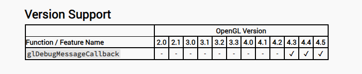

# OpenGL

OpenGL（Open Graphics Library）是一个用于渲染2D和3D矢量图形的跨语言、跨平台的应用程序编程接口（API）。这个API由近350个不同的函数调用组成，可以用来绘制从简单的图形到复杂的三维景象。OpenGL不仅是一个规范，它定义了一系列操作图形和图像的函数，但本身并不提供API的实现。这些实现通常被称为“驱动”，由GPU的硬件开发商提供，负责将OpenGL定义的API命令翻译为GPU指令

`OpenGL` 函数功能、参数查询网站 [docs.gl](https://docs.gl/)

## 创建窗口

### GLFW

使用 `glfw` 来学习 `OpenGL` 的 API， 网址 [www.flgw.org](https://www.glfw.org)，以及[示例代码](https://www.glfw.org/documentation.html)

GLFW 和 OpenGL 之间的关系是密切且互补的。GLFW 是一个专门为 OpenGL 设计的库，它提供了创建窗口、处理输入和事件的简单API，而 OpenGL 负责通过这些窗口进行 2D 和 3D 图形的渲染

具体来说，OpenGL 是一个底层的图形渲染规范，它定义了一系列的 API 来直接与图形硬件交互。这些 API 允许开发者在不同的平台和设备上创建复杂的图形渲染效果。然而，OpenGL 本身并不处理窗口创建或输入事件，这就是 GLFW 发挥作用的地方

总的来说，GLFW 作为一个辅助库，它简化了 OpenGL 程序的窗口和事件管理，让开发者能够更容易地创建跨平台的图形应用程序。而 OpenGL 则专注于提供强大的图形渲染能力。两者结合使用，可以创建功能丰富、效果出色的图形应用程序

GLFW 提供了一种标准化的方法来创建和管理窗口，以及处理键盘、鼠标等输入设备的事件。这使得开发者可以专注于 OpenGL 渲染，而不必担心操作系统特定的窗口管理细节。此外，GLFW 还支持多平台，这意味着你可以在 Windows、macOS 和 Linux 上使用相同的代码来管理窗口和事件

首先使用 `visual studio` 创建一个空项目

将 `GLFW` 的头文件添加到索引路径中，在项目 `sln` 文件同级目录中创建 `Dependencies\GLFW` 文件夹，将下载的 `GLFW` 头文件和对应的链接库拷贝到新建文件夹中 


> `$(SolutionDir)` 是 `visual studio` 提供的**宏**，表示当前项目所在路径

与添加头文件路同理，添加链接库路径


在输入中指明使用 `glfw3.lib` 和 `opengl32.lib`，因为 `GLFW` 中提供了多个 `lib` 和 `dll`，所以指定使用一个

> 一般来说系统路径中有 `opengl32.lib` 所以可以直接输入


| 文件名 | 作用 |
| --- | --- |
| `glfw3.dll`  | 一个动态链接库（`DLL`），它包含 `GLFW` 的编译代码。当你的应用程序运行时，它会动态地从这个 `DLL` 加载代码。这意味着你可以更新 GLFW 版本而不需要重新编译你的应用程序 |
| `glfw3.lib` 和 `glfw3_mt.lib` | 静态链接库，它们包含了编译后的 `GLFW` 代码，可以直接链接到你的应用程序中。这样做的好处是你的应用程序不需要在运行时加载 `DLL`，因为所有的代码都已经包含在应用程序的二进制文件中了。`glfw3_mt.lib` 特别指的是多线程版本的静态库 |
| `glfw3dll.lib` | 一个导入库（`import library`），它用于与 `glfw3.dll` 动态链接。如果你选择使用 `DLL` 版本的 `GLFW`，你的应用程序会在编译时链接到这个导入库，而在运行时从 `glfw3.dll` 加载实际的函数实现 |

> 总的来说，`.lib` 文件用于静态链接，而 `.dll` 文件用于动态链接。选择哪种方式取决于你的具体需求和你的项目配置

这里将项目设置为 x86 架构，因为我所有的配置设置的平台也是 `Win32`， GLFW 下载的也是 32 位版本


直接运行就可以创建一个空白窗口

测试一下绘制一个三角形 

```cpp
glBegin(GL_TRIANGLES);
glVertex2f(-0.5f, -0.5f);
glVertex2f(0.0f, 0.5f);
glVertex2f(0.5f, -0.5f);
glEnd();
```

### GLEW

除了 GLFW 之外， OpenGL 还有一些其他的辅助库

| 库名称 | 功能 |
| --- | --- |
| GLEW (OpenGL Extension Wrangler Library) | GLEW 是用于管理OpenGL扩展的库，它能自动识别并加载当前平台所支持的全部OpenGL高级扩展函数。适用于需要使用OpenGL 2.0及以上版本的高级特性的场景 |
| GLAD | GLAD是GLEW的现代替代品，也是一个OpenGL扩展加载库。它允许开发者指定需要的OpenGL版本，并根据这个版本加载所有相关的OpenGL函数。适用于需要跨平台支持和使用最新OpenGL特性的项目 |
| GLUT (OpenGL Utility Toolkit) | GLUT是一个较老的工具库，用于创建窗口、处理输入和事件。由于其年代久远且不再维护，通常不推荐用于新项目 |
| FreeGLUT | FreeGLUT是GLUT的开源替代品，完全兼容GLUT。它提供了GLUT缺少的一些功能和修复了一些已知的bug。适用于需要GLUT功能但希望有更好支持和更新的项目 |
| GLFW | GLFW是一个用于创建窗口、读取输入、处理事件的多平台库，支持OpenGL、OpenGL ES和Vulkan。它是GLUT和FreeGLUT的现代替代品，提供了更简洁的API和更好的性能。适用于需要轻量级窗口和事件管理的现代OpenGL应用程序 |

因为只是学习使用 OpenGL，所以直接用 `GLEW` 就行了，[官网下载即可](https://glew.sourceforge.net/)，下载当然是下载 `Binaries`，如果是正规项目最好是下载 `Source` 源码版，源码版断点调试更方便

使用 `GLEW` 的原因是，`Windows` 默认只支持到 **OpenGL 1.1** 的函数，而现代 `OpenGL` 已经发展到更高的版本。为了使用这些高级特性，就必须通过扩展来获取新的功能。GLEW库就是为了解决这个问题而设计的。它允许开发者在不同的平台上使用高版本的 `OpenGL` 功能，而无需担心具体的扩展加载细节。在不使用 `GLEW` 的情况下，开发者需要手动加载每个扩展函数的地址，这是一个繁琐且容易出错的过程。`GLEW` 自动处理这一过程，简化了开发工作。

与之前导入 `GLFW` 库一样，将 `GLEW` 的头文件和链接库导入并且配置到项目中

动态链接库使用 `lib\Release\Win32\glew32s.lib` 文件

| 文件名 | 作用 |
| --- | --- |
| glew32s.lib | 静态链接库的版本，其中的 `s` 表示静态（`static`）。使用这个版本的库时，GLEW的代码会被直接链接到最终的应用程序中，因此不需要在运行时提供 glew32.dll 文件。这可以使得应用程序的分发更加简单，因为不需要额外的DLL文件 |
| glew32.lib | 用于动态链接的导入库。当你使用这个库时，你的应用程序在运行时会依赖 glew32.dll 动态链接库。这意味着，glew32.dll 必须在应用程序运行时可用，通常是放在应用程序的同一目录或系统路径中 |

- 如果希望应用程序能够通过替换DLL来更新GLEW版本，或者减小最终可执行文件的大小，选择动态链接的 `glew32.lib`
- 如果希望简化应用程序的部署，并且不介意增加可执行文件的大小，那么静态链接的 `glew32s.lib` 可能是更好的选择

> 方便使用，直接用 `glew32.lib` 文件

关于 `GLEW` 的使用可以查看它的[文档](https://glew.sourceforge.net/basic.html)

**启动 GLEW**

1. 首先，需要创建一个有效的OpenGL渲染上下文，并调用glewInit()来初始化扩展入口点
2. 如果glewInit()返回GLEW_OK，那么初始化成功，可以使用可用的扩展以及核心OpenGL功能

```cpp
#include <GL/glew.h>
#include <GL/glut.h>
// ...
glutInit(&argc, argv);
glutCreateWindow("GLEW Test");
GLenum err = glewInit();
if (GLEW_OK != err)
{
  /* Problem: glewInit failed, something is seriously wrong. */
  fprintf(stderr, "Error: %s\n", glewGetErrorString(err));
  // ...
}
fprintf(stdout, "Status: Using GLEW %s\n", glewGetString(GLEW_VERSION));
```

------------------

**检查扩展**

从GLEW 1.1.0开始，你可以通过查询全局定义的变量 `GLEW_{extension_name}` 来找出特定扩展是否在你的平台上可用

```cpp
// 在这里使用ARB_vertex_program扩展是安全的。
if (GLEW_ARB_vertex_program)
{
  glGenProgramsARB(...);
}
```

可以检查核心OpenGL功能。例如，要看 `OpenGL 1.3` 是否支持

```cpp
if (GLEW_VERSION_1_3)
{
  // OpenGL 1.3被支持！
}
```

也可以从字符串输入执行扩展检查。从 **1.3.0** 版本开始，使用 `glewIsSupported` 来检查所需的核心或扩展功能是否可用

```cpp
if (glewIsSupported("GL_VERSION_1_4  GL_ARB_point_sprite"))
{
  // 有OpenGL 1.4 + 点精灵
}
```

对于仅限扩展的情况，`glewGetExtension` 提供了一个较慢的替代方法（GLEW 1.0.x-1.2.x）。请注意，在 **1.3.0** 版本中 `glewGetExtension` 被 `glewIsSupported` 替代

```cpp
if (glewGetExtension("GL_ARB_fragment_program"))
{
  // ARB_fragment_program是被支持的
}
```

------------------

**实验性驱动程序**

`GLEW` 从图形驱动程序获取支持的扩展信息。然而，实验性或预发布的驱动程序可能不会通过标准机制报告每个可用的扩展，在这种情况下，`GLEW` 会报告它不支持。为了规避这种情况，可以在调用 `glewInit()` 之前将 `glewExperimental` 全局开关设置为 `GL_TRUE` ，这确保所有具有有效入口点的扩展都会被暴露

------------------

**平台特定扩展**

平台特定扩展被分离到两个头文件中：`wglew.h` 和 `glxew.h`，它们定义了可用的 `WGL` 和 `GLX` 扩展。要确定某个扩展是否被支持，查询 `WGLEW_{extension name}` 或 `GLXEW_{extension_name}`

```cpp
#include <GL/wglew.h>

if (WGLEW_ARB_pbuffer)
{
  // 好的，可以使用 pbuffers
}
else
{
  // 抱歉，pbuffers 在这个平台上不会工作。
}

// 或者，使用 wglewIsSupported 或 glxewIsSupported 从字符串检查扩展：
if (wglewIsSupported("WGL_ARB_pbuffer"))
{
  // 好的，我们可以使用pbuffers。
}
```

------------------

**工具**

GLEW提供了两个命令行工具：一个用于创建可用扩展和视觉效果的列表；另一个用于验证扩展入口点

| 工具 | 作用 | 解释 | 使用 |
| --- | --- | --- | --- |
| `visualinfo` | 扩展和视觉效果 | `visualinfo` 是 `glxinfo` `的扩展版本。Windows` 版本创建了一个名为 `visualinfo.txt` 的文件，其中包含了可用的 `OpenGL`、`WGL` 和 `GLU` 扩展列表以及视觉效果（又称像素格式）的表格。也包括了支持 `Pbuffer` 和 `MRT` 的视觉效果 | `visualinfo -h` |
| `glewinfo` | 扩展验证工具 | `glewinfo` 允许你验证平台上支持的扩展的入口点。`Windows` 版本将结果报告到一个名为 `glewinfo.txt` 的文本文件中。`Unix` 版本将结果打印到 `stdout` | `glewinfo [-pf <id>]` |

那么根据文档所说，我们要在项目中使用 `glewInit()` 函数来初始化 `GLEW`

```cpp
int main(void)
{
	GLFWwindow* window;

	/* Initialize the library */
	if (!glfwInit())
		return -1;

	if (GLEW_OK != glewInit()) {
		std::cout << "Error: glewInit Faild" << std::endl;
	}

    // ....
}
```

上面的代码直接运行会出现 `glewInit` 的链接错误

```cpp
GLEWAPI GLenum GLEWAPIENTRY glewInit (void);
```

关注点在上面的 `GLEWAPI` 宏定义中

```cpp
/*
 * GLEW_STATIC is defined for static library.
 * GLEW_BUILD  is defined for building the DLL library.
 */

#ifdef GLEW_STATIC
#  define GLEWAPI extern
#else
#  ifdef GLEW_BUILD
#    define GLEWAPI extern __declspec(dllexport)
#  else
#    define GLEWAPI extern __declspec(dllimport)
#  endif
#endif
```

由于项目中什么宏都没有额外定义，所以会执行 `define GLEWAPI extern __declspec(dllimport)`

根据代码上面的注释，结合项目中使用的是 `glew32s.lib` 静态库，所以需要定义 `GLEW_STATIC` 宏


在定义宏之后，项目可以正常运行，但是 `glewInit` 返回的却不是 `GLEW_OK`，也就是说 `GLEW` 初始化失败，原因是没有**OpenGL渲染上下文**，这个是文档中说明过的

解决方案很简单，在 `GLFW` 提供的代码 `glfwMakeContextCurrent` 其实已经创建了 OpenGL 上下文，所以只需要在 `glfwMakeContextCurrent` 函数之后 `glewInit` 就行了

```cpp
/* Make the window's context current */
glfwMakeContextCurrent(window);

if (GLEW_OK != glewInit()) {
    std::cout << "Error: glewInit Faild" << std::endl;

}

/* Loop until the user closes the window */
while (!glfwWindowShouldClose(window))
{
    /* Render here */
    glClear(GL_COLOR_BUFFER_BIT);

    render();

    /* Swap front and back buffers */
    glfwSwapBuffers(window);

    /* Poll for and process events */
    glfwPollEvents();
}
```

如果成功，那么可以通过 `std::cout << glGetString(GL_VERSION) << std::endl;` 来输出当前 `OpenGL` 版本


## 顶点缓冲

顶点缓冲区本质上还是一个**缓冲区**，是一个内存缓冲区，也就是一个数组。也就是定义一组数据来表示三角形，并且将其放到 `GPU` 的 `VRAM` 中，在绘制时 告诉 `GPU` 如何从 `VRAM` 读取并且解释数据信息，以及如何绘制到屏幕上

**顶点** 并不代表坐标，坐标信息只是顶点的一部分，除此之外顶点还可以有其他信息，比如：颜色、法线、纹理等。所以顶点指的是一整个构成顶点的数据集合

由于 OpenGL 是一个很大的状态机，所以要做的就是设置一系列状态和信息，然后告诉 GPU 绘制

```cpp
float positions[6] = {
  -0.5f, -0.5f,
    0.0f,  0.5f,
    0.5f, -0.5f
};
unsigned int buffer;
glGenBuffers(1, &buffer);
glBindBuffer(GL_ARRAY_BUFFER, buffer);
glBufferData(GL_ARRAY_BUFFER, 6 * sizeof(float), positions, GL_STATIC_DRAW);

glEnableVertexAttribArray(0);
glVertexAttribPointer(0, 2, GL_FLOAT, GL_FALSE, sizeof(float) * 2, 0);

glBindBuffer(GL_ARRAY_BUFFER, 0);
```

大概介绍一下上述代码的功能

1. `glGenBuffers(1, &buffer)` 创建了一个缓冲区对象。这个缓冲区对象可以用来存储顶点数据、颜色数据等
2. `glBindBuffer(GL_ARRAY_BUFFER, buffer)` 将缓冲区对象绑定到 GL_ARRAY_BUFFER 目标上。这意味着我们将要操作的是一个顶点数组缓冲区
3. 使用 `glBufferData(GL_ARRAY_BUFFER, 6 * sizeof(float), positions, GL_STATIC_DRAW)`，我们将数据从 `positions` 数组传递到缓冲区中
4. 启用了顶点属性数组，使用 `glEnableVertexAttribArray(0)`
5. 使用 `glVertexAttribPointer(0, 2, GL_FLOAT, GL_FALSE, sizeof(float) * 2, 0)` 设置了顶点属性指针。这告诉 OpenGL 如何解释缓冲区中的数据
6. 使用 `glBindBuffer(GL_ARRAY_BUFFER, 0)` 解绑了缓冲区对象，确保不再对其进行操作

`glGenBuffers` 函数的作用是为 **OpenGL 缓冲区对象** 分配一个**唯一**的名字（或称为标识符）

在 OpenGL 中，缓冲区对象用于存储图形数据，例如顶点坐标、颜色、法线等

缓冲区对象可以被访问和使用，既可以由应用程序读取，也可以由 GPU 访问

缓冲区对象需要一个唯一的名字来标识它们。这样，OpenGL 可以根据名字找到正确的缓冲区对象

`glGenBuffers` 正是用于生成这些唯一的名字。每次调用 glGenBuffers 都会分配一个新的名字，确保不会与其他缓冲区对象的名字重复

--------------

`glBufferData` 将 `positions` 的数据传递到 `GL_ARRAY_BUFFER` 中，复制了 `sizeof(float) * 6` 个字节的大小数据

| 名称 | 含义 |
| --- | --- |
| STREAM | 这个参数表示数据每帧都不同，即数据会频繁变化。适用于那些每帧都需要更新的缓冲区，例如存储粒子系统的顶点数据 |
| STATIC | 这个参数表示数据不会或几乎不会改变，即一次修改，多次使用。适用于那些在创建后不会频繁修改的缓冲区，例如存储顶点位置、法线等静态数据 |
| DYNAMIC | 这个参数表示数据会被频繁地改变，即多次修改，多次使用。适用于那些需要经常更新的缓冲区，例如存储动态模型的顶点数据 |
| DRAW | 这个参数表示数据将会被送往 GPU 进行绘制。用于指定缓冲区的用途，例如存储顶点数据供渲染使用 |
| READ | 这个参数表示数据会被用户的应用读取。用于指定缓冲区的用途，例如存储纹理数据供 CPU 访问 |
| COPY | 这个参数表示数据会被用于绘制和读取。用于指定缓冲区的用途，例如在数据传输时进行拷贝操作 |

> 这些参数是对缓冲区数据使用模式的提示，帮助 OpenGL 在内部做出更智能的决策，以优化性能

--------------

`glVertexAttribPointer` 则用于告诉 `OpenGL` 如何理解传入的数据。根据 [docs.gl](https://docs.gl/gl4/glVertexAttribPointer) 的解释

```cpp
void glVertexAttribPointer(	GLuint index,
                            GLint size,
                            GLenum type,
                            GLboolean normalized,
                            GLsizei stride,
                            const GLvoid * pointer);
```

- `index`: 起始索引序号，如果数组长度为4，希望从第二个顶点开始绘制，则传入1
- `size`: 表示每个顶点属性的组件数量，如果是一个 Vector3，那么应该设置3
- `type`: 数据类型，比如 `GL_FLOAT` 和 `GL_INT` 等
- `normalized`: 归一化，是否需要将数据归一化到 0~1 的范围内，比如颜色；如果参数是 `GL_FALSE` 则不用归一化
- `stride`: 步长，通过步长计算地址内存偏移，实现数组索引
- `pointer`: 表示顶点属性数据在缓冲区中的起始位置，如果你的数据存储在缓冲区的起始位置，可以将 `pointer` 设置为 0；如果数据存储在缓冲区的其他位置，你需要计算正确的偏移量并设置 `pointer`


如上图类似，提供一块内存，通过 `index` 知道起始遍历序号，通过 `size` 知道顶点属性的数量，通过 `type` 知道顶点属性的数据类型，通过 `stride` 知道地址需要偏移多少

通过上面传入的数据，就可以完全遍历一块内存了。我们知道区域的数据类型，但是 `OpenGL` 不知道，所以这个函数就是告诉 `OpenGL` 如何解析一块内存区域

## 着色器

前面的代码只是提供了顶点坐标，并没有提供颜色，为什么会绘制出白色的三角形呢？

这个是因为 如果程序没有提供着色器的话， GPU 会驱动提供默认的**着色器**

那么什么是**着色器**？

**渲染管线**（`Render Pipeline`）和**着色器**（`Shaders`）的关系是非常紧密的。在现代图形处理中，渲染管线是由一系列顺序执行的阶段组成的，这些阶段共同完成将3D场景转换为2D图像的任务。着色器则是在这个管线中的关键组件，负责处理图形和图像的具体细节

**渲染管线**是将3D场景转换为2D图像的过程。想象一下它就像一个工厂的流水线，不同的加工环节（渲染阶段）根据用户需求对每个环节进行灵活改造或拆卸，将原始材料（CPU端向GPU端提交的纹理等资源以及指令等）加工为最终的成品，即呈现在用户屏幕上的图像

功能性阶段划分

1. 应用阶段 (Application)
   - 在CPU上执行，完全可控制
   - 主要任务是输入装配，将顶点和索引装配为几何图元
   - 例如，从显存中读取几何数据，装配顶点，构成图元传递给几何阶段
2. 几何阶段 (Geometry Processing)
   - 在GPU上运行，处理应用阶段发送的渲染图元
   - 主要任务是将顶点坐标变换到屏幕空间中，再交给光栅器进行处理
   - 包括顶点着色阶段、投影阶段、裁剪阶段和屏幕映射阶段
3. 光栅化阶段 (Rasterization)
   - 也在GPU上执行
   - 目标是找到处于图元内部的所有像素，将2D坐标顶点转为屏幕上的像素
   - 插值逐像素数据，传递给像素阶段
4. 像素阶段 (Pixel Processing)
   - 处理光栅化阶段传来的像素数据
   - 包括像素着色器，计算像素的颜色和其他属性
   - 最终生成图像

渲染管线的不同阶段会应用不同的着色器

现在GPU允许通过编程的方式，处理顶点、像素的着色操作，通过**着色器**（`Shaders`）的方式

- OpenGL: GLSL语言
- DirectX: HLSL语言

1. 顶点着色器（Vertex Shader）
   - 描述顶点的属性，如位置、纹理坐标、颜色等
   - 将3D空间中的顶点坐标变换为屏幕上的2D坐标
   - 无法生成新的顶点，但输出传递到流水线的下一步
2. 曲面细分着色器（Tessellation Shader）
   - 分为 **曲面控制着色器** 和 **曲面求值着色器** 两个阶段
   - 引入于OpenGL 4.0和Direct3D 11
   - 可以将简单网格细分为更复杂的网格，根据特定函数计算
   - 可以根据视点距离等变量动态调整细节层次
3. 几何着色器（Geometry Shader）
   - 可以生成新的图形基元，如点、线和三角形
   - 可以在图形处理器内修改场景中的几何结构
   - 用于增加模型细节和执行对CPU来说过于繁重的几何操作
4. 像素着色器（Pixel Shader）
   - 也称为片段着色器，用于计算像素的颜色和其他属性
   - 处理单独的像素，通常指单独的屏幕像素
   - 可以实现光照、凹凸贴图、阴影、半透明等效果


以前面的代码为例子

```cpp
float positions[6] = {
    -0.5f, -0.5f,
    0.0f,  0.5f,
    0.5f, -0.5f
};
```

这里 `positions` 传递了三个顶点，意味着顶点着色器需要运行三次，每个顶点一次

一个顶点着色器的基本目的就是告诉那个顶点需要绘制到屏幕的哪里

然后将数据传递给片段着色器，为每个像素运行一次片段着色器程序，片段着色器的基本目的就是决定像素的颜色

1. 在 OpenGL 中使用 `glCreateShader` 来创建一个 `Shader`
2. 使用 `glShaderSource` 传入指定的 `Shader` 源码
3. 使用 `glCompileShader` 编译指定的 `Shader` 源码

```cpp
static GLuint CompiledShader(const std::string& source, GLenum inType) {
	GLuint id = glCreateShader(inType);
	const char* src = source.c_str();
	glShaderSource(id, 1, &src, nullptr);
	glCompileShader(id);

	// Shader 错误处理
	GLint result;
	glGetShaderiv(id, GL_COMPILE_STATUS, &result);
	if (result == GL_FALSE) {
		int length;
		glGetShaderiv(id, GL_INFO_LOG_LENGTH, &length);
		// alloca 在栈上申请内存，不需要 free ，在作用域结束后自动释放
		char* msg = (char*)alloca(length * sizeof(char));
		glGetShaderInfoLog(id, length, &length, msg);
		std::cout << "Sharder Compile " << (inType == GL_VERTEX_SHADER ? "vertex sharder" : "fragment sharder") << " Faild" << std::endl;
		std::cout << msg << std::endl;
		
		glDeleteShader(id);
		return GL_ZERO;
	}

	return id;
}
```

一般来说会指定顶点着色器和片段着色器，所以统一封装一个函数用与创建一个程序并将两个着色器绑定到程序中

1. `glCreateProgram` 创建一个程序对象
2. `glAttachShader` 将编译好的着色器附加到程序对象上
3. `glLinkProgram` 链接程序，将所有着色器合并为一个可执行的程序
4. `glValidateProgram` 验证程序对象是否可以在当前的 OpenGL 状态下执行

```cpp
static unsigned int CreateShader(const std::string& vertexShader, const std::string& fragmentShader) {
	GLuint program = glCreateProgram();
	GLuint vs = CompiledShader(vertexShader, GL_VERTEX_SHADER);
	GLuint fs = CompiledShader(fragmentShader, GL_FRAGMENT_SHADER);

	glAttachShader(program, vs);
	glAttachShader(program, fs);
	glLinkProgram(program);
	glValidateProgram(program);

	glDeleteShader(fs);
	glDeleteShader(vs);

	return program;
}
```

`glDeleteShader` 表示删除着色器对象，在着色器附加到程序对象并链接之后被调用。这是因为一旦着色器被链接到程序对象，它们就不再需要了，删除它们可以释放资源。着色器的代码已经被链接到程序中，所以可以安全地删除着色器对象

- 片段着色器，文件名 `Fragment.frag`

```glsl
#version 330 core

layout(location = 0) out vec4 color;

void main() {
	color = vec4(1.0, 0.0, 0.0, 1.0);
}
```

- 顶点着色器，文件名 `Vertex.vert`


```glsl
#version 330 core

layout(location = 0) in vec4 position;

void main() {
	gl_Position = position;
}
```

读取文件，最后只需要调用代码即可创建着色器程序，并通过 `glUseProgram` 来使用它

```cpp
GLuint shader = CreateShaderWithFile("src/Vertex.vert", "src/Fragment.frag");
glUseProgram(shader);
```


最后如片段着色器中所写 `color = vec4(1.0, 0.0, 0.0, 1.0)` 输出了红色

## 索引缓冲区

事实上**三角形**是图形渲染的基本元素

1. 数学上的简单性：三角形是最简单的多边形，任意三个非共线的点都能确定一个平面上的三角形。这意味着三角形总是平面的，不会出现扭曲或弯曲，这在计算上非常重要
2. 效率：三角形的边界与扫描线的相交非常容易计算，这使得基于扫描线的渲染算法更加高效
3. 硬件优化：几乎所有的商用图形加速硬件都是为三角形光栅化而设计的。这种设计允许硬件更有效地处理三角形，从而提高渲染性能
4. 灵活性：三角形可以组合成任何复杂的形状。通过增加三角形的数量，可以逼近任何曲面的形状，从而实现复杂模型的精确渲染
5. 并行处理：三角形允许 GPU 在渲染过程中进行高度并行的处理。每个三角形可以独立地进行变换、光栅化和着色，这对于现代 GPU 的架构来说非常适合

所以说当我们绘制一个正方形的时候，其实是绘制两个三角形

```cpp
float positions[] = {
    -0.5f, -0.5f,
    -0.5f,  0.5f,
     0.5f, -0.5f,

     0.5f,  0.5f,
    -0.5f,  0.5f,
     0.5f, -0.5f
};

unsigned int buffer;
glGenBuffers(1, &buffer);
glBindBuffer(GL_ARRAY_BUFFER, buffer);
glBufferData(GL_ARRAY_BUFFER, 6 * 2 * sizeof(float), positions, GL_STATIC_DRAW);
glVertexAttribPointer(0, 2, GL_FLOAT, GL_FALSE, sizeof(float) * 2, 0);

glBindBuffer(GL_ARRAY_BUFFER, 0);
glEnableVertexAttribArray(0);

GLuint shader = CreateShaderWithFile("src/Vertex.vert", "src/Fragment.frag");
glUseProgram(shader);

while (!glfwWindowShouldClose(window))
{
    /* Render here */
    glClear(GL_COLOR_BUFFER_BIT);

    glDrawArrays(GL_TRIANGLES, 0, 6);

    /* Swap front and back buffers */
    glfwSwapBuffers(window);

    /* Poll for and process events */
    glfwPollEvents();
}
```


如此我们就得到了一个红色的矩形，为什么是长方形而不是正方形是因为我们窗口大小是长方形的

```cpp
float positions[] = {
    -0.5f, -0.5f,
    -0.5f,  0.5f,
     0.5f, -0.5f,

     0.5f,  0.5f,
    -0.5f,  0.5f,
     0.5f, -0.5f
};
```

观察数据，可以发现两个三角形存在两个重复的数据：点 `-0.5f,  0.5f` 和 `0.5f, -0.5f`，数据冗余了，纯在实在浪费内存

在游戏中对于一个复杂模型，三角形数量成千上万，每个三角形都连接到另一个三角形，也就是意味着至少重复了两个顶点。那么对于复杂模型来说，重复顶点数量是巨大的

在 `OpenGL` 中可以使用 **索引缓冲区** `index buffers` 来重用现有顶点

索引缓冲区的主要作用是优化图形数据的存储和渲染过程。它允许重用顶点数据来绘制多个图元，而不需要在内存中重复相同的顶点信息。这样可以减少内存的使用，同时减少 `CPU` 到 `GPU` 的数据传输量，提高渲染效率

```cpp
float positions[] = {
    -0.5f, -0.5f,
     0.5f, -0.5f,
     0.5f,  0.5f,
    -0.5f,  0.5f,
};
```

对于上面的数组来说，序号 0、1、2 三个点构成一个三角形，序号 2、3、0 构成另一个三角形

| 三角形 | 三角形 |
| --- | --- |
|  |  |

一般来说

1. 创建索引缓冲区：首先，你需要使用 `glGenBuffers` 创建一个缓冲区对象
2. 绑定索引缓冲区：然后，使用 `glBindBuffer` 将缓冲区对象绑定到 `GL_ELEMENT_ARRAY_BUFFER` 目标
3. 填充索引缓冲区：使用 `glBufferData` 将索引数据传输到 GPU
4. 绘制命令：最后，使用 `glDrawElements` 而不是 `glDrawArrays` 来绘制图元，指定索引缓冲区中的索引来引用顶点数据

```cpp
GLuint ibo;	// index buffer object
glGenBuffers(1, &ibo);
glBindBuffer(GL_ELEMENT_ARRAY_BUFFER, ibo);
glBufferData(GL_ELEMENT_ARRAY_BUFFER, 6 * sizeof(GLuint), indeices, GL_STATIC_DRAW);

// something else
while (!glfwWindowShouldClose(window))
{
    // something else 

    glDrawElements(GL_TRIANGLES, 6, GL_UNSIGNED_INT, 0);

    // something else
}
```

`glDrawElements` 最后一个参数 `const GLvoid * indices` 表示相对于当前绑定的 `GL_ELEMENT_ARRAY_BUFFER` 的数据地址偏移

## OpenGL 的错误信息

```cpp
void glDrawElements(GLenum mode,
                    GLsizei count,
                    GLenum type,
                    const GLvoid * indices);
```

`glDrawElements` 中 `type` 参数用与表示数据类型，必须是 `GL_UNSIGNED_BYTE`， `GL_UNSIGNED_SHORT`、`GL_UNSIGNED_INT` 中的一个

那么如果传递 `GL_INT` 会怎么样呢？


如上图所示，没有绘制红色长方形、没有报错信息、也没有崩溃

那么问题来了，如果代码中出现了一些错误，如何找出是这些错误？

使用 `glGetError` 函数，该函数会返回一个 `GLenum` 值用与表示错误类型，这意味着在每次调用 `OpenGL` 函数之后都要通过 `while` 调用 `glGetError` 的方式获取到所有错误（因为 `glGetError` 每次调用只会返回一个错误信息），这样我们就可以得到之前调用函数的是否产生了错误

```cpp
#define GL_CHECK_ERROR do { LogError(__LINE__); }while(0);
#define GL_CLEAR_ERROR do { GLClearError(); } while(0);

#define GL_CALL(x) do {			\
	GLClearError();				\
	x;							\
	LogError(__LINE__, #x);		\
} while (0);		

static void GLClearError() {
    while(glGetError() != GL_NO_ERROR);
}

static void LogError(unsigned int Line, const char* functionName = nullptr) {
	GLuint errorType = glGetError();
	while (errorType != GL_NO_ERROR){
		std::cout << __FILE__ << " Line: " << Line << " Function Name: " << functionName << " ";
		switch (errorType)
		{
		case GL_INVALID_ENUM:
			std::cout << "LogError: " << "GL_INVALID_ENUM" << std::endl;
			break;
		case GL_INVALID_VALUE:
			std::cout << "LogError: " << "GL_INVALID_VALUE" << std::endl;
			break;
		case GL_INVALID_OPERATION:
			std::cout << "LogError: " << "GL_INVALID_OPERATION" << std::endl;
			break;
		case GL_INVALID_FRAMEBUFFER_OPERATION:
			std::cout << "LogError: " << "GL_INVALID_FRAMEBUFFER_OPERATION" << std::endl;
			break;
		case GL_OUT_OF_MEMORY:
			std::cout << "LogError: " << "GL_OUT_OF_MEMORY" << std::endl;
			break;
		case GL_STACK_UNDERFLOW:
			std::cout << "LogError: " << "GL_STACK_UNDERFLOW" << std::endl;
			break;
		case GL_STACK_OVERFLOW:
			std::cout << "LogError: " << "GL_STACK_OVERFLOW" << std::endl;
			break;
		}

		__debugbreak();	// 中断函数 编译器强相关函数，gcc 没有

		errorType = glGetError();
	} 
}

// SOMETHING ELSE 
    // GLClearError(); // 清除所有错误 避免影响后续的错误判断
    // glDrawElements(GL_TRIANGLES, 6, GL_INT, 0);
	// GL_CHECK_ERROR;
	GL_CALL(glDrawElements(GL_TRIANGLES, 6, GL_INT, 0));
// SOMETHING ELSE
```


配合宏定义成功将错误原因、文件、行数、调用函数全部输出出来，帮助快速定位。同时宏定义也可以让我们写更少的侵入式代码

```cpp
GLClearError(); // 清除所有错误 避免影响后续的错误判断
glDrawElements(GL_TRIANGLES, 6, GL_INT, 0);
LogError(__LINE__, "glDrawElements");
```

如果不用宏，那么我们就要在所有调用 OpenGL 函数的地方像上面一样在上下加上 `GLClearError` 和 `LogError` 函数

在 `OpenGL` **4.3** 中新出了一个函数 `glDebugMessageCallback`



这个函数允许指定一个指向 OpenGL 的函数指针，当发生错误的时候，OpenGL 会调用这个回调函数

这样做的好处就是不用像 `glGetError` 一样不断的 `OpenGL` 程序中调用，不停的检查错误。而是可以在错误发生使主动上报，并且会提供更详细的错误信息，不会像 `glGetError` 一样只是提供一个错误类型

## Uniforms

在OpenGL中，`uniforms` 是一种特殊类型的变量，用于在应用程序和着色器（如顶点着色器或片段着色器）之间传递数据。`Uniforms` 对于所有的着色器调用都保持不变，即它们在渲染过程的一次绘制调用中是全局常量。这使得它们非常适合用于传递诸如变换矩阵、材质属性、光照参数或任何其他不会在单个渲染调用中改变的数据。

- Uniforms 的主要特点和用途：
  - 全局常量：`Uniforms` 在着色器执行过程中不会改变，对所有处理的顶点和片段都是相同的
  - 从CPU到GPU：`Uniforms` 通常在应用程序（CPU）中设置，并传输到着色器（GPU）中。这种机制提供了一个高效的方式来传递少量重要的数据到着色器
  - 类型灵活：`Uniforms` 可以是浮点数、向量、矩阵或采样器等类型
  - 易于使用：在 `GLSL`（`OpenGL Shading Language`）中，`uniforms` 通过在着色器代码中声明 `uniform` 类型的变量来使用

根据之前写的着色器代码

```cpp
#version 330 core

layout(location = 0) out vec4 color;

void main() {
	color = vec4(1.0, 0.0, 0.0, 1.0);
}
```

着色器指定了颜色为红色，如果通过配置计算得到的一个应该如何设置到着色器中呢？

首先自然是声明 `uniform vec4 u_Color` 属性用与赋值

```cpp
#version 330 core

layout(location = 0) out vec4 color;

uniform vec4 u_Color;

void main() {
	color = u_Color;
}
```
然后使用 `glUniform4f` 对 `u_Color` 进行赋值，但是 `glUniform4f` 需要获得 `uniform` 属性的 `location`，于是通过 `glGetUniformLocation` 函数可以通过属性的名称获得其 `location` 

```cpp
GLuint shader = CreateShaderWithFile("src/Vertex.vert", "src/Fragment.frag");
glUseProgram(shader);

GLint location = -1;
GL_CALL(location = glGetUniformLocation(shader, "u_Color"));
GL_CALL(glUniform4f(location, 1, 1, 0, 0));
```

通过上面操作可以得到一个外界指定颜色的着色器

对应了可以做一些动态效果，比如动态的修改颜色

```cpp
glfwSwapInterval(1);

GLfloat r = 0.0f;
GLfloat increment = 0.05f;
while (!glfwWindowShouldClose(window))
{
    glClear(GL_COLOR_BUFFER_BIT);

    r += increment;
    GL_CALL(glUniform4f(location, r, .5f, .5f, 1.0f));

    if (r > 1.0f || r < 0.0f) {
        increment *= -1;
    }

    GL_CALL(glDrawElements(GL_TRIANGLES, 6, GL_UNSIGNED_INT, 0));

    glfwSwapBuffers(window);

    glfwPollEvents();
}
```

这里使用了 `glfwSwapInterval` 函数，用与设置双缓冲的交换间隔，也称为垂直同步（`Vertical Synchronization`，简称 `V-Sync`）。这个函数的主要作用是控制缓冲区交换的速率，以同步到显示器的垂直刷新率。这是在使用双缓冲渲染策略时用来防止画面撕裂的一种常用技术

如果 `interval` 为 1，则启用 `V-Sync`，确保每次缓冲区交换都在显示器完成一个垂直刷新周期后进行，这通常用于将渲染帧率锁定在显示器的刷新率

如果设置为 0，则关闭 `V-Sync`，允许交换操作尽可能快地进行，不等待垂直刷新。这可能导致较高的帧率，但也可能出现画面撕裂

对于高于 1 的值，它指示交换操作应该等待多个垂直刷新周期，这在某些特殊情况下可能有用

> 可以分别测试设置 `glfwSwapInterval` 为 0 或者 1 时画面表现

**游戏帧率**、**渲染帧率**和**显示器帧率**是密切相关却又有所不同的概念，它们共同影响着游戏和应用程序的视觉体验

1. 游戏帧率（`Game Frame Rate`）
游戏帧率通常指的是游戏逻辑更新的频率。这包括物理计算、用户输入处理、游戏状态更新等。游戏帧率的单位是 FPS（Frames Per Second，每秒帧数），它表示游戏逻辑每秒可以更新多少次。在许多游戏中，尤其是需要快速响应的游戏（如第一人称射击游戏），高游戏帧率是必要的，以保证流畅的游戏体验和精准的输入响应

2. 渲染帧率（`Rendering Frame Rate`）
渲染帧率是指图形引擎渲染图像的速率。这包括场景渲染、光影处理、粒子效果等图形输出的处理。渲染帧率同样以 FPS 表示，它指的是每秒内能够生成多少帧图像。渲染帧率受到GPU性能的影响较大，当场景复杂或图形设置较高时，渲染帧率可能会下降，导致画面卡顿

3. 显示器帧率（`Monitor Frame Rate`）
显示器帧率，通常称为刷新率，是指显示器每秒能够刷新多少次的能力。这个频率是固定的，常见的刷新率有60Hz、144Hz、240Hz等。显示器帧率决定了最高的视觉输出频率，即无论GPU渲染得多快，显示器只能按其固定的刷新率来更新图像

它们之间的关系：

- 同步问题：当渲染帧率和显示器帧率不匹配时，可能会出现画面撕裂现象。例如，如果GPU渲染速度快于显示器的刷新速度，一个显示周期中可能会显示两个不同帧的图像的部分，导致画面上下不一致。使用垂直同步（V-Sync）可以解决这个问题，它通过限制GPU输出以匹配显示器的刷新率来同步图像

- 性能限制：如果GPU不能足够快地渲染图像以匹配显示器的刷新率，用户将体验到卡顿，即使显示器的刷新率很高。反之，如果GPU渲染非常快，超出了显示器的刷新能力，超出的帧将不会显示，这可能导致资源的浪费

- 理想情况：理想的情况是游戏帧率、渲染帧率和显示器帧率三者之间保持同步。这意味着游戏逻辑顺畅运行，渲染帧率足够支持流畅的视觉输出，且显示器能够及时更新每一帧图像

## 顶点数组


| 概念 | 存储内容 | 目标绑定类型 | 核心作用 |
| ---  | --- |	---  | --- |
| VBO |	GPU 显存中的顶点数据 |	GL_ARRAY_BUFFER |	高效存储顶点属性数据 |
| VAO |	VBO 的配置状态（元数据） |	GL_VERTEX_ARRAY	| 管理 VBO 和顶点属性指针的关联关系 |
| EBO |	GPU 显存中的索引数据 |	GL_ELEMENT_ARRAY_BUFFER |	优化索引绘制（减少顶点重复） |

```
VAO（配置管理器）
├── 记录绑定的 VBO（`GL_ARRAY_BUFFER`）
│   └── 存储顶点属性数据（位置、颜色等）
├── 记录顶点属性指针（`glVertexAttribPointer`）
└── 记录绑定的 EBO（`GL_ELEMENT_ARRAY_BUFFER`）
    └── 存储索引数据（用于 `glDrawElements`）
```

**顶点缓冲**（`Vertex Buffer Objects`, VBOs）和**顶点数组**（`Vertex Array Objects`, VAOs）是用于高效管理和渲染顶点数据的关键技术。它们通常一起使用以优化图形渲染流程，但它们的功能和角色是不同的

> 后面大多数情况会用 `VAO` 表示**顶点数组对象，**用 `VBO` 表示**顶点缓冲对象**

| | 顶点缓冲 | 顶点数组 |
| --- | --- | --- |
| 解释 | 顶点缓冲对象是一种用于存储顶点数据的GPU内存缓冲区。这些数据包括顶点的位置、颜色、法线、纹理坐标等。使用VBO的优点是可以将数据存储在GPU内存中，这样在渲染过程中可以快速访问，提高渲染效率 | 顶点数组对象是一个可以保存一组顶点缓冲状态（即VBOs的状态）的对象。VAO存储了顶点数据的格式和源信息，这包括数据如何从缓冲区解读、每个顶点属性的数据类型及位置等 |
| 功能 | 存储顶点数据（如位置、颜色、纹理坐标等）。将数据从CPU传输到GPU，减少每次绘制调用时的数据传输开销 | 记录顶点属性配置的状态（例如哪个VBO被使用，数据如何解析）。简化绘图命令，通过绑定一个VAO即可自动设置所有顶点属性指针 |

- 在不使用 `VAO` 的情况下，每次渲染前都需要手动指定如何解释 `VBO` 中的顶点数据（通过`glVertexAttribPointer` 等函数）。使用 `VAO` 后，这些配置只需设置一次，之后通过绑定相应的VAO即可自动应用所有配置

- `VBO` 和 `VAO` 的结合使用可以显著提高渲染效率。`VBO` 为顶点数据提供高效的存储和访问，而 `VAO` 存储如何使用这些顶点数据的信息。当执行绘制命令时，只需绑定必要的 `VAO`，`OpenGL` 便知道如何从当前绑定的 `VBO`中获取和使用数据

- 使用 `VAO` 可以使 `OpenGL` 调用代码更加整洁和模块化。设置顶点属性的代码可以集中管理，减少重复和错误

如果只是使用 `VBO` 想要绘制多个三角形，那么每绘制一个三角形就需要将数据**重新绑定**数据到 `GL_ARRAY_BUFFER` 对象上，然后再通过 `glVertexAttribPointer` 来解释这块内存的解析方式，每个三角形都要这么做

这时就需要**顶点数组**，`VAO` 是一个可以保存一组顶点缓冲状态的对象。这种状态包括了如何解释从 `VBO` 读取的数据。`VAO`保存的是关于顶点属性的配置信息

- 哪个VBO包含了所需的顶点数据
- 数据如何从这个VBO中获取（例如，跳过起始的多少字节、每个顶点数据的步长是多少）
- 数据的类型（例如，GL_FLOAT）
- 数据应如何被顶点着色器接收（例如，位置数据应该链接到顶点着色器中的哪个属性）


之前的流程是，绑定顶点缓冲区，设置布局，绑定索引缓冲区。现在是，绑定顶点数组，绑定索引缓冲区

其实之前的代码中即使没有使用 `VAO`， `OpenGL` 兼容版仍然创建了 `VAO object 0` 为默认对象，如果将 `OpenGL` 设置为核心版就不一样了

```cpp
// 设置 OpenGL 为 3.3 版，并且使用核心配置
glfwWindowHint(GLFW_CONTEXT_VERSION_MAJOR, 3);
glfwWindowHint(GLFW_CONTEXT_VERSION_MINOR, 3);
glfwWindowHint(GLFW_OPENGL_PROFILE, GLFW_OPENGL_CORE_PROFILE);

// DO SOMETHING

float positions[] = {
    -0.5f, -0.5f,
        0.5f, -0.5f,
        0.5f, 0.5f,
    -0.5f,  0.5f,
};

GLuint indeices[] = {
    0, 1, 2,
    2, 3, 0
};

unsigned int buffer;
glGenBuffers(1, &buffer);
glBindBuffer(GL_ARRAY_BUFFER, buffer);
glBufferData(GL_ARRAY_BUFFER, 4 * 2 * sizeof(float), positions, GL_STATIC_DRAW);

GL_CALL(glEnableVertexAttribArray(0));
GL_CALL(glVertexAttribPointer(0, 2, GL_FLOAT, GL_FALSE, sizeof(float) * 2, 0));
```

与之前一样的代码，但是在 `glEnableVertexAttribArray` 却发生了报错

此时只要在创建 `VBO` 之前，创建并绑定 `VAO` 即可

```cpp
GLuint vao;
glGenVertexArrays(1, &vao);
glBindVertexArray(vao);
```

可以选择使用默认的 VAO 对象，不停的绑定、解绑不同的顶点数据，以此来绘制多个几何图形

也可以选择为每个几何图形创建一个 `VAO` 分别绑定不同的顶点数据

如果需要注重开发效率，那么建议每个图元一个 `VAO`；如果每一字节的显存都需要非常小心使用，那么建议全局一个 `VAO`

通常的工作流程是

1. 创建并绑定 `VAO`

```cpp
glGenVertexArrays(1, &vao);
glBindVertexArray(vao);
```

2. 创建并绑定 `VBO`，上传数据

```cpp
glGenBuffers(1, &vbo);
glBindBuffer(GL_ARRAY_BUFFER, vbo);
glBufferData(GL_ARRAY_BUFFER, sizeof(vertices), vertices, GL_STATIC_DRAW);
```

3. 设置顶点属性指针

```cpp
// 位置属性（假设每个顶点有3个float）
glVertexAttribPointer(0, 3, GL_FLOAT, GL_FALSE, 6 * sizeof(float), (void*)0);
glEnableVertexAttribArray(0);

// 颜色属性（偏移3个float）
glVertexAttribPointer(1, 3, GL_FLOAT, GL_FALSE, 6 * sizeof(float), (void*)(3 * sizeof(float)));
glEnableVertexAttribArray(1);
```

4. 创建并绑定 `EBO`

```cpp
glGenBuffers(1, &ebo);
glBindBuffer(GL_ELEMENT_ARRAY_BUFFER, ebo);
glBufferData(GL_ELEMENT_ARRAY_BUFFER, sizeof(indices), indices, GL_STATIC_DRAW);
```

5. 解绑 `VAO`

```cpp
glBindVertexArray(0);
```

6. 绘制时

```cpp
glBindVertexArray(vao);
glDrawElements(GL_TRIANGLES, 6, GL_UNSIGNED_INT, 0);
```

一个 `VAO` 可以关联多个 `VBO`，比如一个 `VBO` 存位置，另一个存颜色

`EBO` 的绑定要在 `VAO` 绑定时操作，因为 `EBO` 的绑定会被 `VAO` 记录，`GL_ELEMENT_ARRAY_BUFFER` 是 VAO 的一部分


## 简单封装抽象类

### 抽象顶点缓冲和索引缓冲

对于一个复杂的模型，会有一个顶点缓冲区，包括模型的每个顶点；可能会有多个索引缓冲区来绘制飞船的部分，因为不同部分可能会是不同材质，比如飞船的舱门可能是金属和玻璃两种材质

```cpp
// 顶点缓冲区
class VertexBuffer
{
private:
	GLuint m_RendererID;

public:
	VertexBuffer(const void* data, GLuint size) {
    glGenBuffers(1, &m_RendererID);
    glBindBuffer(GL_ARRAY_BUFFER, m_RendererID);
    glBufferData(GL_ARRAY_BUFFER, size, data, GL_STATIC_DRAW);
  }
	~VertexBuffer();

	void Bind() const;
	void UnBind() const;
};


// 索引缓冲区
class IndexBuffer
{
private:
	GLuint m_RendererID;
	GLuint m_Count;

public:
	IndexBuffer(const GLuint* data, GLuint count) {
    GL_CALL(glGenBuffers(1, &m_RendererID));
    GL_CALL(glBindBuffer(GL_ELEMENT_ARRAY_BUFFER, m_RendererID));
    GL_CALL(glBufferData(GL_ELEMENT_ARRAY_BUFFER, count * sizeof(GLuint), data, GL_STATIC_DRAW));
    m_Count = count;
  }
	~IndexBuffer();

	void Bind() const;
	void Unbind() const;

	inline GLuint GetCount() const { return m_Count; }
};
```

然后替换掉 `Application.cpp` 中对应的部分，就算初步完成了顶点、索引缓冲区的抽象

### 抽象顶点数组

接下来就是抽象顶点数组 `VAO` ，一个顶点数组需要做的就是将一个顶点缓冲区与某种布局绑定在一起

因为一个 `VertexBuffer` 的 `data` 数组中的一个元素可能存在多种布局 （比如 `RGBA` 是 4 个 `unsigned int`、 `Position` 是 3 个 `float`），所以需要一个布局数组来表示这个关系

```cpp
struct VertexBufferElement
{
	unsigned int type;
	unsigned int count;
	unsigned int normalized;
};

typedef std::vector<VertexBufferElement> VBElemnts;

class VertexBufferLayout
{
private:
	VBElemnts m_Elements;
	GLuint m_Stride{ 0 };

public:

	template<typename T>
	void Push(unsigned int count) {
		//static_assert(false);
	}

	template<>
	void Push<GLfloat>(unsigned int count) {
		m_Elements.push_back({ GL_FLOAT, count, GL_FALSE });
		m_Stride += sizeof(GLfloat);
	}

	template<>
	void Push<GLuint>(unsigned int count) {
		m_Elements.push_back({ GL_UNSIGNED_INT, count, GL_FALSE });
		m_Stride += sizeof(GLuint);
	}

	template<>
	void Push<GLubyte>(unsigned int count) {
		m_Elements.push_back({ GL_UNSIGNED_BYTE, count, GL_FALSE });
		m_Stride += sizeof(GLubyte);
	}

	inline const VBElemnts GetElements() const { return m_Elements; }

	inline GLuint GetStride() const { return m_Stride; }
};
```

使用 `VertexBufferElement` 来表示一个布局。如果表示 `RGBA` 的话，那么 `type` 就是 `GL_UNSIGNED_CHAR`, `count` 就是 4， `normalized` 可以是 `GL_FALSE`；如果表示 `Position2D` 的话，那么 `type` 就是 `GL_FLOAT`，`count` 就是 2，`normalized` 就是 `GL_FALSE`

总之，使用 `VertexBufferElement` 可以表示一种数据布局

使用 `VertexBufferLayout` 来维护一个 `VertexBufferElement` 数组。如前面所说，一个顶点可以有多种数据，包括颜色、坐标、法线等，那么就需要多个 `VertexBufferElement` 来表示这些数据，所以一个顶点布局 `VertexBufferLayout` 本质就是维护 `VertexBufferElement` 数组


大致如上图所示， `data` 是一块内存区域，如何解析这块区域就得靠布局来解释，假设地址的起始指针为 `data`

| 元素 | 起始地址 |
| --- | --- |
| vertex[0].RGBA | data |
| vertex[0].Vec2 | data + sizeof(RGBA) |
| vertex[1].RGBA | data + sizeof(Vertex) |
| vertex[1].Vec2 | data + sizeof(Vertex) + sizeof(RGBA) |

假设 RGBA 是 4 个 `unsigned char` 组成，那么 `sizeof(RGBA)` 大小就是 `4 * sizeof(unsigned char)`，这个大小就是 `offset` 地址偏移

所以之前一直说，知道了**布局**、**起始地址**、**数组长度**就知道了怎么遍历这个 `Vertex` 数组

那么在 `VertexArray` 中要做的就是将其对应的 `VertexBuffer` 通过 `VertexBufferLayout` 进行解释说明

```cpp
void VertexArray::AddBuffer(const VertexBuffer& vb, const VertexBufferLayout& layout)
{
	Bind();
	vb.Bind();

	const auto& elements = layout.GetElements();
	unsigned int offset = 0;

	for (unsigned int index = 0; index < elements.size(); ++index) {
		const auto& element = elements[index];
		GL_CALL(glEnableVertexAttribArray(0));
		GL_CALL(glVertexAttribPointer(index, element.count, element.type, element.normalized, layout.GetStride(), (const void*)offset));
		offset += element.count * VertexBufferElement::GetSizeOfType(element.type);
	}
}
```

> offset 就是一个属性 (例：RGBA) 的大小，通过 offset 计算属性的地址偏移

### 抽象 Shader

抽象 Shader 目前只用做三件事情：

1. 提供文件路径或者源码，将其编译成着色器
2. 绑定和解绑着色器
3. 为着色器设置所有不同的 `uniform`

其实就是把之前写过的 `CreateShaderWithFile` 等一系列函数封装到同一个类中

```cpp
class Shader
{
private:
	std::string m_VertexFilePath;
	std::string m_FragmentFilePath;
	GLuint m_ShaderId;

	// 缓存 uniform 的 Location
	std::unordered_map<std::string, GLint> m_Locations;

public:
	Shader(const std::string& vertexFile, const std::string& fragmentFile);
	~Shader();

	void Bind() const;
	void Unbind() const;

	void SetUniform4f(const std::string& name, float v0, float v1, float v2, float v3);

private:
	GLuint GetUniformLocation(const std::string& name);
	GLuint CreateShaderWithFile();
	GLuint CreateShader(const std::string& vertexSource, const std::string& fragmentSource);
	GLuint CompileShader(const std::string& source, GLenum inType);
};
```

这里使用 `m_Locations` 来缓存 `uniform` 的 `Location`，防止重复寻找

> 后续可以扩展 `SetUniform` 一系列函数，比如 `1f`、`2f`、`3f` 等

### 简单封装渲染器

什么时候清理调用 `glClear`、`glDrawElements` 等函数，这些其实都是渲染器来处理的

不过这里出现一个问题，那就是目前的代码结构使得着色器放在 Render 中不能够方便的设置 `uniform`

不过一般来说也不会由 `Render` 来设置 `uniform`，一般使用材质

在计算机图形学中，特别是在游戏开发和3D建模领域，材质（Material） 和 着色器（Shader） 是两个基本但不同的概念。它们共同作用于3D模型，用以定义对象的外观，但它们的功能和定义有所不同。

- 材质（Material）: 材质是定义物体表面外观的资源，它包括颜色、纹理、光泽度、透明度等属性。在3D图形软件和游戏引擎中，通过调整这些属性，可以模拟各种物理材料的外观，如金属、木材、玻璃等。材质通常包括以下元素：
  - 纹理贴图：图像文件，用于为模型添加详细的表面纹理
  - 颜色：定义材质的基本颜色
  - 光学属性：如光泽度、金属感、粗糙度等，这些决定了材料与光互动的方式


材质是一个更高层次的概念，它使用多种属性和纹理来定义物体的视觉效果。一个材质可以使用一个或多个着色器来实现其视觉效果的技术细节。着色器是实现这些效果的底层工具，包含执行在GPU上运行的代码。材质依赖着色器来正确渲染，但着色器本身可以在不同的材质中重复使用，以实现不同的视觉效果

在实际应用中，通常会首先创建着色器来定义如何渲染物体，然后创建材质来指定使用哪些着色器及其具体的参数设置，如纹理贴图、颜色等，从而达到预期的视觉表现。这种分工使得材质和着色器各自可以独立更新和重用，提高开发效率和灵活性

```cpp
class Renderer
{
public:
	void Draw(const VertexArray& va, const IndexBuffer& ib, const Shader& shader) const;
	void Clear() const;
private:

};
```

## 纹理

### 读取图片

需要从电脑上读取 PNG 文件给着色器采样，然后绘制到屏幕上

这里使用[stb库](https://github.com/nothings/stb)来读取图片，主要使用里面的 `stb_image` 来读取文件

```cpp
/* stb_image - v2.27 - public domain image loader - http://nothings.org/stb
                                  no warranty implied; use at your own risk

   Do this:
      #define STB_IMAGE_IMPLEMENTATION
   before you include this file in *one* C or C++ file to create the implementation.

   // i.e. it should look like this:
   #include ...
   #include ...
   #include ...
   #define STB_IMAGE_IMPLEMENTATION
   #include "stb_image.h"
```

根据 `stb_image.h` 文件最开始的注释内容，在 `include` 该文件之前需要先定义 `STB_IMAGE_IMPLEMENTATION`

为了偷懒，直接建一个 `stb_image.cpp` 然后再里面定义

```cpp
#define STB_IMAGE_IMPLEMENTATION
#include "stb_image.h"
```

这里提前说明一下 `BPP` 也就是 `Bit Per Pixel` 的简称，表示每个像素的位数，这个值决定了像素包含的颜色信息量。更高的 `BPP` 意味着表示**更多的颜色**和**更精细的图片细节**

常见的 `BPP` 值有 **24-bit-color** 和 **32-bit-color**

- `24-bit-color`: 每个像素由三个通道组成(RGB)，每个通道 8 位，共 24 位
- `32-bit-color`: 每个像素由四个通道组成(RGBA)，每个通道 8 位，共 32 位

在 `stb_image` 中可以在 `stbi_load` 加载图片时通过指定参数获得图片的 `BPP` 信息

另外，对于 `stb_image` 或者说大多数图片格式来说，**图像的原点通常位于左上角**；对于 `OpenGL` 坐标系来说，原点在**左下角**。这就导致图片的坐标系与 `OpenGL` 坐标系是上下相反的，因此需要使用  `stbi_set_flip_vertically_on_load(1)` 来在垂直方向上翻转

> 具体情况具体分析，不是所有的图片原点都是左上角

### 插槽

关于贴图， `OpenGL` 提供多种**插槽**来绑定纹理，**插槽**通常称为**纹理单元**，是一个可以用来绑定一个或者多个纹理的文职。每个纹理单元可以绑定一个纹理，以供着色器程序使用。这种设计允许着色器同时访问多个纹理

例如在复杂的渲染任务中，纹理混合、阴影映射、环境光遮罩等

所谓的**插槽**实际上就是一种允许着色器访问多个纹理的机制。通过将不同的纹理绑定到不同的纹理单元，然后在着色器中通过采样器来访问它们，OpenGL 实现了高效的图像和纹理处理。这种机制极大地增强了渲染效果的灵活性和动态性

但是 OpenGL 的纹理单元(插槽)也不是无线的，这个根据硬件支持相关，可以通过 OpenGL 接口查询硬件数量支持

- GL_MAX_VERTEX_TEXTURE_IMAGE_UNITS: 顶点着色器中可用的纹理图像单元数
- GL_MAX_TEXTURE_IMAGE_UNITS: 片段着色器中可用的纹理图像单元数
- GL_MAX_COMBINED_TEXTURE_IMAGE_UNITS: 顶点着色器和片段着色器合计可用的纹理图像单元数

```cpp
GLint maxVertexTextureUnits, maxFragmentTextureUnits, maxCombinedTextureUnits;
glGetIntegerv(GL_MAX_VERTEX_TEXTURE_IMAGE_UNITS, &maxVertexTextureUnits);
glGetIntegerv(GL_MAX_TEXTURE_IMAGE_UNITS, &maxFragmentTextureUnits);
glGetIntegerv(GL_MAX_COMBINED_TEXTURE_IMAGE_UNITS, &maxCombinedTextureUnits);

printf("Maximum vertex shader texture units: %d\n", maxVertexTextureUnits);
printf("Maximum fragment shader texture units: %d\n", maxFragmentTextureUnits);
printf("Maximum combined texture units: %d\n", maxCombinedTextureUnits);
```

过多的纹理单元使用不仅会占用更多的资源，还可能降低渲染的性能。所以一定要根据目标平台的能力来设计程序

使用纹理单元时还要注意 `GLSL` 着色器中采样器的数量，因为它们也受到硬件限制。如果你的程序需要在多个平台上运行，最好检查并适应那些具有较低纹理单元限制的设备。这样可以保证程序的广泛兼容性和最佳性能


### 封装 Texture

那么一般来说，贴图需要存储的信息就是图片的宽、高、BPP和路径

```cpp
class Texture
{
private:
	GLuint m_RenderID = 0;
	std::string m_FilePath;
	GLubyte* m_LocalBuffer{ nullptr };
	// BPP Bit Per Pixel 表示每个像素的位数， 24bit-color 通常由三通道颜色组成；32bit-color 通常由四通道颜色组成
	int m_Width = 0, m_Height = 0, m_BPP = 0;

public:
	Texture(const std::string& filePath);
	~Texture();
	
	// slot 用与绑定插槽
	void Bind(unsigned int slot = 0) const;
	void Unbind() const;

	inline int GetWidth() const { return m_Width; }
	inline int GetHeight() const { return m_Height; }
};

void Texture::Bind(unsigned int slot) const
{
	// 激活插槽 将贴图绑定到对应插槽中
	glActiveTexture(GL_TEXTURE0 + slot);
	glBindTexture(GL_TEXTURE_2D, m_RenderID);
}
```

通过 `Texture::Bind` 能够将贴图绑定到指定的插槽上，但是 `Shader` 如何知道从那个插槽中获取贴图呢？这就要通过 `uniform` 来设置了

```cpp
void Shader::SetUniform1i(const std::string& name, int v0)
{
	GLint location = GetUniformLocation(name);
	GL_CALL(glUniform1i(location, v0));
}
```

绘制图片传递给了 `Shader` 那么如何将各顶点关联的定点信息传递给 `Shader` 呢？

```cpp
float positions[] = {
	-0.5f, -0.5f, 0.0f, 0.0f,
	0.5f, -0.5f, 1.0f, 0.0f,
	0.5f,  0.5f, 1.0f, 1.0f,
	-0.5f,  0.5f, 0.0f, 1.0f,
};

VertexBuffer vb(positions, sizeof(float) * 4 * 4);

VertexBufferLayout layout;
layout.Push<float>(2);	// 前两个是 顶点
layout.Push<float>(2);	// 后两个是 UV 坐标
```

添加顶点缓冲数据，将 `UV` 添加到顶点缓冲区中

对应了，关于信息注册的地方也要修改一点

```cpp
void VertexArray::AddBuffer(const VertexBuffer& vb, const VertexBufferLayout& layout)
{
	Bind();
	vb.Bind();

	const auto& elements = layout.GetElements();
	unsigned int offset = 0;

	for (unsigned int index = 0; index < elements.size(); ++index) {
		const auto& element = elements[index];
		GL_CALL(glEnableVertexAttribArray(index));	// 激活第 Index 个布局
		GL_CALL(glVertexAttribPointer(index, element.count, element.type, element.normalized, layout.GetStride(), (const void*)offset));
		offset += element.count * VertexBufferElement::GetSizeOfType(element.type);
	}
}
```

`glEnableVertexAttribArray(index)` 索引 `index` 应与着色器中定义的顶点属性位置匹配

```glsl
#version 330 core

layout(location = 0) in vec4 position;
layout(location = 1) in vec2 texCoord;
```

上面顶点着色器的 `location` 对应就是前面的索引 `index`

使用完属性数组后，应调用 `glDisableVertexAttribArray` 来禁用它，特别是在使用多个顶点属性的情况下，以避免渲染错误

由于接下来要做的是混合

```cpp
glEnable(GL_BLEND);
glBlendFunc(GL_SRC_ALPHA, GL_ONE_MINUS_SRC_ALPHA);
```

`glEnable(GL_BLEND)` 启用混合后，绘制到帧缓冲区的每个像素都会通过一个混合函数来计算，这个函数可以定义新像素如何与背景色混合

`glBlendFunc` 函数设置混合函数的具体参数，决定源像素和目标像素如何相互影响。该函数接受两个参数，分别指定源因子和目标因子

- `GL_SRC_ALPHA`：指定源颜色的alpha值作为源因子。这意味着源像素的透明度将影响到最终的颜色混合结果

- `GL_ONE_MINUS_SRC_ALPHA`：指定目标颜色的因子为 1 减去源颜色的 alpha 值。这意味着目标像素的颜色会根据源像素的透明度被保留或减弱

假设源像素颜色为 (Rs, Gs, Bs, As)，其中 As 是源像素的 Alpha 值，目标像素颜色为 (Rd, Gd, Bd, Ad)

- 最终像素的红色分量 = Rs * As + Rd * (1 - As)
- 最终像素的绿色分量 = Gs * As + Gd * (1 - As)
- 最终像素的蓝色分量 = Bs * As + Bd * (1 - As)

| 开启混合 | 未开启混合 |
| --- | --- |
|  |  |

### 关于混合

之前的代码，需要开启混合，否则会出现问题

什么是混合？

混合就是在渲染一部分或者完全**透明**的东西时，应该怎么做

默认情况下， `OpenGL` 不执行任何混合，它只把目标渲染成不透明的东西

混合决定了如何将输出颜色与目标缓冲区已经存在的颜色结合起来


> 图片中蓝色区域为半透明，红色为底色

那么上述图片中

- 蓝色是从片段着色器中输出的颜色，所以说是**输出颜色**，也称 `Source`
- 目标缓冲区是要绘制蓝色方块的区域

如何将两种颜色结合起来？

`OpenGL` 提供三种方法

1. 启用和禁用
   - `glEnable` 和 `glDisable` 来启用/禁用 `GL_BLEND` 混合
   - 默认情况下没有开启 `GL_BLEND`，也就不会混合
2. 使用 `glBlendFunc`，用于如何将两种颜色混合在一起
   - 接收一个 `src` 和 `dest` 的参数
   - [glBendFunc](https://docs.gl/gl4/glBlendFunc) 中有详细介绍函数参数的作用
   - 默认第一个参数 `sfactor` （`src factor`）取值为 `GL_ONE` 也就是全覆盖，所以上述案例中，默认情况蓝色会直接覆盖红色
   - 默认第二个参数 `dfactor` （`desc factor`） 取值为 `GL_ZERO` 也就是完全丢失，所以上述案例中，默认情况红色被完全抛弃


默认情况下，`sfactor` 是 `GL_ONE`，`dfactor` 是 `GL_ZERO`，那么最终得到的结果就是 `src` * 1 + `dest` * 0 

```cpp
glEnable(GL_BLEND);
glBlendFunc(GL_SRC_ALPHA, GL_ONE_MINUS_SRC_ALPHA);
```

## 数学计算

使用 `glm` 作为项目的数学库

在游戏运行过程中，除了大部分 UI 绘制在屏幕空间之外，剩下的物体都是在世界空间下，它们具有 3D 坐标，需要将这些物体映射到 2D 的屏幕空间内

这里就涉及到一个 **投影矩阵** 的计算

比如，项目是一个 2D 项目，可以使用正交矩阵进行坐标转换，将 3D 坐标转换到 2D 的屏幕空间

如果项目是一个 3D 项目，一般使用透视矩阵进行坐标转换，将 3D 坐标转换到 2D 的屏幕空间，这是因为 3D 游戏需要近大远小的表现效果

```cpp
glm::mat4 proj = glm::ortho(0.0f, 960.0f, 0.0f, 540.0f, -1.0f, 1.0f);
```

快速定义了一个正交矩阵

也就是说会默认情况下渲染 x 轴在 0~960, y 轴在 0~540 范围内的物体

如果相机向右移动 300，等于所有物体向左移动 300

那么转换矩阵就很简单

```cpp
glm::mat4 proj = glm::ortho(0.0f, 960.0f, 0.0f, 540.0f, -1.0f, 1.0f);
glm::mat4 view = glm::translate(glm::mat4(1.0f), glm::vec3(-300, 0, 0));
glm::mat4 mvp = proj * view;
```

如果想要物体缓慢移动起来，可以在 `while` 中实时更新相机坐标

```cpp
while (!glfwWindowShouldClose(window))
{
	r += increment;
	if (r > 400.0f || r < 0.0f) {
		increment *= -1;
	}

	glm::mat4 view = glm::translate(glm::mat4(1.0f), glm::vec3(r, 0, 0));
	glm::mat4 mvp = proj * view;
	shader.SetUniformMat4f("u_MVP", mvp);
	
	// do something ...
}
```

## 批量渲染

```cpp
void Renderer::Draw(const VertexArray& va, const IndexBuffer& ib, const Shader& shader) const
{
	shader.Bind();
	va.Bind();
	ib.Bind();

	GL_CALL(glDrawElements(GL_TRIANGLES, ib.GetCount(), GL_UNSIGNED_INT, nullptr));
}
```

前面渲染出一个 logo 图片的地方在这里

1. 绑定一个 `shader` 程序，告诉如何渲染
2. 绑定 `VertexArray`，绑定顶点信息和布局信息
3. 绑定 `IndexBuffer` 顶点数组，绑定渲染顺序

那么如何渲染出多个 logo 图片呢？

1. 提供一个新的 顶点信息和顶点数组
2. 使用两个模型视图矩阵，渲染同一个东西，使位置有偏差

由于想要渲染的是两张相同的图片，所以不需要使用第一种方式创建新的顶点数组，这样会产生数据冗余

最快的方法就是直接修改 MVP 矩阵，让其映射到另一个地方去即可

```cpp
glm::mat4 translationA = glm::translate(glm::mat4(1.0f), glm::vec3(200, 100, 0));
shader.SetUniformMat4f("u_MVP", mvp * translationA);
render.Draw(va, ibo, shader);

// 绘制第二张图片
glm::mat4 translationB = glm::translate(glm::mat4(1.0f), glm::vec3(400, 300, 0));
shader.SetUniformMat4f("u_MVP", mvp * translationB);
render.Draw(va, ibo, shader);
```

> 很明显，在 `render.Draw` 中出现了重复绑定，会有点性能消耗

为了减少 `Draw` 调用的次数，常用的方法还是把所有的贴图对象都塞到一个顶点缓冲区中，然后一次性渲染所有的东西

### 添加测试模块

为了方便测试，将代码抽离到测试模块中，方便不同功能测试

将测试分成几个声明周期

- Init	模块初始化
- Exit	模块退出
- OnUpdate	每帧更新计算逻辑
- OnRender	每帧更新渲染逻辑
- OnImGuiRender	每帧更新 UI 逻辑

```cpp
class Test
{
public:
	Test() = default;
	virtual ~Test() = default;
	
	virtual void Init() {};
	virtual void Exit() {};

	virtual void OnUpdate(float deltaTIme) {};
	virtual void OnRender() {};
	virtual void OnImGuiRender() {};
};
```

未来所有的测试案例都只用继承 Test 新建一个基类即可，然后将测试代码根据生命周期封装到函数中即可

```cpp
class TestClearColor : public Test
{
public:
	virtual void OnUpdate(float deltaTIme);
	virtual void OnRender();
	virtual void OnImGuiRender();

private:
	float m_ClearColor[4] = { 0.2f, 0.3f, 0.8f, 1.0f };
};
```

在 `TestClearColor` 类中可以定义会用到的数据，而不需要跟之前一样定义到全局作用域中

最后封装以下 `launch2` 函数，接下来只要修改 `Test::TestClearColor TestModule` 创建对象的类型，其他代码不用修改

```cpp
void launch2(GLFWwindow* window, ImGuiIO& io, glm::mat4& mvp)
{
	Test::TestClearColor TestModule;

	glEnable(GL_BLEND);
	glBlendFunc(GL_SRC_ALPHA, GL_ONE_MINUS_SRC_ALPHA);

	while (!glfwWindowShouldClose(window))
	{
		// 设置 ImGUI 新一帧
		ImGui_ImplOpenGL3_NewFrame();
		ImGui_ImplGlfw_NewFrame();
		ImGui::NewFrame();

		TestModule.OnUpdate(0.017f);
		TestModule.OnRender();

		TestModule.OnImGuiRender();

		// 绘制 ImGUI
		ImGui::Render();
		ImGui_ImplOpenGL3_RenderDrawData(ImGui::GetDrawData());

		glfwSwapBuffers(window);
		glfwPollEvents();
	}
}
```
