<!--
 * @Author: your name
 * @Date: 2021-10-01 11:33:27
 * @LastEditTime: 2022-02-24 00:30:50
 * @LastEditors: Please set LastEditors
 * @Description: In User Settings Edit
 * @FilePath: D:\MarkdownLog\图形学.md

https://latex.codecogs.com/svg.latex?\vec{A}=(^{x}_{y})\\\vec{A}^T=(x,y)\\\lVert\vec{A}=\sqrt{x^2+y^2}\rVert\

-->

为什么要学习计算机图形学？——计算机图形学就是厉害

> 图形学是非常广阔的世界

# 前提知识

- 基础数学
- 基础物理
- 信号处理
- 数值分析
- 美学
- ……

## 线性代数

向量、矩阵的操作，点乘、叉乘、矩阵乘法等  

### 点乘

$$
\vec{A} = (^{x} _{y}) \\
\vec{A}^T = (x, y) \\
\lVert \vec{A} = \sqrt{x ^2 + y^2} \rVert \\
$$

向量之间的点乘 

$$
\vec{A} \cdot \vec{B} = \lVert \vec{A} \rVert * \lVert \vec{B} \rVert * \cos \theta \\
\cos \Theta = \frac{\vec{A} \cdot \vec{B}}{\lVert \vec{A} \rVert * \lVert \vec{B} \rVert}
$$

向量点乘的数学运算规则

1. 交换律：$\vec{a} \cdot \vec{b} = \vec{b} \cdot \vec{a}$
2. 分配律：$\vec{a} \cdot (\vec{b} + \vec{c}) = \vec{a} \cdot \vec{b} + \vec{a} \cdot \vec{c}$
3. 结合律：$(k*\vec{a}) \cdot \vec{b} = \vec{a} \cdot (\vec{b} * k) = k * (\vec{a} \cdot \vec{b})$

点乘的运算

- 2D： $\vec{a} \cdot \vec{b} = (^{x_a} _{y_a}) \cdot (^{x_b} _{y_b}) = x_a*x_b + y_a*y_b $
- 3D： $\vec{a} \cdot \vec{b} = \begin{pmatrix}x_a \\ y_a \\ z_a\end{pmatrix} \cdot \begin{pmatrix} x_b \\ y_b \\ y_c \end{pmatrix} = x_a * x_b + y_a * y_b + z_a * z_b$

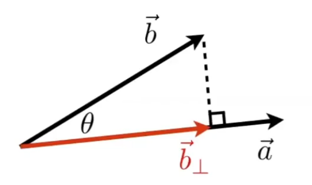

$$
\vec{b_{\bot}} = \lVert \vec{b_\bot} \rVert = \lVert \vec{b} \rVert * \cos \Theta
$$

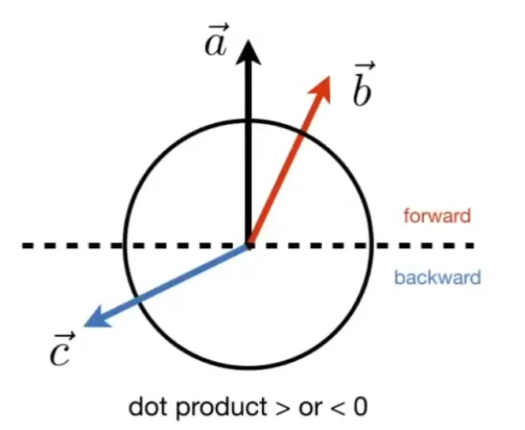

> 方向大致相同：$\cos{(\vec{a} \backsim \vec{b})} < 0$  
> 方向不同：$\cos{(\vec{a} \backsim \vec{c})} > 0$  

- 向量点乘的作用(单位向量)
  - 通过点乘的运算，可以找到两个方向之间的余弦夹角  
  - 找到一个向量投影到另一个向量中，也会用到点乘运算  
  - 判断两个向量是否接近，通过值的大小比较即可（cos在0~$\pi$单调递减）
  - 关于是否同方向的信息（$\cos \theta$小于$90°$大于0，否则小于0）

### 叉乘

两个向量叉乘的结果是垂直于当前两个向量所在平面的新的向量  


$$
\vec{a} \times \vec{b} = -\vec{b} \times \vec{a}\\
\lVert \vec{a} \times \vec{b} \rVert = \lVert \vec{a} \rVert * \lVert \vec{b} \rVert * \sin{\Theta}
$$

叉乘的运算需要用到右手螺旋法则，$\vec{a} \times \vec{b}$就是四指从$\vec{a}$到$\vec{b}$，那么大拇指的指向就是$\vec{c}$所在的方向

叉乘的一些数学运算规律  

- 叉乘没有交换律
- 叉乘有分配律
- 叉乘有结合律

$$
\vec{x} \times \vec{y} = + \vec{z}\\
\vec{y} \times \vec{x} = - \vec{z}\\
\vec{y} \times \vec{z} = + \vec{x}\\
\vec{z} \times \vec{y} = - \vec{x}\\
\vec{z} \times \vec{x} = + \vec{y}\\
\vec{z} \times \vec{x} = - \vec{y}\\
\vec{a} \times \vec{b} = -\vec{b} \times \vec{a}\\
\vec{a} \times \vec{a} = \vec{0}\\
\vec{a} \times (\vec{b} + \vec{c}) = \vec{a} \times \vec{b} + \vec{a} \times \vec{c}\\
\vec{a} \times (k * \vec{b}) = k * (\vec{a} \times \vec{b})\\
$$

> 上述所有都基于右手坐标系  
> 叉乘没有交换律  

叉乘的数学计算方式

$$
\vec{a} \times \vec{b} = 
\begin{pmatrix}
    y_a * z_b - y_b * z_a \\
    z_a * x_b - x_a * z_b \\
    x_a * y_b - y_a * x_b \\
\end{pmatrix}
$$

- 叉乘的作用
  - 判断左右(根据右手螺旋法则)
  - 判断内外(点是否在三角形内的叉乘解法)

## 矩阵

矩阵和一个数相乘

$$
k * 
\begin{pmatrix}
    x & a \\ 
    y & b \\
    z & c \\
\end{pmatrix} = 
\begin{pmatrix}
    k*x & k*a \\ 
    k*y & k*b \\
    k*z & k*c \\
\end{pmatrix}
$$

矩阵和一个矩阵相乘  

**A矩阵的列数必须等于B矩阵的行数**

$\left( M \times N \right) * \left( N \times P \right) = \left( M \times N \right)$公式中$\left( M \times N \right)$表示M行、N列的矩阵

$$
\begin{pmatrix}
    x_1 & a_1 \\ 
    y_1 & b_1 \\
    z_1 & c_1 \\
\end{pmatrix}*
\begin{pmatrix}
    x_2 & a_2 & q_2 & e_2 \\ 
    y_2 & b_2 & w_2 & r_2 \\
\end{pmatrix}=
\begin{pmatrix}
    x_1 * x_2 + a_1 * y_2 & x_1 * a_2 + a_1 * b_2 & x_1 * q_2 + a_1 * w_2 & x_1 * e_2 + a_1 * r_2 \\ 
    y_1 * x_2 + b_1 * y_2 & y_1 * a_2 + b_1 * b_2 & y_1 * q_2 + b_1 * w_2 & y_1 * e_2 + b_1 * r_2 +\\
    z_1 * x_2 + c_1 * y_2 & z_1 * a_2 + c_1 * b_2 & z_1 * q_2 + c_1 * w_2 & z_1 * e_2 + c_1 * r_2 \\
\end{pmatrix}
$$

- 矩阵的数学规律
  - 矩阵**没有交换律**
  - 矩阵有结合律$(AB)C = A(BC)$
  - 矩阵具有分配律$A(B+C) = AB + AC$

当矩阵与向量相乘时，一般将矩阵放在左边，向量放在右边，向量可以看作是(M, 1)的矩阵，那么左边的矩阵只要是M列就行  

将单位向量按y轴对称的操作：
$$
\begin{bmatrix}
    -1 & 0 \\
    0 & 1
\end{bmatrix} *
\begin{bmatrix}
    x\\
    y
\end{bmatrix}=
\begin{bmatrix}
    -x \\
    y
\end{bmatrix}
$$

矩阵的转置:行和列互换

$$
\begin{bmatrix}
    1 & 2 \\
    3 & 4 \\
    5 & 6 
\end{bmatrix} ^T = 
\begin{bmatrix}
    1 & 3 & 5 \\
    2 & 4 & 6 
\end{bmatrix}
\\
(AB)^T = B^T * A^T
$$

单位矩阵:主对角线上是1，其他地方都是0

$$
I_{3\times3} = 
\begin{bmatrix}
    1 & 0 & 0 \\
    0 & 1 & 0 \\
    0 & 0 & 1
\end{bmatrix}
$$

矩阵的逆：矩阵A乘矩阵B得到单位矩阵，则成B是A的逆，写作$A^{-1}$

$AA^{-1} = I$、$(AB)^{-1} = B^{-1} * A^{-1}$

向量的点乘转成矩阵运算

$$
\vec{a} \cdot \vec{b} = \vec{a}^T\vec{b}=
\begin{bmatrix}
    x_a & y_a & z_a
\end{bmatrix} 
\begin{bmatrix}
    x_b \\ y_b \\ z_b
\end{bmatrix}= \left( x_a*x_b + y_a*y_b + z_a*z_b \right)
$$

向量的叉乘转成矩阵运算

$$
\vec{a} \times \vec{b} = A^*\vec{b} = 
\begin{bmatrix}
    0 & -z_a & y_a \\
    z_a & 0 & -x_a \\
    -y_a & x_a & 0
\end{bmatrix}
\begin{bmatrix}
    x_b \\ y_b \\ z_b
\end{bmatrix}
$$

> $A^*$是$\vec{a}$的dual matrix

## 变换

### 仿射变换

#### 伸缩变换(Scale)


$$
x' = sx\\
y' = sy\\
\Rightarrow \\
\begin{bmatrix}
    x' \\ y'
\end{bmatrix}= 
\begin{bmatrix}
    s & 0 \\
    0 & s 
\end{bmatrix}
\begin{bmatrix}
    x \\ y
\end{bmatrix}
$$

### 镜像

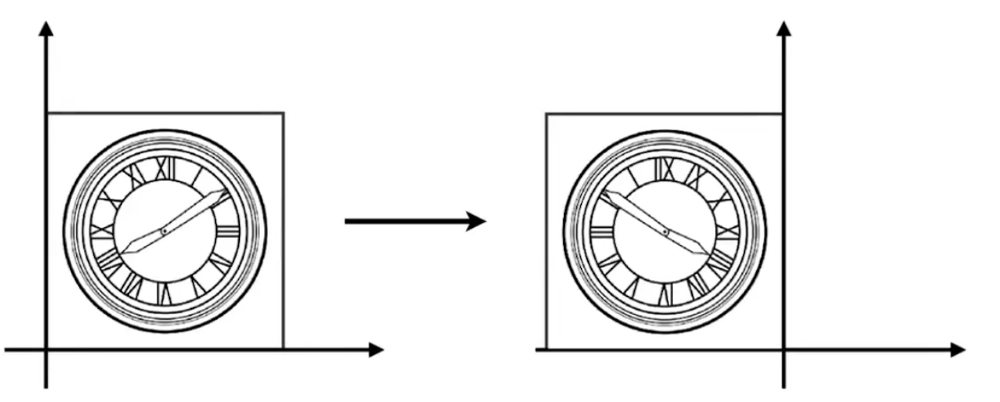

$$
x' = -x\\
y' = y\\
\Rightarrow \\
\begin{bmatrix}
    x' \\ y'
\end{bmatrix}= 
\begin{bmatrix}
    -1 & 0 \\
    0 & 1 
\end{bmatrix}
\begin{bmatrix}
    x \\ y
\end{bmatrix}
$$

#### 切变

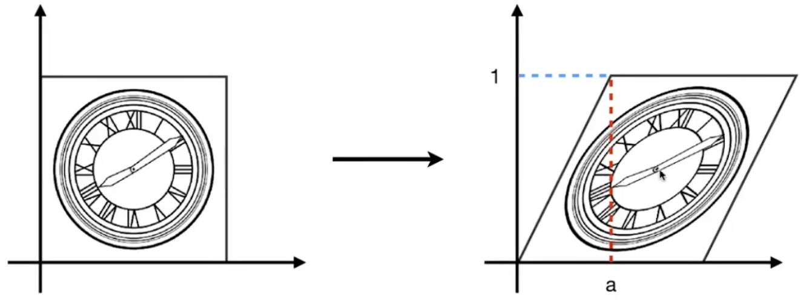

$$
x' = x + a*y\\
y' = y\\
\Rightarrow \\
\begin{bmatrix}
    x' \\ y'
\end{bmatrix}= 
\begin{bmatrix}
    1 & a \\
    0 & 1 
\end{bmatrix}
\begin{bmatrix}
    x \\ y 
\end{bmatrix}
$$

#### 旋转(Rotate)

**默认绕原点逆时针旋转**


公式推导  
- 右下角点坐标(1, 0)=>($\cos\Theta, \sin\Theta$)
- 左上角点坐标(0, 1)=>($-\sin\Theta, \cos\Theta$)

$$
\left(x', y'\right)
\Longrightarrow
\begin{bmatrix}
    A & B \\
    C & D 
\end{bmatrix}
\begin{bmatrix}
    x \\ y
\end{bmatrix}\\
带入x=1, y=0, x'=\cos\Theta, y'=\sin\Theta\\
得: A = \cos\Theta , C = \sin\Theta\\
带入x=0, y=1, x'=-\sin\Theta, y'=\cos\Theta\\
得: B = -\sin\Theta, D = \cos\Theta
$$

#### 平移(Transiation)


- $x' = x + t_x$
- $y' = y + t_y$

$$
\begin{bmatrix}
    x' \\ y ^ `
\end{bmatrix}=
\begin{bmatrix}
    1 & 0 \\
    0 & 1 
\end{bmatrix}
\begin{bmatrix}
    x \\ y
\end{bmatrix}+
\begin{bmatrix}
    t_x \\ t_y
\end{bmatrix}
$$

很明显，这个**平移**的坐标无法通过一个矩阵就表示出来，这个时候就需要引入**齐次矩阵**

> **齐次矩阵**就是将一个原本是n维的向量用一个n+1维向量来表示

$$
\begin{bmatrix}
    x' \\ y ^ ` \\ 1
\end{bmatrix}=
\begin{bmatrix}
    1 & 0 & t_x \\
    0 & 1 & t_y \\
    0 & 0 & 1
\end{bmatrix}
\begin{bmatrix}
    x \\ y \\ 1
\end{bmatrix}=
\begin{bmatrix}
    x + t_x \\ y + t_y \\ 1
\end{bmatrix}
$$

通过齐次坐标矩阵就可以使用一个矩阵来表示线性变换，**为了保证变换矩阵的一致性**，所以上面讲的**所有矩阵都需要转换成齐次矩阵**

在其次坐标中，点使用$\begin{pmatrix}
    x \\ y \\ 1
\end{pmatrix}$
来表示，向量使用$\begin{pmatrix}
    x \\ y \\ 0
\end{pmatrix}$
来表示

- 向量 + 向量 = 向量  
- point - point = 向量
- point + vector = point
- point + point = 两点的中点

为什么point + point的结果是两个点的中点

$$
A = \begin{pmatrix}
    x \\ y \\ w
\end{pmatrix}=
\begin{pmatrix}
    x / w \\ y / w \\ 1
\end{pmatrix}
\\
B = \begin{pmatrix}
    a \\ b \\ c
\end{pmatrix}=
\begin{pmatrix}
    a / c \\ b / c \\ 1
\end{pmatrix}
\\
A + B = 
\begin{pmatrix}
    x/w + a/c \\ y/w + b/c \\ 2
\end{pmatrix}=
\begin{pmatrix}
    \frac{x}{2w} + \frac{a}{2c} \\
    \frac{y}{2w} + \frac{b}{2c} \\
    1
\end{pmatrix}
$$

#### 总和

$$
Scale \Longrightarrow
S(s_x, s_y) = 
\begin{pmatrix}
    s_x & 0 & 0 \\
    0 & s_y & 0 \\
    0 & 0 & 1
\end{pmatrix}
\\
Rotation \Longrightarrow
R(\Theta) = 
\begin{pmatrix}
    \cos\Theta & -\sin\Theta & 0 \\
    \sin\Theta & \cos\Theta & 0 \\
    0 & 0 & 1
\end{pmatrix}
\\
Translation \Longrightarrow
T(t_x, t_y) = 
\begin{pmatrix}
    1 & 0 & t_x \\
    0 & 1 & t_y \\
    0 & 0 & 1
\end{pmatrix}
$$

### 逆变换

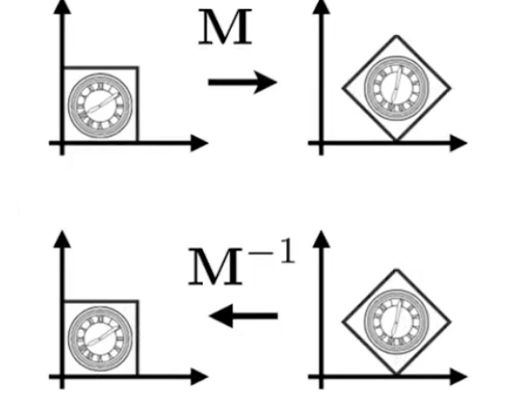

逆变换就是把之前的操作反向来一次，对应的就是矩阵中的逆矩阵 


### 组合变换

- 图1
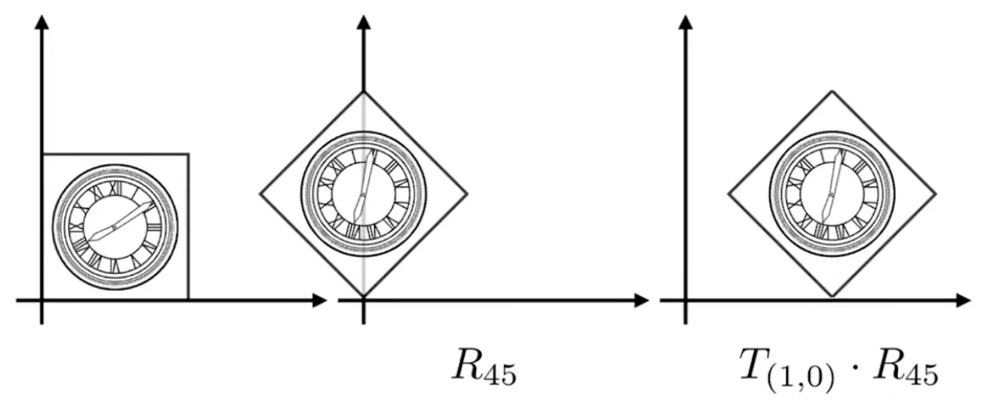

- 图2
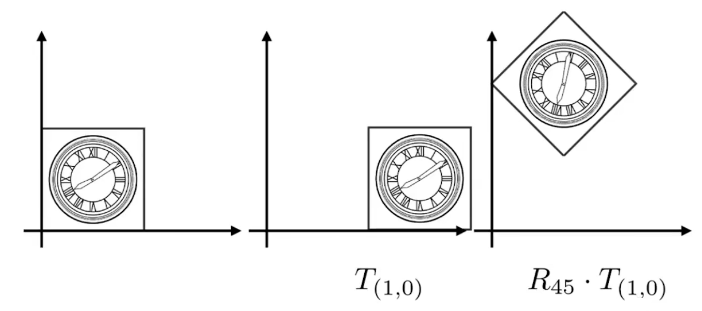

> 旋转默认绕原点，逆时针旋转  

比较上述两张图片，可以发现先旋转再平移 与 先平移再旋转 得到的结果是不同的，对应的理解就是**矩阵的乘法**，矩阵乘法不满足交换律

为了得到图1的效果，我们需要先旋转45°，再向X轴正方向平移1一个单位

$$
T_{(1， 0)} \cdot R_{45} \cdot \begin{bmatrix}
    x \\ y \\ 1
\end{bmatrix}= 
\begin{bmatrix}
    1 & 0 & 1 \\
    0 & 1 & 0 \\
    0 & 0 & 1 
\end{bmatrix}
\begin{bmatrix}
    \cos45° & -\sin45° & 0 \\
    \sin45° & \cos45° & 0 \\
    0 & 0 & 1 
\end{bmatrix}
\begin{bmatrix}
    x \\ y \\ 1
\end{bmatrix}
$$

前面提过向量一般放在矩阵乘法的最右边，并且根据矩阵具有结合律，上述式子可以理解为先计算$R_{45}$与$\begin{bmatrix}x\\y\\1\end{bmatrix}$，再计算与$T_{(1, 0)}$的乘法

但是，根据矩阵的结合律，我们可以先把前面的矩阵的计算结果得出最终变换矩阵，最后与向量相乘

$$
A_n(...A_2(A_1(X)) = 
\underbrace{A_n...A_2 \cdot A_1}_{先计算} \cdot \begin{pmatrix}
    x \\ y \\ 1
\end{pmatrix}
$$

### 变换的分解

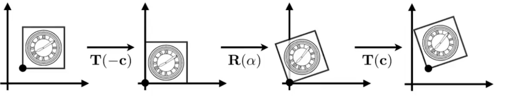

如果想让图片围绕左下角旋转，而不是原点选择，可以采用的解法是 

左下角移动到原点 => 绕原点旋转 => 左下角移动到起始位置  

### 三位空间的变换

三维与二维无非就是多了一个维度，其他的变换相似，原理相同

point : $\begin{pmatrix}
    x & y & z & 1
\end{pmatrix}^T$  
vector : $\begin{pmatrix}
    x & y & z & 0
\end{pmatrix}^T$

$$
\begin{pmatrix}
    x' \\ y^1 \\ z' \\ 1
\end{pmatrix}=
\begin{pmatrix}
    a & b & c & t_x \\
    d & e & f & t_y \\
    g & h & i & t_z \\
    0 & 0 & 0 & 1
\end{pmatrix}
\begin{pmatrix}
    x \\ y \\ z \\ 1
\end{pmatrix}
\\
Scale \Longrightarrow
S(s_x, s_y, s_z) =
\begin{pmatrix}
    s_x & 0 & 0 & 0 \\
    0 & s_y & 0 & 0 \\
    0 & 0 & s_z & 0 \\
    0 & 0 & 0 & 1
\end{pmatrix}
\\
Translation \Longrightarrow
T(t_x, t_y, t_z) =
\begin{pmatrix}
    1 & 0 & 0 & t_x \\
    0 & 1 & 0 & t_y \\
    0 & 0 & 1 & t_z \\
    0 & 0 & 0 & 1
\end{pmatrix}
\\
R_x(\Theta)=
\begin{pmatrix}
    1 & 0 & 0 & 0 \\
    0 & \cos\Theta & -\sin\Theta & 0 \\
    0 & \sin\Theta & \cos\Theta & 0 \\
    0 & 0 & 0 & 1
\end{pmatrix}绕X轴旋转
\\
R_y(\Theta) =
\begin{pmatrix}
    \cos\Theta & 0 & \sin\Theta & 0 \\
    0 & 1 & 0 & 0 \\
    -\sin\Theta & 0 & \cos\Theta & 0 \\
    0 & 0 & 0 & 1
\end{pmatrix}绕Y轴旋转
\\
R_z(\Theta) = 
\begin{pmatrix}
    \cos\Theta & -\sin\Theta & 0 & 0 \\
    \sin\Theta & \cos\Theta & 0 & 0 \\
    0 & 0 & 1 & 0 \\
    0 & 0 & 0 & 1
\end{pmatrix}绕Z轴旋转
\\
R_{xyz}(\alpha, \beta, \sigma) = R_x(\alpha)R_y(\beta)R_z(\sigma)
$$

> 旋转时，绕哪个轴旋转，那个轴对应的坐标不变，所以x轴旋转的第一行第一列、y轴旋转的第二行第二列、z轴旋转的第三行第三列

如何证明$R_{xyz}(\alpha, \beta, \sigma) = R_x(\alpha)R_y(\beta)R_z(\sigma)$成立，这个时候需要引入**罗德里格斯公式**


### 视图变换 Camera/View

视图就类似使用设计相机拍照，视图就是镜头中的世界  

- 拍一张好照片需要
  - 好的地方（Module），搭建场景
  - 好的角度（view），视图变换
  - 投影（三维空间投影到二维照片）

综上，就是图形学渲染出效果的模型(Model)、视图(View)、投影(Projection)变换，简称MVP变换

- 定义相机
  - 坐标
  - 向上的向量(一个向量就可以确定相机的Roll)
  - 朝向

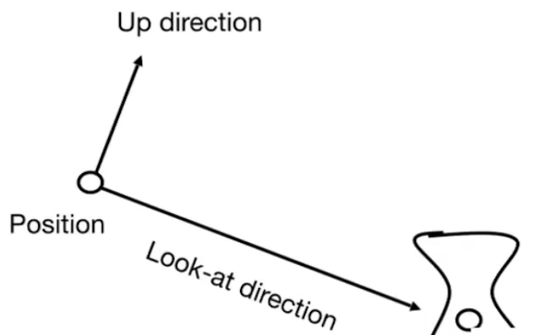

**约定：相机永远在原点，永远不动，永远以y轴向上，永远看向-Z轴**
其他物体也跟着相机移动

- 针对坐标为(x, y, z)，角度为(a, b, c)的相机，需要做哪些变换
  1. 相机移动到原点坐标
  2. 相机的朝向旋转到-Z轴方向
  3. 相机的向上向量旋转到Y轴方向

设定相机的朝向向量为g，相机向上的向量为t，可推得相机另一个轴的向量为$g \times t$

$$
T_{view} =
\begin{bmatrix}
    1 & 0 & 0 & -x_e \\
    0 & 1 & 0 & -y_e \\
    0 & 0 & 0 & -z_e
\end{bmatrix} 坐标变换矩阵
\\
R^{-1}_{view} =
\begin{bmatrix}
    x_{g \times t} & x_t & x_{-g} & 0 \\
    y_{g \times t} & y_t & y_{-g} & 0 \\
    z_{g \times t} & z_t & z_{-g} & 0 \\
    0 & 0 & 0 & 1
\end{bmatrix} 不加证明给出矩阵R_{view}^{-1}
\\
R_{view}^{-1} * 
\begin{bmatrix}
    1 \\ 0 \\ 0
\end{bmatrix} = 
\begin{bmatrix}
    x_{g \times t} \\
    y_{g \times t} \\
    z_{g \times t} \\
\end{bmatrix} 可见R_{view}^{-1}乘以X轴、Y轴、Z轴都等于相机对应的向量坐标
\\
R^{-1}_{view} * 标准矩阵 = 相机矩阵 \Longrightarrow 相机矩阵 * R_{view} = 标准矩阵
\\
R_{view}^{-1}是R_{view}的逆矩阵
\\
R_{view} =
\begin{bmatrix}
    x_{g \times t} & y_{g \times t} &z_{g \times t} & 0 \\
    x_t & y_t & z_t & 0 \\
    x_{-g} & y_{-g} & z_{-g} & 0 \\
    0 & 0 & 0 & 1
\end{bmatrix} 不加证明给出矩阵R_{view}
\\
M_{view} = R_{view} T_{view} 组合后得出视图变换矩阵(从右往左的理解顺序，先平移、再旋转)
$$

相机和所有的物体都根据该模型移动到特定位置，此时相机肯定是在原点的、看向-Z轴，向上坐标为Y轴的，各个物体的相对位置不变  

模型(单独对模型的操作)-视图(对相机的操作并同步到模型上)变换

### 投影变换

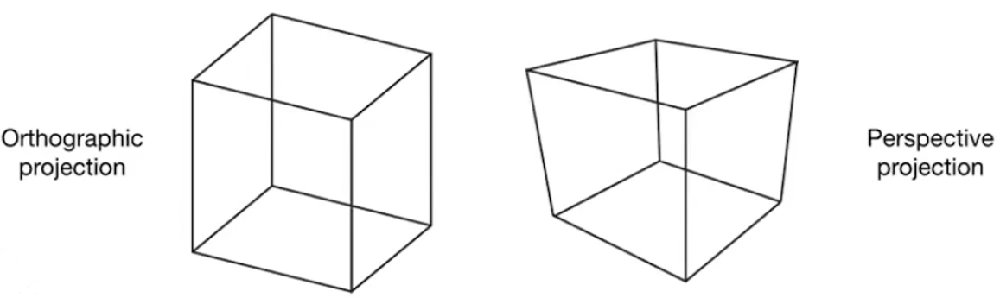

> 图中左边为正交投影，右边是透视投影

- 正交投影不会带来近大远小的世界效果，一般用于工程制图  
- 透视投影会有近大远小

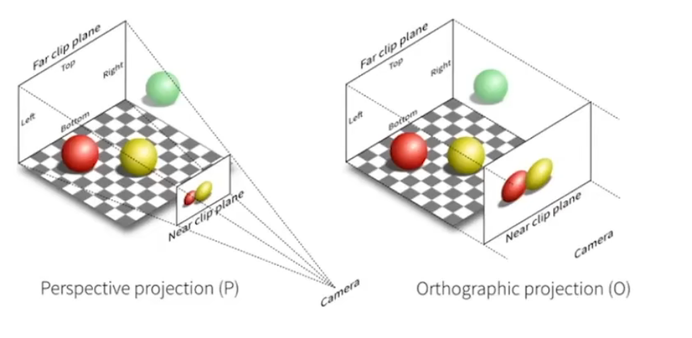

> 图中左边为透视投影，右边为正交投影

对于正交投影出来的图片结果，可以理解为相机在一个无限远的地方拍照，这样物体之间的距离差距就可以忽略不计了(走路月亮跟着你走的也是这个原因)

#### 正交投影 Orthographic

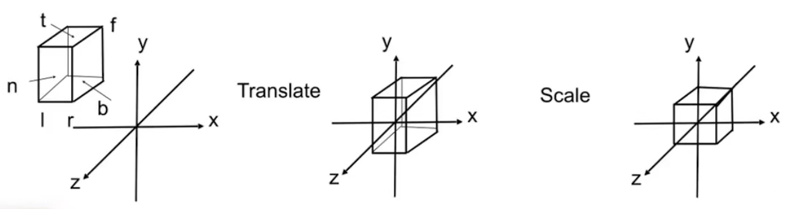

- 在正交投影中定义一个矩阵，需要定义
  - l(left)、r(right)，左平面距离矩形中心的距离和右平面距离矩形中心的距离
  - t(top)、b(bottom)，上平面距离矩形中心的距离和下平面距离矩形中心的距离
  - f(far)、r(near)，远平面距离矩形中心的距离和近平面距离矩形中心的距离

> 因为相机朝向是-Z轴，所以f值一般小于r值

在定义完一个矩形之后，需要将其通过一系列变换转换成图片中最右边的标准立方体(canonical cub $[-1 ,1]^3$)

- 一系列变换指的是
  - 矩形移动到原点
  - X、Y、Z轴拉伸成[-1, 1]

$$
M_{ortho} =
\begin{bmatrix}
    \frac{2}{r-l} & 0 & 0 & 0 \\
    0 & \frac{2}{t-b} & 0 & 0 \\
    0 & 0 & \frac{2}{n-f} & 0 \\
    0 & 0 & 0 & 1 
\end{bmatrix} 
\begin{bmatrix}
    1 & 0 & 0 & -\frac{r+l}{2} \\
    0 & 1 & 0 & -\frac{t+b}{2} \\
    0 & 0 & 1 & -\frac{n+f}{2} \\
    0 & 0 & 0 & 1
\end{bmatrix}
$$

> 左边缩放矩阵、右边平移矩阵（操作顺序从右往左理解）  
> 暂不考虑旋转

这里对物体做了拉伸，未来还会做一次**视口变换**，**视口变换**时会再做一次拉伸

#### 透视投影 Perspective

理论上两条平行的先看起来相交了


前置知识：点(x, y, z, 1)乘以k，得到(kx, ky, kz, k != 0)表示其实也是点(x, y, z, 1)，将k换成z，可以得到(xz, yz, $z^2$,z != 0)，也表示(x, y, z, 1)这个点  

> (1, 0, 0, 1)与(2, 0, 0, 2)表示同一个点


- 透视投影分两步 
    1. 将Frustum平截头体转换成Cuboid矩形
    2. 进行一次正交投影

- 将Frustum平截头体转换成Cuboid矩形
  - n(near)平面的四个点不会发生变换
  - f(far)平面的z值不会发生变换，只是在平面内进行收缩
  - n、f平面的中心点不会发生变化


通过侧面观察，更容易得到结论  

最左边的红点就是摄像机的位置，中间的红点就是n(near)平面，最右边的红点就是f(far)平面  

目标就是将(x, y, z) => (x, y\', z)，通过相似三角形可以推出计算公式

设$M_{persp}$为透视变换矩阵

设$M^{(4\times4)}_{persp \rightarrow ortho}$为透视变换成正交的变换矩阵

得出$M_{persp}=M_{ortho}M^{(4\times4)}_{persp \rightarrow ortho}$，即将模型先变换成正交可以用的矩形，再通过正交变换矩阵计算

$x`=\frac{n}{z}x,y`=\frac{n}{z}y$

$$
\begin{pmatrix}
    x \\ y \\ z \\ 1
\end{pmatrix}
\Rightarrow
\begin{pmatrix}
    nx/x \\ ny/z \\ unknow \\ 1
\end{pmatrix} ==
\begin{pmatrix}
    nx \\ ny \\ still unknow \\ z
\end{pmatrix}
\\
M^{(4\times4)}_{persp \rightarrow ortho} 
\begin{pmatrix}
    x \\ y \\ z \\ 1
\end{pmatrix} = 
\begin{pmatrix}
    nx \\ ny \\ unknow \\ z
\end{pmatrix}
\Rightarrow
M^{(4\times4)}_{persp \rightarrow ortho} =
\begin{pmatrix}
    n & 0 & 0 & 0 \\
    0 & n & 0 & 0 \\
    ? & ? & ? & ? \\
    0 & 0 & 1 & 0
\end{pmatrix}
$$

> 透视变换矩阵最后一行完全可以是(0 0 0 z)，但是z是变量，到时候计算的时候还得实时带入z的真实值，对于计算机来说很麻烦，要开辟内存，还要传值，浪费资源

- 此时带入观察到的两个细节
  - 对近平面来说，(x, y, n, 1) (n表示近平面的z)与透视变换矩阵运算，其x、y、n值不变
  - 对远平面来说，(x, y, f, 1) (f表示远平名的z)与透视变换矩阵运算，其f值不变
  - 对远平面来说，(0, 0, f, 1) 与透视变换矩阵运算，其值不变，仍未(0, 0, f, 1)

$$
M^{(4\times4)}_{persp \rightarrow ortho} 
\begin{pmatrix}
    x \\ y \\ n \\ 1
\end{pmatrix} = 
\begin{pmatrix}
    x \\ y \\ n \\ 1 
\end{pmatrix} ==
\begin{pmatrix}
    nx \\ ny \\ n^2 \\ n 
\end{pmatrix}
\\
设M^{(4\times4)}_{persp \rightarrow ortho}第三行为
\begin{pmatrix}
    A & B & C & D
\end{pmatrix}
带入上述式子的计算中得
\begin{pmatrix}
    A & B & C & D
\end{pmatrix}
\begin{pmatrix}
    x \\ y \\ n \\ 1
\end{pmatrix} = n^2
\\
得到A=0, B=0, C*n + B = n^2
\\
M^{(4\times4)}_{persp \rightarrow ortho} 
\begin{pmatrix}
    0 \\ 0 \\ f \\ 1
\end{pmatrix} = 
\begin{pmatrix}
    0 \\ 0 \\ f \\ 1 
\end{pmatrix} ==
\begin{pmatrix}
    0 \\ 0 \\ f^2 \\ f
\end{pmatrix}
\\
带入前面推理(0, 0, C, D)式子中，得到 Cf + D = f^2
\\
\begin{matrix}
    Cn + D = n^2 \\
    Cf + D = f^2
\end{matrix}
\Longrightarrow
\begin{matrix}
    C = n + f \\
    D = -nf
\end{matrix}
\\
M^{(4\times4)}_{persp \rightarrow ortho} = 
\begin{pmatrix}
    n & 0 & 0 & 0 \\
    0 & n & 0 & 0 \\
    0 & 0 & n + f & -nf \\
    0 & 0 & 1 & 0
\end{pmatrix}
$$

将得到的矩阵与（x，y，z，1）相乘后z的值等于(-nf)*z^(-1)+(n+f),是个反比例函数，这个图像恒过（n，n）与（f，f），在n与f之间，z是下凹的，所以z变小了，即再f与n平面之间的点的z是会变小的

# 光栅化(Rasterization)

将三维空间的几何形体显示到屏幕上  
将投影的基本体分解为片段（像素）  

通过前面的视图变换、投影变换（正交、透视），我们得到了[-1, 1]^3的标准立方体

- 定义视锥需要的两个数据
  - 宽高比
  - 垂直的可视角度

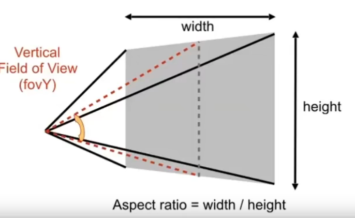

- **屏幕**：图形学中认为屏幕是一个数组，数组中每一个元素是一个像素
- **光栅**：Raster，就表示屏幕，光栅化(Rasterize)可以理解为把东西绘制在屏幕上
- **像素**：Pixel(Picture Element的缩写)
- **屏幕空间**：在屏幕上定义的坐标系，屏幕左下角为(0, 0)原点，向上为Y轴正方向，向右为X轴正方向
  - 坐标从0开始，而不是从1开始
  - 屏幕的所有的像素是从(0, 0)到(width - 1, height - 1)
  - (x, y)点像素的中心在(x + 0.5, y + 0.5)上
  - 屏幕表示的范围从(0, 0)到(width, height)

- 在不考虑Z轴的情况下，将[-1, 1]的矩阵的x、y坐标映射到屏幕中
  - 移动到屏幕中心
  - 缩放一下
$$
M_{viewport} =
\begin{pmatrix}
    \frac{width}{2} & 0 & 0 & \frac{width}{2} \\
    0 & \frac{height}{2} & 0 & \frac{height}{2} \\
    0 & 0 & 1 & 0 \\
    0 & 0 & 0 & 1
\end{pmatrix}
$$

- 图形学广泛使用三角形
  - 三角形是最基础的多边形
  - 任何多边形都可以被拆分成多个三角形
  - 三角形三个点肯定在同一个平面
  - 三角形内外定义清晰（多边形可能有洞 圆环，可能不是凸包）
  - 三角形三个点定义不同属性，三角形内部的各个点可以逐渐渐变

利用像素中心，对屏幕空间进行采样

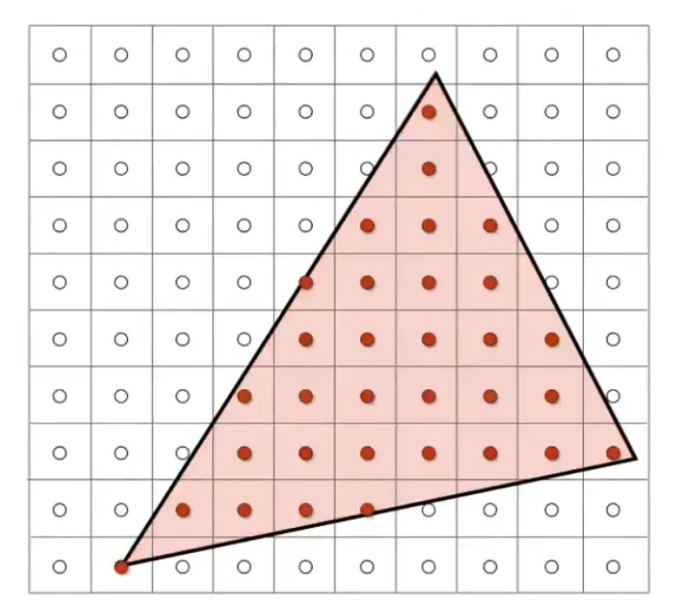

$$
inside(tri, x, y) =
\begin{cases}
    1, Point(x, y) 在 tri 这个形状中 \\
    0, Point(x, y) 不在 tri 形状中
\end{cases}
$$

```cpp
for(int x = 0; x < width; ++x){
    for(int y = 0; y < height; ++y){
        image[x][y] = inside(tri, x+0.5, y+0.5)
    }
}
```

> 通过上述代码就可以知道(x, y)像素是否在多边形中，因为像素中心坐标是(x+0.5, y+0.5)，所以传入的是像素中心坐标

那么如何判断像素点是否在三角形内呢？ 最开始将的**叉乘**就可以用到了  

判断像素是否在三角形中不用判断(0, 0)到(width, height)中所有的像素，只需要判断三角形三个点中最高、最低、最左、最右所围城的矩阵即可，这个矩阵被称为**包围盒**

## 走样与反走样

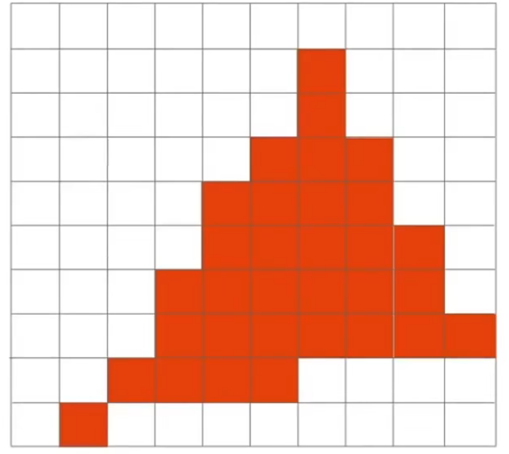

**锯齿**、**走样**、**Aliasing**

**Artifacts**表示一切在计算机图形学中的错误(Error)、瑕疵(Mistakes)

锯齿属于一种`Artifact`，**摩尔纹**也是一种`Artifact`，车轮效应也是`Artifact`

> 车轮效应就是车轮是顺时针旋转的，但是你看车轮确实逆时针旋转，就是人眼的采样跟不上车轮的旋转导致的

在采样之前做**模糊**、**滤波**处理

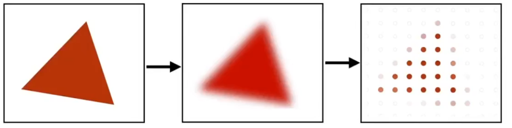

**傅里叶级数展开**：任何周期性函数都写成一系列正弦和余弦以及一个常数项的总和


$$
f(x) = \frac{A}{2} + \frac{2A\cos(tw)}{\pi} - \frac{2A\cos(3tw)}{3\pi} + \frac{2A\cos(5tw)}{5\pi} - \frac{2A\cos(7tw)}{7\pi} + ...
$$

如上图所示，将很多个不同频率的正弦余弦叠加在一起，拼出一个与目标近似的周期函数，此时运用极限的思想，可以推理出无限个正弦余弦叠加就能拼出目标函数

**傅里叶变换**：给定任意函数可以通过一系列变换变成另一个函数，还可以把变换后的函数通过逆变换再变回去

- 傅里叶变换： $F(w) = \int_{-\infty}^{\infty}f(x)e^{-2\pi iwx}dx$
- 逆傅里叶变换：$f(x) = \int_{-\infty}^{\infty}F(w)e^{2\pi iwx}dw$

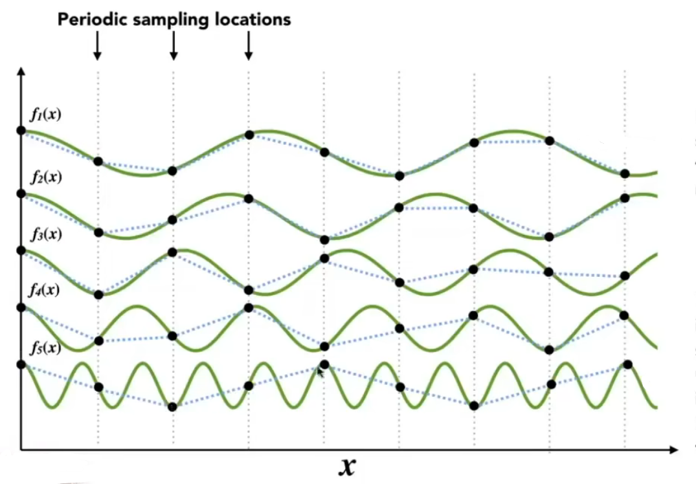

这里给出不同的五种函数从$f_1(x) \Rightarrow f_5(x)$，从上到下频率逐渐增加，我们发现按照虚线对函数进行采样，采样得到的点(途中黑色的点)连起来逐渐不能恢复曲线原来的磨样(黑点之间的链接虚线与原曲线的差距越来越大)

通过上图我们可以发现，当采样的频率跟不上曲线变换的频率的时候，就无法还原出原始信号

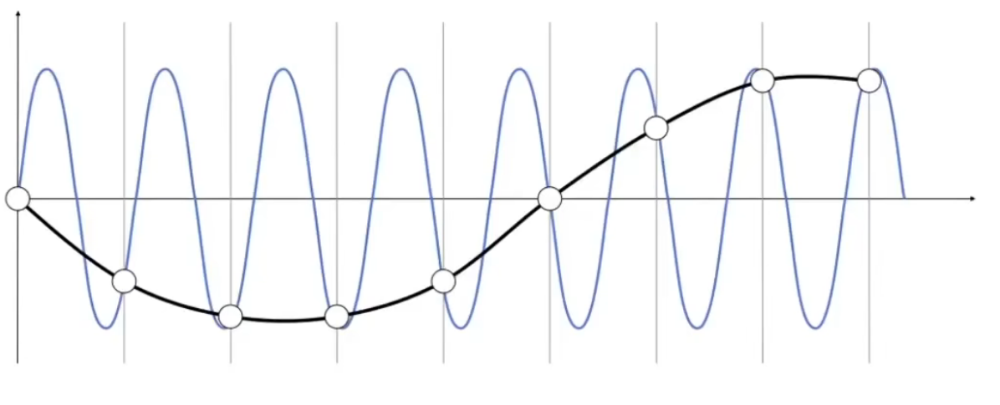

> 竖线为采样线，白点为采集到的点，蓝色和黑色线表示两种函数

同样的采样方法，采样两种不同的频率的函数，我们无法区分，我们称之为**走样**

**滤波**：删除某些特定频率。那么对应的信号应该如何变换

傅里叶变换可以把图片从时域信号变为频域信号

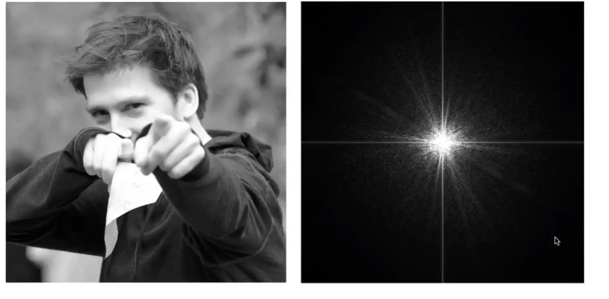

> 图左为时域信号，图右为频域信号

频域空间图：中心定义为最低频的区域，周围定义成高频区域，不同的频域的地方有多少信息通过亮度来表示

根据上述图片来理解就是：亮点主要集中在中心，说明原图片低频信息多，高频信息少(不是没有)

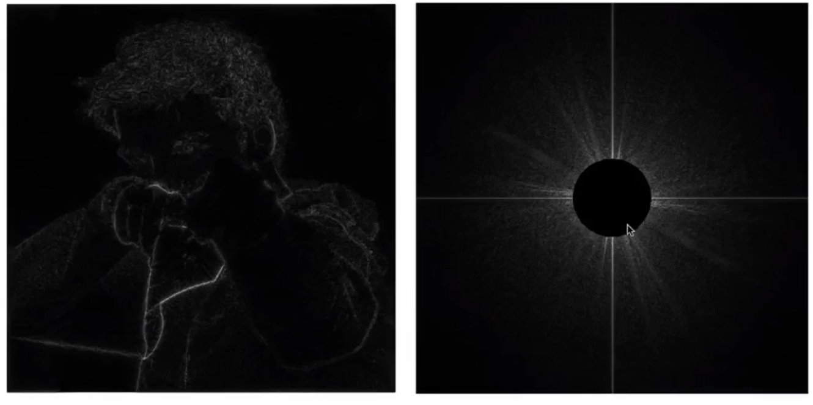

同一张图，如果将**频域空间**中间的低频信号删除(白色改成黑色)，再逆傅里叶变换回去，可以发现图像的边界特别明显

> 上述操作就是 **高通滤波**(把低频的删除，只留下高频)

边界，可以理解成上下或左右差距很大的地方。那么差距大就可以理解为变化频率高，即**高频信息**，那么通过**高频滤波**，自然而然就只剩下差距大的地方的了

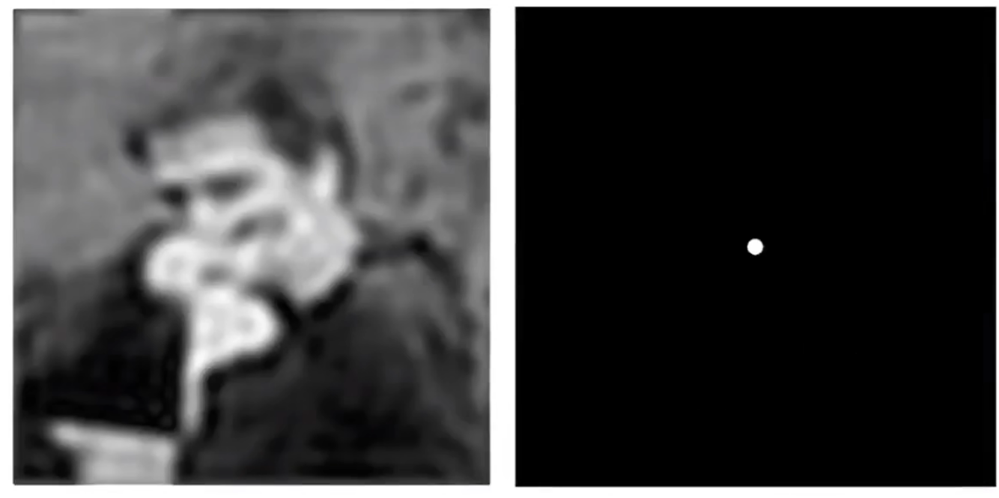

同一张图，如果将**频域空间**的所有高频信息都删除(除中心点附近特定半径内，都设为黑色)，再傅里叶变换回去，可以得到一张很模糊的图片

> 上述操作就是**低通滤波**(低频率通过 高频率去掉)

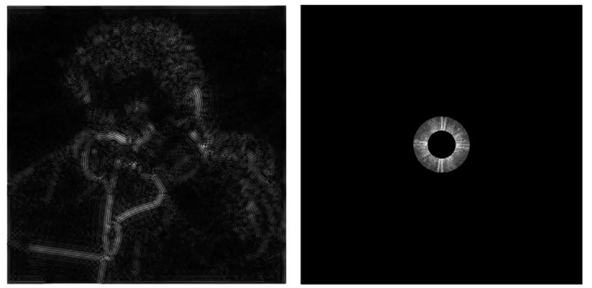

> 特定内容在，**数字图像**处理中学习

### 滤波

**滤波** = 去掉特定频率的信息 = **平均** = **卷积**

**Filtering** = **Convolution** = **Averaging**

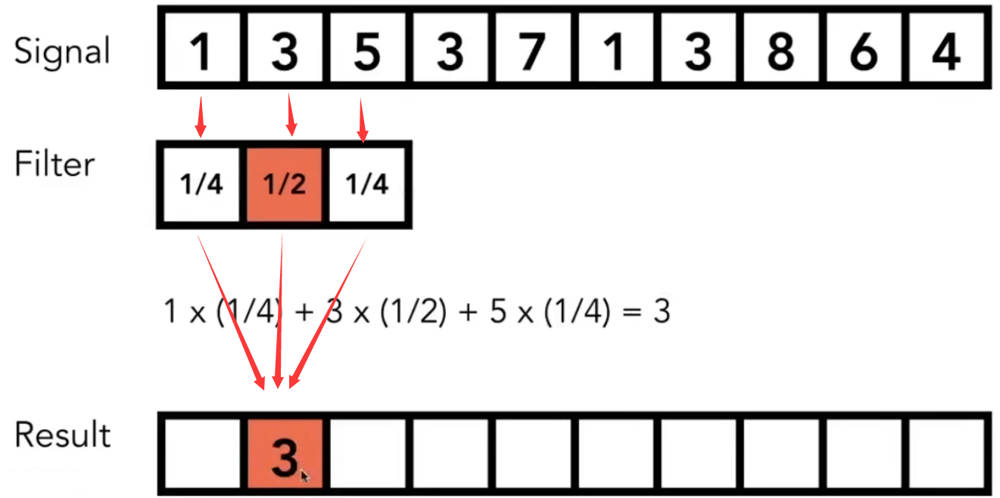

> 简单卷积的理解  
> Filter：滤波器、Siganl：信号

在移动Filter窗口的过程中，将Signal的三个数和Filter的三个数做一个点乘，再将计算结果写回窗口的中心值(说白了就是一种**加权平均**)

也就是说，**卷积**作用在一个信号上，用某种**滤波器**对**信号**进行**卷积**操作，并且得到一个结果

> 并**不是真实数学上的定义**，仅仅是图形学上的简化定义

- 卷积的定理
  - 时域上如果对两个信号进行卷积，对应两个信号各自的频域上，两个信号频域的乘积
  - 时域上如果是乘积，那么频域上就是卷积
  
> 可以拿到一个图，用某种滤波器去做卷积操作  
> 也可以得到图片的傅里叶变换的频域，再把卷积的滤波器变换到频域上，再把两者相乘，得到的频域的结果，最后将结果逆傅里叶变化到时域上

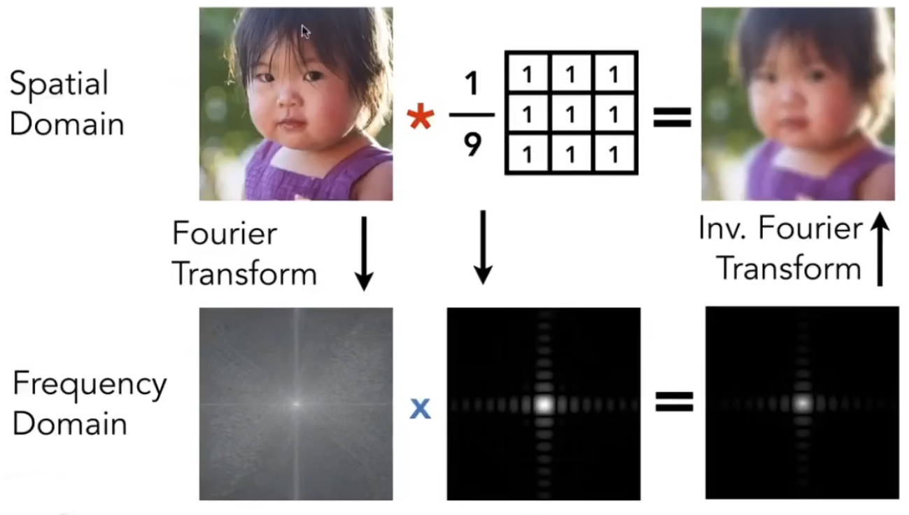

> 均值滤波

- 上面图片可以分上下两块理解
  - 对图片的每个像素都等于自己和周围8个像素的平均值(对时域图做卷积操作)
  - 对傅里叶变化的频域与滤波器的频域相乘(对频域图的乘法操作)

可以发现上述两种操作，得到的结果是相同的

### 采样

**Sampling** = **Repeating Frequency Contents**

**采样**就是重复频域上的内容

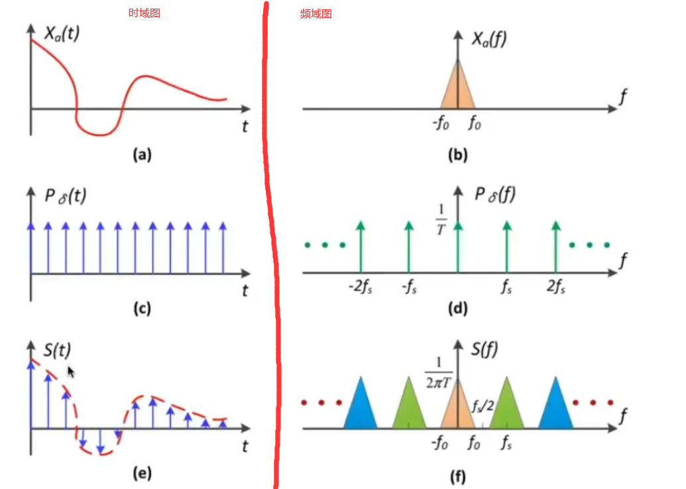

- 图(a) : $X_a(t)$为原函数图像
- 图(c) : $P_\delta(t)$为冲击函数
- 图(e) : $S(t)$为原函数与冲击函数乘积的结果，就是$X_a(t)$函数上离散的点
- 图(b) : $X_a(t)$函数傅里叶变换之后的函数
- 图(d) : $P_\delta(t)$冲击函数傅里叶变换之后的新的冲击函数
- 图(f) : 图(b)与图(d)的卷积的结果

图(c)的冲击函数，就是只有在竖线上才有值，也就是说图(a)与图(c)的乘积就是在图(a)上周期行的取一些点，就跟之前的取样一样的

**采样**：在频率上的理解就是**重复**一个原始信号的平铺


上图中，上面是合理的采样周期，原始信号的平铺是井然有序、严丝合缝的；当采样率不足或采样不够快，就会导致原始信号的间距越小  

那么，我们可以称在频域中，频域的平铺在搬移的情况下发生了混合(混叠)，就是产生**走样**的原因

> 时域中采样越稀疏，在会让频域中的原始数据越密集

### 反走样

#### 增加采样率(减少频域上平铺的混合)，增加屏幕分别率

对于同一台设备，不具有实用性，并不能要求使用者更换显示器

#### 先做模糊，再做采样

通过**低通滤波**，去掉高频信息，再采样

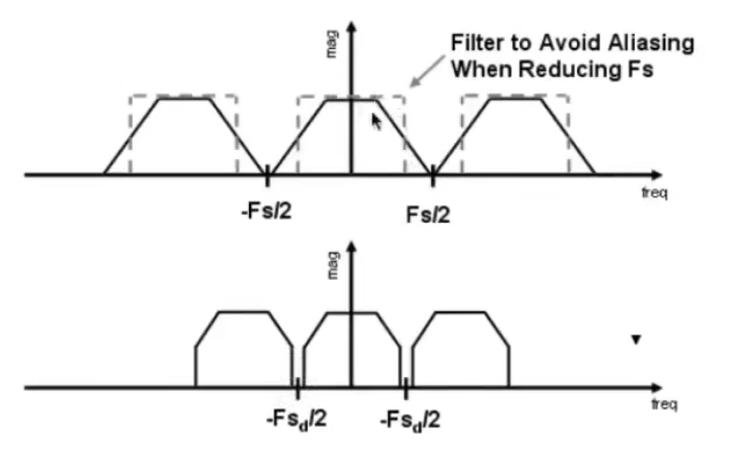

通过去掉高频信号，让原本混叠的部分，不再混叠，从而减少了走样

如何模糊：使用一定大小的低通滤波器对每个像素的覆盖面积做一个卷积

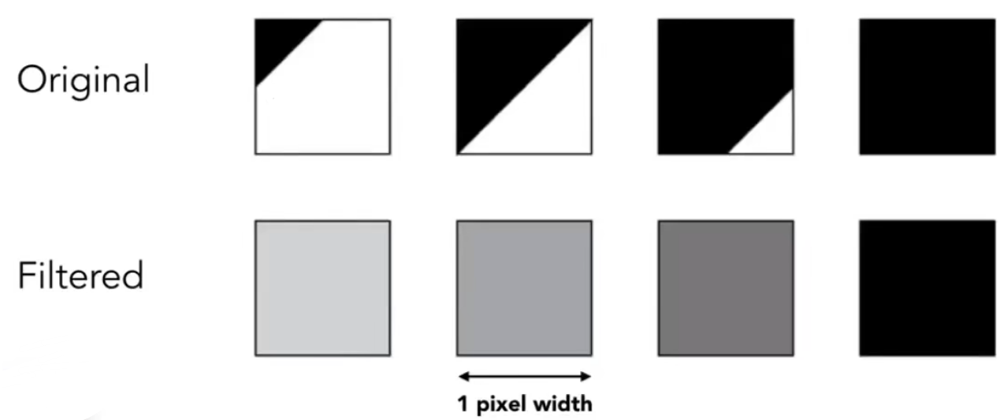

Original是每个像素可能出现的情况，被覆盖小部分、被覆盖一半、被覆盖大部分、被完全覆盖

Fileterd是每个像素通过低通滤波器卷积后的结果

-------

那么如何计算三角形在每个像素中占的比例多少呢？ 不容易、计算量大

#### Antialiasing By Supersampling(MSAA)多重采样抗锯齿

这是近似算法，严格意义上不能解决走样问题

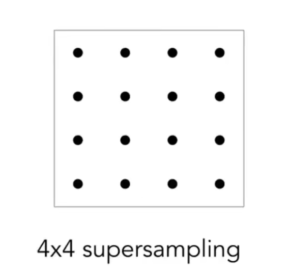

将一个像素，分成若干个小的像素(图中是将一个像素分成4*4，黑色的点表示各个小像素的中心点)，然后再判断各个小像素的中心点是否在三角形中，再把判断结果平均一下，就能得到当前像素百分之多少在三角形中的**近似值**

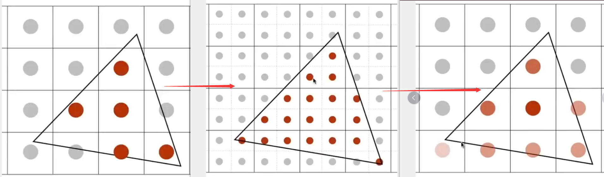

MSAA解决的对信号的模糊操作，只不过MSAA最后的出来的值也可以用作**采样**

- 为了使用MSAA： 增加了计算量(每个像素内又多算了很多次)：工业上会通过更加有效的图案来分布不同的点，而不是这里的均匀分布；也有计算结果复用

#### FXAA(Fast Approximate AA)

快速近似抗锯齿

#### TAA(Temporal AA)

通过上一帧的信息，感知到的信息，来推测

### Super Resolution / super sampling

超分辨率/超采样

将512\*512的图片拉伸成1024\*1024的图片时，会出现非常明显的锯齿  

解决方法就是DLSS(Deep Learning Super Sampling)，就是通过深度学习去猜测缺失部分的信息内容，并且补足

## 深度缓冲

很多三角形叠在一起的时候，怎么处理？

要让离摄像机近的物体遮挡远处物体，通过深度缓冲，也叫Z-Buffer

1. 画家算法

先画远处的面，再画近处的面，一层一层的覆盖

需要先对所有的三角形面片进行排序，时间复杂度 $O(n\log _2n)$

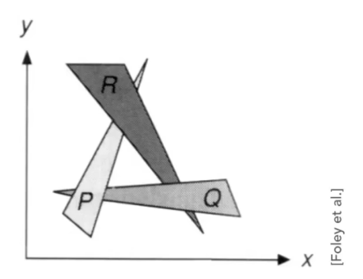

画家算法无法解决这种互相遮挡的关系

2. Z-Buffer

对单独的三角形面片无法排序，那么直接对单个像素进行处理，保证单个像素所存的是其看到的几何物体的最浅的深度信息，即**深度图**，**深度缓存**


左边为渲染出的图片，右边为深度图

> 深度图中，越近越黑，越远越白


图中每个格子表示一个像素，先来了个一个三角形深度都是5，R表示无限大，则5比无限大小，可以覆盖；然后来了个新的三角形，根据深度信息进行覆盖操作

一般而言，n个三角形，每个三角形覆盖常数个像素，那么最终时间复杂度只是$O(n)$

## 着色

shading，引入物体的明暗的不同，颜色的不同，**对不同的物体应用不同的材质的过程**

### Blinn-Phong反射模型

- 反射
  - 高光
  - 漫反射
  - 间接光照

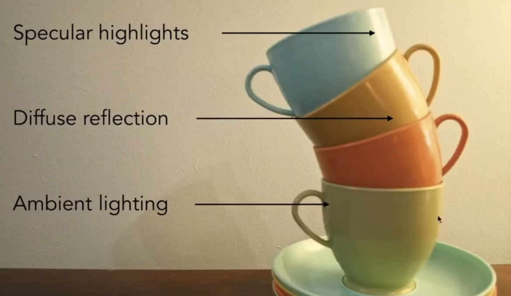

- 定义
  - 在局部，比较小的范围内，物体表面是一个平面(无论物体长什么样)
  - 定义垂直于平面的法线n
  - 摄像机的观察方向v
  - 看向光源的方向l
  - 颜色color
  - 光的亮度 shininess

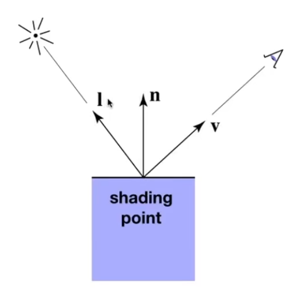

> 所有的方向都是单位向量，只表示方向

#### 漫反射

> 暂且只讨论某一个点的着色，也就是只考虑光照的方向，而不考虑照向这个点的光是不是被挡住了

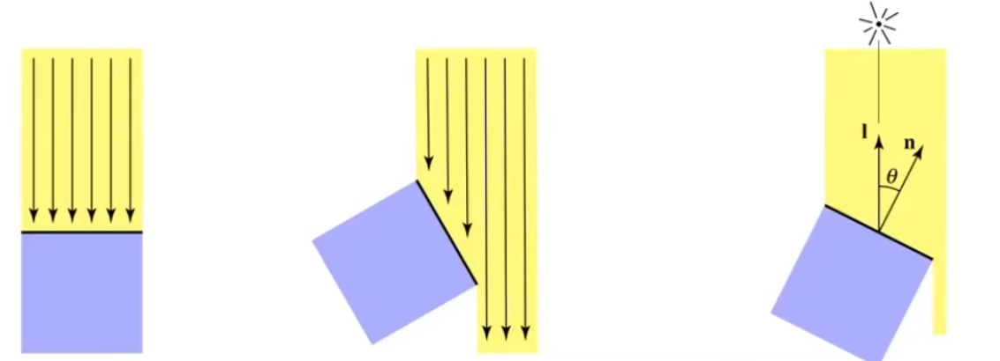

同一束光照，当紫色物体旋转时，其单位面积接收到的光变少，导致其变暗

任何一个着色点周围单位面积能接受到多少光照，与光线的角度成一定关系，从而引出Lambert's定律：接受到的光照与l和n的余弦(上图中的 $\cos \theta$)成正比

> 带入现实，一个是太阳能板，被照射面积越大热得越快；一个是四季，夏天是被太阳光直射

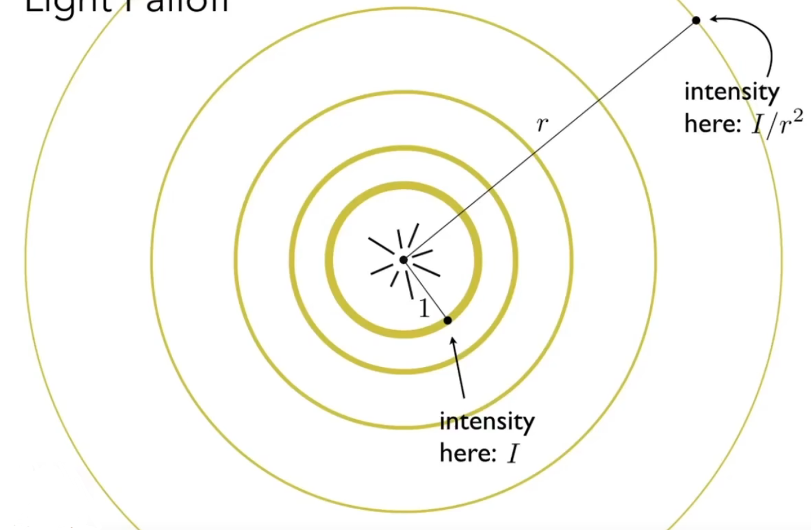

对于一个光源，某一瞬间，其发出的能量是固定的，而伴随着光线的传递，其蕴含的能量也逐渐分散(球壳，而不是圆形)

此时定义距离为1是，光线强度为**I**，当距离为r，则光纤强度为 $\frac{I}{r^2}$，通过这个式子可以算出当前传播到着色点的光照强度

通过上面两个公式，可以得到着色点(Shading Point)的光照强度、多少光会打在着色点上，得到计算式子

$$
L_d = k_d(I/r^2)max(0, n \cdot l)
$$

- 上面的数学表达式就是**漫反射**的表示方法
  - $k_d$漫反射的系数，表示这个点吸收多少能量(类似物体吸收所有颜色就是黑色，不吸收所有颜色就是白色的物理规律)
  - $I/r^2$ 到达着色点的能量
  - $max(0, n \cdot l)$ 接收了多少能量

> 为什么是$max(0, n \cdot l)$ ，$n \cdot l$也就是$\cos \theta$可能为负数，因为光线可能从物体下面往上发射，而这种光不具备物理意义（这里只讨论发射，不讨论折射） 

漫反射的物理规律就是看一个物体无论从什么角度看都是一样的，而上面的$L_d$式子刚好与观察方向v没有任何关系


通过前面的解释，可以清楚的了解为什么这个球是渐变的，从亮变灰再变黑


通过定义$k_d$颜色系数，可以定义该物体整体上的明暗

#### 高光

高光：物体、平面比较光滑，所以反射光线的方向都接近镜面反射的方向


图中R表示镜面反射的方向，黄色部分表示高光反射的区域，v表示观察方向

所以当观察方向与镜面反射方向相近的时候，可以看到物体的高光

在Blinn-Phong模型中，观察方向与镜面反射方向接近的时候，说明了平面的法线方向和 **半程向量(half vector)** 接近

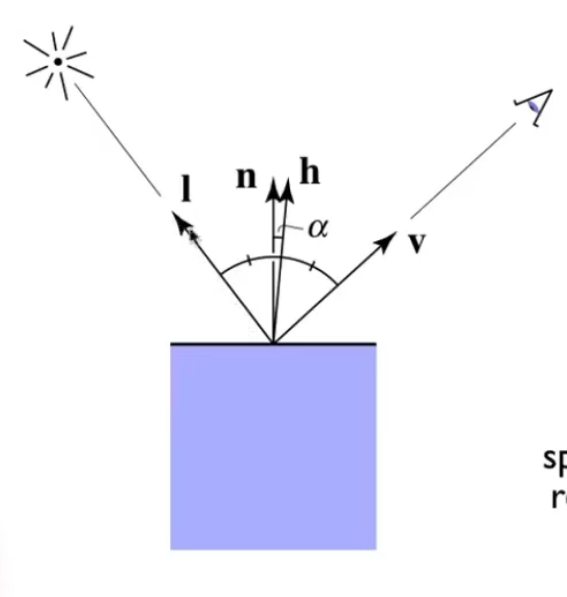

$$
半程向量：\vec{h} = bisector(\vec{v}, \vec{l}) = \frac{\vec{v} + \vec{l}}{\lVert \vec{v} + \vec{l} \rVert} 
\\
L_s = k_s(I / r^2)max(0, \cos \alpha)^p
\Rightarrow 
k_s(I / r^2)max(0, n \cdot h)^p
$$

- 高光的计算公式 $L_s$
  - $k_s$高光系数，颜色之类的，跟漫反射系数类似
  - $(I / r^2)$跟漫反射中的一样，高达此处的光的强度
  - $max(0, \vec{n} \cdot \vec{h})^p$根据观察角度能得到多少光

1. 为啥使用半程向量：半程向量的计算比直接计算光的镜面反射向量简单
2. $\cos \alpha$，在$0~\pi$是单调递减的，复合这里$\alpha$越小高光越多的情况
3. 不考虑从$\cos \alpha$为负数的情况，此时光从下面照射
4.  $max(0, \vec{n} \cdot \vec{h})^p$中指数p的作用如图下所示，通过参数p可以指定高光范围的大小(p越大，高光范围越小，对应下图p越大，数据变小越快，一般100~200)

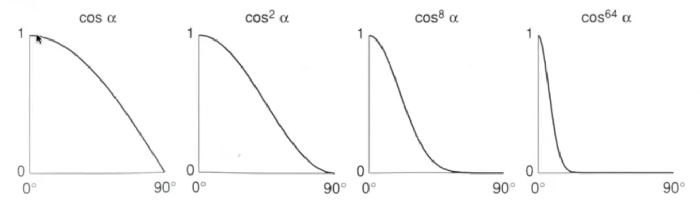

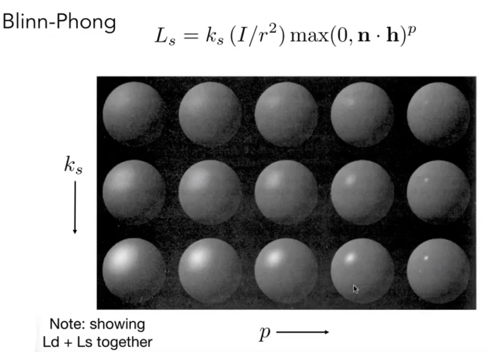

从上到下 高光系数 $k_s$ 逐渐变大，可以发现越来越亮；从左到右 指数p 逐渐变大，高光范围逐渐变小

#### 环境光照

对于处于物体背面的平面不一定就是黑色的，因为有环境光的存在，虽然不会被光线直接照射到，但是会被其他平面的漫反射光照到

在Blinn-Phong模型中，直接大胆假设：任何一个点接收到来自环境的光永远是相同的

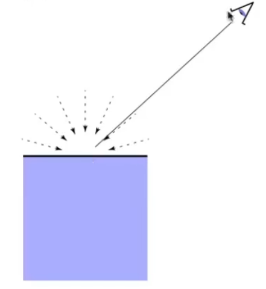

从图中可以发现，环境光与光照角度无光，与观察角度无关(每个角度观察都一样)，因此环境光是一个**常数**，即是某一种颜色(比如说一个物体，在任何地方都有一个固定的颜色)

环境光保证一个物体不是全是黑色的，在高光、漫反射计算完之后叠加环境光，提升一个亮度

$$
L_a = k_aI_a
$$

- 环境光 $L_a$
  - $K_a$ 环境光照系数

#### 累加

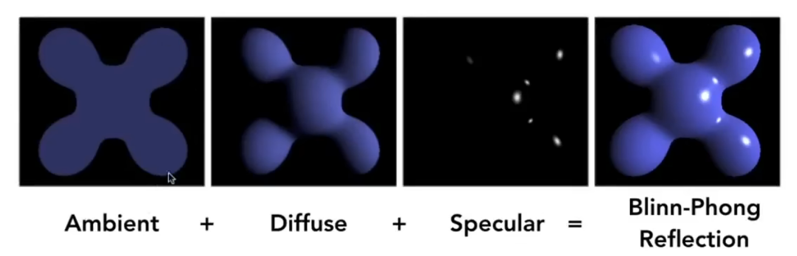

> Ambient 环境光、Diffuse 漫反射、Specular 高光

$$
L = L_a + L_d + L_s= 
k_aI_a + k_d(I / r^2)max(0, \vec{n} \cdot \vec{l}) + k_s(I/r^2)max(0, \vec{n} \cdot \vec{h})^p
$$

### 着色频率

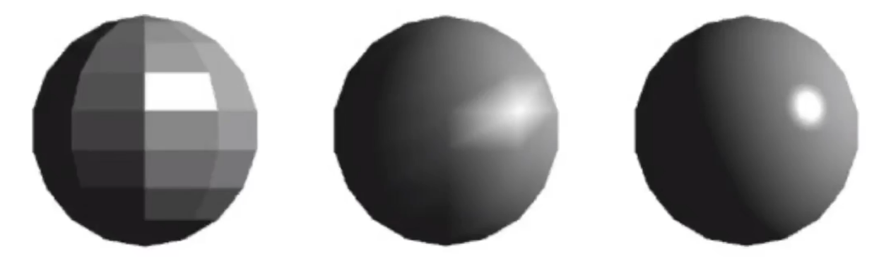

三个球的几何表示在空间中是一样的，但是表现出来的结果却不相同 

着色频率：要把着色应用在哪些点上 

比如图中最左边的球，就是把着色应用在一个**面**上，即一个平面有一个固定发现，求出的结果被应用在整个面上(**Flat Shading**)

比如图中中间的球，一个平面有四个**顶点**，算出每个顶点对应的法线，那么每个顶点都有自己的着色效果，通过差值插值运算，让平面中有较为平滑的过度(**Gouraud Shading**)

比如图中最右边的球，就是把着色应用在每一个**像素上**(**Phong Shading**)

> **Phong Shading**并不是**Blinn-Phong**，前者是着色频率，后者是着色模型

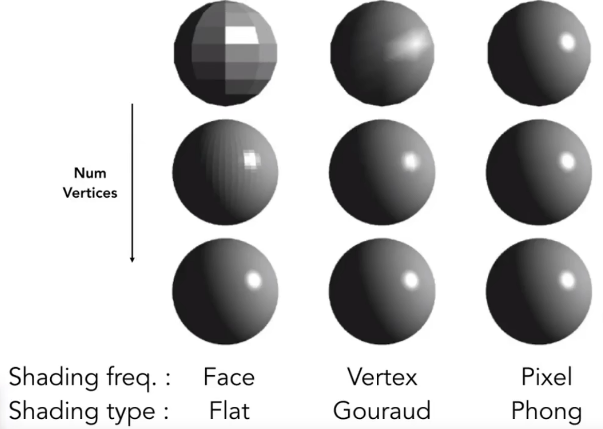

图中每一行的模型相同，从上网下模型精细度增加

从图中可以观察到，当几何体足够精细的情况下，就可以使用相对简单的**Flat Shading**着色频率，得到的结果其实也不差

> 当面足够精细的时候，就不一定要使用**Gouraud Shading** 或者 **Phong Shading**

所以运用何种着色频率，需要根据具体几何体的情况而定，而不是一味的选择像素频率**Phong Shading**

### 计算法线

法线：垂直于平面的向量

**顶点的法线**：顶点相邻面的法线的平均值

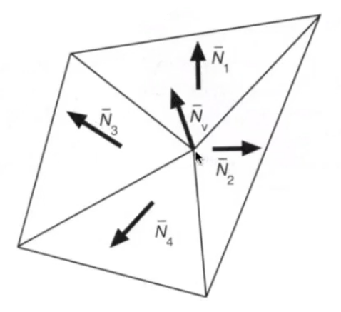

$$
N_v = \frac{\sum _iN_i}{\lVert \sum _iN_i \rVert}
$$

**逐像素法线**：通过重心坐标

### 图形管线、实时渲染管线

如何从场景到一张图？

管线其实就是表示一系列不同的操作

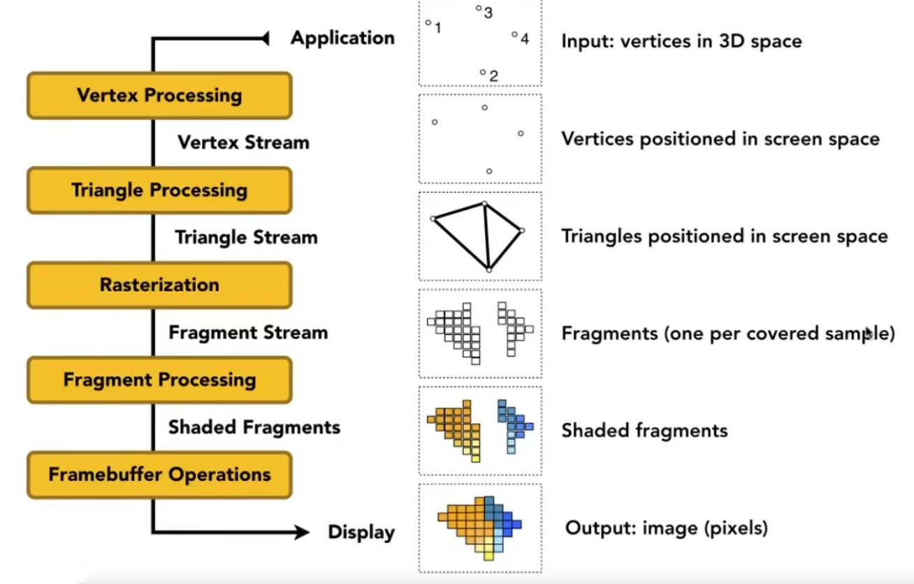

1. 三维空间的点投影到平面上
2. 模型的点形成三角形
3. 光栅化，进行离散操作
4. 着色
5. 渲染到屏幕

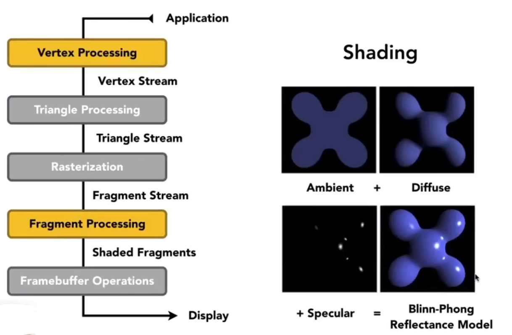

这里**shading**既有可能发生在**Vertex Processing**也有可能发生**Fragment Processing**，因为渲染频率的问题，因为渲染频率既可能是顶点频率，也可能是像素频率，而这就影响了渲染管线的处理顺序

Shader控制顶点管线(**Vertex Processing**)和着色管线如何运作(**Fragment Processing**)

现在GPU允许通过编程的方式，处理顶点、像素的着色操作，通过shader的方式

- OpenGL: GLSL语言
- DirectX: HLSL语言

### 纹理映射(Texture Mapping)

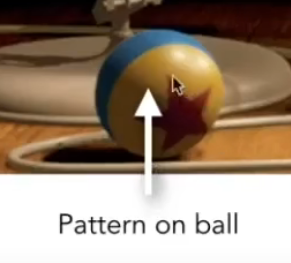

对于漫反射的计算来说 $L_d = k_d (I / r^2) (\vec{n} \cdot \vec{l})$，上述图片就是球的每个点的 $k_d$ 是不同的

那么纹理映射就是定义任何一个点的不同属性

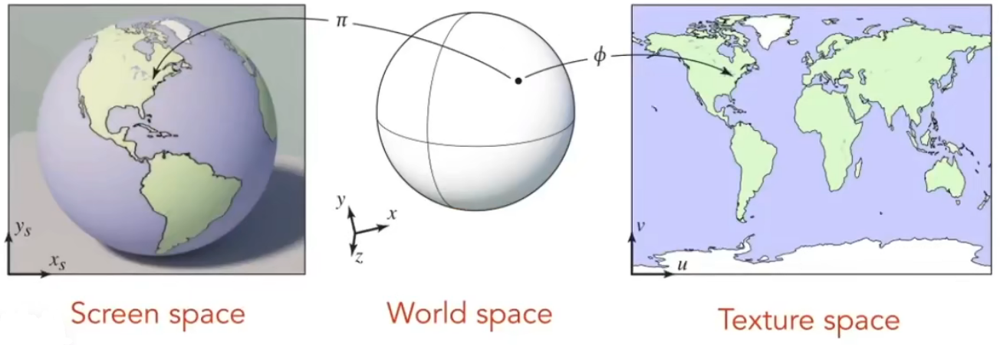

通过上图，可以不加证明给出结论，任何物体的表面都是二维的，那么物体的表面就可以和一张图产生一一对应映射关系，从而引出**纹理**

将一张图通过拉伸、压缩等操作，将其蒙在物体上，那么这个蒙住的过程就是**纹理映射**

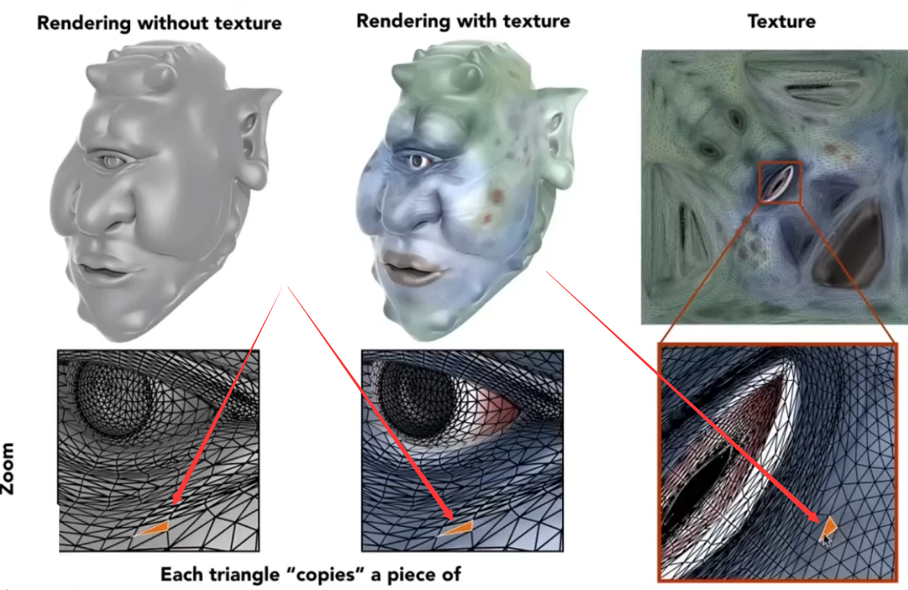

注意图中箭头所指的三个三角形面片，左边两个面片是模型中的面片，右边面片是映射图片与模型三角形面片对应的三角形面片


上图中右边的UV是纹理贴图的坐标系

通常认为，对于纹理来说，UV的范围都是0~1之内

通过UV坐标系和模型的映射，可以知道模型中三角形的每一个顶点都对应UV坐标系中的某一个点

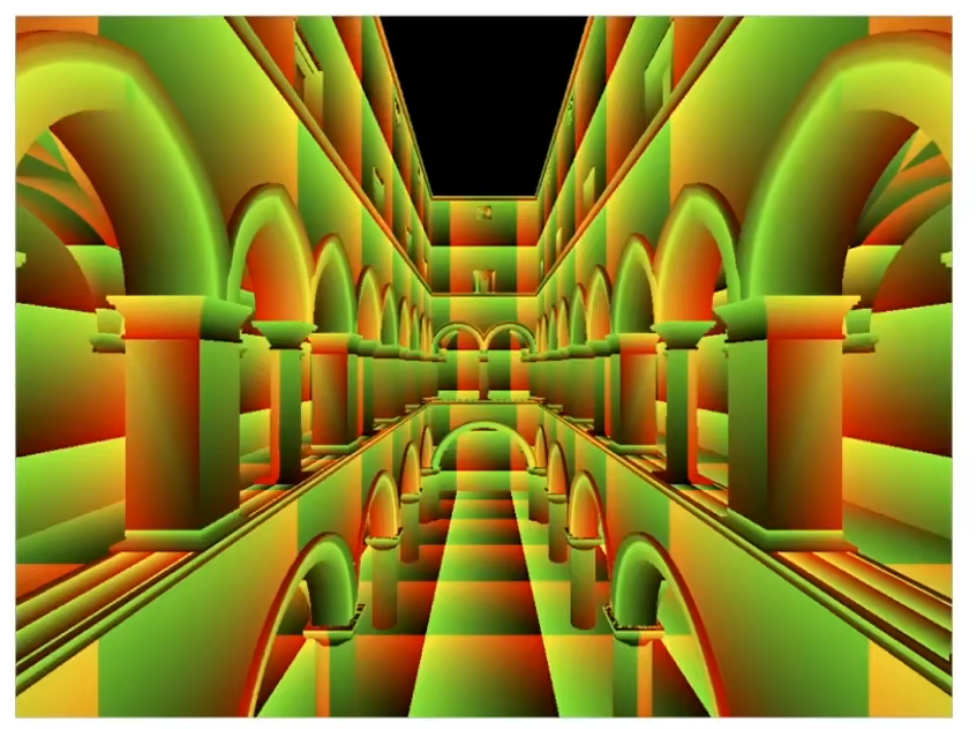

一个模型中的纹理可以是重复的

# 几何

如何表示光滑的曲线、曲面、将简单曲面通过细分的方法得到复杂曲面、形状发生变化时面如何变化、如何保持物体的拓扑结构…

# 光线追踪（Ray Tracing）

# 动画模拟、仿真

