<!--
 * @Author: your name
 * @Date: 2021-10-01 11:33:27
 * @LastEditTime: 2022-03-07 01:00:46
 * @LastEditors: Please set LastEditors
 * @Description: In User Settings Edit
 * @FilePath: D:\MarkdownLog\图形学.md

https://latex.codecogs.com/svg.latex?\vec{A}=(^{x}_{y})\\\vec{A}^T=(x,y)\\\lVert\vec{A}=\sqrt{x^2+y^2}\rVert\

-->

为什么要学习计算机图形学？——计算机图形学就是厉害

> 图形学是非常广阔的世界

# 前提知识

- 基础数学
- 基础物理
- 信号处理
- 数值分析
- 美学
- ……

## 线性代数

向量、矩阵的操作，点乘、叉乘、矩阵乘法等  

### 点乘

$$
\vec{A} = (^{x} _{y}) \\
\vec{A}^T = (x, y) \\
\lVert \vec{A} = \sqrt{x ^2 + y^2} \rVert \\
$$

向量之间的点乘 

$$
\vec{A} \cdot \vec{B} = \lVert \vec{A} \rVert * \lVert \vec{B} \rVert * \cos \theta \\
\cos \Theta = \frac{\vec{A} \cdot \vec{B}}{\lVert \vec{A} \rVert * \lVert \vec{B} \rVert}
$$

向量点乘的数学运算规则

1. 交换律： $\vec{a} \cdot \vec{b} = \vec{b} \cdot \vec{a}$
2. 分配律： $\vec{a} \cdot (\vec{b} + \vec{c}) = \vec{a} \cdot \vec{b} + \vec{a} \cdot \vec{c}$
3. 结合律： $(k*\vec{a}) \cdot \vec{b} = \vec{a} \cdot (\vec{b} * k) = k * (\vec{a} \cdot \vec{b})$

点乘的运算

- 2D： $\vec{a} \cdot \vec{b} = (^{x_a} _{y_a}) \cdot (^{x_b} _{y_b}) = x_a*x_b + y_a*y_b$ 
- 3D： $\vec{a} \cdot \vec{b} = \begin{pmatrix}x_a \\ y_a \\ z_a\end{pmatrix} \cdot \begin{pmatrix} x_b \\ y_b \\ y_c \end{pmatrix} = x_a * x_b + y_a * y_b + z_a * z_b$ 


$$
\vec{b_{\bot}} = \lVert \vec{b_\bot} \rVert = \lVert \vec{b} \rVert * \cos \Theta
$$

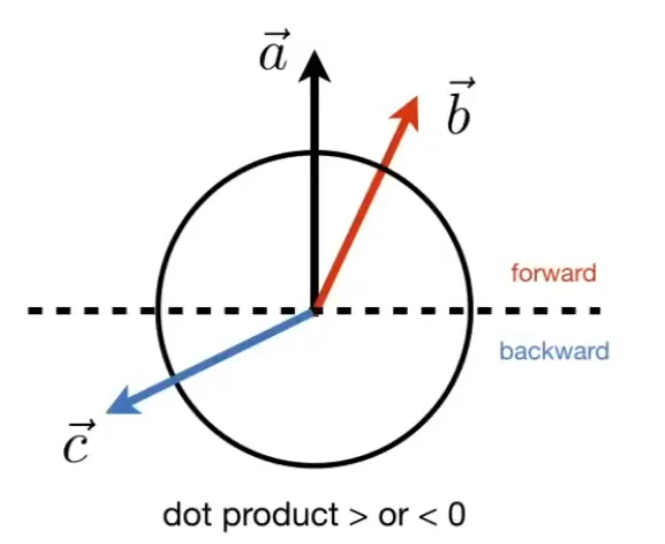

> 方向大致相同： $\cos{(\vec{a} \backsim \vec{b})} < 0$  
> 方向不同： $\cos{(\vec{a} \backsim \vec{c})} > 0$  

- 向量点乘的作用(单位向量)
  - 通过点乘的运算，可以找到两个方向之间的余弦夹角  
  - 找到一个向量投影到另一个向量中，也会用到点乘运算  
  - 判断两个向量是否接近，通过值的大小比较即可（cos在0~$\pi$单调递减）
  - 关于是否同方向的信息（$\cos \theta$小于$90°$大于0，否则小于0）

### 叉乘

两个向量叉乘的结果是垂直于当前两个向量所在平面的新的向量  

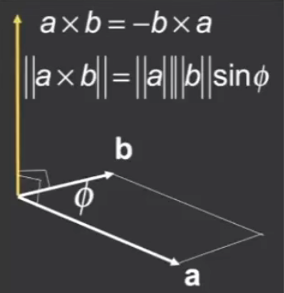

$$
\vec{a} \times \vec{b} = -\vec{b} \times \vec{a}\\
\lVert \vec{a} \times \vec{b} \rVert = \lVert \vec{a} \rVert * \lVert \vec{b} \rVert * \sin{\Theta}
$$

叉乘的运算需要用到右手螺旋法则， $\vec{a} \times \vec{b}$ 就是四指从 $\vec{a}$到$\vec{b}$ ，那么大拇指的指向就是 $\vec{c}$ 所在的方向

叉乘的一些数学运算规律  

- 叉乘没有交换律
- 叉乘有分配律
- 叉乘有结合律

$$
\vec{x} \times \vec{y} = + \vec{z}
$$

$$
\vec{y} \times \vec{x} = - \vec{z}
$$

$$
\vec{y} \times \vec{z} = + \vec{x}
$$

$$
\vec{z} \times \vec{y} = - \vec{x}
$$

$$
\vec{z} \times \vec{x} = + \vec{y}
$$

$$
\vec{z} \times \vec{x} = - \vec{y}
$$

$$
\vec{a} \times \vec{b} = -\vec{b} \times \vec{a}
$$

$$
\vec{a} \times \vec{a} = \vec{0}
$$

$$
\vec{a} \times (\vec{b} + \vec{c}) = \vec{a} \times \vec{b} + \vec{a} \times \vec{c}
$$

$$
\vec{a} \times (k * \vec{b}) = k * (\vec{a} \times \vec{b})\\
$$

> 上述所有都基于右手坐标系  
> 叉乘没有交换律  

叉乘的数学计算方式

$$
\vec{a} \times \vec{b} = 
\begin{pmatrix}
    y_a * z_b - y_b * z_a \\
    z_a * x_b - x_a * z_b \\
    x_a * y_b - y_a * x_b \\
\end{pmatrix}
$$

- 叉乘的作用
  - 判断左右(根据右手螺旋法则)
  - 判断内外(点是否在三角形内的叉乘解法)

## 矩阵

矩阵和一个数相乘

$$
k * 
\begin{pmatrix}
    x & a \\ 
    y & b \\
    z & c \\
\end{pmatrix} = 
\begin{pmatrix}
    k*x & k*a \\ 
    k*y & k*b \\
    k*z & k*c \\
\end{pmatrix}
$$

矩阵和一个矩阵相乘  

**A矩阵的列数必须等于B矩阵的行数**

$\left( M \times N \right) * \left( N \times P \right) = \left( M \times N \right)$ 公式中 $\left( M \times N \right)$ 表示M行、N列的矩阵

$$
\begin{pmatrix}
    x_1 & a_1 \\ 
    y_1 & b_1 \\
    z_1 & c_1 \\
\end{pmatrix}*
\begin{pmatrix}
    x_2 & a_2 & q_2 & e_2 \\ 
    y_2 & b_2 & w_2 & r_2 \\
\end{pmatrix}=
\begin{pmatrix}
    x_1 * x_2 + a_1 * y_2 & x_1 * a_2 + a_1 * b_2 & x_1 * q_2 + a_1 * w_2 & x_1 * e_2 + a_1 * r_2 \\ 
    y_1 * x_2 + b_1 * y_2 & y_1 * a_2 + b_1 * b_2 & y_1 * q_2 + b_1 * w_2 & y_1 * e_2 + b_1 * r_2 +\\
    z_1 * x_2 + c_1 * y_2 & z_1 * a_2 + c_1 * b_2 & z_1 * q_2 + c_1 * w_2 & z_1 * e_2 + c_1 * r_2 \\
\end{pmatrix}
$$

- 矩阵的数学规律
  - 矩阵**没有交换律**
  - 矩阵有结合律 $(AB)C = A(BC)$ 
  - 矩阵具有分配律 $A(B+C) = AB + AC$ 

当矩阵与向量相乘时，一般将矩阵放在左边，向量放在右边，向量可以看作是(M, 1)的矩阵，那么左边的矩阵只要是M列就行  

将单位向量按y轴对称的操作：

$$
\begin{bmatrix}
    -1 & 0 \\
    0 & 1
\end{bmatrix} *
\begin{bmatrix}
    x\\
    y
\end{bmatrix}=
\begin{bmatrix}
    -x \\
    y
\end{bmatrix}
$$

矩阵的转置:行和列互换

$$
\begin{bmatrix}
    1 & 2 \\
    3 & 4 \\
    5 & 6 
\end{bmatrix} ^T = 
\begin{bmatrix}
    1 & 3 & 5 \\
    2 & 4 & 6 
\end{bmatrix}
\\
(AB)^T = B^T * A^T
$$

单位矩阵:主对角线上是1，其他地方都是0

$$
I_{3\times3} = 
\begin{bmatrix}
    1 & 0 & 0 \\
    0 & 1 & 0 \\
    0 & 0 & 1
\end{bmatrix}
$$

矩阵的逆：矩阵A乘矩阵B得到单位矩阵，则成B是A的逆，写作 $A^{-1}$ 

$AA^{-1} = I$、$(AB)^{-1} = B^{-1} * A^{-1}$

向量的点乘转成矩阵运算

$$
\vec{a} \cdot \vec{b} = \vec{a}^T\vec{b}=
\begin{bmatrix}
    x_a & y_a & z_a
\end{bmatrix} 
\begin{bmatrix}
    x_b \\ y_b \\ z_b
\end{bmatrix}= \left( x_a*x_b + y_a*y_b + z_a*z_b \right)
$$

向量的叉乘转成矩阵运算

$$
\vec{a} \times \vec{b} = A^*\vec{b} = 
\begin{bmatrix}
    0 & -z_a & y_a \\
    z_a & 0 & -x_a \\
    -y_a & x_a & 0
\end{bmatrix}
\begin{bmatrix}
    x_b \\ y_b \\ z_b
\end{bmatrix}
$$

> $A^*$ 是 $\vec{a}$ 的dual matrix

## 变换

### 仿射变换

#### 伸缩变换(Scale)

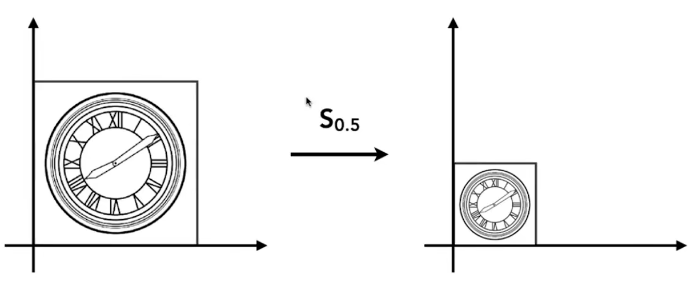

$$
x' = sx\\
y' = sy\\
\Rightarrow \\
\begin{bmatrix}
    x' \\ y'
\end{bmatrix}= 
\begin{bmatrix}
    s & 0 \\
    0 & s 
\end{bmatrix}
\begin{bmatrix}
    x \\ y
\end{bmatrix}
$$

### 镜像

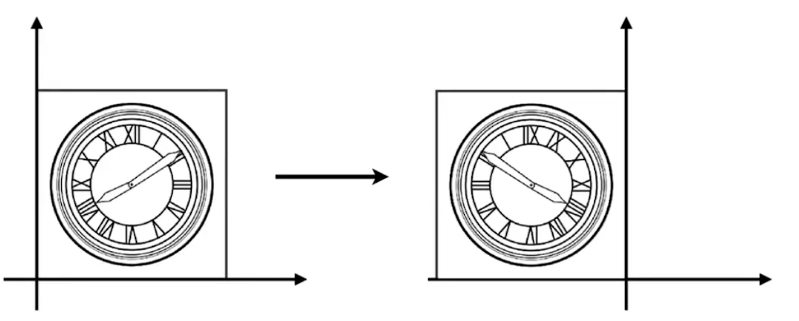

$$
x' = -x\\
y' = y\\
\Rightarrow \\
\begin{bmatrix}
    x' \\ y'
\end{bmatrix}= 
\begin{bmatrix}
    -1 & 0 \\
    0 & 1 
\end{bmatrix}
\begin{bmatrix}
    x \\ y
\end{bmatrix}
$$

#### 切变

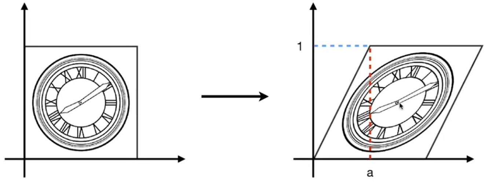

$$
x' = x + a*y\\
y' = y\\
\Rightarrow \\
\begin{bmatrix}
    x' \\ y'
\end{bmatrix}= 
\begin{bmatrix}
    1 & a \\
    0 & 1 
\end{bmatrix}
\begin{bmatrix}
    x \\ y 
\end{bmatrix}
$$

#### 旋转(Rotate)

**默认绕原点逆时针旋转**

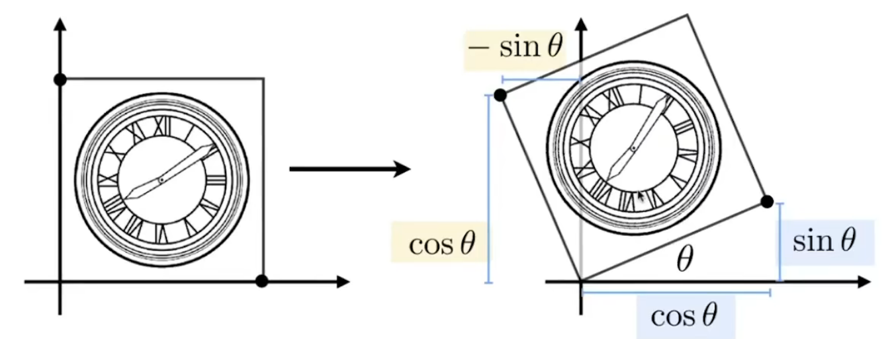

公式推导  
- 右下角点坐标(1, 0)=>( $\cos\Theta, \sin\Theta$ )
- 左上角点坐标(0, 1)=>( $-\sin\Theta, \cos\Theta$ )

$$
\left(x', y'\right)
\Longrightarrow
\begin{bmatrix}
    A & B \\
    C & D 
\end{bmatrix}
\begin{bmatrix}
    x \\ y
\end{bmatrix}\\
带入x=1, y=0, x'=\cos\Theta, y'=\sin\Theta\\
得: A = \cos\Theta , C = \sin\Theta\\
带入x=0, y=1, x'=-\sin\Theta, y'=\cos\Theta\\
得: B = -\sin\Theta, D = \cos\Theta
$$

#### 平移(Transiation)

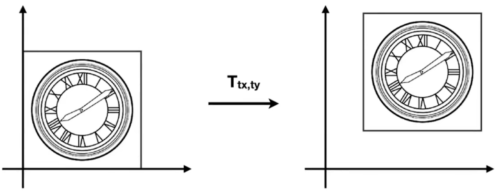

- $x' = x + t_x$
- $y' = y + t_y$

$$
\begin{bmatrix}
    x' \\ y ^ `
\end{bmatrix}=
\begin{bmatrix}
    1 & 0 \\
    0 & 1 
\end{bmatrix}
\begin{bmatrix}
    x \\ y
\end{bmatrix}+
\begin{bmatrix}
    t_x \\ t_y
\end{bmatrix}
$$

很明显，这个**平移**的坐标无法通过一个矩阵就表示出来，这个时候就需要引入**齐次矩阵**

> **齐次矩阵**就是将一个原本是n维的向量用一个n+1维向量来表示

$$
\begin{bmatrix}
    x' \\ y ^ ` \\ 1
\end{bmatrix}=
\begin{bmatrix}
    1 & 0 & t_x \\
    0 & 1 & t_y \\
    0 & 0 & 1
\end{bmatrix}
\begin{bmatrix}
    x \\ y \\ 1
\end{bmatrix}=
\begin{bmatrix}
    x + t_x \\ y + t_y \\ 1
\end{bmatrix}
$$

通过齐次坐标矩阵就可以使用一个矩阵来表示线性变换，**为了保证变换矩阵的一致性**，所以上面讲的**所有矩阵都需要转换成齐次矩阵**

在其次坐标中，点使用 $\begin{pmatrix}
    x \\ y \\ 1
\end{pmatrix}$
来表示，向量使用 $\begin{pmatrix}
    x \\ y \\ 0
\end{pmatrix}$
来表示

- 向量 + 向量 = 向量  
- point - point = 向量
- point + vector = point
- point + point = 两点的中点

为什么point + point的结果是两个点的中点

$$
A = \begin{pmatrix}
    x \\ y \\ w
\end{pmatrix}=
\begin{pmatrix}
    x / w \\ y / w \\ 1
\end{pmatrix}
\\
B = \begin{pmatrix}
    a \\ b \\ c
\end{pmatrix}=
\begin{pmatrix}
    a / c \\ b / c \\ 1
\end{pmatrix}
\\
A + B = 
\begin{pmatrix}
    x/w + a/c \\ y/w + b/c \\ 2
\end{pmatrix}=
\begin{pmatrix}
    \frac{x}{2w} + \frac{a}{2c} \\
    \frac{y}{2w} + \frac{b}{2c} \\
    1
\end{pmatrix}
$$

#### 总和

$$
Scale \Longrightarrow
S(s_x, s_y) = 
\begin{pmatrix}
    s_x & 0 & 0 \\
    0 & s_y & 0 \\
    0 & 0 & 1
\end{pmatrix}
\\
Rotation \Longrightarrow
R(\Theta) = 
\begin{pmatrix}
    \cos\Theta & -\sin\Theta & 0 \\
    \sin\Theta & \cos\Theta & 0 \\
    0 & 0 & 1
\end{pmatrix}
\\
Translation \Longrightarrow
T(t_x, t_y) = 
\begin{pmatrix}
    1 & 0 & t_x \\
    0 & 1 & t_y \\
    0 & 0 & 1
\end{pmatrix}
$$

### 逆变换

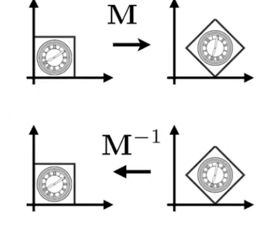

逆变换就是把之前的操作反向来一次，对应的就是矩阵中的逆矩阵 


### 组合变换

- 图1
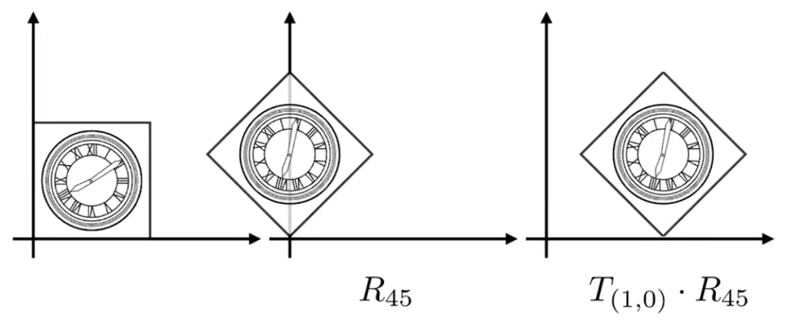

- 图2
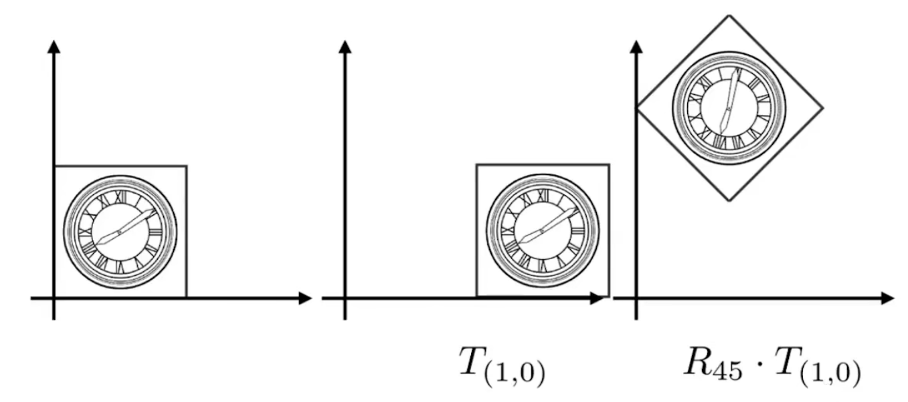

> 旋转默认绕原点，逆时针旋转  

比较上述两张图片，可以发现先旋转再平移 与 先平移再旋转 得到的结果是不同的，对应的理解就是**矩阵的乘法**，矩阵乘法不满足交换律

为了得到图1的效果，我们需要先旋转45°，再向X轴正方向平移1一个单位

$$
T_{(1， 0)} \cdot R_{45} \cdot \begin{bmatrix}
    x \\ y \\ 1
\end{bmatrix}= 
\begin{bmatrix}
    1 & 0 & 1 \\
    0 & 1 & 0 \\
    0 & 0 & 1 
\end{bmatrix}
\begin{bmatrix}
    \cos45° & -\sin45° & 0 \\
    \sin45° & \cos45° & 0 \\
    0 & 0 & 1 
\end{bmatrix}
\begin{bmatrix}
    x \\ y \\ 1
\end{bmatrix}
$$

前面提过向量一般放在矩阵乘法的最右边，并且根据矩阵具有结合律，上述式子可以理解为先计算 $R_{45}$ 与 $\begin{bmatrix}x\\y\\1\end{bmatrix}$ ，再计算与 $T_{(1, 0)}$ 的乘法

但是，根据矩阵的结合律，我们可以先把前面的矩阵的计算结果得出最终变换矩阵，最后与向量相乘

$$
A_n(...A_2(A_1(X)) = 
\underbrace{A_n...A_2 \cdot A_1}_{先计算} \cdot \begin{pmatrix}
    x \\ y \\ 1
\end{pmatrix}
$$

### 变换的分解

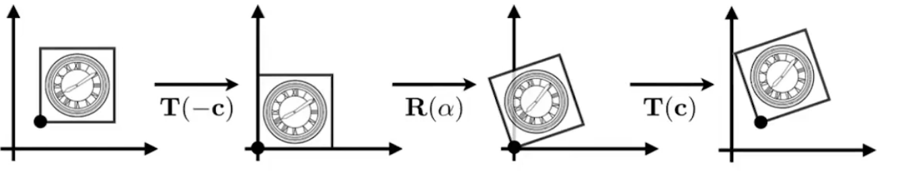

如果想让图片围绕左下角旋转，而不是原点选择，可以采用的解法是 

左下角移动到原点 => 绕原点旋转 => 左下角移动到起始位置  

### 三位空间的变换

三维与二维无非就是多了一个维度，其他的变换相似，原理相同

point: 
$\begin{pmatrix}
    x & y & z & 1
\end{pmatrix}^T$  

vector: 
$\begin{pmatrix}
    x & y & z & 0
\end{pmatrix}^T$ 

$$
\begin{pmatrix}
    x' \\ y^1 \\ z' \\ 1
\end{pmatrix}=
\begin{pmatrix}
    a & b & c & t_x \\
    d & e & f & t_y \\
    g & h & i & t_z \\
    0 & 0 & 0 & 1
\end{pmatrix}
\begin{pmatrix}
    x \\ y \\ z \\ 1
\end{pmatrix}
$$

$$
Scale \Longrightarrow
S(s_x, s_y, s_z) =
\begin{pmatrix}
    s_x & 0 & 0 & 0 \\
    0 & s_y & 0 & 0 \\
    0 & 0 & s_z & 0 \\
    0 & 0 & 0 & 1
\end{pmatrix}
$$

$$
Translation \Longrightarrow
T(t_x, t_y, t_z) =
\begin{pmatrix}
    1 & 0 & 0 & t_x \\
    0 & 1 & 0 & t_y \\
    0 & 0 & 1 & t_z \\
    0 & 0 & 0 & 1
\end{pmatrix}
$$

$$
R_x(\Theta)=
\begin{pmatrix}
    1 & 0 & 0 & 0 \\
    0 & \cos\Theta & -\sin\Theta & 0 \\
    0 & \sin\Theta & \cos\Theta & 0 \\
    0 & 0 & 0 & 1
\end{pmatrix}绕X轴旋转
$$

$$
R_y(\Theta) =
\begin{pmatrix}
    \cos\Theta & 0 & \sin\Theta & 0 \\
    0 & 1 & 0 & 0 \\
    -\sin\Theta & 0 & \cos\Theta & 0 \\
    0 & 0 & 0 & 1
\end{pmatrix}绕Y轴旋转
$$

$$
R_z(\Theta) = 
\begin{pmatrix}
    \cos\Theta & -\sin\Theta & 0 & 0 \\
    \sin\Theta & \cos\Theta & 0 & 0 \\
    0 & 0 & 1 & 0 \\
    0 & 0 & 0 & 1
\end{pmatrix}绕Z轴旋转
$$

$$
R_{xyz}(\alpha, \beta, \sigma) = R_x(\alpha)R_y(\beta)R_z(\sigma)
$$

> 旋转时，绕哪个轴旋转，那个轴对应的坐标不变，所以x轴旋转的第一行第一列、y轴旋转的第二行第二列、z轴旋转的第三行第三列

如何证明 $R_{xyz}(\alpha, \beta, \sigma) = R_x(\alpha)R_y(\beta)R_z(\sigma)$ 成立，这个时候需要引入**罗德里格斯公式**


### 视图变换 Camera/View

视图就类似使用设计相机拍照，视图就是镜头中的世界  

- 拍一张好照片需要
  - 好的地方（Module），搭建场景
  - 好的角度（view），视图变换
  - 投影（三维空间投影到二维照片）

综上，就是图形学渲染出效果的模型(Model)、视图(View)、投影(Projection)变换，简称MVP变换

- 定义相机
  - 坐标
  - 向上的向量(一个向量就可以确定相机的Roll)
  - 朝向


**约定：相机永远在原点，永远不动，永远以y轴向上，永远看向-Z轴**
其他物体也跟着相机移动

- 针对坐标为(x, y, z)，角度为(a, b, c)的相机，需要做哪些变换
  1. 相机移动到原点坐标
  2. 相机的朝向旋转到-Z轴方向
  3. 相机的向上向量旋转到Y轴方向

设定相机的朝向向量为g，相机向上的向量为t，可推得相机另一个轴的向量为 $g \times t$

$$
T_{view} =
\begin{bmatrix}
    1 & 0 & 0 & -x_e \\
    0 & 1 & 0 & -y_e \\
    0 & 0 & 0 & -z_e
\end{bmatrix} 坐标变换矩阵
$$

$$
R^{-1}_{view} =
\begin{bmatrix}
    x_{g \times t} & x_t & x_{-g} & 0 \\
    y_{g \times t} & y_t & y_{-g} & 0 \\
    z_{g \times t} & z_t & z_{-g} & 0 \\
    0 & 0 & 0 & 1
\end{bmatrix} 不加证明给出矩阵R_{view}^{-1}
$$

$$
R_{view}^{-1} * 
\begin{bmatrix}
    1 \\ 0 \\ 0
\end{bmatrix} = 
\begin{bmatrix}
    x_{g \times t} \\
    y_{g \times t} \\
    z_{g \times t} \\
\end{bmatrix} 可见R_{view}^{-1}乘以X轴、Y轴、Z轴都等于相机对应的向量坐标
$$

$$
R^{-1}_{view} * 标准矩阵 = 相机矩阵 \Longrightarrow 相机矩阵 * R_{view} = 标准矩阵
$$

$$
R_{view}^{-1}是R_{view}的逆矩阵
$$

$$
R_{view} =
\begin{bmatrix}
    x_{g \times t} & y_{g \times t} &z_{g \times t} & 0 \\
    x_t & y_t & z_t & 0 \\
    x_{-g} & y_{-g} & z_{-g} & 0 \\
    0 & 0 & 0 & 1
\end{bmatrix} 不加证明给出矩阵R_{view}
$$

$$
M_{view} = R_{view} T_{view} 组合后得出视图变换矩阵(从右往左的理解顺序，先平移、再旋转)
$$

相机和所有的物体都根据该模型移动到特定位置，此时相机肯定是在原点的、看向-Z轴，向上坐标为Y轴的，各个物体的相对位置不变  

模型(单独对模型的操作)-视图(对相机的操作并同步到模型上)变换

### 投影变换

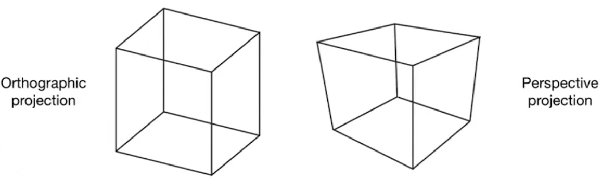

> 图中左边为正交投影，右边是透视投影

- 正交投影不会带来近大远小的世界效果，一般用于工程制图  
- 透视投影会有近大远小

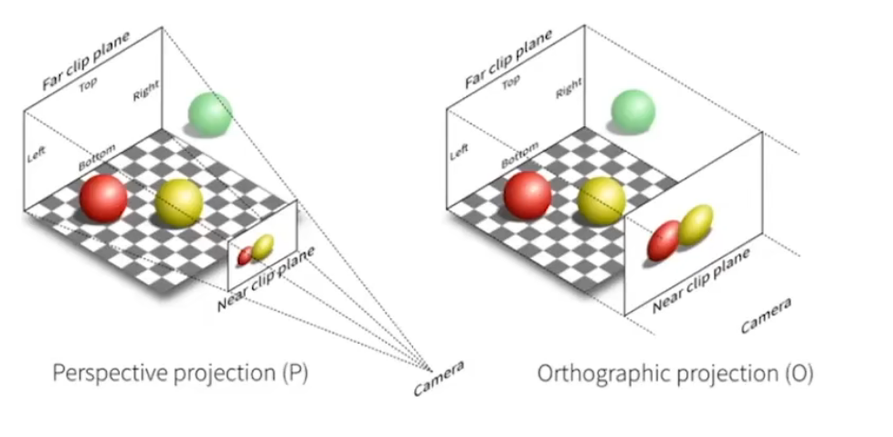

> 图中左边为透视投影，右边为正交投影

对于正交投影出来的图片结果，可以理解为相机在一个无限远的地方拍照，这样物体之间的距离差距就可以忽略不计了(走路月亮跟着你走的也是这个原因)

#### 正交投影 Orthographic

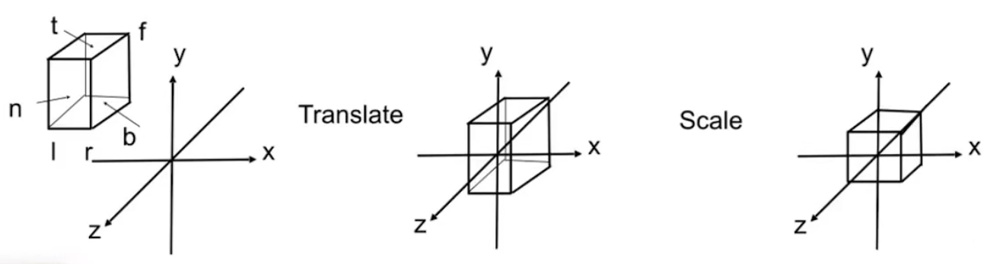

- 在正交投影中定义一个矩阵，需要定义
  - l(left)、r(right)，左平面距离矩形中心的距离和右平面距离矩形中心的距离
  - t(top)、b(bottom)，上平面距离矩形中心的距离和下平面距离矩形中心的距离
  - f(far)、r(near)，远平面距离矩形中心的距离和近平面距离矩形中心的距离

> 因为相机朝向是-Z轴，所以f值一般小于r值

在定义完一个矩形之后，需要将其通过一系列变换转换成图片中最右边的标准立方体(canonical cub $[-1 ,1]^3$ )

- 一系列变换指的是
  - 矩形移动到原点
  - X、Y、Z轴拉伸成[-1, 1]

$$
M_{ortho} =
\begin{bmatrix}
    \frac{2}{r-l} & 0 & 0 & 0 \\
    0 & \frac{2}{t-b} & 0 & 0 \\
    0 & 0 & \frac{2}{n-f} & 0 \\
    0 & 0 & 0 & 1 
\end{bmatrix} 
\begin{bmatrix}
    1 & 0 & 0 & -\frac{r+l}{2} \\
    0 & 1 & 0 & -\frac{t+b}{2} \\
    0 & 0 & 1 & -\frac{n+f}{2} \\
    0 & 0 & 0 & 1
\end{bmatrix}
$$

> 左边缩放矩阵、右边平移矩阵（操作顺序从右往左理解）  
> 暂不考虑旋转

这里对物体做了拉伸，未来还会做一次**视口变换**，**视口变换**时会再做一次拉伸

#### 透视投影 Perspective

理论上两条平行的先看起来相交了


前置知识：点(x, y, z, 1)乘以k，得到(kx, ky, kz, k != 0)表示其实也是点(x, y, z, 1)，将k换成z，可以得到(xz, yz, $z^2$ ,z != 0)，也表示(x, y, z, 1)这个点  

> (1, 0, 0, 1)与(2, 0, 0, 2)表示同一个点

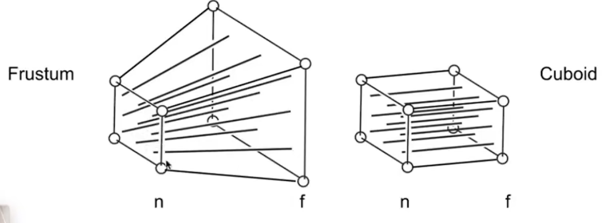

- 透视投影分两步 
    1. 将Frustum平截头体转换成Cuboid矩形
    2. 进行一次正交投影

- 将Frustum平截头体转换成Cuboid矩形
  - n(near)平面的四个点不会发生变换
  - f(far)平面的z值不会发生变换，只是在平面内进行收缩
  - n、f平面的中心点不会发生变化

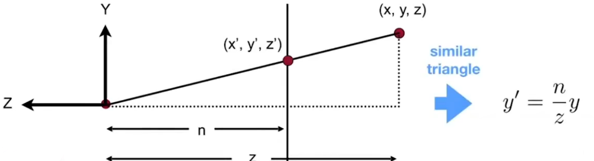

通过侧面观察，更容易得到结论  

最左边的红点就是摄像机的位置，中间的红点就是n(near)平面，最右边的红点就是f(far)平面  

目标就是将(x, y, z) => (x, y\', z)，通过相似三角形可以推出计算公式

设 $M_{persp}$ 为透视变换矩阵

设 $M^{(4\times4)}_{persp \rightarrow ortho}$ 为透视变换成正交的变换矩阵

得出 $M_{persp}=M_{ortho}M^{(4\times4)}_{persp \rightarrow ortho}$ ，即将模型先变换成正交可以用的矩形，再通过正交变换矩阵计算

$x=\frac{n}{z}x,y=\frac{n}{z}y$

$$
\begin{pmatrix}
    x \\ y \\ z \\ 1
\end{pmatrix}
\Rightarrow
\begin{pmatrix}
    nx/x \\ ny/z \\ unknow \\ 1
\end{pmatrix} ==
\begin{pmatrix}
    nx \\ ny \\ still unknow \\ z
\end{pmatrix}
$$

$$
M^{(4\times4)}_{persp \rightarrow ortho} 
\begin{pmatrix}
    x \\ y \\ z \\ 1
\end{pmatrix} = 
\begin{pmatrix}
    nx \\ ny \\ unknow \\ z
\end{pmatrix}
\Rightarrow
M^{(4\times4)}_{persp \rightarrow ortho} =
\begin{pmatrix}
    n & 0 & 0 & 0 \\
    0 & n & 0 & 0 \\
    ? & ? & ? & ? \\
    0 & 0 & 1 & 0
\end{pmatrix}
$$

> 透视变换矩阵最后一行完全可以是(0 0 0 z)，但是z是变量，到时候计算的时候还得实时带入z的真实值，对于计算机来说很麻烦，要开辟内存，还要传值，浪费资源

- 此时带入观察到的两个细节
  - 对近平面来说，(x, y, n, 1) (n表示近平面的z)与透视变换矩阵运算，其x、y、n值不变
  - 对远平面来说，(x, y, f, 1) (f表示远平名的z)与透视变换矩阵运算，其f值不变
  - 对远平面来说，(0, 0, f, 1) 与透视变换矩阵运算，其值不变，仍未(0, 0, f, 1)

$$
M^{(4\times4)}_{persp \rightarrow ortho} 
\begin{pmatrix}
    x \\ y \\ n \\ 1
\end{pmatrix} = 
\begin{pmatrix}
    x \\ y \\ n \\ 1 
\end{pmatrix} ==
\begin{pmatrix}
    nx \\ ny \\ n^2 \\ n 
\end{pmatrix}
$$

$$
设M^{(4\times4)}_{persp \rightarrow ortho}第三行为
\begin{pmatrix}
    A & B & C & D
\end{pmatrix}
带入上述式子的计算中得
\begin{pmatrix}
    A & B & C & D
\end{pmatrix}
\begin{pmatrix}
    x \\ y \\ n \\ 1
\end{pmatrix} = n^2
$$

$$
得到A=0, B=0, C*n + B = n^2
$$

$$
M^{(4\times4)}_{persp \rightarrow ortho} 
\begin{pmatrix}
    0 \\ 0 \\ f \\ 1
\end{pmatrix} = 
\begin{pmatrix}
    0 \\ 0 \\ f \\ 1 
\end{pmatrix} ==
\begin{pmatrix}
    0 \\ 0 \\ f^2 \\ f
\end{pmatrix}
$$

$$
带入前面推理(0, 0, C, D)式子中，得到 Cf + D = f^2
$$

$$
\begin{matrix}
    Cn + D = n^2 \\
    Cf + D = f^2
\end{matrix}
\Longrightarrow
\begin{matrix}
    C = n + f \\
    D = -nf
\end{matrix}
$$

$$
M^{(4\times4)}_{persp \rightarrow ortho} = 
\begin{pmatrix}
    n & 0 & 0 & 0 \\
    0 & n & 0 & 0 \\
    0 & 0 & n + f & -nf \\
    0 & 0 & 1 & 0
\end{pmatrix}
$$

将得到的矩阵与（x，y，z，1）相乘后z的值等于(-nf)*z^(-1)+(n+f),是个反比例函数，这个图像恒过（n，n）与（f，f），在n与f之间，z是下凹的，所以z变小了，即再f与n平面之间的点的z是会变小的

# 光栅化(Rasterization)

将三维空间的几何形体显示到屏幕上  
将投影的基本体分解为片段（像素）  

通过前面的视图变换、投影变换（正交、透视），我们得到了[-1, 1]^3的标准立方体

- 定义视锥需要的两个数据
  - 宽高比
  - 垂直的可视角度

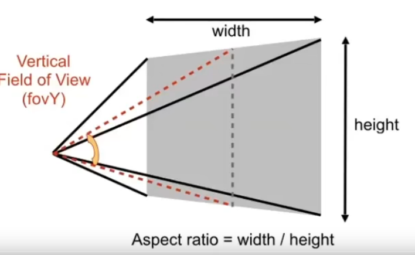

- **屏幕**：图形学中认为屏幕是一个数组，数组中每一个元素是一个像素
- **光栅**：Raster，就表示屏幕，光栅化(Rasterize)可以理解为把东西绘制在屏幕上
- **像素**：Pixel(Picture Element的缩写)
- **屏幕空间**：在屏幕上定义的坐标系，屏幕左下角为(0, 0)原点，向上为Y轴正方向，向右为X轴正方向
  - 坐标从0开始，而不是从1开始
  - 屏幕的所有的像素是从(0, 0)到(width - 1, height - 1)
  - (x, y)点像素的中心在(x + 0.5, y + 0.5)上
  - 屏幕表示的范围从(0, 0)到(width, height)

- 在不考虑Z轴的情况下，将[-1, 1]的矩阵的x、y坐标映射到屏幕中
  - 移动到屏幕中心
  - 缩放一下

$$
M_{viewport} =
\begin{pmatrix}
    \frac{width}{2} & 0 & 0 & \frac{width}{2} \\
    0 & \frac{height}{2} & 0 & \frac{height}{2} \\
    0 & 0 & 1 & 0 \\
    0 & 0 & 0 & 1
\end{pmatrix}
$$

- 图形学广泛使用三角形
  - 三角形是最基础的多边形
  - 任何多边形都可以被拆分成多个三角形
  - 三角形三个点肯定在同一个平面
  - 三角形内外定义清晰（多边形可能有洞 圆环，可能不是凸包）
  - 三角形三个点定义不同属性，三角形内部的各个点可以逐渐渐变

利用像素中心，对屏幕空间进行采样

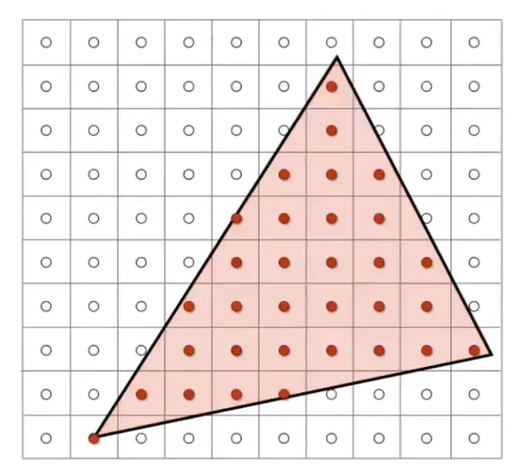

$$
inside(tri, x, y) =
\begin{cases}
    1, Point(x, y) 在 tri 这个形状中 \\
    0, Point(x, y) 不在 tri 形状中
\end{cases}
$$

```cpp
for(int x = 0; x < width; ++x){
    for(int y = 0; y < height; ++y){
        image[x][y] = inside(tri, x+0.5, y+0.5)
    }
}
```

> 通过上述代码就可以知道(x, y)像素是否在多边形中，因为像素中心坐标是(x+0.5, y+0.5)，所以传入的是像素中心坐标

那么如何判断像素点是否在三角形内呢？ 最开始将的**叉乘**就可以用到了  

判断像素是否在三角形中不用判断(0, 0)到(width, height)中所有的像素，只需要判断三角形三个点中最高、最低、最左、最右所围城的矩阵即可，这个矩阵被称为**包围盒**

## 走样与反走样

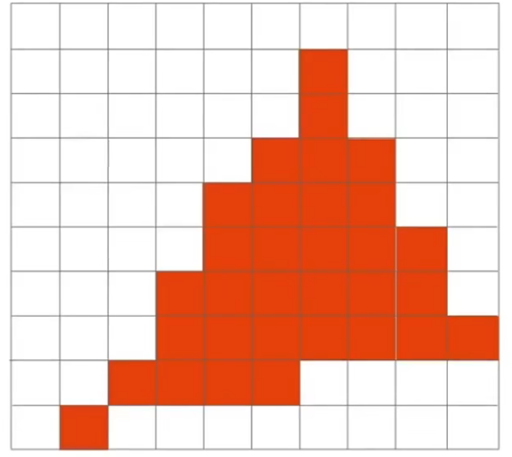

**锯齿**、**走样**、**Aliasing**

**Artifacts**表示一切在计算机图形学中的错误(Error)、瑕疵(Mistakes)

锯齿属于一种`Artifact`，**摩尔纹**也是一种`Artifact`，车轮效应也是`Artifact`

> 车轮效应就是车轮是顺时针旋转的，但是你看车轮确实逆时针旋转，就是人眼的采样跟不上车轮的旋转导致的

在采样之前做**模糊**、**滤波**处理


**傅里叶级数展开**：任何周期性函数都写成一系列正弦和余弦以及一个常数项的总和

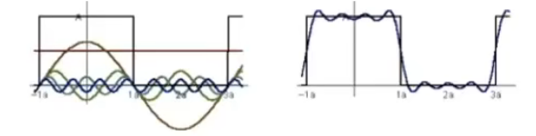

$$
f(x) = \frac{A}{2} + \frac{2A\cos(tw)}{\pi} - \frac{2A\cos(3tw)}{3\pi} + \frac{2A\cos(5tw)}{5\pi} - \frac{2A\cos(7tw)}{7\pi} + ...
$$

如上图所示，将很多个不同频率的正弦余弦叠加在一起，拼出一个与目标近似的周期函数，此时运用极限的思想，可以推理出无限个正弦余弦叠加就能拼出目标函数

**傅里叶变换**：给定任意函数可以通过一系列变换变成另一个函数，还可以把变换后的函数通过逆变换再变回去

- 傅里叶变换： $F(w) = \int_{-\infty}^{\infty}f(x)e^{-2\pi iwx}dx$
- 逆傅里叶变换： $f(x) = \int_{-\infty}^{\infty}F(w)e^{2\pi iwx}dw$

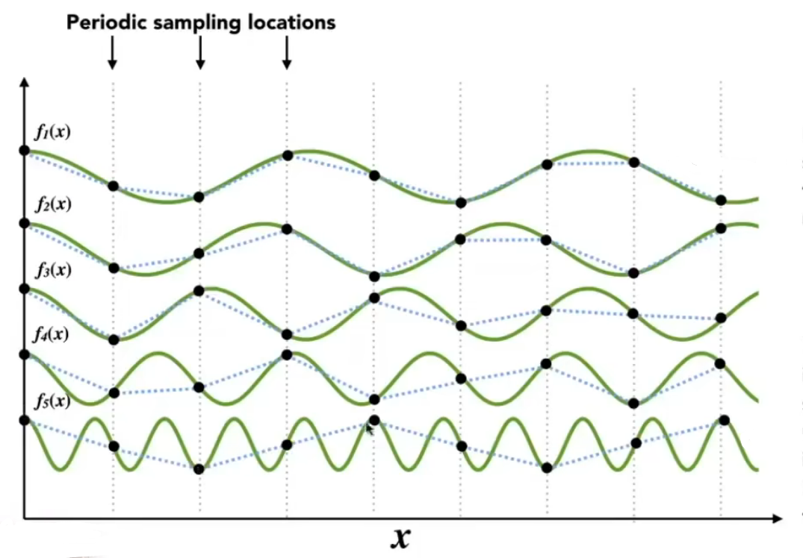

这里给出不同的五种函数从 $f_1(x) \Rightarrow f_5(x)$ ，从上到下频率逐渐增加，我们发现按照虚线对函数进行采样，采样得到的点(途中黑色的点)连起来逐渐不能恢复曲线原来的磨样(黑点之间的链接虚线与原曲线的差距越来越大)

通过上图我们可以发现，当采样的频率跟不上曲线变换的频率的时候，就无法还原出原始信号

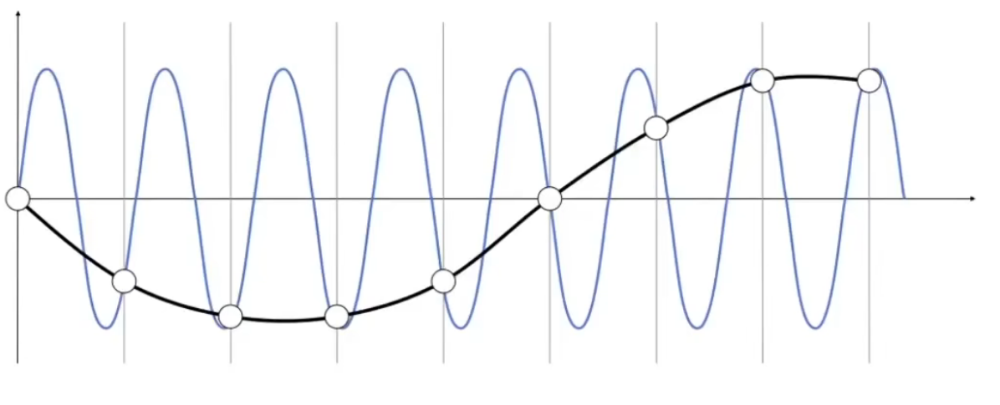

> 竖线为采样线，白点为采集到的点，蓝色和黑色线表示两种函数

同样的采样方法，采样两种不同的频率的函数，我们无法区分，我们称之为**走样**

**滤波**：删除某些特定频率。那么对应的信号应该如何变换

傅里叶变换可以把图片从时域信号变为频域信号


> 图左为时域信号，图右为频域信号

频域空间图：中心定义为最低频的区域，周围定义成高频区域，不同的频域的地方有多少信息通过亮度来表示

根据上述图片来理解就是：亮点主要集中在中心，说明原图片低频信息多，高频信息少(不是没有)


同一张图，如果将**频域空间**中间的低频信号删除(白色改成黑色)，再逆傅里叶变换回去，可以发现图像的边界特别明显

> 上述操作就是 **高通滤波**(把低频的删除，只留下高频)

边界，可以理解成上下或左右差距很大的地方。那么差距大就可以理解为变化频率高，即**高频信息**，那么通过**高频滤波**，自然而然就只剩下差距大的地方的了

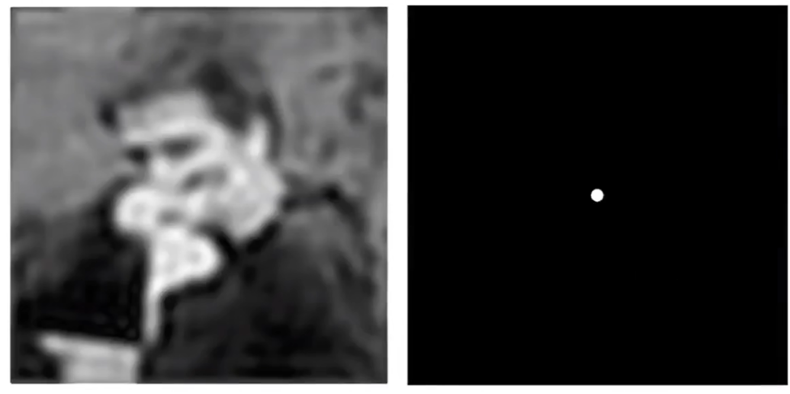

同一张图，如果将**频域空间**的所有高频信息都删除(除中心点附近特定半径内，都设为黑色)，再傅里叶变换回去，可以得到一张很模糊的图片

> 上述操作就是**低通滤波**(低频率通过 高频率去掉)

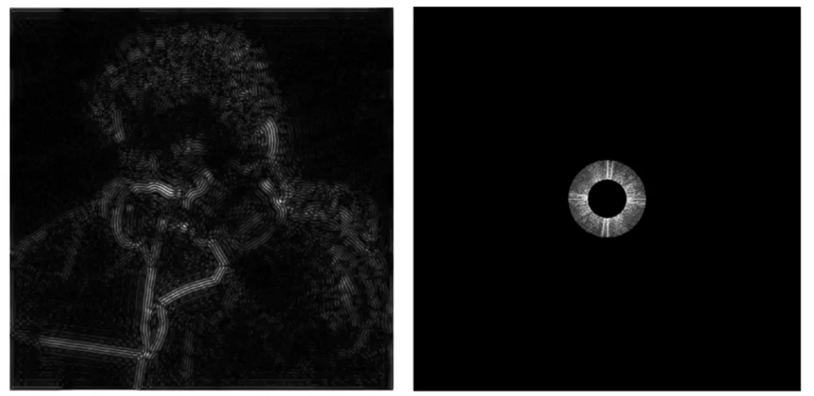

> 特定内容在，**数字图像**处理中学习

### 滤波

**滤波** = 去掉特定频率的信息 = **平均** = **卷积**

**Filtering** = **Convolution** = **Averaging**

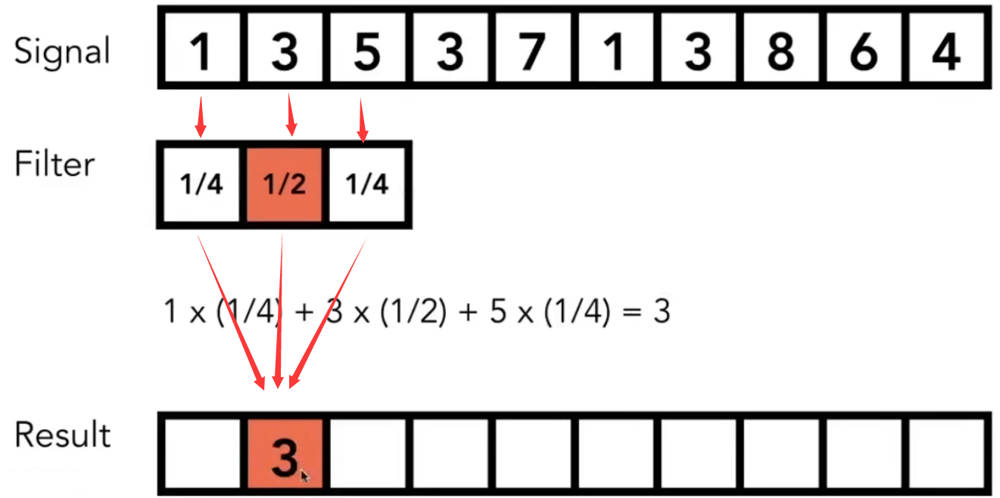

> 简单卷积的理解  
> Filter：滤波器、Siganl：信号

在移动Filter窗口的过程中，将Signal的三个数和Filter的三个数做一个点乘，再将计算结果写回窗口的中心值(说白了就是一种**加权平均**)

也就是说，**卷积**作用在一个信号上，用某种**滤波器**对**信号**进行**卷积**操作，并且得到一个结果

> 并**不是真实数学上的定义**，仅仅是图形学上的简化定义

- 卷积的定理
  - 时域上如果对两个信号进行卷积，对应两个信号各自的频域上，两个信号频域的乘积
  - 时域上如果是乘积，那么频域上就是卷积
  
> 可以拿到一个图，用某种滤波器去做卷积操作  
> 也可以得到图片的傅里叶变换的频域，再把卷积的滤波器变换到频域上，再把两者相乘，得到的频域的结果，最后将结果逆傅里叶变化到时域上

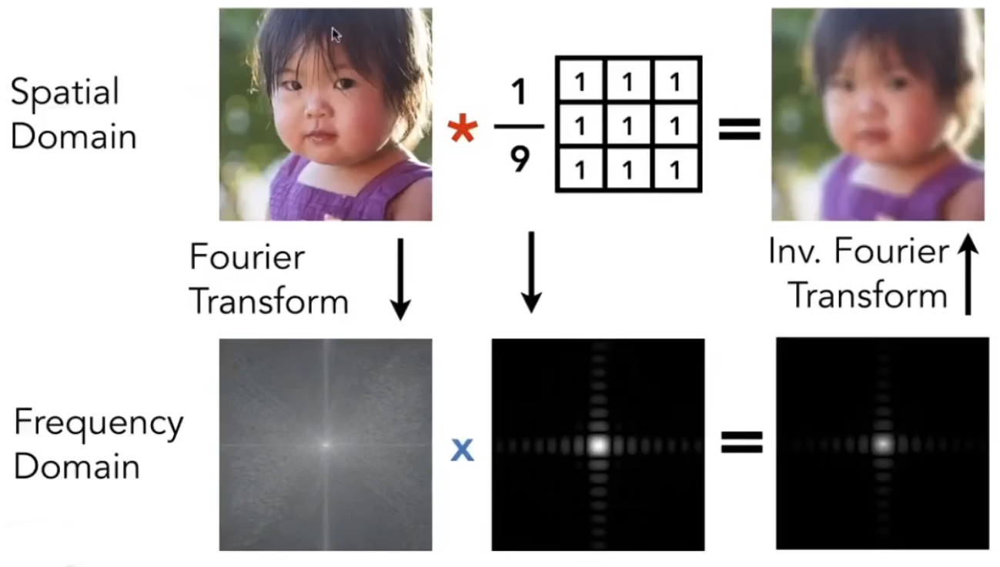

> 均值滤波

- 上面图片可以分上下两块理解
  - 对图片的每个像素都等于自己和周围8个像素的平均值(对时域图做卷积操作)
  - 对傅里叶变化的频域与滤波器的频域相乘(对频域图的乘法操作)

可以发现上述两种操作，得到的结果是相同的

### 采样

**Sampling** = **Repeating Frequency Contents**

**采样**就是重复频域上的内容


- 图(a) : $X_a(t)$ 为原函数图像
- 图(c) : $P_\delta(t)$ 为冲击函数
- 图(e) : $S(t)$ 为原函数与冲击函数乘积的结果，就是 $X_a(t)$ 函数上离散的点
- 图(b) : $X_a(t)$ 函数傅里叶变换之后的函数
- 图(d) : $P_\delta(t)$ 冲击函数傅里叶变换之后的新的冲击函数
- 图(f) : 图(b)与图(d)的卷积的结果

图(c)的冲击函数，就是只有在竖线上才有值，也就是说图(a)与图(c)的乘积就是在图(a)上周期行的取一些点，就跟之前的取样一样的

**采样**：在频率上的理解就是**重复**一个原始信号的平铺

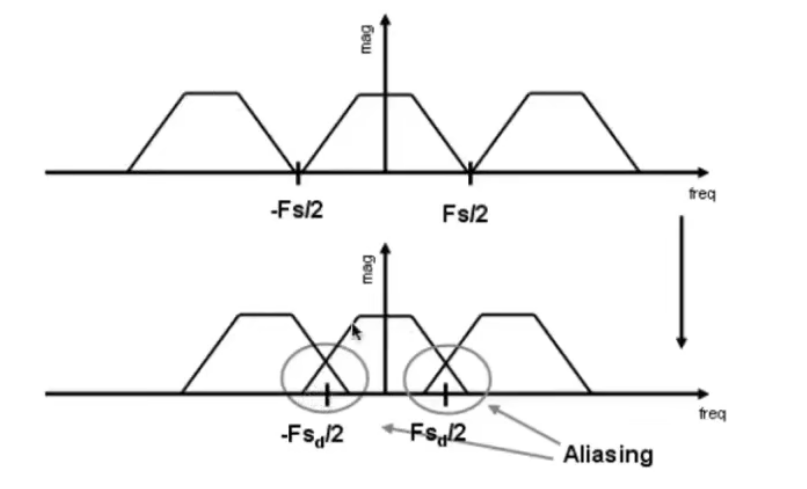

上图中，上面是合理的采样周期，原始信号的平铺是井然有序、严丝合缝的；当采样率不足或采样不够快，就会导致原始信号的间距越小  

那么，我们可以称在频域中，频域的平铺在搬移的情况下发生了混合(混叠)，就是产生**走样**的原因

> 时域中采样越稀疏，在会让频域中的原始数据越密集

### 反走样

#### 增加采样率(减少频域上平铺的混合)，增加屏幕分别率

对于同一台设备，不具有实用性，并不能要求使用者更换显示器

#### 先做模糊，再做采样

通过**低通滤波**，去掉高频信息，再采样


通过去掉高频信号，让原本混叠的部分，不再混叠，从而减少了走样

如何模糊：使用一定大小的低通滤波器对每个像素的覆盖面积做一个卷积

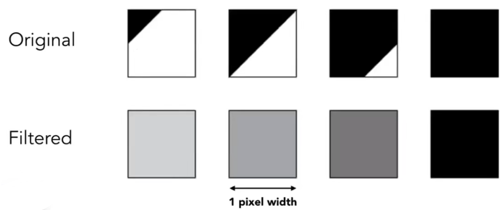

Original是每个像素可能出现的情况，被覆盖小部分、被覆盖一半、被覆盖大部分、被完全覆盖

Fileterd是每个像素通过低通滤波器卷积后的结果

-------

那么如何计算三角形在每个像素中占的比例多少呢？ 不容易、计算量大

#### Antialiasing By Supersampling(MSAA)多重采样抗锯齿

这是近似算法，严格意义上不能解决走样问题

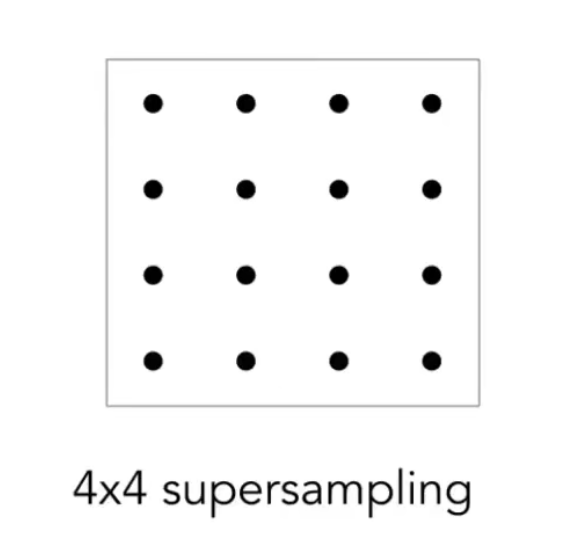

将一个像素，分成若干个小的像素(图中是将一个像素分成4*4，黑色的点表示各个小像素的中心点)，然后再判断各个小像素的中心点是否在三角形中，再把判断结果平均一下，就能得到当前像素百分之多少在三角形中的**近似值**

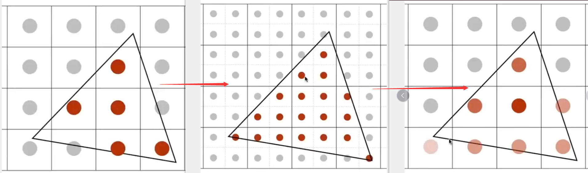

MSAA解决的对信号的模糊操作，只不过MSAA最后的出来的值也可以用作**采样**

- 为了使用MSAA： 增加了计算量(每个像素内又多算了很多次)：工业上会通过更加有效的图案来分布不同的点，而不是这里的均匀分布；也有计算结果复用

#### FXAA(Fast Approximate AA)

快速近似抗锯齿

#### TAA(Temporal AA)

通过上一帧的信息，感知到的信息，来推测

### Super Resolution / super sampling

超分辨率/超采样

将512\*512的图片拉伸成1024\*1024的图片时，会出现非常明显的锯齿  

解决方法就是DLSS(Deep Learning Super Sampling)，就是通过深度学习去猜测缺失部分的信息内容，并且补足

## 深度缓冲

很多三角形叠在一起的时候，怎么处理？

要让离摄像机近的物体遮挡远处物体，通过深度缓冲，也叫Z-Buffer

1. 画家算法

先画远处的面，再画近处的面，一层一层的覆盖

需要先对所有的三角形面片进行排序，时间复杂度 $O(n\log _2n)$ 

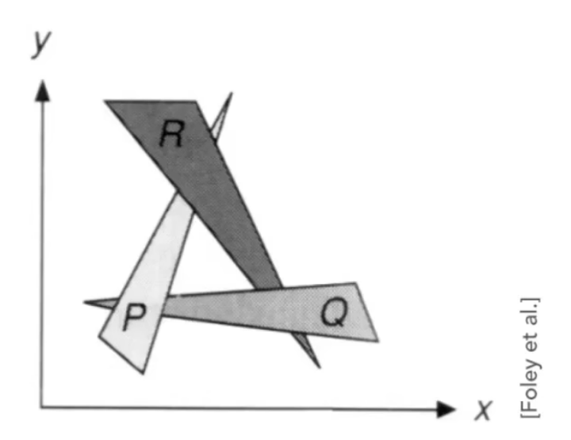

画家算法无法解决这种互相遮挡的关系

2. Z-Buffer

对单独的三角形面片无法排序，那么直接对单个像素进行处理，保证单个像素所存的是其看到的几何物体的最浅的深度信息，即**深度图**，**深度缓存**

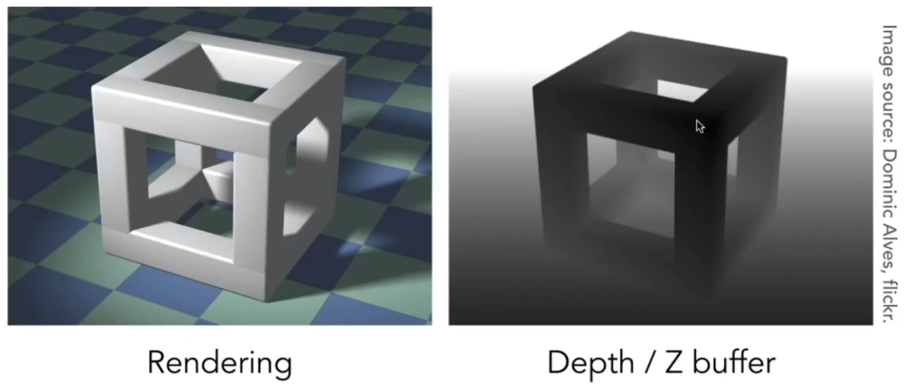

左边为渲染出的图片，右边为深度图

> 深度图中，越近越黑，越远越白

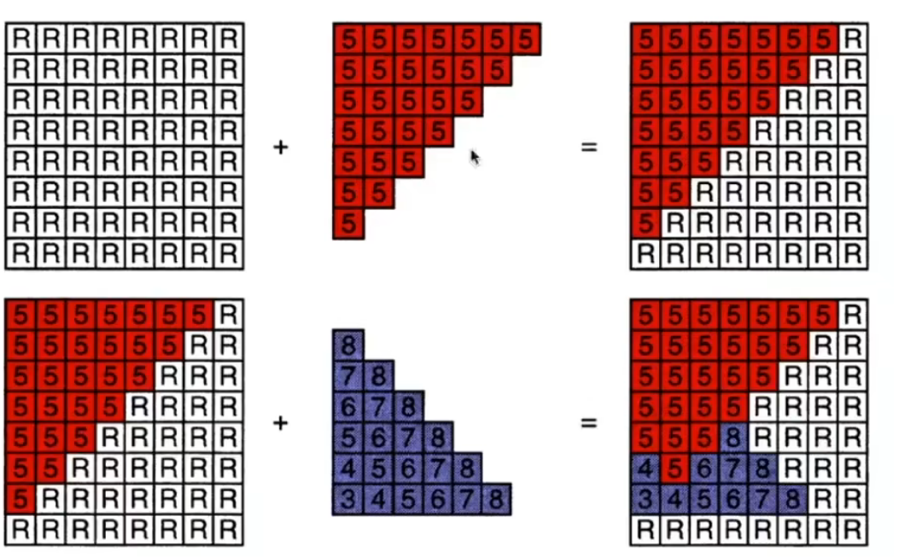

图中每个格子表示一个像素，先来了个一个三角形深度都是5，R表示无限大，则5比无限大小，可以覆盖；然后来了个新的三角形，根据深度信息进行覆盖操作

一般而言，n个三角形，每个三角形覆盖常数个像素，那么最终时间复杂度只是 $O(n)$ 

## 着色

shading，引入物体的明暗的不同，颜色的不同，**对不同的物体应用不同的材质的过程**

### Blinn-Phong反射模型

- 反射
  - 高光
  - 漫反射
  - 间接光照


- 定义
  - 在局部，比较小的范围内，物体表面是一个平面(无论物体长什么样)
  - 定义垂直于平面的法线n
  - 摄像机的观察方向v
  - 看向光源的方向l
  - 颜色color
  - 光的亮度 shininess

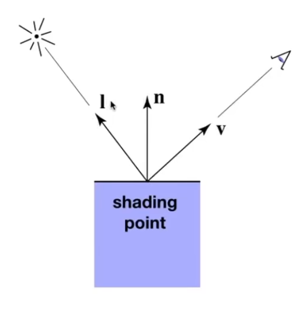

> 所有的方向都是单位向量，只表示方向

#### 漫反射

> 暂且只讨论某一个点的着色，也就是只考虑光照的方向，而不考虑照向这个点的光是不是被挡住了


同一束光照，当紫色物体旋转时，其单位面积接收到的光变少，导致其变暗

任何一个着色点周围单位面积能接受到多少光照，与光线的角度成一定关系，从而引出Lambert's定律：接受到的光照与l和n的余弦(上图中的 $\cos \theta$ )成正比

> 带入现实，一个是太阳能板，被照射面积越大热得越快；一个是四季，夏天是被太阳光直射


对于一个光源，某一瞬间，其发出的能量是固定的，而伴随着光线的传递，其蕴含的能量也逐渐分散(球壳，而不是圆形)

此时定义距离为1是，光线强度为**I**，当距离为r，则光纤强度为 $\frac{I}{r^2}$ ，通过这个式子可以算出当前传播到着色点的光照强度

通过上面两个公式，可以得到着色点(Shading Point)的光照强度、多少光会打在着色点上，得到计算式子

$$
L_d = k_d(I/r^2)max(0, n \cdot l)
$$

- 上面的数学表达式就是**漫反射**的表示方法
  - $k_d$漫反射的系数，表示这个点吸收多少能量(类似物体吸收所有颜色就是黑色，不吸收所有颜色就是白色的物理规律)
  - $I/r^2$ 到达着色点的能量
  - $max(0, n \cdot l)$ 接收了多少能量

> 为什么是 $max(0, n \cdot l)$ ， $n \cdot l$ 也就是 $\cos \theta$ 可能为负数，因为光线可能从物体下面往上发射，而这种光不具备物理意义（这里只讨论发射，不讨论折射） 

漫反射的物理规律就是看一个物体无论从什么角度看都是一样的，而上面的 $L_d$ 式子刚好与观察方向v没有任何关系

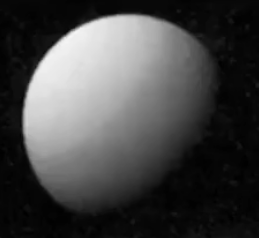

通过前面的解释，可以清楚的了解为什么这个球是渐变的，从亮变灰再变黑

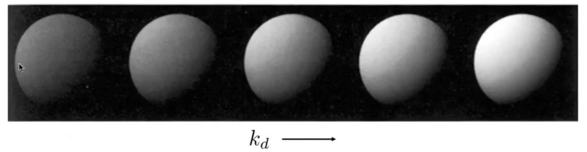

通过定义 $k_d$ 颜色系数，可以定义该物体整体上的明暗

#### 高光

高光：物体、平面比较光滑，所以反射光线的方向都接近镜面反射的方向

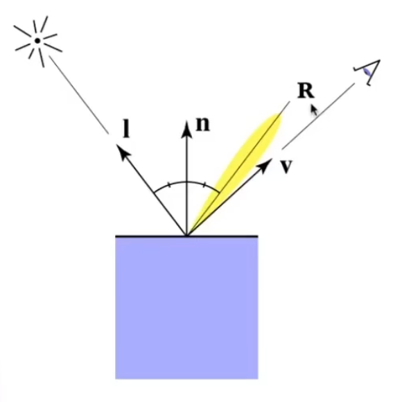

图中R表示镜面反射的方向，黄色部分表示高光反射的区域，v表示观察方向

所以当观察方向与镜面反射方向相近的时候，可以看到物体的高光

在Blinn-Phong模型中，观察方向与镜面反射方向接近的时候，说明了平面的法线方向和 **半程向量(half vector)** 接近

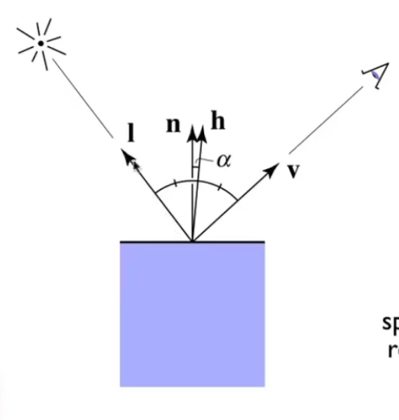

$$
半程向量：\vec{h} = bisector(\vec{v}, \vec{l}) = \frac{\vec{v} + \vec{l}}{\lVert \vec{v} + \vec{l} \rVert} 
\\
L_s = k_s(I / r^2)max(0, \cos \alpha)^p
\Rightarrow 
k_s(I / r^2)max(0, n \cdot h)^p
$$

- 高光的计算公式 $L_s$
  - $k_s$ 高光系数，颜色之类的，跟漫反射系数类似
  - $(I / r^2)$ 跟漫反射中的一样，高达此处的光的强度
  - $max(0, \vec{n} \cdot \vec{h})^p$ 根据观察角度能得到多少光

1. 为啥使用半程向量：半程向量的计算比直接计算光的镜面反射向量简单
2. $\cos \alpha$ ，在 $0~\pi$ 是单调递减的，复合这里 $\alpha$ 越小高光越多的情况
3. 不考虑从 $\cos \alpha$ 为负数的情况，此时光从下面照射
4. $max(0, \vec{n} \cdot \vec{h})^p$ 中指数p的作用如图下所示，通过参数p可以指定高光范围的大小(p越大，高光范围越小，对应下图p越大，数据变小越快，一般100~200)

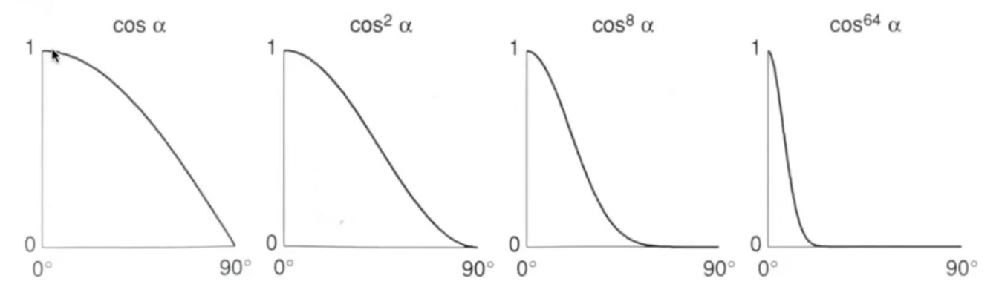

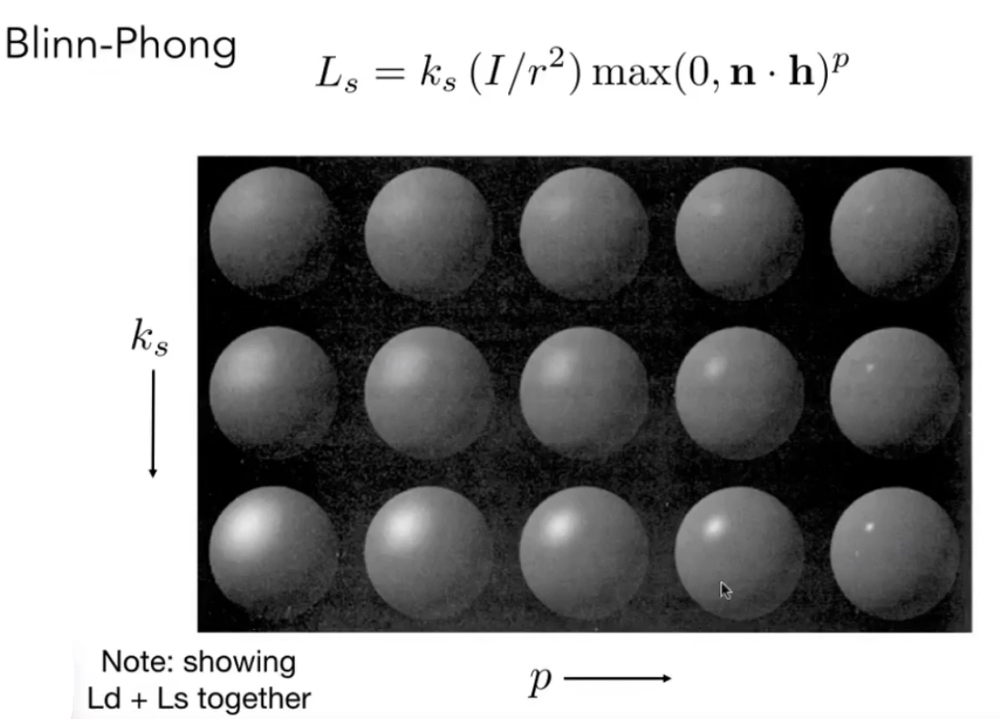

从上到下 高光系数 $k_s$ 逐渐变大，可以发现越来越亮；从左到右 指数p 逐渐变大，高光范围逐渐变小

#### 环境光照

对于处于物体背面的平面不一定就是黑色的，因为有环境光的存在，虽然不会被光线直接照射到，但是会被其他平面的漫反射光照到

在Blinn-Phong模型中，直接大胆假设：任何一个点接收到来自环境的光永远是相同的


从图中可以发现，环境光与光照角度无光，与观察角度无关(每个角度观察都一样)，因此环境光是一个**常数**，即是某一种颜色(比如说一个物体，在任何地方都有一个固定的颜色)

环境光保证一个物体不是全是黑色的，在高光、漫反射计算完之后叠加环境光，提升一个亮度

$$
L_a = k_aI_a
$$

- 环境光 $L_a$
  - $K_a$ 环境光照系数

#### 累加


> Ambient 环境光、Diffuse 漫反射、Specular 高光

$$
L = L_a + L_d + L_s= 
k_aI_a + k_d(I / r^2)max(0, \vec{n} \cdot \vec{l}) + k_s(I/r^2)max(0, \vec{n} \cdot \vec{h})^p
$$

### 着色频率

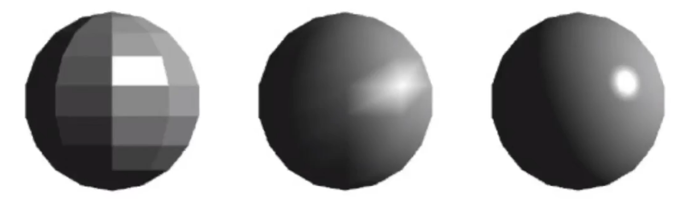

三个球的几何表示在空间中是一样的，但是表现出来的结果却不相同 

着色频率：要把着色应用在哪些点上 

比如图中最左边的球，就是把着色应用在一个**面**上，即一个平面有一个固定发现，求出的结果被应用在整个面上(**Flat Shading**)

比如图中中间的球，一个平面有四个**顶点**，算出每个顶点对应的法线，那么每个顶点都有自己的着色效果，通过差值插值运算，让平面中有较为平滑的过度(**Gouraud Shading**)

比如图中最右边的球，就是把着色应用在每一个**像素上**(**Phong Shading**)

> **Phong Shading**并不是**Blinn-Phong**，前者是着色频率，后者是着色模型

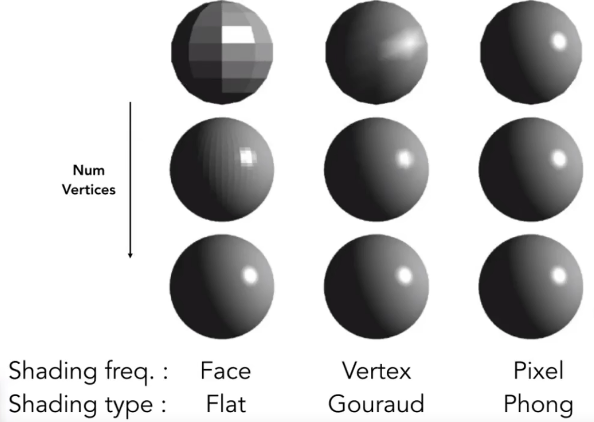

图中每一行的模型相同，从上网下模型精细度增加

从图中可以观察到，当几何体足够精细的情况下，就可以使用相对简单的**Flat Shading**着色频率，得到的结果其实也不差

> 当面足够精细的时候，就不一定要使用**Gouraud Shading** 或者 **Phong Shading**

所以运用何种着色频率，需要根据具体几何体的情况而定，而不是一味的选择像素频率**Phong Shading**

### 计算法线

法线：垂直于平面的向量

**顶点的法线**：顶点相邻面的法线的平均值

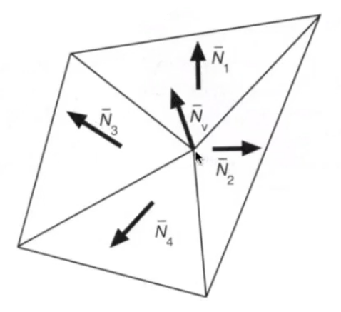

$$
N_v = \frac{\sum _iN_i}{\lVert \sum _iN_i \rVert}
$$

**逐像素法线**：通过重心坐标

### 图形管线、实时渲染管线

如何从场景到一张图？

管线其实就是表示一系列不同的操作

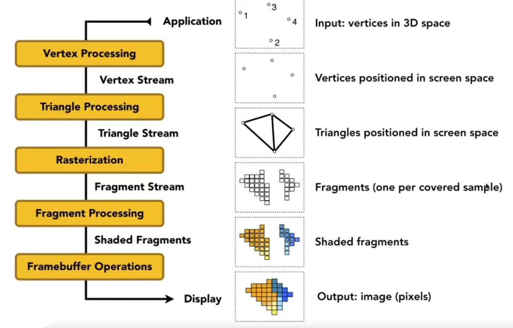

1. 三维空间的点投影到平面上
2. 模型的点形成三角形
3. 光栅化，进行离散操作
4. 着色
5. 渲染到屏幕

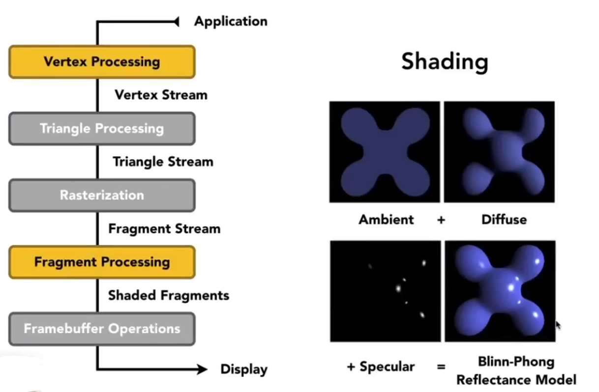

这里**shading**既有可能发生在**Vertex Processing**也有可能发生**Fragment Processing**，因为渲染频率的问题，因为渲染频率既可能是顶点频率，也可能是像素频率，而这就影响了渲染管线的处理顺序

Shader控制顶点管线(**Vertex Processing**)和着色管线如何运作(**Fragment Processing**)

现在GPU允许通过编程的方式，处理顶点、像素的着色操作，通过shader的方式

- OpenGL: GLSL语言
- DirectX: HLSL语言

### 纹理映射(Texture Mapping)


对于漫反射的计算来说 $L_d = k_d (I / r^2) (\vec{n} \cdot \vec{l})$ ，上述图片就是球的每个点的 $k_d$ 是不同的

那么纹理映射就是定义任何一个点的不同属性

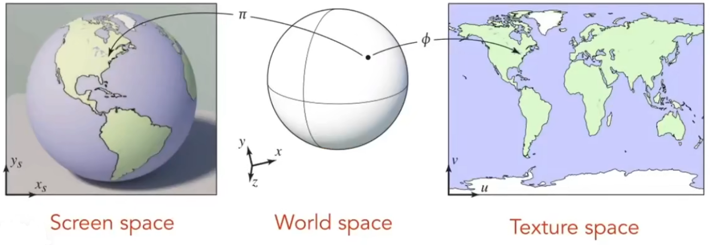

通过上图，可以不加证明给出结论，任何物体的表面都是二维的，那么物体的表面就可以和一张图产生一一对应映射关系，从而引出**纹理**

将一张图通过拉伸、压缩等操作，将其蒙在物体上，那么这个蒙住的过程就是**纹理映射**

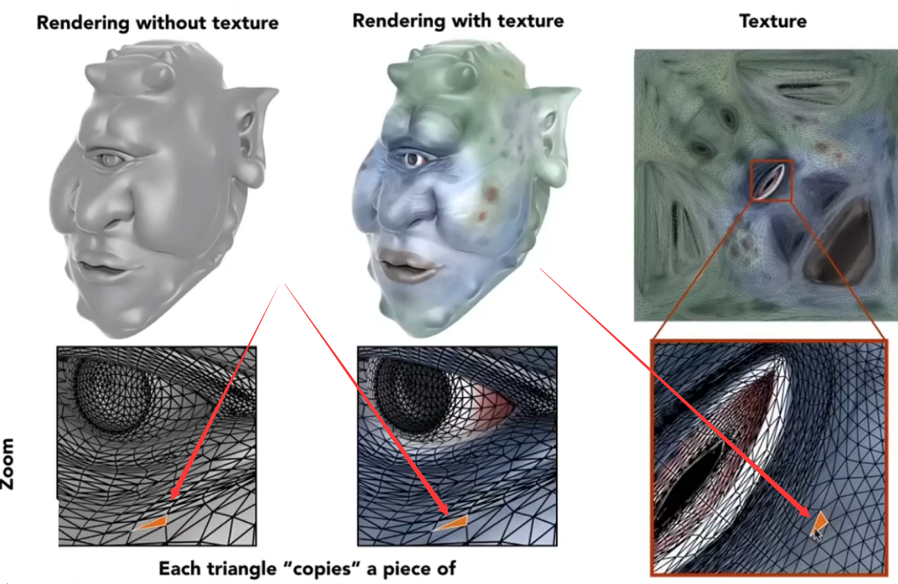

注意图中箭头所指的三个三角形面片，左边两个面片是模型中的面片，右边面片是映射图片与模型三角形面片对应的三角形面片

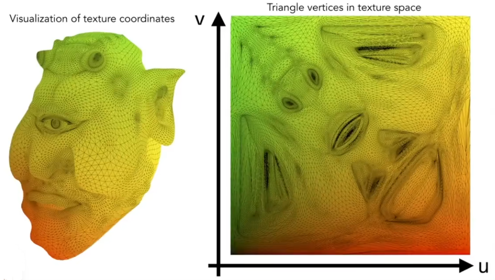

上图中右边的UV是纹理贴图的坐标系

通常认为，对于纹理来说，UV的范围都是0~1之内

通过UV坐标系和模型的映射，可以知道模型中三角形的每一个顶点都对应UV坐标系中的某一个点


一个模型中的纹理可以是重复的

#### 重心坐标

为了能够在任意三角形中进行任意属性的**插值**

上面很多计算是在三角形的顶点上完成计算的，那么在三角形内部希望得到一个平滑的过渡

重心是定义在三角形内部的

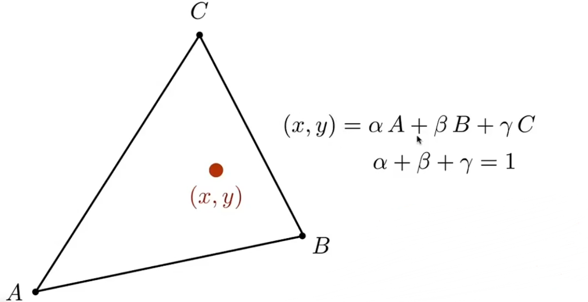

三角形所在平面上的任一点(x, y)都可以用 $(x, y) = \alpha A + \beta B + \gamma C$ 且 $\alpha + \gamma + \beta = 1$ 

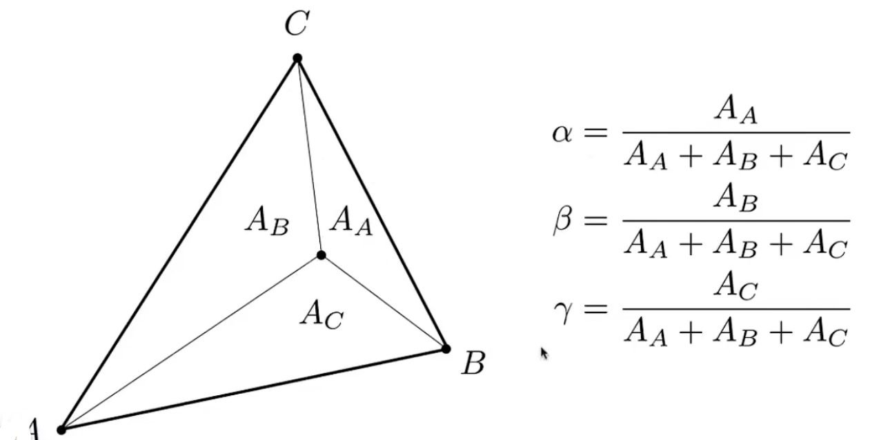

也可以使用各面积除以总面积算出 $\alpha , \beta , \gamma$  

通过坐标计算三角形面积可以使用**海伦公式**：

$$
p = \frac{a + b + c}{2} 三角形周长的一般 \\
s = \sqrt{p * (p - a) * (p - b) * (p - c)}
$$

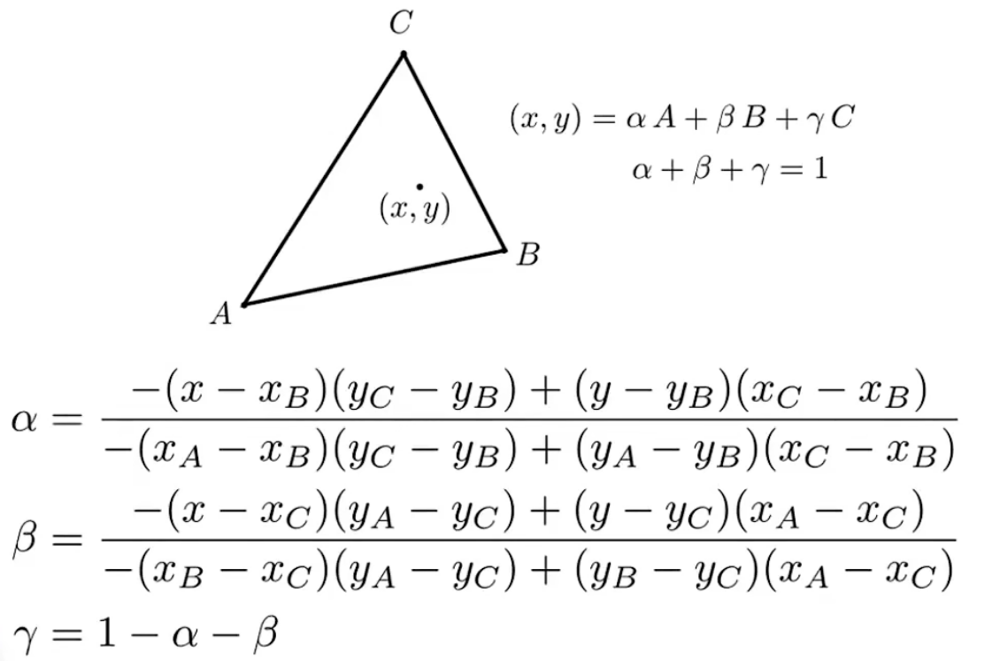

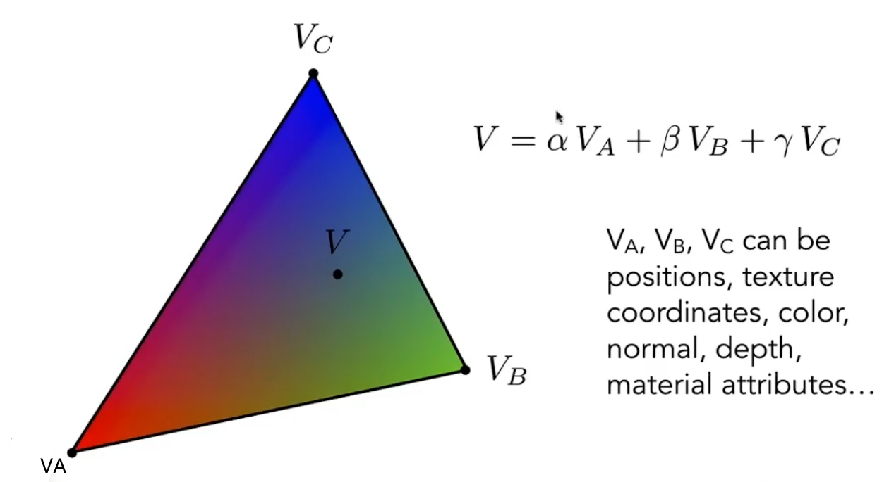

三维空间中三角形的重心坐标计算结果与空间三角形投影之后的三角形再计算投影三角形的重心结果很可能不同，也就是说如果插值三维空间的属性，那么需要插值三维空间的坐标，而不是投影后的三角形插值

#### 使用纹理

屏幕中任意一个点都有一个位置，通过位置计算插值出来的UV或者纹理坐标，随后在纹理上查询该值，就可以知道对应的颜色并将其作为漫反射系数

------

1. 如果贴图特别小怎么处理？(比如4k的渲染分辨率，纹理只有256*256)

> A pixel on a texture —— a **texel**(纹理元素、纹素)

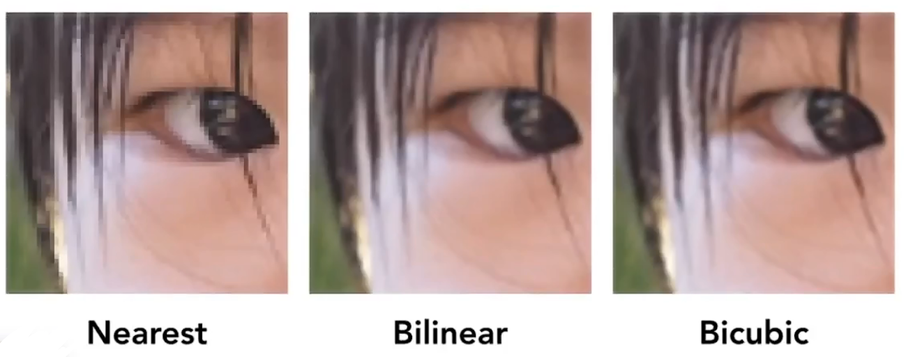

- 解决方法1：**Nearest**，四舍五入，4k分辨率映射到256*256的纹理中，大多数点对应的都是小数，那么直接四舍五入成整数再取纹理中的值
- 解决方法2：**Bilinear** 双线性插值

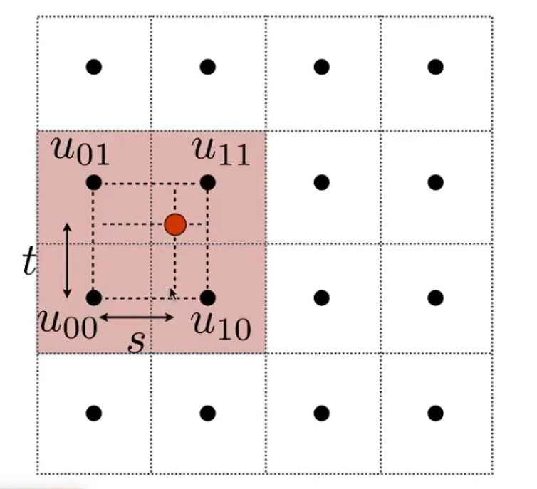

图中红色点是像素对应贴图的坐标，如果使用Nearest方法那么其对应的颜色就是u11点，使用双线性插值的时候会计算目标坐标附近的**四个像素点**再次进行线性插值计算

$$
定义函数：lerp(x, v_0, v_1) = v_0 + x(v_1 - v_0) \\
u_0 = lerp(s, u_{00}, u_{10}) \\
u_1 = lerp(s, u_{01}, u_{11}) \\
f(x, y) = lerp(t, u_0, u_1)
$$

- 解决方法3：**Bicubic**，双三次插值，取周围临近的**十六个像素点**进行插值运算

2. 如果贴图特别大怎么处理？(比如256*256的分辨率，配上4k的纹理)

> 远距离的树木，贴图很精细，但是其对应的像素点很少，这就是该问题的使用场景

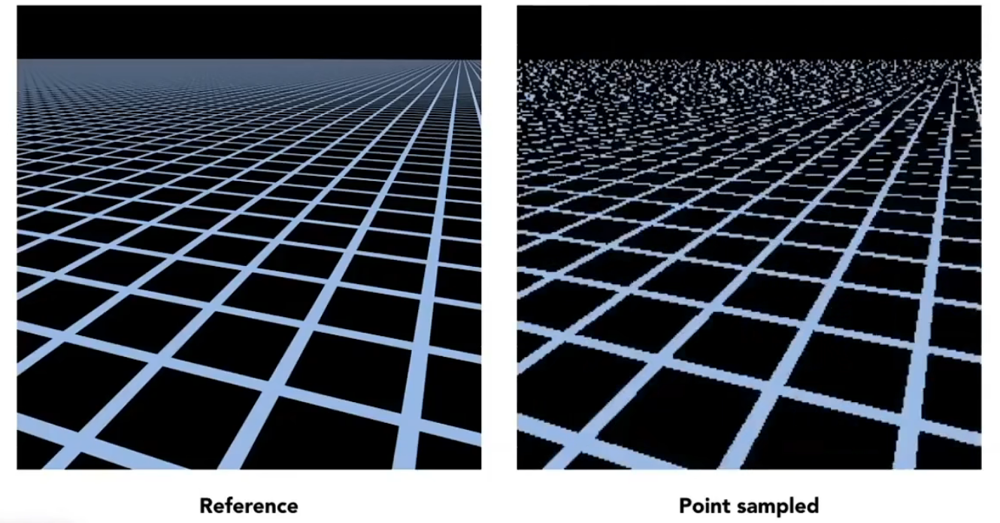

> 远处出现了摩尔纹 近处出现了锯齿 统称走样 

贴图从远到近，每个像素点对应的贴图面积从近到远，从小到大，远处的一个像素点要可能对应多个三角面片

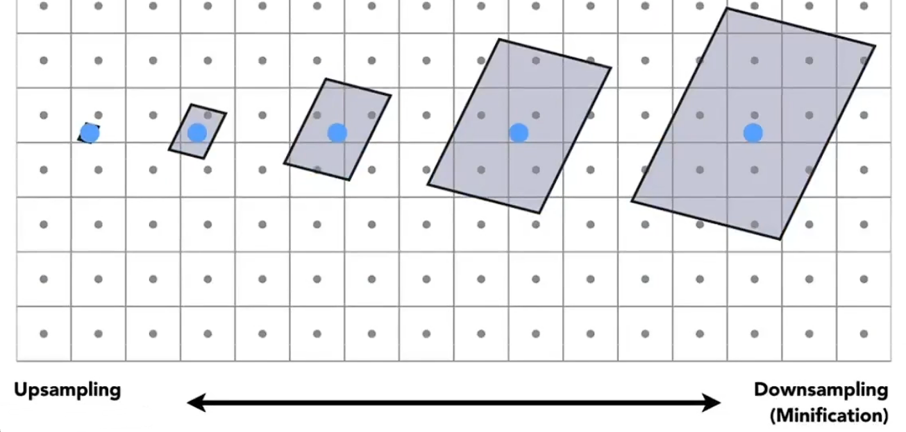

走样的原理就是信号变化过快，采样频率跟不上变化频率。在这里可以理解为一个像素表示采样频率，而像素所覆盖的纹理变化表示信号变化。这里很明显，**上图中**，从左到右，采样频率不变，纹理变化原来越大，从而导致走样越来越严重

**Range Query**范围查询，一个像素会覆盖纹理中的一块很大的区域，如果可以使用某种数据结构，立刻知道该**区域的平均值**，就可以在不增加才样品频率的情况下，减缓走样情况的出现

这里使用**Mipmap**，允许使用范围查询，快(fast)，近似值(approx)，仅适用方形(square)

所谓Mipmap就是用一张图生成一系列图，每次分辨率缩小到一半

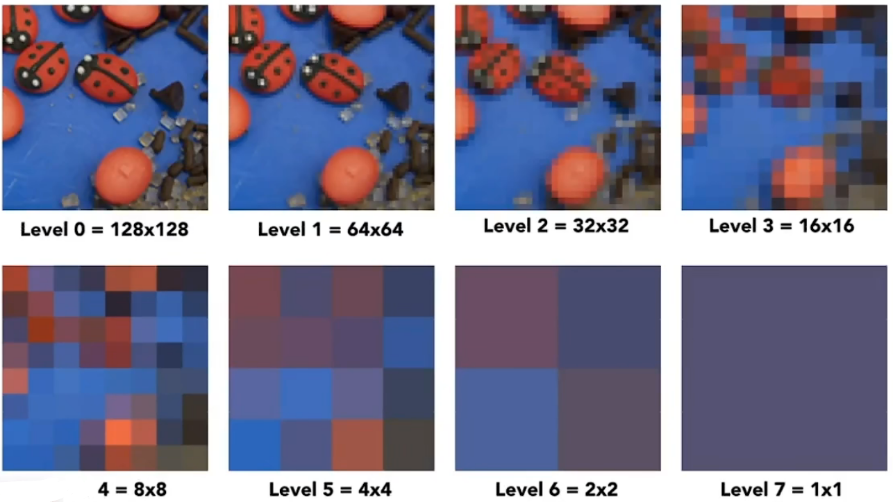

在渲染之前，把纹理提前用Mipmap生成一遍，对比原来的使用空间大小，多用了1/3的空间

**各向异性过滤**
**EWA过滤**


### 纹理的各种使用

如何表示光滑的曲线、曲面、将简单曲面通过细分的方法得到复杂曲面、形状发生变化时面如何变化、如何保持物体的拓扑结构…

在现代GPU中，可以将纹理理解为 texture = memory + range query(filetering)，一块内存以及对内存中的区域进行范围查询

从上述定义扩展开来，纹理可以表示很多东西，比如 环境光、环境贴图(environment)

可以将环境光存储到某个球上，并且将整个球展开

- Spherical Map(球形贴图)

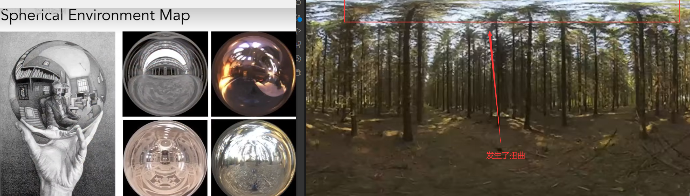

将环境光存储到球上，展开成贴图时会发生扭曲，上图右边的上面和下面都有不同程序的扭曲形变

- Cube Map

为了解决球形贴图导致的扭曲问题，进而提出了Cube Map

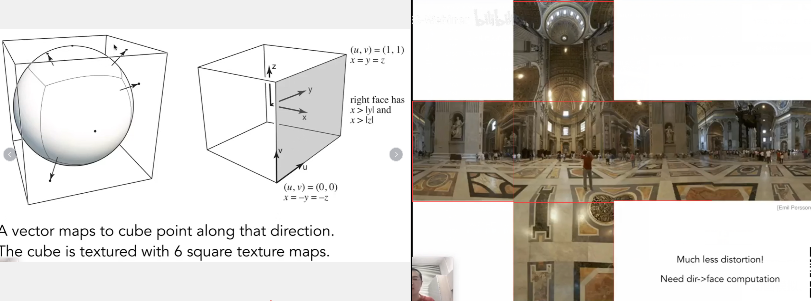

从圆心发出一条射线，将打到的球表面点和Cube面的点关联映射起来

得到的右边的的贴图就是Cub Map，可以将右边的贴图围成一个盒子

> Cube Map会带来一个问题：原本一个方向的光照可以直接在球上获得，现在得转一下才能在Cube Map中获得

- 凹凸贴图/法线贴图 Bump/Normal map
  
贴图不仅可以描述颜射，还可以定义任何不同的位置，任何不同的属性

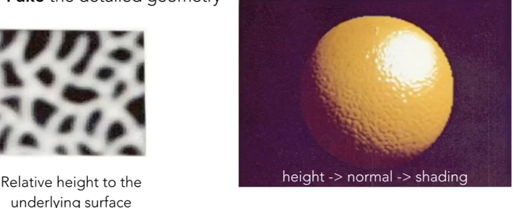

比如上图的左边，定义点在基础表面沿着法线方向往上往下的相对高度

上图的右边，本质是一个简单球形(不可能是手动挖点的)，应用凹凸贴图之后就出现了凹凸不平的效果

也就是说在不修改几何形体的情况，可以通过应用复杂的纹理，从而定义任何一点相对的高度，相对高度一变**法线**就会发生变化，进而导致着色的结果发生变化

> 人为的做一个假的法线，从而影响着色结果

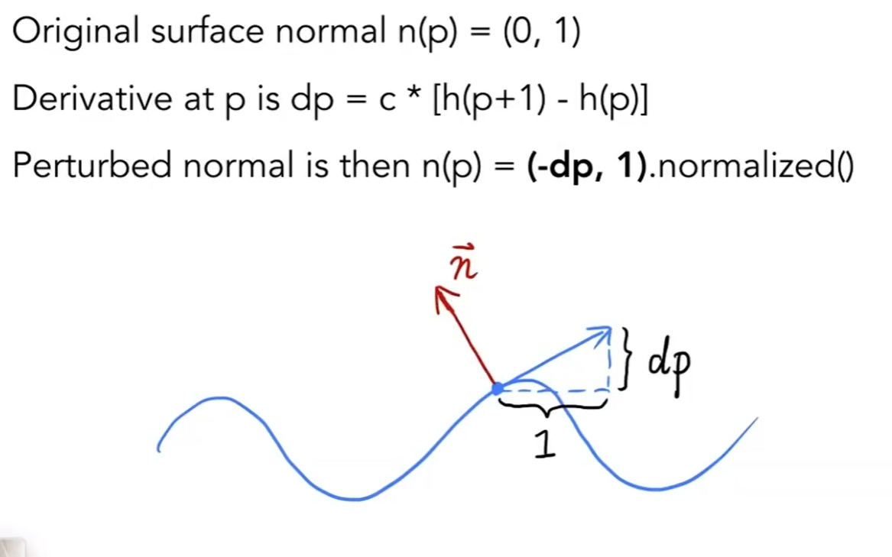

以二维平面为例子，计算凹凸贴图影响后的法线方向 $d_p = c * [h(p+1) - h(p)]$ 

1. 求斜率，用下一个点的高度减去当前点的高度可以近似求出当前点的斜率
2. 常数 **c** 用来做权重设置的，表示当前法线贴图的影响程度
3. 真正的法线就是逆时针旋转90°，直接用旋转矩阵乘就行了

同理去求三维方向的法线切线，做两个方向的导数即可，最后一定要记得**归一化**

- Displacement Mapping 位移贴图

不同于凹凸贴图将位置的移动换算成法线的变化，做一个假的表现效果出来

位移贴图真的对点的位置进行了变化

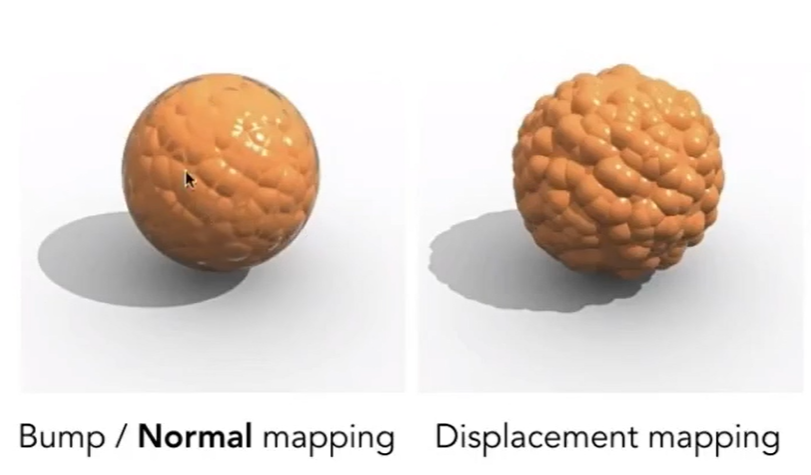

上图左边是凹凸贴图的表现效果，有一个很明显的穿帮点，就是明明表面看起来凹凸不平，但是球的边缘就是光滑的

相对左图而言，右图就明显真实许多

使用位移贴图也有一些要求，首先就是模型的点必须足够细，如果面片很大，那么面片内的点的位置肯定是无法改变的

> DX提供动态曲面细分，可以先应用三角形面片少的模型，再根据位移贴图动态监测继而细分三角形

- 缓存预先计算的信息

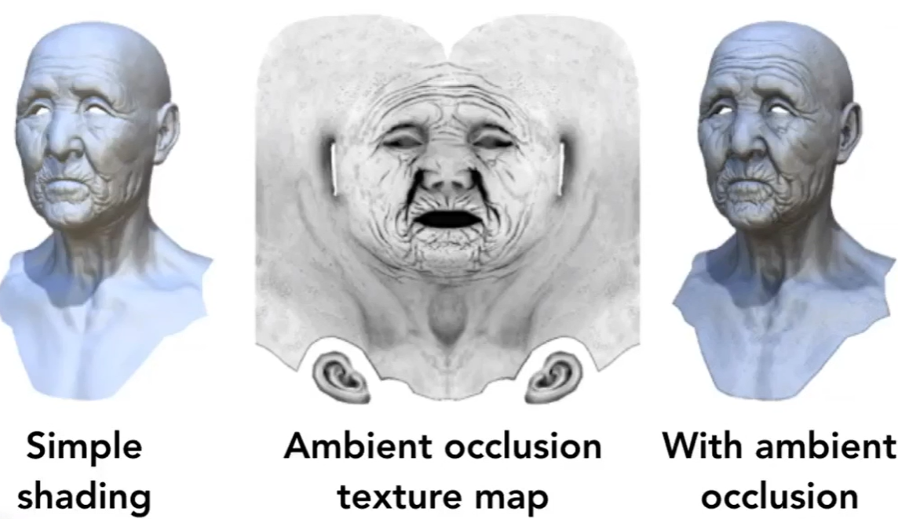

上图左边为简单渲染的效果，中间为提前计算好的环境光遮罩的贴图，将左边左边计算和中间预计算好的贴图结合起来，得到右边更真实的效果

由此可见纹理不仅可以存储颜色信息，还可以存储各种信息，只看你在着色器中怎么解释这些信息


# 几何

## 几何的表示

### 隐式物体面的表示

- 数学公式

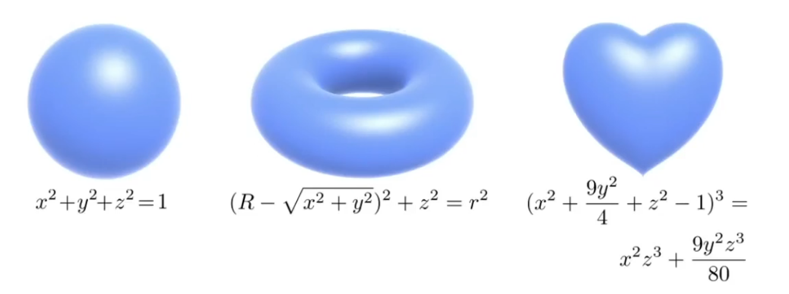

通过计算数学公式直接表示一个几何形体，是比较简单的

但是不够直观，比如心形数学公式，不看表现效果是根本不知道这个数学公式的含义

其次，数学公式并不能表示一个特别复杂的形体(理论可行，实际操作很难)，比如河南用数学公式表示一个奶牛的几何形体

- CSG(Constructive Solid Geometry)

通过一些列基本几何的基本运算，得到一个新的几何

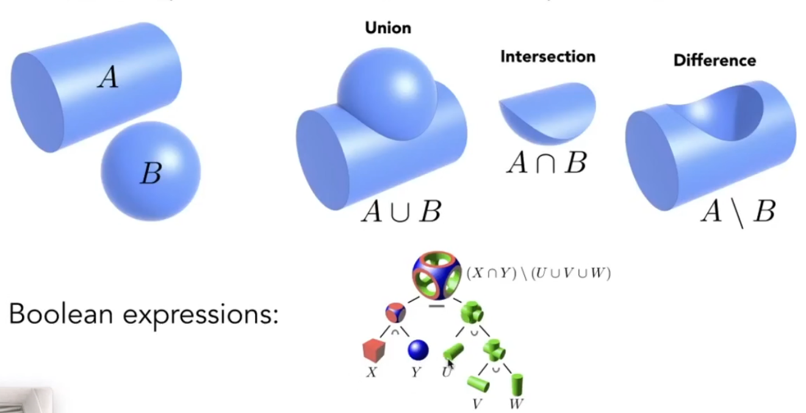

通过上面的一系列变换，能够得到一个比较复杂的几何

- Distance Functions 距离函数

并不直接用公式描述几何，而是去描述点到表面的距离

空间中的任何一个点，到你想要表述的几何形体上任意点的最小距离(可以正、负)

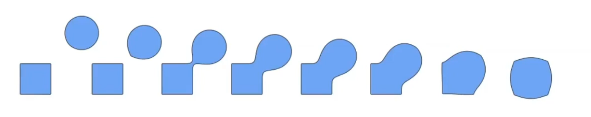

上图中有个几何体分别有自己的距离函数，通过混合两个集合体的距离函数，可以达到从左到右的效果

> 表示效果很强

- Level Set 水平集

思想与距离函数一样，不同的是它函数的表示是写在格子上的

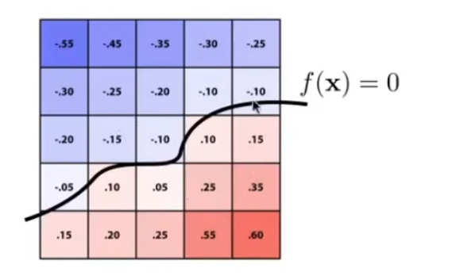

只需要找到中间值是0的地方，就能确定几何边界

- Fractals 分形

### 显式物体面的表示

- Point Cloud 点云

不把面当作面，而是很多的点，只要点足够密看不到缝隙

点的表示方式也很简单，就是(x, y, z)， 点云的表示方法就是一个点的数组


> 上图就是点云的基本表现效果，图片上方点足够密，越往下点越稀疏，其表现效果也越差

- Polygon Mesh 多边形网格

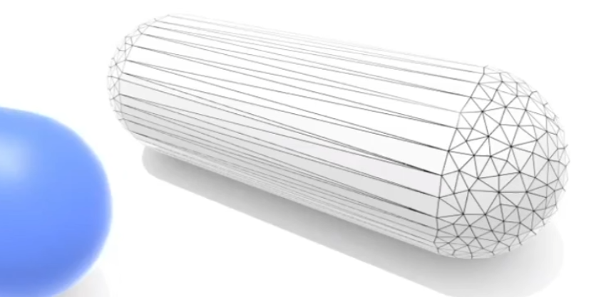

需要存储点的坐标和各个点之间的连接关系

## 曲线

- 曲线的作用
  - 定义移动轨迹、朝向等
  - 定义字体
  - ...

### 贝塞尔曲线

贝塞尔曲线：使用多个控制点去定义一个曲线，控制点可以曲线满足的一些性质

绘制贝塞尔曲线需要用到**de Casteljau Algorithm**算法

已二次贝塞尔曲线为例

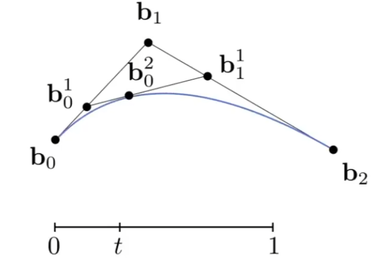

首先控制点有三个 $b_0, b_1, b_2$   

其次 $t$ 表示时间(或者说百分比)，取值范围是0~1

1. 在 $b_0 - b_1$ 的线段上，百分比为t的点 $b_0^1$
2. 同理在 $b_1 - b_2$ 的线段上，找到百分比为t的点 $b_1^1$
3. 在 $b_0^1 - b_1^1$ 的线段上，找到百分比为t的点 $b_0^2$

这个 $b_0^2$ 就是时间为 $t$ 时，点的坐标

接下来就是得到所有的时间t的点，得到的就是一个连续曲线

$$
b_0^1(t) = (1-t)*b_0 + t*b_1
$$

$$
b_1^1(t) = (1-t)*b_1 + t*b_2
$$

$$
b_0^2(t) = (1-t)*b_0^1 + t*b_1^1
$$

$$
b_0^2(t) = (1-t)^2*b_0 + 2*t*(1-t)*b_1 + t^2*b_2
$$

上面的计算式子 $b_0,b_1,b_2$ 的参数很像是 $[(1-t) + t]^2 = (1-t)^2 + 2*t*(1-t) + t^2$ 

同理，三次贝塞尔曲线中 $b_0,b_1,b_2,b_4$ 的参数应该就是 $[(1-t) + t]^3$ 分解之后的

通过上面计算式子和 $b_0,b_1,b_2$ 的表现效果，推理得出贝塞尔曲线的可能的式子

$$
b^n(t) = \sum_{j=0}^{n}b_j*B_j^n(t)\\
B_j^n(t) = \begin{pmatrix}
n\\
i
\end{pmatrix} * t^j(1-t)^{n-j}
$$

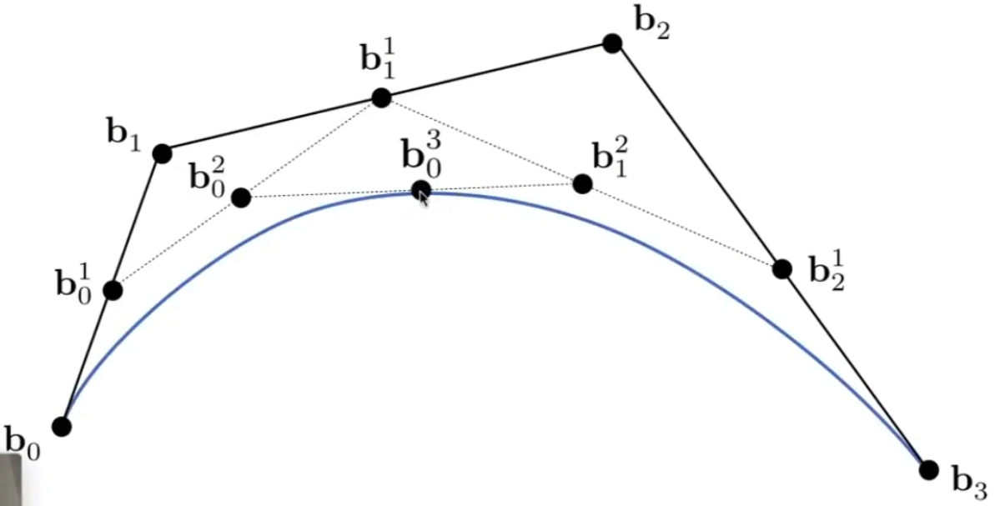

三次贝塞尔曲线的求解方式类似，得到时间 $t$ 的点 $b_0^1, b_1^1, b_2^1$ ,将三次贝塞尔曲线转变成了二次贝塞尔曲线，再走二次贝塞尔的求点方法，得到时间 $t$ 对应的点

很明显，这是一个**递归**的过程

### Piecewise Bezier Curves 分段贝塞尔曲线

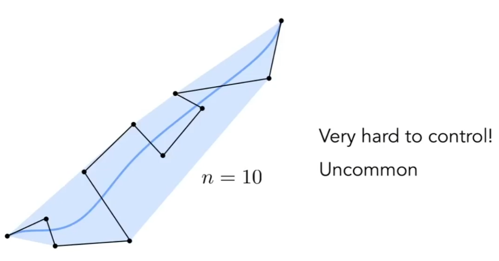

上图中存在**十个**控制点，最后也能的出来曲线，但是各个控制点对曲线的控制不够直观

这时引入了分段贝塞尔，即仅使用少量的控制点去计算某一段贝塞尔曲线，最后将这些曲线连起来

> 一般让**每四个控制点**去计算一段贝塞尔曲线

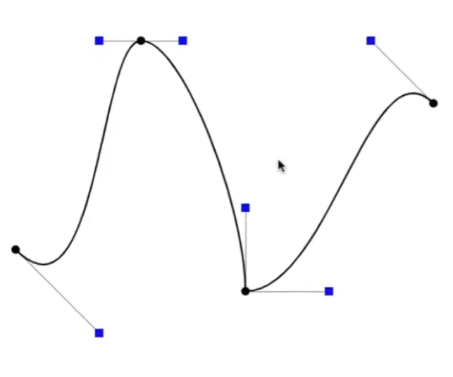

上图中每个控制点上有1/2个控制杆，控制杆的点其实就是四个控制点非起点和非终点的点

> 黑色为起点/终点，蓝色为起点和终点中间的控制点

只要控制点上两个控制杆上的点在一个直线上，那么该控制点上的曲线就是平滑过渡的，具有**连续性**

### Spline 样条线

一条连续的曲线，由控制点控制，任何地方都能满足一定的连续性

- B-Splines
  - Basic Splines，基础函数样条，由不同函数组合起来组成基函数，基于该函数的样条线
  - 是对贝塞尔曲线的扩展
- NURBS
  - non-uniform rational B-spline，非均匀有理样条

...

## 曲面

### 贝塞尔曲面

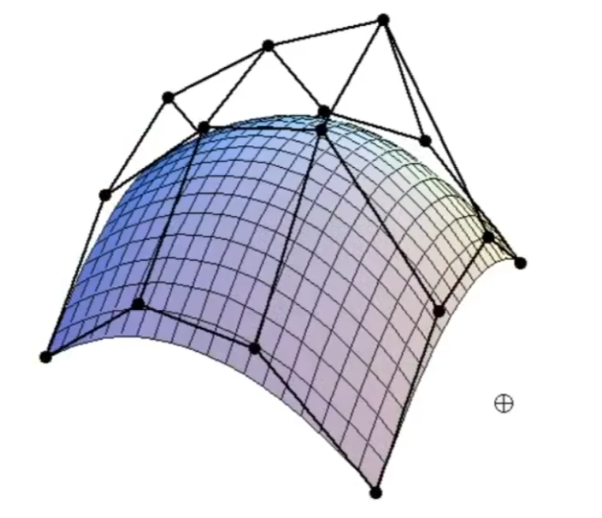

一般4*4个点控制一个面

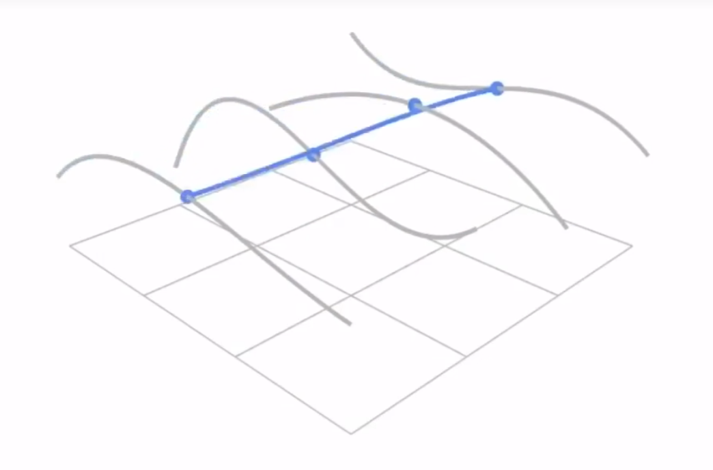

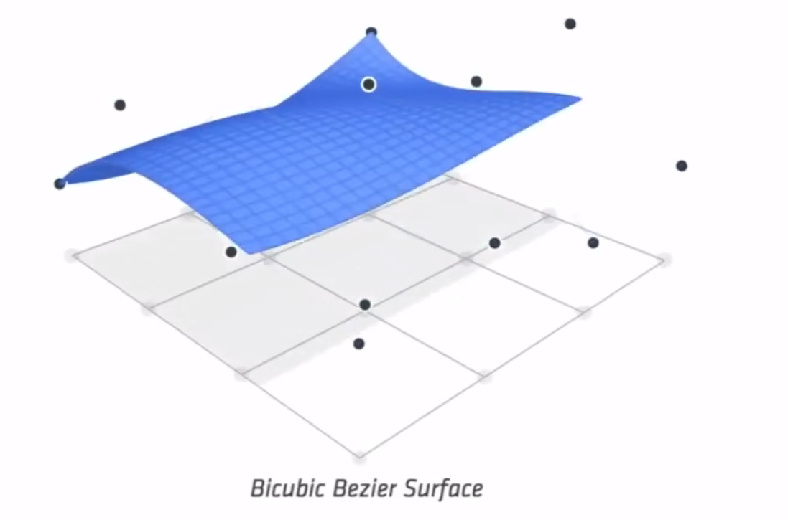

### 网格加工

- 网格细分 Mesh Subdivision(upsampling)

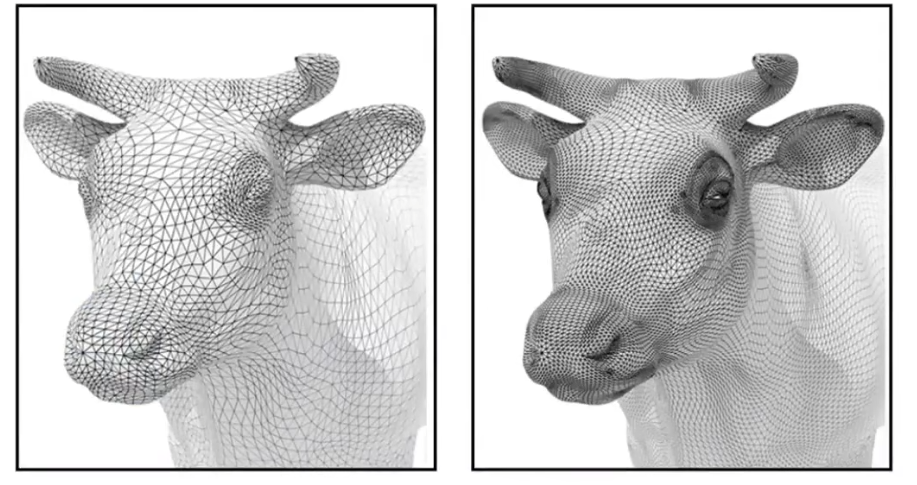

通过增加面片个数，增加模型的精细程度

1. 分出更多的三角形
2. 让新分出的三角形位置发生一点变化，使得原来的模型变得更加光滑

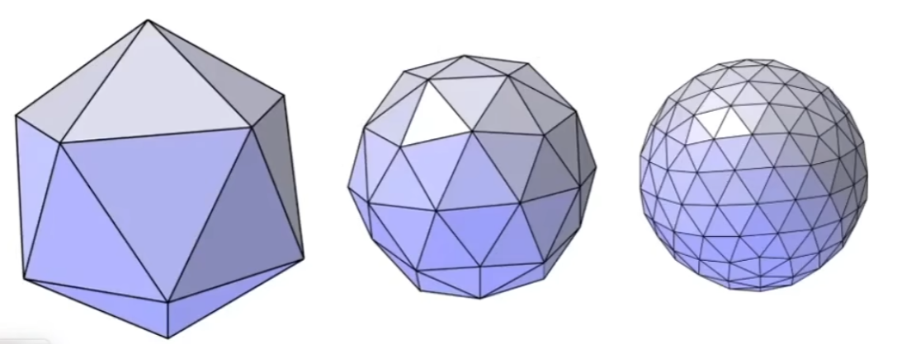

- 网格简化 Mesh Simplification(downsampling)

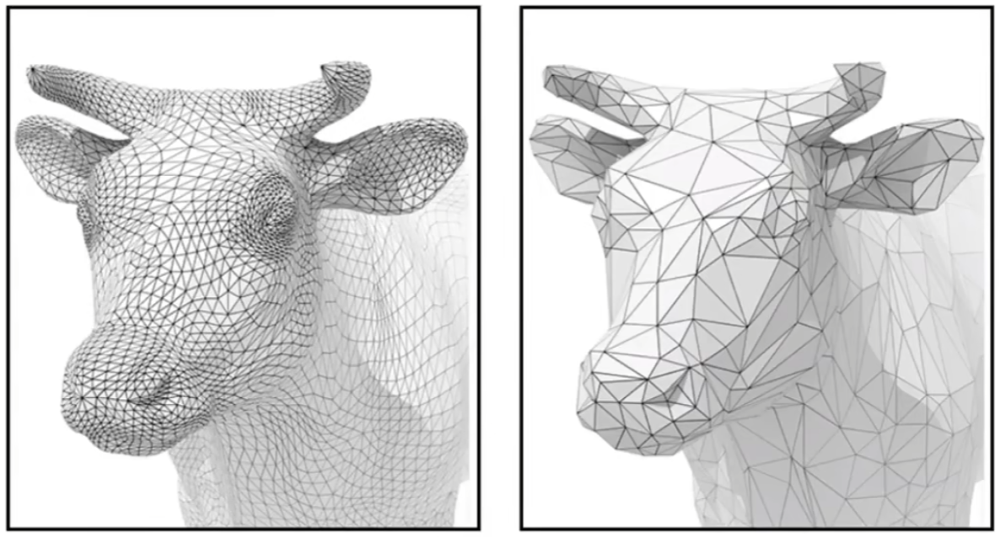


在减少三角形个数的前提下，依旧保持模型的连接关系


- 网格正规化 Mesh Regularization(same #triangles)

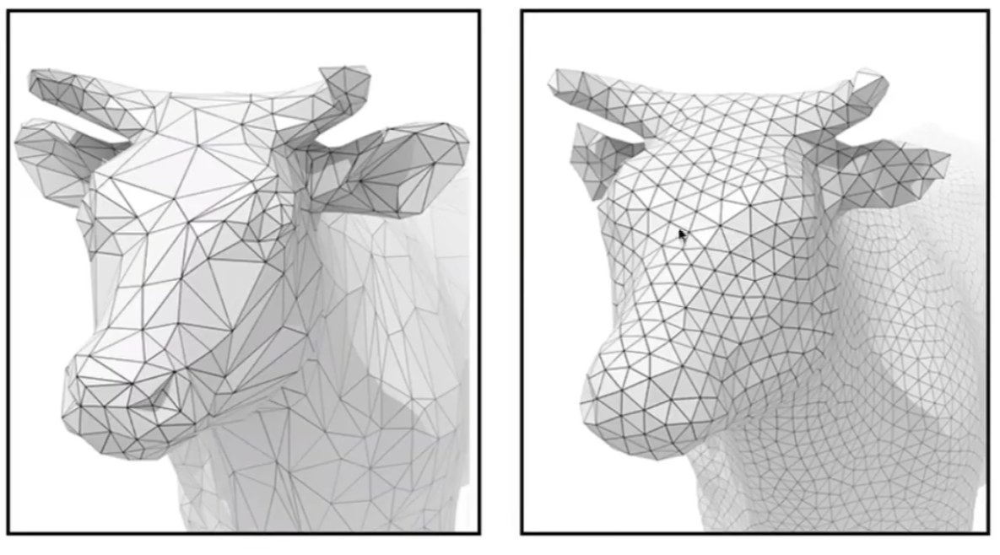

三角形可能有大有小，会对渲染造成不便

通过让三角形正规化，让网格的三角形变得更像正三角形

### 网格细分

网格细分分两步

1. 分出更多的三角形
2. 让新分出的三角形位置发生变化，使得原模型变得更加光滑


#### Loop Subdivision

以 **Loop Subdivision** 为例，注意此处**不能理解**为 **循环细分**， 发明这个算法的人的family name 是 loop，是以这个人的名字来命名的，跟 **循环** 没有一点关系

1. 分出更多三角形

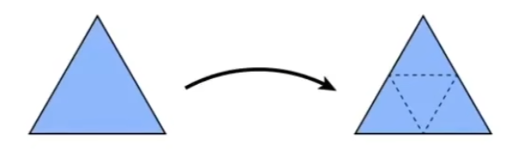

通过上图操作，将一个三角形分成了四个三角形

2. 区分新、旧顶点，分别改变其位置

> 对于上图而言，新顶点就是每个边的中心点，旧顶点就是大三角形的三个顶点

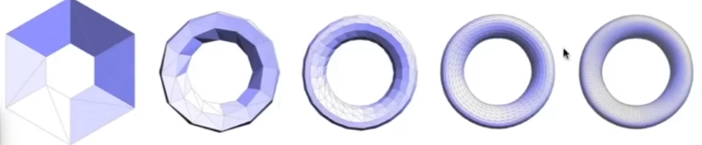

通过细分，将一个六边形，细分成了圆环

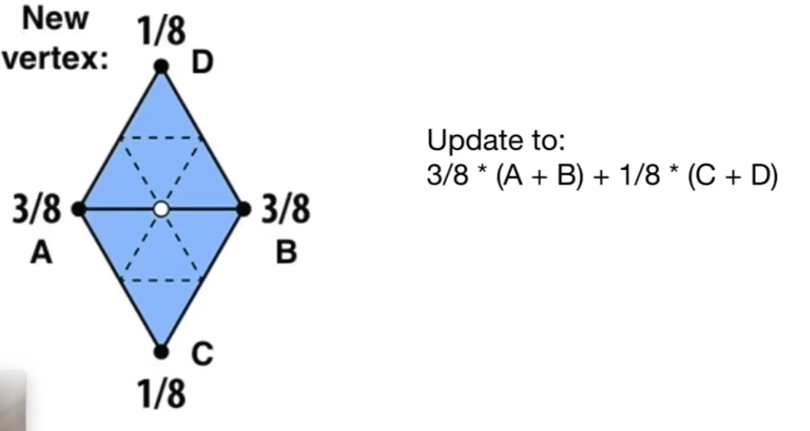

- 更新 **新顶点** 的位置

以中间白色的点为例，这个点一定会被其他几个三角形公用

设定被公用的边的顶点为 A、B， 不被公用的顶点为 C、D

根据 `Loop Subdivision` 规定,将 中间白点的坐标 调整到 `3/8*(A+B) + 1/8*(C+D)`

> 本质上就是简单的加权平均

- 更新 **旧顶点** 的位置

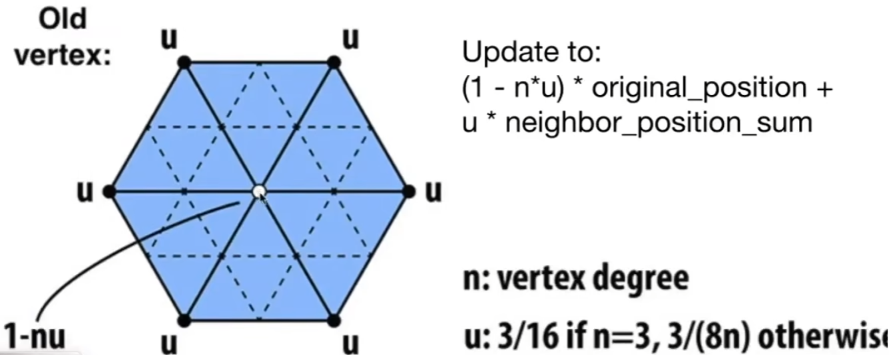

> 上图中 实线 为旧的三角形边，虚线 为新的三角形边

根据 `Loop Subdivision` 的规定，旧顶点的坐标一部分受其他旧顶点坐标的影响，一部分根据自己的坐标来变化

此处定义变量

| 变量名 | 定于 |
| --- | --- |
| n | 顶点的度，即顶点连接的边的个数，比如上图中白点的度为6 |
| u | 与度相关的一个数 |

给出公式，旧顶点的坐标为 `(1 - n*u) * original_position + u * neighbor_position_sum`

即，`(1-n*u)`的自己坐标 + `u`周围点的坐标和

如果n为2，可知该点可能很重要，所以会更加相信自己的坐标，n越大，受其他点位置的影响越多

#### Catmull-Clark Subdivision(General Mesh)

Catmull 和 Clark 两个人发明的网格细分算法

`Loop Subdivision`算法仅仅适用于三角形网格的细分，该算法可以用于非三角形网格

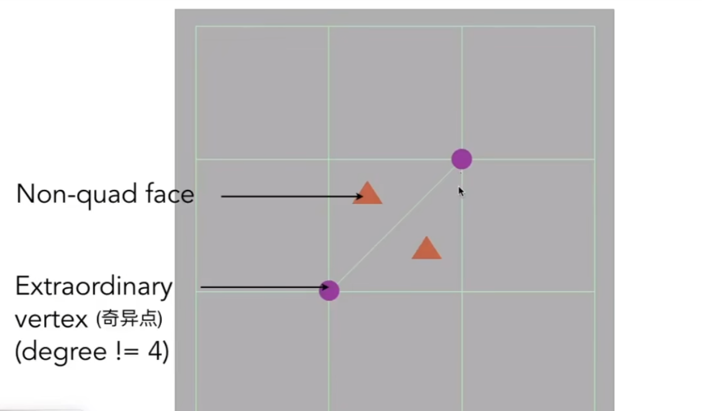

| 概念定义 | 解释 |
| --- | --- |
| Non-quad face | 非四边形面 |
| quad face | 四边形面 |
| Extraordinary Vertex 奇异点 | 只要**度不为4**的点都是奇异点 |

> 度：顶点连接的边的个数

1. 每个变取一个中点，每个面也取一个中点，将边的中点和周围面的中点相连

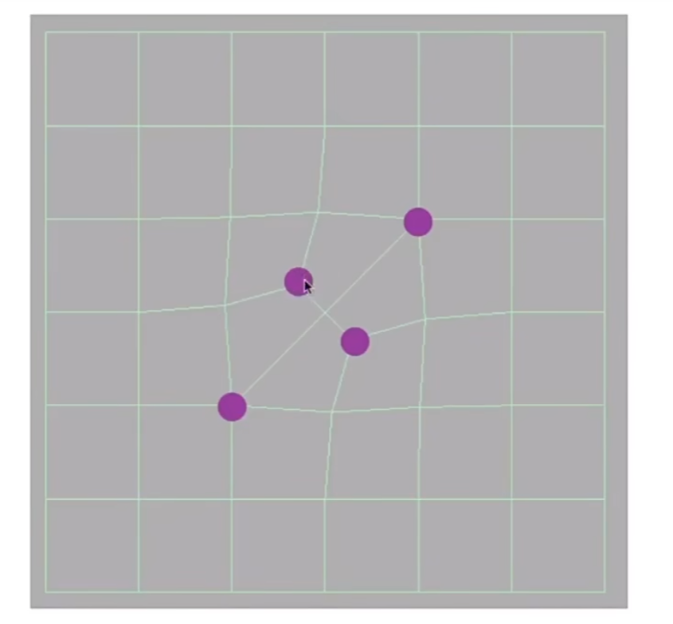

> 上图点的位置已经调整，但是表现效果类似

根据上图，奇异点的数量从 2 变成了 4

只要是在非四边形的面中点，由于该点要跟面的边上的点相连，所以非四边形面的中心点一定是**奇异点**

根据上图，非四边形面数量从 2 变成了 0

所以，所有非四边形面都变成了四边形面，同时引入一个奇异点

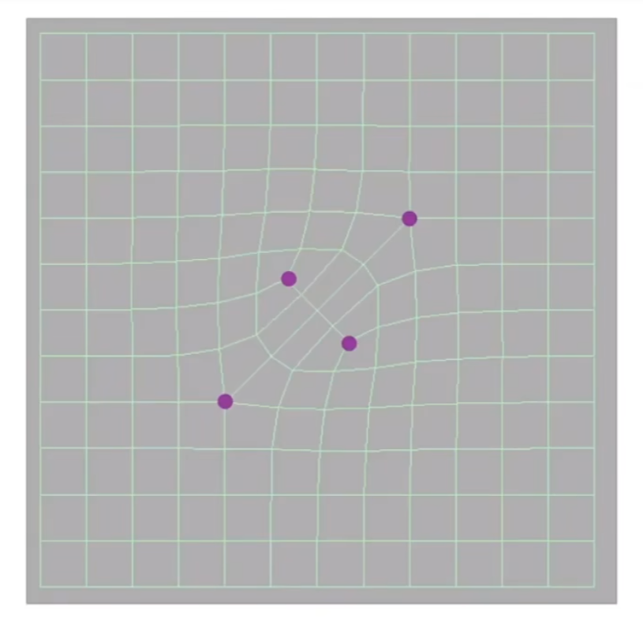

> 通过一次细分之后，再次细分得到二次细分

因为一次细分之后，所有的非四边形面都变成了四边形面，所以奇异点的数量不会增加

2. 调整点的坐标

该算法将点分成三类：四边形面的中心点、边的中心点、旧的点

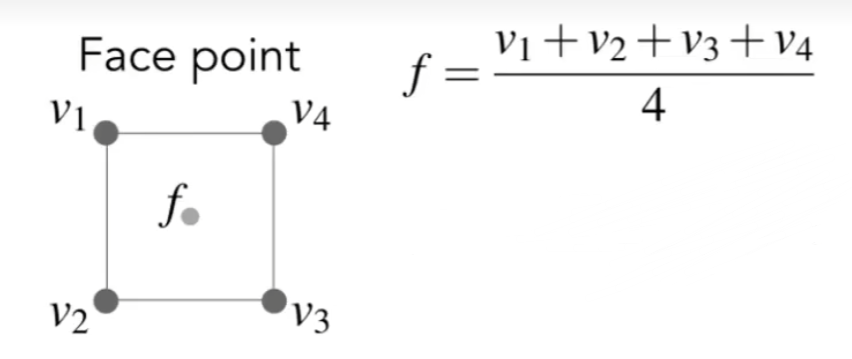

> 面中心的点

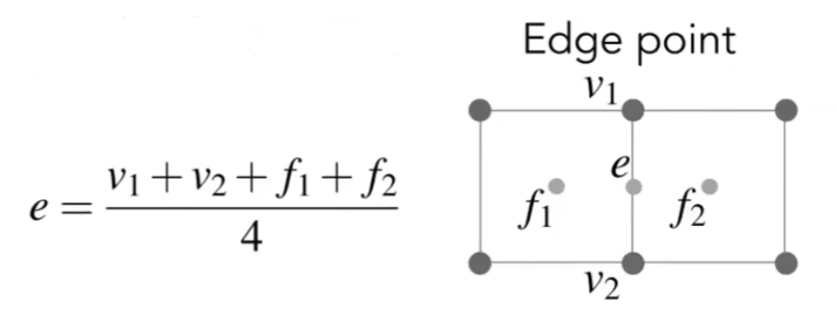

> 边中心的点

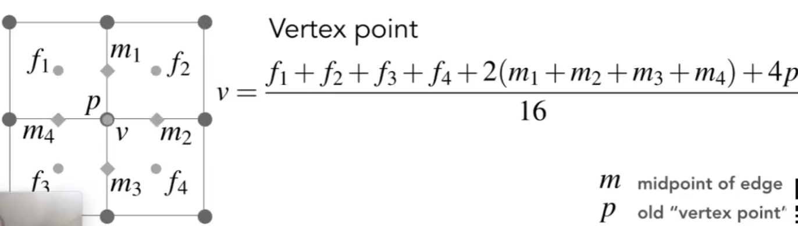

> 旧的点

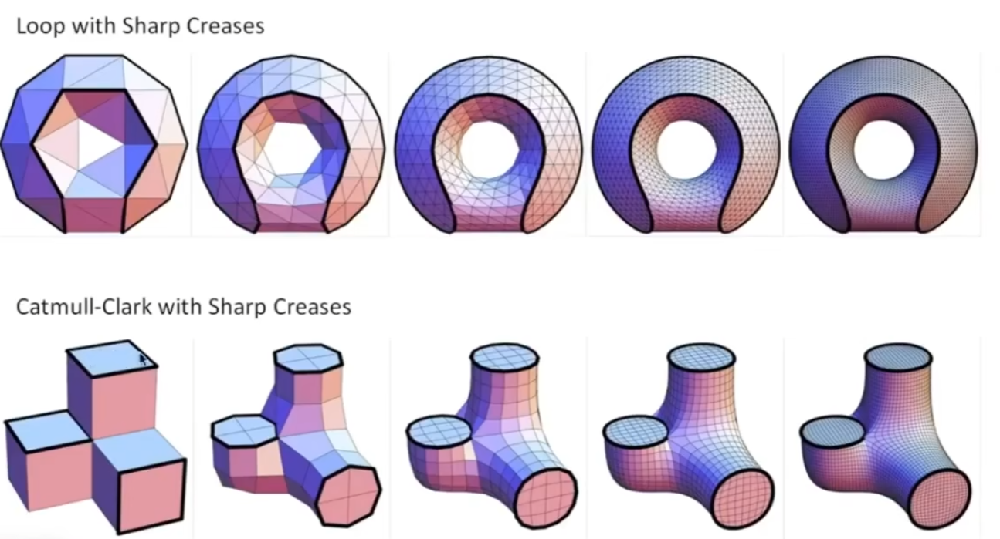

> Catmul-Clark细分在非三角形面中的作用

### 网格简化

减少三角形数量，提升程序性能

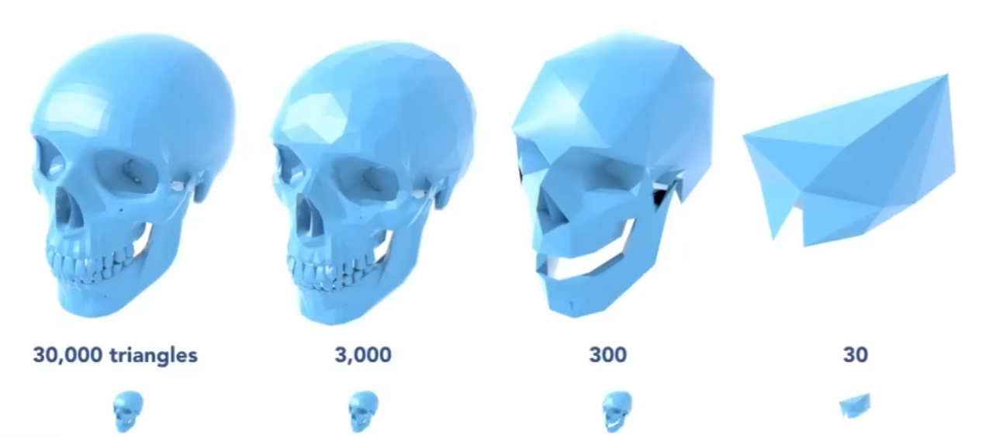

从左到右，依次是 30000 -> 3000 -> 300 -> 30 个面的不同表现效果

从上图中骷髅的大图可以明显发现一些差别，但是大骷髅下的骷髅缩略图30000和3000面的差距不大

在不同的情况下，选用不同复杂程度的几何模型

101提供一种解决方法(肯定还有其他解决方法)：Edge Collapsing 边坍缩

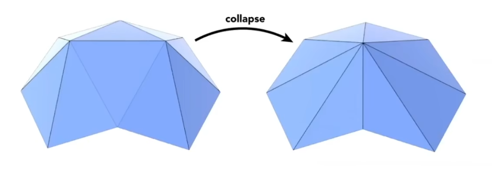

上图就是边坍缩的简单示例，选择一条边，将其坍缩为一个顶点，原本边两边点的连线都连接到这个新的顶点上

这里存在一个重要的问题：哪些边需要被坍缩？探索后点的坐标？

**Quadric Error Metrics** 二次误差度量

> 二次 指 平方

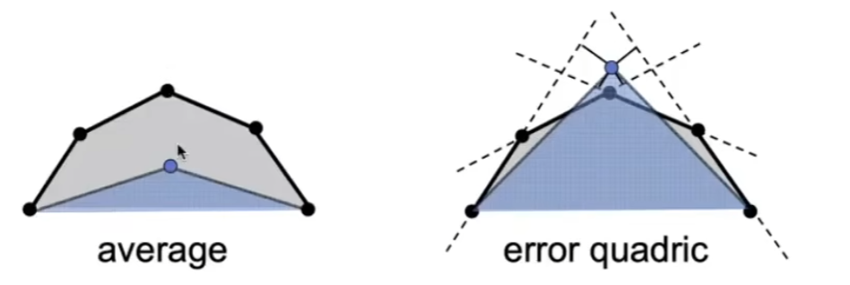

> 使用二维模拟三维情况

上图是为了找到一点使得蓝色三角形看起来跟原本灰色五边形最相近

上图左边的蓝点是用各个点的平均值算到的点，很明显蓝色三角形与灰色多边形差距很大

上图右边的蓝点是使用二次误差算出来的点，二次误差的计算方法就是找到一点使得该点到各个面的距离的平方和最小

Quadric error: new vertex should minimize its sum of square distance to previously related triangle planes

因此，对于三维模型，可以对所有边进行二次度量误差的计算，那么每个边都有的对应的二次度量误差的分数，然后从误差小的开始逐渐坍缩

但是对一个边进行坍缩后，会影响到其他边的二次度量误差的计算，因此需要一个数据结构，可以在O(1)的时间内找到二次度量误差最小的边，并且对其影响的其他边的二次度量误差值进行更新

该数据结构就是 **优先队列** 或者 **堆**

> 使用堆可以快速找到最小的边，并且修改其影响的边的值，在更新值之后可以快速的更新其在堆中的位置

### 网格正规化

# 光线追踪（Ray Tracing）

## 阴影的计算 Shadow Mapping

解决阴影的方法叫Shadow Mapping，对应的结构是 Shadow Map

是一个图像空间的做法，无需知道场景的几何信息，但是Shadow Mapping会产生走样的问题

如果点不在阴影中，并且可以观察到该点，说明该点在摄像机中可见，同时该点可以被光源看到

Shadow Mapping可以处理硬阴影的情况：即一个点要么在阴影中，要么不在阴影中

经典 Shadow Mapping 只能处理点光源或方向光

1. 从光源看向场景

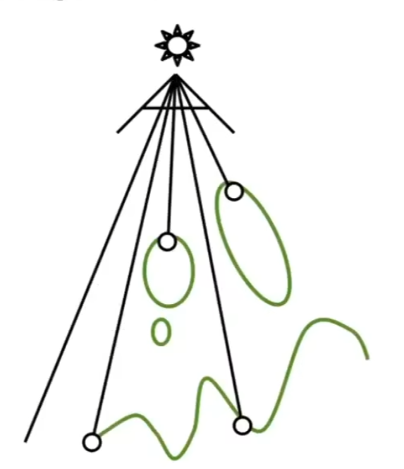

把光源看作相机，对准场景，做一次光栅化，可以得到光源能看到的，这样可以将光源看到的光栅化的深度信息记录下来，即得到每个像素在光源中对应的深度信息，这个深度图就是Shadow Map

2. 从相机看向场景

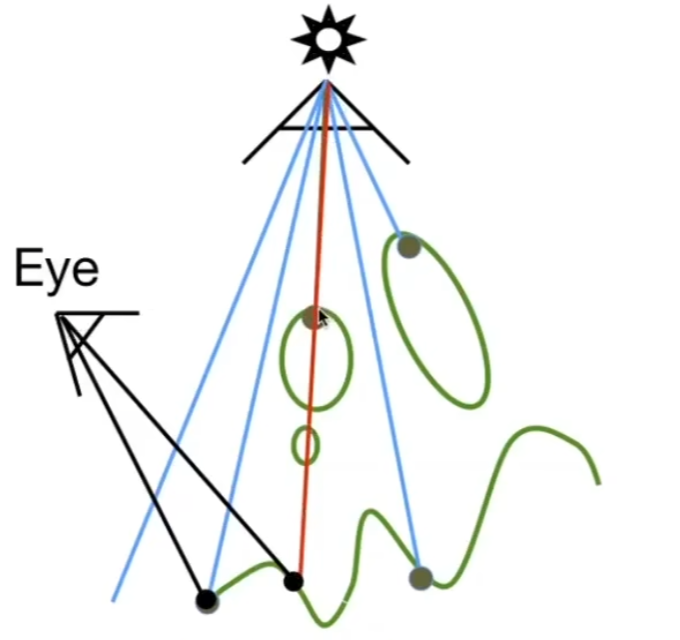

> 注意上图中的红线

将相机看到的点，投影回光源得到的深度图的对应像素上

如果该点投影到光源深度图的深度 比 光源缓存的对应位置像素的深度信息还深，则表示该点不会被光源照射到

如果 深度 相同，表示可以被照射到

类比真实情况就是，太阳光下 地面的深度 比 屋顶的深度 深，所以地面会有阴影，但是屋顶没有

这里会有几个问题

1. 深度信息一般是浮点数，无法判断相等，会有误差问题
2. 光源的深度图有分辨率的问题，如果精度高则性能差，如果精度低则深度信息缺损严重
3. 一次绘制渲染两次，光源一次，相机一次

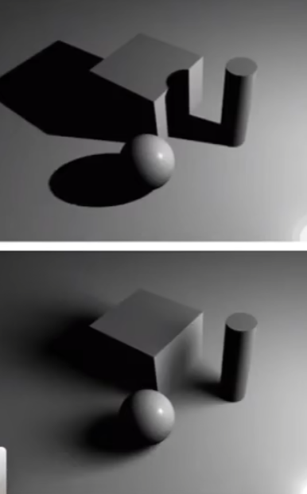

> 上图对比了硬阴影(上)和软阴影(下)

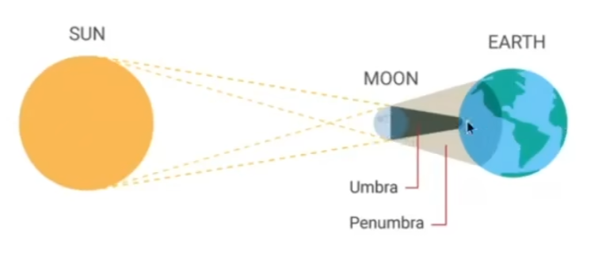

软阴影可以用物理解释，上图 Umbra 就是完全看不到光源的区域，Penumbra 区域可以看到一部分太阳

这里的光源(太阳)是有**体积**的，所以出现了 Penumbra 区域

## Whitted-Style Ray Tracing

> Whaitted风格的光线追踪

光栅化无法表现一些全局的表现效果，包括：

1. 软阴影(Soft Shadows)
2. Glossy Reflection(物体本身有镜面反射，又带有粗糙的漫反射。环境中其他物体的光通过镜面反射到相机中)
3. Indirect Illumination(间接光照，光通过了几次发射最后才发射到相机中，光栅化可以做但是效率和效果差)

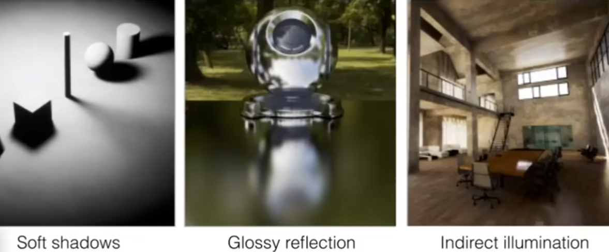

光线追踪一般用作离线计算，因为其计算量高，不能保证实时性，但是其质量高，符合物理规律的真实渲染结果

在 **光线追踪** 中对于 **光线的定义**

1. 光线是沿着直线传播的
2. 光线和光线不会发生碰撞
3. 光线从光源发射，在场景中通过反射，最终到达相机
4. 光线的传播具有**可逆性**(reciprocity)

做光线追踪实际上是从 眼睛/相机 出发，向世界中投射光线，然后 眼睛/相机 发出的光线在时间中不断反射，最终到达某个光源

1. 从 眼睛/相机 发射射线，因为最后是渲染到一个平面上，平面具有像素点，那么相机到各个像素点就可以连成一条射线
2. 当射线与某个物体相交，即表示从 眼睛/相机 看到了哪
3. 再将相交点与光源做连线，判断该点是否在阴影中，如果不在阴影中则表示光源可以找到到，便可以得到 光源 -> 物体 -> 眼睛/相机 的光路
4. 得到光路之后，通过计算可以得到最终的颜色

- 假设 眼睛/相机 没有体积，是一个点
- 假设 光源 是一个点光源
- 假设 场景中的物体被光线打中之后 会发生完美的 反射/折射

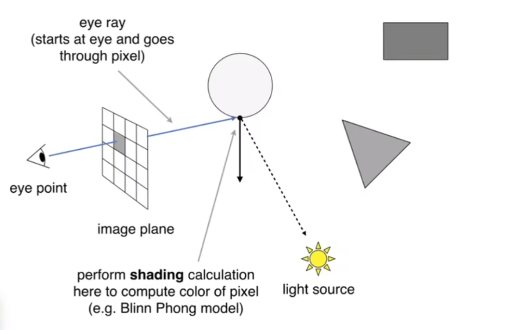

1. 从 眼睛中发出的光线 定义为 `eye ray` 也就是上图中蓝色的线
2. 光线 理论上会穿过多个物体，但是只记录碰撞最近的点，从另一种层面上解决了深度测试问题(最近的点肯定会遮挡后面的点)
3. 上图中 虚线 就是判断这个点会不会被光源照射到
4. 上图中 黑色实线 就是法线
5. 有了光源、入射方向、法线、出射方向就可以计算出这个点的颜色并写入到对应的像素点中

虽然通过上述方法可以得到跟光栅化相似的结果， **但是** 这里的光线只弹射了一次，但是光线实际上可以弹射多次

此处引入  Whitted-Style Ray Tracing(Whitted风格的光线追踪)

> Whitted 是个人名  
> 这个算法是个递归算法

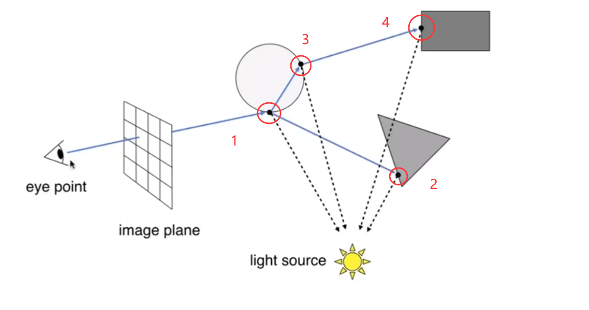

还是相同的情况，从 眼睛/相机 发射光线，假设 圆形 为玻璃球，光线经过玻璃球会发射折射

那么 点1 就是第一个碰撞点，这个点发生了发射了一次**折射**和一次**反射**，使光线碰撞到了 点2 和 点3， 点3 又发生了一次**折射**和一次**反射**，通过这一次 折射 使得光线碰撞到了 点4

点2、点3、点4对光线还可以做反射、折射，无线的做下去，Whitted-Style 做的就是将所有碰撞点都和光源做连线，计算**每个能被光源照亮点**的像素值，并且将所有计算出来的着色值**加到**那个对应的像素点上

当然每个点的着色值不是直接加起来，而是每个点的值都有不同的权重，因为要考虑到 折射/反射 时的能量损失

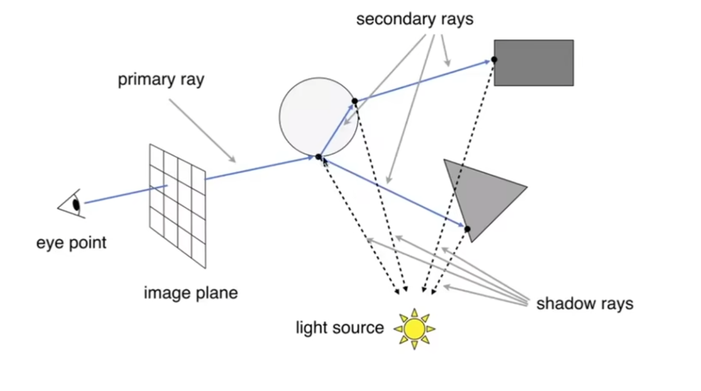

- 定义从 眼睛/相机 发出的光线为 `primary ray`
- 定义从 反射/折射 的光线为 `secondary rays`
- 定义从 碰撞点到光源的连线 为 `shadow rays`

### 光线追踪的交点 (Ray-Surface Intersection)

求光线和物体表面的交点

数学中的光线就是一个射线，有一个起点，有一个方向

假设起点坐标为 `o`, 方向向量为 `d`, 得到光线任一点的表达式 $ r(t) = o + t*d$ 其中 t 是 0 到 正无穷、

对于 **隐式表面**

假设现在要碰撞的是一个球，设球面上任意点的坐标为p，球心坐标为c，球的半径为R，得到球面的表达式 $(p - c)^2 - R^2 = 0$ 

那么联立光线和球的表达式可以求出交点 $(o + td - c)^2 - R^2 = 0$ 

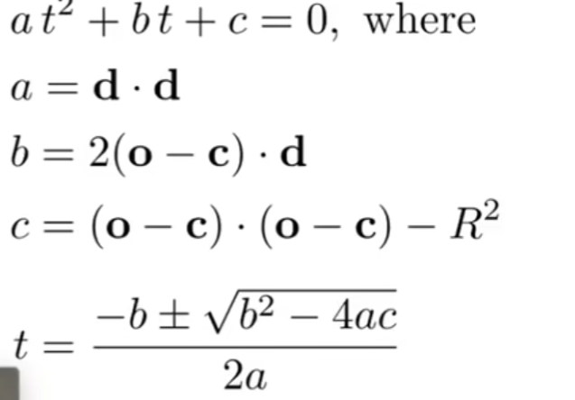

> t 要大于0 并且 不可是虚数
> 如果存在多个交点，取t较小值的交点，因为t越小离起点越近，t大的点会被t小的点挡住，没有使用意义

可以将 光线 与 球 交点的计算，推广到其他 隐式表面 的计算上

假设 隐式表面 的数学公式为 $f(p) = 0$ , 带入 光线 的公式得到交点 $f (o + t*d) = 0$

再 带入 上面说明的 t大于 0、 t不能为虚数、 多交点时取t小的点 就可以得到交点坐标

对于 **显式表面**

就是 光线 与 三角形 求交

知道如何计算 光线与三角形 求交，可以 计算交点、是否在阴影中等

通过计算还可以判断点是否在物体内部

> 以 需要判断点 的位置为起点，向 任意方向 发射射线，如果交点个数是偶数则表示点在物体外，如果交点个数为奇数则表示点在物体内
> 前提是 物体 一定得是封闭的

那么计算 光线 与 三角形 求交呢？

1. 先 计算 光线 与 三角形平面 的交点 (高中数学计算)
2. 然后 判断 交点 是否在 三角形内 (直接用叉乘做就行)

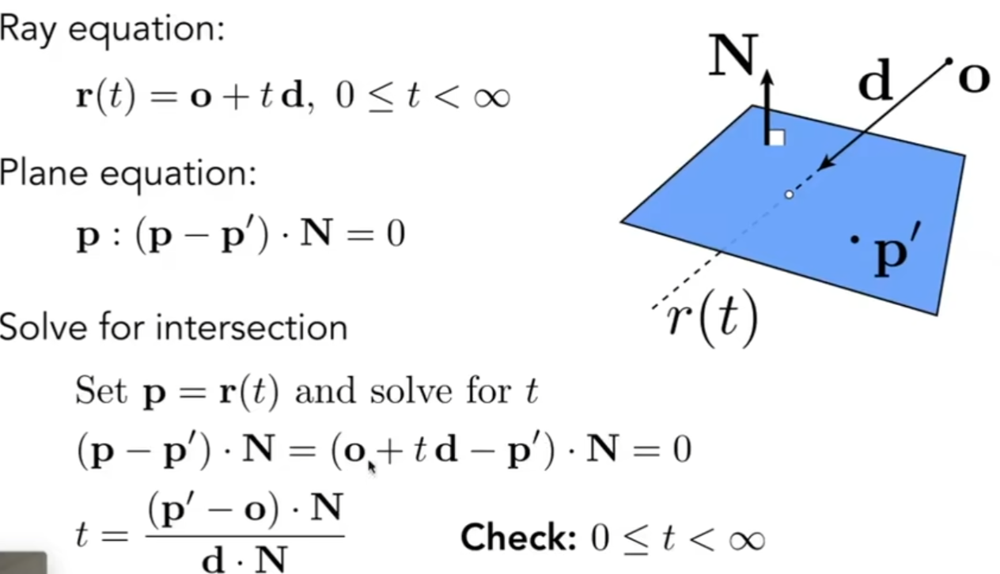

还有一个方法可以直接求出光线与三角形的交点，并且立刻判定交点是否在三角形内，那就是 `Moller Trumbore Algorithm`

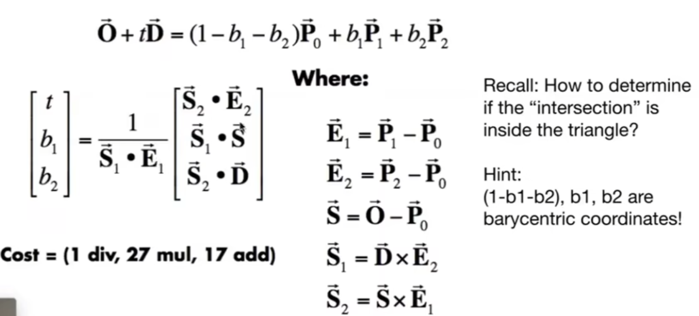

上图中 $P_0 P_1 P_2$ 分别是是三角形重心到三个顶点的向量

通过 $(1 - b_1 - b_2) * P_0 + b_1 * P_1 + b_2 * P_2$ 可以表示三角形中任意点的坐标

一个物体有很多个三角形，最简单暴力的做法就是交**依次对每个三角形求**，最后得出距离光线起点最近的点 也就是 t 最小的点

### 加速计算光线与物体表面的求交 (Accelerating Ray-Surface Intersection)

计算光照最暴力的做法，每个像素打出的光线都要与所有的物体，所有的三角形计算交点，并且光线每经过一次 反射/折射 都要计算新的光线与每个物体的三角形的交点

如果真的是上面这种暴力做法，计算效率就特别低

所以必须想办法提高渲染的效率

#### AABB

使用 **包围盒** / **包围体积** / `Bounding Volumes`


保证复杂物体一定在某个简单体积内

如果光线碰不到包围盒，那么盒子内的物体更不可能碰到

> 对应的表示方法可以是AABB表示

依旧以 $(o + td - c)^2 - R^2 = 0$ 为例

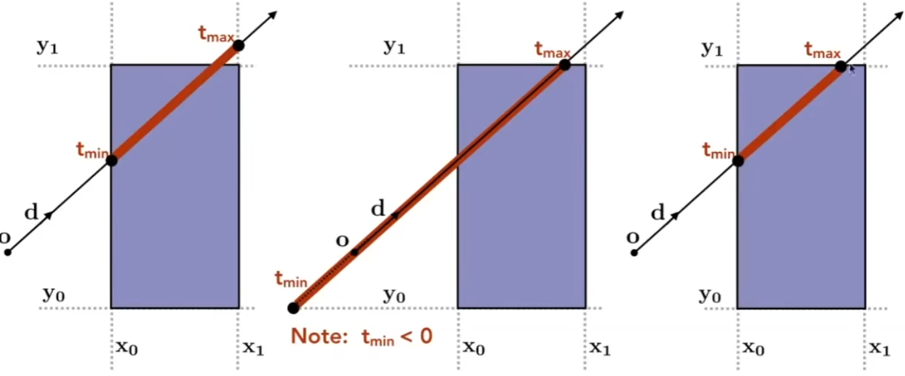

以二维平面为例

一般用 $Point_0 = (x_{0}, y_{0})$ 和 $Point_1 = (x_{1}, y_{1})$ 就可以表示一个二维平面的包围盒， ${Point_0}$ 表示 矩形 的左下角， ${Point_1}$ 表示矩形的 右上角，通过两点即可表示出一个矩形

- 上图中间得到 $t_{y_{min}}$ 和 $t_{y_{max}}$ 两个点，表示光线与包围盒y轴交点是t的值
- 上图左边得到 $t_{x_{min}}$ 和 $t_{x_{max}}$ 两个点，表示光线与包围盒x轴交点是t的值
- 那么在包围盒中的t值为 $t_{x_{min}}$ 和 $t_{y_{max}}$ 

通过求出 光线 与 x、y 平面相交的的时间，得出 $t_{enter} = min(t_{y_{min}}, t_{x_{min}})$ 和 $t_{quit} = max(t_{y_{max}}, t_{x_{max}})$

> $t_{quit}$  表示 光线 离开碰撞盒的t值  
> $t_{enter}$ 表示 光线 进入碰撞和的t值

于是将该理论发展到三维空间

$Point_0 = (x_{min}, y_{min}, z_{min})$ 和 $Point_1 = (x_{max}, y_{max}, z_{min})$ 可以表示一个三维空间的矩形范围

$t_{enter} = min(t_{x_{min}}, t_{y_{min}}, t_{z_{min}})$ 
$t_{quit} = max(t_{x_{max}}, t_{y_{max}}, t_{z_{max}})$

- 如果 ${t_{quit}}$ 小于 0，则表示 光线 与 碰撞体 不相交，因为 光线 离开碰撞盒子的 t 小于0， 则表示 碰撞盒 在光线的反方向
- $t_{enter}$ 小于0， ${t_{quit}}$ 大于0，则表示 光源 在碰撞盒 内部 
- 如果 $t_{enter}$ 小于 ${t_{quit}}$，并且 $t_{quit}$ 大于 0， 则表示 光线 与 碰撞盒 相交

# 动画模拟、仿真
