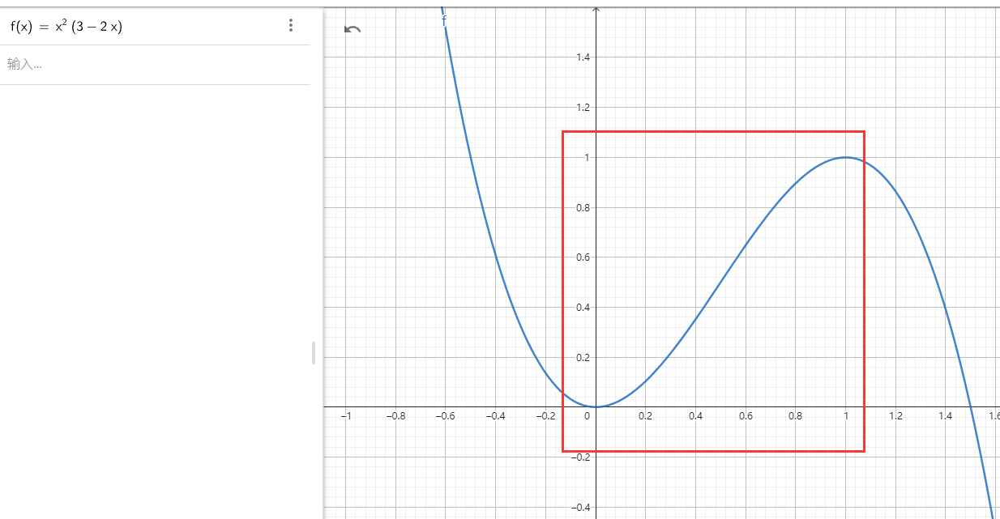
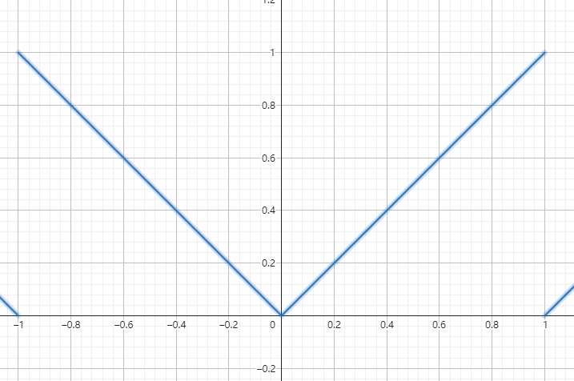
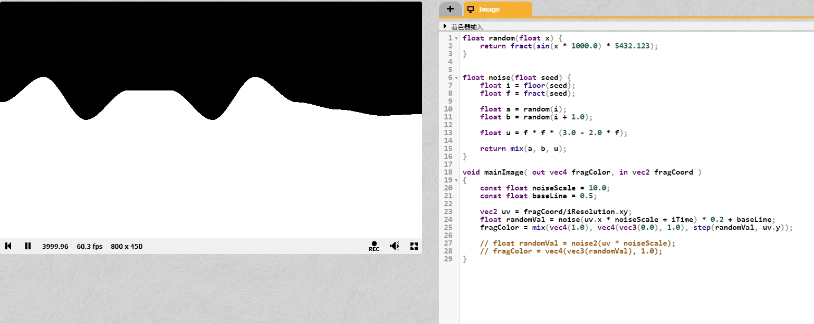
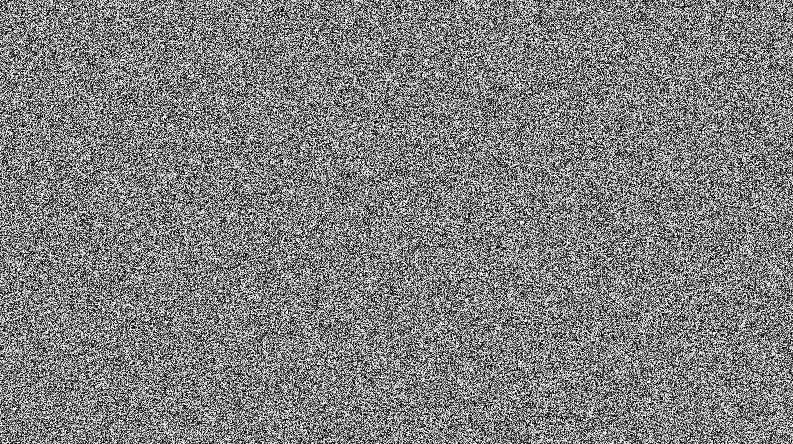
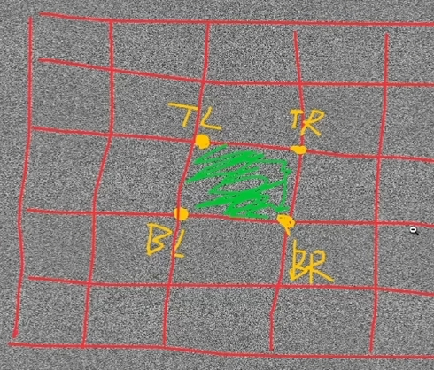
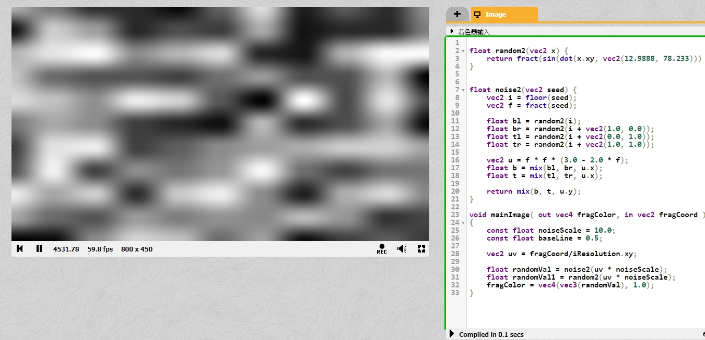
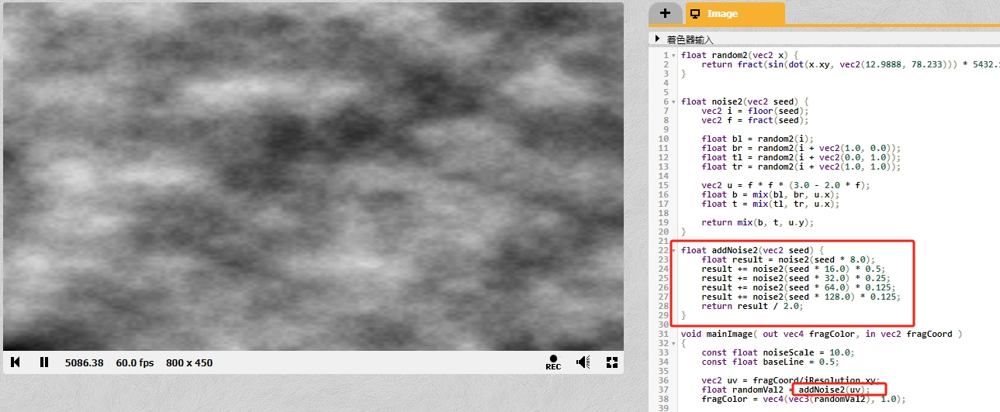
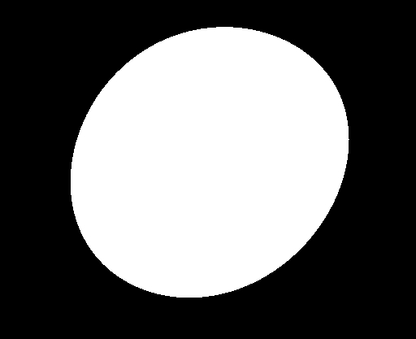
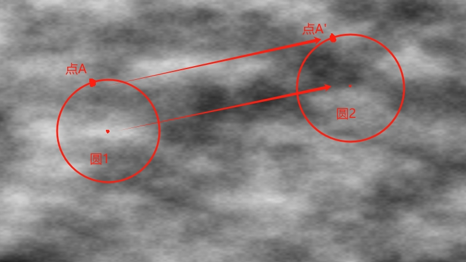

# Shader

[ShaderToy网址](https://www.shadertoy.com/)

## 噪音

[B站视频](https://www.bilibili.com/video/BV1Lr421g7SB)

噪音本质上是一个函数，输入一个参数，一般来说返回一个 **0 ~ 1** 之间的值

噪音函数要求随机性和确定性，随机性是值随机，确定是输入相同的参数会得到相同的结果

于是随便定义一个函数

```cpp
float random(float x) {
    return fract(sin(x * 100) * 5432.1234);
}
```

> `fract` 函数表示取小数点
> `x * 100` 和 `5432.1234` 是随便写的数值，主要是增加频率，来增加变化率


得到上图所示的一个图像，这个图像满足一定的随机性和确定性，但是有一个问题就是点与点之间的过度不够平滑

用噪声图生成河流山脉会要求过度平滑，所以噪声函数在输入的点之间也会要求平滑过度

| 平滑 | 不平滑 |
| --- | --- |
|  |  |

> 平滑函数 $y = x*x*(3 - 2*x)$

通过上面的平滑函数可以将两点之间数值的变化通过插值的方式平滑过度，虽然平滑函数在**小于0**和**大于1**之后函数取值会超过指定范围，但是在 **0~1** 区间是非常平滑的

并且在值为0和值为1的过度点也是平滑过度的，所以能够平滑的将多个区间连接起来

```cpp
float random(float x) {
    return fract(sin(x * 1000.0) * 5432.123);
}

float noise(float seed) {
    float i = floor(seed);
    float f = fract(seed);
    
    float a = random(i);
    float b = random(i + 1.0);
    
    float u = f * f * (3.0 - 2.0 * f);
    
    return mix(a, b, u);
}
```

> `mix` 线性插值函数

通过 `random(i)` 和 `random(i + 1)` 确定两点的 `y` 值

通过 `fract(seed)`  获取目标点 `seed` 在两点之间的比率，通过平滑函数计算差值

如果通过 `mix(a, b, f)` 计算得到的是曲线是一条直线

如果通过 `mix(a, b, u)` 计算得到的是一个光滑曲线



同理，将类似概念引入**二维**

```cpp
float random2(vec2 x) {
    return fract(sin(dot(x.xy, vec2(12.9888, 78.233))) * 5432.123);
}
```

> `vec2(12.9888, 78.233)` 是随便写的数值，主要是为了增加频率

这个时候可以得到一个过度非常生硬的噪声图



于是乎，也要使用平滑插值函数来

```cpp
float noise2(vec2 seed) {
    vec2 i = floor(seed);
    vec2 f = fract(seed);
    
    float bl = random2(i);
    float br = random2(i + vec2(1.0, 0.0));
    float tl = random2(i + vec2(0.0, 1.0));
    float tr = random2(i + vec2(1.0, 1.0));
    
    vec2 u = f * f * (3.0 - 2.0 * f);
    float b = mix(bl, br, u.x);
    float t = mix(tl, tr, u.x);
    
    return mix(b, t, u.y);
}
```

这里使用双线性插值来计算点真正的颜色



如上图所示

- `TL` 表示 `Top Left` 表示左上角
- `TR` 表示 `Top Right` 表示右上角
- `BL` 表示 `Bottom Left` 表示左下角
- `BR` 表示 `Bottom Right` 表示右下角

所以进行插值计算的时候 `mix(bl, br, u.x)` 和 `mix(tl, tr, u.x)` 都是对 `uv.x` 进行插值插值计算



通过一系列的计算，可以得到过度非常平滑的噪声图

> 上图代码中的 `noiseScale` 是为了提高噪音的频率，自行修改可知作用

还可以通过叠加多个噪声图的方式来得到新的噪音图

```cpp
float addNoise2(vec2 seed) {
    float result = noise2(seed * 8.0) * 1.0;
    result += noise2(seed * 16.0) * 0.5;
    result += noise2(seed * 32.0) * 0.25;
    result += noise2(seed * 64.0) * 0.125;
    result += noise2(seed * 128.0) * 0.125;
    return result / 2.0;
}
```

由于叠加多个噪音图，并且所有噪音图的权重合为 2，所以最后 `result` 要除以 2

用于 `addNoise2` 中已经乘以了噪音频率，所以传入参数时不用像之前一样乘以一个频率



使用上面的代码，可以尝试编写一个律动的圆



大致思路如下

在 `Shader` 中要绘制一个圆形很简单，计算点到圆形的距离，距离在指定范围内是圆形的颜色，否则是背景的颜色

在圆形中根据点的坐标可以计算圆心到点的**朝向**，要做出如上图所示的不规则的圆，只要每个**朝向**都加减一个数值即可

> 这里的朝向其实就是圆心到点的向量

也就是说圆心到每个朝向都有一个随机值，绘制圆形的时候，距离在**半径 + 随机值**之内的点是圆形的颜色



对于一个在**噪声图上的圆**来说，圆周之上每个点的过度都是平滑的

所以将**归一化的向量**(归一化保证相同方向上点的向量相同)在噪声图上计算出一个值，那么这个方向圆的半径是**半径+噪音值**，由于噪音图中点的过度是平滑，所以圆的连续方向上的半径过度也是平滑的

在**在噪声图上**从 **圆1** 移动到 **圆2** 过程中(也就是 **点A** 移动到 **点A'**)，点的过度也应该是平滑的，所以为了让圆律动起来，让圆心随着时间变化移动起来即可

```cpp
void mainImage( out vec4 fragColor, in vec2 fragCoord )
{
    vec4 bgColor = vec4(0.0, 0.0, 0.0, 1.0);
    vec4 circleColor = vec4(1.0, 1.0, 1.0, 1.0);

    const float radius = 0.5;
    const float changeRateFactor = 0.1;     // 噪音图上采样，数值越小越容易连续
    const float speedFactor = 1.0;          // 速度变化参数，采样中心点偏移速度
    const float radiusBuffer = 0.3;         // 噪声采样，值越大形变范围越大

    vec2 uv = fragCoord/iResolution.xy;        // 将屏幕坐标fragCoord转换为0到1的规范化坐标
    vec2 suv = uv * 2.0 - 1.0;                 // 将uv坐标缩放并平移到-1到1的范围内，使得原点位于屏幕中心
    suv.x *= iResolution.x / iResolution.y;    // 调整x坐标，考虑屏幕的宽高比，确保圆形不会变形
    
    vec2 dir = normalize(uv - vec2(0.0));
    float noiseValue = noise2(uv + dir * 0.1 + vec2(iTime) * 1.0);
    noiseValue *= 0.6;
    
    fragColor = mix(bgColor, circleColor, step(length(suv), radius + noiseValue));
}
```

> `length` 计算当前片段的坐标点到原点的距离
