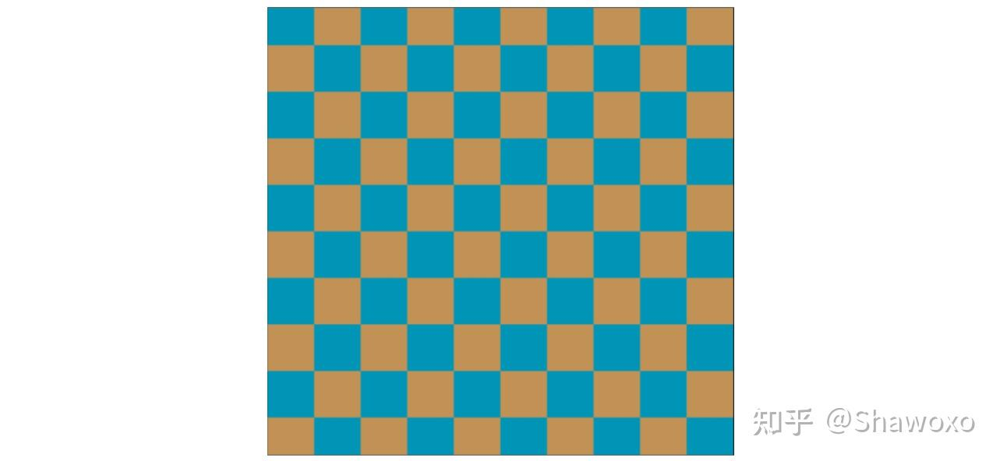
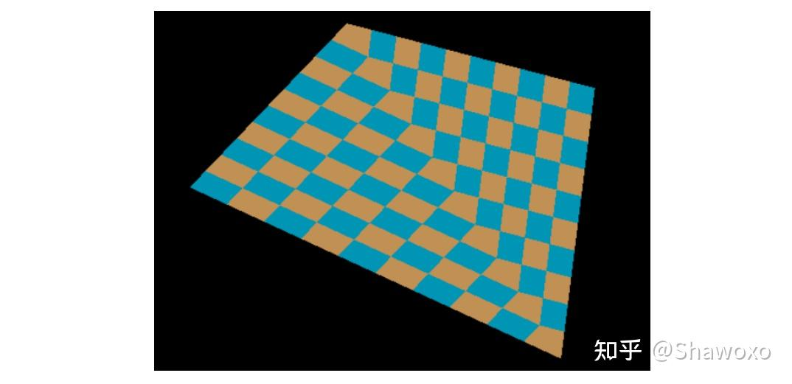
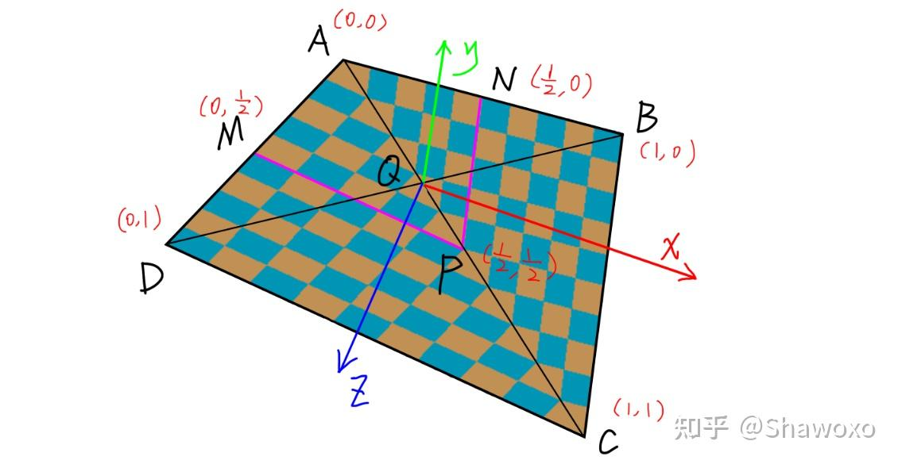
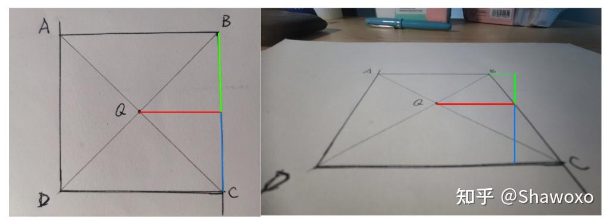
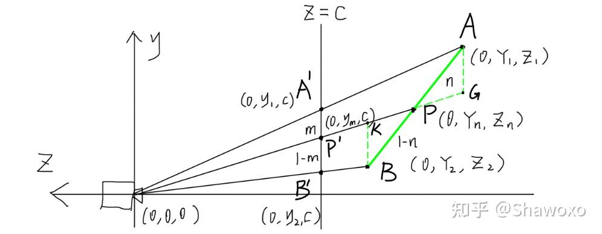

# TinyRenderer

[参考项目 tinyrenderer](https://github.com/ssloy/tinyrenderer)

## 光栅化

### 求重心

重心坐标 (α, β, γ) 表示点 P 可以表示为三角形三个顶点A、B、C的加权和：P = αA + βB + γC，其中 α + β + γ = 1

如果点P在三角形内部，则满足：0 ≤ α, β, γ ≤ 1

通过重心坐标，即可知道某个点是否在三角形内部

```
α·A_x + β·B_x + γ·C_x = P_x
α·A_y + β·B_y + γ·C_y = P_y
α + β + γ = 1
```

对应的矩阵表现形式是 

```
| A_x  B_x  C_x |   | α |   | P_x |
| A_y  B_y  C_y | × | β | = | P_y |
|  1    1    1  |   | γ |   |  1  |
```

设矩阵 M 为

```
    | A_x  B_x  C_x |
M = | A_y  B_y  C_y |
    |  1    1    1  |
```

需要求解的是向量 [α, β, γ]ᵀ ，使得： M × [α, β, γ]ᵀ = [P_x, P_y, 1]ᵀ

解为：[α, β, γ]ᵀ = M⁻¹ × [P_x, P_y, 1]ᵀ

```cpp
vec3 barycentric(const vec2 tri[3], const vec2 P) {
    mat<3,3> ABC = {{ {tri[0].x, tri[0].y, 1.}, {tri[1].x, tri[1].y, 1.}, {tri[2].x, tri[2].y, 1.} }};
    if (ABC.det()<1) return {-1,1,1}; 
    return ABC.invert_transpose() * vec3{P.x, P.y, 1.};
}
```

### 透视矫正

| 参考文章 | 链接 |
| --- | --- |
| 透视矫正插值 | https://zhuanlan.zhihu.com/p/403259571 |
| Perspective Correct Interpolation | https://www.cs.ucr.edu/~craigs/courses/2018-fall-cs-130/lectures/perspective-correct-interpolation.pdf |

| 贴图 | 渲染效果 |
| --- | --- |
|  |  |

示意图





由于透视的问题，明明 Q 点是 AC 中点；但是由于透视的存在，看起来 P 点才像是 AC 中点

在坐标点通过 MVP 矩阵变化到屏幕空间中，会将 P 点的 UV 坐标设置为 `(1/2, 1/2)`，最终导致显示问题

可以通过 **顶点的世界坐标** 和 **目标点的屏幕坐标**，计算得到目标点对应平面上的 **世界坐标**

首先考虑 **二维** 的情况，由简入繁



通过相似计算

$$
\frac{n}{1-n} = \frac{|AG|}{|BK|} = \frac{|A'P'| * \frac{Z_1}{c}}{|B'P'|\frac{Z_2}{c}} = \frac{m*Z_1}{(1-m)*Z_2} 
$$

对左右两边取倒

$$
\frac{1}{n} - 1 = \frac{(1-m)*Z_2}{m*Z_1} 
$$

$$
n = \frac{m*Z_1}{(1-m)*Z_2 + m*Z_1}
$$

由于 A'、B'、P' 都是已知的屏幕坐标点，所以可以很轻松的计算得到 m 的值，进而计算得到 n 的值

P 的坐标可以通过 P = (1-n) * A + n * B 得到，进而得到 P 的坐标计算公式

假设 A 点坐标为 (0, Y1, Z1) ，B 点坐标为 (0, Y2, Z2)

$$
Z_n = (1-n) * Z_1 + n * Z_2 
$$

$$
Z_n = \frac{(1-m) * Z_2}{(1-m)*Z_2 + m*Z_1} * Z_1 + \frac{m*Z_1}{(1-m)*Z_2 + m*Z_1} * Z_2
$$

$$
Z_n = \frac{1}{\frac{1-m}{Z_1} + \frac{m}{Z_2}}
$$

带入到三维场景中

$$
Z_n = \frac{1}{\frac{1-u-v}{Z_1} + \frac{u}{Z_2} + \frac{v}{Z_3}}
$$

u、v 满足 P = (1-u-v)*A + u*B + v*C


