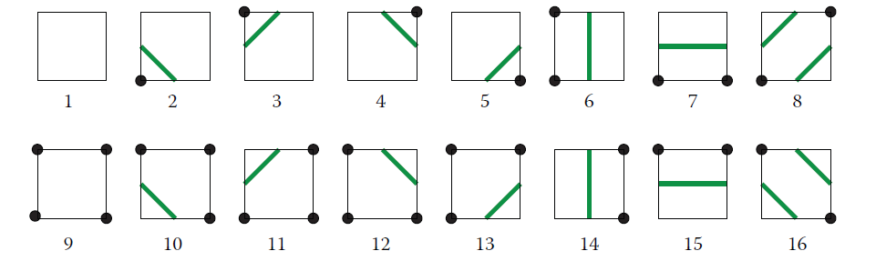
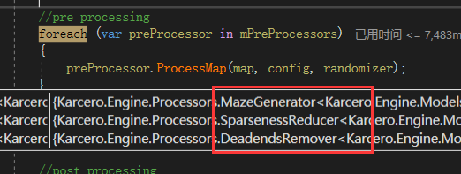

# 地图生成调研
* 死亡细胞地图生成
* https://www.jianshu.com/p/c276127d1125?
* https://ondrejnepozitek.github.io/Edgar-Unity/docs/examples/dead-cells/
* 基于 Marching Squares 实现地图生成
* 基于 Marching Cubes 实现地图生成
* 基于 wfc 的关卡生成：[波函数坍缩 地图生成-算法过程可视化（2D）](https://zhuanlan.zhihu.com/p/392919515)
* 基于 Cellular Automata 细胞自动机算法 实现地图生成：[indienova.com](https://indienova.com/indie-game-development/procedural-content-generation-tile-based-random-cave-map/)
* 地牢生成算法：[房间和迷宫:一个地牢生成算法 | indienova 独立游戏](https://indienova.com/indie-game-development/rooms-and-mazes-a-procedural-dungeon-generator/)
* 随机地牢算法：[Procedural Dungeon Generation Algorithm - 地牢程序生成算法 | indienova 独立游戏](https://indienova.com/indie-game-development/tinykeepdev-procedural-dungeon-generation-algorithm/)


## 柏林噪声
柏林噪声算法：[https://cloud.tencent.com/developer/article/1005578](https://cloud.tencent.com/developer/article/1005578)

柏林噪声算法：[https://zhuanlan.zhihu.com/p/206271895](https://zhuanlan.zhihu.com/p/206271895)

柏林噪声是一种自然噪声生成算法，可以用于生成具有连续性和一致性的随机数。柏林噪声可以应用于电子游戏、艺术、计算机图形学等领域，用于生成具有自然感的地形、纹理、云彩、火焰等效果。

柏林噪声的原理是在一个多维空间中，为每个整数点分配一个随机的**梯度向量**，然后对任意位置的点进行**插值运算**，得到该点的噪声值。柏林噪声可以根据维度的不同，分为一维、二维、三维等情况，也可以通过叠加不同频率和振幅的噪声，生成分形噪声，增加复杂度和多样性

1. 每个单位方块中随机的**点并不是真正的随机**，而是根据方块的坐标和一个哈希函数计算出来的，这样可以保证每次生成的噪声图是一致的
2. **梯度向量也不是完全随机**的，而是从一个预设的向量表中选取的，这样可以避免方向性的偏差

在柏林噪声中，为了保证每次生成的噪声图是一致的，方块内的点**不是真正随机的**，而是根据方块的坐标和一个哈希函数计算出来的。也就是说，给定一个方块的坐标（x,y），可以用一个哈希函数h(x,y)得到一个固定长度的数字，然后用这个数字作为随机数种子来生成方块内的点。这样做的好处是，只要方块的坐标不变，方块内的点也不会变，从而保证了噪声图的一致性。


计算梯度向量有两种方法，一种是随机生成一组梯度向量，并用一个排列表来索引它们，这样可以保证梯度向量的随机性和伪随机性。另一种是选择一组服从均匀分布的梯度向量，例如在二维情况下，在单位圆上对称地选择8个或16个向量，在三维情况下，在立方体中心点指向十二条边中心点的12个向量，这样可以减少方向性偏差


在柏林噪声中，并不需要真正地计算函数的偏导数，而是可以用一种伪随机的方法来生成一个随机的梯度向量，用于计算噪声值。这样做的好处是可以减少计算量，同时保证噪声的连续性和一致性。所以，grad 函数返回的向量并不一定是真正的梯度向量，而是一个随机生成的向量，它只是**借用**了梯度向量的名字和概念。

> 一般直接使用默认的 permutation 数组做梯度向量的排列表

为了保证过渡更加平滑，我们需要使用**插值计算**来优化效果，一般函数命名为 `Fade`

关于插值计算，最简单的肯定就是**线性插值**，它的计算最简单，但是效果比较差

$x = x_1 + t*(x_2-x_1)$

相对来说n次多项式更加平滑，常见的有三次多项式函数和五次多项式函数


$f(x) = 3x^2 - 2x^3$ 或者 $f(x) = 6x^5 - 15x^4 + 10x^3$


```Plain Text
double frequency;        // 噪声的频率
std::cin >> frequency;    
frequency = std::clamp(frequency, 0.1, 64.0);

std::int32_t octaves;    // 噪声的倍频数
std::cin >> octaves;
octaves = std::clamp(octaves, 1, 16);

std::uint32_t seed;    // 噪声的种子值
std::cin >> seed;

const siv::PerlinNoise perlin{ seed };
const double fx = (frequency / image.width());
const double fy = (frequency / image.height());

for (std::int32_t y = 0; y < image.height(); ++y)
{
    for (std::int32_t x = 0; x < image.width(); ++x)
    {
        const RGB color(perlin.octave2D_01((x * fx), (y * fy), octaves));
    }
}
```
```Plain Text
inline auto Octave2D(const Noise& noise, Float x, Float y, const std::int32_t octaves, const Float persistence) noexcept
{
    using value_type = Float;
    value_type result = 0;
    value_type amplitude = 1;

    for (std::int32_t i = 0; i < octaves; ++i)
    {
        result += (noise.noise2D(x, y) * amplitude);
        x *= 2;
        y *= 2;
        amplitude *= persistence;
    }

    return result;
}
```
通过外部设置 频率、振幅、叠加等参数，保证不同的参数得到的噪声图不同；又因为晶块内的随机点、顶点上的梯度向量是伪随机的，所以每次外部设置相同的参数，最后得到的噪声图总是相同的

```Plain Text
inline typename BasicPerlinNoise<Float>::value_type BasicPerlinNoise<Float>::noise3D(const value_type x, const value_type y, const value_type z) const noexcept
{
    const value_type _x = std::floor(x);
    const value_type _y = std::floor(y);
    const value_type _z = std::floor(z);

    const std::int32_t ix = static_cast<std::int32_t>(_x) & 255;
    const std::int32_t iy = static_cast<std::int32_t>(_y) & 255;
    const std::int32_t iz = static_cast<std::int32_t>(_z) & 255;

    const value_type fx = (x - _x);
    const value_type fy = (y - _y);
    const value_type fz = (z - _z);

    const value_type u = perlin_detail::Fade(fx);
    const value_type v = perlin_detail::Fade(fy);
    const value_type w = perlin_detail::Fade(fz);

    const std::uint8_t A = (m_permutation[ix & 255] + iy) & 255;
    const std::uint8_t B = (m_permutation[(ix + 1) & 255] + iy) & 255;

    const std::uint8_t AA = (m_permutation[A] + iz) & 255;
    const std::uint8_t AB = (m_permutation[(A + 1) & 255] + iz) & 255;

    const std::uint8_t BA = (m_permutation[B] + iz) & 255;
    const std::uint8_t BB = (m_permutation[(B + 1) & 255] + iz) & 255;

    const value_type p0 = perlin_detail::Grad(m_permutation[AA], fx, fy, fz);
    const value_type p1 = perlin_detail::Grad(m_permutation[BA], fx - 1, fy, fz);
    const value_type p2 = perlin_detail::Grad(m_permutation[AB], fx, fy - 1, fz);
    const value_type p3 = perlin_detail::Grad(m_permutation[BB], fx - 1, fy - 1, fz);
    const value_type p4 = perlin_detail::Grad(m_permutation[(AA + 1) & 255], fx, fy, fz - 1);
    const value_type p5 = perlin_detail::Grad(m_permutation[(BA + 1) & 255], fx - 1, fy, fz - 1);
    const value_type p6 = perlin_detail::Grad(m_permutation[(AB + 1) & 255], fx, fy - 1, fz - 1);
    const value_type p7 = perlin_detail::Grad(m_permutation[(BB + 1) & 255], fx - 1, fy - 1, fz - 1);

    const value_type q0 = perlin_detail::Lerp(p0, p1, u);
    const value_type q1 = perlin_detail::Lerp(p2, p3, u);
    const value_type q2 = perlin_detail::Lerp(p4, p5, u);
    const value_type q3 = perlin_detail::Lerp(p6, p7, u);

    const value_type r0 = perlin_detail::Lerp(q0, q1, v);
    const value_type r1 = perlin_detail::Lerp(q2, q3, v);

    return perlin_detail::Lerp(r0, r1, w);
}
```
> 柏林噪声的核心函数

> 上述代码是三维空间中的波粒噪声计算，对于二维空间的来说只需要对每个点都将z轴传入相同的值即可


针对上面的代码，有些一点要点需要注意

* 输入参数 (x, y, z) 就是晶格内的点，对x、y、z向下取整可以得到晶格的左下角顶点坐标，进而可以得到其他七个点的具体坐标
* 对 fx、fy、fz 进行 `Fade` 平滑操作分别得到 x、y、z 方向上的平滑插值 u、v、w
* `Fade` 平滑函数，使用的是 五次多项式 进行插值计算

```Plain Text
inline constexpr Float Fade(const Float t) noexcept
{
    return t * t * t * (t * (t * 6 - 15) + 10);
}
```
* `(m_permutation[ix & 255] + iy) & 255` 等操作只是一种简单的哈希运算，它可以使梯度向量在三维空间中均匀地分布在各个方向上，而不是偏向某些方向

> 这里的计算方法不是唯一的，也没有一个标准的选择方法，但是它对噪声的质量和效果也有一定的影响。一般来说，可以通过实验或者参考其他人的经验来选择合适的计算方法。

* `m_permutation` 在\_Ken Perlin\_的经典噪声算法中，使用的排列表是由数字0到255散列组成的

```Plain Text
m_permutation= { 
    151,160,137,91,90,15,
    131,13,201,95,96,53,194,233,7,225,140,36,103,30,69,142,8,99,37,240,21,10,23,
    190, 6,148,247,120,234,75,0,26,197,62,94,252,219,203,117,35,11,32,57,177,33,
    88,237,149,56,87,174,20,125,136,171,168, 68,175,74,165,71,134,139,48,27,166,
    77,146,158,231,83,111,229,122,60,211,133,230,220,105,92,41,55,46,245,40,244,
    102,143,54, 65,25,63,161, 1,216,80,73,209,76,132,187,208, 89,18,169,200,196,
    135,130,116,188,159,86,164,100,109,198,173,186, 3,64,52,217,226,250,124,123,
    5,202,38,147,118,126,255,82,85,212,207,206,59,227,47,16,58,17,182,189,28,42,
    223,183,170,213,119,248,152, 2,44,154,163, 70,221,153,101,155,167, 43,172,9,
    129,22,39,253, 19,98,108,110,79,113,224,232,178,185, 112,104,218,246,97,228,
    251,34,242,193,238,210,144,12,191,179,162,241, 81,51,145,235,249,14,239,107,
    49,192,214, 31,181,199,106,157,184, 84,204,176,115,121,50,45,127, 4,150,254,
    138,236,205,93,222,114,67,29,24,72,243,141,128,195,78,66,215,61,156,180
}
```
> 这个数组是一个哈希表，它是用来存储梯度向量的索引的。它的长度是 256，它的元素是 0 到 255 的整数，它的元素是随机排列的。它的作用是根据输入坐标的整数部分来查找一个随机的梯度向量的索引，然后根据这个索引来计算梯度向量和方向向量的点积，得到噪声值贡献大小。这个数组可以通过种子值来初始化，不同的种子值会得到不同的哈希表，从而得到不同的噪声。这个数组也可以通过其他的方法来生成，只要保证它的长度是 256，它的元素是 0 到 255 的整数，它的元素是随机排列的。这个数组也可以扩展到 512，这样可以避免一些边界问题

* `Grad` 梯度向量函数计算各个顶点对噪声值的空闲大小

```Plain Text
inline constexpr Float Grad(const std::uint8_t hash, const Float x, const Float y, const Float z) noexcept
{
    const std::uint8_t h = hash & 15;
    const Float u = h < 8 ? x : y;
    const Float v = h < 4 ? y : h == 12 || h == 14 ? x : z;
    return ((h & 1) == 0 ? u : -u) + ((h & 2) == 0 ? v : -v);
}
```
这样可以计算向量的点积，是因为这个函数并没有真正地生成梯度向量，而是用一种简化的方法来模拟梯度向量的方向和符号。具体来说，它根据哈希值的最低四位来选择梯度向量的分量 u 和 v，它们分别是 x、y、z 中的两个，然后根据哈希值的最低两位来决定梯度向量的符号，然后计算 u \* x + v \* y 或者 u \* x + v \* z，这样就相当于计算了梯度向量和方向向量的点积

* 最后对p0\~p8做了三线性插值


## Marching Squares
### 基本概念
https://blog.csdn.net/silangquan/article/details/47054309

Marching Squares 算法是一种用于生成二维标量场（矩形数组的数值）的等值线或等值带的算法

其计算流程如下

* 得到一个二维场


* 对场进行阈值处理，高于指定值得1，低于指定值得0。这里的指定值是4


* Marching Squares 提供16中点阵的情况



* 根据 Marching Squares 提供的16种点阵，结合已经经过阈值处理过的二维场，可以得到一个图像


* 最后在每个边缘上使用线性插值，计算等值线的坐标，并将其连接成一条曲线


### 代码
https://github.com/prides/MarchingSquares


上面项目虽然是 C# 写的 WPF项目，但是总体来说代码清楚、封装完善、命名规范，属于比较容易读懂的代码了

首先要读的就是 `MainWindow.xaml.cs` 文件，这个文件是整个程序运行的入口文件，包括 `start` 和 `update` 都从这里开始

```Plain Text
public void Update(float deltaTime)
{
    if (!mIsStarted)
    {
        this.Start();
    }
    if (!mIsAvailable) return;
    if (!mIsPaused)
    {
        if (null != mCircles)
        {
            foreach (BouncingCircle circle in mCircles)
            {
                circle.Update(deltaTime);
            }
        }
        if (null != mMarchingSquares)
        {
            foreach (List<MarchingSquareBase> msblist in mMarchingSquares)
            {
                foreach (MarchingSquareBase msb in msblist)
                {
                    msb.Update(deltaTime, mCircles);
                }
            }
        }
    }
}
```
> Update 函数做了两个事情：更新圆的坐标、更新二维数组中每个方格


```Plain Text
protected virtual double CalcPointValue(Point point, List<Circle> circles)
{
    double result = 0.0;
    double value;
    foreach (Circle circle in circles)
    {
        value = MS_Math.MarchingValue(point, circle.Position, circle.Radius);
        //if (value > result)
        //{
        result += value * (this.IsUseMultiplayer ? this.CurrentMultiplier : 1);
        //}
    }
    return result;
}

public override void Update(float deltaTime, List<Circle> circles)
{
    this.CurrentMultiplier += this.MultiplierStep;
    if ((this.CurrentMultiplier >= this.MaxMultiplier) || (this.CurrentMultiplier <= this.MinMultiplier))
            this.MultiplierStep *= -1;

    if (this.LT.ParentID == this.mId) this.LT.Force = CalcPointValue(this.LT.Coordinate, circles);
    if (this.RT.ParentID == this.mId) this.RT.Force = CalcPointValue(this.RT.Coordinate, circles);
    if (this.RB.ParentID == this.mId) this.RB.Force = CalcPointValue(this.RB.Coordinate, circles);
    if (this.LB.ParentID == this.mId) this.LB.Force = CalcPointValue(this.LB.Coordinate, circles);

    this.LineShape = this.defineShape();
}

private LineShapes defineShape()
{
    int value = 0;
    if (this.LT.Force >= FORCE)
    {
        value |= 8;
    }
    if (this.RT.Force >= FORCE)
    {
        value |= 4;
    }
    if (this.RB.Force >= FORCE)
    {
        value |= 2;
    }
    if (this.LB.Force >= FORCE)
    {
        value |= 1;
    }
    return (LineShapes)value;
}
```
通过 **CalcPointValue** 函数计算每个点的权重，权重的计算方法就是所有 **圆半径/点到圆心的距离** 的和

如果一个点在圆内，那么点的权重必定大于1；如果点不在圆内，但是点与多个圆的距离很近，那么点的权重也可以大于1；如果点不在圆内，并且点的权重不大于1，说明点没有任何贡献

通过上面的计算，可以得到每个方块对应16种类中的哪一种，那么接下来就是将所有连段连接起来了

```Plain Text
internal enum LineShapes
{
    Empty = 0,                 //  ○----○
                               //  |    |
                               //  |    |
                               //  ○----○

    BottomLeft = 1,            //  ○----○
                               //  |    |
                               //  |    |
                               //  ●----○

    BottomRight = 2,           //  ○----○
                               //  |    |
                               //  |    |
                               //  ○----●

    Bottom = 3,                //  ○----○
                               //  |    |
                               //  |    |
                               //  ●----●

    TopRight = 4,              //  ○----●
                               //  |    |
                               //  |    |
                               //  ○----○

    TopRightBottomLeft = 5,     //  ○----●
                                //  |    |
                                //  |    |
                                //  ●----○

    Right = 6,                  //  ○----●
                                //  |    |
                                //  |    |
                                //  ○----●

    AllButTopLeft = 7,          //  ○----●
                                //  |    |
                                //  |    |
                                //  ●----●

    TopLeft = 8,                //  ●----○
                                //  |    |
                                //  |    |
                                //  ○----○

    Left = 9,                   //  ●----○
                                //  |    |
                                //  |    |
                                //  ●----○

    TopLeftBottomRight = 10,    //  ●----○
                                //  |    |
                                //  |    |
                                //  ○----●

    AllButTopRight = 11,        //  ●----○
                                //  |    |
                                //  |    |
                                //  ●----●

    Top = 12,                   //  ●----●
                                //  |    |
                                //  |    |
                                //  ○----○

    AllButButtomRight = 13,     //  ●----●
                                //  |    |
                                //  |    |
                                //  ●----○

    AllButButtomLeft = 14,      //  ●----●
                                //  |    |
                                //  |    |
                                //  ○----●

    All = 15,                   //  ●----●
                                //  |    |
                                //  |    |
                                //  ●----●
}
```
```Plain Text
private void setLineCoordinatesPerPattern()
{
    //Line first  = (Line) this.mLines[0];
    //Line second = (Line) this.mLines[1];

    Line first = this.mFirst;
    Line second = this.mSecond;

    double x, y;

    switch (this.LineShape)
    {
        case LineShapes.All:
        case LineShapes.Empty:
            if (first.WinShape.Visibility != Visibility.Hidden) first.WinShape.Visibility = Visibility.Hidden;
            if (second.WinShape.Visibility != Visibility.Hidden) second.WinShape.Visibility = Visibility.Hidden;
            break;

        case LineShapes.BottomLeft:
        case LineShapes.AllButButtomLeft:
            if (first.WinShape.Visibility != Visibility.Visible) first.WinShape.Visibility = Visibility.Visible;
            this.interpolateVertical(this.LT, this.LB, out x, out y);
            first.setStart(x, y);
            this.interpolateHorisontal(this.LB, this.RB, out x, out y);
            first.setEnd(x, y);
            if (second.WinShape.Visibility != Visibility.Hidden) second.WinShape.Visibility = Visibility.Hidden;
            break;

        case LineShapes.BottomRight:
        case LineShapes.AllButButtomRight:
            if (first.WinShape.Visibility != Visibility.Visible) first.WinShape.Visibility = Visibility.Visible;
            this.interpolateHorisontal(this.LB, this.RB, out x, out y);
            first.setStart(x, y);
            this.interpolateVertical(this.RT, this.RB, out x, out y);
            first.setEnd(x, y);
            if (second.WinShape.Visibility != Visibility.Hidden) second.WinShape.Visibility = Visibility.Hidden;
            break;

        case LineShapes.Bottom:
        case LineShapes.Top:
            if (first.WinShape.Visibility != Visibility.Visible) first.WinShape.Visibility = Visibility.Visible;
            this.interpolateVertical(this.LT, this.LB, out x, out y);
            first.setStart(x, y);
            this.interpolateVertical(this.RT, this.RB, out x, out y);
            first.setEnd(x, y);
            if (second.WinShape.Visibility != Visibility.Hidden) second.WinShape.Visibility = Visibility.Hidden;
            break;

        case LineShapes.TopRight:
        case LineShapes.AllButTopRight:
            first.WinShape.Visibility = Visibility.Visible;
            this.interpolateHorisontal(this.LT, this.RT, out x, out y);
            first.setStart(x, y);
            this.interpolateVertical(this.RT, this.RB, out x, out y);
            first.setEnd(x, y);
            if (second.WinShape.Visibility != Visibility.Hidden) second.WinShape.Visibility = Visibility.Hidden;
            break;

        case LineShapes.TopRightBottomLeft:
            if (first.WinShape.Visibility != Visibility.Visible) first.WinShape.Visibility = Visibility.Visible;
            this.interpolateVertical(this.LT, this.LB, out x, out y);
            first.setStart(x, y);
            this.interpolateHorisontal(this.LT, this.RT, out x, out y);
            first.setEnd(x, y);

            if (second.WinShape.Visibility != Visibility.Visible) second.WinShape.Visibility = Visibility.Visible;
            this.interpolateHorisontal(this.LB, this.RB, out x, out y);
            second.setStart(x, y);
            this.interpolateVertical(this.RT, this.RB, out x, out y);
            second.setEnd(x, y);
            break;

        case LineShapes.Right:
        case LineShapes.Left:
            if (first.WinShape.Visibility != Visibility.Visible) first.WinShape.Visibility = Visibility.Visible;
            this.interpolateHorisontal(this.LT, this.RT, out x, out y);
            first.setStart(x, y);
            this.interpolateHorisontal(this.LB, this.RB, out x, out y);
            first.setEnd(x, y);
            if (second.WinShape.Visibility != Visibility.Hidden) second.WinShape.Visibility = Visibility.Hidden;
            break;

        case LineShapes.AllButTopLeft:
        case LineShapes.TopLeft:
            if (first.WinShape.Visibility != Visibility.Visible) first.WinShape.Visibility = Visibility.Visible;
            this.interpolateVertical(this.LT, this.LB, out x, out y);
            first.setStart(x, y);
            this.interpolateHorisontal(this.LT, this.RT, out x, out y);
            first.setEnd(x, y);
            if (second.WinShape.Visibility != Visibility.Hidden) second.WinShape.Visibility = Visibility.Hidden;
            break;

        case LineShapes.TopLeftBottomRight:
            if (first.WinShape.Visibility != Visibility.Visible) first.WinShape.Visibility = Visibility.Visible;
            this.interpolateVertical(this.LT, this.LB, out x, out y);
            first.setStart(x, y);
            this.interpolateHorisontal(this.LB, this.RB, out x, out y);
            first.setEnd(x, y);

            if (second.WinShape.Visibility != Visibility.Visible) second.WinShape.Visibility = Visibility.Visible;
            this.interpolateHorisontal(this.LT, this.RT, out x, out y);
            second.setStart(x, y);
            this.interpolateVertical(this.RT, this.RB, out x, out y);
            second.setEnd(x, y);
            break;

        default:
            if (first.WinShape.Visibility != Visibility.Hidden) first.WinShape.Visibility = Visibility.Hidden;
            if (second.WinShape.Visibility != Visibility.Hidden) second.WinShape.Visibility = Visibility.Hidden;
            break;
    }
}
```
枚举16种类型对应的情况，分别使用 `interpolateHorisontal` 和 `interpolateHorisontal` 对边上的点进行插值计算，使连接更加均匀平滑


上面左图使用了插值计算，上述右图没有使用插值计算


### 地图生成
Unity中使用 Marching Squares：[https://zhuanlan.zhihu.com/p/632230371](https://zhuanlan.zhihu.com/p/632230371)

Unity中使用 Marching Squares：[https://www.bilibili.com/video/BV1aY4y1x73j](https://www.bilibili.com/video/BV1aY4y1x73j)

Marching Squares 算法与柏林噪声搭配使用 随机地图生成

* 首先，使用柏林噪声生成一个二维的标量场，它表示地图上每个位置的高度或者其他属性。
* 然后，定义一个阈值，它表示地图上的分界线，例如海平面或者其他特征。
* 接着，使用 Marching Squares 算法对标量场进行遍历，找出每个 2x2 的单元格中高度大于或小于阈值的点，并根据它们的组合计算出分界线在单元格中的形状和位置。
* 最后，使用分界线的信息来绘制地图的轮廓或者填充颜色，从而生成地图。


在线试玩项目：[https://craigsidcarlson.github.io/marchingSquares/](https://craigsidcarlson.github.io/marchingSquares/)

### 其他应用
其他使用 Marching Squares：[https://jamie-wong.com/2014/08/19/metaballs-and-marching-squares/](https://jamie-wong.com/2014/08/19/metaballs-and-marching-squares/)

* 在图像处理中提取轮廓或边缘


* 在地形图或气象图上绘制等高线或等压线


## Marching Cubes
### 基本概念


* 首先一个 Cube 方块有8个顶点，每个顶点有两种状态(选中/未选中)，所以会出现 \$\$2^8 = 256\$\$种情况
* 然后由于点阵反转后的图像也是相同的，所以可以缩减为 \$\$256 / 2 = 128\$\$ 种情况
* 再然后方块可以通过旋转得到相同的状态，一个方块状态通过旋转可以得到8种状态，所以可以缩减到 \$\$128 / 8= 16\$\$ 种状况
* 最后一种 GPT 说是通过镜像对称可以处理，emmm 我不太懂


[\[U3D\]基于MarchingCubes实现的War3Editor 地表/悬崖编辑器](https://zhuanlan.zhihu.com/p/78875252)

Demo：[Brick Block - by Oskar Stålberg](https://oskarstalberg.com/game/house/index.html)

[【双语】游戏编程挑战：生成无边的水下世界 体绘制算法 | Coding Adventure: Marching Cubes\_哔哩哔哩\_bilibili](https://www.bilibili.com/video/BV1yJ411r73v)


## Karcero 算法
项目仓库：[GitHub - odedw/karcero: Procedural dungeon tile based map generator.](https://github.com/odedw/karcero)





### 基本概念
算法逻辑都在 `Karcero.Engine` 项目中，项目的起点是 `DungeonGenerator` 类

```Plain Text
public DungeonGenerator()
{
    mPreProcessors = new List<IMapPreProcessor<BinaryCell>>()
    {
        new MazeGenerator<BinaryCell>(),
        new SparsenessReducer<BinaryCell>(),
        new DeadendsRemover<BinaryCell>()
      };

    mMapConverter = new MapDoubler<T, BinaryCell>();

    mPostProcessors = new List<IMapProcessor<T>>()
    {
        new RoomGenerator<T>(),
        new DoorGenerator<T>()
    };
}
```
所以执行顺序已经很明显了 `MazeGenerator`、`SparsenessReducer` 、`DeadendsRemover` ，然后再通过`RoomGenerator`、`DoorGenerator` 生成房间和门

#### 走道生成
走道生成的代码内容在 `MazeGenerator` 类中，用于生成一段曲折度可配置的路径通道


```Plain Text
public void ProcessMap(Map<T> map, DungeonConfiguration configuration, IRandomizer randomizer)
{
    var visitedCells = new HashSet<T>();
    var visitedValidCells = new HashSet<T>();
    Direction? previousDirection = null;
    var currentCell = randomizer.GetRandomCell(map);
    currentCell.IsOpen = true;
    while (visitedCells.Count < map.Width * map.Height)
    {
        var oldCell = currentCell;
        var changed = false;
        visitedCells.Add(currentCell);
        visitedValidCells.Add(currentCell);

        var direction = GetRandomValidDirection(map, currentCell, visitedCells, configuration.Randomness, previousDirection, randomizer);
        if (direction.HasValue)
        {
            // 当前格子有效 从当前格子为起点随机下一个格子的位置
            changed = !currentCell.Sides[direction.Value];
            currentCell = map.GetAdjacentCell(currentCell, direction.Value);
            currentCell.Sides[direction.Value.Opposite()] = oldCell.Sides[direction.Value] = true;
            previousDirection = direction;
        }
        else
        {
            // 从已经访问的有效格子中随机一个继续处理
            visitedValidCells.Remove(currentCell);
            currentCell = randomizer.GetRandomItem(visitedValidCells);
        }
        if (currentCell.IsOpen && !changed) continue;

        currentCell.IsOpen = true;
    }
}
```
核心通道生成的核心代码，通过该函数可以生成一段曲折度可配置的路径通道

```Plain Text
private Direction? GetRandomValidDirection(Map<T> map, T cell, ICollection<T> visitedCells, double randomness, Direction? previousDirection, IRandomizer randomizer)
{
    //Randomness determines how often the direction of a corridor changes
    if (previousDirection.HasValue &&
        randomness < 1 &&
        randomizer.GetRandomDouble() > randomness &&
        IsDirectionValid(map, cell, previousDirection.Value, visitedCells))
    {
        return previousDirection;
    }

    var invalidDirections = new List<Direction>();
    while (invalidDirections.Count < GetAll.ValuesOf<Direction>().Count())
    {
        var direction = randomizer.GetRandomEnumValue(invalidDirections);
        if (IsDirectionValid(map, cell, direction, visitedCells))
        {
            return direction;
        }
        invalidDirections.Add(direction);
    }
    return null;
}
```
* Map： 整个 n\*m 个大小的格子
* Cell： 当前处理的格子
* visitedCells：已经遍历过的格子的集合
* randomness：配置表 configuration.Randomness 属性字段，用于配置路径的曲折度，值越小则通道更直，反之有更多的转折点 **randomizer.GetRandomDouble() > randomness**

* previousDirection：上一次随机的方向
* randomizer：用于随机的工具类

根据 **随机值<曲折度配置值** + **上一次方向有效性** 来判断是否继续沿着上一次的方向设定格子，这里也是曲折度配置值的使用位置

```Plain Text
private bool IsDirectionValid(Map<T> map, T cell, Direction direction, ICollection<T> visitedCells)
{
    T adjacentCell;
    return map.TryGetAdjacentCell(cell, direction, out adjacentCell) && !visitedCells.Contains(adjacentCell);
}
```
* 判断格子 + 方向是否有效的函数，当前格子的下一个方向上是否有格子、该格子是否没有访问过，当下一个格子同时满足时才有效


#### 调整地图稀疏度
地图中未被使用（或者说是空白）的区域，这些区域在视觉上可能会使迷宫看起来比较“稀疏”，这就是稀疏度。地图的稀疏度是放在 `SparsenessReducer` 中控制的

稀疏度可以通过 `Configuration.Sparseness` 来进行配置

```Plain Text
var cellsToRemove = (int) (map.Width*map.Height*configuration.Sparseness);
while (cellsToRemove != 0)
{
    //Look at every cell in the maze grid. If the given cell contains a corridor that exits the cell in only one direction 
    //"erase" that cell by removing the corridor
    var changedCells = new HashSet<T>();

    var deadEndCells = map.AllCells.Where(cell => cell.Sides.Values.Count(side => side) == 1).ToList();
    if (!deadEndCells.Any()) break;
    foreach (var deadEndCell in deadEndCells)
    {
        deadEndCell.IsOpen = false;
        var openDirection = deadEndCell.Sides.First(pair => pair.Value).Key;
        deadEndCell.Sides[openDirection] = false;
        var oppositeCell = map.GetAdjacentCell(deadEndCell, openDirection);
        oppositeCell.Sides[openDirection.Opposite()] = false;
        changedCells.Add(deadEndCell);
        changedCells.Add(oppositeCell);
        cellsToRemove--;
        if (cellsToRemove == 0) break;
    }
    //Repeat step #1 sparseness times
}
```
`cellsToRemove` 是根据配置的稀疏度来计算需要删除多少个方块

比较重要的是 `map.AllCells.Where(cell => cell.Sides.Values.Count(side => side) == 1)` 代码，用于计算一个单元格有多少个打开的侧面（出口），如果一个单元格只有一个打开的侧面，那么它就是一个死胡同单元格。通过这个方法找到地图中所有的死胡同格子

遍历所有死胡同的方块，将其从地图中删除，并且更新相邻方块的信息。当做完上述步骤之后，判断删除格子的数量是否达标，未达标则继续从地图中查找死胡同，重复上述删除步骤


#### 控制死胡同数量


进入死胡同往往意味着需要回头，这可能会降低游戏的体验，这里 `DeadendsRemover` 的处理方法是通过连接相邻方块的方法来消除死胡同的

```Plain Text
private Direction? GetRandomValidDirection(Map<T> map, T currentCell, T previousCell, IRandomizer randomizer)
{
    var invalidDirections = new List<Direction>();
    var squareDirections = new List<Direction>();
    while (invalidDirections.Count + squareDirections.Count < GetAll.ValuesOf<Direction>().Count())
    {
        var direction = randomizer.GetRandomEnumValue(invalidDirections.Union(squareDirections));
        if (IsDirectionValid(map, currentCell, direction, previousCell))
        {
            var nextCell = map.GetAdjacentCell(currentCell, direction);

            //Try to avoid creating squares, but do it if there's no other way
            if (nextCell.IsOpen &&
                ((nextCell.Sides[direction.Rotate()] &&
                  currentCell.Sides[direction.Rotate()]) ||
                 (nextCell.Sides[direction.Rotate(false)] &&
                  currentCell.Sides[direction.Rotate(false)])))
            {
                squareDirections.Add(direction);
            }
            else
            {
                return direction;
            }
        }
        else
        {
            invalidDirections.Add(direction);
        }
    }
    return squareDirections.Any() ? randomizer.GetRandomItem(squareDirections) : (Direction?)null;
}
```
这个辅助方法的作用是获取一个随机的有效方向。一个有效的方向是指这个方向上的单元格没有被访问过，且不会形成一个正方形的路径（为了避免生成过于规则的迷宫）。如果无法找到有效的方向，它将返回 `null`

如果随机的方向不是有效值，则方向会被添加到 `invalidDirections` 中；如果随机的方向会形成正方形，则添加到`squareDirections`中。每次通过 `randomizer.GetRandomEnumValue(invalidDirections.Union (squareDirections))` 来随机即不在 `invalidDirections` 也不在`squareDirections`中的方向枚举

> DeadendsRemover 会先考虑连接没有Open的方块，再考虑连接成正方形的方块

```Plain Text
public void ProcessMap(Map<T> map, DungeonConfiguration configuration, IRandomizer randomizer)
{
    var deadends = map.AllCells.Where(cell => cell.Sides.Values.Count(type => type) == 1).ToList();
    foreach (var cell in deadends)
    {
        if (randomizer.GetRandomDouble() > configuration.ChanceToRemoveDeadends) continue;

        var currentCell = cell;
        var previousCell = map.GetAdjacentCell(cell, cell.Sides.First(pair => pair.Value).Key);
        var connected = false;
        while (!connected)
        {
            var direction = GetRandomValidDirection(map, currentCell, previousCell, randomizer);
            if (!direction.HasValue) break;

            var adjacentCell = map.GetAdjacentCell(currentCell, direction.Value);
            connected = adjacentCell.IsOpen;
            adjacentCell.IsOpen = true;
            currentCell.Sides[direction.Value] = adjacentCell.Sides[direction.Value.Opposite()] = true;
            previousCell = currentCell;
            currentCell = adjacentCell;
        }
    }
}
```
* 对于每个死胡同单元格，找出一个随机的有效方向，并将当前单元格沿着这个方向连接到相邻的单元格。如果找不到有效的方向，就跳过这个单元格。
* 如果相邻的单元格已经被打开（即，它已经是通道或房间的一部分），那么就将当前单元格和相邻的单元格连接起来，然后继续处理下一个死胡同单元格。
* 如果相邻的单元格没有被打开，那么就将它打开，并将当前单元格设为这个新的单元格，然后继续寻找新的有效方向。

`DeadendsRemover` 完全可能将`SparsenessReducer` 删除的方块重新添加回来，用来处理死胡同的问题

#### 生成房间
`RoomGenerator` 类的主要作用是在迷宫地图上生成房间

```Plain Text
public void ProcessMap(Map<T> map, DungeonConfiguration configuration, IRandomizer randomizer)
{
    var validSizes = GetAllPossibleRoomSizes(configuration);
    for (var i = 0; i < configuration.RoomCount; i++)
    {
        //Generate a room such that Wmin <= Rw <= Wmax and Hmin <= Rh <= Hmax. 
        var room = CreateRoom(randomizer, validSizes);
        if (room == null) break;
        var visitedCells = new HashSet<T>();
        var unvisitedCells = new HashSet<T>(map.AllCells);
        var roomPlaced = false;

        while (visitedCells.Count < map.Height * map.Width)
        {
            //get a random cell
            var cell = randomizer.GetRandomItem(unvisitedCells);
            visitedCells.Add(cell);
            unvisitedCells.Remove(cell);

            //place the room
            room.Row = cell.Row;
            room.Column = cell.Column;
            if (room.Column <= 0 || room.Right >= map.Width || room.Row <= 0 || room.Bottom >= map.Height) continue; //out of bounds

            var cells = map.GetRoomCells(room).ToList();

            //don't place room where it is overlapping another room
            if (cells.Any(c => map.IsLocationInRoom(c.Row, c.Column))) continue;

            //don't place room where it is adjacent to another room
            if (map.GetCellsAdjacentToRoom(room).Any(c => map.IsLocationInRoom(c.Row, c.Column))) continue;

            //corners are rock
            if (!AreAllCornerCellsRocks(map, room)) continue; //NW corner

            //all corridors leading into room can become doors (are isolated)
            if (!CanAllCorridorsLeadingToRoomBeDoors(map, room)) continue;

            PlaceRoom(map, room);
            roomPlaced = true;
            break;
        }

        if (!roomPlaced)
        {
            validSizes.Remove(room.Size);
        }
    }
}
```
首先使用 `GetAllPossibleRoomSizes` 获得所有可能的房间大小

```Plain Text
private static HashSet<Size> GetAllPossibleRoomSizes(DungeonConfiguration configuration)
{
    var sizes = new HashSet<Size>();
    for (int i = configuration.MinRoomHeight; i <= configuration.MaxRoomHeight; i++)
    {
        for (int j = configuration.MinRoomWidth; j <= configuration.MaxRoomWidth; j++)
        {
            sizes.Add(new Size(j, i));
        }
    }
    return sizes;
}
```
然后根据 `configuration.RoomCount` 的配置，循环指定次数来尝试创建房间，创建出来的房间需要满足几个条件

1. 不能与其他房间重叠 `cells.Any(c => map.IsLocationInRoom(c.Row, c.Column))`
2. 不能与其他房间相邻 `map.GetCellsAdjacentToRoom(room).Any(c => map.IsLocationInRoom(c.Row, c.Column))`
3. `CanAllCorridorsLeadingToRoomBeDoors` 检查所有通向房间的走廊（即房间的边界）是否可以变为门。虽然一个房间通常只需要一个门，但是检查所有通向房间的走廊是否可以变为门可以提供更大的灵活性和复杂性，也可以增加迷宫的安全性

#### 生成门
通过 `DoorGenerator` 可以生成连接房间和走道的门，生成门的查找算法也很简单

1. 查找所有独立的 Room，也就是没有任何走道连接的 Room，通过 `ConnectRoom` 去连接Room 和 走道
2. 对于非独立的Room，查找与房间相邻、可以通行且周围没有门的单元格，将其设置为 Door 即可

```Plain Text
public void ProcessMap(Map<T> map, DungeonConfiguration configuration, IRandomizer randomizer)
{
    var isolatedRooms = map.Rooms.Where(room => map.GetCellsAdjacentToRoom(room).All(cell => cell.Terrain == TerrainType.Rock)).ToList();
    foreach (var room in map.Rooms)
    {
        if (isolatedRooms.Contains(room))
        {
            ConnectRoom(map, randomizer, room, isolatedRooms);
        }
        //place doors
        foreach (var cell in map.GetCellsAdjacentToRoom(room)
            .Where(cell => cell.Terrain == TerrainType.Floor &&
                map.GetAllAdjacentCells(cell).All(c => c.Terrain != TerrainType.Door)))
        {
            //don't place a door if it leads to nowhere
            if (map.GetAllAdjacentCells(cell).Count(c => c.Terrain == TerrainType.Floor) == 1) continue;

            cell.Terrain = TerrainType.Door;
        }
    }
}
```
### 算法修改
地牢生成算法：[房间和迷宫:一个地牢生成算法 | indienova 独立游戏](https://indienova.com/indie-game-development/rooms-and-mazes-a-procedural-dungeon-generator/)

这篇文章的作者基于 Karcero 算法，做了一点点小小的修改。因为他发现最后生成房间的步骤非常缓慢，于是他反其道而行之，先生成房间，然后通过 **洪水填充** 算法去生成路径

1. 生成房间


2. 填充路径


3. 寻找连接


这一部分是关于如何使用生成树连接所有房间的。生成树是一种特殊的图，它包含了图中的所有顶点，但没有形成环路。文章中的算法是这样的：

* 首先，将所有房间看作是图中的顶点，将所有迷宫区域看作是图中的边。
* 然后，随机选择一个房间作为根节点，将它加入到生成树中。
* 接着，从生成树中的任意一个房间开始，沿着迷宫区域向外探索，直到遇到另一个房间或者到达边界。
* 如果遇到了另一个房间，那么就将这个房间和之前的房间用迷宫区域连接起来，并将这个房间加入到生成树中。
* 如果到达了边界，那么就回退到上一个房间，继续探索其他方向。
* 重复步骤 3 到 5，直到所有房间都被加入到生成树中。

4. 去除死胡同


## WFC
在线实例：[Wave - by Oskar Stålberg](https://oskarstalberg.com/game/wave/wave.html)

简单UE插件：https://github.com/NiceTry12138/WFC2D

### 基本概念
什么是**波函数坍塌**？

众所周知，薛定谔的猫有俩中状态：死或生，只有打开了匣子才能确定猫的状态。这个确定猫状态的过程，就是波函数坍塌。所以名字听起来高大上，其实就是确定状态。地图中一个方块有很多种可能，当我确定这个方块的类型，就可以说是波函数坍塌了


什么是**熵**？

熵是热力学的表示物质状态的参量,它的物理意义表示物质的混乱程度,熵越大,说明物质越混乱,熵越小,说明物质越稳定。所以当一个物质从叠加态坍缩到某一个状态时,熵减,反之则熵增

> 每个坐标位置都有一个对应的熵值，它**可以**等于该位置可能的瓦片数量


以座位为例，孵化中心客户端30个人，项目组的人想坐在一起，那么我坐在座位上，我作为周围8个方向上必须是我项目组的人。总觉为wfc中的说法就是，我当前座位的状态已经坍塌，状态就是我，我周围8个方向座位有未坍塌，有n中可能(n就是项目组人数减一)。不过一般来说对于方块的约束条件是某个方向必须是哪些状态，这样的话确定了一个方块的状态，就可以同时减少另一个方块的状态。

像上面座位安排这种，方块与方块之间的关系，称之为**约束规则**。

实际上我们可以建立更复杂的相邻布局约束，比如说以方格的周围不仅上下左右，还有对角线上的4个点，总共八个点建立约束条件，甚至是上下左右四个点的上下左右总共12个点。不过本文只会探讨受上下左右四个点约束的情况

像上面座位安排这种，确定了某个座位的状态（坍缩）之后，加上前面的约束规则，就可以对其他的座位的可选对象集合进行处理，这就是**传播**

如果在传播的过程中，某个位置只有一种选择，但是该选择破坏了其他位置的约束规则，那么需要**回溯**到上个座位重新选择状态，直到最后所有的座位都坍缩完毕


### 代码解读
比较好懂的代码实例：[GitHub - CedricGuillemet/WaveFunctionCollapse: Simple C++ implementation of Wave Function Collapse](https://github.com/CedricGuillemet/WaveFunctionCollapse)

这个 Demo 项目，只提供了**坍缩**和**传播**两个模块，并没有提供**回溯**的功能，实际使用的时候需要记录状态来完成回溯的

```Plain Text
static const int tileCount = 6;
Tile mTiles[tileCount] = {
        {' ',{2,2,2,2}},
        {'X',{1,1,1,1}},
        {'-',{1,2,1,1}},
        {'-',{1,1,1,2}},
        {'|',{2,1,1,1}},
        {'|',{1,1,2,1}},
};
int GetAngle(Coord dir)
{
    if (dir.x == 1)
        return 0;
    if (dir.y == 1)
        return 1;
    if (dir.x == -1)
        return 2;
    if (dir.y == -1)
        return 3;
    assert(0);
    return -1;
}

int GetHook(Coord dir)
{
    if (dir.x == 1)
        return 2;
    if (dir.y == 1)
        return 3;
    if (dir.x == -1)
        return 0;
    if (dir.y == -1)
        return 1;
    assert(0);
    return -1;
}

bool TileCompatible(int tileIndex1, int tileIndex2, Coord dir)
{
    int key1 = mTiles[tileIndex1].mKeys[GetAngle(dir)];
    int key2 = mTiles[tileIndex2].mKeys[GetHook(dir)];
    return (key1 & key2) != 0;
}
```
定义方块的类型，这里预设了六种瓦片类型，并且设置各个瓦片上下左右四个方向的约束

`GetAngle` 表示指定方向对应约束数组的序号，`GetHook` 表示指定方向的反向方向对应约束数组的序号，因为这个 Demo 只有 上下左右 四种方向，没有斜向，所以对应的方向判断函数可以这么写

`TileCompatible` 用于判断方块方块能否连接起来，根据 `(key1 & key2) != 0` 可得，两个方块对应方向的值必须相同才能连接


```Plain Text
int mWidth, mHeight;
std::vector<bool> mCoef;
std::vector<unsigned short> mSumCoef;
unsigned int mTotalSum;

Model(int width, int height): mWidth(width), mHeight(height)
{
    mCoef.resize(width*height * tileCount, true);
    mSumCoef.resize(width*height, tileCount);
    mTotalSum = width * height * tileCount;
}
```
初始化函数，外部设置 `width` 和 `height` 表示地图大小；`mSumCoef` 表示各个方块的熵，也就是各个方块的可选的瓦片的个数；`mCoef` 表示各个方块的可能瓦片的序号

这里需要解释一下 `mCoef` 属性，它是一个 `width*height * tileCount` 大小的数组，也就是说对于序号为 index 的方块来说 `mCoef[index*tileCount]` **\~** `mCoef[index*tileCount + tileCount - 1]` 表示了 index 方块防止各种瓦片的可能性


**流程控制**

```Plain Text
void Run()
{
    while (!IsFullyCollapsed())
    {
        Coord coord = GetMinEntropy();
        Collapse(coord);
        Propagate(coord);
    }
}
```
当所有方格都被坍塌完毕才会退出while循环

1. 首先找到熵值最小的方块
2. 将熵值最小的方块坍缩
3. 根据本次坍缩结果来传播，影响其他方块


**坍塌**

```Plain Text
    void Collapse(Coord coord, int tileIndex)
    {
        int idx = (coord.y * mWidth + coord.x)*tileCount;
        for (unsigned int i = 0; i < tileCount; i++)
        {
            if (mCoef[idx + i])
                mTotalSum--;
            mCoef[idx + i] = 0;
        }
        mCoef[idx + tileIndex] = 1;
        mTotalSum++;
        mSumCoef[coord.y * mWidth + coord.x] = 1;
    }
    void Collapse(Coord coord)
    {
        int potentials[tileCount];
        int potentialIndex = 0;
        int idx = (coord.y * mWidth + coord.x)*tileCount;
        //auto & v = mCoef[coord.y * mWidth + coord.x];
        int cnt = 0;
        for (unsigned int i = 0; i < tileCount; i++)
        {
            if (mCoef[idx + i])
                potentials[potentialIndex++] = i;
        }
        assert(potentialIndex);
        static int rd = 0;
        int selected = potentials[rand() % potentialIndex];
        Collapse(coord, selected);
    }
```
坍塌的代码很简单，就是将找到的熵值最低的方块，随机一种其可能的瓦片类型，将对应方块的其他可能设置为false，并且将熵设置为1


**传播**

```Plain Text
void Propagate(Coord coord)
{
    static std::vector<Coord> coords;
    coords.clear();
    coords.push_back(coord);
    while (coords.size())
    {
        Coord currentCoord = coords.back();
        coords.pop_back();

        int curPossibleTiles[tileCount];
        int curPossibleTileCount = GetPossibleTiles(currentCoord, curPossibleTiles);

        Coord validDirs[4];
        int validDirCount = 0;
        GetValidDirs(currentCoord, validDirs, validDirCount);
        for (int d = 0 ; d < validDirCount ; d++)
        {
            Coord dir = validDirs[d];
            Coord otherCoord = { currentCoord.x + dir.x, currentCoord.y + dir.y };
            int otherPossibleTiles[tileCount];
            int otherPossibleTileCount = GetPossibleTiles(otherCoord, otherPossibleTiles);
            for (int otherTileIndex = 0;otherTileIndex< otherPossibleTileCount;otherTileIndex++)
            {
                int otherTile = otherPossibleTiles[otherTileIndex];
                bool tileCompatible = false;
                for (int curTileIndex = 0;curTileIndex< curPossibleTileCount;curTileIndex++)
                {
                    int curTile = curPossibleTiles[curTileIndex];
                    tileCompatible |= TileCompatible(curTile, otherTile, dir);
                }
                if (!tileCompatible)
                {
                    Constrain(otherCoord, otherTile);
                    coords.push_back(otherCoord);
                }
            }
        }
    }
}
```
从当前坍塌的方块为起点，去修改周围方块的熵和可选瓦片

在这**传播**这一步很容易出现错误的情况，就是找到一个方格因为其周围方格的原因，这个方格没有任何一种瓦片可以选择，那么就是发生了错误，这个时候需要回溯处理


**坍缩**

1. 在进行每一次塌缩操作前，保存当前的状态。状态可能包括 `mCoef`、`mSumCoef` 和 `mTotalSum` 等变量。
2. 在塌缩操作后，使用 `Propagate` 函数检查新的状态是否合法。如果发现某个位置没有可选的瓦片，那么这个状态就是不合法的。
3. 如果新的状态是不合法的，那么恢复到上一步保存的状态，然后尝试在其他位置进行塌缩，或者用其他的瓦片进行塌缩。
4. 重复以上步骤，直到找到一个合法的解，或者重试次数达到一定限制。

这种回溯机制的具体实现可能会根据你的需求和具体的算法变体而有所不同。例如，你可能需要保存更多或更少的状态信息，或者使用不同的方式来选择下一个塌缩的位置或瓦片


