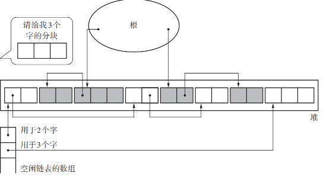

# 垃圾回收算法

## 序章

GC 是 `Garbage Collection` 的简称, 中文翻译 **垃圾回收**

GC 把 程序不用打内存空间 **视为垃圾**

GC 要做的两件事情

1. 找到内存空间里的垃圾
2. 回收垃圾, 让程序员能再次利用这部分空间

就 C++ 语言来说申请内存尚不存在什么问题, 但是释放不要的内存空间时就必须一个不漏的释放, 这是非常麻烦的一件事情。如果忘记释放内存, 改内存空间就会发生内存泄漏，即无法使用。如果放任内存泄漏不处理，总有一刻内存会被占满，甚至还可能导致系统崩溃

另外，如果释放内存空间时忘记将指向该内存空间的指针设置为 `NULL` 或者 `nullptr` 就会导致指针指向已经被释放的内存空间，处于一种悬挂的状态，称之为 **悬垂指针**。如果程序中错误的引用类悬垂指针，就会产生无法预期的 Bug

另外，也有释放错内存空间的可能

综上几种情况，可见 GC 的重要性

1960年 Jon McCarthy 发布了 **清除算法**

1960年 George E. Collins 发布了 **引用计数** 的 GC 算法

1963年 Marvin L. Minsky 发布了 **复制算法**

现在常用的 GC 算法大多是从上述三种算法中衍生出来的产物

GC 更像是一个无名英雄, 默默做着贡献。 但是 GC 基本上是高负载处理， 需要花费一定的时间。当编写动作游戏这样追求即时性的程序时，就必须尽量压低 GC 导致的最大暂停时间。

## 基本概念

### 头 和 域

在 GC 世界中**对象**表示的是 **通过应用程序利益哦那个的数据的集合**

对象配置在内存空间里。GC 根据情况将配置好的对象进行**移动**或**销毁**操作

一般来说，对象由**头**和**域**构成

我们将对象中保存对象本身信息的部分称为 头，一般包括 **对象的大小** 和 **对象的种类** 信息

> 知道对象的大小和种类，就能够判断内存中存储的对象的边界

此外，头 中事先存有运行 GC 所需的信息，根据算法的不同存储的信息也不同

> 比如标记-清除算法中，头 里面就存了一个 falg 用来记录对象是否被标记

我们把对象使用者在对象中可访问的部分称为 **域**。可以将其想成C语言中结构体的成员。对象使用者会引用或替换对象的域值，对象使用者基本上无法直接更改**头**的信息

域中的数据类型大致分为两种: 指针，非指针

指针是只想内存空间中某块区域的值；非指针指的就是编程中直接使用值本身


### 指针

通过 GC 对象会被销毁或保留。 GC 会根据对象的指针去搜寻其他对象; 另外 GC 对非指针不进行任何操作

首先，需要注意语言处理程序是可以辨别指针和非指针

另一点，指针是要只想对象的哪部分，如果指针指向对象首地址以外的部分，那么GC就会变得非常复杂。所以大多数语言中，指针都默认指向对象的首地址


这里把上图中的 B 和 C 对象称为 A 的字对象, 对某个对象的子对象进行某项处理是 GC 的基本操作

### mutator

`mutator` 意为 **改变某物** 的意思。说到要改变什么，在 GC 中自然是 GC 对象间的引用关系

mutator是垃圾回收机制中的程序执行部分，负责分配、使用和维护对象之间的引用关系。垃圾回收器需要与mutator并行工作，以确保内存的有效管理和回收

- 内存分配：当程序需要分配新的内存来存储对象时，mutator负责请求内存分配。它会向垃圾回收器申请一块可用的内存空间，并将对象存储在其中

- 内存使用：mutator负责访问和修改分配给它的内存空间中的对象。它可以读取和更新对象的字段、执行方法和算法等

- 对象引用：mutator会维护对象之间的引用关系。当一个对象引用另一个对象时，mutator会将引用信息写入内存中的字段或变量。这些引用关系构成了对象图，垃圾回收器根据对象图进行垃圾回收操作

### 堆

堆 指的是用于动态存放对象的内存空间，当 mutator 申请存放对象时，所需的内存空间就会从这个堆中被分配给 mutator

GC 是管理堆中已分配对象的机制。在开始执行 mutator 前， GC 要分配用于堆的内存空间。一但开始执行 mutator，程序就会按照 mutator 的要求在堆中存放对象

### 活动对象/非活动对象

将分配到内存空间中的对象中那些能够通过 mutator 引用的对象称为 **活动对象**；反之不能通过程序引用的对象称为 **非活动对象**

非活动对象就是我们说的 垃圾

GC 会保留活动对象，销毁非活动对象。当销毁非活动对象时，其原本占据的内存空间会得到解放，供下一个要分配的新对象使用


### 分配

分配( `allocation` )指的是在内存空间中分配对象, 当 mutator 需要新对象时, 就会向分配器( `allocator` ) 申请一个大小合适的空间。分配器则在堆堆可用空间中寻找满足要求的空间，返回给 mutator

当堆被所有活动对象占满时，就算运行 GC 也无法分配可用空间。这个时候有两种选择

1. 销毁至今为止所有的计算结果，输出错误信息
2. 扩大堆，分配可用空间

现实的执行环境中选择第二项的更实际一点。因为我们必须尽可能地避免因内存不足造成的程序停止。在内存空间大小没有特殊限制的情况下，应该扩大堆

### 分块

分块(`Chunk`)在 GC 的世界里指的是为利用对象而事先准备出来的空间

分块分配的主要目的是减少内存碎片化和提高内存分配速度。当程序运行时，对象的创建和销毁可能会导致堆内存的频繁分配和释放。如果堆内存被细分为小块，那么在分配对象时，可以更容易找到足够大小的块来满足对象的需求，而不会产生大量的内存碎片

1. 初始分块：在垃圾回收器初始化时，会为堆内存分配一些初始的块。这些块可以是固定大小的，也可以是可变大小的。

2. 内存分配：当程序请求内存分配时，垃圾回收器会在已分配的块中搜索合适大小的空闲块。如果找到足够的空闲块，就将其分配给对象，并在块中记录对象的元数据和引用信息。

3. 空闲块管理：分配后，垃圾回收器会维护一个空闲块列表，记录可用的空闲块以供下次内存分配使用。当一个对象被释放时，垃圾回收器将释放的块标记为空闲状态，以便将来重新分配给其他对象。

4. 内存回收：定期或在需要时，垃圾回收器会执行垃圾回收操作，检查不再被程序引用的对象并回收其所占用的内存。垃圾回收器可以通过标记-清除、标记-整理等算法来回收未被引用的对象，并将回收的块标记为可用的空闲块
5. 
### 根

根(`root`)这个词的意思是根据、根底。在 GC 的世界中，根是指向对象的指针的**起点**部分


GC 把上图中可以直接或间接从全局变量中引用的对象视为活动对象

### 评价标准

评价 GC 算法算法的标准有4个标准

1. 吞吐量
2. 最大暂停时间
3. 堆使用效率
4. 访问的局部性

- 吞吐量：单位时间内的处理能力


以上图来看整个 `mutator` 的执行过程触发了三次 GC, 分别花费了 A、B、C 的时间。另一方面 GC 对大小为 `HEAP_SIZE` 的堆进行内存管理, 所以 GC 的吞吐量计算为 $\frac{HEAP_SIZE}{(A+B+C)}$ 

但是吞吐量的好坏不能一概而论的。比如 **标记-清除算法** 和 **复制算法** 相比，活动对象越少**复制算法**的吞吐量越高，这是因为 **GC复制算法** 只检查活动对象，而 **GC标记-清除算法** 则会检查所有的活动和非活动对象。但是随着活动对象的增加，各个 GC算法表现出来的吞吐量也会出现变化。极端情况下，设置会出现**GC标记-清除算法**比**GC复制算法**表现的吞吐量高的情况

- 最大暂停时间：因执行 GC 而暂停执行 mutato 的最长时间


还是用上图为例，最大暂停时间就是 A、B、C 中的最大值

在大多数实现中，当垃圾回收（GC）机制触发时，它会导致程序的暂停运行，通常被称为"停顿"（Pause）。这是因为在垃圾回收的过程中，垃圾回收器需要检查和回收不再被程序使用的内存块，这可能涉及到遍历对象图、标记存活对象、清理未使用的对象等操作，这些操作可能涉及到整个堆内存的扫描和处理。

为了确保在垃圾回收过程中对象的一致性和完整性，垃圾回收器需要停止程序的执行，这就导致了程序的暂停。这种暂停时间取决于垃圾回收算法、垃圾回收器的实现，以及堆内存的大小等因素。较长的停顿时间可能会影响程序的性能和响应性能，因此垃圾回收器的设计和实现通常会努力减少停顿时间，并在可能的情况下进行并发或增量式的垃圾回收

并非所有的垃圾回收机制都会导致明显的停顿。一些现代的垃圾回收器实现采用了更加高级的技术，如并发垃圾回收、增量垃圾回收等，它们在一定程度上减少了停顿时间，以提供更好的用户体验。但无论如何，垃圾回收过程必然会对程序的运行产生某种程度的影响

- 堆使用效率：影响堆使用效率的原因一般就是头的大小和堆的用法

头在堆中存放堆信息越多，GC的效率越高，吞吐量也能随意改善，但是毋庸置疑的是头越小越好

堆的用法不同，堆的使用效率也会出现巨大的差异。比如 GC复制算法 中，将堆一分为二，每次只使用一半，交替进行，因此总是只能利用堆的一半

GC 是自动内存管理功能，所以过量占用堆就成了本末倒置

- 访问的局部性


于是高速的存储容器其容量越小，当 CPU 访问数据时，仅把要使用的数据从此难过内存读取到缓存中；与此同时还将需要的数据附近的数据也读取到缓存中，从而压缩读取数据所需要的时间

所以具有引用关系的对象之间很痛很可能存在连续访问的情况，一般称之为 **局部访问性**

考虑到访问的局部性，把具有饮用关系的对象安排在堆中较近的位置，就能提高在缓存中读取到想利用的数据的概率，令 mutator 告诉运行

## GC标记-清除算法

### 基本流程

GC标记-清除算法由标记阶段和清除阶段构成的

- 标记阶段是把所有活动对象都做上标记
- 清除阶段是把那些没有被标记的对象，也就是非活动对象回收的阶段

- **标记阶段**

```cpp
mark_phase() {
    for(r: $root) {
        mark(*r)
    }
}

mark(obj) {
    if(obj.mark == false) {
        obj.mark = true;
        for(child: children(ob)) {
            mark(*child)
        }
    }
}
```

上述代码，简单明了。在标记阶段，会从 根root 开始为堆里的所有活动对象打上标记。于是我们首先要标记通过根直接引用的堆对象，然后递归的标记通过指针数组能够访问到的对象


于是最开始的内存结构变成了上图的效果，活动对象被打上标记

> 遍历对象的方法有**广度优先搜索**和**深度优先搜索**，但是**深度优先搜索**比**广度优先搜索**能压低内存使用量，因此在标记阶段通常使用**深度优先搜索**

- **清除阶段**

```cpp
sweep_phase() {
    sweeping = $heap_start
    while(sweeping < $heap_end) {
        if(sweeping.mark = true) {
            sweeping.mark = false;
        } else {
            sweeping.next = $free_list
            $free_list = sweeping
        }
        sweeping += sweeping.size
    }
}
```

> 这里的 `sweeping.size` 中的 `size` 是对象的大小（字节数），可以事先在对象的头中定义

在清除阶段，使用 `sweeping` 变量来遍历堆，具体来说就是从堆首地址 `$head_start 开始`，按顺序一个个遍历对象的标志位

设置了标志位就说明是活动对象，不需要回收，就取消其标记位为下次 GC 做准备；没有设置标志位就说明需要被回收

回收对象就是把对象作为分块，连接到被称为 **空闲连表** 的单向链表中。在之后进行分配时只要遍历这个空闲链表就可以找到分块了

> 回收到空闲链表对象上面代码的 7、8 行，就是将 `sweeping` 对应的块插入到 空闲链表 的头上


通过上述操作，就将代码堆中的可以销毁的片段回收到 空闲链表 中

在清除阶段，程序会便利所有堆，进行垃圾回收。也就是说，所花费时间与堆大小成正比。堆越大，清除阶段所花费的时间就越长

### 分配与合并

- **分配**

分配是指将回收的垃圾进行再利用

这里要讨论的问题是：怎样才能把大小合适的分块分配给 `mutator`

在清除阶段已经把垃圾对象连接到空闲链表了，搜索空闲链表并寻找大小合适的分块，这项操作就叫做分配

```cpp
new_obj(size) {
    chunk = picckup_chunk(size, $fee_list)
    if (chunk != nullptr) {
        return chunk;
    } else {
        allocation_fail()
    }
}
```

`picckup_chunk` 函数用于遍历 `$free_list` 寻找大于等于 `size` 的分块。它不光会返回和 size 大小相同的分块，还会返回比 size 大的分块

如果找到了 size 大小相同的分块则直接返回该分块；如果找到比 size 大的分块，则会将其分割成 size 大小的分块和去掉 size 后剩余大小的分块，并将剩余的分块返回空闲链表

这里关于内存块的分配策略有三种：First-Fit、Best-Fit、Worst-Fit

First-Fit（首次适应）

First-Fit算法是一种简单的分配策略，它从内存的起始位置开始查找第一个能满足请求大小的空闲块，并将该块分配给请求的对象。这样可以快速找到合适的内存块，但可能会导致内存碎片化问题。由于不一定选择最适合大小的块，后续较大的内存请求可能无法被完全满足，留下一些较小的零散空闲块。

Best-Fit（最佳适应）

Best-Fit算法会遍历所有的空闲内存块，选择大小最接近请求大小的空闲块，并将其分配给请求的对象。这样可以尽量减少内存碎片化，但需要额外的搜索时间来找到最合适的块。Best-Fit可以有效地利用内存空间，但在频繁分配和释放对象的情况下，可能会导致内存分配效率降低。

Worst-Fit（最差适应）

Worst-Fit算法正好与Best-Fit相反，它选择能够完全满足请求大小并且剩余空间最大的空闲块。这样可能会留下大量碎片，导致内存空间的浪费。Worst-Fit在一些特殊情况下可能会比较有效，但通常不是首选的分配策略。

- **合并**

根据分配策略的不同可能会产生大量的小分块，如果这些小分块是连续的，那么就可以合起来形成一个大分块，这种 **连接连续分块** 的操作就叫做 **合并**

```cpp
sweep_phase() {
    sweeping = $heap_start
    while(sweeping < $heap_end) {
        if(sweeping.mark = true) {
            sweeping.mark = false
        } else {
            if(sweeping == $free_list + $free_list.size) {
                $free_list.size += sweeping.size
            }
            else {
                sweeping.next = $free_list
                $free_list = sweeping
            }
        }
        sweeping += sweeping.size
    }
}
```

添加了一个判断：当前分块和上个分块是否连续，如果连续则合并

### 优缺点

- 优点
  - 算法简单，容易实现
  - 与保守式GC算法兼容

- 缺点
  - 碎片化：无法避免的产生内存碎片，影响 mutator 的运行。可以使用 **BBOP法** 来解决内存碎片
  - 分配速度：最差的情况是每次都要便利整个空闲链表。可使用**多空闲连表**和**BBOP法**来解决
  - 与写时复制技术不兼容

针对写时复制技术，当 fork 进程时，并不是想原本进程的内存完全复制一份给新的进程，而是两个进程公用同一份内存空间，当新进程要修改某些数据的时候才会将那部分数据放到新建的内存空间中。通过这种方式可以减少内存空间和数据复制所用的时间，只在需要的时候才会新建所需的内存和复制所用的数据

但是当使用 GC标记-清除算法时，每次标记清楚都涉及到数据的修改，导致写时复制完全失效

为了处理这个问题可以使用 **位图标记法**

### 多个空闲表

之前的标记-清除算法只用了一个空闲链表来处理内存块。这样一来每次分配的时候都要遍历一次空闲链表来寻找合适大小的分块，这样非常浪费时间

因此，拓宽思路使用分块大小不同的空闲链表，即创建只连接大分块的空闲链表和只连接小分块的空闲链表



我们使用空闲链表数组来存储多个空闲链表的头，第一个元素是由两个字节的分块连接而成的空闲链表的头节点；第二个元素是由三个字节的分块连接而成的空闲链表的头节点……

但是数组总需要一个上线，不能开一个无限长的数组。所以通常会给分块设定一个分块大小的上限，分块如果大于等于这个大小就统一设定到一个空闲链表上

> 一般来说 mutator 很少会申请非常大的分块，为了应对这种极少出现的情况而大量制造空闲链表，会使得空闲链表的数组过于巨大

### BBop法

`BBOP` 就是 `Big Bag Of Pages` 的缩写

BBoP算法的核心思想是将整个堆内存划分为一个巨大的连续内存块，称为 `Big Bag`，这个大内存块被分割成固定大小的页（Page），每个页的大小通常是2^N字节（如4KB或8KB）。对象的内存分配和回收都在这些页的级别上进行，而不是像传统的分代垃圾回收算法那样在对象级别上进行

BBoP算法的主要特点包括：

1. 大内存块：BBoP使用一个巨大的连续内存块作为堆，而不是将堆划分为多个不同大小的块。这样做可以减少内存管理的复杂性和内存碎片化

2. 固定大小的页：堆内存被分割成固定大小的页，这些页可以被高效地管理和回收。当对象不再使用时，整个页可以被一次性地回收

3. 简化垃圾回收：由于采用了大内存块和固定大小的页，垃圾回收过程更加简化，避免了在对象级别上进行复杂的标记-清除或标记-整理操作

BBoP算法的设计目标是为了在大规模堆内存的情况下提供高效的内存管理。它通常用于处理内存占用较大的应用程序或数据密集型任务

需要指出的是，BBoP算法并不是广泛应用的垃圾回收算法，它可能在某些特定的应用场景中发挥优势，但并不适用于所有情况。在实际应用中，垃圾回收算法的选择通常需要综合考虑应用程序的特点、内存使用情况、性能需求等因素

### 位图标记

在之前的 标记-清除算法 中，用于标记的位势分配到各个对象的头中，也就是说算法把对象和头一并处理了，但是这样与 写时复制 不兼容

于是将 标记位 从对象的头中抽出，单独用表格管理。这样在标记的时候，不用修改对象的数据了。那么管理标记位的表格 就是位图

位图标记算法的基本思想是使用位图（Bitmap）来记录堆中对象的标记信息。每个对象都对应位图中的一个标记位（通常用1或0表示），用于表示该对象是否被访问过，即是否为可达对象。在垃圾回收的标记阶段，算法会遍历堆中的对象图，并对可达对象进行标记，将对应的位图标记为1。标记过程通常由垃圾回收器从根对象（如栈中的引用对象）开始进行深度优先或广度优先遍历，依次标记所有可达对象

标记阶段完成后，位图中标记为0的位表示不可达的对象，即垃圾对象。在清除阶段，垃圾回收器会遍历位图，将对应标记为0的对象回收并释放其占用的内存。这样，所有不可达的对象都会被回收，而可达的对象将被保留

位图标记算法相对简单且高效，它不需要为每个对象额外分配标记字段，而是通过位图来记录标记信息，节省了空间。然而，它需要在标记和清除阶段都遍历所有的对象，这可能导致垃圾回收的停顿时间较长

### 延迟清除法

延迟清除法采取了一种更灵活的方式来处理垃圾回收。它允许垃圾回收器在进行标阶段时，只对某些部分进行扫描和回收，而不是整个堆。未被清除的部分将被延迟至稍后的时间再进行处理

## 引用计数法

可以让对象事先记录下有多少个对象引用自己，让没有对象引用的对象自己消失，这就是引用计数

### 算法

需要引入一个**计数器**，计数器记录了被多少个对象引用

> 计数器是无符号整数，用于计数器的位数根据算法和实现而有所不同

在 GC标记-清除算法 等其他GC算法中，没有分块时 mutator 会调用 `garbage_collect` 等函数来启动 GC 分配空闲的内存空间

但是在 引用计数 算法中并没有 mutator 明确启动 GC 的语句

引用计数法与 mutator 的执行密切相关，它在 mutator 的处理过程中通过增减计数器的值来进行内存管理，只有在 `new_obj` 和 `、update_ptr` 函数触发时会发生计数器的值的变化

```cpp
new_obj(size) {
    obj = pickup_chunk(size, $free_list)

    if(obj == NULL) {
        allocation_fail()
    } else {
        obj.ref_cnt = 1
        return obj
    }
}
```

> ref_cnt 表示对象的 **计数器**，对象创建时赋值为1

与标记清除算法类似，生成新对象时会调用 `new_obj` 函数

在 引用计数 法中，除了连接到空闲链表的对象，其他所有对象都是活动对象

```cpp
update_ptr(ptr, obj) {
    inc_ref_cnt(obj)
    dec_ref_cnt(*ptr)
    *ptr = obj
}

inc_ref_cnt(obj) {
    obj.ref_cnt++;
}

dec_ref_cnt(obj) {
    obj.ref_cnt --;
    if(obj.ref_cnt == 0) {
        for(child: children(obj)) {
            dec_ref_cnt(*child)
        }
        reclaim(obj)
    }
}
```

> mutator 在更新指针时会执行此函数

`update_ptr` 用于更新指针 ptr，使其指向对象 obj，同时进行计数器的增减

1. 对指针 ptr 新引用的对象(obj)的计数器进行增量操作
2. 对指针 ptr 之前的对象(*ptr)的计数器进行减量操作

减量操作之后，计数器的值为0的对象变成垃圾，因此这个对象的指针会全部被删除，注意 `dec_ref_cnt` 函数递归执行了

至于为什么先执行 `inc_ref_cnt` 再执行 `dec_ref_cnt`， 是为了处理 *ptr 和 obj 是同一对象的情况。 如果反过来的话 obj 可能再增量引用计数之前就被释放了

### 优、缺点

- **优点**

1. 可立即回收垃圾，每个对象始终知道自己的被引用数，当引用数归零时自己就把自己回收了
2. 最大暂停时间短，只有通过 mutator 更新指针时程序才会执行垃圾回收
3. 没有必要沿着指针查找，与 标记清除 不同，引用计数 无需由根沿指针查找
4. 内存碎片少，在引用计数算法中，由于对象在不再被使用时就立即被释放，所以内存的分配和释放更加均匀，不太可能在内存中形成大的空洞

- **缺点**

1. 计数器 值的增减处理繁重，大多数情况下指针都会频繁更新，计数器的值都会随之更新，因此值的增减处理必然会变的繁重
2. 计数器 需要占用很多位
3. 实现繁琐复杂
4. 循环引用无法回收

### 延迟引用计数法

引用计数算法中 **计数器值的增减处理繁重**

- 频繁更新：在一个动态变化的系统中，对象间的引用关系可能会频繁改变，这就导致需要频繁地更新引用计数。每次引用的创建、删除或者修改都可能需要修改计数器的值
- 同步开销：在多线程环境中，为了保证引用计数的正确性，可能需要使用锁或者其他同步机制来保护计数器，以防止并发的引用修改导致计数错误。这会增加额外的同步开销 
- 内存开销：每个对象都需要一个额外的计数器来存储引用计数，这会增加内存开销


### Sticky引用计数法

在 引用计数 中，需要考虑为 计数器 设置多大的位宽

加入为对象设置1个字节的位宽，但是对象本身只有 2个字节的大小，那么平白无故多浪费了0.5倍大的内存空间

那么 Sticky引用计数法 就是通过减少计数器的位宽用来处理这个的问题的

假设计数器的位宽为5位，那么最多只能数到 2的5次方减1，也就是31个引用计数。如果对象被大于31个对象引用，那么计数器就会溢出，针对溢出有2种解决方式

1. **什么都不做**

对于计数器溢出的对象，我们可以不再增减其计数器的值，也不销毁这个对象，就让他占用内存空间

因为绝大多数对象一生成马上就死了，也就是说在很多情况下，计数器的值会在0～1的范围内变化，鲜少出现5位计数器益处的情况

另一个方面来说，计数器溢出的对象在执行中的程序里占有非常重要的位置，所以未来成为垃圾的可能性也很低

考虑到上面的两点，对于计数器溢出的对象，什么都不做也不是不行

2. **使用 GC标记-清除算法 进行管理**

- 引用计数: 首要的垃圾回收策略是引用计数，这意味着每当一个对象被创建或引用时，它的引用计数都会增加。反之，每当一个引用被删除或离开作用域，引用计数就会减少
- 立即回收: 当一个对象的引用计数变为0时，说明没有任何引用指向它，垃圾回收器会立即回收它，释放其占用的内存
- 检测循环引用: 然而，引用计数算法无法处理循环引用的问题。当垃圾收集器发现内存消耗增加或者在适当的时间（例如低负载时），它会启动标记-清除算法
- 重置引用计数: 标记-清除结束后，所有活动对象的引用计数被重置(设为0)
- 标记: 在标记阶段，垃圾收集器从根对象开始，遍历所有可达对象，并将它们标记为活动，对其计数器进行增量操作。这个过程会找出所有的活动对象，包括被循环引用的对象
- 清除: 在清除阶段，垃圾收集器遍历所有的对象，清除那些没有被标记或者计数器值为0的对象，也就是那些不可达的对象，包括被循环引用的对象

通过上面的几个步骤，将 引用计数算法和GC标记清除算法 结合起来，在计数器移除后即使对象成了垃圾，程序还是可以回收它

另外，这种结合起来的方法可以解决循环引用的问题

### 1位引用计数法

### 部分标记-清除算法

## GC复制算法

## GC标记-压缩算法

## 保守式GC

## 分代垃圾回收

## 增量式垃圾回收

## RRC Immix 算法

