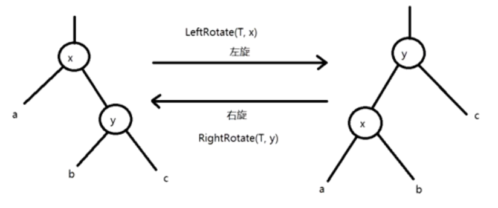

# 红黑树

## 问题

- 服务器端高并发IO的 Keep Alive 方案，需要满足以下需求

1. 每个IO都有自己的时间戳，用于后续时间判断
2. 每个IO收到自己的 Beat 后，重置自己的定时器
3. 若 IO 定时没有收到 Beat， 则执行 IO 的回调函数，并重置定时器
4. 若再次没有收到 Beat，销毁 IO，注销定时器

- 射击一个线程或者进程的运行体 R 与运行体调度器 S 的结构体

1. 运行体 R：包含运行状态{新建、准备、挂起{IO等待读、IO等待写、睡眠、延时}、退出}，运行体回调函数，回调参数
2. 调度器 S：包含栈指针，栈大小，当前运行体
3. 调度器 S：包含执行集合{就绪，延时，睡眠，等待}

## 排序二叉树

```cpp
typedef int KEY_TYPE;   // 未来修改节点内容数据类型时可以方便修改

#define BSTREE_ENTRY(name, type)    \
    struct name {                   \
        struct type* left;          \
        struct type* right;         \
    }                               \


/* 二叉排序树的节点 */
struct bstree_node{
    KEY_TYPE key;   // 用于判断大小的Key

    void* value;    // 存储值

    BSTREE_ENTRY(ready, bstee_node) bst;
}

/* 二叉排序树 */
struct bstree{
    struct bstree_node* root;
}
```

使用 `BSTREE_ENTRY` 的优点是可以方便地为二叉树节点添加多个不同的子树指针，而不需要重复地写 `struct type* left; struct type* right;` 这样的代码

这样可以节省代码量，提高可读性，也方便修改和扩展

```cpp
/* 创建节点 */
bstree_node* bstree_create_node(KEY_TYPE key) {
    bstree_node* node = (bstree_node*)malloc(sizeof(bstree_node));
    if(node == nullptr) assert(0);
    node->key = key;
    node->left = node->right = nullptr;

    return node;
}
/* 删除节点 */
void bstree_destroy_node(bstree_node* node) {
    if(node == nullptr) return;

    node->left = node->right = nullptr;
    free(node);
}
```

上面创建的是一个普通的二叉排序树，在最坏的情况下二叉排序树会退化成一个链表

## 红黑树

### 定义节点

平衡二叉树为每个节点**添加了左右子树的高度**；红黑树为每个节点**增加了一个颜色(红或黑)**

红黑树的5个规则

1. 每个节点是红的或者黑的
2. 根节点是黑的
3. 每个叶子节点是黑的
4. 如果一个节点是红的，则它的两个子节点都是黑的
5. 对每个节点，从该节点到其子孙节点的所有路径上包含相同数目的黑色节点

> 红黑树的叶子节点是指空节点，也就是没有实际数据的节点，所有叶子节点都隐藏，并且为黑色

- 红黑树的应用
  - Linux进程调度 CFS
  - Nignx Timer事件管理
  - Epoll 事件块的管理

```cpp
#define RED     1
#define BLACK   2

typedef int KEY_TYPE;

/* 红黑树的节点 */
typedef struct _rbtree_node {
	unsigned char color;
	struct _rbtree_node *right;
	struct _rbtree_node *left;
	struct _rbtree_node *parent;
	KEY_TYPE key;                   // Key值 用于排序和查找
	void *value;                    // Value 用于存储值
} rbtree_node;

/* 红黑树 */
typedef struct _rbtree {
	rbtree_node *root;
	rbtree_node *nil;
} rbtree;
```

还记得前面说的吗？ 红黑树的叶子节点是指空节点，也就是没有实际数据的节点，也就是说所有 `_rbtree_node` 的叶子节点其实都是指向 `_rbtree.nil` 空节点的

通过上面的代码可以定义出一个红黑树和红黑树节点，但是红黑树麻烦的点在于节点的添加与删除，在添加节点与删除节点时需要保证依然符合上面的五个规则，因此在添加/删除节点时会**旋转**红黑树来保证符合规则

### 插入

什么时候需要旋转？

[红黑树在什么时候左旋 右旋](https://blog.csdn.net/huqiankunlol/article/details/108575557)

因为**红黑树插入节点的颜色是红色的**，所以当新红黑树不符合规则时需要通过旋转来符合规则

插入了新红色节点的红黑树应该如何变色呢？

同的情况，有以下几种可能的变色方法：

- 如果新节点是根节点，那么直接将其变为黑色，满足性质2（根是黑色）
- 如果新节点的父节点是黑色，那么不需要变色，满足性质4（每个红色节点必须有两个黑色的子节点）
- 如果新节点的父节点是红色，而叔叔节点也是红色，那么将父节点和叔叔节点变为黑色，将祖父节点变为红色，然后把祖父节点当作新插入的节点递归重复这一判断，直到根节点，将根节点颜色设置为黑色，满足性质4和性质5（从任一节点到其每个叶子的所有简单路径都包含相同数目的黑色节点）
- 如果新节点的父节点是红色，而叔叔节点是黑色或空（空也算黑色），那么需要根据新节点和父节点所在的位置进行不同的旋转和变色操作。具体有以下四种情况3：
  - 左左：如果新节点是父节点的左孩子，而父节点是祖父节点的左孩子，那么将父节点变为黑色，祖父节点变为红色，然后对祖父节点进行右旋
  - 左右：如果新节点是父节点的右孩子，而父节点是祖父节点的左孩子，那么先对父节点进行左旋，然后把新节点当作左左情况处理
  - 右右：如果新节点是父节点的右孩子，而父节点是祖父节点的右孩子，那么将父节点变为黑色，祖父节点变为红色，然后对祖父节点进行左旋
  - 右左：如果新节点是父节点的左孩子，而父节点是祖父节点的右孩子，那么先对父节点进行右旋，然后把新节点当作右右情况处理

### 旋转

旋转分为两种情况：左旋转、右旋转

- **当前父结点是红色，叔叔是黑色的时候，且当前的结点是右子树** => 左旋
- **当前父结点是红色，叔叔是黑色的时候，且当前的结点是左子树** => 右旋



```cpp
void rbtree_left_rotate(rbtree *T, rbtree_node *x) {

	rbtree_node *y = x->right;

	x->right = y->left; //1 1
	if (y->left != T->nil) { //1 2
		y->left->parent = x;
	}

	y->parent = x->parent; //1 3
	if (x->parent == T->nil) { //1 4
		T->root = y;
	} else if (x == x->parent->left) {
		x->parent->left = y;
	} else {
		x->parent->right = y;
	}

	y->left = x; //1 5
	x->parent = y; //1 6
}


void rbtree_right_rotate(rbtree *T, rbtree_node *y) {

	rbtree_node *x = y->left;

	y->left = x->right;
	if (x->right != T->nil) {
		x->right->parent = y;
	}

	x->parent = y->parent;
	if (y->parent == T->nil) {
		T->root = x;
	} else if (y == y->parent->right) {
		y->parent->right = x;
	} else {
		y->parent->left = x;
	}

	x->right = y;
	y->parent = x;
}
```