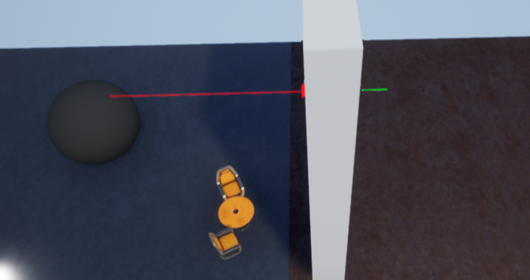

<!--
 * @Author: lc
 * @Date: 2021-09-03 21:41:18
 * @LastEditTime: 2021-09-18 19:07:36
 * @LastEditors: Please set LastEditors
 * @Description: 虚幻学习
 * @FilePath: D:\Projects\markdown\虚幻.md
-->
****
# 编辑器

虚幻提供许多编辑器

1. 关卡编辑器
2. 材质编辑器
3. 蓝图编辑器
4. 行为树编辑器
5. Persona编辑器
6. 粒子编辑器（程序一般不管，美术会用）
7. UMG编辑器
8. Matinee编辑器（影视编辑器 一般做CG）
9. SoudCue编辑器
10. Paper2D编辑器
11. Paper2D Flipbook 编辑器
12. Physics Asset工具编辑器
13. 静态网格编辑器
14. 媒体播放编辑器

- 蓝图与C++
  - 可视化蓝图脚本是对游戏实时逻辑和序列型的事件的理想制作手段。这个系统对策划、美术以及面向可视化编程的程序员是非常好的，它能够可视化的管理游戏内的物体，并且容易访问
  - C++编程可以为更大体谅的任务工作，比如构建一个游戏体系，制作复杂的AI行为，或者新增引擎功能
  - 大部分项目建议使用蓝图和C++进行混编。由C++构建逻辑框架，产品原型，由蓝图进行编辑扩展，提供给美术或者策划使用更加便捷

- 虚幻支持的文件内容

| 分类 | 类型 |
| --- | --- |
| 3D | fbx/obj |
| 贴图 | png/jpge/bmp/tga/dds/exr/psd/hdr |
| 声音 | wav |
| 字体 | ttf/otf |
| 视频 | mov/mp4/wmv/avi |

> 常规使用的文件格式一般都支持

> 显示UE的资产

> UE推荐的文件分类文件夹命名

> 设置文件夹颜色，帮助分类

## 光照

- 光源
  - 定向光源：无位置信息，有照射方向信息。所有的阴影照射均是平行效果。一般用来模拟阳光
  - 点光源：如同真实世界中的灯泡，发光模式向各个方向均匀放光。随着距离出现衰减。一般可用来制作无照射方向的光源。例如：灯泡、烛光、篝火、炮弹爆炸光等
  - 聚光源：以锥形空间为照射模型，朝着锥桶方向进行均匀照射，随着距离进行衰减。用作：手电筒、探照灯、汽车灯光等带有光束特殊点灯光
  - 矩形光源：从一个定好宽度和高度的矩形平面向场景发出光线。可以用来模拟有用矩形面积的任意类型光源。例如：电视机、显示器、吊顶灯具或壁灯
  - 天空光照：获取场景中一定距离以外的部分将他们作为光照应用于场景中。例如：远处的大气、云、群杀、天空光需要重建光照信息，才会进行捕捉计算

- 光源的移动特性
  - 可移动光源：产生完全动态的光源和阴影，消耗较大！运行时光源的大部分信息均可被修改（不会产生间接光照）
  - 静态光源：指在运行时态不可以做任何改变或移动光源。静态光源效果只应用于光照贴图计算（预光照计算，即烘焙），只影响静态物体。静态光源消耗最低。一般应用于移动平添，用途非常有限（不与动态物体产生交互，所以不产生阴影）
  - 固定光源：固定位置不变的光源，但是光源其他信息可以被变更（颜色、亮度等）。固定光源会产生阴影

- 光照模式
  - 直接光照：光源本身发射，直接照射到物体表面，体现的光照结果
  - 间接光照：光源照射到物体表面，通过反射关系产生的光照则为间接光照

> 间接光照是真实世界的光照重要组成部分

- 构建光照（烘焙）
  - 构建光照，在场景运行前期将场景中的光照关系进行提前计算，以防止在运行时态再计算光照关系，从而提升运行时的效率。构建光照的目的时**计算间接光照关系，产生间接光照缓存**
  - 优点：在运行时获得更加真实的光照关系，免去了运行时计算光照的开销。虚幻中静态光和固定光都需要构建光照

> **构建光照可以获得间接光照缓存（光的颜色贴图）**，这样运行时直接使用该贴图即可

- 间接光照缓存
  - 全局光照可以生成静态物体上的间接光照信息，但是场景中的动态对象，也需要一种接受间接光照的方法，这种方法就是**间接光照缓存**
  - Unity中叫**光照探头**

当你对场景进行构建的时候，会进行光照收集（光量子收集），收集这片区域每个点上的光亮强度，记录光的颜色。当移动物体在区域内移动的时候会把颜色贴到物体表面上从而产生照亮效果。

当物体在场景中移动的时候，其实就是在光照贴图中找对应区域的颜色，然后把颜色贴到物体表面上去（给人感觉像是照亮罢了）

****
- 重要光照体积（Lightmass Importance Volume，简称LIV）
  - 可以将光照信息进行精密化计算
  - 人物在场景中可以运行到的或者移动的地方是有限的，所以只需要关心人物可以到达的地方有高质量的光照，其他区域不要进行精密光照计算
  - LIV可以帮助我们调整发射光量子范围，允许我们集中在需要详细间接光照的区域进行收集，而在重要体积外的地方我们获取低质量的间接光照即可

- 固定光源的光照缓存与灯光在一起，当光源删除时光照缓存删除
- 静态光源不在运行时态产生光照信息，所以删除灯光后光照缓存依旧会存在

## 蓝图基础

### 简介

蓝图时虚幻4中的一个可视化编程语言。具备传统编程语言的特点，同时具备简单、易用、易理解的特性

- 种类
  - 关卡蓝图
  - 对象蓝图
  - 动画蓝图
  - 组件蓝图
  - UMG蓝图
  - GameMode蓝图（属于Actor对象蓝图，用于逻辑）
  - GameState蓝图（属于Actor对象蓝图，用于状态）
  - PlayerController蓝图（属于Actor对象蓝图，玩家控制）
  - …

- Actor(演员)
  - 是一个基本类型的对象
  - 虚幻中将场景的所有对象体均定义为是一个Actor，他是虚幻引擎的重要组成概念
  - 虚幻中规定，能存在于场景中的物体需要从Actor进行扩展衍生
  - 可以将Actor直接放到场景中，也可以在世界中生成Actor
  - 虚幻中常见的Actor：摄像机、触发器、各种体积、静态网格、骨骼网格、Player Start

> 在目标文件夹（一般是新建名为BluePrints的文件夹）中右键，新建蓝图即可  
> 在编辑器视口中，按住鼠标右键拖动  
> 在编辑器是口中，按住鼠标左键拖动可拖出节点或执行线  
> 按住alt键再点击连接线，可删除连接线  
> 安卓ctrl键再点击连接线，可重新选择目标节点  

### 蓝图事件

- 图中对应节点名称
  1. **蓝图节点**（逻辑节点、函数节点）
  2. 节点右边叫**逻辑输出阵脚**，左边叫**逻辑输入针脚**
  3. **逻辑执行线**或**执行线**
  4. **输出参数针脚**

读取蓝图的时候，从白色执行线的起点开始，顺着执行线一个蓝图节点一个蓝图节点的读取即可

> 事件类型

创建的蓝图对象直接拖入到场景中并不会被渲染出来，需要添加网格组件才可以被被渲染出来

- 网格
  - 静态网格
  - 骨骼网格
  - ……

1. 点击添加组件，在搜索框中输入 静态网格/static mesh
2. 即为我们添加的静态网格组件
3. 设置静态网格组件的材质

> 关闭每帧执行的tick
> Begin Play（事件开始运行的执行 **先于** Tick每帧调用）

想创建一个朝固定方向移动的球体

1. 创建蓝图
2. 添加static mesh，设置static mesh贴图
3. 在事件图表中添加`AddActorWorldOffest`节点，设置参数
4. 将每帧执行的Tick连线到添加的节点上
5. 将蓝图实例化（拖动）到场景中
6. 运行场景

### 蓝图日志

日志可以提供运行时态的程序信息，并进行输出
通过查看日志来查看对象状态，以反馈数据内容

> 比如查看玩家具体速度数值、根据数值异常查找bug、判断逻辑是否执行等

- In String：日志文本内容
- Print to screen：是否输出到屏幕
- Print to Log：是否输出到控制台（是否输出到日志文件）
- Text Color：屏幕输出颜色
- Duration：屏幕持续时间

> 打开日志窗口  
> 在日志窗口中，可以右键清除日志

### 蓝图注释

1. 框选中你要注释的一个或多个蓝图节点
2. 单击键盘字母**C**键
3. 设置注释内容

> 选中注释，点击键盘**del**即可删除

1. 鼠标悬停在单个目标蓝图节点上的标题上
2. 单击白色省略号按钮
3. 设置文本即可完成单个节点的注释

### Construction Scrip

功能类似构造函数
只要蓝图对象被构建、调用，则该函数就会执行

当你在编辑器窗口拖动时，虚幻会认为你要重新构建该物体，所以物体的构造函数会被执行

> 通过图片上的设置，可以关闭拖动时重新构建调用构造函数

一般将调整信息逻辑放入到Construction图表中，只要在场景中物体被移动，Construction就会执行，物体会自己重新设置自己

在编辑器模式中拖拽蓝图对象会调用Construction，但是在真正的独立发布软件上使用代码控制对象不会执行Construction，也即发布后的软件上只在最开始的时候调用一次Construction

### 添加变量

1. 添加变量
2. 设置变量名
3. 设置变量名
4. 设置变量类型
5. 设置变量的默认值（需要点击工具栏左边的编译之后才可以进行设置）

- 命名规则：有规则可以增加代码的可读性
  - 帕斯卡命名法：单字之间不以空格、下划线连接欸，第一个单字首字母大写，后续单字首字母也大写（UE内部使用的就是帕斯卡命名法）
  - 大驼峰命名法 = 帕斯卡命名法
  - 小驼峰命名法

选中目标变量，将其拖入到蓝图的视口中，可以选择使用get/set方法

### 基本运算

直接在视口中敲击 +、-、*、/、%即可进行对应运算

基本数据类型中，字节型、整型、浮点型均支持常规数学运算，即加减乘除

执行顺序是*事件开始*->*设置Age的值*->*Print1*->*Print2*

Age的初始值为5

当执行到*设置Age的值*时，根据针脚指针往回推导，开始计算，最后设置Age的值为40

当执行到*Print1*时，直接获得setAge的值为40

当执行到*Print2*时，根据针脚指针往回推导，开始计算，最后获得输出值为215

> Print2时，Age的值已经被改变了 所以Print1和Print2的输出并不相同

> 整型数据的自增自减

### 流程控制

> 常见流程控制

> 判断是否成年

# 蓝图

## 流程控制

- **序列 Sequence**

允许逻辑执行先进行分割，但不是并行关系，而是次序关系，最上层位于运行上端，以此类推
序列支持多个次序执行线并存，通过增加引脚来增加次序执行线
序列中的逻辑执行针脚是按照次序一次执行
**目的是来帮助开发者将逻辑进行划分，可以将逻辑分成几块，而不必非要串联到一条逻辑线上，达到清晰逻辑结构的目的**

----

- **Do N & Do once**

1. Do Once只可以进行一次执行权通过
  - 通过调用Reset可以重置通过限制
  - 设置节点开始是关闭的，无法使用，必须通过调用Reset针脚激活节点
2. Do N可以根据给定的输入参数N来决定执行权通过次数
  - 输入参数针脚Connter将当前次数进行返回
  - 如果想要重置节点，需要调用Reset针脚进行重置

Do节点用来控制当前执行逻辑线进行连接后，视口可以通过输出逻辑针脚将逻辑执行权向下进行传递，**主要用来控制执行权通过次数**

> Do N可以用来制作开枪，比如枪管只有20发子弹，只能发射20发；有的武器只能发射一次，则使用Do once

> `Do Once`节点中的 `Start Closed`表示初始是否是非激活状态，勾中表示一开始`Do Once`节点就是失效的不会执行后续操作

1. 点击数字键盘1，开始执行`Do Once`，最开始是激活状态，所以会输出字符串`1`
2. 再次点击数字见1，因为`Do Once`之前已经执行过一次了，所以不会执行后续操作
3. 点击数字2，Reset`Do Once`节点，使之重新进入激活状态
4. 点击数字3，开始执行`Do N`，设置`Do N`节点的N为5，所以点击五次3，才会使`Do N`节点失效
5. 点击数字4，Reset`Do N`节点的次数

----

- **Do Once MultiInput**

与`DoOnce`节点基本相同，但是可以通过添加新的引脚，增加独赢的输入逻辑，只要任意逻辑输入针脚有调用，则整个节点被关闭  
通过调用重置输入针脚重置整个控制节点

> 这里A、B、C中任意一个被执行了，另外两个都不会再次执行，除非重置整个`Do Once MultiInput`节点

---

- **FlipFlop 反复循环**

节点取入执行输出并在两个执行输出间切换  
节点同时有bool变量输出，可以用来判断A何时被调用（执行A返回true）  

例如：第一次被调用执行了A，则第二次被调用执行B，然后再是A，然后再是B  

> 实际运用：开关灯

----

- **ForLoop**

按照从`First Index`开始，到`Last Index`结束，调用逻辑输出引脚`Loop Body`，调用次数为`First Index`到`Last Index`差值  
`Index`输出参数引脚将输出从开始到结束的所有整数，当整个节点执行完毕后，调用逻辑输出引脚`Completed`

> 常用于叠加计算，或多次执行某个动作
> 等价C++代码中的`for`关键则

> 输出5 6 7 8 9 10 Complete

----

- **ForLoopWIthBreak 循环中断**

与`ForLoop`相同，用于将单词执行逻辑进行循环  
但添加了`Break`输出引脚，如果被打断则直接停止循环，跳到输出逻辑引脚`Completed`

> 使用for循环计算1~100的和，当和超过1000的时候停止计算  
> 当和超过1000时，分支语句`Branch`为True的针脚向后执行，`Break`掉`ForLoopWIthBreak`，随后直接输出计算和1035  

----

- **Gate 门**

用来控制开启和关闭的执行逻辑

Enter输入逻辑进入  
Open引脚被调用后，Enter引脚流入的执行逻辑才会从Exit引脚流出  
Close引脚被调用后，Enter引脚流入的执行逻辑将被阻挠，无法流出  
Toggle从开和关之间进行往返  
Start Close设置节点开始状态，勾选后开始状态为关闭

> 最开始`Start Closed`为选中状态，所以`Gate`处于关闭状态，点0无反应  
> 点按钮键盘1之后，`Gate`打开，再点击0执行输出`Toggle`  
> 点按钮键盘2之后，`Gate`关闭，再点击0，无输出  
> 点按钮键盘3之后，`Gate`如果原本关闭则变为打开，如果原本是打开则变为关闭，再点击0，根据状态判断是否输出  

----

- **MultiGate**

输入逻辑节点将按照顺序或随机方式从右侧输出引脚进行输出执行逻辑

Reset 重置整个节点，使之回复到起始状态  
Is Random 勾选引脚，按照随机的方式从右侧输出引脚选择输出执行逻辑  
Loop  勾选引脚，按照循环方式从右侧输出引脚输出执行逻辑  
Start Index 设置第一调节用节点从右侧那个引脚进行输出

> 只要不勾选`Loop`，则每次执行`MultiGate`会把逻辑引脚依次全部进行**一次**输出(不会重复输出)  

> 如果`Is Random`和`Loop`都没勾选，则多次点击键盘按钮会输出一次`Out 0`，一次`Out 1`，然后`MultiGate`关闭  
> 如果只勾选了`Is Random`，则多次点击键盘按钮1会随机输出一次`Out 0`或`Out 1`  
> 如果只勾选了`Loop`，则多次点击键盘按钮1会循环输出`Out 0`，`Out 1`  

----

- **WhileLoop**

只要特定值`Condition`为true，则`whileloop`节点将会输出一个结果。在循环的每个迭代中，他会查看器输入bool值的当前状态，一旦为false，则停止循环

> 等价C++的while

> SumValue初始值为0，每次都SumValue = （SumValue + 1） * 2，当SumValue小于100的时候执行循环体，大于100就跳出循环，最后输出SumValue的值为126

----

- **Switch 切换**

当逻辑输入针脚被调用时，将会按照给定的值`Selection`进行右侧选择引脚输出

> 功能等价于C++的switch  

> 如果值为1，打印执行值为0对应的第一个Print  
> 如果值为2，打印执行值为1对应的第二个Print  
> 如果值为3，打印执行值为2对应的第三个Print  
> 如果不为1、2、3，打印执行Default对应的Print  

----

- **Delay 延时操作**

Delay节点，延时操作  
当延时任务未完成时，再次调用节点，**忽略调用**  
尽量不要将Delay节点让如Tick中  
Delay只能在事件表中使用  

`Duration`延时动作持续时间  

`Retriggerable Delayer`与上面的`Delay`的节点一致，只是如果延时任务没有完成，再次调用节点，则延迟动作**重新计时**

> 不停按键盘按钮4和键盘按钮5可体会`Delay`和`Retriggerable Delayer`的差别

----

## 面向对象

面向对象的特性为封装、多态、继承

我们创建编写的蓝图，称之为蓝图资产或蓝图模板  
模板是用来产生真实对象的，同时模板也是一种数据类型，一种**复合数据类型**，主要是用来描述对象的结构和行为，这也被称为抽象

### 属性

- **成员属性**

蓝图变量框添加的变量，称之为成员变量  
成员变量是抽象为对项目模板而添加的，只能通过蓝图的实例化对象才能有效访问该成员变量  

成员变量描述了抽象的对象的属性信息  

- **小提示**

在制作触发器的时候，Box Collistion是不容易看见的，这个时候给触发器一个Billboard组件，该组件仅提供一个显示作用，方便查找

1. Box Collision 作为根组件时，其可见性很差
2. 添加的Billboard组件
3. 设置Billboard组件的Sprite设置，修改其贴图为S_Trigger

- **蓝图中成员属性设置**

> 这里场景编辑器就是前面说的关卡编辑器，写急了

### 函数

- **成员函数**

函数：一段在一起的，可以做某一件事的程序，也称作方法。函数是面向对象中将逻辑进行封装的重要表现  
编写函数的目的：将逻辑**单一化、清晰化、明确化、复用化**，加强整个结构的可阅读性  
编写函数可以提高工作效率，函数本身可以用来处理数据也可以辅助获得数据  

将属性和函数编写在模板中，体现的就是封装  

- **函数**

> 函数中不可调用`Delay`，因为函数执行是一瞬间的，执行完就没了

> 蓝图中函数允许多个返回值  
> 如果执行线最后没有连接到返回节点中，也不会报错，会返回对应数据类型的默认值  

> **编辑器调用**功能一般用于测试功能  
> 函数细节有个扩展按钮，点击后里面有个**常量**框，类似C++的`const void funcion() const`，表示函数中对对象属性的值不会有更改  

- **局部变量**

只在函数中有用的临时变量  

### 事件

Event事件只能在事件图表中进行构建，无法在函数、宏内进行构建  
事件如函数一样可以在外部被调用，支持输入参数列表编写（函数中可以调用事件）  

> 添加自定义事件  
> 与`Event Begin Play`节点很像  
> 事件没有输入引脚  

- 函数与事件的不同
  - 函数内部无法使用Delay节点，事件可以
  - 函数可以有返回值，事件无返回值
  - 函数具备局部变量，事件不具备
  - 事件可以被标记为网络同步，函数无法被标记网络同步
  - 事件可以被绑定到事件调度器，函数不行

> 类似C#的Event，红色节点`ChangeSpeedEvent`表示事件触发后蓝图对象所执行的操作  
> 蓝灰色节点`ChangeSpeedEvent`表示广播事件触发  

### 宏

- 本质不是程序单元，与函数不同（函数会被编译为执行单元）
- 宏本身进行的是节点替换，过量使用宏会导致程序的节点量膨胀

- 宏的优点：
  - 支持多逻辑针脚输入，并支持多逻辑针脚输出（宏不会被变为逻辑单元）
  - 与函数一样支持参数列表输入、输出，但是宏支持通配符传入传出，使得类型传递更加灵活

### 生成Actor 实例化对象

1. 蓝图对象直接拖入到关卡编辑器中就算是实例化了  
2. 通过调用生成节点SpawnActor进行动态生成（具有灵活性）

> 所有的对象类型变量使用前均需要通过`IsValid`节点进行安全检查，增加程序的稳定性  
> `IsValid`节点接受一个对象型(Object)数据  

## 事件调度器

事件调度器是蓝图中按照观察者模式（订阅）而添加的。观察者模式是较常使用的的一种设计模式，它具有高效低耦合特性  
在整个设计链上，采用有动态状态改变时主动发出通知，从而达到订阅特性  

观察者模式应当构建对象，应该将对象想象为观察者和被观察者  

观察者是希望接受被观察者的响应，所以响应逻辑（动作）一般写在观察者身上  
事件应该在下希望接收通知的对象身上，调度器写到发出通知的人的身上  

> 比如：A想知道B的工作是否完成，如果每帧都去询问无疑会增加许多无效计算浪费性能  
> 这个时候使用观察者模式，B是被观察者，A是观察者。B工作完成之后发送事件，A接收到事件做出对应逻辑（动作）  

1. 创建事件调度器/分发器
2. 设置事件参数（有的时候想通知事件的时候带一些额外信息，这些额外信息就是参数）
3. 编译

> 创建事件调度器

> 注册监听

> 解除绑定

> 解除绑定的具体做法

## 查找Actor

1. 类的方式查找

Of Class通过给定的ui想模板将场景中与之匹配的对象进行查找，并返回查找到的所有对象  

2. 给定的接口式查找

With Interface 通过给给定的接口将场景中与之匹配的对象进行查找，并返回查找的所有对象  

3. 标签查找  

With Tag 通过给定的标签将场景中与之匹配的对象进行查找，并返回查找到的所有对象  

## 复杂数据类型

### 结构体

蓝图中的结构体只有属性，没有函数  

> 创建结构体
 

> 设置结构体参数

> 使用数据结构  
> 使用 `make 结构体名称`可创建结构体对象   

### 枚举

某些有穷序列集的所有成员，例如：性别（男女）、月份（1，2，3，4……）、星期（1，2，3……）、学历等  

> 创建枚举

> 设置枚举

> 枚举配合Switch使用，做分支判断处理

### 数据容器

- 容器
  - Array容器（数组）
  - Map容器（键值对映射）
  - Set容器（集）

> 创建数组、map、set  
> 这里需要先定义属性的数据类型，再设置其属于array、map或set  

> 数组的循环遍历

> 获得数组中index序号位置的值  
> `Get`方法有两种获得值的方式：复制、引用  
>> 复制：完全隔离，获得到的数据与原数据没有关联  
>> 引用：实际上获得的就是数组中的对象，对获得的对象进行操作会改变原数组的对象  

> `Add`方法分为两种：`Add Unique`和普通的纯`Add`  
>> `Add Unique`：添加的值数组中存在，则不添加  
>> `Add`：不管容器中是否存在，都添加到数组末尾  

> 查看数组的API方法的小提示

| 方法名 | 作用 |
| --- | --- |
| Add | 添加单个数据到数组末尾 |
| Add Unique | 如果数组中没有与数据相同的值，则加入到数组中，否则不加入 |
| Append Array | 将另一个数组添加到数组中（不考虑重复性） |
| Clear | 清空数组并清除内存空间 |
| Contains | 检查数组中是否存在给定值 |
| Find | 查找数组中是否包含某一个元素，包含返回对应位置索引index，不包含返回-1 |
| Insert | 插入值到数组中（指定位置） |
| Last Index | 获得最后元素的值 |
| Length | 获得数组长度，常用来判断获取index是否合法 |
| Remove Index | 提供一个有效下标index，删除该index |
| Remove Item | 提供一个数组中包含的数据，删除该值 |
| Resize | 设定数组长度，超过填充默认值，小于删除多余值 |
| Shuffle | 随机数组中的值(洗牌) |
| Swap | 将数组中已有的两个位置的值进行交换 |

**使用`Make Array`可以在运行过程中动态创建数组**  

## 物理引擎

物理引擎通过为刚体赋予真实的物理属性的方式来计算**运动、旋转和碰撞反馈**  
游戏引擎中的物理引擎的主要目的是为了解决物体在空间的状态信息  
常规的物理引擎遵循物理定律，按照给定的算法，进行模拟物理运动。所以在没有多元因素影响的状况下，物理引擎的计算结果是一致的，与现实世界基本一致  

虚幻使用的是 `PhysX3.3`的物理引擎驱动物理仿真以及碰撞计算  
物理引擎模拟物理计算，增加游戏的代入感，是的玩家与场景之间能够进行基于物理的交互（碰撞，发力等）  
物理引擎本身处理了物体与物体之间的交互关系  
所有的物理运动以及碰撞都有PhysX管理，在游戏中模拟物理将有助于提高每个场景的沉浸感  

### 物理交互

**碰撞响应**和**追踪响应（射线）**构成了虚幻4引擎在运行时出冷碰撞和射线投影的基础  

> 碰撞检测和射线检测

虚幻中的**碰撞交互分为三种**

1. 忽视：物体和物体之间不产生任何物理结果，这使得物理引擎将两种物体不作为检查范本
2. 重叠：物体和物体之间可以互相穿透，并产生事件通知。物理引擎时刻会关注物体之间的位置关系
3. 阻挡：物体和物体之间不可以互相穿透，将产生阻挡效果 

**产生物理交互的必备条件**：刚体（包裹外壳），如果希望加入物理引擎运动，还需要开启物理模拟

### 物理碰撞

虚幻引擎中，物理碰撞添加的途径有两种：
1. 静态网咯编辑器
2. 物理资源编辑器（为骨骼Mesh使用）

静态网格分为**简单碰撞**和**复杂碰撞**

- **简单碰撞**：基础，例如方块、球体、胶囊体、凸包
- **复杂碰撞**：给定对象的三角网络格。

> 打开网格编辑器，查看复杂碰撞和简单碰撞  
> 可以看到绿色的框就是物体的相似接近于桌子的形态，这就是虚幻的K-DOP包裹  

#### 添加简单碰撞

> 添加简单碰撞  

- **添加简单形状碰撞**

虚幻提供三种简单的形状碰撞器：球体、胶囊体、盒体  
虚化允许一个物体具备多个碰撞器  

**使用简单的形状制作成复杂的物理碰撞**，是常用的设置物体物理碰撞的方法，因为简单的物理碰撞计算效率最高  

> 从GIF中可以看到，如何删除物体的碰撞体积，如何使用简单的形状（球盒胶囊）制作物体的碰撞体积  
> **一个模型可以存在多个碰撞框**  

----

- **添加K-DOP简单凸包碰撞**

K-DOP是包围体的一种，是K离散导向多面体(K discrete oriented polytope)的缩写(K是轴对齐平面的数字)。它抓取轴对其的平面，将其尽力推向离网格体最近的位置  

- 10 - 方块有4条边形成斜角-可选择x、y、z周对其的边
- 18 - 樊哙中所有边均形成斜角
- 26 - 方块中所有边和角均形成斜角

大概的思想应该是：在物体外围包一个球，然后尽量把球往里面捏，向物体的内轮廓靠拢  

----

- **添加自动凸包碰撞**

自动凸包包裹也属于简单包裹，同过程进行计算获得包裹数据信息。需要调整凸包顶点的最大数量。  
凸包数量：决定了包裹物体需要使用的凸包个数，越多越精确，消耗也越大  
最大外壳定点数：每个凸包最大允许使用多少个顶点  
凸包精致度：使用多少模型面做计算参考，数量越大精度越大  

> 基于物体的形体轮廓（mesh三角面）进行计算

> 使用凸包

> 设置凸包精细度

> 这里可以看到最后生成的碰撞模型是由四块组成的，刚好与设置的凸包数量的值相同  
> 同理可以修改*最大外壳定点数*来试试，该值越大，每一块凸包的就越精细顶点数目越多  

#### 添加复杂碰撞

会按照模型的顶点和线的关系去生成碰撞关系，模型越复杂生成的模型碰撞效率越低  
在静态网格的细节面板设置中，可以开启复杂碰撞  

**复杂碰撞与其他物体进行运动交互的复杂度太高，所以物体开启复杂碰撞就不能开启物理模拟**

> 从表现来看就是：如果椅子开启复杂碰撞，则用球打击椅子，椅子不会倒，只会进行判断是否触碰

- Default 设置“默认”使简单碰撞请求使用见到那碰撞，复杂请求使用是咋碰撞。引擎默认SAC（Simple And Complex）模式
- Simple And Complex创建简单和复杂的形状。简单形状常用于常规场景查询和碰撞测试。复杂形状（逐多边形，比如：查询（射线检测，将射线的交互特性改为复杂碰撞））用于复杂场景查询。
- UseSimpleAsComplex 如请求复杂查询，引擎仍将查询简单形态，无视三角网格图。这有助于节约内存，因为我们不需要烘焙三角形网格图。如果碰撞几何体更简单，则可增强性能。
- UseComplexAsSimple 如请求简单查询，引擎仍将查询复杂形态，无视简单碰撞。该设置可将三角形网格图用作物理模拟碰撞（**使用UseComplexAsSimple无法进行模拟物体**，但可以将其和其他模拟物体进行碰撞）

> 前面说的，在查询时可以使用复杂碰撞检测

### 碰撞设置

- **物体类型**

虚幻中使用物体类型来描述碰撞关系。虚幻只提供了少量的物体类型，我们可以在碰撞设置中进行添加  
虚幻允许我们额外添加18种碰撞物体类型  

- **踪迹类型**

踪迹类型用来相应和射线之间的交互关系。虚幻中默认提供两种踪迹类型  
也可以自定义添加其他踪迹类型，虚幻最多允许额外添加18个踪迹类型  

> 在`Object Channels`中添加自定义碰撞类型  
>> 每加一个物体可以选择该物体与其他所有物体的交互关系
> 在`Trace Channels`中添加自定义踪迹类型  
>> 每加一个踪迹类型可以选择该物体与其他所有物体的交互关系

- **碰撞启用设置**

还是同样的面板中，关于物体碰撞检测的设置

1. No Collision 没有任何碰撞信息产生，并且没有物理碰撞效果
2. Query Only 只会产生碰撞通知（堆叠通知），但没有物理效果
3. Physics Only 只会产生物理效果，不产生碰撞通知（堆叠通知）
4. Collision Enable 即产生碰撞通知，也产生物理效果

虚幻引擎会**优先**检查碰撞启用设置，再进行物体之间的碰撞类型判断  
也就是说如果碰撞启用设置为`No Collision`，即使两个物体的物体类型是阻挡关系也不会产生阻挡效果  

- **碰撞响应事件**

虚幻中的碰撞响应分为忽略、堆叠、阻挡，与之对应的事件我们尽可以获得到

1. On Component Hit 触发阻挡
2. On Component Begin Overlap 开始堆叠
3. On Component End Overlap 堆叠结束

我们可以调整组件的碰撞预设，或是自定义碰撞预设，以达到响应碰撞的不同结果  

**堆叠事件**

堆叠事件分为进入和退出堆叠，在虚幻中希望获得堆叠事件通知，需要满足以下条件

1. **双方必须都**勾选生成堆叠事件通知
2. 物体有碰撞包裹
3. 碰撞预设体中物体之间的碰撞方式为堆叠（有一方开启即可）

**撞击事件**

撞击事件的必要条件

1. 希望接收事件通知方式勾选生成撞击事件（谁希望接收，谁开启）
2. 双方任意一方开启物理模拟
3. 双方具备碰撞包裹
4. 碰撞预设中物体的碰撞关系为阻挡

### 物理追踪

虚幻中的物理追踪是在**引擎运行状态下**，允许使用**线或者形状**与场景物体产生交互，并将交互结果进行反馈，以达到动态产生物理交互响应的目的

- 线性检测（射线检测）
- 形状检测（球、盒子、胶囊）

**射线检测**

射线检测分为三种方式：
1. 通道检测
2. 预设检测
3. 物体类型

检测的方式区别是用来筛选目标  

检测分为单检测（只能扫描到一个目标）和多个目标检测（返回多个目标）

> 样条线检测类型  
> 多检测：被射线指向的所有人都会返回  
> 单检测：只获得射线指向的第一个对象  

> `LineTraceByChannel`中需要设置Start（起点坐标），End（终点坐标）  
> 为了方便调试将`Draw Debug Type`改为持久，方便测试射线是否符合要求  
> 这里`GetActorForwardVecotr`乘以100和1000表示线段的起点是Actor前面1米到10的范围是检测范围  

> 将方块的碰撞类型设置中对于射线的检测改为重叠，则不会被射线检测到

> 指定与哪些对象类型的物体进行交互，这里需要从 `Object Types`拽出执行线再使用`make array`，否则创建数组类型不对

> `LineTraceByChannel`一一对应

> `LineTraceForObjects`一一对应

**形状检测**

与射线检测大同小异  

> 从物体前面1m~10m的范围内，发射半径为2m的球

### 添加力

在虚幻中，力的作用方式分为两种：
1. 冲力（impulse）
2. 推进力（force）

区别：
1. 冲力：瞬间力，作用结束后直接施加给物体，修正物体在物理引擎中的运动表现
2. 推进力：单帧作用力，当前帧力效果施加后，如下一帧不存在推进力，则作用力无效果。推进力是持续增加力，随着时间推演作用力累加。像是火箭推进器

> **只有开启了物理模拟的物体才受力的作用**

> 从物体质心开始发力

> 从给定的一个点开始给物体发力**具体的请百度 这个言语我不会描述**

> 效果
> 用途：一个墙，你给他中间偏上的一个位置发一个横向力
>> 如果使用`AddImpulse`，则力作用在质心上，会让物体向前平移
>> 如果使用`AddImpulseAtLocation`，传入打击点，从物体到打击点会连城一条线，配合力的方向进行旋转平移

> 因为一直有作用力的存在，所以移动速度会越来越快  
> 同样`AddForce`也有一个`AddForceAtLocation`，作用与冲力的相似

### 物理材质

> 科普（无关物理材质）：PBR渲染材质的一种渲染方式

物理材质给物体，作用在物理引擎中，描绘了物体表面的物理特性，例如：摩擦力，密度等信息  
物理材质可以在物体的内容浏览器的物理中进行添加，在物体的碰撞设置中进行设置  

双击添加的物理材质，可以进入物理材质的细节设置

这里需要注意的是物理属性中的表面类型  

在物理材质中，我们可以设置物体的物理表面类型，用于区分物体的表面主动响应逻辑交互方式。例如：子弹打到木制的墙面和打到延时发出的声音是不同的，我们可以通过使用物理材质表面类型来区分碰到的物体表面是什么  

在项目设置中，可以添加物理表面类型，虚幻允许添加最多62哥自定义表面类型  

> 根据物理材质区分射线检测到的对象  
> 不可开启复杂碰撞检测  

## 贪吃蛇项目

- **随机数**

随机种子会生成一个队列，每次调用随机种子的时候就是从队列的0、1、2、3…取值，所以相同的随机种子队列相同，随机的值也相同  

- **添加动效**

为了让食物小球不是凭空生成，需要为其添加从无到有的动画效果，这个时候引出**TimeLine**  

> TimeLine节点只能在事件图标中打开，双击TimeLine节点可以进入细节面板

> 时间膨胀可以做**子弹时间**

> 勾选自动播放后，无须连接执行线就可以执行  
> 没有勾选自动播放的话，需要连接执行线才能启动timeline  

> 选中关键帧，右键即可设置关键帧相关信息，比如设置贝塞尔曲线等

**TimeLine还可以用于向量、颜色、事件**，上面只展示了用于**浮点数**，其他的可以通过百度了解  

[贪吃蛇项目](https://github.com/usuiforhe/EasySnakeGame_UE)

> 纯蓝图制作的贪吃蛇游戏

# 游戏框架

在游戏运行中，即使我们没有向关卡（场景）中添加一些东西，在运行的时候虚幻引擎也会自动添加一些东西在场景中。这些就是为了完成虚幻的一套GamePlay框架

## 简述

框架（Framework）——指其约束性（框），也指其支撑性（架）。是一个基本概念上的结构，用于去解决或处理复杂的问题  

框架是整个或部分系统的可重用设计，表现为**一组抽象构建及构建实例间交互的方法**；另一种定义认为，框架是可以被应用开发者定制的应用骨架
> 前者从应用方面而后者从目的方面给出定义  

虚幻提供一个名为GamePlay的框架。虚幻的设计者抽象出了多种角色，在开发过程中需要沿着设计者给定的身份进行游戏设定编写。这些虽然约束了设计，但是一定程度上加强了开发的稳定性  

虚幻抽象出的角色：**游戏模式（GameMode）**，**游戏状态（GameState）**，**玩家（DefaultPawn）**，**玩家状态（PlayerState）**，**玩家控制器（PlayerController）**，**用户界面（HUD）**  

> 抽象的角色，在游戏中扮演不同的角色，从事不同的工作任务  

----

- **GameMode**

GameMode和GameState主要负责游戏中的相关信息。GM主要负责管理游戏的规则

1. 出现的玩家和观众数量，以及允许的玩家和观众最大数量
2. 玩家进入游戏的方式，可包含选择生成地点和其他生成/重生行为的规则
3. 游戏是否可以暂停，以及如何处理游戏暂停
4. 关卡之间的过度，包括游戏是否以动画模式开场

GM的主要任务就是构建和实现游戏的规则，并将游戏中的其他角色进行注册：默认玩家、HUD类、玩家控制器、观众类、GameState类、PlayerState类  
游戏规则及获胜条件这样的内容。它仅存在于服务器上（联网游戏中）。它一般在游戏过程中不会有太多数据改变，并且它一定不应该具有客户端需要的临时数据  

> 每个关卡都应该有每个关卡自己的规则，也就是一个关卡一个GameMode

----

- **GameState**

GameState主要负责游戏中共享信息的记录，游戏的信息可以通过GameState进行存储和同步。  

> 主要存储共有数据，比如比赛时间。私有数据并不能存在这里  

包括：

1. 游戏已经运行的时间（包括本地玩家加入前的运行时间）
2. 每个个体玩家加入游戏的时间和玩家的当前状态
3. 当前Game Mode的基类
4. 游戏是否已经开始
5. ……

GameState是虚幻为进行游戏信息记录的载体。包括像关联玩家的列表、分数、象棋游戏中的象棋位置或者在开放世界游戏中已经完成的任务列表。GameState存在于服务器和所有客户端上，可以自由的进行复制来保持同步  

----

- **Default Pawn默认玩家**

默认玩家，不管任何游戏，都应当存在一个默认的玩家，这是肯定的！即使是最开放的游戏，也需要存在一个上帝视角进行游戏的指令发布，在虚幻中默认玩家扮演的就是这个角色。  

> 只有继承了Pawn的对象才能成为默认玩家  
> 默认玩家需要通过控制器进行控制，它们可以轻松地接收输入，并且可以执行各种各样的类似于玩家的动作  

----

- **Player Controller**

控制器，是负责管理玩家的Actor类型对象。主要目的是将真实玩家的意愿进行收集，最后汇总转投给虚拟角色。这个过程就是游戏中的玩家交互过程。  
PlayerController（玩家控制器）是Pawn和控制它的人类玩家间的接口。PlayerControlller本质上代表了了人类玩家的意愿（行为树的运算）  

> 其他还有AIController等  

----

- **Player State**

PlayerState是游戏中的一个参与者的状态，比如人类玩家或者模拟人类玩家的机器人。作为游戏一部分存在的非人类玩家AI没有PlayerState。PlayerState中适合包含的示例数据有：玩家姓名、分数、多人在线竞技游戏中的级别、多起模式中玩家是否在夺旗……  

所有玩家的PlayerState在所有机器上都存在（和PlayerController不同），并且可以自由地进行复制来保持同步  

**玩家数据和玩家操控角色数据是两个不同的数据点**

> 玩家数据：等级、分数（记录在Player State）
> 角色数据：高矮胖瘦、速度等（记录在Pawn 角色上）

----

- **HUD**

HUD是一种“平头显示器”，或者说是二维的屏幕显示信息。在很多游戏中都很常见，比如：生命值、弹药量、准心十字等，每个PlayerController一般都具有一些这样的信息  

HUD是用来进行简单UI绘制的入口，一般在游戏开发中均更换为UMG为用户界面开发主要手段  

> 这些都是单例模式  

## 使用

> GameMode分为GameMode和GameModeBase  
> GameMode更适用于网络游戏，增加了针对联网的API接口和处理  
> GameModeBase也可以联网，但是少了一些东西罢了  

> GameMode配置  
> 可以新建`Pawn`或`Character(角色)`，将其设置到`GameMoe`的`默认pawn（Default pawn）`中，再启动可以发现不同点

> 使用GameMode

> 切换渲染相机是哪个Actor上的（吃鸡的第一视角和第三视角的切换，类似这种）    

按前面的贪吃蛇来举例：

1. 贪吃蛇把食物吃掉之后，应该有GameMode来创建新的食物
2. 贪吃蛇把食物吃掉之后，积分加1，这个积分应该存储在GameState中

[贪吃蛇项目](https://github.com/usuiforhe/EasySnakeGame_UE)

## HUD

比较老版的UI系统，与第四代UI系统相比HUD没有控件的概念  

> 组件：提供功能  
> 控件：提供交互  

首先需要构建GameMode，并设定到当前关卡，再在GameMode中注册HUD  
直接右键、新建蓝图、找到HUD即可  

> HUD只有一个，并且HUD就分为两部分：绘制和操控

> `Receive Rraw HUD`函数是一个逐帧调用函数  
> 返回值`Size X`和`Size Y`是当前屏幕的宽高，以屏幕左上角为原点  

- **文字绘制**

> `Draw Text`
> 在渲染文字的时候，会缓存一张文字贴图（每帧都计算文字大小是很耗费资源的），所以设置文字Scale变得很大的时候，会出现像素锯齿，因为这其实也算是放大图片大小  
> 这里的`Size X`和`Size Y`不可缓存起来，因为游戏运行时窗口尺寸可以改变，所以缓存的值不一定具备通用性  

----

- **图片绘制**

> 简单使用图片  
> `draw simple Texture`  

> `Draw Texture`  
> 所谓UV就是一个图片横向和纵向无线重复平铺，设定UV左上角坐标和UV的长宽可得一个纹理  
> Rotation：旋转角度（顺时针，绕锚点）
> Rot Pivot：锚点（值域0~1.0）
> `Tint Color`：叠加色，颜色相乘得出计算结果  
> `Blend Mode`：贴图与场景的融合方式
>> 半透明：会将选择贴图的透明通道值会被忽略  
>> 不透明：透明通道丢失，原本透明的变成黑色  
>> 遮罩模式  
>> Additive：线性减淡  
>> 调制：贴图颜色与北背景相乘，类似正片叠底  
>> 透明度合成  

- **材质绘制**

需要新建材质文件

> `Draw Material Simple`  和 `Draw Material`  
> 创建的材质球需要修改材质域为`User Interface`才能在UI上被渲染出来    
> 使用材质的好处：  
>> 写动画逻辑  
>> 写材质逻辑  
>> 做材质运算（挖空图片、异形进度条等）  

> 绘制材质的三角形绘制方式  

----

- **矩形和线**

> `Draw Rect`和`Draw Line`

----

- **制作简易血条**

两个矩形，一个表示当前血量，一个表示最大血量  
四条线，在最大血量的上下左右作为边框  
一个文字：血量值比最大血量值  

制作完毕  

> **在HUD中绘制顺序的先后决定了覆盖关系**

----

- **键盘响应事件**

HUD默认自身是不接受键盘输入事件的，本身HUD就不应直接响应用户的输入事件而是由其他模块传递给HUD  

>  `Enable Input`节点的作用就是给物体一个能够接收输入事件的组件  

----

- **鼠标事件**

获得鼠标在指定区域的：进入事件、点击事件、退出事件  

1. 监听事件需要重载基类的函数
2. 需要通过PlayerController来激活HUD的鼠标事件（`SetbEnableClickEvent`），也要展示鼠标光标（`SetbShowMouseCurse`）
3. 需要通过`Receive Draw HUD`来绘制可见区域（`Draw Rect`）和不可见的触碰区域（`Add Hit Box`）
4. 别忘了启用HUD的输入事件

----

- **坐标转换**

场景使用3维坐标系，UI使用2维坐标系  

1. Deproject：将2D屏幕位置变化到3D位置和方向
2. Project：将3D场景坐标向量转换到2D屏幕坐标中

> 例如：英雄联盟中英雄是3维坐标的对象，它的血量需要设置在2维的UI中，这个时候就需要坐标转换  

> 使用`Project`将Actor的坐标转换到屏幕坐标中  
>> 通过`All All Actor Of Class`找到场景中的BP_SnakeHead对象  
>> 通过`Project`节点将其坐标转换成屏幕坐标  
>> 将获得的屏幕坐标设置到UI上，就能将文本与对象关联起来了  

> 上面的`Deproject`和`Project`只能在`Receive Draw HUD`中使用，**其他地方使用报错**  

另外还有两个工具库函数`Project World to Screen`和`Project Screen to Wolrd`  

- **鼠标绘制矩形**

> 用IsDraw表示当前鼠标是按下还是释放，记录按下位置和当前位置绘制矩形，释放不再绘制  
> 用ClickPos这个Vector2D变量存储鼠标按下的坐标  

---

- **框选场景目标**

将场景对象的三维坐标转换成UI的二维坐标，再判断是否在框选的矩形范围内即可  

这里要使用的是`Project World to Screen`和`Project Screen to Wolrd`坐标转换函数，因为这里的判断明显不在`Receive Draw HUD`中，所以不能使用`Deproject`和`Project`  

