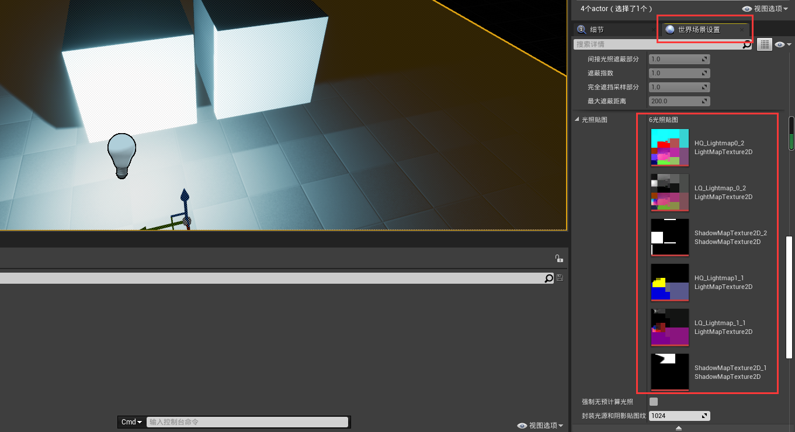
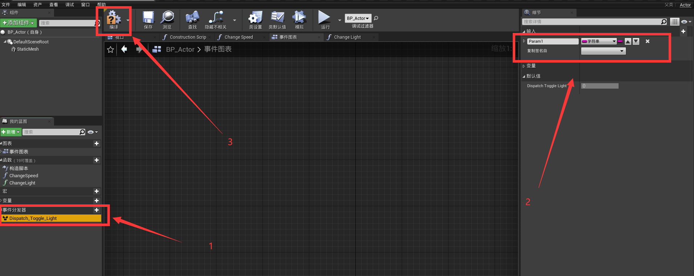

<!--
 * @Author: lc
 * @Date: 2021-09-03 21:41:18
 * @LastEditTime: 2021-09-13 15:45:47
 * @LastEditors: Please set LastEditors
 * @Description: 虚幻学习
 * @FilePath: D:\Projects\markdown\虚幻.md
-->
****
# 编辑器

虚幻提供许多编辑器

1. 关卡编辑器
2. 材质编辑器
3. 蓝图编辑器
4. 行为树编辑器
5. Persona编辑器
6. 粒子编辑器（程序一般不管，美术会用）
7. UMG编辑器
8. Matinee编辑器（影视编辑器 一般做CG）
9. SoudCue编辑器
10. Paper2D编辑器
11. Paper2D Flipbook 编辑器
12. Physics Asset工具编辑器
13. 静态网格编辑器
14. 媒体播放编辑器

- 蓝图与C++
  - 可视化蓝图脚本是对游戏实时逻辑和序列型的事件的理想制作手段。这个系统对策划、美术以及面向可视化编程的程序员是非常好的，它能够可视化的管理游戏内的物体，并且容易访问
  - C++编程可以为更大体谅的任务工作，比如构建一个游戏体系，制作复杂的AI行为，或者新增引擎功能
  - 大部分项目建议使用蓝图和C++进行混编。由C++构建逻辑框架，产品原型，由蓝图进行编辑扩展，提供给美术或者策划使用更加便捷

- 虚幻支持的文件内容

| 分类 | 类型 |
| --- | --- |
| 3D | fbx/obj |
| 贴图 | png/jpge/bmp/tga/dds/exr/psd/hdr |
| 声音 | wav |
| 字体 | ttf/otf |
| 视频 | mov/mp4/wmv/avi |

> 常规使用的文件格式一般都支持

> 显示UE的资产

> UE推荐的文件分类文件夹命名

> 设置文件夹颜色，帮助分类

## 光照

- 光源
  - 定向光源：无位置信息，有照射方向信息。所有的阴影照射均是平行效果。一般用来模拟阳光
  - 点光源：如同真实世界中的灯泡，发光模式向各个方向均匀放光。随着距离出现衰减。一般可用来制作无照射方向的光源。例如：灯泡、烛光、篝火、炮弹爆炸光等
  - 聚光源：以锥形空间为照射模型，朝着锥桶方向进行均匀照射，随着距离进行衰减。用作：手电筒、探照灯、汽车灯光等带有光束特殊点灯光
  - 矩形光源：从一个定好宽度和高度的矩形平面向场景发出光线。可以用来模拟有用矩形面积的任意类型光源。例如：电视机、显示器、吊顶灯具或壁灯
  - 天空光照：获取场景中一定距离以外的部分将他们作为光照应用于场景中。例如：远处的大气、云、群杀、天空光需要重建光照信息，才会进行捕捉计算

- 光源的移动特性
  - 可移动光源：产生完全动态的光源和阴影，消耗较大！运行时光源的大部分信息均可被修改（不会产生间接光照）
  - 静态光源：指在运行时态不可以做任何改变或移动光源。静态光源效果只应用于光照贴图计算（预光照计算，即烘焙），只影响静态物体。静态光源消耗最低。一般应用于移动平添，用途非常有限（不与动态物体产生交互，所以不产生阴影）
  - 固定光源：固定位置不变的光源，但是光源其他信息可以被变更（颜色、亮度等）。固定光源会产生阴影

- 光照模式
  - 直接光照：光源本身发射，直接照射到物体表面，体现的光照结果
  - 间接光照：光源照射到物体表面，通过反射关系产生的光照则为间接光照

> 间接光照是真实世界的光照重要组成部分

- 构建光照（烘焙）
  - 构建光照，在场景运行前期将场景中的光照关系进行提前计算，以防止在运行时态再计算光照关系，从而提升运行时的效率。构建光照的目的时**计算间接光照关系，产生间接光照缓存**
  - 优点：在运行时获得更加真实的光照关系，免去了运行时计算光照的开销。虚幻中静态光和固定光都需要构建光照

> **构建光照可以获得间接光照缓存（光的颜色贴图）**，这样运行时直接使用该贴图即可

- 间接光照缓存
  - 全局光照可以生成静态物体上的间接光照信息，但是场景中的动态对象，也需要一种接受间接光照的方法，这种方法就是**间接光照缓存**
  - Unity中叫**光照探头**

当你对场景进行构建的时候，会进行光照收集（光量子收集），收集这片区域每个点上的光亮强度，记录光的颜色。当移动物体在区域内移动的时候会把颜色贴到物体表面上从而产生照亮效果。

当物体在场景中移动的时候，其实就是在光照贴图中找对应区域的颜色，然后把颜色贴到物体表面上去（给人感觉像是照亮罢了）

****
- 重要光照体积（Lightmass Importance Volume，简称LIV）
  - 可以将光照信息进行精密化计算
  - 人物在场景中可以运行到的或者移动的地方是有限的，所以只需要关心人物可以到达的地方有高质量的光照，其他区域不要进行精密光照计算
  - LIV可以帮助我们调整发射光量子范围，允许我们集中在需要详细间接光照的区域进行收集，而在重要体积外的地方我们获取低质量的间接光照即可

- 固定光源的光照缓存与灯光在一起，当光源删除时光照缓存删除
- 静态光源不在运行时态产生光照信息，所以删除灯光后光照缓存依旧会存在

## 蓝图基础

### 简介

蓝图时虚幻4中的一个可视化编程语言。具备传统编程语言的特点，同时具备简单、易用、易理解的特性

- 种类
  - 关卡蓝图
  - 对象蓝图
  - 动画蓝图
  - 组件蓝图
  - UMG蓝图
  - GameMode蓝图（属于Actor对象蓝图，用于逻辑）
  - GameState蓝图（属于Actor对象蓝图，用于状态）
  - PlayerController蓝图（属于Actor对象蓝图，玩家控制）
  - …

- Actor(演员)
  - 是一个基本类型的对象
  - 虚幻中将场景的所有对象体均定义为是一个Actor，他是虚幻引擎的重要组成概念
  - 虚幻中规定，能存在于场景中的物体需要从Actor进行扩展衍生
  - 可以将Actor直接放到场景中，也可以在世界中生成Actor
  - 虚幻中常见的Actor：摄像机、触发器、各种体积、静态网格、骨骼网格、Player Start

> 在目标文件夹（一般是新建名为BluePrints的文件夹）中右键，新建蓝图即可  
> 在编辑器视口中，按住鼠标右键拖动  
> 在编辑器是口中，按住鼠标左键拖动可拖出节点或执行线  
> 按住alt键再点击连接线，可删除连接线  
> 安卓ctrl键再点击连接线，可重新选择目标节点  

### 蓝图事件

- 图中对应节点名称
  1. **蓝图节点**（逻辑节点、函数节点）
  2. 节点右边叫**逻辑输出阵脚**，左边叫**逻辑输入针脚**
  3. **逻辑执行线**或**执行线**
  4. **输出参数针脚**

读取蓝图的时候，从白色执行线的起点开始，顺着执行线一个蓝图节点一个蓝图节点的读取即可

> 事件类型

创建的蓝图对象直接拖入到场景中并不会被渲染出来，需要添加网格组件才可以被被渲染出来

- 网格
  - 静态网格
  - 骨骼网格
  - ……

1. 点击添加组件，在搜索框中输入 静态网格/static mesh
2. 即为我们添加的静态网格组件
3. 设置静态网格组件的材质

> 关闭每帧执行的tick
> Begin Play（事件开始运行的执行 **先于** Tick每帧调用）

想创建一个朝固定方向移动的球体

1. 创建蓝图
2. 添加static mesh，设置static mesh贴图
3. 在事件图表中添加`AddActorWorldOffest`节点，设置参数
4. 将每帧执行的Tick连线到添加的节点上
5. 将蓝图实例化（拖动）到场景中
6. 运行场景

### 蓝图日志

日志可以提供运行时态的程序信息，并进行输出
通过查看日志来查看对象状态，以反馈数据内容

> 比如查看玩家具体速度数值、根据数值异常查找bug、判断逻辑是否执行等

- In String：日志文本内容
- Print to screen：是否输出到屏幕
- Print to Log：是否输出到控制台（是否输出到日志文件）
- Text Color：屏幕输出颜色
- Duration：屏幕持续时间

> 打开日志窗口  
> 在日志窗口中，可以右键清除日志

### 蓝图注释

1. 框选中你要注释的一个或多个蓝图节点
2. 单击键盘字母**C**键
3. 设置注释内容

> 选中注释，点击键盘**del**即可删除

1. 鼠标悬停在单个目标蓝图节点上的标题上
2. 单击白色省略号按钮
3. 设置文本即可完成单个节点的注释

### Construction Scrip

功能类似构造函数
只要蓝图对象被构建、调用，则该函数就会执行

当你在编辑器窗口拖动时，虚幻会认为你要重新构建该物体，所以物体的构造函数会被执行

> 通过图片上的设置，可以关闭拖动时重新构建调用构造函数

一般将调整信息逻辑放入到Construction图表中，只要在场景中物体被移动，Construction就会执行，物体会自己重新设置自己

在编辑器模式中拖拽蓝图对象会调用Construction，但是在真正的独立发布软件上使用代码控制对象不会执行Construction，也即发布后的软件上只在最开始的时候调用一次Construction

### 添加变量

1. 添加变量
2. 设置变量名
3. 设置变量名
4. 设置变量类型
5. 设置变量的默认值（需要点击工具栏左边的编译之后才可以进行设置）

- 命名规则：有规则可以增加代码的可读性
  - 帕斯卡命名法：单字之间不以空格、下划线连接欸，第一个单字首字母大写，后续单字首字母也大写（UE内部使用的就是帕斯卡命名法）
  - 大驼峰命名法 = 帕斯卡命名法
  - 小驼峰命名法

选中目标变量，将其拖入到蓝图的视口中，可以选择使用get/set方法

### 基本运算

直接在视口中敲击 +、-、*、/、%即可进行对应运算

基本数据类型中，字节型、整型、浮点型均支持常规数学运算，即加减乘除

执行顺序是*事件开始*->*设置Age的值*->*Print1*->*Print2*

Age的初始值为5

当执行到*设置Age的值*时，根据针脚指针往回推导，开始计算，最后设置Age的值为40

当执行到*Print1*时，直接获得setAge的值为40

当执行到*Print2*时，根据针脚指针往回推导，开始计算，最后获得输出值为215

> Print2时，Age的值已经被改变了 所以Print1和Print2的输出并不相同

> 整型数据的自增自减

### 流程控制

> 常见流程控制

> 判断是否成年

# 蓝图

## 流程控制

- **序列 Sequence**

允许逻辑执行先进行分割，但不是并行关系，而是次序关系，最上层位于运行上端，以此类推
序列支持多个次序执行线并存，通过增加引脚来增加次序执行线
序列中的逻辑执行针脚是按照次序一次执行
**目的是来帮助开发者将逻辑进行划分，可以将逻辑分成几块，而不必非要串联到一条逻辑线上，达到清晰逻辑结构的目的**

----

- **Do N & Do once**

1. Do Once只可以进行一次执行权通过
  - 通过调用Reset可以重置通过限制
  - 设置节点开始是关闭的，无法使用，必须通过调用Reset针脚激活节点
2. Do N可以根据给定的输入参数N来决定执行权通过次数
  - 输入参数针脚Connter将当前次数进行返回
  - 如果想要重置节点，需要调用Reset针脚进行重置

Do节点用来控制当前执行逻辑线进行连接后，视口可以通过输出逻辑针脚将逻辑执行权向下进行传递，**主要用来控制执行权通过次数**

> Do N可以用来制作开枪，比如枪管只有20发子弹，只能发射20发；有的武器只能发射一次，则使用Do once

> `Do Once`节点中的 `Start Closed`表示初始是否是非激活状态，勾中表示一开始`Do Once`节点就是失效的不会执行后续操作

1. 点击数字键盘1，开始执行`Do Once`，最开始是激活状态，所以会输出字符串`1`
2. 再次点击数字见1，因为`Do Once`之前已经执行过一次了，所以不会执行后续操作
3. 点击数字2，Reset`Do Once`节点，使之重新进入激活状态
4. 点击数字3，开始执行`Do N`，设置`Do N`节点的N为5，所以点击五次3，才会使`Do N`节点失效
5. 点击数字4，Reset`Do N`节点的次数

----

- **Do Once MultiInput**

与`DoOnce`节点基本相同，但是可以通过添加新的引脚，增加独赢的输入逻辑，只要任意逻辑输入针脚有调用，则整个节点被关闭  
通过调用重置输入针脚重置整个控制节点

> 这里A、B、C中任意一个被执行了，另外两个都不会再次执行，除非重置整个`Do Once MultiInput`节点

---

- **FlipFlop 反复循环**

节点取入执行输出并在两个执行输出间切换  
节点同时有bool变量输出，可以用来判断A何时被调用（执行A返回true）  

例如：第一次被调用执行了A，则第二次被调用执行B，然后再是A，然后再是B  

> 实际运用：开关灯

----

- **ForLoop**

按照从`First Index`开始，到`Last Index`结束，调用逻辑输出引脚`Loop Body`，调用次数为`First Index`到`Last Index`差值  
`Index`输出参数引脚将输出从开始到结束的所有整数，当整个节点执行完毕后，调用逻辑输出引脚`Completed`

> 常用于叠加计算，或多次执行某个动作
> 等价C++代码中的`for`关键则

> 输出5 6 7 8 9 10 Complete

----

- **ForLoopWIthBreak 循环中断**

与`ForLoop`相同，用于将单词执行逻辑进行循环  
但添加了`Break`输出引脚，如果被打断则直接停止循环，跳到输出逻辑引脚`Completed`

> 使用for循环计算1~100的和，当和超过1000的时候停止计算  
> 当和超过1000时，分支语句`Branch`为True的针脚向后执行，`Break`掉`ForLoopWIthBreak`，随后直接输出计算和1035  

----

- **Gate 门**

用来控制开启和关闭的执行逻辑

Enter输入逻辑进入  
Open引脚被调用后，Enter引脚流入的执行逻辑才会从Exit引脚流出  
Close引脚被调用后，Enter引脚流入的执行逻辑将被阻挠，无法流出  
Toggle从开和关之间进行往返  
Start Close设置节点开始状态，勾选后开始状态为关闭

> 最开始`Start Closed`为选中状态，所以`Gate`处于关闭状态，点0无反应  
> 点按钮键盘1之后，`Gate`打开，再点击0执行输出`Toggle`  
> 点按钮键盘2之后，`Gate`关闭，再点击0，无输出  
> 点按钮键盘3之后，`Gate`如果原本关闭则变为打开，如果原本是打开则变为关闭，再点击0，根据状态判断是否输出  

----

- **MultiGate**

输入逻辑节点将按照顺序或随机方式从右侧输出引脚进行输出执行逻辑

Reset 重置整个节点，使之回复到起始状态  
Is Random 勾选引脚，按照随机的方式从右侧输出引脚选择输出执行逻辑  
Loop  勾选引脚，按照循环方式从右侧输出引脚输出执行逻辑  
Start Index 设置第一调节用节点从右侧那个引脚进行输出

> 只要不勾选`Loop`，则每次执行`MultiGate`会把逻辑引脚依次全部进行**一次**输出(不会重复输出)  

> 如果`Is Random`和`Loop`都没勾选，则多次点击键盘按钮会输出一次`Out 0`，一次`Out 1`，然后`MultiGate`关闭  
> 如果只勾选了`Is Random`，则多次点击键盘按钮1会随机输出一次`Out 0`或`Out 1`  
> 如果只勾选了`Loop`，则多次点击键盘按钮1会循环输出`Out 0`，`Out 1`  

----

- **WhileLoop**

只要特定值`Condition`为true，则`whileloop`节点将会输出一个结果。在循环的每个迭代中，他会查看器输入bool值的当前状态，一旦为false，则停止循环

> 等价C++的while

> SumValue初始值为0，每次都SumValue = （SumValue + 1） * 2，当SumValue小于100的时候执行循环体，大于100就跳出循环，最后输出SumValue的值为126

----

- **Switch 切换**

当逻辑输入针脚被调用时，将会按照给定的值`Selection`进行右侧选择引脚输出

> 功能等价于C++的switch  

> 如果值为1，打印执行值为0对应的第一个Print  
> 如果值为2，打印执行值为1对应的第二个Print  
> 如果值为3，打印执行值为2对应的第三个Print  
> 如果不为1、2、3，打印执行Default对应的Print  

----

- **Delay 延时操作**

Delay节点，延时操作  
当延时任务未完成时，再次调用节点，**忽略调用**  
尽量不要将Delay节点让如Tick中  
Delay只能在事件表中使用  

`Duration`延时动作持续时间  

`Retriggerable Delayer`与上面的`Delay`的节点一致，只是如果延时任务没有完成，再次调用节点，则延迟动作**重新计时**

> 不停按键盘按钮4和键盘按钮5可体会`Delay`和`Retriggerable Delayer`的差别

----

## 面向对象

面向对象的特性为封装、多态、继承

我们创建编写的蓝图，称之为蓝图资产或蓝图模板  
模板是用来产生真实对象的，同时模板也是一种数据类型，一种**复合数据类型**，主要是用来描述对象的结构和行为，这也被称为抽象

### 属性

- **成员属性**

蓝图变量框添加的变量，称之为成员变量  
成员变量是抽象为对项目模板而添加的，只能通过蓝图的实例化对象才能有效访问该成员变量  

成员变量描述了抽象的对象的属性信息  

- **小提示**

在制作触发器的时候，Box Collistion是不容易看见的，这个时候给触发器一个Billboard组件，该组件仅提供一个显示作用，方便查找

1. Box Collision 作为根组件时，其可见性很差
2. 添加的Billboard组件
3. 设置Billboard组件的Sprite设置，修改其贴图为S_Trigger

- **蓝图中成员属性设置**

> 这里场景编辑器就是前面说的关卡编辑器，写急了

### 函数

- **成员函数**

函数：一段在一起的，可以做某一件事的程序，也称作方法。函数是面向对象中将逻辑进行封装的重要表现  
编写函数的目的：将逻辑**单一化、清晰化、明确化、复用化**，加强整个结构的可阅读性  
编写函数可以提高工作效率，函数本身可以用来处理数据也可以辅助获得数据  

将属性和函数编写在模板中，体现的就是封装  

- **函数**

> 函数中不可调用`Delay`，因为函数执行是一瞬间的，执行完就没了

> 蓝图中函数允许多个返回值  
> 如果执行线最后没有连接到返回节点中，也不会报错，会返回对应数据类型的默认值  

> **编辑器调用**功能一般用于测试功能  
> 函数细节有个扩展按钮，点击后里面有个**常量**框，类似C++的`const void funcion() const`，表示函数中对对象属性的值不会有更改  

- **局部变量**

只在函数中有用的临时变量  

### 事件

Event事件只能在事件图表中进行构建，无法在函数、宏内进行构建  
事件如函数一样可以在外部被调用，支持输入参数列表编写（函数中可以调用事件）  

> 添加自定义事件  
> 与`Event Begin Play`节点很像  
> 事件没有输入引脚  

- 函数与事件的不同
  - 函数内部无法使用Delay节点，事件可以
  - 函数可以有返回值，事件无返回值
  - 函数具备局部变量，事件不具备
  - 事件可以被标记为网络同步，函数无法被标记网络同步
  - 事件可以被绑定到事件调度器，函数不行

> 类似C#的Event，红色节点`ChangeSpeedEvent`表示事件触发后蓝图对象所执行的操作  
> 蓝灰色节点`ChangeSpeedEvent`表示广播事件触发  

### 宏

- 本质不是程序单元，与函数不同（函数会被编译为执行单元）
- 宏本身进行的是节点替换，过量使用宏会导致程序的节点量膨胀

- 宏的优点：
  - 支持多逻辑针脚输入，并支持多逻辑针脚输出（宏不会被变为逻辑单元）
  - 与函数一样支持参数列表输入、输出，但是宏支持通配符传入传出，使得类型传递更加灵活

### 生成Actor 实例化对象

1. 蓝图对象直接拖入到关卡编辑器中就算是实例化了  
2. 通过调用生成节点SpawnActor进行动态生成（具有灵活性）

> 所有的对象类型变量使用前均需要通过`IsValid`节点进行安全检查，增加程序的稳定性  
> `IsValid`节点接受一个对象型(Object)数据  

## 事件调度器

事件调度器是蓝图中按照观察者模式（订阅）而添加的。观察者模式是较常使用的的一种设计模式，它具有高效低耦合特性  
在整个设计链上，采用有动态状态改变时主动发出通知，从而达到订阅特性  

观察者模式应当构建对象，应该将对象想象为观察者和被观察者  

观察者是希望接受被观察者的响应，所以响应逻辑（动作）一般写在观察者身上  
事件应该在下希望接收通知的对象身上，调度器写到发出通知的人的身上  

> 比如：A想知道B的工作是否完成，如果每帧都去询问无疑会增加许多无效计算浪费性能  
> 这个时候使用观察者模式，B是被观察者，A是观察者。B工作完成之后发送事件，A接收到事件做出对应逻辑（动作）  

1. 创建事件调度器/分发器
2. 设置事件参数（有的时候想通知事件的时候带一些额外信息，这些额外信息就是参数）
3. 编译

> 创建事件调度器

> 注册监听

> 解除绑定

> 解除绑定的具体做法

## 查找Actor

1. 类的方式查找

Of Class通过给定的ui想模板将场景中与之匹配的对象进行查找，并返回查找到的所有对象  

2. 给定的接口式查找

With Interface 通过给给定的接口将场景中与之匹配的对象进行查找，并返回查找的所有对象  

3. 标签查找  

With Tag 通过给定的标签将场景中与之匹配的对象进行查找，并返回查找到的所有对象  

## 复杂数据类型

### 结构体

蓝图中的结构体只有属性，没有函数  

> 创建结构体
 

> 设置结构体参数

> 使用数据结构  
> 使用 `make 结构体名称`可创建结构体对象   

### 枚举

某些有穷序列集的所有成员，例如：性别（男女）、月份（1，2，3，4……）、星期（1，2，3……）、学历等  

> 创建枚举

> 设置枚举

> 枚举配合Switch使用，做分支判断处理

### 数据容器

- 容器
  - Array容器（数组）
  - Map容器（键值对映射）
  - Set容器（集）

> 创建数组、map、set  
> 这里需要先定义属性的数据类型，再设置其属于array、map或set  

> 数组的循环遍历

> 获得数组中index序号位置的值  
> `Get`方法有两种获得值的方式：复制、引用  
>> 复制：完全隔离，获得到的数据与原数据没有关联  
>> 引用：实际上获得的就是数组中的对象，对获得的对象进行操作会改变原数组的对象  

> `Add`方法分为两种：`Add Unique`和普通的纯`Add`  
>> `Add Unique`：添加的值数组中存在，则不添加  
>> `Add`：不管容器中是否存在，都添加到数组末尾  

> 查看数组的API方法的小提示

| 方法名 | 作用 |
| --- | --- |
| Add | 添加单个数据到数组末尾 |
| Add Unique | 如果数组中没有与数据相同的值，则加入到数组中，否则不加入 |
| Append Array | 将另一个数组添加到数组中（不考虑重复性） |
| Clear | 清空数组并清除内存空间 |
| Contains | 检查数组中是否存在给定值 |
| Find | 查找数组中是否包含某一个元素，包含返回对应位置索引index，不包含返回-1 |
| Insert | 插入值到数组中（指定位置） |
| Last Index | 获得最后元素的值 |
| Length | 获得数组长度，常用来判断获取index是否合法 |
| Remove Index | 提供一个有效下标index，删除该index |
| Remove Item | 提供一个数组中包含的数据，删除该值 |
| Resize | 设定数组长度，超过填充默认值，小于删除多余值 |
| Shuffle | 随机数组中的值(洗牌) |
| Swap | 将数组中已有的两个位置的值进行交换 |

**使用`Make Array`可以在运行过程中动态创建数组**  
