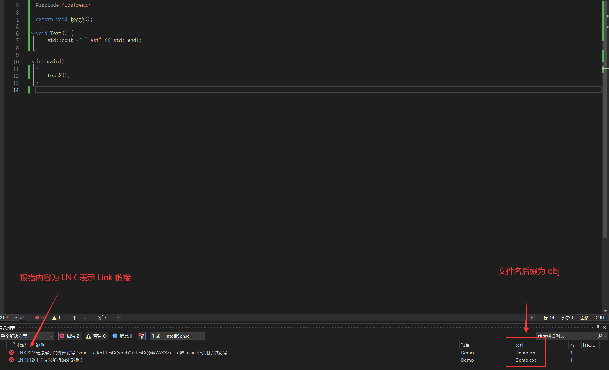
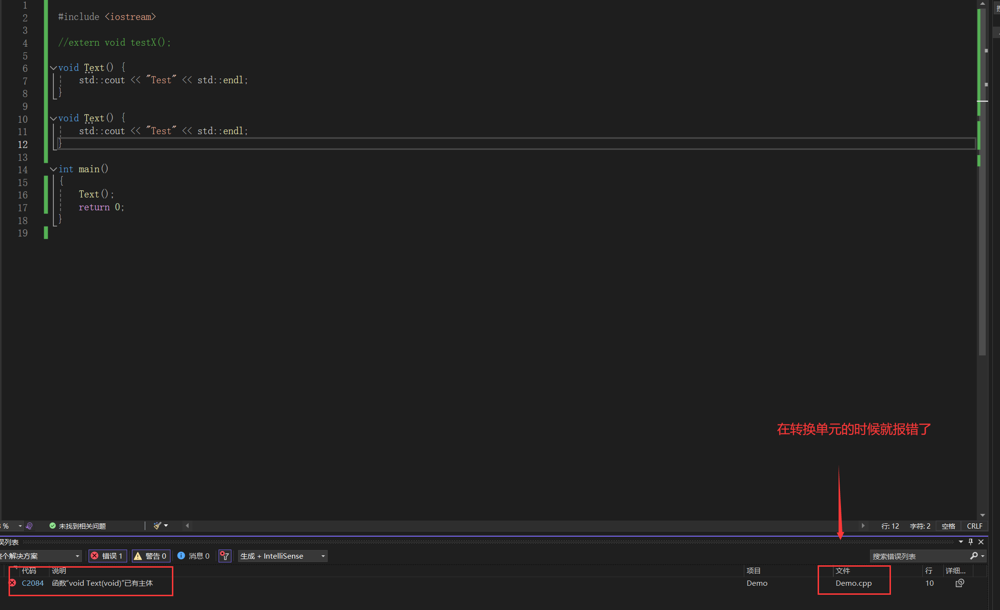
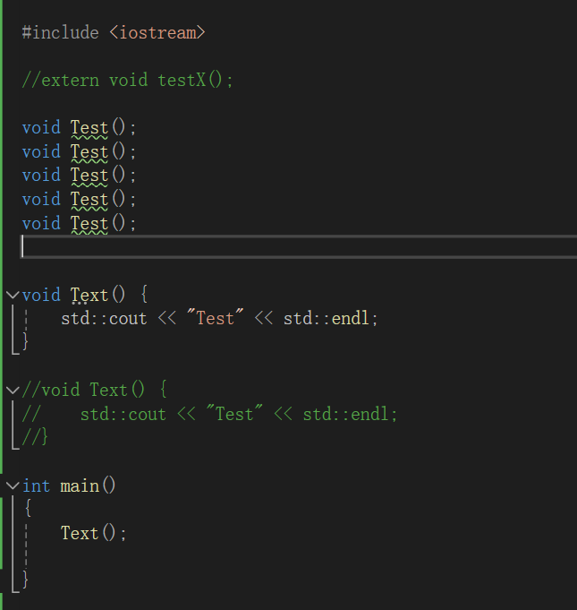

# 编译器

## 转换单元

写好的每一个源文件(.cpp .c) 将其包含的头文件 (`#incluide <xxx.h>`) 合并后，称为一个**转换单元**

编译器单独的将每一个**转化单元**生成为对应的**对象文件**(.obj)，对象文件包含了转换单元的**机器码**和转换单元的**引用信息**(不在转换单元中定义的对象)

最后链接器将各个转换单元的对象文件链接起来，生成**目标程序**

> 比如在对象文件 A 中包含了定义在其他转换单元的引用，那么就去其他转化单元的对象文件中寻找，这个引用的定义来建立链接，如果在在所有的对象文件中都找不到这个定义，那么就会生成一个链接错误




如上图所示，在尝试使用 `testX()` 函数时，由于无法找到对应函数而爆出链接错误，并且报错的文件也是 `obj` 后缀结尾的文件



相对而言，上图所示的错误则是在解析**转化单元**就报错了，所以文件后缀为 `cpp`

## 未定义行为

在编写代码中 C++ 标准未作规定的行为，称为未定义行为，未定义行为的结果是不确定的，具体在不同的编译器下会有不同的效果，比如

```cpp
c = 2 * a ++ + ++a * 6;
```

这里先算 a++ 还是先算 ++a 就是一个未定义行为


```cpp
int x = -25602;
x = x >> 2;
```

x 的结果在不同的编译器下是不确定的，所以这也属于未定义行为。通常情况下，对于负数的右移操作，大多数编译器会执行算术右移（arithmetic right shift），在这种情况下，符号位会被复制到右移后空出的位置，以保持数值的符号不变。但是，这并不是由 C++ 语言标准强制规定的，所以理论上编译器可以选择不同的实现方式

所以一般对数据进行位运算都是使用**无符号**

## One Definitaion Rule

ODR 是一系列规则，而不是一个规则，程序中定义的每个对象都对应着自己的规则

但是基本上来讲任何的变量、函数、类、枚举、模板、在每个转换单元中都只允许有一个定义；非 inline 的函数或变量，在整个程序中有且仅有一个**定义**



如上图，对 `Test` 重复声明多次并不会报错，因为只定义了一次   

即使非 inline 的函数或变量定义在不同的文件中，在**链接阶段**仍然会报错

> 被 `const` 或者 `static` 定义的函数或者属性只会在当前转换单元内生效，所以可以定义相同的名称

```cpp
inline int a = 10; // 内联变量 C++ 17 之后支持该写法
```

## 名称的链接属性

程序中的变量、凹函数、结构等都有着自己的名字，这些名字具有不同的链接属性，链接器就是根据这些链接属性来把各个对象链接起来的

链接属性分为以下三种

1. 内部链接属性：该名称仅仅在本转化单元中有效
2. 外部链接属性：该名称在其他的转换单元中也有效
3. 无链接属性：该名称仅仅能够在用于该名称的作用域内访问

```cpp
#include <iostream>

static int x = 10;

extern int a = 1;

inline int ii = 10;

int pp = 20;

int main() {
    int a = 0;
    return 0;
}
```

对于上面的代码

- `static int x` 定义在全局区，由于 `static`，属于内部链接属性
- `extern static int a` 定义在全局区， 由于 `extern`，属于外部链接属性
- `int pp = 20` 定义在全局区，属于外部链接属性
- `inline int ii = 10` 定义在全局区，属于外部链接属性
- `int a = 0` 属于无链接属性

对于内联属性的作用，在两个文件中分别定义同名的内联属性，并不会报错，但是两个属性只有一个有效，无效的属性的值会被有效的属性的值覆盖掉

```cpp
// T.cpp
#include <iostream>

inline int ii = 40;

void PPInline_t() {
	std::cout << ii << std::endl;
}


// Demo.cpp
#include <iostream>

void PPInline_t();

inline int ii = 20;

void PPInline() {
    std::cout << ii << std::endl;
}


int main()
{

    PPInline_t();   // 输出 20
    PPInline();     // 输出 20
    return 0;
}
```

通过上述代码，可以知道 Demo.cpp 中定义 ii 把 T.cpp 中定义的 ii 覆盖掉了。当一个变量被声明为 `inline` 时，即使它在多个源文件中包含，链接器也会将它们视为同一个对象。虽然 inline 变量提供了一种方便的方式来避免多重定义的问题，但在实践中使用时，最好确保 inline 变量在整个程序中只有一个定义点，以避免潜在的不确定性。


